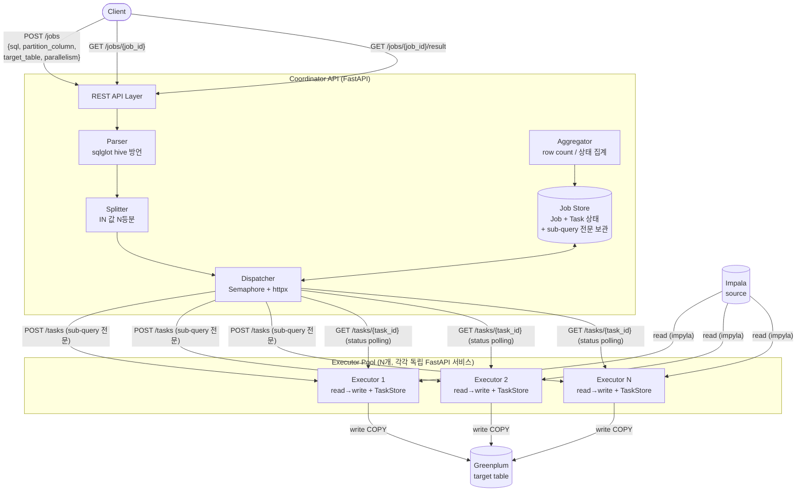
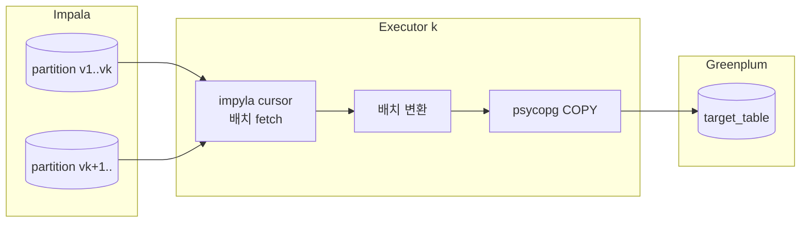
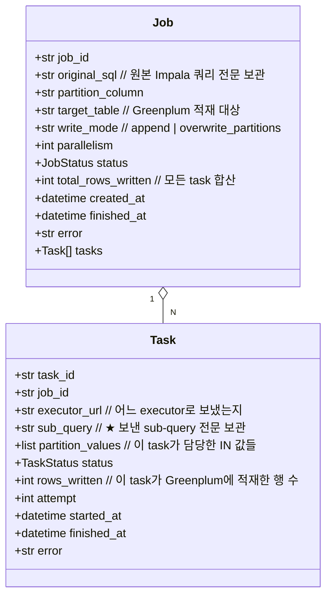
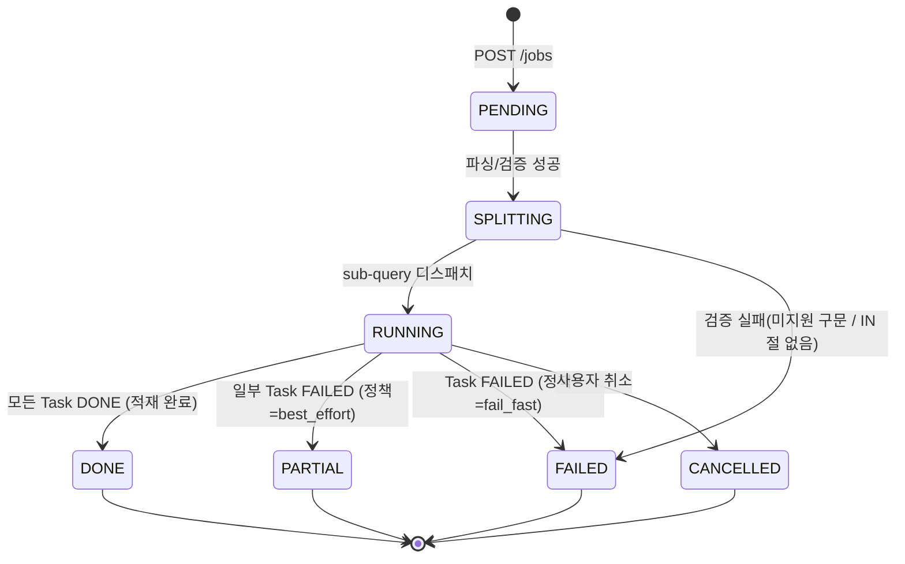
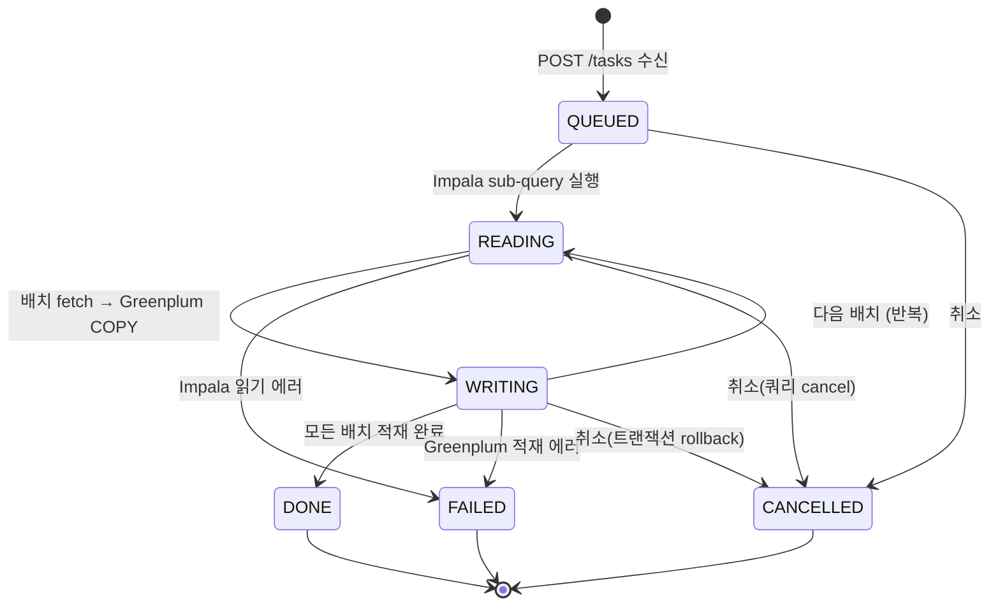
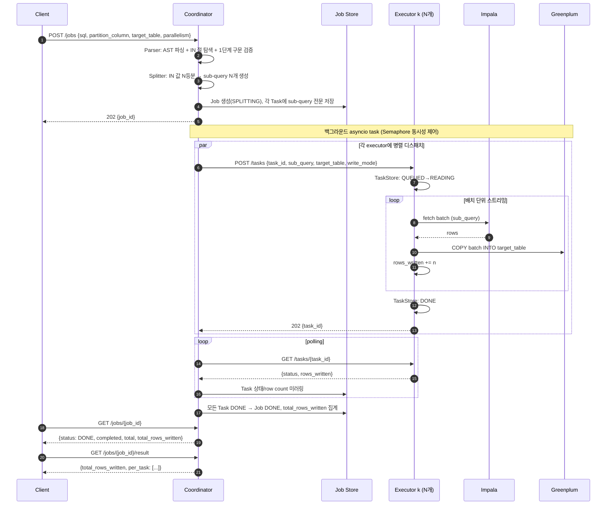
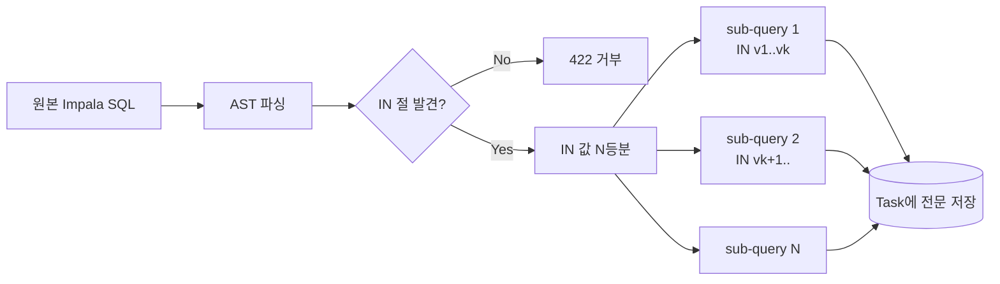
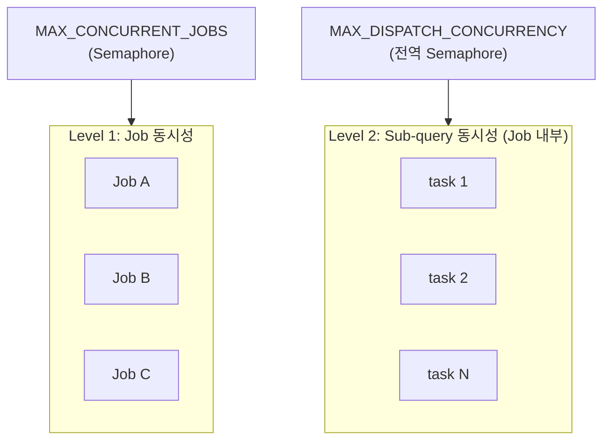

# Distributed Query Executor — 설계 문서

> Coordinator + N Executor 구조로 하나의 **Impala `SELECT` 쿼리**를
> 파티션 컬럼의 `IN` 조건 기준으로 N분할하여 병렬로 읽고,
> 그 결과를 **Greenplum 테이블에 적재(INSERT)** 하는 데이터 이관 API.

---

## 1. 개요 (Overview)

- **목적**: 하나의 큰 Impala `SELECT`를 여러 executor로 나누어 병렬로 읽고, 각 executor가 자신이 읽은 데이터를 Greenplum에 적재한다. (**Impala → Greenplum 이관**)
- **분할 기준**: `WHERE <partition_column> IN (v1, v2, ...)` 의 IN 값 리스트를 N등분.
- **소스(read) 방언**: **Impala** → 파서는 `sqlglot`의 `hive` 방언 사용(Impala SQL은 Hive와 사실상 호환; 전용 impala 방언 미지원 시 hive가 최근접).
- **타깃(write)**: **Greenplum** (PostgreSQL 기반) → psycopg `COPY`로 대량 적재.
- **지원 범위 (1단계)**: 집계/GROUP BY/JOIN/DISTINCT 없는 **단순 SELECT** (+ `ORDER BY`, `LIMIT`).
- **응답 모델**: Job 기반 **비동기** API (job_id 발급 후 polling).
- **동시성**: 여러 요청(Job)을 동시에 처리. Job 내부에서도 sub-query를 동시 실행.

### 핵심 특징
1. **결과 병합 불필요**: 각 executor가 서로 다른 파티션 값 집합을 담당해 Greenplum에 **독립적으로 적재**한다. 행이 겹치지 않으므로 merge가 없다. Job의 "결과"는 적재된 **row count 집계 + 상태**다.
2. **양방향 상태 추적**: Coordinator와 Executor **모두** 자신의 작업이 진행 중인지/완료인지 안다.
3. **쿼리문 보관**: Coordinator는 각 executor에게 보낸 **sub-query 전문(全文)** 을 Job 안에 모두 기억한다. (재시도·감사·디버깅)

---

## 2. 전체 아키텍처



### 설계상의 중요한 결정
- **Executor는 read+write를 모두 수행하는 상태 보유 독립 서비스**다. Impala에서 sub-query로 읽어 Greenplum에 적재하고, 자체 `TaskStore`로 상태를 관리하며 REST API(`/tasks`)로 노출한다.
- **결과 데이터는 coordinator를 거치지 않는다.** executor가 Impala→Greenplum로 직접 흘려보낸다(대량 데이터가 coordinator로 모이지 않음 → 메모리/네트워크 병목 회피). Coordinator로는 **상태와 row count만** 흐른다.
- **Coordinator는 분할한 sub-query 전문을 Task 레코드에 저장**한다.

---

## 3. 컴포넌트

### 3.1 Coordinator
| 컴포넌트 | 책임 |
|---|---|
| **API Layer** | `POST /jobs`, `GET /jobs/{id}`, `GET /jobs/{id}/result` |
| **Parser** | sqlglot(hive)로 Impala SQL 파싱, partition column의 `IN(...)` 노드 탐색, 1단계 미지원 구문 거부 |
| **Splitter** | IN 값 리스트를 `parallelism`개로 분할 → sub-query N개 재작성 |
| **Dispatcher** | sub-query를 executor에 분배, 동시성(Semaphore) 제어, executor 상태 polling, 실패 재시도 |
| **Aggregator** | 각 task의 적재 row count·상태를 모아 Job 단위 요약 산출 (**병합 아님, 집계**) |
| **Job Store** | Job·Task 상태 머신 보관, **sub-query 전문 저장** (1단계 in-memory, 추후 Redis) |

### 3.2 Executor (N개, 각각 독립 프로세스/서비스)
| 컴포넌트 | 책임 |
|---|---|
| **Task API** | `POST /tasks`(sub-query 수신·실행 시작), `GET /tasks/{id}`(상태), `GET /tasks/{id}/result`(적재 요약) |
| **Impala Reader** | impyla 커서로 sub-query 실행, 배치 단위 fetch |
| **Greenplum Writer** | psycopg `COPY FROM STDIN`으로 배치를 target table에 적재 |
| **Task Store** | 자신이 받은 task 상태(QUEUED→RUNNING→DONE/FAILED) + 적재 row count 추적 |

---

## 4. 데이터 흐름 (Impala → Executor → Greenplum)



- executor는 sub-query 결과를 **스트리밍(배치 fetch)** 하여 메모리에 전체를 올리지 않는다.
- 적재는 `COPY`로 배치 단위 수행(INSERT 다건보다 훨씬 빠름).
- 각 executor가 **서로 다른 파티션 값 집합**을 담당 → Greenplum 쓰기 충돌 없음 → 병합 불필요.

---

## 5. 데이터 모델

Coordinator가 보관하는 핵심 구조. **원본 쿼리와 각 executor로 보낸 sub-query 전문을 모두 저장**한다.



---

## 6. 상태 머신 (양방향 추적)

### 6.1 Coordinator — Job 상태



### 6.2 Task 상태 (Coordinator 미러 ↔ Executor 원본)

executor는 read 단계와 write 단계를 구분해 더 세밀하게 추적할 수 있다.



- **Executor**: 자체 `TaskStore`에 위 상태 + 누적 `rows_written` 기록, `GET /tasks/{id}`로 노출.
- **Coordinator**: Dispatcher가 polling으로 각 Task 상태/row count를 미러링. Job 상태는 Task 집계로 결정.
- 외부(coordinator)에는 `READING`/`WRITING`을 묶어 `RUNNING`으로 단순화 노출해도 됨.

---

## 7. 요청 처리 시퀀스



---

## 8. 쿼리 분할 (Splitting)

### 입력 예시 (Impala source)
```sql
SELECT user_id, amount, dt
FROM sales
WHERE dt IN ('2026-01-01','2026-01-02', ... ,'2026-06-25')   -- partition_column = dt
  AND region = 'KR'
```

### 절차
1. **파싱**: `sqlglot.parse_one(sql, read="hive")` → AST.
2. **IN 절 탐색**: AST를 walk하여 `Column(name=partition_column)` 의 `In` 노드를 찾는다.
3. **검증(1단계)**: `GROUP BY`/집계함수/`DISTINCT`/`JOIN` 발견 시 422 거부. IN 절 없으면 거부.
4. **값 분할**: IN 값 `[v1..vM]`를 `parallelism`개 청크로 분할 (`contiguous` 기본 / skew 심하면 `round_robin`).
5. **sub-query 재작성**: 각 청크로 IN 노드만 교체해 N개의 완전한 Impala SQL 생성.



---

## 9. Greenplum 적재 (Write)

| 항목 | 내용 |
|---|---|
| 적재 방식 | psycopg `COPY FROM STDIN`, 배치(예: 10k행) 단위 |
| `write_mode=append` | 단순 INSERT(COPY)로 누적 |
| `write_mode=overwrite_partitions` | task별로 담당 `partition_values`에 대해 먼저 `DELETE WHERE <partition_column> IN (chunk)` 후 COPY → **재실행 멱등성** 확보 |
| 트랜잭션 | task 단위 트랜잭션. 실패 시 해당 task만 rollback, 다른 task에 영향 없음 |
| 충돌 | 각 task가 disjoint한 partition 집합만 다룸 → executor 간 쓰기 충돌 없음 |

> 결과 데이터는 coordinator를 통과하지 않으므로 "결과 병합(merge)" 단계가 없다. Coordinator는 `rows_written`만 합산한다.

---

## 10. 동시성 모델



- **Level 1 (Job)**: `MAX_CONCURRENT_JOBS` — 동시 처리 요청 수 상한.
- **Level 2 (Sub-query)**: 전역 Semaphore — 동시에 도는 executor task 총량 상한. Impala 동시 쿼리 한계·Greenplum 동시 COPY 부하의 보호장치.
- **Coordinator I/O**: `httpx.AsyncClient` + `asyncio.gather`로 executor 비동기 호출.
- **Executor 내부**: impyla/psycopg는 동기 → `run_in_executor(thread_pool, ...)`로 감싸 이벤트 루프 비차단. read와 write를 파이프라인(읽는 동안 이전 배치 쓰기)으로 겹쳐 throughput 향상 가능.

---

## 11. API 명세

### 11.1 Coordinator API

```http
POST /jobs
{
  "sql": "SELECT user_id, amount, dt FROM sales WHERE dt IN (...) AND region='KR'",
  "partition_column": "dt",
  "target_table": "public.sales_mirror",
  "write_mode": "overwrite_partitions",     // | "append"
  "parallelism": 4,
  "split_strategy": "contiguous",           // | "round_robin"
  "failure_policy": "fail_fast"             // | "best_effort"
}
→ 202 { "job_id": "a1b2c3" }
```

```http
GET /jobs/{job_id}
→ {
  "job_id": "a1b2c3", "status": "RUNNING",
  "completed": 2, "total": 4, "total_rows_written": 51230,
  "tasks": [
    { "task_id":"t1", "executor_url":"http://exec-1:8001",
      "status":"DONE", "rows_written":25000, "attempt":1 },
    { "task_id":"t2", "executor_url":"http://exec-2:8001",
      "status":"WRITING", "rows_written":26230, "attempt":1 }
  ]
}
```

```http
GET /jobs/{job_id}/result
→ { "total_rows_written": 102400,
    "per_task": [ {"task_id":"t1","rows_written":25000}, ... ] }

GET  /jobs/{job_id}/tasks/{task_id}   # sub-query 전문 포함 상세 (감사/디버깅)
→ { "task_id":"t1", "sub_query":"SELECT ... WHERE dt IN ('2026-01-01',...)", "status":"DONE", ... }

POST /jobs/{job_id}/cancel            # Job 취소 (하위 task에 전파)
```

### 11.2 Executor API

```http
POST /tasks
{ "task_id":"t1", "job_id":"a1b2c3",
  "sub_query":"SELECT ... WHERE dt IN (...)",
  "target_table":"public.sales_mirror", "write_mode":"overwrite_partitions",
  "partition_column":"dt", "partition_values":["2026-01-01", ...] }
→ 202 { "task_id":"t1", "status":"QUEUED" }

GET  /tasks/{task_id}
→ { "task_id":"t1", "status":"READING|WRITING|DONE|FAILED", "rows_written":25000, "error":null }

GET  /tasks/{task_id}/result   → { "rows_written":25000 }
POST /tasks/{task_id}/cancel   # 실행 중 Impala 쿼리 cancel + Greenplum tx rollback
GET  /healthz
```

---

## 12. 상태 추적 요약 (요구사항 1)

| 주체 | 무엇을 아는가 | 어떻게 |
|---|---|---|
| **Executor** | 자기 task가 QUEUED/READING/WRITING/DONE/FAILED 인지 + 누적 `rows_written` | 자체 `TaskStore`, `GET /tasks/{id}` |
| **Coordinator** | 각 task 상태/적재량 + Job 전체(`completed/total`, `total_rows_written`) | Dispatcher polling으로 미러링, Job은 Task 집계 |
| **Client** | Job RUNNING/DONE/FAILED + 진행률·적재량 | `GET /jobs/{job_id}` |

---

## 13. 쿼리문 보관 (요구사항 2)

- Job 생성 시 `Job.original_sql`(원본)과 각 `Task.sub_query`(executor로 보낸 전문)를 함께 영속.
- 효과:
  - **재시도**: task 실패 시 저장된 `sub_query`를 같은/다른 executor로 그대로 재전송. `overwrite_partitions`면 멱등하므로 안전.
  - **감사·디버깅**: "어떤 원본을 누구에게 어떤 sub-query로 보냈는지" 완전 재구성 (`GET /jobs/{id}/tasks/{id}`).
- 저장소: 1단계 in-memory dict → 운영 시 Redis/PostgreSQL.

---

## 14. 실패 처리

| 상황 | 처리 |
|---|---|
| 일부 task 실패 | `failure_policy`: `fail_fast`(Job FAILED) / `best_effort`(Job PARTIAL, 성공 task의 적재는 유지) |
| 재시도 | 저장된 `sub_query`로 task 단위 재시도(`attempt`++). `overwrite_partitions`로 중복 적재 방지 |
| executor 다운 | health check 실패 시 해당 task를 다른 executor로 재배정 |
| 적재 중 실패 | task 트랜잭션 rollback → 부분 적재 잔존 없음. 재시도 시 깨끗하게 재적재 |
| 타임아웃 | sub-query별 + Job 전체 타임아웃 |
| 취소 | Job cancel → 각 executor `POST /tasks/{id}/cancel` → Impala 쿼리 cancel + Greenplum rollback |

---

## 15. 기술 스택

| 영역 | 선택 |
|---|---|
| 언어/프레임워크 | Python 3.11+, **FastAPI** (coordinator·executor 공통) |
| SQL 파싱 | **sqlglot** (`read="hive"` for Impala) |
| Impala 읽기 | **impyla** (HiveServer2 프로토콜) + 배치 fetch |
| Greenplum 쓰기 | **psycopg** `COPY FROM STDIN` + 커넥션 풀 |
| Coordinator↔Executor | **httpx** (AsyncClient) |
| 동시성 | asyncio + Semaphore + thread pool(동기 DB 호출 래핑) |
| 상태 저장 | 1단계 in-memory dict → 운영 시 Redis |
| 배포 | executor N개를 독립 컨테이너, config에 URL 목록 등록 |

---

## 16. 향후 확장 (2단계+)

- 집계/GROUP BY 쿼리 지원 (소스 측 사전 집계 후 적재 또는 적재 후 재집계).
- IN 절 없을 때 Impala `SHOW PARTITIONS`로 파티션 값 조회 후 IN 합성.
- Executor → Coordinator **callback**으로 polling 부하 제거.
- Job/Task 상태 Redis 영속화 → coordinator 다중화·장애 복구.
- read/write 파이프라이닝 및 COPY 병렬도 튜닝으로 throughput 최적화.
- staging 테이블 + atomic swap으로 적재 무중단/원자성 강화.
```