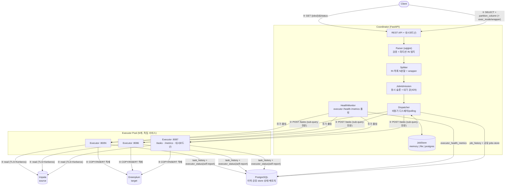
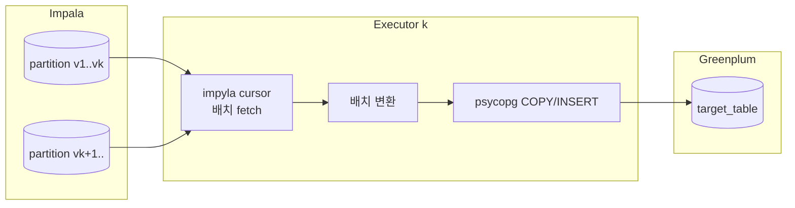
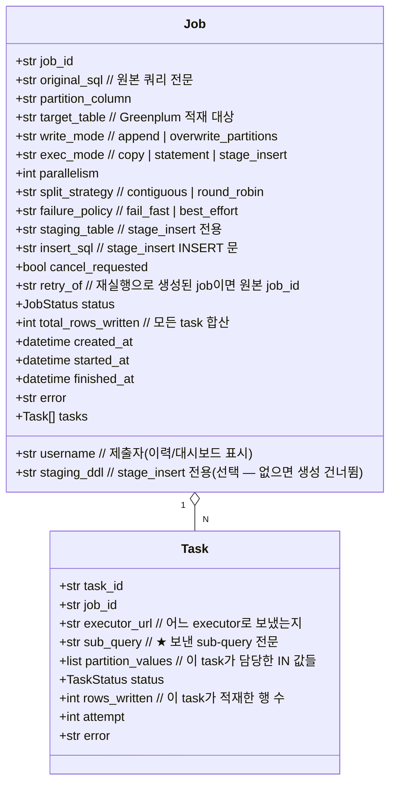
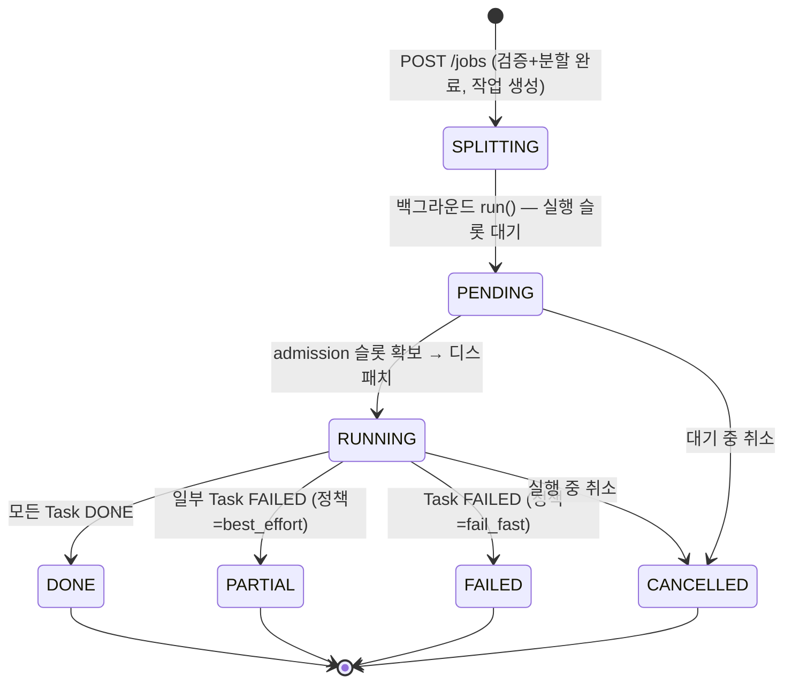
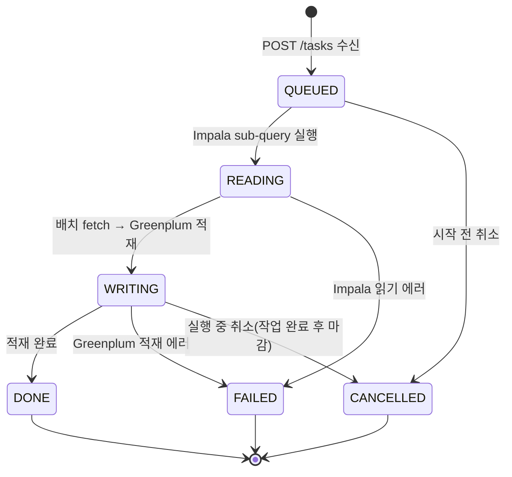
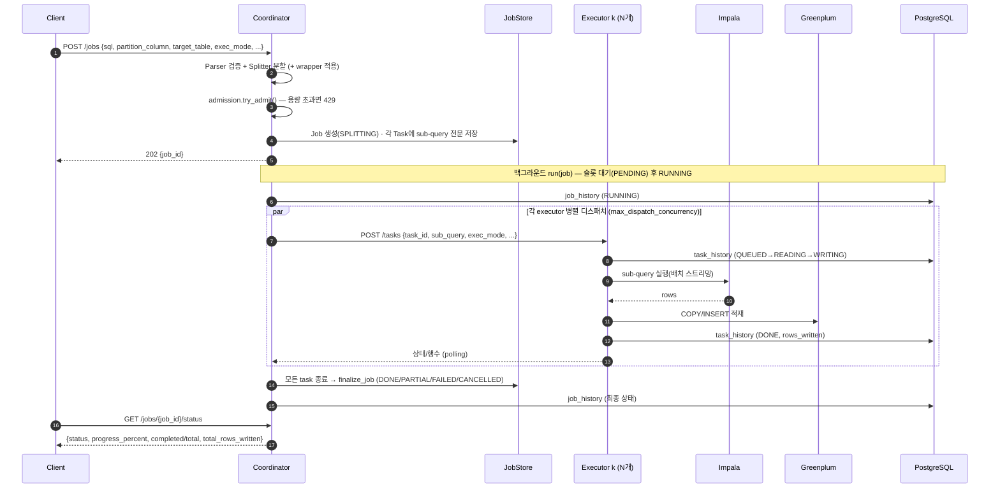
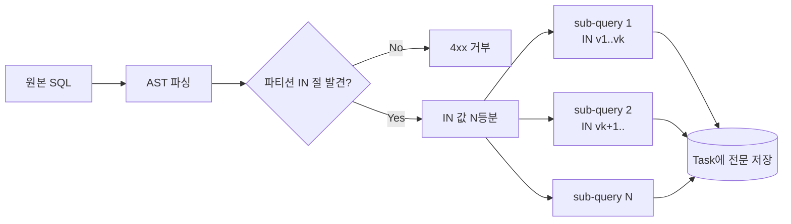
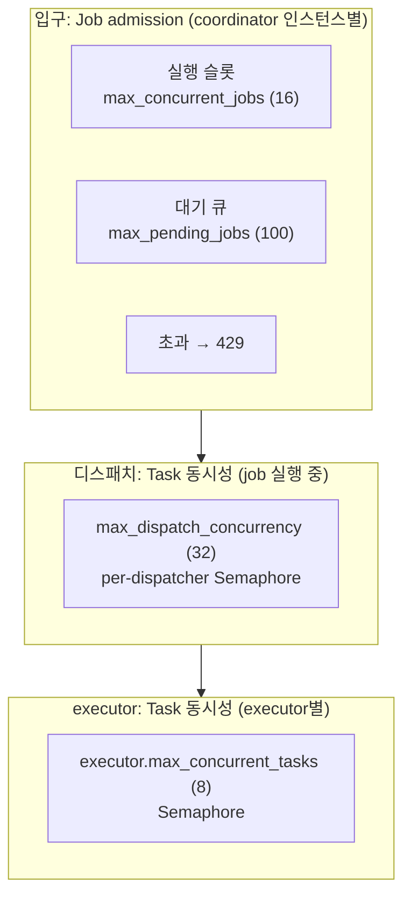

# Distributed Query Executor — 설계 문서

> Coordinator + N Executor 구조로 하나의 **Impala `SELECT` 쿼리**를
> 파티션 컬럼의 `IN` 조건 기준으로 N분할하여 병렬로 읽고,
> 그 결과를 **Greenplum 테이블에 적재**하는 데이터 이관 API.

> 외부 애플리케이션(예: C#)에서 이 API 를 호출해 작업을 실행하고 완료·에러를 확인하는
> 구체적 방법과 JSON 예시는 [INTEGRATION.md](INTEGRATION.md) 를 참고하세요.

---

## 1. 개요 (Overview)

이 시스템은 한마디로 "큰 조회 한 건을 여러 일꾼에게 나눠 시키는 데이터 이관기"입니다. 처음 접하는 분을 위해 먼저 큰 그림부터 그려 보겠습니다.

우리가 다루는 데이터는 Impala라는 분석용 데이터베이스 안에 들어 있고, 이것을 Greenplum이라는 또 다른 데이터베이스로 옮기는 것이 이 시스템의 일입니다(이 옮기는 작업을 **Impala → Greenplum 이관**이라고 부릅니다). 그런데 데이터가 워낙 크기 때문에 한 대가 통째로 읽으면 너무 느립니다. 그래서 이 시스템은 하나의 큰 Impala `SELECT` 문을 여러 일꾼(executor)에게 나누어 주고, 각 일꾼이 자기 몫을 병렬로 읽은 다음 자기가 읽은 데이터를 직접 Greenplum에 적재하도록 만들었습니다.

그렇다면 일을 "어떤 기준으로" 나눌까요? 바로 쿼리의 `WHERE <partition_column> IN (v1, v2, ...)` 조건에 들어 있는 IN 값 리스트를 N등분합니다. 여기서 **파티션 컬럼(partition column)**이란 데이터를 날짜나 지역처럼 일정한 구간으로 나누어 저장할 때 그 기준이 되는 컬럼을 말합니다. 예를 들어 날짜 100일치를 IN으로 나열했다면, 그 100개의 날짜를 네 묶음으로 쪼개 네 일꾼에게 25일씩 맡기는 식입니다.

아래는 이 개요에서 기억해 둘 만한 핵심 설정값들입니다. 지금 다 외울 필요는 없고, 뒤 절에서 하나씩 다시 만나게 됩니다.

- **목적**: 하나의 큰 Impala `SELECT`를 여러 executor로 나누어 병렬로 읽고, 각 executor가 자신이 읽은 데이터를 Greenplum에 적재한다. (**Impala → Greenplum 이관**)
- **분할 기준**: `WHERE <partition_column> IN (v1, v2, ...)` 의 IN 값 리스트를 N등분.
- **소스(read) 방언**: 기본 **Impala**(`sqlglot`의 `hive` 방언). 요청에서 `sql_dialect`로 재정의 가능(`impala`, `postgres` 등).
- **타깃(write)**: **Greenplum**(PostgreSQL 기반) → psycopg `COPY` 또는 INSERT.
- **검증 범위**: 기본은 단순 `SELECT`(strict). `strict_validation=false`로 **JOIN·서브쿼리·GROUP BY 등 복합 쿼리**도 허용(파티션 `IN` 절을 트리 어디서든 탐색).
- **적재 방식**(`exec_mode`): `copy`(기본) / `statement` / `stage_insert` 세 가지.
- **응답 모델**: Job 기반 **비동기** API (job_id 발급 후 polling).
- **동시성**: 입구의 admission control(동시 job 슬롯 + 대기 큐)과 디스패치/executor 단의 task 동시성 상한으로 다층 제어.
- **운영 형태**: 단일 또는 **멀티 coordinator**(공유 PostgreSQL), executor **N대**. 별도 executor 없이 검증하는 **local 모드**도 지원.

위 항목 중 "방언(dialect)"이라는 말이 낯설 수 있는데, 이것은 같은 SQL이라도 데이터베이스마다 문법이 조금씩 다르기 때문에 어느 데이터베이스의 문법으로 해석할지를 정해 주는 설정입니다. 또 "비동기 API"란 요청을 보내자마자 결과가 바로 나오는 것이 아니라, 먼저 접수증(job_id)을 받아 두고 나중에 그 번호로 진행 상황을 물어보는(polling) 방식을 뜻합니다.

### 핵심 특징

이 시스템을 다른 흔한 데이터 파이프라인과 구별 짓는 네 가지 성질이 있습니다. 각각이 왜 그런지 함께 풀어 보겠습니다.

1. **결과 병합 불필요**: 각 executor가 서로 다른 파티션 값 집합을 담당해 Greenplum에 **독립적으로 적재**한다. 행이 겹치지 않으므로 merge가 없다. Job의 "결과"는 적재된 **row count 집계 + 상태**다. 다시 말해, 일꾼들이 맡은 날짜 묶음이 서로 겹치지 않게 나눴기 때문에, 나중에 결과를 합쳐서 중복을 제거하는 골치 아픈 과정이 아예 필요 없습니다.
2. **양방향 상태 추적**: Coordinator와 Executor **모두** 자신의 작업이 진행 중인지/완료인지 안다. 두 계층 모두 PostgreSQL 이력에 기록한다. 즉 지휘자도 일꾼도 각자 "내가 지금 무엇을 하고 있는지"를 알고 있고, 그 기록을 공통의 장부에 남깁니다.
3. **쿼리문 보관**: Coordinator는 원본 SQL과 각 executor에게 보낸 **sub-query 전문(全文)** 을 Job 안에 보관한다(감사·디버깅·대시보드 표시). 나중에 "이 일꾼은 정확히 어떤 쿼리를 받았지?"를 따져 볼 수 있도록 보낸 쿼리를 통째로 저장해 둔다는 뜻입니다.
4. **데이터는 coordinator를 거치지 않는다**: executor가 Impala→Greenplum로 직접 흘려보내고, coordinator로는 **상태와 row count만** 흐른다. 대량의 데이터가 지휘자 한 곳으로 몰리면 그곳이 병목이 되므로, 실제 데이터는 일꾼이 직접 목적지로 보내고 지휘자에게는 "몇 행 넣었는지"와 "성공/실패" 같은 가벼운 정보만 올려보냅니다.

---

## 2. 전체 아키텍처

앞 절에서 말한 "지휘자"가 바로 **coordinator**이고, "일꾼"이 **executor**입니다. coordinator는 요청을 받는 창구이자 전체를 지휘하는 한 대의 서비스이고, executor는 실제로 데이터를 읽고 적재하는 여러 대의 일꾼 서비스입니다. 아래 다이어그램은 이 둘과 주변 데이터베이스들이 어떻게 연결되는지를 한눈에 보여 줍니다. 화살표에 붙은 동그라미 번호(①~⑤)가 일이 흘러가는 순서입니다.



그림을 말로 풀면 이렇습니다. 클라이언트가 쿼리를 보내면(①) coordinator의 API가 받아서 Parser로 검사하고 Splitter로 잘게 나눈 뒤, Admission으로 받아들일지 판단하고 Dispatcher가 각 executor에게 일을 보냅니다(②). 일을 받은 executor들은 Impala에서 데이터를 읽고(③) 곧바로 Greenplum에 적재합니다(④). 그동안 클라이언트는 접수증으로 진행 상황을 물어볼 수 있습니다(⑤). PostgreSQL은 이 모든 과정의 이력과 상태를 적어 두는 공통 장부 역할을 합니다.

### 설계상의 중요한 결정

위 구조가 왜 이렇게 생겼는지, 네 가지 핵심 결정을 짚어 보겠습니다.

첫째, **Executor는 read+write를 모두 수행하는 상태 보유 독립 서비스**입니다. 즉 일꾼은 단순한 계산기가 아니라, Impala에서 sub-query로 읽어 Greenplum에 적재하는 일을 끝까지 책임지고, 자기가 맡은 task의 상태를 인메모리(프로세스 안의 기억)에 들고 있다가 REST API(`/tasks`)와 자체 대시보드로 보여 줍니다.

둘째, **결과 데이터는 coordinator를 거치지 않습니다.** 만약 모든 데이터가 지휘자 한 곳으로 모였다면 그곳의 메모리와 네트워크가 금세 막혔을 것입니다. 그래서 데이터는 일꾼이 직접 목적지로 보내고, Coordinator로는 **상태와 row count만** 흐르게 했습니다.

셋째, **Coordinator는 분할한 sub-query 전문을 Task 레코드에 저장**합니다. 나중에 무슨 일이 있었는지 추적할 수 있도록, 각 일꾼에게 보낸 쿼리를 통째로 보관해 둡니다.

넷째, **상태와 이력은 PostgreSQL로 외부화**할 수 있습니다. 이렇게 하면 coordinator를 여러 대로 늘리거나 한 번 재시작한 뒤에도 과거 작업을 조회할 수 있습니다. 만약 이 외부 저장소를 설정하지 않으면 인메모리로만 동작하며, 프로세스가 꺼지면 기록도 함께 사라집니다.

---

## 3. 컴포넌트

이제 coordinator와 executor 각각이 어떤 부품들로 이루어져 있는지 들여다보겠습니다. 아래 두 표는 "어떤 부품이 무슨 일을 맡는가"를 정리한 것으로, 이 시스템의 부품 목록이라고 보면 됩니다. 표의 굵은 글씨가 부품 이름이고, 오른쪽이 그 책임, 괄호 안 파일명은 실제 코드 위치입니다.

### 3.1 Coordinator

coordinator 쪽 부품들을 먼저 봅시다. 요청을 받는 API부터, 쿼리를 검사·분할하는 부품, 과부하를 막는 부품, 실제로 일을 뿌리는 부품, 그리고 상태와 이력을 적어 두는 부품까지가 한 묶음으로 협력합니다.

| 컴포넌트 | 책임 |
|---|---|
| **API Layer** | 작업 제출/조회/취소, 클러스터 상태, 대시보드(`coordinator/app.py`) |
| **Parser** | sqlglot로 SQL 파싱, partition column의 `IN(...)` 노드 탐색, strict/lenient 모드 검증(`parser.py`) |
| **Splitter** | IN 값 리스트를 `parallelism`개로 분할 → sub-query N개 재작성(원문 포맷 보존, `splitter.py`) |
| **JobAdmission** | 동시 실행 슬롯 + 대기 큐 상한(과부하 시 429). `dispatcher.py` |
| **Dispatcher** | sub-query를 executor에 분배, task 단위 동시성(Semaphore) 제어, 상태 polling, 종료 집계(`dispatcher.py`) |
| **JobStore** | Job·Task 상태 + **sub-query 전문 저장**. `memory`(휘발) / `file`(단일 노드 **파일 영속 → 크래시 복구**) / `postgres`(공유, JSONB) — `job_store.py` |
| **JobHistory** | job 단위 실행 이력 PostgreSQL 기록·조회(`history.py`) |
| **HealthMonitor** | executor `/health`·`/metrics` 주기 폴링, 메트릭 PostgreSQL 기록(`monitor.py`) |
| **Dashboard** | 인라인 HTML 모니터링 UI(`/`) + 설정 마스킹(`dashboard.py`) |

표에 나온 용어 몇 가지를 풀어 두겠습니다. **Parser**는 들어온 SQL의 문법을 검사하고 어디에 파티션 IN 절이 있는지 찾아내는 부품이고, **Splitter**는 그 IN 값을 `parallelism`(병렬 처리 개수)만큼 쪼개 여러 개의 sub-query로 다시 써 주는 부품입니다. **JobAdmission**의 "admission"은 입장 통제라는 뜻으로, 한꺼번에 너무 많은 작업이 몰리지 않도록 입구에서 막아 주는 역할입니다. **JobStore**의 세 가지 모드 중 `memory`는 프로세스가 꺼지면 사라지는 휘발성, `file`은 파일로 저장해 크래시 후 복구가 되는 방식, `postgres`는 여러 coordinator가 함께 보는 공유 저장소입니다.

### 3.2 Executor (N개, 각각 독립 프로세스/서비스)

이번에는 일꾼 쪽입니다. executor는 한 대만 있는 게 아니라 N대가 각자 독립된 프로세스로 떠 있으며, 저마다 task를 받아 처리하고 자기 상태를 관리합니다.

| 컴포넌트 | 책임 |
|---|---|
| **Task API** | `POST /tasks`(수신·실행 시작), `GET /tasks`·`/tasks/{id}`(상태), `/cancel`, `/metrics` — `executor/app.py` |
| **Backend** | `ImpalaToGreenplumBackend`(impyla read → psycopg COPY/INSERT) + `MockBackend`. copy 모드는 COPY 전 **컬럼 사전검증(preflight)** 으로 불일치 조기 실패(`backend.py`) |
| **Task Store** | 받은 task 상태(QUEUED→READING→WRITING→DONE/FAILED/CANCELLED) + 누적 `rows_written`(인메모리 dict) |
| **TaskHistory** | task 단위 상태 전이 이력 PostgreSQL 기록·조회(`history.py`) |
| **StatusReporter** | 자기 상태(CPU/메모리/동시 task)를 공유 DB에 self-report(`status.py`) |
| **동시 task 상한** | `executor.max_concurrent_tasks` 세마포어(admission control) |
| **Graceful drain** | 종료(SIGTERM) 시 신규 task 거부(503) + 진행 중 task 를 `shutdown_drain_timeout_s` 내에서 완료 대기(`app.py` lifespan) |
| **Dashboard** | remote 모드에서 `/`에 노출되는 self-view 대시보드(`dashboard.py`) |

여기서 **Backend**는 실제로 Impala에서 읽고 Greenplum에 쓰는 손발에 해당합니다. 실전용 `ImpalaToGreenplumBackend` 외에 실제 데이터베이스 없이 테스트할 수 있는 `MockBackend`도 있다는 점을 기억해 두면 좋습니다. **세마포어(semaphore)**라는 말이 나오는데, 이것은 "동시에 들어올 수 있는 인원수를 정해 둔 출입증" 같은 장치로, 한 일꾼이 동시에 처리하는 task 수를 일정 개수로 제한합니다. **Graceful drain(우아한 비우기)**은 일꾼을 끌 때 갑자기 일을 끊지 않고, 새 일은 거절하되 하던 일은 정해진 시간 안에서 마무리하게 두는 종료 방식입니다.

---

## 4. 데이터 흐름 (Impala → Executor → Greenplum)

이제 한 명의 일꾼 입장에서 데이터가 실제로 어떻게 흘러가는지 따라가 봅시다. 일꾼은 Impala에서 자기 몫의 파티션을 읽어 들여 약간의 변환을 거친 뒤 Greenplum에 적재합니다. 아래 그림이 그 한 줄기 흐름입니다.



이 흐름에서 중요한 점 세 가지를 짚어 보겠습니다.

먼저, executor는 sub-query 결과를 **스트리밍(배치 fetch)** 합니다. 즉 결과를 한꺼번에 메모리에 다 올려놓지 않고, 한 묶음씩 끊어서 읽어 흘려보내기 때문에 데이터가 아무리 커도 메모리가 터지지 않습니다.

다음으로, 적재는 `COPY`로 배치 단위로 수행합니다. 한 행씩 여러 번 INSERT 하는 것보다 한 묶음을 통째로 밀어 넣는 COPY가 훨씬 빠르기 때문입니다. 상황에 따라서는 INSERT나 staging(임시 테이블)을 경유하는 방식도 쓸 수 있는데, 이 선택지는 §9에서 자세히 다룹니다.

마지막으로, 각 executor는 **서로 다른 파티션 값 집합**을 담당하므로 Greenplum에 동시에 써도 서로 충돌하지 않고, 그래서 나중에 결과를 병합할 필요도 없습니다.

- executor는 sub-query 결과를 **스트리밍(배치 fetch)** 하여 메모리에 전체를 올리지 않는다.
- 적재는 `COPY`로 배치 단위 수행(INSERT 다건보다 훨씬 빠름). `exec_mode`에 따라 INSERT/staging 경유도 가능(§9).
- 각 executor가 **서로 다른 파티션 값 집합**을 담당 → Greenplum 쓰기 충돌 없음 → 병합 불필요.

---

## 5. 데이터 모델

이 시스템이 머릿속에 어떤 정보를 들고 있는지, 즉 데이터 모델을 살펴봅시다. 핵심은 두 가지 구조입니다. 하나는 작업 전체를 나타내는 **Job**이고, 다른 하나는 그 작업을 잘게 나눈 하나하나의 일감인 **Task**입니다. 하나의 Job 아래에 여러 개의 Task가 매달리는 관계입니다. 특히 이 모델은 **원본 쿼리와 각 executor로 보낸 sub-query 전문을 모두 저장**한다는 점이 특징인데, 이는 나중에 무슨 일이 있었는지 감사하고 디버깅하기 위해서입니다.



위 그림에서 Job은 작업 전체에 대한 정보(원본 SQL, 파티션 컬럼, 적재 대상 테이블, 병렬도, 전체 상태와 적재된 총 행 수 등)를 담고, Task는 잘게 나뉜 일감 하나에 대한 정보(어느 executor로 보냈는지, 보낸 sub-query 전문, 이 일감이 담당한 IN 값들, 적재한 행 수 등)를 담습니다. 두 구조를 잇는 `Job "1" o-- "N" Task` 표시는 "Job 하나에 Task가 여럿 달린다"는 뜻입니다.

> 진행률은 `completed / total`(완료=성공·실패·취소 모두 포함)로 계산한다. `progress_percent`·`completed`·`total`은 Job에서 파생된다.

진행률을 계산할 때 "완료"에는 성공뿐 아니라 실패나 취소까지 모두 포함된다는 점에 주의하세요. 즉 진행률은 "끝난 일감이 전체 중 얼마나 되는가"이지 "성공한 일감이 얼마나 되는가"가 아닙니다.

---

## 6. 상태 머신 (양방향 추적)

작업이 시작부터 끝까지 어떤 단계를 거치는지를 **상태 머신**으로 정리합니다. 상태 머신이란 "지금 어떤 상태에 있고, 어떤 일이 생기면 어떤 상태로 넘어가는가"를 그림으로 나타낸 것입니다. 앞서 1절에서 말한 "양방향 상태 추적"이 여기서 구체화되는데, coordinator는 Job의 상태를, executor는 Task의 상태를 각자 관리합니다.

### 6.1 Coordinator — Job 상태

먼저 coordinator가 보는 Job의 일생입니다. 작업이 만들어져서 슬롯을 기다리고, 실행되고, 끝나는 흐름을 따라가 보세요.



이 그림을 이야기로 풀면 이렇습니다.

검증과 분할은 `POST /jobs` 요청을 처리하는 그 자리에서 **동기로**(즉 요청에 응답하기 전에 바로) 끝납니다. 그래서 문제가 있으면 곧장 4xx 오류로 거절되고, 통과하면 작업은 `SPLITTING` 상태로 만들어진 뒤 곧 백그라운드의 `run()`이 이어받습니다.

이어서 `run()`은 admission의 실행 슬롯이 빌 때까지 작업을 `PENDING`(대기 줄)에 세워 두었다가, 슬롯을 잡으면 `RUNNING`으로 넘깁니다. 만약 입구에서 이미 용량이 꽉 찼다면 애초에 작업이 만들어지지도 않고 `429`로 거절되는데, 이 입장 통제 이야기는 §10에서 자세히 다룹니다.

작업이 끝나면 최종 상태는 `finalize_job()`이 하위 task들을 모아 보고 결정합니다. 그 판단 순서는 다음과 같습니다. 취소가 있었으면 취소가 우선이고, 실패한 task가 하나도 없으면 DONE, 실패가 있어도 best_effort 정책이면 PARTIAL, 그 외에는 FAILED입니다.

또한 이 시스템은 **재기동 정합(크래시 복구)**을 지원합니다. 영속 저장소(`file`/`postgres`)를 쓰는 경우, coordinator가 다시 켜질 때 `reconcile_interrupted_jobs()`가 아직 끝나지 않은(PENDING/SPLITTING/RUNNING) 채로 남아 있던 job을 `FAILED`로 정리합니다. 프로세스가 죽으면서 그 job을 실행하던 루프도 함께 사라졌기 때문입니다. 이때 진행 중이던 task도 FAILED로 표시되어 나중에 `retry`(재실행)의 대상이 됩니다.

그리고 **실패 파티션 재실행**도 가능합니다. 이미 끝난 job에 `POST /jobs/{id}/retry`를 보내면, FAILED/CANCELLED였던 task만 모은 **새 job**(원본을 가리키는 `retry_of` 표시가 붙습니다)이 SPLITTING부터 똑같은 흐름으로 다시 실행됩니다.

- 검증/분할은 `POST /jobs` 핸들러에서 **동기로** 끝나므로(실패 시 즉시 4xx), 작업은 `SPLITTING`으로 생성되고 곧 백그라운드 `run()`이 받는다.
- `run()`은 admission 실행 슬롯이 빌 때까지 job을 `PENDING`(대기 큐)으로 두었다가, 슬롯을 잡으면 `RUNNING`으로 전이한다. (입구에서 용량 초과면 애초에 `429`로 거부되어 작업이 생성되지 않는다 — §10)
- 최종 상태는 `finalize_job()`이 하위 task를 집계해 결정한다: 취소 우선 → 실패 없음=DONE → best_effort=PARTIAL → 그 외=FAILED.
- **재기동 정합(크래시 복구)**: 영속 저장소(`file`/`postgres`)면 기동 시 `reconcile_interrupted_jobs()`가 비종료(PENDING/SPLITTING/RUNNING)로 남은 job을 `FAILED`로 정합한다(실행 루프가 사라졌으므로). 진행 중이던 task도 FAILED로 표시돼 `retry` 대상이 된다.
- **실패 파티션 재실행**: 종료된 job에 `POST /jobs/{id}/retry` → FAILED/CANCELLED task만 담은 **새 job**(`retry_of`=원본)이 SPLITTING부터 동일 흐름으로 실행된다.

### 6.2 Task 상태 (Coordinator 미러 ↔ Executor 원본)

이번에는 일감 하나, 즉 Task의 일생입니다. Task의 "진짜" 상태는 그 일을 직접 하는 executor가 들고 있고, coordinator는 그것을 폴링으로 따라 적는 사본(미러)을 갖습니다.



이 두 계층이 어떻게 협력하는지 정리하면 다음과 같습니다.

**Executor** 쪽은 위 상태와 누적된 `rows_written`(지금까지 적재한 행 수)을 인메모리에 기록하고, `GET /tasks/{id}`로 외부에 보여 줍니다. 상태가 바뀔 때마다 `task_history`라는 이력 테이블에 한 줄씩 덧붙입니다.

**Coordinator** 쪽은 Dispatcher가 주기적으로 폴링하여 각 Task의 상태와 row count를 자기 쪽에 따라 적습니다(미러링). 그리고 Job 전체의 상태는 이 Task들을 모아 보고 결정합니다.

끝으로 `started_at`과 `finished_at` 시각은 executor가 READING 단계에 들어가고 빠져나가는 시점에 기록하는데, 이 값은 대시보드에서 각 task가 얼마나 걸렸는지를 보여 주는 데 쓰입니다.

- **Executor**: 위 상태 + 누적 `rows_written`을 인메모리에 기록, `GET /tasks/{id}`로 노출. 상태 전이마다 `task_history`에 append.
- **Coordinator**: Dispatcher가 polling으로 각 Task 상태/row count를 미러링. Job 상태는 Task 집계로 결정.
- `started_at`/`finished_at`은 executor가 READING 진입·종료 시점에 기록(대시보드 소요 시간 표시).

---

## 7. 요청 처리 시퀀스

지금까지 부품과 상태를 따로따로 봤다면, 이제는 하나의 요청이 시작부터 끝까지 어떻게 처리되는지 시간 순서대로 따라가 봅시다. 아래 시퀀스 다이어그램은 클라이언트, coordinator, 각종 저장소와 데이터베이스가 주고받는 메시지를 위에서 아래로 시간 순으로 나열한 것입니다.



흐름을 말로 풀면 이렇습니다. 클라이언트가 쿼리와 옵션을 담아 `POST /jobs`를 보내면, coordinator는 그 자리에서 Parser로 검증하고 Splitter로 분할한 뒤(필요하면 wrapper를 입힙니다) admission으로 받아들일지 판단합니다. 용량이 넘으면 여기서 429로 거절합니다. 통과하면 Job을 `SPLITTING`으로 만들고 각 Task에 sub-query 전문을 저장한 다음, 곧바로 접수증(`202 {job_id}`)을 돌려줍니다. 클라이언트는 더 이상 기다리지 않아도 됩니다.

그 뒤로는 백그라운드에서 `run(job)`이 슬롯을 기다렸다가 RUNNING으로 넘어가고, 여러 executor에게 task를 **병렬로** 뿌립니다(이 동시 디스패치 개수가 `max_dispatch_concurrency`로 제한됩니다). 각 executor는 Impala에서 읽고 Greenplum에 적재하며, 그 진행 상황을 task_history에 적고 coordinator의 폴링에 응답합니다. 모든 task가 끝나면 `finalize_job`이 최종 상태를 정하고, 클라이언트는 `GET /jobs/{job_id}/status`로 결과(상태, 진행률, 완료/전체 개수, 총 적재 행 수)를 받아 봅니다.

> **모니터링은 별개 루프**: Coordinator는 `monitor.health_interval_s`마다 각 executor `/health`·`/metrics`를 폴링하고(`GET /executors`), `monitor.record_interval_s`마다 `executor_health_metrics`에 기록한다. (executor self-report 모드면 coordinator 폴링 대신 executor가 직접 기록 — §12)

한 가지 덧붙이면, 위 작업 처리와는 별개로 건강 상태를 살피는 모니터링 루프가 따로 돕니다. coordinator는 `monitor.health_interval_s` 간격으로 각 executor의 `/health`와 `/metrics`를 들여다보고, `monitor.record_interval_s` 간격으로 그 결과를 `executor_health_metrics`에 기록합니다. 다만 executor가 self-report 모드라면 coordinator가 일일이 물어보는 대신 executor가 직접 기록하는데, 이 이야기는 §12에서 이어집니다.

---

## 8. 쿼리 분할 (Splitting)

이제 이 시스템의 심장이라 할 수 있는 "쿼리를 어떻게 잘게 나누는가"를 자세히 봅시다. 핵심 아이디어는 단순합니다. 쿼리의 `IN (...)` 안에 들어 있는 값들을 여러 묶음으로 나누고, 각 묶음만 남긴 작은 쿼리(sub-query)를 새로 만들어 일꾼들에게 주는 것입니다.

### 입력 예시 (Impala source)

예를 들어 다음과 같은 쿼리가 들어왔다고 합시다. 날짜(`dt`)가 파티션 컬럼이고, IN 절에 여러 날짜가 나열되어 있습니다.

```sql
SELECT user_id, amount, dt
FROM sales
WHERE dt IN ('2026-01-01','2026-01-02', ... ,'2026-06-25')   -- partition_column = dt
  AND region = 'KR'
```

### 절차

이 쿼리를 나누는 과정은 다음 다섯 단계를 차례로 거칩니다.

1. **파싱**: `sqlglot.parse_one(sql, read=<dialect>)` → AST. 즉 글자 그대로의 SQL 문자열을 컴퓨터가 다루기 쉬운 나무 모양 구조(AST, 추상 구문 트리)로 바꿉니다.
2. **IN 절 탐색**: `partition_column`의 `IN` 노드를 찾는다. 테이블 한정자(`A.dt`)·대소문자는 무시. 다시 말해 `A.dt`처럼 테이블 이름이 앞에 붙어 있거나 대소문자가 다르더라도 같은 컬럼으로 알아봅니다.
3. **검증**: 이 단계에서 쿼리가 분할에 적합한지를 확인합니다. 검사 강도는 `strict_validation` 설정에 따라 둘로 갈립니다.
   - `strict_validation=true`(기본): `GROUP BY`/집계/`DISTINCT`/`JOIN`/`NOT IN`/서브쿼리 IN/IN 누락을 안정적 에러 코드로 거부.
   - `strict_validation=false`(lenient): 복합 쿼리 허용. 트리 어디에 있든 파티션 `IN`을 찾아 그 절만 분할.
4. **값 분할**: IN 값 `[v1..vM]`를 `parallelism`개 청크로 분할 (`contiguous` 기본 / skew 심하면 `round_robin`). 여기서 청크(chunk)란 나눠진 한 묶음을 말하고, `contiguous`는 앞에서부터 연속으로 잘라 주는 방식, `round_robin`은 카드를 돌리듯 한 개씩 번갈아 나눠 주는 방식입니다. 한쪽에 데이터가 쏠리는 편향(skew)이 심할 때는 `round_robin`이 균형을 더 잘 맞춰 줍니다.
5. **sub-query 재작성**: 각 청크로 **IN 절의 값 목록 구간만** 문자열 치환해 N개의 완전한 SQL 생성(원문 포맷 보존, 폴백으로 AST 재생성). 즉 원래 쿼리의 모양은 그대로 두고 IN 안의 값 목록 부분만 바꿔 끼워, 일꾼 수만큼의 완성된 쿼리를 만들어 냅니다. 만약 단순 문자열 치환이 어려우면 AST로부터 다시 만들어 내는 방법으로 대체(폴백)합니다.

아래 그림은 이 과정을 한눈에 보여 줍니다. 원본 SQL을 파싱해 파티션 IN 절이 있는지 확인하고, 없으면 4xx로 거절, 있으면 값을 N등분해 여러 sub-query로 만든 뒤 각 Task에 전문을 저장하는 흐름입니다.



> **lenient 결과 보존 가정**: 분할 기준 컬럼이 출력 행을 분할하는 위치(주로 소스 스캔 필터)에 있어야 한다. 분할 기준 위에서 집계/DISTINCT 하면 결과가 달라질 수 있다.

마지막으로 한 가지 주의가 있습니다. `strict_validation=false`(lenient) 모드로 복합 쿼리를 나눌 때는 한 가지 전제가 지켜져야 합니다. 분할 기준 컬럼이 출력되는 행을 실제로 나누는 위치, 즉 주로 소스를 읽어 들이는 필터 자리에 있어야 한다는 것입니다. 만약 그 분할 기준보다 위에서 집계나 DISTINCT가 일어난다면, 데이터를 나눠 처리한 결과가 한꺼번에 처리한 결과와 달라질 수 있으니 조심해야 합니다.

---

## 9. 적재 방식 (`exec_mode`)

같은 "적재"라도 상황에 따라 가장 알맞은 방법이 다릅니다. 그래서 이 시스템은 `exec_mode`라는 설정으로 세 가지 적재 방식을 골라 쓸 수 있게 했습니다. 아래 표는 각 방식이 무엇을 하고 어떤 경우에 적합한지를 정리한 것입니다. 소스(읽는 곳)와 타깃(쓰는 곳)이 같은 데이터베이스인지, 다른 엔진인지에 따라 선택이 갈린다는 점에 주목하며 읽으면 좋습니다.

| `exec_mode` | 동작 | 적합한 경우 |
|---|---|---|
| `copy` (기본) | Impala에서 sub-query를 **읽어** Greenplum에 `COPY FROM STDIN` 배치 적재. **사전검증(preflight)**: COPY 전에 SELECT 컬럼이 대상 테이블에 있는지 확인(`copy.preflight`, 기본 on) | 소스(Impala)/타깃(Greenplum)이 다른 엔진. COPY는 대상 테이블 컬럼과 정확히 일치해야 하며, wrapper는 **행을 반환하는 SELECT** 여야 한다 |
| `statement` | wrapper로 감싼 SQL(예: `INSERT ... SELECT`)을 대상 DB에서 **그대로 실행** | 소스/타깃이 같은 DB(Greenplum). INSERT 컬럼 목록이 매핑을 담당 |
| `stage_insert` | (선택적으로 `staging_ddl`로 staging 테이블 생성 →) Impala SELECT 결과를 Greenplum **staging에 COPY** → staging을 `FROM`으로 하는 **INSERT 실행** | SELECT은 Impala, INSERT은 Greenplum처럼 서로 다른 엔진을 INSERT로 연결 |

표를 풀어 설명하면 이렇습니다. 기본값인 `copy`는 Impala에서 읽은 데이터를 Greenplum에 통째로 밀어 넣는 가장 빠른 방식으로, 소스와 타깃 엔진이 서로 다를 때 잘 맞습니다. 다만 COPY는 컬럼이 대상 테이블과 정확히 들어맞아야 하므로, COPY를 시작하기 전에 SELECT의 컬럼들이 대상 테이블에 실제로 있는지 미리 확인하는 **사전검증(preflight)**을 합니다(이 검증은 `copy.preflight` 설정으로 켜고 끌 수 있으며 기본은 켜짐입니다). `statement`는 `INSERT ... SELECT` 같은 문장을 대상 DB에서 그대로 실행하는 방식으로, 소스와 타깃이 같은 Greenplum일 때 적합합니다. `stage_insert`는 Impala에서 읽은 결과를 일단 Greenplum의 staging 테이블에 COPY로 넣어 둔 다음, 그 staging 테이블을 바탕으로 INSERT를 실행하는 방식으로, 서로 다른 엔진을 INSERT 문으로 이어 주고 싶을 때 씁니다. 이때 staging 테이블을 만드는 `staging_ddl`은 **선택**입니다. 주면 COPY 전에 그 DDL(보통 `CREATE TEMP TABLE`)로 테이블을 만들고, 생략하면 테이블 생성을 건너뛰고 이미 존재하는 `staging_table`을 그대로 씁니다(이 경우 영구 테이블을 여러 task가 공유하지 않도록 격리에 유의).

**write_mode**(`copy`/적재 공통):

적재 방식과는 별개로, 데이터를 "어떻게 쌓을지"를 정하는 `write_mode`가 있습니다. 아래 표가 그 두 가지입니다.

| 모드 | 동작 |
|---|---|
| `append` | 단순 COPY로 누적 |
| `overwrite_partitions` | task별 담당 `partition_values`에 대해 같은 트랜잭션에서 먼저 `DELETE WHERE <partition_column> IN (chunk)` 후 COPY → **재실행 멱등성** 확보 |

`append`는 그냥 기존 데이터 위에 새 데이터를 덧붙이는 방식입니다. 반면 `overwrite_partitions`는 각 task가 맡은 파티션 값들에 대해 같은 트랜잭션 안에서 먼저 해당 구간을 `DELETE`로 지운 뒤 COPY로 새로 채웁니다. 이렇게 하면 같은 task를 다시 실행해도 결과가 똑같아지는 성질, 즉 **멱등성(idempotency)**이 확보됩니다. 멱등성이란 "같은 일을 여러 번 해도 한 번 한 것과 결과가 같다"는 뜻으로, 재실행이 안전해진다는 점에서 매우 중요합니다.

이와 관련해 몇 가지 보충 사항이 있습니다.

먼저 트랜잭션은 task 단위입니다. 그래서 어떤 task가 중간에 실패하면 그 task만 rollback(되돌리기)되고 다른 task에는 영향이 없습니다. 또한 각 task는 서로 겹치지 않는(disjoint) 파티션 집합만 다루므로 executor들 사이에 쓰기 충돌이 생기지 않습니다.

다음으로 **wrapper_query**라는 개념이 있습니다. 이것은 분할된 각 sub-query를 한 번 더 감싸는 바깥 쿼리로, `wrapper_placeholder`(기본 `{{SUBQUERY}}`)라고 적힌 자리에 안쪽 sub-query가 끼워집니다. 다만 `stage_insert`에서는 placeholder 대신 임시 테이블 이름을 참조하는 INSERT를 둡니다.

끝으로 **Impala 쿼리 옵션(SET)**을 전달할 수 있습니다. 전역 설정 `impala.query_options`에 요청별 `impala_query_options`를 얹어(전역 위에 병합) impyla의 `configuration`으로 넘깁니다. 이 옵션은 copy와 stage_insert가 수행하는 Impala SELECT에만 적용되며, 둘 다 비어 있으면 `configuration` 없이 그대로 실행합니다.

- 트랜잭션은 task 단위. 실패 시 해당 task만 rollback, 다른 task 무영향.
- 각 task가 disjoint한 partition 집합만 다루므로 executor 간 쓰기 충돌 없음.
- **wrapper_query**: 분할된 각 sub-query를 감싸는 쿼리. `wrapper_placeholder`(기본 `{{SUBQUERY}}`) 자리에 치환. `stage_insert`에서는 placeholder 대신 staging 테이블명을 참조하는 INSERT를 둔다.
- **Impala 쿼리 옵션(SET)**: 전역 `impala.query_options` + 요청별 `impala_query_options`(전역 위에 병합)를 impyla `configuration`으로 전달한다. copy·stage_insert의 Impala SELECT에만 적용되며, 둘 다 비면 `configuration` 없이 그대로 실행한다.

> 결과 데이터는 coordinator를 통과하지 않으므로 "결과 병합(merge)" 단계가 없다. Coordinator는 `rows_written`만 합산한다.

다시 한번 강조하면, 결과 데이터는 coordinator를 거치지 않기 때문에 따로 결과를 병합하는 단계가 없습니다. coordinator가 하는 일은 각 task가 보고한 `rows_written`을 더하는 것뿐입니다.

---

## 10. 동시성 모델 (admission control)

서버는 한 번에 처리할 수 있는 양이 정해져 있습니다. 그 한계를 넘는 요청이 한꺼번에 밀려들면 모두가 함께 느려지거나 무너집니다. 이를 막기 위해 이 시스템은 **admission control(입장 통제)**을 세 개의 층위로 두어, 입구부터 가장 안쪽까지 단계적으로 과부하를 거릅니다. 아래 그림이 그 세 층입니다.



세 층을 차례로 설명하겠습니다.

**Level 1 — Job admission(`JobAdmission`)**은 가장 바깥 입구입니다. 여기에는 `max_concurrent_jobs`개의 실행 슬롯과 `max_pending_jobs`개의 대기 줄이 있습니다. 슬롯이 비어 있으면 작업은 곧장 RUNNING이 되고, 슬롯이 꽉 차 있으면 PENDING으로 줄을 섭니다. 그런데 실행 중인 것과 대기 중인 것을 합한 수(capacity)마저 넘는 요청이 오면, 그때는 `429 Too Many Requests`로 거절하면서 `Retry-After`(잠시 후 다시 시도하라)를 함께 알려 줍니다. 참고로 `max_concurrent_jobs`를 0 이하로 두면 무제한이 되며, 이 한도는 **coordinator 인스턴스마다 인메모리로** 따로 셉니다. 그래서 coordinator가 여러 대면 한도도 그만큼 합산됩니다.

**Level 2 — Task 디스패치 동시성**은 한 coordinator가 동시에 띄울 수 있는 executor task의 총수를 `max_dispatch_concurrency` 세마포어로 제한합니다(모든 job을 통틀어서 셉니다).

**Level 3 — Executor admission**은 가장 안쪽으로, executor 한 대가 동시에 실행하는 task 수를 `executor.max_concurrent_tasks` 세마포어로 제한합니다. 여러 coordinator가 한 executor에게 일을 몰아주더라도 이 마지막 방어선이 그 합산 부하를 막아 줍니다.

그 밖에 입출력 처리 방식도 함께 알아 두면 좋습니다. **Coordinator I/O**는 `httpx.AsyncClient`와 `asyncio.gather`로 executor를 비동기로(코루틴 동시성) 호출합니다. 반면 **Executor 내부**에서 쓰는 impyla와 psycopg는 동기 라이브러리라서, 그대로 부르면 이벤트 루프가 멈춰 버립니다. 그래서 이들을 `run_in_executor(thread_pool, ...)`로 감싸 별도 스레드에서 돌려 이벤트 루프가 막히지 않게 합니다.

- **Level 1 — Job admission (`JobAdmission`)**: `max_concurrent_jobs`개의 실행 슬롯 + `max_pending_jobs`개의 대기 큐. 슬롯이 비면 즉시 RUNNING, 차면 PENDING으로 줄을 세우고, **실행+대기 합(capacity)을 넘는 요청은 `429 Too Many Requests`(`Retry-After`)로 거부**한다. `max_concurrent_jobs<=0`이면 무제한. 이 한도는 **coordinator 인스턴스별(인메모리)** 이라 멀티 coordinator에선 합산된다.
- **Level 2 — Task 디스패치 동시성**: `max_dispatch_concurrency` 세마포어로 한 coordinator가 동시에 띄우는 executor task 수를 제한(모든 job 통틀어).
- **Level 3 — Executor admission**: `executor.max_concurrent_tasks` 세마포어로 executor 한 대가 동시에 실행하는 task 수를 제한(여러 coordinator의 합산 부하 방어).
- **Coordinator I/O**: `httpx.AsyncClient` + `asyncio.gather`로 executor 비동기 호출(코루틴 동시성).
- **Executor 내부**: impyla/psycopg는 동기 → `run_in_executor(thread_pool, ...)`로 감싸 이벤트 루프 비차단.

> 적정값 산정: 실제 천장은 coordinator 코어가 아니라 **Greenplum 동시 COPY 허용량·Impala 동시 쿼리 슬롯·executor 풀 합**이다. 다운스트림 용량에 맞춰 `executor.max_concurrent_tasks`를 분배하고, `max_dispatch_concurrency`는 그 이상으로 두어 coordinator가 병목이 되지 않게 한다.

이 값들을 어떻게 정하면 좋을지에 대한 조언으로 이 절을 맺습니다. 진짜 한계는 coordinator의 CPU 코어 수가 아니라, 그 아래에 있는 Greenplum이 동시에 받아 줄 수 있는 COPY 수, Impala의 동시 쿼리 슬롯, 그리고 executor 풀 전체의 처리 능력입니다. 그러니 이 하류(downstream) 용량에 맞춰 `executor.max_concurrent_tasks`를 나눠 정하고, `max_dispatch_concurrency`는 그보다 넉넉히 두어 coordinator 자신이 병목이 되지 않도록 하는 것이 좋습니다.

---

## 11. API 명세

이제 실제로 이 시스템을 어떻게 호출하는지, 즉 API 명세를 봅시다. coordinator와 executor가 각각 자기만의 엔드포인트(요청을 받는 주소)를 제공합니다. 보통은 coordinator API만 쓰면 되고, executor API는 일꾼 내부를 들여다보거나 디버깅할 때 유용합니다.

### 11.1 Coordinator API

가장 중요한 요청은 작업을 제출하는 `POST /jobs`입니다. 아래는 그 요청 본문의 예시인데, 각 필드 옆 주석이 무엇을 뜻하는지 설명합니다.

```http
POST /jobs
{
  "sql": "SELECT user_id, amount, dt FROM sales WHERE dt IN (...) AND region='KR'",
  "partition_column": "dt",
  "target_table": "public.sales_mirror",
  "write_mode": "overwrite_partitions",   // | "append"
  "exec_mode": "copy",                     // | "statement" | "stage_insert"
  "parallelism": 4,
  "split_strategy": "contiguous",          // | "round_robin"
  "failure_policy": "fail_fast",           // | "best_effort"
  "strict_validation": true,               // false면 복합 쿼리 허용
  "sql_dialect": "hive",                   // 선택(기본 서버 설정)
  "wrapper_query": null,                   // 선택(분할 sub-query 감싸기)
  "username": null,                        // 선택(이력/대시보드 표시)
  "impala_query_options": null,            // 선택. Impala SET 옵션, 전역 위에 병합. 예: {"MEM_LIMIT":"2g"}
  "dry_run": false                         // true면 executor 미호출, 생성 쿼리만 반환
}
→ 202 { "job_id": "a1b2c3" }
→ 429 { "detail": "동시 실행/대기 job 한도 초과(capacity=...)" }   // admission 초과
→ 4xx { ... }                                                      // 검증 실패(에러 코드)
```

응답은 세 가지로 갈립니다. 정상 접수되면 `202`와 함께 접수증인 `job_id`를 받고, 입구가 꽉 찼으면 `429`로 거절되며, 쿼리 검증에 실패하면 `4xx`와 에러 코드를 받습니다. 여기서 `dry_run`을 `true`로 두면 실제로 executor를 호출하지 않고 어떤 쿼리들이 만들어질지만 미리 확인할 수 있어, 분할 결과를 점검할 때 편리합니다.

coordinator가 제공하는 전체 엔드포인트 목록은 아래 표와 같습니다. 왼쪽이 호출 주소, 오른쪽이 그 용도입니다.

| 엔드포인트 | 설명 |
|---|---|
| `POST /jobs` | 작업 제출 → `{job_id}`. `dry_run=true`면 쿼리 미리보기(200, 미저장) |
| `GET /jobs` | 작업 목록(상태 필터/limit). 대시보드 "처리중인 Query" |
| `GET /jobs/{id}/status` | **진행 상태/진행률**(경량, 태스크 제외) |
| `GET /jobs/{id}` | 전체 상태(태스크 목록 포함) |
| `GET /jobs/{id}/result` | 적재 결과 요약(`total_rows_written`, per-task) |
| `GET /jobs/{id}/tasks/{task_id}` | 태스크 상세(**sub-query 전문 포함**, 감사/디버깅) |
| `POST /jobs/{id}/cancel` | 작업 취소(각 executor에 전파). 이미 종료면 409 |
| `POST /jobs/{id}/retry` | **실패 파티션만 재실행**: 종료된 job의 FAILED/CANCELLED task만 새 job으로 복제·디스패치(`retry_of`로 추적) → 새 `job_id`(202). 대상 없으면 409 |
| `GET /history` | 과거 실행 이력(PostgreSQL `job_history`, job_id별 최신 1건, 페이징) |
| `GET /executors` | executor 헬스/메트릭 상태 |
| `GET /cluster` | coordinator+executor health/metrics + 실행 중 job 수 한 번에 |
| `GET /health`·`/healthz`·`/metrics` | 헬스 체크/시스템 메트릭 |
| `GET /`·`/config`·`/info` | 대시보드 HTML / 설정(마스킹) / 요약 (`dashboard.enabled`로 토글) |

이 가운데 진행 상황만 가볍게 보고 싶으면 `GET /jobs/{id}/status`를, task 목록까지 전부 보고 싶으면 `GET /jobs/{id}`를 쓰면 됩니다. 어떤 task에 정확히 어떤 sub-query가 갔는지는 `GET /jobs/{id}/tasks/{task_id}`로 확인할 수 있어 감사와 디버깅에 유용합니다.

### 11.2 Executor API

executor 쪽에서 가장 핵심이 되는 것은 일감을 받는 `POST /tasks`입니다. coordinator가 이 요청으로 sub-query와 적재 정보를 일꾼에게 넘깁니다.

```http
POST /tasks
{ "task_id":"t1", "job_id":"a1b2c3",
  "sub_query":"SELECT ... WHERE dt IN (...)",
  "target_table":"public.sales_mirror", "write_mode":"overwrite_partitions",
  "partition_column":"dt", "partition_values":["'2026-01-01'", ...],
  "exec_mode":"copy", "username":null,
  "staging_table":null, "staging_ddl":null, "insert_sql":null }
→ 202 { "task_id":"t1", "status":"QUEUED" }
```

executor가 제공하는 엔드포인트는 아래 표와 같습니다. 대체로 task의 접수·조회·취소와 자기 상태를 보여 주는 것들입니다.

| 엔드포인트 | 설명 |
|---|---|
| `POST /tasks` | sub-query 수신·비동기 실행 시작 |
| `GET /tasks` | 이 executor 보유 task 목록(상태 필터). self-view 대시보드 |
| `GET /tasks/{id}` | task 상태(`status`, `rows_written`, `error`, `started_at`/`finished_at` 등) |
| `GET /tasks/{id}/result` | 적재 행수 |
| `POST /tasks/{id}/cancel` | task 취소(협조적) |
| `GET /health`·`/healthz`·`/metrics` | 헬스/메트릭(+ 동시 처리 현황) |
| `GET /`·`/history`·`/config`·`/info` | self-view 대시보드 / task 이력 / 설정 / 요약 |

---

## 12. 멀티 coordinator & 상태 외부화

지금까지는 coordinator가 한 대인 것처럼 이야기했지만, 실제로는 여러 대를 둘 수 있습니다. coordinator를 여러 대로 늘리면 한 대가 죽어도 서비스가 이어지고(고가용성), 더 많은 요청을 받을 수 있습니다. 이를 가능하게 하는 열쇠가 공유 PostgreSQL(`history.db_dsn`)인데, 이를 통해 두 가지를 외부로 빼냅니다(외부화). 아래 표가 그 두 설정입니다.

| 설정 | 효과 |
|---|---|
| `store.backend=postgres` | **공유 Job 저장소**(`jobs` 테이블, JSONB). 어느 coordinator로 조회/취소가 가도 동작 |
| `executor.self_report=true` | **executor가 자기 상태를 직접 기록**(`executor_status`). coordinator는 읽기만 → 중복 폴링/기록 제거 |

표를 풀어 설명하고 거기에 따라오는 동작들을 정리하면 다음과 같습니다.

첫째, `store.backend=postgres`로 Job 저장소를 공유하면 모든 coordinator가 같은 `jobs` 테이블을 보게 됩니다. 그래서 상태 조회, 결과 확인, 취소 요청이 어느 coordinator로 들어가도 똑같이 응답할 수 있습니다. 작업을 실제로 실행 중인 디스패처는 그 진행 스냅샷을 주기적으로 저장소에 적어 둡니다.

둘째, 이 공유 저장소 덕분에 **cross-coordinator 취소(다른 지휘자가 맡은 작업의 취소)**도 됩니다. 다른 coordinator가 소유한 작업이라도 공유 저장소에 `cancel_requested` 플래그를 세워 두면, 실제 소유자인 coordinator가 폴링하다가 그 신호를 보고 작업을 중단합니다.

셋째, `executor.self_report=true`로 두면 **executor의 생존 여부(liveness)**를 다르게 판단합니다. 이 모드에서 executor는 `status_interval_s`마다 `executor_status`에 자기 상태를 upsert(있으면 갱신, 없으면 삽입)하는 심장 박동(heartbeat)을 남기고, coordinator는 그 기록의 `updated_at`이 얼마나 신선한지를 보고 살아 있는지를 판정합니다.

넷째, 이력은 두 계층으로 나뉘어 기록됩니다. 하나의 `job_id` 아래 여러 task가 생기므로, job 단위는 coordinator가 `job_history`에, task 단위는 각 executor가 `task_history`에(누가 한 일인지 `executor_id`로 구분) 각각 적습니다. 작업을 제출할 때 `username`을 함께 넘기면 두 테이블 모두에 그 사용자가 기록됩니다.

- **상태 조회/결과/취소**가 공유 `jobs` 테이블 기반이라 아무 coordinator로 라우팅돼도 응답한다. 디스패처는 실행 중 스냅샷을 주기적으로 store에 저장한다.
- **cross-coordinator 취소**: 다른 coordinator 소유 작업도 `cancel_requested` 플래그를 공유 store에 세우면 소유 coordinator가 polling 중 감지해 중단한다.
- **executor liveness**: self-report 모드면 executor가 `status_interval_s`마다 `executor_status`에 upsert(heartbeat)하고, coordinator는 `updated_at` 신선도로 liveness를 판정한다.
- **이력 2계층**: 하나의 `job_id` 아래 N개 task가 생기므로 `job_history`(coordinator, job 단위) + `task_history`(각 executor, task 단위, `executor_id`로 식별)로 기록. 제출 시 `username`을 넘기면 두 테이블 모두 기록된다.

### HA 헬스 기반 선택 & 정합 (Phase 3)

coordinator가 여러 대일 때 생기는 까다로운 문제가 하나 있습니다. 어느 executor에게 일을 줄지를 여러 coordinator가 각자 정해야 하는데, 이들이 서로 조율하지 않으면 같은 곳에 몰릴 수 있다는 점입니다. 이 절은 그 문제를 중앙 관리자 없이, 즉 한 곳이 죽으면 전체가 멈추는 단일 장애점(SPOF) 없이 분산해서 푸는 방법을 다룹니다. 핵심 아이디어는 **여러 coordinator가 독립적으로, 공유된(약간 오래된) 부하 현황을 보고** 각자 판단하게 하는 것입니다. 아래 표가 이를 켜는 설정들입니다.

| 설정 | 효과 |
|---|---|
| `coordinator.executor_health_source=auto` | HA(self_report)면 **공유 `executor_status`(URL 키)** 를 부하 뷰로, 단일이면 monitor 폴링. executor는 `executor.advertise_url`로 자기 URL을 함께 self-report |
| `coordinator.executor_select=p2c` | **Power-of-Two-Choices**: 살아있는 후보 무작위 2개 중 덜 바쁜 쪽 — 랜덤화로 결정을 탈상관시켜 **분산 스탬피드** 억제(무상태·무락) |
| `coordinator.executor_reservation=true` | **TTL 보호 공유 예약**: dispatch 중 task를 `executor_reservation`에 예약 → 다른 coordinator가 `active_tasks + 예약`을 실시간 부하로 봄(엄격 균형). 죽은 coordinator의 예약은 `reservation_ttl_s`로 만료 |
| `coordinator.orphan_reconcile_interval_s` | **죽은 coordinator 정합**: 각 coordinator가 `coordinator_status`에 heartbeat하고, 소유자가 stale(`coordinator_stale_s`)인 비종료 job을 주기적으로 `FAILED`로 정합 → `retry`로 재개 |

표에 나온 용어들을 풀어 보겠습니다. **P2C(Power-of-Two-Choices, 두 후보 중 선택)**란 살아 있는 executor 중에서 무작위로 둘만 뽑아 그중 덜 바쁜 쪽에 일을 주는 방법입니다. **failover(장애 시 다른 곳으로 넘기기)**는 일을 맡기려던 곳이 응답하지 않을 때 다른 살아 있는 곳으로 옮겨 주는 동작이고, **TTL(time to live, 유효 기간)**은 어떤 정보가 일정 시간이 지나면 자동으로 사라지게 하는 장치입니다.

왜 가장 한가한 곳을 고르지 않고 굳이 P2C를 쓰는지 궁금할 수 있습니다. 그 이유는 다음과 같습니다.

**왜 P2C인가**: 만약 모든 coordinator가 그저 "가장 한가한 노드"를 고른다면, 부하 현황이 갱신되는 heartbeat 간격 동안 모두가 똑같이 한 노드를 한가하다고 보고 그곳으로 우르르 몰립니다(분산 herding, 떼지어 몰리는 현상). P2C는 무작위 두 후보 중 덜 바쁜 쪽을 고르므로 이 쏠림을 흩뜨려 줍니다. 분산 부하분산의 표준 해법으로 통하며, 상태나 잠금(lock)이 필요 없어 고가용성 환경에 잘 맞습니다.

또 하나, 예약이 영영 남아 새는 일을 어떻게 막는지도 짚어 둡니다.

**예약 누수 방지**: 예약은 `(executor_url, coordinator_id)` 쌍별로 기록되고 TTL이 지나면 만료됩니다. 그래서 어떤 coordinator가 갑자기 죽어도 그 예약이 영구히 남아 새지 않습니다. 게다가 결국에는 executor가 직접 보고하는 실제 `active_tasks`가 진실이므로, 예약은 잠깐의 치우침(bias)을 줄 뿐 오래 가지 않습니다.

- **왜 P2C인가**: heartbeat 간격 동안 단순 least-loaded는 모든 coordinator가 같은 한가한 노드로 몰린다(분산 herding). P2C는 분산 부하분산의 표준 해법으로, 무상태/무락이라 HA에 적합하다.
- **예약 누수 방지**: 예약은 `(executor_url, coordinator_id)`별로 기록되고 TTL로 만료되므로, coordinator가 죽어도 예약이 영구 누수되지 않는다. 또한 executor의 실제 self-report `active_tasks`가 결국 진실이라 예약은 짧은 bias일 뿐이다.

> 단일 coordinator면 기본값(`store.backend=memory`, `executor.self_report=false`, `executor_select=round_robin`) 그대로 두면 된다.

마지막으로 안심하셔도 되는 점 하나. 위 모든 이야기는 coordinator를 여러 대 둘 때의 고급 주제입니다. coordinator가 한 대뿐이라면 기본값(`store.backend=memory`, `executor.self_report=false`, `executor_select=round_robin`)을 그대로 두기만 하면 됩니다.

---

## 13. Local 모드

보통은 coordinator와 executor가 서로 다른 프로세스로 떠 있고 HTTP로 일을 주고받습니다. 그런데 개발하거나 검증할 때는 일꾼 프로세스를 따로 띄우는 것이 번거로울 수 있습니다. 이를 위한 것이 **local 모드**입니다.

`coordinator.executor_mode=local`(또는 환경변수 `COORDINATOR_EXECUTOR_MODE=local`)로 두면, executor 프로세스 없이 **coordinator 안에서 백엔드를 직접 호출**합니다(이 역할을 하는 것이 `LocalDispatcher`입니다). 덕분에 HTTP 디스패치나 원격 호출 없이도 실제 적재 동작까지 한 프로세스 안에서 검증할 수 있습니다. 만약 `greenplum.dsn`이 설정되어 있지 않으면 실제 입출력을 하지 않는 `MockBackend`로 자연스럽게 대체(폴백)됩니다. 중요한 점은, 이렇게 모드를 바꿔도 admission·상태·이력의 흐름은 remote와 똑같이 동작한다는 것입니다.

| `executor_mode` | 동작 |
|---|---|
| `remote` (기본) | executor 서비스에 HTTP(`POST /tasks`)로 디스패치 |
| `local` | coordinator 프로세스 안에서 백엔드를 직접 호출 |

---

## 14. 모니터링 & 대시보드

시스템이 잘 돌고 있는지 사람이 눈으로 확인할 수 있어야 합니다. 이 시스템은 메트릭, 대시보드, 로깅 세 가지로 그 가시성을 제공합니다.

먼저 **시스템 메트릭**입니다. coordinator와 executor 두 서비스 모두 `/metrics`에서 CPU·메모리·디스크 사용량과 동시 처리 현황을 내보냅니다. coordinator의 `HealthMonitor`는 각 executor를 폴링해 그 결과를 `/executors`와 `/cluster`로 모아 보여 주고, `monitor.db_dsn`이 설정되어 있으면 `executor_health_metrics` 테이블에도 기록합니다.

다음으로 두 종류의 **대시보드**가 있습니다. **coordinator 대시보드(`/`)**는 빌드 도구가 필요 없는 인라인 HTML로 되어 있고 3초마다 화면을 갱신하며, 처리중인 Query, 실행 이력, Executor, 환경설정, 그외 정보 탭으로 나뉩니다. **executor self-view 대시보드(`/`)**는 remote 모드에서 각 executor 프로세스가 자기 task와 메트릭, 이력을 스스로 보여 주는 화면입니다(처리중 Task, 실행 이력, 환경설정, 그외 정보). local 모드에서는 executor 프로세스가 따로 없으므로 자연히 coordinator 화면만 보이게 됩니다.

끝으로 **로깅**입니다. 로그는 `/data1/query-executor/logs`에 하루 단위로 롤링(날짜가 바뀌면 파일을 새로 만드는 방식)되어 쌓입니다. 모든 로그에는 어떤 작업·일감에 관한 것인지 알 수 있도록 `[job_id][task_id]` 컨텍스트가 자동으로 붙습니다. 특히 WARNING 이상의 경고는 별도의 `*-warn.log` 파일로 분리해(로거 이름까지 담은 강화 포맷으로) 운영 중에 문제만 빠르게 추적할 수 있게 했습니다.

- **시스템 메트릭**: 두 서비스 모두 `/metrics`(CPU/메모리/디스크 + 동시 처리). coordinator `HealthMonitor`가 executor를 폴링해 `/executors`·`/cluster`로 제공하고 `monitor.db_dsn` 설정 시 `executor_health_metrics`에 기록.
- **coordinator 대시보드(`/`)**: 인라인 HTML(빌드 불필요), 3초 폴링. 탭 — 처리중인 Query / 실행 이력 / Executor / 환경설정 / 그외 정보.
- **executor self-view 대시보드(`/`)**: remote 모드의 각 executor 프로세스가 자기 task/메트릭/이력을 노출(처리중 Task / 실행 이력 / 환경설정 / 그외 정보). local 모드에선 executor 프로세스가 없으므로 자연히 coordinator 화면만 보인다.
- **로깅**: `/data1/query-executor/logs`에 일 단위 롤링. 모든 로그에 `[job_id][task_id]` 컨텍스트 자동 주입. **WARNING 이상은 `*-warn.log`로 분리**(로거 이름 포함 강화 포맷)해 운영 중 문제만 빠르게 추적.

---

## 15. 실패 처리

분산 시스템에서는 무언가가 반드시 어딘가에서 실패합니다. 그래서 "실패했을 때 어떻게 행동하는가"가 시스템의 신뢰도를 좌우합니다. 아래 표는 일어날 수 있는 여러 상황과 그때의 처리 방식을 정리한 것으로, 이 시스템의 실패 대응 매뉴얼이라 할 수 있습니다. 왼쪽이 상황, 오른쪽이 그 대처입니다.

| 상황 | 처리 |
|---|---|
| 일부 task 실패 | `failure_policy`: `fail_fast`(Job FAILED) / `best_effort`(Job PARTIAL, 성공 task 적재 유지) |
| 적재 중 실패 | task 트랜잭션 rollback → 부분 적재 잔존 없음 |
| 과부하 | admission이 입구에서 `429`로 거부(`Retry-After`) → 클라이언트 재시도 |
| executor 동시 처리 full | executor 가 `POST /tasks`를 **202로 즉시 접수**하고 task 를 `QUEUED`로 내부 대기(세마포어). 에러 아님 — coordinator 는 폴링하며 기다린다(백프레셔) |
| executor 연결 실패 | **연결 계열 실패(`TransportError`/5xx)는 같은 executor 에 `task_max_retries`회 지수 백오프 재시도** → 소진 시 **다른 살아있는 executor 로 failover**(`task_failover`). 시작 전이라 항상 안전 |
| 실행 중 executor 유실 | 폴링 중 연결 끊김: **멱등(`overwrite_partitions`)이고 후보가 남았을 때만** 다른 executor 로 재실행. `append`는 중복 적재 위험이 있어 재배정하지 않고 FAILED |
| 취소 | Job cancel → 비종료 task의 executor에 `POST /tasks/{id}/cancel` 전파. 협조적 취소(QUEUED는 즉시, 실행 중은 현재 작업 후 `CANCELLED` 마감) |
| 타임아웃 | **접속은 `task_connect_timeout_s`(짧게), 전체는 `task_timeout_s`** 로 분리 적용 → 죽은 executor 에 오래 매달리지 않는다 |
| COPY 컬럼 불일치 | copy 모드 **사전검증(preflight)** 이 대용량 스트리밍 전에 SELECT↔대상 컬럼 불일치를 잡아 명확한 에러로 조기 실패(`copy.preflight=false`로 끌 수 있음) |
| 실패 파티션 재처리 | `POST /jobs/{id}/retry` 로 종료된 job의 **FAILED/CANCELLED task만** 새 job으로 재실행. copy 모드는 멱등(실패 task는 미커밋 / `overwrite_partitions` 선삭제)이라 안전 |
| coordinator 재시작 | `store.backend=file`(또는 postgres)이면 재기동 시 **중단된 job을 FAILED로 정합**(`reconcile_interrupted_jobs`) → `retry`로 실패 파티션만 재개 |
| executor 종료(SIGTERM) | **graceful drain**: 신규 task는 503으로 거부하고, 진행 중 task는 `shutdown_drain_timeout_s` 내에서 완료를 기다린 뒤 종료(강제 중단 안 함) |

표에서 특히 헷갈리기 쉬운 두 가지를 짚어 두겠습니다. "executor 연결 실패"와 "실행 중 executor 유실"은 비슷해 보이지만 다릅니다. 일을 보내려는데 연결이 안 되는 것(시작 전)은 아직 아무것도 적재하지 않았으니 언제든 다른 곳으로 옮겨도 안전합니다. 반면 일이 진행되던 도중에 연결이 끊긴 것(시작 후)은, 혹시 일부가 이미 적재됐을 수 있으므로 멱등이 보장되는 `overwrite_partitions`일 때만 다른 executor로 다시 맡깁니다. `append`는 다시 맡기면 같은 데이터가 두 번 들어갈 위험이 있어 재배정하지 않고 그냥 FAILED로 둡니다. 또 "백프레셔(backpressure)"란 일꾼이 바쁠 때 새 일을 에러로 떨구지 않고 잠시 줄 세워 두면, coordinator가 폴링하며 기다려 주는 식으로 부하가 자연스럽게 조절되는 것을 말합니다.

> 멱등성: `overwrite_partitions`는 task별 담당 파티션을 먼저 DELETE 후 COPY 하므로 같은 sub-query 재실행이 안전하다. executor 가 task 를 정상 접수해 `FAILED`로 보고한 **백엔드 오류는 재시도 대상이 아니다**(재시도해도 같은 결과). 재시도/failover 는 **연결 계열 실패에만** 발동한다.

마지막으로 재시도에 관한 중요한 원칙을 정리합니다. `overwrite_partitions`는 각 task가 맡은 파티션을 먼저 지우고 다시 채우므로 같은 sub-query를 다시 돌려도 안전합니다. 다만 executor가 task를 정상적으로 받아 실행했는데 백엔드(Impala/Greenplum)에서 난 오류로 `FAILED`를 보고한 경우는 다시 시도해도 같은 결과가 나오므로 자동 재시도 대상이 아닙니다. 자동 재시도와 failover는 오직 연결 계열의 실패에서만 작동합니다.

---

## 16. 기술 스택

이 시스템이 어떤 도구들로 만들어졌는지 한자리에 모았습니다. 각 영역마다 무엇을, 왜 골랐는지를 함께 떠올리며 보면 앞 절들의 설계 결정과 자연스럽게 연결됩니다.

| 영역 | 선택 |
|---|---|
| 언어/프레임워크 | Python 3.9+(RHEL 9.2 기본), **FastAPI**(coordinator·executor 공통) |
| SQL 파싱 | **sqlglot**(기본 `read="hive"`, 요청별 방언 재정의) |
| Impala 읽기 | **impyla**(HiveServer2, TLS+Kerberos) + 배치 fetch |
| Greenplum 쓰기 | **psycopg** `COPY FROM STDIN` / INSERT |
| Coordinator↔Executor | **httpx**(AsyncClient) |
| 동시성 | asyncio + Semaphore(admission/디스패치) + thread pool(동기 DB 호출 래핑) |
| 상태/이력 저장 | 인메모리 dict / **파일 영속(JSON 스냅샷, 단일 노드 크래시 복구)** / **PostgreSQL**(`jobs`/`job_history`/`task_history`/`executor_status`/`executor_health_metrics`) |
| 대시보드 | 인라인 HTML + vanilla JS(빌드 도구 없음) |
| 배포 | /data1 트리 + 런처 스크립트로 coordinator 1 + executor N(`deploy/README.md`) |

요약하면, coordinator와 executor 모두 Python 3.9 이상에서 FastAPI로 만들어졌고, SQL 분석에는 sqlglot, Impala 읽기에는 impyla, Greenplum 쓰기에는 psycopg, 둘 사이의 통신에는 httpx를 씁니다. 동시성은 asyncio와 세마포어, 그리고 동기 DB 호출을 감싸는 스레드 풀로 다루며, 상태와 이력은 앞서 본 대로 인메모리·파일·PostgreSQL 중에서 고를 수 있습니다. 대시보드는 빌드 도구 없는 인라인 HTML과 순수 자바스크립트로 되어 있고, 배포는 런처 스크립트로 coordinator 한 대와 executor 여러 대를 띄우는 방식입니다(자세한 내용은 [deploy/README.md](deploy/README.md)).

---

## 17. 향후 확장

마지막으로, 지금은 없지만 앞으로 더할 만한 기능들을 적어 둡니다. 이 목록은 시스템이 어느 방향으로 발전하려 하는지를 보여 줍니다. 각 항목을 한 줄로 풀어 설명하면 다음과 같습니다.

- **실행 중 즉시 취소**: 지금은 진행 중인 작업을 곧장 끊기 어려운데, 백엔드 커서를 취소(`cursor.cancel()`)하고 트랜잭션을 rollback해 진행 중이던 Impala 읽기와 COPY를 즉시 멈출 수 있게 한다.
- **헬스 기반 executor 선택**(Phase 1·2·3 구현 완료): `coordinator.executor_select=least_loaded|p2c`로 **초기 배정**과 **failover 순서**를 헬스/부하 기반으로 정한다(HA는 분산 스탬피드를 피하는 **P2C** 권장). HA 고도화로 **공유 self-report(URL 키 부하 뷰)·TTL 보호 공유 예약·죽은 coordinator 소유 job 정합**까지 지원한다 — §12 참고(`coordinator/selector.py`·`reservation.py`·`ha.py`).
- **append 모드 재실행 안전화**: 현재 폴링 중 유실은 멱등(`overwrite_partitions`)일 때만 재배정한다. task 단위 staging+swap 등으로 `append`도 안전 재실행 가능하게.
- **callback 기반 상태 전파**: polling 대신 executor→coordinator 콜백으로 부하 제거.
- **집계/GROUP BY 쿼리 지원**: 소스 측 사전 집계 후 적재 또는 적재 후 재집계.
- **IN 절 자동 합성**: IN이 없을 때 Impala `SHOW PARTITIONS`로 값 조회 후 합성.
- **read/write 파이프라이닝 및 COPY 병렬도 튜닝**으로 throughput 최적화.

위 항목 가운데 "헬스 기반 executor 선택"은 이미 Phase 1·2·3에 걸쳐 구현이 끝났으며, 그 자세한 동작은 §12에서 다뤘습니다. 나머지는 아직 구상 단계의 확장 방향으로 이해하면 됩니다.
