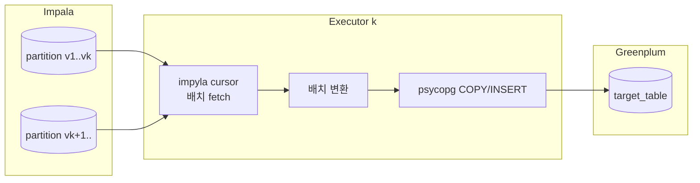
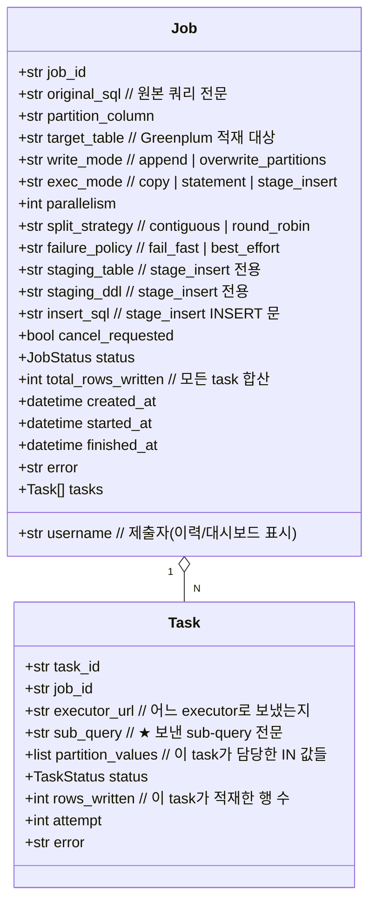
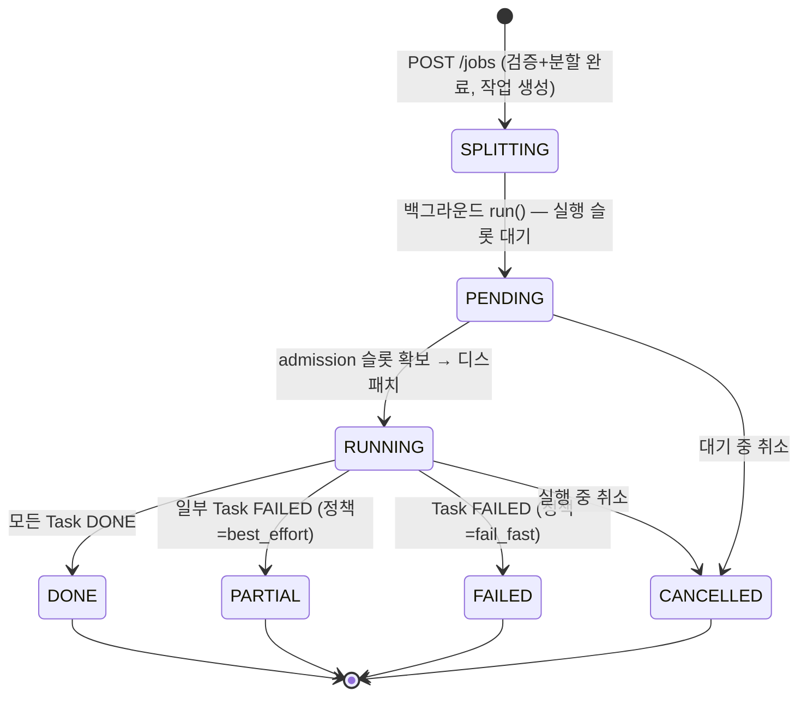
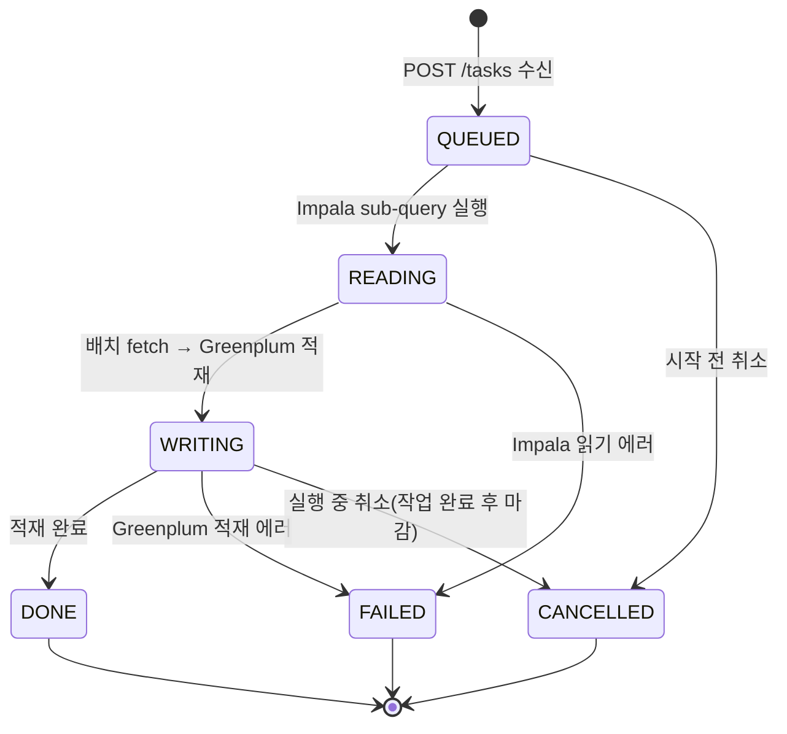
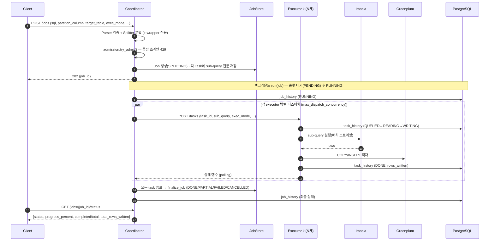
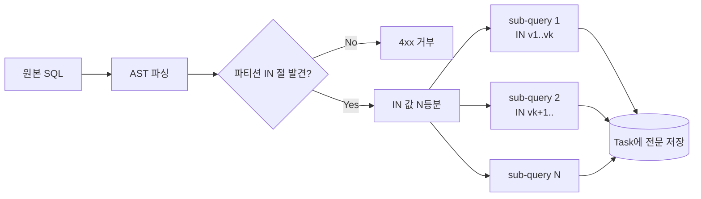
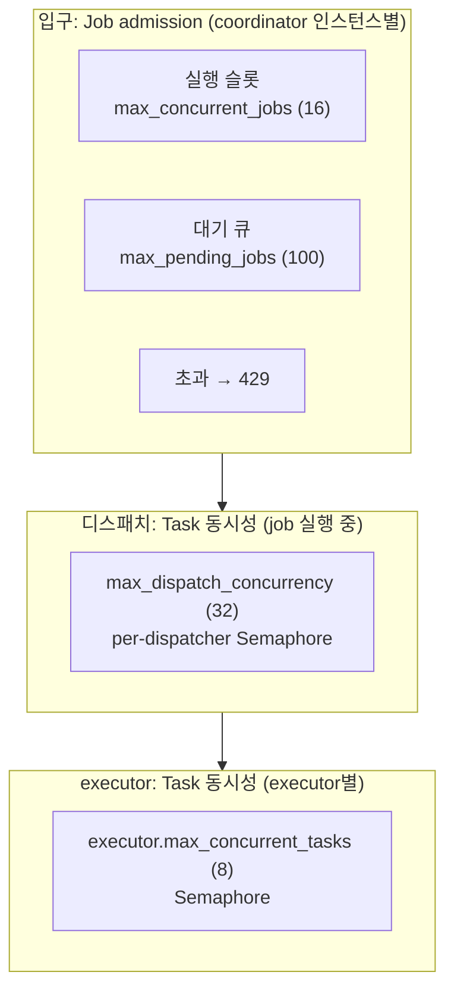

# Distributed Query Executor — 설계 문서

> Coordinator + N Executor 구조로 하나의 **Impala `SELECT` 쿼리**를
> 파티션 컬럼의 `IN` 조건 기준으로 N분할하여 병렬로 읽고,
> 그 결과를 **Greenplum 테이블에 적재**하는 데이터 이관 API.

---

## 1. 개요 (Overview)

- **목적**: 하나의 큰 Impala `SELECT`를 여러 executor로 나누어 병렬로 읽고, 각 executor가 자신이 읽은 데이터를 Greenplum에 적재한다. (**Impala → Greenplum 이관**)
- **분할 기준**: `WHERE <partition_column> IN (v1, v2, ...)` 의 IN 값 리스트를 N등분.
- **소스(read) 방언**: 기본 **Impala**(`sqlglot`의 `hive` 방언). 요청에서 `sql_dialect`로 재정의 가능(`impala`, `postgres` 등).
- **타깃(write)**: **Greenplum**(PostgreSQL 기반) → psycopg `COPY` 또는 INSERT.
- **검증 범위**: 기본은 단순 `SELECT`(strict). `strict_validation=false`로 **JOIN·서브쿼리·GROUP BY 등 복합 쿼리**도 허용(파티션 `IN` 절을 트리 어디서든 탐색).
- **적재 방식**(`exec_mode`): `copy`(기본) / `statement` / `stage_insert` 세 가지.
- **응답 모델**: Job 기반 **비동기** API (job_id 발급 후 polling).
- **동시성**: 입구의 admission control(동시 job 슬롯 + 대기 큐)과 디스패치/executor 단의 task 동시성 상한으로 다층 제어.
- **운영 형태**: 단일 또는 **멀티 coordinator**(공유 PostgreSQL), executor **N대**. 별도 executor 없이 검증하는 **local 모드**도 지원.

### 핵심 특징
1. **결과 병합 불필요**: 각 executor가 서로 다른 파티션 값 집합을 담당해 Greenplum에 **독립적으로 적재**한다. 행이 겹치지 않으므로 merge가 없다. Job의 "결과"는 적재된 **row count 집계 + 상태**다.
2. **양방향 상태 추적**: Coordinator와 Executor **모두** 자신의 작업이 진행 중인지/완료인지 안다. 두 계층 모두 PostgreSQL 이력에 기록한다.
3. **쿼리문 보관**: Coordinator는 원본 SQL과 각 executor에게 보낸 **sub-query 전문(全文)** 을 Job 안에 보관한다(감사·디버깅·대시보드 표시).
4. **데이터는 coordinator를 거치지 않는다**: executor가 Impala→Greenplum로 직접 흘려보내고, coordinator로는 **상태와 row count만** 흐른다.

---

## 2. 전체 아키텍처


### 설계상의 중요한 결정
- **Executor는 read+write를 모두 수행하는 상태 보유 독립 서비스**다. Impala에서 sub-query로 읽어 Greenplum에 적재하고, 인메모리 task 상태를 REST API(`/tasks`)와 자체 대시보드로 노출한다.
- **결과 데이터는 coordinator를 거치지 않는다.** 대량 데이터가 coordinator로 모이지 않아 메모리/네트워크 병목을 피한다. Coordinator로는 **상태와 row count만** 흐른다.
- **Coordinator는 분할한 sub-query 전문을 Task 레코드에 저장**한다.
- **상태/이력은 PostgreSQL로 외부화**할 수 있다(멀티 coordinator·재시작 후에도 조회 가능). 미설정 시 인메모리로만 동작.

---

## 3. 컴포넌트

### 3.1 Coordinator
| 컴포넌트 | 책임 |
|---|---|
| **API Layer** | 작업 제출/조회/취소, 클러스터 상태, 대시보드(`coordinator/app.py`) |
| **Parser** | sqlglot로 SQL 파싱, partition column의 `IN(...)` 노드 탐색, strict/lenient 모드 검증(`parser.py`) |
| **Splitter** | IN 값 리스트를 `parallelism`개로 분할 → sub-query N개 재작성(원문 포맷 보존, `splitter.py`) |
| **JobAdmission** | 동시 실행 슬롯 + 대기 큐 상한(과부하 시 429). `dispatcher.py` |
| **Dispatcher** | sub-query를 executor에 분배, task 단위 동시성(Semaphore) 제어, 상태 polling, 종료 집계(`dispatcher.py`) |
| **JobStore** | Job·Task 상태 + **sub-query 전문 저장**. `memory`(단일) / `postgres`(공유, JSONB) — `job_store.py` |
| **JobHistory** | job 단위 실행 이력 PostgreSQL 기록·조회(`history.py`) |
| **HealthMonitor** | executor `/health`·`/metrics` 주기 폴링, 메트릭 PostgreSQL 기록(`monitor.py`) |
| **Dashboard** | 인라인 HTML 모니터링 UI(`/`) + 설정 마스킹(`dashboard.py`) |

### 3.2 Executor (N개, 각각 독립 프로세스/서비스)
| 컴포넌트 | 책임 |
|---|---|
| **Task API** | `POST /tasks`(수신·실행 시작), `GET /tasks`·`/tasks/{id}`(상태), `/cancel`, `/metrics` — `executor/app.py` |
| **Backend** | `ImpalaToGreenplumBackend`(impyla read → psycopg COPY/INSERT) + `MockBackend`(`backend.py`) |
| **Task Store** | 받은 task 상태(QUEUED→READING→WRITING→DONE/FAILED/CANCELLED) + 누적 `rows_written`(인메모리 dict) |
| **TaskHistory** | task 단위 상태 전이 이력 PostgreSQL 기록·조회(`history.py`) |
| **StatusReporter** | 자기 상태(CPU/메모리/동시 task)를 공유 DB에 self-report(`status.py`) |
| **동시 task 상한** | `executor.max_concurrent_tasks` 세마포어(admission control) |
| **Dashboard** | remote 모드에서 `/`에 노출되는 self-view 대시보드(`dashboard.py`) |

---

## 4. 데이터 흐름 (Impala → Executor → Greenplum)



- executor는 sub-query 결과를 **스트리밍(배치 fetch)** 하여 메모리에 전체를 올리지 않는다.
- 적재는 `COPY`로 배치 단위 수행(INSERT 다건보다 훨씬 빠름). `exec_mode`에 따라 INSERT/staging 경유도 가능(§9).
- 각 executor가 **서로 다른 파티션 값 집합**을 담당 → Greenplum 쓰기 충돌 없음 → 병합 불필요.

---

## 5. 데이터 모델

Coordinator가 보관하는 핵심 구조. **원본 쿼리와 각 executor로 보낸 sub-query 전문을 모두 저장**한다.



> 진행률은 `completed / total`(완료=성공·실패·취소 모두 포함)로 계산한다. `progress_percent`·`completed`·`total`은 Job에서 파생된다.

---

## 6. 상태 머신 (양방향 추적)

### 6.1 Coordinator — Job 상태



- 검증/분할은 `POST /jobs` 핸들러에서 **동기로** 끝나므로(실패 시 즉시 4xx), 작업은 `SPLITTING`으로 생성되고 곧 백그라운드 `run()`이 받는다.
- `run()`은 admission 실행 슬롯이 빌 때까지 job을 `PENDING`(대기 큐)으로 두었다가, 슬롯을 잡으면 `RUNNING`으로 전이한다. (입구에서 용량 초과면 애초에 `429`로 거부되어 작업이 생성되지 않는다 — §10)
- 최종 상태는 `finalize_job()`이 하위 task를 집계해 결정한다: 취소 우선 → 실패 없음=DONE → best_effort=PARTIAL → 그 외=FAILED.

### 6.2 Task 상태 (Coordinator 미러 ↔ Executor 원본)



- **Executor**: 위 상태 + 누적 `rows_written`을 인메모리에 기록, `GET /tasks/{id}`로 노출. 상태 전이마다 `task_history`에 append.
- **Coordinator**: Dispatcher가 polling으로 각 Task 상태/row count를 미러링. Job 상태는 Task 집계로 결정.
- `started_at`/`finished_at`은 executor가 READING 진입·종료 시점에 기록(대시보드 소요 시간 표시).

---

## 7. 요청 처리 시퀀스



> **모니터링은 별개 루프**: Coordinator는 `monitor.health_interval_s`마다 각 executor `/health`·`/metrics`를 폴링하고(`GET /executors`), `monitor.record_interval_s`마다 `executor_health_metrics`에 기록한다. (executor self-report 모드면 coordinator 폴링 대신 executor가 직접 기록 — §12)

---

## 8. 쿼리 분할 (Splitting)

### 입력 예시 (Impala source)
```sql
SELECT user_id, amount, dt
FROM sales
WHERE dt IN ('2026-01-01','2026-01-02', ... ,'2026-06-25')   -- partition_column = dt
  AND region = 'KR'
```

### 절차
1. **파싱**: `sqlglot.parse_one(sql, read=<dialect>)` → AST.
2. **IN 절 탐색**: `partition_column`의 `IN` 노드를 찾는다. 테이블 한정자(`A.dt`)·대소문자는 무시.
3. **검증**:
   - `strict_validation=true`(기본): `GROUP BY`/집계/`DISTINCT`/`JOIN`/`NOT IN`/서브쿼리 IN/IN 누락을 안정적 에러 코드로 거부.
   - `strict_validation=false`(lenient): 복합 쿼리 허용. 트리 어디에 있든 파티션 `IN`을 찾아 그 절만 분할.
4. **값 분할**: IN 값 `[v1..vM]`를 `parallelism`개 청크로 분할 (`contiguous` 기본 / skew 심하면 `round_robin`).
5. **sub-query 재작성**: 각 청크로 **IN 절의 값 목록 구간만** 문자열 치환해 N개의 완전한 SQL 생성(원문 포맷 보존, 폴백으로 AST 재생성).



> **lenient 결과 보존 가정**: 분할 기준 컬럼이 출력 행을 분할하는 위치(주로 소스 스캔 필터)에 있어야 한다. 분할 기준 위에서 집계/DISTINCT 하면 결과가 달라질 수 있다.

---

## 9. 적재 방식 (`exec_mode`)

| `exec_mode` | 동작 | 적합한 경우 |
|---|---|---|
| `copy` (기본) | Impala에서 sub-query를 **읽어** Greenplum에 `COPY FROM STDIN` 배치 적재 | 소스(Impala)/타깃(Greenplum)이 다른 엔진. COPY는 대상 테이블 컬럼과 정확히 일치해야 하며, wrapper는 **행을 반환하는 SELECT** 여야 한다 |
| `statement` | wrapper로 감싼 SQL(예: `INSERT ... SELECT`)을 대상 DB에서 **그대로 실행** | 소스/타깃이 같은 DB(Greenplum). INSERT 컬럼 목록이 매핑을 담당 |
| `stage_insert` | Impala SELECT 결과를 Greenplum **TEMP staging에 COPY** → staging을 `FROM`으로 하는 **INSERT 실행** | SELECT은 Impala, INSERT은 Greenplum처럼 서로 다른 엔진을 INSERT로 연결 |

**write_mode**(`copy`/적재 공통):

| 모드 | 동작 |
|---|---|
| `append` | 단순 COPY로 누적 |
| `overwrite_partitions` | task별 담당 `partition_values`에 대해 같은 트랜잭션에서 먼저 `DELETE WHERE <partition_column> IN (chunk)` 후 COPY → **재실행 멱등성** 확보 |

- 트랜잭션은 task 단위. 실패 시 해당 task만 rollback, 다른 task 무영향.
- 각 task가 disjoint한 partition 집합만 다루므로 executor 간 쓰기 충돌 없음.
- **wrapper_query**: 분할된 각 sub-query를 감싸는 쿼리. `wrapper_placeholder`(기본 `{{SUBQUERY}}`) 자리에 치환. `stage_insert`에서는 placeholder 대신 staging 테이블명을 참조하는 INSERT를 둔다.

> 결과 데이터는 coordinator를 통과하지 않으므로 "결과 병합(merge)" 단계가 없다. Coordinator는 `rows_written`만 합산한다.

---

## 10. 동시성 모델 (admission control)

3개 층위로 과부하를 막는다.



- **Level 1 — Job admission (`JobAdmission`)**: `max_concurrent_jobs`개의 실행 슬롯 + `max_pending_jobs`개의 대기 큐. 슬롯이 비면 즉시 RUNNING, 차면 PENDING으로 줄을 세우고, **실행+대기 합(capacity)을 넘는 요청은 `429 Too Many Requests`(`Retry-After`)로 거부**한다. `max_concurrent_jobs<=0`이면 무제한. 이 한도는 **coordinator 인스턴스별(인메모리)** 이라 멀티 coordinator에선 합산된다.
- **Level 2 — Task 디스패치 동시성**: `max_dispatch_concurrency` 세마포어로 한 coordinator가 동시에 띄우는 executor task 수를 제한(모든 job 통틀어).
- **Level 3 — Executor admission**: `executor.max_concurrent_tasks` 세마포어로 executor 한 대가 동시에 실행하는 task 수를 제한(여러 coordinator의 합산 부하 방어).
- **Coordinator I/O**: `httpx.AsyncClient` + `asyncio.gather`로 executor 비동기 호출(코루틴 동시성).
- **Executor 내부**: impyla/psycopg는 동기 → `run_in_executor(thread_pool, ...)`로 감싸 이벤트 루프 비차단.

> 적정값 산정: 실제 천장은 coordinator 코어가 아니라 **Greenplum 동시 COPY 허용량·Impala 동시 쿼리 슬롯·executor 풀 합**이다. 다운스트림 용량에 맞춰 `executor.max_concurrent_tasks`를 분배하고, `max_dispatch_concurrency`는 그 이상으로 두어 coordinator가 병목이 되지 않게 한다.

---

## 11. API 명세

### 11.1 Coordinator API

```http
POST /jobs
{
  "sql": "SELECT user_id, amount, dt FROM sales WHERE dt IN (...) AND region='KR'",
  "partition_column": "dt",
  "target_table": "public.sales_mirror",
  "write_mode": "overwrite_partitions",   // | "append"
  "exec_mode": "copy",                     // | "statement" | "stage_insert"
  "parallelism": 4,
  "split_strategy": "contiguous",          // | "round_robin"
  "failure_policy": "fail_fast",           // | "best_effort"
  "strict_validation": true,               // false면 복합 쿼리 허용
  "sql_dialect": "hive",                   // 선택(기본 서버 설정)
  "wrapper_query": null,                   // 선택(분할 sub-query 감싸기)
  "username": null,                        // 선택(이력/대시보드 표시)
  "dry_run": false                         // true면 executor 미호출, 생성 쿼리만 반환
}
→ 202 { "job_id": "a1b2c3" }
→ 429 { "detail": "동시 실행/대기 job 한도 초과(capacity=...)" }   // admission 초과
→ 4xx { ... }                                                      // 검증 실패(에러 코드)
```

| 엔드포인트 | 설명 |
|---|---|
| `POST /jobs` | 작업 제출 → `{job_id}`. `dry_run=true`면 쿼리 미리보기(200, 미저장) |
| `GET /jobs` | 작업 목록(상태 필터/limit). 대시보드 "처리중인 Query" |
| `GET /jobs/{id}/status` | **진행 상태/진행률**(경량, 태스크 제외) |
| `GET /jobs/{id}` | 전체 상태(태스크 목록 포함) |
| `GET /jobs/{id}/result` | 적재 결과 요약(`total_rows_written`, per-task) |
| `GET /jobs/{id}/tasks/{task_id}` | 태스크 상세(**sub-query 전문 포함**, 감사/디버깅) |
| `POST /jobs/{id}/cancel` | 작업 취소(각 executor에 전파). 이미 종료면 409 |
| `GET /history` | 과거 실행 이력(PostgreSQL `job_history`, job_id별 최신 1건, 페이징) |
| `GET /executors` | executor 헬스/메트릭 상태 |
| `GET /cluster` | coordinator+executor health/metrics + 실행 중 job 수 한 번에 |
| `GET /health`·`/healthz`·`/metrics` | 헬스 체크/시스템 메트릭 |
| `GET /`·`/config`·`/info` | 대시보드 HTML / 설정(마스킹) / 요약 (`dashboard.enabled`로 토글) |

### 11.2 Executor API

```http
POST /tasks
{ "task_id":"t1", "job_id":"a1b2c3",
  "sub_query":"SELECT ... WHERE dt IN (...)",
  "target_table":"public.sales_mirror", "write_mode":"overwrite_partitions",
  "partition_column":"dt", "partition_values":["'2026-01-01'", ...],
  "exec_mode":"copy", "username":null,
  "staging_table":null, "staging_ddl":null, "insert_sql":null }
→ 202 { "task_id":"t1", "status":"QUEUED" }
```

| 엔드포인트 | 설명 |
|---|---|
| `POST /tasks` | sub-query 수신·비동기 실행 시작 |
| `GET /tasks` | 이 executor 보유 task 목록(상태 필터). self-view 대시보드 |
| `GET /tasks/{id}` | task 상태(`status`, `rows_written`, `error`, `started_at`/`finished_at` 등) |
| `GET /tasks/{id}/result` | 적재 행수 |
| `POST /tasks/{id}/cancel` | task 취소(협조적) |
| `GET /health`·`/healthz`·`/metrics` | 헬스/메트릭(+ 동시 처리 현황) |
| `GET /`·`/history`·`/config`·`/info` | self-view 대시보드 / task 이력 / 설정 / 요약 |

---

## 12. 멀티 coordinator & 상태 외부화

coordinator를 여러 대 둘 수 있다. 공유 PostgreSQL(`history.db_dsn`)로 두 가지를 외부화한다.

| 설정 | 효과 |
|---|---|
| `store.backend=postgres` | **공유 Job 저장소**(`jobs` 테이블, JSONB). 어느 coordinator로 조회/취소가 가도 동작 |
| `executor.self_report=true` | **executor가 자기 상태를 직접 기록**(`executor_status`). coordinator는 읽기만 → 중복 폴링/기록 제거 |

- **상태 조회/결과/취소**가 공유 `jobs` 테이블 기반이라 아무 coordinator로 라우팅돼도 응답한다. 디스패처는 실행 중 스냅샷을 주기적으로 store에 저장한다.
- **cross-coordinator 취소**: 다른 coordinator 소유 작업도 `cancel_requested` 플래그를 공유 store에 세우면 소유 coordinator가 polling 중 감지해 중단한다.
- **executor liveness**: self-report 모드면 executor가 `status_interval_s`마다 `executor_status`에 upsert(heartbeat)하고, coordinator는 `updated_at` 신선도로 liveness를 판정한다.
- **이력 2계층**: 하나의 `job_id` 아래 N개 task가 생기므로 `job_history`(coordinator, job 단위) + `task_history`(각 executor, task 단위, `executor_id`로 식별)로 기록. 제출 시 `username`을 넘기면 두 테이블 모두 기록된다.

> 단일 coordinator면 기본값(`store.backend=memory`, `executor.self_report=false`) 그대로 두면 된다.

---

## 13. Local 모드

`coordinator.executor_mode=local`(또는 `COORDINATOR_EXECUTOR_MODE=local`)이면, executor 프로세스 없이 **coordinator 안에서 백엔드를 직접 호출**한다(`LocalDispatcher`). HTTP 디스패치/원격 없이 적재 동작까지 검증할 수 있고, `greenplum.dsn` 미설정 시 `MockBackend`(실제 I/O 없음)로 폴백한다. admission/상태/이력 흐름은 remote와 동일하다.

| `executor_mode` | 동작 |
|---|---|
| `remote` (기본) | executor 서비스에 HTTP(`POST /tasks`)로 디스패치 |
| `local` | coordinator 프로세스 안에서 백엔드를 직접 호출 |

---

## 14. 모니터링 & 대시보드

- **시스템 메트릭**: 두 서비스 모두 `/metrics`(CPU/메모리/디스크 + 동시 처리). coordinator `HealthMonitor`가 executor를 폴링해 `/executors`·`/cluster`로 제공하고 `monitor.db_dsn` 설정 시 `executor_health_metrics`에 기록.
- **coordinator 대시보드(`/`)**: 인라인 HTML(빌드 불필요), 3초 폴링. 탭 — 처리중인 Query / 실행 이력 / Executor / 환경설정 / 그외 정보.
- **executor self-view 대시보드(`/`)**: remote 모드의 각 executor 프로세스가 자기 task/메트릭/이력을 노출(처리중 Task / 실행 이력 / 환경설정 / 그외 정보). local 모드에선 executor 프로세스가 없으므로 자연히 coordinator 화면만 보인다.
- **로깅**: `/var/log/query-executor/`에 일 단위 롤링. 모든 로그에 `[job_id][task_id]` 컨텍스트 자동 주입. **WARNING 이상은 `*-warn.log`로 분리**(로거 이름 포함 강화 포맷)해 운영 중 문제만 빠르게 추적.

---

## 15. 실패 처리

| 상황 | 처리 |
|---|---|
| 일부 task 실패 | `failure_policy`: `fail_fast`(Job FAILED) / `best_effort`(Job PARTIAL, 성공 task 적재 유지) |
| 적재 중 실패 | task 트랜잭션 rollback → 부분 적재 잔존 없음 |
| 과부하 | admission이 입구에서 `429`로 거부(`Retry-After`) → 클라이언트 재시도 |
| 취소 | Job cancel → 비종료 task의 executor에 `POST /tasks/{id}/cancel` 전파. 협조적 취소(QUEUED는 즉시, 실행 중은 현재 작업 후 `CANCELLED` 마감) |
| 타임아웃 | executor 호출에 `task_timeout_s` 적용 |

> 멱등성: `overwrite_partitions`는 task별 담당 파티션을 먼저 DELETE 후 COPY 하므로 같은 sub-query 재실행이 안전하다. Task에 `attempt` 필드를 두지만 **자동 재시도/executor 재배정 루프는 아직 구현 전(향후)** 이다.

---

## 16. 기술 스택

| 영역 | 선택 |
|---|---|
| 언어/프레임워크 | Python 3.11+, **FastAPI**(coordinator·executor 공통) |
| SQL 파싱 | **sqlglot**(기본 `read="hive"`, 요청별 방언 재정의) |
| Impala 읽기 | **impyla**(HiveServer2, TLS+Kerberos) + 배치 fetch |
| Greenplum 쓰기 | **psycopg** `COPY FROM STDIN` / INSERT |
| Coordinator↔Executor | **httpx**(AsyncClient) |
| 동시성 | asyncio + Semaphore(admission/디스패치) + thread pool(동기 DB 호출 래핑) |
| 상태/이력 저장 | 인메모리 dict 또는 **PostgreSQL**(`jobs`/`job_history`/`task_history`/`executor_status`/`executor_health_metrics`) |
| 대시보드 | 인라인 HTML + vanilla JS(빌드 도구 없음) |
| 배포 | systemd로 coordinator 1 + executor N(`deploy/README.md`) |

---

## 17. 향후 확장

- **자동 재시도/executor 재배정**: task 실패·executor 다운 시 저장된 `sub_query`로 다른 executor에 재전송(`overwrite_partitions` 멱등성 활용).
- **실행 중 즉시 취소**: 백엔드 커서 취소(`cursor.cancel()`) + 트랜잭션 rollback으로 진행 중 Impala/COPY 즉시 중단.
- **callback 기반 상태 전파**: polling 대신 executor→coordinator 콜백으로 부하 제거.
- **집계/GROUP BY 쿼리 지원**: 소스 측 사전 집계 후 적재 또는 적재 후 재집계.
- **IN 절 자동 합성**: IN이 없을 때 Impala `SHOW PARTITIONS`로 값 조회 후 합성.
- **read/write 파이프라이닝 및 COPY 병렬도 튜닝**으로 throughput 최적화.
```
