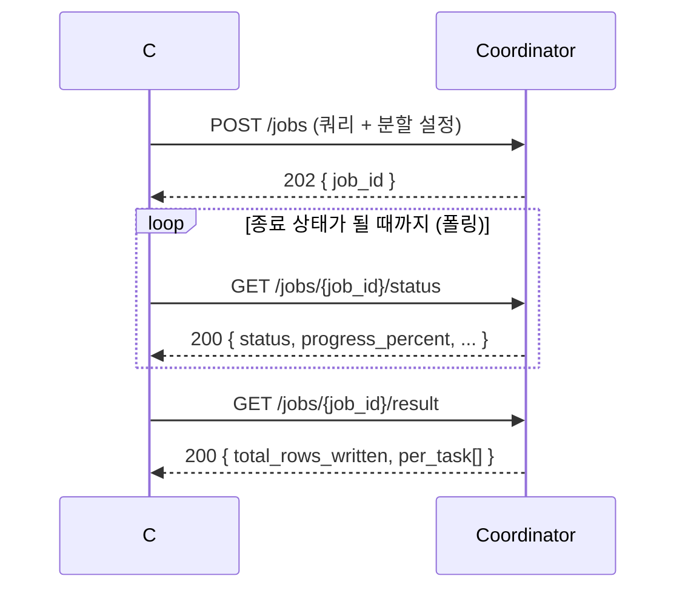
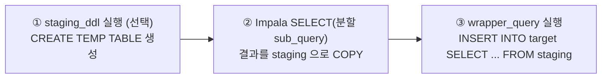

# C# 애플리케이션 연동 가이드 (Coordinator HTTP API)

이 문서는 C# 애플리케이션이 Coordinator 의 HTTP API 를 호출해 쿼리 작업(Job)을 실행하고,
그 작업이 끝날 때까지 기다리며 완료를 확인하고, 도중에 에러가 났을 때 원인을 알아내는 방법을
처음부터 끝까지 설명합니다. 모든 요청·응답은 JSON 이며, 실제 응답 형태를 그대로 실어 두었으니
그대로 따라 하면 됩니다. API 의 전체 목록과 의미는 [README.md](README.md)·[DESIGN.md](DESIGN.md)
를 함께 참고하세요.

---

## 1. 먼저 알아 둘 것 — 비동기 작업 모델

가장 중요한 사실부터 짚겠습니다. Coordinator 는 작업을 **접수만 하고 즉시 응답**합니다.
`POST /jobs` 를 호출하면 작업이 다 끝나길 기다렸다가 결과를 주는 것이 아니라, "접수했습니다"
라는 뜻의 **HTTP 202 Accepted** 와 함께 작업 식별자(`job_id`)만 돌려줍니다. 실제 실행은
백그라운드에서 진행됩니다. 따라서 C# 쪽에서는 다음 두 단계로 일해야 합니다.

1. `POST /jobs` 로 작업을 제출하고 `job_id` 를 받는다.
2. 그 `job_id` 로 상태 조회 API 를 **주기적으로 폴링(polling)** 하면서, 작업이 종료
   상태에 도달할 때까지 기다린다.

또 하나 알아 둘 점은, 실제 데이터(Impala 에서 읽어 Greenplum 으로 적재되는 행)는 Coordinator 를
거치지 않는다는 것입니다. Coordinator 와 주고받는 것은 상태와 적재된 행 수(row count) 뿐이라,
응답은 항상 가볍고 빠릅니다.

Coordinator 의 **기본 주소(base URL)** 는 `http://<coordinator-host>:8088` 입니다
(`coordinator.host`/`coordinator.port` 설정값). 아래의 모든 호출 URL 은 이 기본 주소 뒤에 경로를
붙인 것입니다. 예를 들어 작업 제출은 `http://<coordinator-host>:8088/jobs` 가 됩니다. API 자체에는
인증 계층이 없으므로, 망 분리·방화벽·리버스 프록시 등 네트워크 수준에서 접근을 통제하는 것을
전제로 합니다.

이 가이드에서 사용하는 엔드포인트는 다음과 같습니다. `{base}` 는 위 기본 주소,
`{job_id}` 는 제출 응답으로 받은 작업 식별자입니다.

| 동작 | 메서드 · URL |
|---|---|
| 작업 제출 | `POST {base}/jobs` |
| 진행 상태 폴링(경량) | `GET {base}/jobs/{job_id}/status` |
| 전체 상태(태스크 포함) | `GET {base}/jobs/{job_id}` |
| 결과 요약 | `GET {base}/jobs/{job_id}/result` |
| 작업 취소 | `POST {base}/jobs/{job_id}/cancel` |
| 실패 파티션 재실행 | `POST {base}/jobs/{job_id}/retry` |

아래 그림은 C# 애플리케이션과 Coordinator 사이에 오가는 호출의 전체 흐름입니다.



---

## 2. 1단계 — 작업 제출 (`POST /jobs`)

이 가이드는 클라이언트가 **`stage_insert`(스테이징 INSERT) 모드** 로 적재한다고 가정합니다.
이 모드는 Impala 의 SELECT 결과를 Greenplum 의 임시(staging) 테이블에 먼저 COPY 로 쌓은 뒤,
그 staging 에서 최종 대상 테이블로 `INSERT ... SELECT` 를 실행하는 2단계 방식입니다. 서로 다른
엔진 사이에서 컬럼 변환·형 변환·집계 같은 가공을 INSERT 단계에 맡기고 싶을 때 적합합니다.

`stage_insert` 모드에서는 기본 필드(`sql`·`partition_column`·`target_table`) 외에 **두 필드가
필수** 입니다. `staging_table`(적재할 staging 테이블 이름)과 `wrapper_query`(staging 에서 target
으로 옮기는 INSERT 문)입니다. 이 둘 중 하나라도 빠지면 제출이 **422** 로 거부됩니다(아래 5.2
참고). 세 번째 필드인 `staging_ddl`(staging 테이블을 만드는 DDL)은 **선택** 입니다. 주면
executor 가 COPY 전에 그 DDL 로 테이블을 만들고, **주지 않으면 테이블 생성을 건너뛰고 이미
존재하는 `staging_table` 을 그대로 사용**합니다. 요청 본문 예시는 다음과 같습니다(여기서는
`staging_ddl` 까지 포함한 형태).

```json
{
  "sql": "SELECT id, region, amount, ts FROM sales WHERE region IN ('A', 'B', 'C', 'D')",
  "partition_column": "region",
  "target_table": "warehouse.sales",
  "username": "etl-bot",
  "parallelism": 4,
  "exec_mode": "stage_insert",
  "staging_table": "stg_sales",
  "staging_ddl": "CREATE TEMP TABLE stg_sales (LIKE warehouse.sales)",
  "wrapper_query": "INSERT INTO warehouse.sales (id, region, amount, ts) SELECT id, region, amount, ts FROM stg_sales"
}
```

기본 필드의 의미부터 정리하면, `sql` 은 Impala 에서 읽을 SELECT 쿼리이고, `partition_column`
은 그 쿼리의 `IN` 목록을 N등분해 병렬로 나눌 기준 컬럼이며, `parallelism` 은 몇 갈래로
나눌지(기본 4, 허용 범위 1~128)를 정합니다. `username` 은 실행 주체를 기록용으로 남기는
값으로, 이력 테이블 추적에 쓰이니 가급적 채워 주는 것이 좋습니다.

이 본문을 기본 주소 뒤의 `/jobs` 로 POST 합니다. curl 로 표현하면 다음과 같습니다.

```bash
curl -X POST http://<coordinator-host>:8088/jobs \
  -H "Content-Type: application/json" \
  -d @job.json
```

제출이 받아들여지면 **202** 와 함께 작업 식별자만 돌아옵니다. 이 `job_id`(형식은
`job_<랜덤12자리>`)를 잘 보관했다가 이후 단계에서 사용합니다.

```json
{ "job_id": "job_3f9c2a1b7d4e" }
```

> 실제로 호출하기 전에 쿼리가 올바르게 분할되는지 미리 보고 싶다면 요청에 `"dry_run": true`
> 를 넣으면 됩니다. 이때는 executor 를 호출하지 않고, 작업도 저장하지 않은 채, 분할된
> sub-query 계획만 **200** 으로 돌려줍니다(이 경우 `job_id` 는 발급되지 않습니다).

### 2.1 stage_insert 가 내부에서 하는 일

각 분할된 파티션(task)마다 executor 는 하나의 Greenplum 세션 안에서 다음 세 단계를 순서대로
수행합니다. 이 그림을 머릿속에 두면 각 필드를 어떻게 채워야 하는지 자연스럽게 이해됩니다.
①단계는 `staging_ddl` 을 줬을 때만 실행되고, 생략하면 건너뜁니다.



각 필드의 역할을 다시 한 줄씩 짚으면 이렇습니다. `staging_ddl` 은 ①단계에서 그대로 실행되는
DDL 이므로, 뒤따르는 COPY 가 채울 컬럼을 가진 테이블을 만들어야 합니다. 위 예시처럼
`CREATE TEMP TABLE stg_sales (LIKE warehouse.sales)` 로 대상 테이블의 컬럼을 그대로 복제하면
간단합니다. 이 필드를 생략하면 ①단계를 건너뛰므로, 그때는 `staging_table` 이 **미리 만들어져
있어야** 합니다. `staging_table` 은 그 테이블의 이름으로, COPY 대상과 INSERT 의 `FROM` 절이
모두 이 이름을 가리킵니다. `wrapper_query` 는 ③단계에서 실행되는 INSERT 문으로, **`staging_table`
에서 읽어 `target_table` 로 넣는 완성된 SQL** 이어야 합니다. 이때 `wrapper_query` 는 copy 모드와
달리 sub-query 를 끼워 넣는 자리표시자(`{{SUBQUERY}}`)가 필요 없습니다 — staging 테이블을 직접
참조하는 온전한 INSERT 문을 그대로 적으면 됩니다.

`staging_ddl` 을 생략해 기존 테이블을 재사용할 때는 한 가지 주의가 필요합니다. DDL 로 만드는
`CREATE TEMP TABLE` 은 세션 단위라 task 마다 격리되지만, 미리 만들어 둔 **영구 테이블을 여러
파티션 task 가 공유**하면 COPY 와 INSERT 가 서로 섞일 수 있습니다. 그러므로 DDL 을 생략할
때는 job·파티션마다 고유한 `staging_table` 을 쓰거나, 동시 실행이 겹치지 않도록 호출 측에서
격리를 보장해야 합니다.

한 가지 더, COPY(②단계)는 Impala SELECT 가 돌려준 컬럼 이름을 그대로 사용합니다. 따라서
`sql` 의 SELECT 컬럼과 `staging_table` 의 컬럼이(DDL 로 새로 만들었든, 미리 만들어 둔 기존
테이블이든) **이름·개수·순서로 맞아야** 합니다. `staging_ddl` 로 만드는 `CREATE TEMP TABLE` 은
세션 단위라 각 task 가 자기 세션에서 따로 만들고 쓰므로 여러 파티션이 같은 이름을 써도 서로
충돌하지 않지만, DDL 을 생략하고 기존 영구 테이블을 공유하면 충돌·간섭이 생길 수 있다는 점을
앞서 설명한 대로 유의하세요.

---

## 3. 2단계 — 완료될 때까지 대기 (폴링)

`job_id` 를 받았으면 이제 작업이 끝날 때까지 기다립니다. 이때 **상태 전용 경량 엔드포인트**
인 `GET /jobs/{job_id}/status` 를 폴링하는 것을 권장합니다. 이 응답은 태스크 목록을 빼고
상태·진행률만 담아 가볍기 때문에, 반복 호출에 적합합니다.

```json
{
  "job_id": "job_3f9c2a1b7d4e",
  "status": "RUNNING",
  "progress_percent": 50.0,
  "completed": 2,
  "total": 4,
  "total_rows_written": 18234,
  "error": null,
  "cancel_requested": false,
  "created_at": "2026-06-29T07:01:11.123456+00:00",
  "started_at": "2026-06-29T07:01:11.456789+00:00",
  "finished_at": null
}
```

여기서 핵심은 `status` 값입니다. 작업의 상태는 다음 일곱 가지 중 하나이며, 그중 **종료
상태(terminal)** 네 가지에 도달하면 더 이상 변하지 않으므로 폴링을 멈추면 됩니다.

| status | 종료? | 의미 |
|---|---|---|
| `PENDING` | 아니오 | 실행 슬롯을 기다리는 대기 상태 |
| `SPLITTING` | 아니오 | 쿼리를 분할하고 작업을 준비하는 중 |
| `RUNNING` | 아니오 | 실제 실행 중 |
| `DONE` | **예** | 모든 파티션이 성공 — 완전한 성공 |
| `PARTIAL` | **예** | 일부 파티션만 성공 — 부분 실패(주의) |
| `FAILED` | **예** | 실패 |
| `CANCELLED` | **예** | 취소됨 |

즉 폴링 루프는 `status` 가 `DONE`·`PARTIAL`·`FAILED`·`CANCELLED` 중 하나가 될 때까지 돌면
됩니다. 그중 **온전한 성공은 `DONE` 하나뿐**이라는 점을 기억하세요. `PARTIAL` 은 일부 파티션이
실패한 상태라 성공으로 다뤄서는 안 됩니다.

폴링 간격은 보통 1~3초가 무난합니다. `progress_percent` 와 `completed`/`total` 로 진행 상황을
사용자에게 보여 줄 수 있습니다.

---

## 4. 3단계 — 결과 확인

작업이 `DONE` 에 도달했다면 결과 요약을 `GET /jobs/{job_id}/result` 로 가져옵니다. 전체 적재
행 수와, 분할된 태스크별 적재 행 수를 돌려줍니다.

```json
{
  "job_id": "job_3f9c2a1b7d4e",
  "status": "DONE",
  "total_rows_written": 40567,
  "per_task": [
    { "task_id": "t_a1b2c3d4e5f6", "rows_written": 10120 },
    { "task_id": "t_b2c3d4e5f6a1", "rows_written": 10010 },
    { "task_id": "t_c3d4e5f6a1b2", "rows_written": 10230 },
    { "task_id": "t_d4e5f6a1b2c3", "rows_written": 10207 }
  ]
}
```

태스크별 상태나 각 태스크의 에러까지 자세히 보고 싶다면 `GET /jobs/{job_id}` 를 호출합니다.
이 "전체 뷰" 는 위 정보에 더해 `tasks` 배열을 포함하며, 각 태스크의 상태·적재 행 수·시도
횟수(`attempt`)·에러 메시지를 담고 있습니다.

```json
{
  "job_id": "job_3f9c2a1b7d4e",
  "status": "PARTIAL",
  "completed": 3,
  "total": 4,
  "progress_percent": 75.0,
  "total_rows_written": 30360,
  "error": "1개 파티션 실패",
  "cancel_requested": false,
  "created_at": "2026-06-29T07:01:11.123456+00:00",
  "started_at": "2026-06-29T07:01:11.456789+00:00",
  "finished_at": "2026-06-29T07:03:42.987654+00:00",
  "retry_of": null,
  "tasks": [
    { "task_id": "t_a1b2c3d4e5f6", "executor_url": "http://10.0.0.11:8087", "status": "DONE",   "rows_written": 10120, "attempt": 0, "partition_values": ["A"], "error": null },
    { "task_id": "t_b2c3d4e5f6a1", "executor_url": "http://10.0.0.11:8086", "status": "DONE",   "rows_written": 10010, "attempt": 0, "partition_values": ["B"], "error": null },
    { "task_id": "t_c3d4e5f6a1b2", "executor_url": "http://10.0.0.12:8087", "status": "DONE",   "rows_written": 10230, "attempt": 0, "partition_values": ["C"], "error": null },
    { "task_id": "t_d4e5f6a1b2c3", "executor_url": "http://10.0.0.12:8086", "status": "FAILED", "rows_written": 0,     "attempt": 2, "partition_values": ["D"], "error": "greenplum connection refused" }
  ]
}
```

---

## 5. 에러 확인 방법

에러는 두 갈래로 나누어 생각하면 깔끔합니다. 하나는 **요청 자체가 거부되는 경우**(HTTP 상태
코드로 드러남)이고, 다른 하나는 **작업이 실행 도중 실패하는 경우**(폴링 중 `status` 와 `error`
필드로 드러남)입니다.

### 5.1 실행 도중의 실패 — `status` 와 `error`

폴링 결과 `status` 가 `FAILED` 또는 `PARTIAL` 로 끝났다면 실패한 것입니다. 작업 전체에 대한
한 줄 요약은 최상위 `error` 필드에 담기고, 어떤 파티션이 왜 실패했는지 구체적인 원인은
`GET /jobs/{job_id}` 전체 뷰의 `tasks[].error` 에서 확인합니다(위 4장의 마지막 JSON 에서
`status: "FAILED"` 인 태스크의 `error` 가 그 예입니다). `attempt` 값은 그 태스크가 몇 번
재시도되었는지를 알려 줍니다.

`PARTIAL` 은 특히 주의해야 합니다. 일부 파티션은 성공해 이미 적재되었고 일부만 실패한
상태이기 때문입니다. 이럴 때는 실패한 파티션만 골라 다시 돌리는 재시도 API(아래 6.2)를
쓰면 됩니다.

### 5.2 요청 거부 — HTTP 상태 코드

제출·취소·재시도 호출은 상황에 따라 다음 코드로 거부될 수 있습니다. 각 코드의 의미와 본문
형태를 알아 두면 분기 처리가 쉽습니다.

| 코드 | 언제 | 본문(예) |
|---|---|---|
| **422** | 도메인 검증 실패(잘못된 SQL, 파티션 컬럼 없음 등) | `{ "error_code": "...", "message": "..." }` |
| **422** | 요청 스키마 위반(필수 필드 누락, parallelism 범위 초과 등) | `{ "detail": [ { "loc": [...], "msg": "...", "type": "..." } ] }` |
| **429** | 동시 실행/대기 용량 초과 | `{ "detail": "동시 실행/대기 job 한도 초과(...)" }` + `Retry-After` 헤더 |
| **404** | 존재하지 않는 `job_id` | `{ "detail": "job not found" }` |
| **409** | 이미 종료된 작업을 취소/재시도 | `{ "detail": "이미 종료된 작업입니다(...)" }` |

여기서 422 가 두 종류라는 점에 주의하세요. 우리 애플리케이션이 던지는 **도메인 검증** 오류는
`error_code` 와 `message` 를 담은 형태라 클라이언트가 `error_code` 로 원인을 분기할 수 있습니다.
반면 요청 본문이 스키마에 어긋나 **FastAPI 가 자동으로 막는** 경우(예: `sql` 누락)는 `detail`
배열 형태의 표준 응답이 옵니다. 두 형태를 모두 처리하도록 코드를 작성하는 것이 안전합니다.

도메인 검증 실패(422) 응답의 예입니다. `stage_insert` 모드에서 필수 필드(`staging_table`,
`wrapper_query`)가 빠지면 다음과 같은 응답이 옵니다.

```json
{ "error_code": "STAGE_INSERT_REQUIRES_FIELDS", "message": "stage_insert 모드는 staging_table 과 wrapper_query(INSERT) 가 필요합니다. staging_ddl 은 선택이며, 없으면 기존 staging_table 을 사용합니다(생성 건너뜀)." }
```

용량 초과(429)는 일시적인 거부이므로, 응답의 `Retry-After` 헤더(초 단위)만큼 기다렸다가 다시
제출하면 됩니다.

---

## 6. 취소와 재시도

### 6.1 작업 취소 — `POST /jobs/{job_id}/cancel`

진행 중인 작업을 멈추려면 취소 API 를 호출합니다. 각 executor 로 취소가 전파되고 작업이
`CANCELLED` 로 표시됩니다. 응답은 경량 진행 뷰(3장의 `/status` 와 같은 형태)입니다. 단,
이미 종료된 작업(`DONE`/`FAILED`/`CANCELLED`)을 취소하려 하면 **409** 가 돌아옵니다.

### 6.2 실패 파티션만 재실행 — `POST /jobs/{job_id}/retry`

`PARTIAL`·`FAILED`·`CANCELLED` 로 끝난 작업에서, 실패·취소된 파티션만 모아 **새 작업**으로
다시 실행합니다. 이미 성공한 파티션은 건너뛰므로 중복 적재 걱정이 없습니다. 새 `job_id` 와
함께 **202** 가 돌아옵니다.

```json
{ "job_id": "job_7a8b9c0d1e2f", "retry_of": "job_3f9c2a1b7d4e", "retried_tasks": 1 }
```

새로 받은 `job_id` 로 다시 3장의 폴링을 반복하면 됩니다. 재실행할 실패 태스크가 없거나 아직
종료되지 않은 작업이면 **409** 가 돌아옵니다.

---

## 7. C# 전체 예제

아래는 `HttpClient` 와 `System.Text.Json` 만으로 위 흐름을 모두 구현한 예제입니다. 제출 →
완료 대기(폴링) → 결과 확인 → 에러 처리까지 포함합니다. .NET 6 이상을 기준으로 합니다.

```csharp
using System.Net;
using System.Net.Http.Json;
using System.Text.Json;
using System.Text.Json.Serialization;

// ── 요청/응답 모델 ─────────────────────────────────────────────
public record CreateJobRequest(
    [property: JsonPropertyName("sql")] string Sql,
    [property: JsonPropertyName("partition_column")] string PartitionColumn,
    [property: JsonPropertyName("target_table")] string TargetTable,
    [property: JsonPropertyName("username")] string? Username = null,
    [property: JsonPropertyName("parallelism")] int Parallelism = 4,
    [property: JsonPropertyName("exec_mode")] string ExecMode = "stage_insert",
    // stage_insert 모드: staging_table·wrapper_query 는 필수, staging_ddl 은 선택
    // (생략 시 executor 가 테이블 생성을 건너뛰고 기존 staging_table 사용)
    [property: JsonPropertyName("staging_table")] string? StagingTable = null,
    [property: JsonPropertyName("staging_ddl")] string? StagingDdl = null,
    [property: JsonPropertyName("wrapper_query")] string? WrapperQuery = null)
{
    // null 필드는 직렬화에서 제외(서버 기본값을 그대로 쓰도록).
    public static readonly JsonSerializerOptions Json =
        new() { DefaultIgnoreCondition = JsonIgnoreCondition.WhenWritingNull };
}

public record CreateJobResponse(
    [property: JsonPropertyName("job_id")] string JobId);

// /status 경량 응답(폴링용)
public record JobProgress(
    [property: JsonPropertyName("job_id")] string JobId,
    [property: JsonPropertyName("status")] string Status,
    [property: JsonPropertyName("progress_percent")] double ProgressPercent,
    [property: JsonPropertyName("completed")] int Completed,
    [property: JsonPropertyName("total")] int Total,
    [property: JsonPropertyName("total_rows_written")] long TotalRowsWritten,
    [property: JsonPropertyName("error")] string? Error);

// 태스크 요약(전체 뷰의 tasks[] 항목) — 에러 진단용
public record TaskSummary(
    [property: JsonPropertyName("task_id")] string TaskId,
    [property: JsonPropertyName("executor_url")] string? ExecutorUrl,
    [property: JsonPropertyName("status")] string Status,
    [property: JsonPropertyName("rows_written")] long RowsWritten,
    [property: JsonPropertyName("attempt")] int Attempt,
    [property: JsonPropertyName("partition_values")] List<string> PartitionValues,
    [property: JsonPropertyName("error")] string? Error);

public record JobView(
    [property: JsonPropertyName("job_id")] string JobId,
    [property: JsonPropertyName("status")] string Status,
    [property: JsonPropertyName("error")] string? Error,
    [property: JsonPropertyName("total_rows_written")] long TotalRowsWritten,
    [property: JsonPropertyName("tasks")] List<TaskSummary> Tasks);

// 작업 실행 실패를 알리는 예외(호출 측에서 잡아 처리)
public class JobFailedException : Exception
{
    public string Status { get; }
    public JobView View { get; }
    public JobFailedException(JobView view)
        : base($"작업 {view.JobId} 가 {view.Status} 로 종료되었습니다: {view.Error}")
    {
        Status = view.Status;
        View = view;
    }
}

// ── 클라이언트 ────────────────────────────────────────────────
public class QueryExecutorClient
{
    private static readonly HashSet<string> Terminal =
        new() { "DONE", "PARTIAL", "FAILED", "CANCELLED" };

    private readonly HttpClient _http;

    public QueryExecutorClient(HttpClient http) => _http = http;

    // 1단계: 작업 제출 → job_id 반환. 429(용량 초과)는 Retry-After 만큼 대기 후 재시도.
    public async Task<string> SubmitAsync(CreateJobRequest req, CancellationToken ct = default)
    {
        while (true)
        {
            using var resp = await _http.PostAsJsonAsync("/jobs", req, CreateJobRequest.Json, ct);
            if (resp.StatusCode == HttpStatusCode.Accepted) // 202
            {
                var body = await resp.Content.ReadFromJsonAsync<CreateJobResponse>(cancellationToken: ct);
                return body!.JobId;
            }
            if (resp.StatusCode == HttpStatusCode.TooManyRequests) // 429
            {
                var wait = resp.Headers.RetryAfter?.Delta ?? TimeSpan.FromSeconds(5);
                await Task.Delay(wait, ct);
                continue;
            }
            // 422 등 그 외는 본문을 그대로 실어 예외로 던진다(error_code/message 또는 detail).
            var err = await resp.Content.ReadAsStringAsync(ct);
            throw new HttpRequestException($"작업 제출 실패 ({(int)resp.StatusCode}): {err}");
        }
    }

    // 경량 상태 조회(폴링용)
    public async Task<JobProgress> GetStatusAsync(string jobId, CancellationToken ct = default)
        => (await _http.GetFromJsonAsync<JobProgress>($"/jobs/{jobId}/status", ct))!;

    // 태스크별 에러까지 담은 전체 뷰
    public async Task<JobView> GetJobAsync(string jobId, CancellationToken ct = default)
        => (await _http.GetFromJsonAsync<JobView>($"/jobs/{jobId}", ct))!;

    // 2단계: 종료 상태가 될 때까지 폴링. DONE 이면 전체 뷰를 반환, 그 외 종료는 예외.
    public async Task<JobView> WaitForCompletionAsync(
        string jobId, TimeSpan? pollInterval = null, CancellationToken ct = default)
    {
        var interval = pollInterval ?? TimeSpan.FromSeconds(2);
        while (true)
        {
            var p = await GetStatusAsync(jobId, ct);
            if (Terminal.Contains(p.Status))
            {
                var view = await GetJobAsync(jobId, ct); // 종료 후 태스크 상세까지 확보
                if (p.Status == "DONE") return view;
                throw new JobFailedException(view);      // PARTIAL/FAILED/CANCELLED
            }
            await Task.Delay(interval, ct); // 아직 진행 중 — 잠시 후 다시 확인
        }
    }

    // 실패 파티션만 재실행 → 새 job_id
    public async Task<string> RetryAsync(string jobId, CancellationToken ct = default)
    {
        using var resp = await _http.PostAsync($"/jobs/{jobId}/retry", null, ct);
        resp.EnsureSuccessStatusCode();
        var body = await resp.Content.ReadFromJsonAsync<CreateJobResponse>(cancellationToken: ct);
        return body!.JobId;
    }

    // 작업 취소
    public async Task CancelAsync(string jobId, CancellationToken ct = default)
    {
        using var resp = await _http.PostAsync($"/jobs/{jobId}/cancel", null, ct);
        resp.EnsureSuccessStatusCode();
    }
}

// ── 사용 예 ───────────────────────────────────────────────────
public static class Example
{
    public static async Task RunAsync()
    {
        // HttpClient 의 Timeout 은 "개별 호출" 기준으로 짧게 둔다(작업 전체 시간이 아님).
        var http = new HttpClient
        {
            BaseAddress = new Uri("http://coordinator-host:8088"),
            Timeout = TimeSpan.FromSeconds(30),
        };
        var client = new QueryExecutorClient(http);

        var req = new CreateJobRequest(
            Sql: "SELECT id, region, amount, ts FROM sales WHERE region IN ('A','B','C','D')",
            PartitionColumn: "region",
            TargetTable: "warehouse.sales",
            Username: "etl-bot",
            Parallelism: 4,
            ExecMode: "stage_insert",
            StagingTable: "stg_sales",
            StagingDdl: "CREATE TEMP TABLE stg_sales (LIKE warehouse.sales)",
            WrapperQuery: "INSERT INTO warehouse.sales (id, region, amount, ts) " +
                          "SELECT id, region, amount, ts FROM stg_sales");

        // 작업 전체에 대한 상한 시간은 CancellationToken 으로 건다(예: 30분).
        using var cts = new CancellationTokenSource(TimeSpan.FromMinutes(30));

        try
        {
            var jobId = await client.SubmitAsync(req, cts.Token);
            Console.WriteLine($"제출됨: {jobId}");

            var result = await client.WaitForCompletionAsync(
                jobId, TimeSpan.FromSeconds(2), cts.Token);

            Console.WriteLine($"완료(DONE): {result.TotalRowsWritten} 행 적재");
        }
        catch (JobFailedException ex)
        {
            // PARTIAL/FAILED/CANCELLED — 어떤 파티션이 왜 실패했는지 태스크별로 출력
            Console.WriteLine($"작업 실패: {ex.Status} ({ex.View.Error})");
            foreach (var t in ex.View.Tasks.Where(t => t.Status == "FAILED"))
                Console.WriteLine($"  - {string.Join(",", t.PartitionValues)}: {t.Error}");

            // 부분 실패라면 실패 파티션만 재실행할 수 있다
            if (ex.Status is "PARTIAL" or "FAILED")
            {
                var retryId = await client.RetryAsync(ex.View.JobId);
                Console.WriteLine($"재실행 작업: {retryId}");
            }
        }
    }
}
```

---

## 8. 주의사항

마지막으로, 운영에서 실수하기 쉬운 지점을 모아 둡니다.

- **202 는 "완료"가 아니라 "접수"입니다.** 반드시 폴링으로 종료 상태를 확인해야 합니다.
  202 응답만 받고 성공으로 처리하면 안 됩니다.
- **폴링은 경량 엔드포인트(`/jobs/{id}/status`)로** 하세요. 태스크 목록까지 담긴 전체
  뷰(`/jobs/{id}`)는 종료 후 한 번, 에러 진단이 필요할 때만 호출하는 것이 좋습니다.
- **성공은 `DONE` 하나뿐입니다.** `PARTIAL` 은 일부만 적재된 부분 실패이므로 성공으로
  다루지 말고, 필요하면 `/retry` 로 실패 파티션만 다시 돌리세요.
- **429 는 `Retry-After` 를 존중**해 그 시간만큼 기다렸다 재시도하세요. 즉시 반복 호출하면
  거부만 반복됩니다.
- **422 는 두 형태**가 있습니다(도메인 검증의 `error_code`/`message`, 스키마 위반의 `detail`).
  둘 다 처리하도록 하세요.
- **HttpClient 의 Timeout 은 개별 호출 기준으로 짧게** 두고, 작업 전체의 상한 시간은
  `CancellationToken` 으로 거세요. 작업이 수십 분 걸릴 수 있으므로, HttpClient.Timeout 으로
  전체를 묶으면 정상 작업도 끊깁니다.
- **여러 Coordinator 뒤에 로드밸런서를 둔다면 상태 공유가 필요합니다.** 기본
  `store.backend=memory` 에서는 작업을 접수한 그 Coordinator 만 상태를 압니다. 제출과 폴링이
  서로 다른 인스턴스로 라우팅되면 폴링이 **404** 를 받을 수 있습니다. 이런 구성에서는
  `store.backend=postgres` 와 공유 `history.db_dsn` 을 설정해 어느 인스턴스로 가도 조회되게
  하세요(자세한 내용은 [README.md](README.md)·[PERFORMANCE.md](PERFORMANCE.md) 참고).
- **stage_insert 의 필수 필드는 `staging_table` 과 `wrapper_query` 두 개**입니다. 둘 중 하나라도
  빠지면 제출이 422(`STAGE_INSERT_REQUIRES_FIELDS`)로 거부됩니다. `staging_ddl` 은 선택으로,
  생략하면 executor 가 테이블 생성을 건너뛰고 **이미 존재하는** `staging_table` 을 사용합니다.
  이때는 영구 staging 테이블을 여러 task 가 공유하지 않도록(job·파티션별 고유 테이블 등) 격리를
  보장하세요 — 그렇지 않으면 동시 COPY/INSERT 가 서로 간섭할 수 있습니다.
- **stage_insert 의 컬럼을 맞추세요.** `sql` 의 SELECT 컬럼과 `staging_ddl` 로 만든 임시 테이블
  컬럼이 이름·개수·순서로 일치해야 COPY 가 성공합니다(`CREATE TEMP TABLE ... (LIKE 대상)` 이
  가장 안전). `wrapper_query` 의 INSERT 는 `staging_table` 에서 읽어 `target_table` 로 넣는
  완성된 문장이어야 하며, copy 모드와 달리 `{{SUBQUERY}}` 자리표시자를 쓰지 않습니다.
- **재시도는 멱등적으로 안전하게** 설계되어 있습니다. 성공한 파티션은 건너뛰고 실패한
  파티션만 새 작업으로 복제하므로, 중복 적재 없이 안전하게 재실행됩니다. stage_insert 는 임시
  테이블이 세션 단위라 task 가 실패하면 그 세션의 staging 도 함께 사라지므로, 재실행 시 깨끗한
  상태에서 다시 시작합니다.
- **취소·재시도의 409** 는 정상적인 거부 신호입니다(이미 종료된 작업을 취소하거나, 재실행할
  실패 태스크가 없는 경우). 예외로 처리하되 치명적 오류로 다루지 마세요.
- **`username` 을 채워 두세요.** 이력 테이블(`job_history`/`task_history`) 추적과 감사에
  쓰이므로, 호출 주체를 식별할 수 있게 해 두면 운영이 편합니다.
