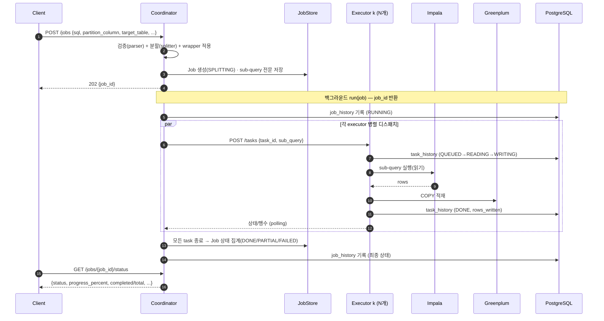

# query-executor

Coordinator + N Executor 구조의 API. 하나의 Impala `SELECT` 쿼리를 파티션 컬럼의
`IN` 목록 기준으로 분할하여, 각 부분집합을 병렬로 읽어 Greenplum에 적재한다.
자세한 설계는 [DESIGN.md](DESIGN.md) 참고.

## 아키텍처


## 동작 흐름



> 모니터: Coordinator는 위와 별개로 `monitor.health_interval_s` 마다 각 executor의
> `/health`·`/metrics`(CPU/메모리/디스크)를 폴링해 보유하고(`GET /executors`),
> `monitor.record_interval_s` 마다 PostgreSQL(`executor_health_metrics`)에 기록한다.

## 디렉터리 구조

```
core/          # 공용: 설정 로더 + 설정 + 로깅 (coordinator·executor 공유)
  config_loader.py  config.properties + config.yml(${변수:기본값}) 치환 로더
  config.py         Settings (config 파일 기반 전역 설정)
  logging.py        일 단위 롤링 파일 로깅 (파일명_YYYYMMDD.log)
coordinator/   # FastAPI: 검증 → 분할 → 디스패치 → 상태 추적
  parser.py      1단계 검증 + IN 절 탐지 (sqlglot, hive 방언)
  splitter.py    IN 목록을 N개의 완전한 sub-query로 분할
  dispatcher.py  executor 비동기 디스패치 + 상태 polling (httpx)
  monitor.py     executor /health·/metrics 폴링 + PostgreSQL 메트릭 기록
  app.py         REST API (POST /jobs, .../result, /executors, /health, /metrics)
  __main__.py    실행 진입점 (python -m coordinator)
executor/      # FastAPI: Impala 읽기 → Greenplum COPY 적재, task 상태 노출
  backend.py     ImpalaToGreenplumBackend (impyla + psycopg) + MockBackend
  app.py         REST API (POST /tasks, GET /tasks/{id}, /health, /metrics)
  __main__.py    실행 진입점 (EXECUTOR_PORT=8001 python -m executor)
packaging/config/  # config.properties + config.yml 기본값
tests/         # coordinator 검증 + 라이프사이클 테스트
```

## 설정 (config.properties + config.yml)

argus-catalog backend와 동일한 방식이다. `config.properties`(Java 스타일 key=value)의
값으로 `config.yml`의 `${변수:기본값}` 자리표시자를 치환해 로드한다.

- 설정 디렉터리: `/etc/query-executor/` (환경변수 `QUERY_EXECUTOR_CONFIG_DIR` 로 변경)
- 로컬 개발 시: `QUERY_EXECUTOR_CONFIG_DIR=packaging/config` 로 저장소 기본값 사용
- 핵심 항목: `coordinator.executors`, `impala.*`, `greenplum.dsn`, `copy.batch_size`
- `impala.host` 와 `greenplum.dsn` 이 모두 설정되면 실제 `ImpalaToGreenplumBackend`,
  아니면 `MockBackend`(실제 I/O 없음)로 폴백
- Impala는 **TLS + Kerberos(GSSAPI)**: `impala.use_ssl`/`impala.ca_cert`,
  `impala.auth_mechanism=GSSAPI`/`impala.kerberos_service_name`. 티켓은 OS 자격증명
  캐시(KRB5CCNAME)를 사용 → systemd kinit 서비스/타이머로 keytab 갱신 ([deploy/README.md](deploy/README.md))
- 로깅: `/var/log/query-executor/` 에 일 단위 롤링 (`코드/argus 공통 포맷`)
- 모니터링: 두 서비스 모두 `/health`·`/metrics`(CPU·메모리·디스크) 제공. coordinator는
  executor `/health`·`/metrics` 를 주기 폴링(`GET /executors`)하고 `monitor.db_dsn`
  설정 시 CPU/메모리 사용량을 PostgreSQL(`monitor.table`)에 주기 기록

## 실행 환경 (RHEL 9.2)

RHEL 9.2 기본 Python은 3.9이므로, **Python 3.11+** 를 별도 설치한다.

```bash
# 1) Python 3.11 및 빌드 도구 설치
sudo dnf install -y python3.11 python3.11-pip python3.11-devel

# 2) (executor를 실제 Impala/Greenplum에 연결할 때만) impyla + Kerberos/TLS 의존성
#    Impala 는 TLS + Kerberos(GSSAPI) 환경이다.
sudo dnf install -y gcc gcc-c++ make python3.11-devel \
    krb5-workstation krb5-devel cyrus-sasl-devel cyrus-sasl-gssapi
```

## 설치 및 테스트

```bash
python3.11 -m venv .venv
.venv/bin/pip install --upgrade pip

# coordinator + 테스트 의존성
.venv/bin/pip install -r requirements-dev.txt

# 테스트 실행 (실제 DB 불필요: MockBackend / FakeRunner 사용)
.venv/bin/python -m pytest -q
```

executor를 실제 클러스터에 연결하려면 드라이버를 추가 설치한다:

```bash
.venv/bin/pip install -r requirements-executor.txt
```

## 의존성 파일

| 파일 | 용도 |
|---|---|
| `requirements.txt` | coordinator 런타임(fastapi, uvicorn, sqlglot, httpx, pydantic) |
| `requirements-executor.txt` | executor 런타임 + DB 드라이버(impyla, psycopg) |
| `requirements-dev.txt` | 개발/테스트(pytest, pytest-asyncio) |

## 로컬 실행

설정은 `packaging/config/` 의 기본값을 사용한다(`coordinator.executors`, 포트 등).

```bash
# executor 기동 (포트는 EXECUTOR_PORT 로 지정). 여러 개 띄울 수 있다.
QUERY_EXECUTOR_CONFIG_DIR=packaging/config EXECUTOR_PORT=8001 \
  .venv/bin/python -m executor &
QUERY_EXECUTOR_CONFIG_DIR=packaging/config EXECUTOR_PORT=8002 \
  .venv/bin/python -m executor &

# coordinator 기동 (host/port/executors 는 config 에서 읽음)
QUERY_EXECUTOR_CONFIG_DIR=packaging/config \
  .venv/bin/python -m coordinator
```

## 작업 상태 확인 & 이력

작업을 제출하면 `job_id` 를 받고, 그 `job_id` 로 진행 상태를 조회한다.

```bash
# 1) 제출 → job_id
JOB=$(curl -s localhost:8000/jobs -H 'content-type: application/json' \
  -d '{"sql":"SELECT a, dt FROM t WHERE dt IN ('\''1'\'','\''2'\'')","partition_column":"dt","target_table":"public.t"}' \
  | python -c 'import sys,json;print(json.load(sys.stdin)["job_id"])')

# 2) 진행 상태(경량) 조회
curl -s localhost:8000/jobs/$JOB/status
# {"job_id":"...","status":"RUNNING","progress_percent":50.0,"completed":1,"total":2, ...}

# 전체 상태(태스크 포함)
curl -s localhost:8000/jobs/$JOB
```

| 엔드포인트 | 설명 |
|---|---|
| `POST /jobs` | 작업 제출 → `{job_id}` 반환 |
| `GET /jobs/{job_id}/status` | **진행 상태/진행률**(경량, 태스크 제외) |
| `GET /jobs/{job_id}` | 전체 상태(태스크 목록 포함) |
| `GET /jobs/{job_id}/result` | 적재 결과 요약 |

### 실행 이력(PostgreSQL) — 2계층

하나의 `job_id` 아래 N개의 executor task 가 생기므로, 이력도 두 계층으로 기록된다.

| 테이블 | 기록 주체 | 단위 | 기록 시점 |
|---|---|---|---|
| `job_history` (`history.table`) | **Coordinator** | job 1건 | `run()` 시작(RUNNING)·종료(DONE/PARTIAL/FAILED) |
| `task_history` (`history.task_table`) | **각 Executor** | task N건 (job_id+task_id) | 상태 전이마다(QUEUED/READING/WRITING/DONE/FAILED) |

- coordinator의 `run(job)` 은 `job_id` 를 반환하고 job 단위 이력을 남긴다.
- 각 executor 는 자신이 처리하는 task 의 상태 전이를 `task_history` 에 append 한다
  (`executor_id` 컬럼으로 어느 executor 인지 식별). **따라서 executor 호스트에도 PG
  자격증명이 필요**하다.
- 기록 대상 DB는 `history.db_dsn`(미설정 시 `monitor.db_dsn`) 공유. 둘 다 없으면 비활성
  (경고 로그). 스키마: `packaging/config/history-schema.sql`,
  `packaging/config/task-history-schema.sql`.

```sql
-- 특정 job 의 executor task 진행 이력 추적
SELECT recorded_at, task_id, executor_id, status, rows_written
FROM task_history WHERE job_id = '<job_id>' ORDER BY recorded_at;
```

## API 문서 (Swagger)

두 서비스 모두 FastAPI 기반 대화형 문서를 제공한다.

| 경로 | 설명 |
|---|---|
| `/docs` | Swagger UI (대화형 API 문서) |
| `/redoc` | ReDoc 문서 |
| `/openapi.json` | OpenAPI 3 스키마 |

```bash
# 브라우저에서 http://localhost:8000/docs (coordinator), http://localhost:8001/docs (executor)
```

```bash
curl -s localhost:8000/jobs -H 'content-type: application/json' -d '{
  "sql": "SELECT user_id, amount, dt FROM sales WHERE dt IN ('\''2026-01-01'\'','\''2026-01-02'\'') AND region='\''KR'\''",
  "partition_column": "dt",
  "target_table": "public.sales_mirror",
  "write_mode": "overwrite_partitions",
  "parallelism": 2
}'
```

## 배포 (systemd, RHEL 9.2)

coordinator 1개 + executor 다수를 systemd 서비스로 운영하는 구성과 설치 스크립트는
[`deploy/README.md`](deploy/README.md) 참고.

```bash
sudo ./deploy/install.sh
sudo systemctl enable --now query-executor@8001 query-executor@8002
sudo systemctl enable --now query-coordinator
```

## 쿼리 분할 모드

요청(`POST /jobs`)에서 두 옵션으로 분할 동작을 제어한다.

| 필드 | 기본 | 설명 |
|---|---|---|
| `strict_validation` | `true` | `true`: 단순 SELECT만 허용(아래 1단계 규칙). `false`: **복합 쿼리**(중첩 서브쿼리/JOIN/GROUP BY/`unnest` 등)를 허용하고 파티션 컬럼의 `IN` 절을 트리 어디서든 찾아 분할 |
| `sql_dialect` | 서버 기본(`query.sql_dialect`, 기본 `hive`) | 파싱 방언. 예: `hive`, `impala`, `postgres`(Greenplum) |
| `wrapper_query` | (없음) | 분할된 sub-query를 감싸는 쿼리. `wrapper_placeholder` 자리에 각 sub-query가 치환된다 |
| `wrapper_placeholder` | `{{SUBQUERY}}` | `wrapper_query` 안에서 sub-query가 들어갈 자리표시자 |

### 감싸는 쿼리(wrapper_query)
분할된 각 sub-query를 다른 쿼리로 감싸 executor가 실행하게 한다. placeholder는 SQL과
충돌이 적은 `{{SUBQUERY}}` 가 기본이며(`wrapper_placeholder`로 변경 가능), 여러 번
등장하면 모두 치환된다. 괄호 등은 wrapper 작성자가 직접 둔다.

```bash
curl -s localhost:8000/jobs -H 'content-type: application/json' -d '{
  "sql": "SELECT a, dt FROM sales WHERE dt IN ('\''1'\'','\''2'\'','\''3'\'','\''4'\'')",
  "partition_column": "dt",
  "target_table": "staging.sales_part",
  "parallelism": 2,
  "wrapper_query": "INSERT INTO staging.sales_part SELECT * FROM ({{SUBQUERY}}) src"
}'
```

위 요청은 각 task에 대해 다음과 같이 감싸진 쿼리를 생성한다(예: task #1):

```sql
INSERT INTO staging.sales_part SELECT * FROM (SELECT a, dt FROM sales WHERE dt IN ('1', '2')) src
```

> `wrapper_query` 에 placeholder가 없으면 422(`WRAPPER_PLACEHOLDER_MISSING`)를 반환한다.

### 1단계(strict=true) 범위
단순 `SELECT`(+ `ORDER BY` / `LIMIT`)만 지원. GROUP BY, 집계 함수, DISTINCT, JOIN,
NOT IN, 서브쿼리 IN, 파티션 `IN` 누락을 안정적인 에러 코드로 거부한다.

### 복합 쿼리(strict=false)
중첩 서브쿼리의 WHERE에 있는 파티션 `IN`(예: `A.REGION_NO IN ('R1','R2','R3')`)을
기준으로 분할한다. 분할 시 **해당 IN 절만** 부분집합으로 교체되고 다른 조건
(예: `A.STORE_ID IN (...)`, `BETWEEN ...`)은 그대로 보존된다.

`partition_column` 은 테이블 한정자 유무와 무관하게 매칭된다. 즉 `REGION_NO` 로 지정해도
SQL의 `A.REGION_NO` 에 매칭된다(대소문자도 무관). 단, 서로 다른 테이블에 같은 이름의
`IN` 절이 여러 개 있으면 먼저 발견된 것이 선택되므로 그럴 땐 컬럼명이 유일해야 한다.

```bash
curl -s localhost:8000/jobs -H 'content-type: application/json' -d '{
  "sql": "SELECT ... WHERE ... A.REGION_NO IN ('R1','R2','R3') ...",
  "partition_column": "REGION_NO",
  "target_table": "public.orders_mirror",
  "parallelism": 3,
  "sql_dialect": "postgres",
  "strict_validation": false
}'
```

> ⚠️ 결과 보존 가정: 분할 기준 컬럼이 **출력 행을 분할하는 위치**(주로 소스 스캔 필터)에
> 있어야 한다. 분할 기준 컬럼 위에서 집계/DISTINCT 하는 쿼리는 결과가 달라질 수 있다.

executor는 기본값이 `MockBackend` 라서 실제 DB 없이도 API를 구동할 수 있다.
