# Distributed Query Executor

Distributed Query Executor 는 큰 데이터를 빠르게 옮기기 위한 분산 쿼리 실행기입니다. 한 대가 모든
일을 하는 대신, 요청을 받아 작업을 나눠 주는 **coordinator** 와 실제로 데이터를 읽고 쓰는
여러 대의 **executor** 로 구성됩니다. 핵심 아이디어는 단순합니다. 하나의 Impala `SELECT` 을 그대로
한 번에 실행하는 대신, 파티션 컬럼(날짜처럼 데이터를 미리 나눠 둔 컬럼)의 `IN` 목록을 기준으로
쿼리를 N조각으로 쪼개고, 각 조각을 여러 executor 가 동시에 읽어 Greenplum/WarehousePG 에 적재합니다
(**Impala → Greenplum/WarehousePG 이관**). 데이터 자체는 coordinator 를 거치지 않고 각 executor 가 Impala 에서
직접 읽어 Greenplum/WarehousePG 으로 흘려보내며, coordinator 로는 상태와 행 수 같은 가벼운 정보만 오갑니다.

이 문서는 **소개 + 빠른 시작 + 핵심 개념 요약**에 집중하는 입구입니다. 깊은 내용은 아래 문서로
이어집니다.

| 문서 | 내용 |
|---|---|
| [`docs/DESIGN.md`](docs/DESIGN.md) | 설계 근거·내부 동작 심화 |
| [`docs/GUIDE.md`](docs/GUIDE.md) | 실행 모드 사용 가이드(stage_insert / query-execute / local_stage 등) |
| [`docs/INTEGRATION.md`](docs/INTEGRATION.md) | 애플리케이션(예: C#)에서 HTTP API 로 작업을 실행·확인하는 클라이언트 연동 |
| [`docs/PERFORMANCE.md`](docs/PERFORMANCE.md) | 성능·수평 확장·고가용성 운영 |
| [`packaging/README.md`](packaging/README.md) | 배포·패키징·에어갭 설치 |

## 아키텍처

Client 가 쿼리를 보내면 coordinator 가 그것을 받아 검증·분할한 뒤, 오른쪽의 여러 executor 에게
일을 나눠 줍니다. 데이터는 coordinator 를 거치지 않고 각 executor 가 Impala 에서 직접 읽어 Greenplum/WarehousePG
으로 흘려보냅니다.



Coordinator 는 `POST /jobs` 를 받자마자 쿼리를 검증(parser)하고 잘게
나눈(splitter) 뒤 곧바로 `job_id` 를 돌려주고(202), 실제 적재는 백그라운드에서 진행됩니다. 각
executor 는 받은 sub-query 를 Impala 에서 읽어 Greenplum/WarehousePG 에 적재하며 상태·행수만 coordinator 로
보고합니다. 모든 task 가 끝나면 coordinator 가 최종 상태(DONE/PARTIAL/FAILED/CANCELLED)를 집계합니다.
클라이언트는 나중에 `job_id` 로 진행 상태를 조회하면 됩니다. 이와 별개로 coordinator 는
`monitor.health_interval_s` 마다 각 executor 의 `/health`·`/metrics`(CPU·메모리·디스크)를 폴링해
`GET /executors` 로 보여 주고, `monitor.record_interval_s` 마다 PostgreSQL 에 기록합니다.

## 빠른 시작

RHEL 9.2 기본 Python 3.9 를 그대로 사용합니다. 권장 방식은 가상환경(`.venv`)을 만들어 그 안에
의존성을 설치하는 것입니다. 테스트는 `MockBackend`/`FakeRunner` 같은 가짜 구현을 쓰므로 실제 DB
없이도 돌아갑니다.

```bash
python3.9 -m venv .venv
.venv/bin/pip install --upgrade pip
.venv/bin/pip install -r requirements-dev.txt     # coordinator + 테스트 의존성

# 테스트 (실제 DB 불필요)
.venv/bin/python -m pytest -q
```

executor 를 실제 Impala/Greenplum(WarehousePG) 에 붙이려면 드라이버를 추가로 설치합니다. impyla 의 SASL/TLS
빌드에는 시스템 패키지가 필요합니다.

```bash
sudo dnf install -y gcc gcc-c++ make python3-devel cyrus-sasl-devel   # 빌드 도구(이미 있으면 생략)
.venv/bin/pip install -r requirements-executor.txt
```

설치를 마쳤다면 로컬에서 서비스를 띄웁니다. 설정은 `config/` 의 기본값을 그대로 씁니다. executor 를
한 대 이상 먼저 띄우고(포트는 `EXECUTOR_PORT` 로 지정, 포트만 달리해 여러 대 가능), 그다음
coordinator 를 띄웁니다.

```bash
QUERY_EXECUTOR_CONFIG_DIR=config EXECUTOR_PORT=8087 .venv/bin/python -m executor &
QUERY_EXECUTOR_CONFIG_DIR=config EXECUTOR_PORT=8086 .venv/bin/python -m executor &
QUERY_EXECUTOR_CONFIG_DIR=config .venv/bin/python -m coordinator
```

의존성은 역할에 따라 세 파일로 나뉩니다. 지휘자만 띄우면 첫째, 실제 데이터를 다루는 executor 까지
띄우면 둘째, 개발/테스트는 셋째가 필요합니다.

| 파일 | 용도 |
|---|---|
| `requirements.txt` | coordinator 런타임(fastapi, uvicorn, sqlglot, httpx, pydantic) |
| `requirements-executor.txt` | executor 런타임 + DB 드라이버(impyla, psycopg) |
| `requirements-dev.txt` | 개발/테스트(pytest, pytest-asyncio) |

## 디렉터리 구조

소스는 src 레이아웃이라 실행 시 `PYTHONPATH=src` 가 필요합니다(테스트는 루트 `conftest.py` 가
처리). 패키지는 크게 공용(`core`), 지휘자(`coordinator`), Executor(`executor`) 로 나뉩니다.

```
src/
  core/          # 공용: 설정 로더/설정/로깅/HTTP 로깅/메트릭 (coordinator·executor 공유)
  coordinator/   # FastAPI: 검증(parser) → 분할(splitter) → admission → 디스패치 → 상태 추적
  executor/      # FastAPI: Impala 읽기 → Greenplum 적재(backend), task 상태 노출
bin/             # 런처·설치 스크립트(install·start/stop/status·env·check-prereqs·*-tui·migrate-config)
config/          # config.properties + config.yml 기본값 + templates/ + 스키마(*.sql)
templates/       # 쿼리 템플릿(<template_id>/manifest.yml + *.sql.j2)
customs/         # 사이트 커스텀 코드(customs.query_funcs.* — 커스텀 쿼리 함수)
packaging/       # 배포·패키징: README.md + wheels/(에어갭 휠 번들 py39·py311)
tests/           # pytest (검증/라이프사이클/admission/대시보드)
```

## 설정

설정은 두 파일로 나뉩니다. `config.properties`(Java 스타일 `key=value`)의 값으로 `config.yml` 의
`${변수:기본값}` 자리표시자를 채워 최종 설정을 만듭니다. 설정 디렉터리는 기본적으로
`/data1/distributed-query-executor/config` 이고, 환경변수 `QUERY_EXECUTOR_CONFIG_DIR` 로 바꿉니다
(개발 시 `config`). `config.properties` 는 손으로 고치는 대신 터미널 설정 편집기
`bin/config-tui.sh` 로도 편집할 수 있습니다(항목·기본값·설명·enum 을 `config.yml` 에서 자동 추출,
저장 시 `.bak` 백업 + 비밀값 마스킹).

자주 변경하는 핵심 항목은 다음과 같습니다.

- `coordinator.executors` — executor URL 목록
- `coordinator.max_concurrent_jobs`(기본 16) / `coordinator.max_pending_jobs`(기본 100) —
  실행 슬롯 + 대기 큐. 합(capacity)을 넘는 요청은 `429 Too Many Requests`(`Retry-After: 5`)로 거부
- `impala.*` — 원본 접속. 기본 **TLS + LDAP** 인증(`impala.use_ssl`/`impala.ca_cert`/
  `impala.auth_mechanism=LDAP`/`impala.user`/`impala.password`). 인증은 원본 Impala 에만 적용되고,
  적재 대상 Greenplum 은 TLS/인증 없는 일반 `postgresql://` DSN 을 씁니다
- `greenplum.dsn` — 적재 대상 접속 / `copy.batch_size` — 한 번에 보낼 행 수

`impala.host` 와 `greenplum.dsn` 이 모두 채워져 있으면 실제 `ImpalaToGreenplumBackend` 가 동작하고,
둘 중 하나라도 비면 실입출력 없이 API 만 확인할 수 있는 `MockBackend` 로 자동 대체됩니다. 로깅은
하루 단위로 파일이 갈리며, 작업 로그 앞에는 `[job_id][task_id]` 컨텍스트가 붙고 WARNING 이상만 모으는
`*-warn.log` 가 별도로 남습니다. `app.debug=true`(또는 `log.level=DEBUG`)이면 HTTP 요청/응답도
`core.http` 로거로 기록됩니다(비밀값 마스킹). 설정 항목의 전체 목록과 세부 동작은 `config.yml` 과
[`docs/DESIGN.md`](docs/DESIGN.md) 를 참고하세요.

## 핵심 개념

### 쿼리 분할

분할 방식은 `POST /jobs` 요청 필드로 제어합니다.

| 필드 | 기본 | 설명 |
|---|---|---|
| `strict_validation` | `true` | `true`: 단순 SELECT(+`ORDER BY`/`LIMIT`)만 허용. `false`: JOIN/서브쿼리/GROUP BY 등 **복합 쿼리**를 허용하고 파티션 컬럼의 `IN` 절을 트리 어디서든 찾아 분할 |
| `sql_dialect` | 서버 기본(`query.sql_dialect`, 기본 `hive`) | 파싱 방언. 예: `hive`, `impala`, `postgres`(Greenplum) |
| `wrapper_query` | (없음) | 분할된 sub-query 를 감싸는 쿼리. `wrapper_placeholder`(기본 `{{SUBQUERY}}`) 자리에 각 sub-query 가 치환 |
| `impala_query_options` | (없음) | 이 작업의 Impala 쿼리 옵션(SET). 전역 `impala.query_options` 위에 병합(같은 키는 요청값 우선), copy·stage_insert 의 Impala SELECT 에만 적용 |

`strict=false` 에서는 `partition_column` 을 테이블 한정자·대소문자 무관하게 매칭해(`REGION_NO` →
`A.REGION_NO`) 그 `IN` 절만 부분집합으로 치환하고 다른 조건은 보존합니다. 분할 기준 컬럼은 출력 행을
분할하는 위치(주로 소스 스캔 필터)에 있어야 하며, 그 위에서 집계/DISTINCT 하는 쿼리는 결과가 달라질
수 있습니다. `IN` 분할 대신 **날짜 하나 = task 하나**로 펼치는 fan-out 모드(`task_column`+`task_range`)
도 있습니다. 자세한 규칙·예제는 [`docs/GUIDE.md`](docs/GUIDE.md) 를 참고하세요.

### 적재 방식 (`exec_mode`)

분할·래핑한 쿼리를 executor 가 어떤 방식으로 적재할지는 `exec_mode` 로 고릅니다.

| `exec_mode` | 동작 | 적합한 경우 |
|---|---|---|
| `copy` (기본) | Impala 에서 읽어 Greenplum/WarehousePG 에 `COPY` 적재 | 소스·타깃이 다른 엔진. COPY 는 대상 컬럼과 정확히 일치해야 하고, 래퍼는 행을 반환하는 SELECT 여야 함 |
| `statement` | wrapper SQL(예: `INSERT ... SELECT`)을 대상 DB 에서 그대로 실행 | 한 DB(Greenplum) 안에서 INSERT 로 적재. 컬럼 매핑은 INSERT/SELECT 가 담당 |
| `stage_insert` | Impala SELECT 결과를 Greenplum/WarehousePG staging(TEMP) 에 COPY → staging 을 FROM 으로 INSERT | SELECT 는 Impala, INSERT 는 Greenplum/WarehousePG 처럼 서로 다른 엔진 |
| `local_stage` | executor 가 세그먼트 로컬 CSV 로 export → Greenplum 이 `file://` 외부테이블로 세그먼트별 병렬 read → target INSERT (2-phase) | executor 를 GP 세그먼트 호스트에 co-locate 한 대량 이관. 단일 COPY 소켓 병목을 세그먼트 병렬로 대체 |

`stage_insert` 는 `staging_table`+`wrapper_query`(staging 을 FROM 으로 하는 INSERT)가 필수이고
`staging_ddl` 은 선택입니다. `local_stage` 는 `staging_table`+`external_columns`+`insert_sql` 이
필수입니다. 각 모드의 필드 규약과 사용 예시는 [`docs/GUIDE.md`](docs/GUIDE.md), local_stage 설계는
[`docs/DESIGN.md`](docs/DESIGN.md) §17 을 참고하세요.

### 템플릿 엔진

클라이언트가 SQL 전문 대신 `template_id`+`params` 를 보내면, 서버가 템플릿
(`template.dir/<id>/manifest.yml` + `*.sql.j2`)을 Jinja2 `SandboxedEnvironment` 로 렌더해
SELECT/staging DDL/INSERT 를 만들고 기존 요청 필드에 주입합니다(이후 parser→splitter→dispatch 는
무변경). 내장 필터·함수(`sql_str`/`sql_in`/`sql_ident`/`sql_num`/`date_range`)에 더해
`template.func_modules` 로 커스텀 함수를 확장합니다. `template_id` 를 지정하지 않으면 기존 raw-SQL
방식 그대로입니다(하위 호환). 관련 설정은 `template.dir`/`template.enabled`/`template.auto_reload`/
`template.func_modules` 이며, 예제는 `config/templates/` 에 있습니다.

### 멀티 coordinator (HA)

가용성을 높이려면 coordinator 를 여러 대 둘 수 있습니다. 핵심은 각 coordinator 가 메모리에만 들고
있던 두 정보(작업 저장소·executor 상태)를 공유 PostgreSQL(`history.db_dsn`)로 옮겨, 모든
coordinator·executor 가 같은 곳을 보게 하는 것입니다.

| 설정 | 효과 |
|---|---|
| `store.backend=postgres` | 공유 Job 저장소(`jobs` 테이블). 아무 coordinator 로 상태조회/취소가 가도 동작 |
| `executor.self_report=true` | executor 가 자기 상태를 직접 기록(`executor_status`). coordinator 는 읽기만 → 중복 폴링/기록 제거 |
| `executor.advertise_url=http://h:8087` | self-report 에 자기 URL 기록 → coordinator 가 URL 키 공유 부하 뷰로 헬스 기반 선택 |
| `coordinator.executor_select=p2c` | 헬스 기반 선택(Power-of-Two-Choices). 다중 coordinator 의 분산 스탬피드 회피 |
| `coordinator.executor_reservation=true` | TTL 보호 공유 예약(엄격 균형): dispatch 중 task 를 예약해 전역 부하를 실시간 공유 |
| `coordinator.orphan_reconcile_interval_s=30` | 죽은 coordinator 소유 job 정합: heartbeat stale job 을 FAILED→retry |

단일 coordinator 면 기본값(`store.backend=memory`, `executor.self_report=false`)을 그대로 두면
됩니다. executor 선택 방식은 `round_robin`(기본)·`least_loaded`·`p2c` 가 있고, 실제 배정 분포는
`GET /cluster` 의 `assignment_counts` 로 확인합니다. 자세한 동작·운영은
[`docs/PERFORMANCE.md`](docs/PERFORMANCE.md) 를 참고하세요.

> **스키마는 자동 생성하지 않습니다.** PostgreSQL 을 쓰기 전에 통합 스키마
> `config/postgresql.sql` 을 먼저 실행해 두어야 합니다(안 하면 "relation does not exist" 로 실패).
> WarehousePG / Greenplum 7 에 메타 저장소를 둘 때는 `config/warehousepg.sql` 을 대신 적용합니다.
> ```bash
> psql "$history_db_dsn" -f config/postgresql.sql
> ```

### 멱등성 (중복 방지)

재실행·재시도 안전을 위해 두 층위의 멱등성을 제공합니다.

- **요청 멱등(`Idempotency-Key` 헤더)**: `POST /jobs` 에 키를 주면, 클라이언트가 같은 요청을
  재전송해도 새 job 을 만들지 않고 기존 job 을 재생합니다(`200` + `Idempotency-Replayed: true`).
  같은 키를 다른 본문으로 쓰면 `409`. 저장소 레벨에서 원자적으로 선점하므로 동시 재전송에도 job 은
  하나만 생깁니다.
- **데이터 멱등(`write_mode: overwrite_partitions`)**: 적재 전에 대상 테이블에서 해당 파티션 값을
  먼저 DELETE 한 뒤 넣으므로 중복 적재되지 않습니다. `append` 는 설계상 누적이라 멱등이 아닙니다.

## 주요 API

작업의 기본 흐름은 "제출하면 `job_id` 를 받고, 그 `job_id` 로 상태를 물어본다" 입니다.

| 엔드포인트 | 설명 |
|---|---|
| `POST /jobs` | 작업 제출 → `{job_id}` 반환(`username` 선택). `Idempotency-Key` 헤더로 중복 제출 흡수 |
| `GET /jobs/{job_id}/status` | 진행 상태/진행률(경량, 태스크 제외) |
| `GET /jobs/{job_id}` | 전체 상태(태스크 목록 포함) |
| `GET /jobs/{job_id}/result` | 적재 결과 요약 |
| `POST /jobs/{job_id}/cancel` | 작업 취소(각 executor 에 전파, 협조적). 이미 종료면 409 |
| `POST /jobs/{job_id}/retry` | 실패 파티션만 재실행 → 새 `job_id` 반환 |
| `POST /query-execute` | 템플릿+파라미터로 SELECT 실행 → 결과(상위 N행) 반환. 이관이 아닌 미리보기성 동기 실행 |
| `GET /cluster` | coordinator·executor 헬스/CPU·메모리·디스크 + 실행 중 job 수 통합 조회 |

`POST /jobs` 에 `dry_run: true` 를 주면 executor 를 호출하지 않고 생성된 sub-query 만 돌려줍니다
(검증은 실제 실행과 동일하게 수행). `POST /query-execute` 는 소스 실행을 executor 의 `/query-run`
커스텀 함수(`query.func.module`)로 위임하며, coordinator 가 `/jobs` 와 동일 정책으로 가장 한가한
executor 를 골라 프록시합니다(그린플럼/history 는 직접 실행). 실행 이력은 두 계층으로 남습니다 —
coordinator 가 job 단위(`job_history`), 각 executor 가 task 단위(`task_history`, 상태 전이마다).

간단한 제출·조회 예시는 다음과 같습니다.

```bash
# 제출 → job_id
JOB=$(curl -s localhost:8088/jobs -H 'content-type: application/json' \
  -d '{"sql":"SELECT a, dt FROM t WHERE dt IN ('\''1'\'','\''2'\'')","partition_column":"dt","target_table":"public.t"}' \
  | python -c 'import sys,json;print(json.load(sys.stdin)["job_id"])')

# 진행 상태 조회
curl -s localhost:8088/jobs/$JOB/status
# {"job_id":"...","status":"RUNNING","progress_percent":50.0,"completed":1,"total":2, ...}
```

두 서비스 모두 FastAPI 라 `/docs`(Swagger UI)·`/redoc`·`/openapi.json` 로 API 를 대화형으로 탐색할
수 있습니다(에어갭 대응으로 정적 에셋 내장). 클라이언트 연동 상세는
[`docs/INTEGRATION.md`](docs/INTEGRATION.md) 를 참고하세요.

## 모니터링

브라우저로 상태를 보려면 coordinator 의 `/` 에 접속합니다. 빌드 도구 없이 FastAPI 가 서빙하는 단일
HTML 화면이 3초마다 JSON API 를 폴링해 처리중 Query / 실행 이력 / Executor 상황 / 환경설정(비밀값
마스킹) / 정보 탭을 보여 주고, task 별 phase 타임라인(QUEUE_WAIT → STREAM_COPY → INSERT → COMMIT 등)
으로 단계별 소요·처리량과 병목(읽기/쓰기 대기)을 진단할 수 있습니다. `dashboard.enabled=false` 로
`/`·`/config`·`/info` 를 끌 수 있습니다.

브라우저 없이 터미널에서 보려면 읽기 전용 모니터 `bin/dashboard-tui.sh` 를 씁니다. 웹 UI 와 같은
JSON API(`/cluster`·`/jobs`·`/history`·`/info`)를 폴링하며, 개별 executor 화면은 coordinator 프록시
(`GET /executors/{idx}/tasks`·`/metrics`)로 가져오므로 coordinator 한 곳만 붙어도 됩니다. 클러스터
전체 상태는 `GET /cluster` 로 한 번에 조회합니다(`refresh=true` 즉시 폴링 / `refresh=false` 캐시).

```bash
curl -s localhost:8088/cluster                        # 통합 상태(즉시 폴링)
QUERY_EXECUTOR_CONFIG_DIR=config bin/dashboard-tui.sh  # 터미널 모니터
```

## 로컬 모드

executor 를 따로 띄우지 않고 coordinator 프로세스 안에서 직접 실행하는 방식입니다. HTTP 로 일을
넘기는 대신 coordinator 가 백엔드를 곧바로 호출하므로, 별도 executor 없이 동작을 확인할 수 있습니다
(`greenplum.dsn` 이 없으면 `MockBackend`).

```bash
COORDINATOR_EXECUTOR_MODE=local QUERY_EXECUTOR_CONFIG_DIR=config .venv/bin/python -m coordinator
```

`coordinator.executor_mode` 기본값은 `remote`(executor 에 HTTP 디스패치)이고, `local` 로 바꾸면
원격 없이 in-process 로 처리합니다. 쿼리만 확인하려면 dry-run 을, 실제 적재까지 로컬에서 보려면 local
모드를 씁니다(둘은 독립).

## 버전 & 기동 배너

coordinator·executor 는 뜰 때 ASCII 배너와 버전·역할·포트, 이어서 실제로 로딩한 설정 파일
(`config.properties`·`config.yml`)의 절대 경로를 찍습니다(파일을 못 찾으면 `← 파일 없음(로딩 실패)!`
마커). 배너는 stdout(`logs/<name>.out`)과 애플리케이션 로그(`logs/<name>.log`) 양쪽에 남습니다.
버전은 `src/core/version.py` 의 `__version__` 한 줄이 유일 소스이고, `pyproject.toml` 이 `dynamic`
+`attr` 로 읽습니다(릴리스 시 이 한 줄만 수정). 설정 디렉터리에 `banner.txt` 를 두면 배너를 교체할
수 있습니다(`${version}`/`${role}`/`${port}`/`${python}` 치환).

```bash
QUERY_EXECUTOR_CONFIG_DIR=config .venv/bin/python -m coordinator --version   # 버전만 출력
```

## 배포

실제 서버 배포는 보안 정책상 `/etc`·`/opt`·`/var` 를 건드리지 않고 모든 것을
`/data1/distributed-query-executor` 한 트리 아래에 모읍니다. 기본은 런처 스크립트로 서비스를 켜고
끄며(systemd 유닛도 제공), 설치·업그레이드는 `bin/install.sh` 가 처리합니다.

```bash
sudo ./bin/install.sh                                    # 에어갭: WHEELHOUSE=... INSTALL_EXECUTOR=1
B=/data1/distributed-query-executor/bin
sudo -u gpadmin $B/start.sh      # 전체 기동(executor 들 + coordinator)
sudo -u gpadmin $B/status.sh     # 상태(프로세스 + health)
sudo -u gpadmin $B/restart.sh    # 전체 재기동(중지 → 종료 대기 → 기동)
sudo -u gpadmin $B/stop.sh       # 전체 중지
```

런처는 전체를 다루는 `start.sh`/`stop.sh`/`restart.sh`/`status.sh` 와 역할별
`start-coordinator.sh`·`start-executor.sh [PORT...]` 등으로 구성됩니다. 재기동은 중지 → 종료 대기 →
기동 순이며, executor 는 graceful drain(기본 25초)으로 진행 중 task 를 정리한 뒤 교체됩니다.

업그레이드 시 운영자 소유 자산(`config/`·`templates/`·`customs/`)은 rsync 에서 제외되고 없을 때만
시딩되므로 편집·추가한 내용이 유지됩니다. 새 버전이 추가한 기본값·설정 구조는 새 소스 트리에서
`bin/migrate-config.sh` 로 반영합니다(운영자 변경분만 병합, `.bak` 백업, `--dry-run` 지원). 에어갭
설치는 `packaging/wheels/`(py39·py311) 휠 번들로 `--no-index` 설치합니다. 배포 절차 전체는
[`packaging/README.md`](packaging/README.md) 를 참고하세요.
