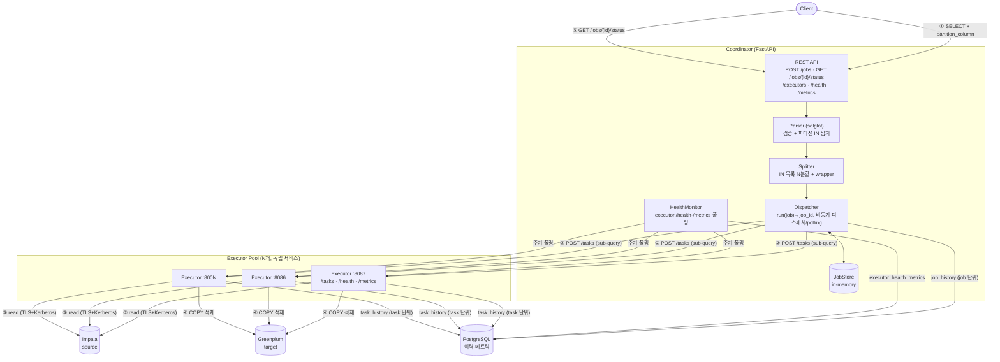
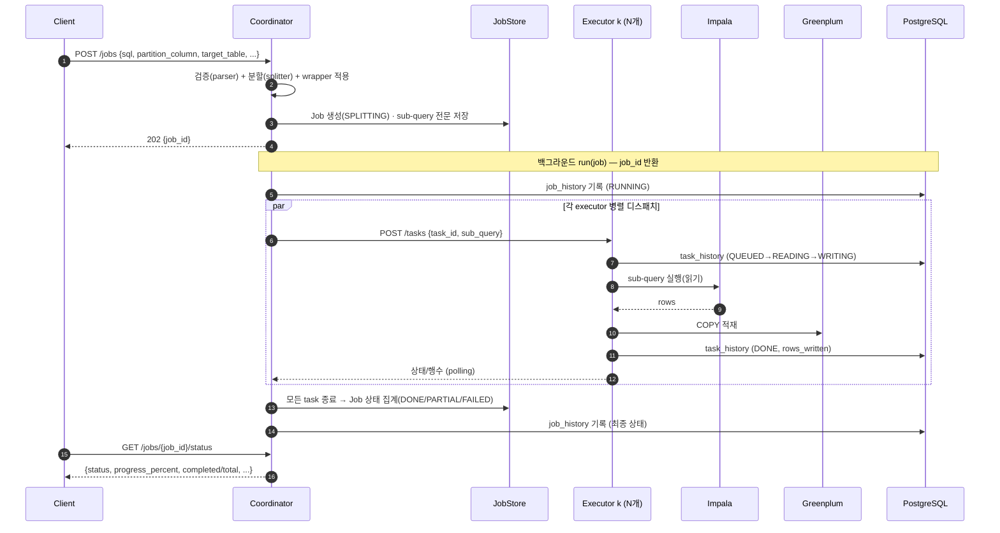

# query-executor

Coordinator + N Executor 구조의 API. 하나의 Impala `SELECT` 쿼리를 파티션 컬럼의
`IN` 목록 기준으로 분할하여, 각 부분집합을 병렬로 읽어 Greenplum에 적재한다.
자세한 설계는 [DESIGN.md](DESIGN.md) 참고.

## 아키텍처



## 동작 흐름



> 모니터: Coordinator는 위와 별개로 `monitor.health_interval_s` 마다 각 executor의
> `/health`·`/metrics`(CPU/메모리/디스크)를 폴링해 보유하고(`GET /executors`),
> `monitor.record_interval_s` 마다 PostgreSQL(`executor_health_metrics`)에 기록한다.

## 디렉터리 구조

```
core/                # 공용: 설정 로더 + 설정 + 로깅 + 메트릭 (coordinator·executor 공유)
  config_loader.py     config.properties + config.yml(${변수:기본값}) 치환 로더
  config.py            Settings — config 파일 기반 전역 설정(싱글턴)
  logging.py           일 단위 롤링 로깅(파일명_YYYYMMDD.log) + WARNING 전용 로그(*-warn.log) 분리
  metrics.py           CPU/메모리/디스크 시스템 메트릭 수집(psutil)
coordinator/         # FastAPI: 검증 → 분할 → 디스패치 → 상태 추적
  parser.py            1단계 검증 + 파티션 IN 절 탐지(sqlglot, strict/lenient 모드)
  splitter.py          IN 목록을 N개의 완전한 sub-query로 분할(원문 포맷 보존)
  dispatcher.py        디스패치 + admission control(JobAdmission: 동시 슬롯 + 대기 큐) + 상태 polling
  models.py            Job/Task 도메인 모델 + 상태 enum + 요청/응답 스키마
  job_store.py         Job 저장소: InMemory(단일) / Sql(멀티 coordinator 공유, JSONB)
  history.py           job 단위 실행 이력 기록·조회(PostgreSQL, job_id별 최신 1건)
  monitor.py           executor /health·/metrics 폴링 + PostgreSQL 메트릭 기록
  executor_status.py   공유 상태 테이블(executor self-report) 조회 + 신선도 liveness 판정
  dashboard.py         모니터링 대시보드 HTML(인라인 CSS/JS) + 설정 마스킹
  config.py            core 설정을 패키지-로컬로 재노출(임포트 편의)
  app.py               REST API (POST /jobs, .../status·result·cancel, /cluster, /executors, /health, /metrics)
  __main__.py          실행 진입점 (python -m coordinator)
executor/            # FastAPI: Impala 읽기 → Greenplum COPY 적재, task 상태 노출
  backend.py           ImpalaToGreenplumBackend(impyla + psycopg) + MockBackend
  models.py            Task 도메인 모델 + 상태 enum + 요청 스키마
  history.py           task 단위 실행 이력 기록·조회(PostgreSQL, task_id별 최신 1건)
  status.py            자기 상태(CPU/메모리/동시 task)를 공유 DB에 self-report(UPSERT)
  dashboard.py         executor self-view 대시보드 HTML(remote mode에서 /에 노출)
  app.py               REST API (POST /tasks, GET /tasks·/tasks/{id}, /cancel, /health, /metrics)
  __main__.py          실행 진입점 (EXECUTOR_PORT=8087 python -m executor)
packaging/config/    # config.properties + config.yml 기본값 + 스키마(*.sql)
packaging/wheels/    # 에어갭 오프라인 설치용 cp39 휠 번들(coordinator/executor/dev, 유형별)
deploy/              # install.sh + 런처 bin/(start/stop/status[-coordinator|-executor]·kinit-renew·env) — /appuser 트리 배포
tests/               # coordinator·executor 검증 + 라이프사이클 + admission/대시보드 테스트
```

## 설정 (config.properties + config.yml)

argus-catalog backend와 동일한 방식이다. `config.properties`(Java 스타일 key=value)의
값으로 `config.yml`의 `${변수:기본값}` 자리표시자를 치환해 로드한다.

- 설정 디렉터리: `/appuser/query-executor/config` (환경변수 `QUERY_EXECUTOR_CONFIG_DIR` 로 변경)
- 로컬 개발 시: `QUERY_EXECUTOR_CONFIG_DIR=packaging/config` 로 저장소 기본값 사용
- 핵심 항목: `coordinator.executors`, `coordinator.max_concurrent_jobs`/`max_pending_jobs`,
  `impala.*`, `greenplum.dsn`, `copy.batch_size`
- `impala.host` 와 `greenplum.dsn` 이 모두 설정되면 실제 `ImpalaToGreenplumBackend`,
  아니면 `MockBackend`(실제 I/O 없음)로 폴백
- **인증 범위**: TLS + Kerberos(GSSAPI)는 **Impala 접속에만** 적용된다. Greenplum 은
  TLS/Kerberos 없는 **일반 `postgresql://` DSN** 으로 접속한다.
- **Job 저장소(`store.backend`)**: `memory`(휘발) / `file`(단일 노드 **파일 영속 →
  크래시 복구**: 재기동 시 중단된 job 을 FAILED 로 정합 후 `retry` 로 재개) / `postgres`(멀티
  coordinator 공유). file 경로는 `store.path`(기본 로그 디렉터리 옆 `jobs-state.json`).
- **COPY 사전검증(`copy.preflight`, 기본 on)**: copy 모드에서 COPY 전에 SELECT 컬럼이 대상
  테이블에 있는지 확인해 불일치를 조기 실패시킨다(대용량 스트리밍 전에 차단).
- **graceful drain**: executor 종료(SIGTERM) 시 진행 중 task 를 강제 중단하지 않고
  `executor.shutdown_drain_timeout_s`(기본 25초) 내에서 완료를 기다린다.
- **헬스 기반 executor 선택(`coordinator.executor_select`)**: `round_robin`(기본) /
  `least_loaded` / `p2c`. `least_loaded`·`p2c`는 HealthMonitor 스냅샷(헬스+`active_tasks`)을
  보고 **초기 배정**과 **failover 순서**를 **살아있는·한가한 executor 먼저**로 정한다(한 job의
  task가 한 노드로 몰리지 않게 분산 배정). **HA(다중 coordinator)** 에서는 분산 스탬피드를 피하는
  **`p2c`(Power-of-Two-Choices)** 권장. 배정 분포는 `GET /cluster`의 `assignment_counts`로 확인.
  HA 고도화: 공유 self-report URL 키 부하 뷰(`executor.advertise_url`), TTL 보호 **공유 예약**
  (`coordinator.executor_reservation`), **죽은 coordinator 소유 job 정합**
  (`coordinator.orphan_reconcile_interval_s`) — 아래 "멀티 coordinator" 참고.
- **coordinator admission control(동시 job 제한 + 대기 큐)**: 들어온 job 요청을
  - 실행 슬롯(`coordinator.max_concurrent_jobs`, 기본 16)이 비어 있으면 즉시 `RUNNING`,
  - 다 찼으면 `PENDING` 으로 **대기 큐**에 넣고(`coordinator.max_pending_jobs`, 기본 100),
  - 실행+대기 합(=capacity)을 넘는 요청은 **`429 Too Many Requests`** (`Retry-After: 5`)로 거부한다.
  슬롯이 나면 대기 job 이 FIFO 로 실행된다. `max_concurrent_jobs<=0` 이면 무제한.
  (executor 단의 task 동시 제한은 `executor.max_concurrent_tasks` — 아래 "수평 확장" 참고)
- Impala는 **TLS + Kerberos(GSSAPI)**: `impala.use_ssl`/`impala.ca_cert`,
  `impala.auth_mechanism=GSSAPI`/`impala.kerberos_service_name`. 티켓은 OS 자격증명
  캐시(KRB5CCNAME)를 사용 → `bin/kinit-renew.sh`(keytab) + cron 으로 갱신 ([deploy/README.md](deploy/README.md))
- 로깅: `/appuser/query-executor/logs` 에 일 단위 롤링. 작업 요청이 오면 **job_id 를 먼저
  생성**하고, 이후 모든 로그에 `[job_id][task_id]` 가 자동으로 붙는다(coordinator·executor 공통).
  - coordinator(job 단위): `... [job_531ab6f734ca][-] - 쿼리 실행 요청 수신 ...`
  - executor(task 단위): `... [job_demo999][t_demo123] - task ... 완료: 2행 적재`
  - 작업/태스크와 무관한 로그는 `[-][-]`
  - **WARNING 전용 로그 분리**: 메인 로그(INFO+)와 별개로 **WARNING 이상만** 모으는
    `*-warn.log`(예: `query-coordinator-server-warn.log`)를 따로 남겨 운영 중 문제만 빠르게
    추적한다. 로거 이름까지 포함한 강화 포맷이며, 메인 레벨(`logging.level`)을 WARNING 보다
    높게 잡아도 이 로그는 비지 않는다. `logging.warn.{enabled,level,suffix}`(기본
    `true`/`WARNING`/`-warn`)로 제어한다.
- 모니터링: 두 서비스 모두 `/health`·`/metrics`(CPU·메모리·디스크) 제공. coordinator는
  executor `/health`·`/metrics` 를 주기 폴링(`GET /executors`)하고 `monitor.db_dsn`
  설정 시 CPU/메모리 사용량을 PostgreSQL(`monitor.table`)에 주기 기록
- 통합 상태: `GET /cluster` — coordinator + 모든 executor 의 health/CPU/메모리/디스크와
  실행 중 job 수를 **한 번에** 반환 (아래 참고)

## 클러스터 통합 상태 (`GET /cluster`)

coordinator·executor 의 health 와 CPU/메모리/디스크, 실행 중 job 수를 한 번에 조회한다.
`refresh=true`(기본)면 executor 를 즉시 폴링하고, `refresh=false`면 모니터 캐시를 쓴다.

```bash
curl -s localhost:8088/cluster            # 즉시 폴링
curl -s 'localhost:8088/cluster?refresh=false'   # 캐시 사용
```

```json
{
  "coordinator": {
    "service": "coordinator", "status": "ok",
    "metrics": { "cpu_percent": 9.5,
      "memory": {"total_mb": 385552.7, "used_mb": 54083.0, "percent": 14.0},
      "disk":   {"path": "/", "total_gb": 823.96, "used_gb": 566.25, "percent": 72.4} }
  },
  "executors": [
    { "executor_url": "http://127.0.0.1:8087", "healthy": true,
      "cpu_percent": 3.1, "memory_percent": 22.5, "memory_used_mb": 4096.0,
      "disk_percent": 61.0, "disk_used_gb": 120.5, "disk_total_gb": 200.0 }
  ],
  "executors_summary": { "total": 1, "healthy": 1, "unhealthy": 0 },
  "jobs": { "running": 1, "active": 1, "total": 1, "by_status": {"RUNNING": 1} },
  "assignment_counts": { "http://127.0.0.1:8087": 12, "http://127.0.0.1:8086": 11 },
  "executor_select": "p2c"
}
```

## 실행 환경 (RHEL 9.2)

RHEL 9.2 기본 Python 3.9 를 그대로 사용한다(별도 Python 설치 불필요).

```bash
# 1) Python 3.9 및 빌드 도구 설치(이미 있으면 생략)
sudo dnf install -y python3 python3-pip python3-devel

# 2) (executor를 실제 Impala/Greenplum에 연결할 때만) impyla + Kerberos/TLS 의존성
#    Impala 는 TLS + Kerberos(GSSAPI) 환경이다.
sudo dnf install -y gcc gcc-c++ make python3-devel \
    krb5-workstation krb5-devel cyrus-sasl-devel cyrus-sasl-gssapi
```

## 설치 및 테스트

```bash
python3.9 -m venv .venv
.venv/bin/pip install --upgrade pip

# coordinator + 테스트 의존성
.venv/bin/pip install -r requirements-dev.txt

# 테스트 실행 (실제 DB 불필요: MockBackend / FakeRunner 사용)
.venv/bin/python -m pytest -q
```

executor를 실제 클러스터에 연결하려면 드라이버를 추가 설치한다:

```bash
.venv/bin/pip install -r requirements-executor.txt
```

## 의존성 파일

| 파일 | 용도 |
|---|---|
| `requirements.txt` | coordinator 런타임(fastapi, uvicorn, sqlglot, httpx, pydantic) |
| `requirements-executor.txt` | executor 런타임 + DB 드라이버(impyla, psycopg) |
| `requirements-dev.txt` | 개발/테스트(pytest, pytest-asyncio) |

## 로컬 실행

설정은 `packaging/config/` 의 기본값을 사용한다(`coordinator.executors`, 포트 등).

```bash
# executor 기동 (포트는 EXECUTOR_PORT 로 지정). 여러 개 띄울 수 있다.
QUERY_EXECUTOR_CONFIG_DIR=packaging/config EXECUTOR_PORT=8087 \
  .venv/bin/python -m executor &
QUERY_EXECUTOR_CONFIG_DIR=packaging/config EXECUTOR_PORT=8086 \
  .venv/bin/python -m executor &

# coordinator 기동 (host/port/executors 는 config 에서 읽음)
QUERY_EXECUTOR_CONFIG_DIR=packaging/config \
  .venv/bin/python -m coordinator
```

## 작업 상태 확인 & 이력

작업을 제출하면 `job_id` 를 받고, 그 `job_id` 로 진행 상태를 조회한다.

```bash
# 1) 제출 → job_id
JOB=$(curl -s localhost:8088/jobs -H 'content-type: application/json' \
  -d '{"sql":"SELECT a, dt FROM t WHERE dt IN ('\''1'\'','\''2'\'')","partition_column":"dt","target_table":"public.t"}' \
  | python -c 'import sys,json;print(json.load(sys.stdin)["job_id"])')

# 2) 진행 상태(경량) 조회
curl -s localhost:8088/jobs/$JOB/status
# {"job_id":"...","status":"RUNNING","progress_percent":50.0,"completed":1,"total":2, ...}

# 전체 상태(태스크 포함)
curl -s localhost:8088/jobs/$JOB
```

| 엔드포인트 | 설명 |
|---|---|
| `POST /jobs` | 작업 제출 → `{job_id}` 반환 (`username` 선택 인자 지원) |
| `GET /jobs/{job_id}/status` | **진행 상태/진행률**(경량, 태스크 제외) |
| `GET /jobs/{job_id}` | 전체 상태(태스크 목록 포함) |
| `GET /jobs/{job_id}/result` | 적재 결과 요약 |
| `POST /jobs/{job_id}/cancel` | 작업 취소(각 executor에 전파). 이미 종료면 409 |
| `POST /jobs/{job_id}/retry` | **실패 파티션만 재실행**: 종료된 작업의 FAILED/CANCELLED task 만 새 작업으로 재실행 → 새 `job_id` 반환 |

### dry-run (쿼리 미리보기)

`dry_run: true` 면 executor를 **호출하지 않고** 생성된 쿼리만 로깅·반환한다(작업 미저장,
200 응답). 분할/래핑/스테이징 결과가 제대로 만들어지는지 확인하는 용도다.

```bash
curl -s localhost:8088/jobs -H 'content-type: application/json' -d '{
  "sql": "SELECT a, dt FROM sales WHERE dt IN ('\''1'\'','\''2'\'','\''3'\'')",
  "partition_column": "dt", "target_table": "public.t", "parallelism": 2,
  "dry_run": true
}'
# {"dry_run":true,"exec_mode":"copy","task_count":2,
#  "tasks":[{"executor_url":null,"partition_values":["'1'","'2'"],
#            "sub_query":"SELECT a, dt FROM sales WHERE dt IN ('1', '2')"}, ...]}
```

- 각 task의 `sub_query`(및 stage_insert면 `staging_ddl`/`insert_sql`)를 그대로 보여준다.
- 검증은 동일하게 수행되므로 잘못된 쿼리는 dry-run에서도 422.

### 작업 취소

```bash
curl -s -X POST localhost:8088/jobs/$JOB/cancel
# {"job_id":"...","status":"CANCELLED","cancel_requested":true, ...}
```

- coordinator가 취소 플래그를 세우고 비종료 task의 executor에 `POST /tasks/{task_id}/cancel`
  을 전파한다. job/ task 상태는 `CANCELLED` 로 바뀐다.
- **협조적 취소**: 대기(QUEUED) 중인 task는 즉시 취소되고, 실행 중인 task는 현재 작업이
  끝난 뒤 `CANCELLED` 로 마감된다(이력에도 기록). 실행 중인 Impala/COPY를 즉시 중단하려면
  백엔드 커서 취소(`cursor.cancel()`)가 추가로 필요하다(향후 확장).

### 실행 이력(PostgreSQL) — 2계층

하나의 `job_id` 아래 N개의 executor task 가 생기므로, 이력도 두 계층으로 기록된다.

| 테이블 | 기록 주체 | 단위 | 기록 시점 |
|---|---|---|---|
| `job_history` (`history.table`) | **Coordinator** | job 1건 | `run()` 시작(RUNNING)·종료(DONE/PARTIAL/FAILED) |
| `task_history` (`history.task_table`) | **각 Executor** | task N건 (job_id+task_id) | 상태 전이마다(QUEUED/READING/WRITING/DONE/FAILED) |

- coordinator의 `run(job)` 은 `job_id` 를 반환하고 job 단위 이력을 남긴다.
- 제출 시 `username` 을 넘기면 executor까지 전달되어 **두 이력 테이블 모두 `username` 컬럼**에
  기록된다(대시보드에도 "사용자" 컬럼으로 표시).
- 각 executor 는 자신이 처리하는 task 의 상태 전이를 `task_history` 에 append 한다
  (`executor_id` 컬럼으로 어느 executor 인지 식별). **따라서 executor 호스트에도 PG
  자격증명이 필요**하다.
- 기록 대상 DB는 `history.db_dsn`(미설정 시 `monitor.db_dsn`) 공유. 둘 다 없으면 비활성
  (경고 로그).
- ⚠️ **스키마는 앱이 자동 생성하지 않는다.** PostgreSQL을 쓰기 전에 통합 스키마
  `packaging/config/postgresql.sql`을 **먼저 실행**해 테이블/인덱스를 만들어 두어야 한다
  (안 하면 "relation does not exist"로 실패):
  `psql "$history_db_dsn" -f packaging/config/postgresql.sql`

```sql
-- 특정 job 의 executor task 진행 이력 추적
SELECT recorded_at, task_id, executor_id, status, rows_written
FROM task_history WHERE job_id = '<job_id>' ORDER BY recorded_at;
```

## 멀티 coordinator

coordinator를 여러 대 둘 수 있다. 이때 두 가지를 공유 PostgreSQL(`history.db_dsn`)로
옮긴다(설정은 모든 coordinator·executor가 동일 DSN 공유).

> ⚠️ **먼저 스키마 생성**: PostgreSQL을 쓰는 경우(공유 store / 이력 / self-report) 서비스
> 기동 **전에** 반드시 통합 스키마를 한 번 적용한다. 앱은 테이블을 자동 생성하지 않는다.
> ```bash
> psql "postgresql://user:pass@pg:5432/queryexec" -f packaging/config/postgresql.sql
> ```

| 설정 | 효과 |
|---|---|
| `store.backend=postgres` | **공유 Job 저장소**(`jobs` 테이블). 어느 coordinator로 상태조회/취소 요청이 가도 동작 |
| `executor.self_report=true` | **executor가 자기 상태를 직접 기록**(`executor_status` 테이블). coordinator는 읽기만 → 중복 폴링/기록 제거 |
| `executor.advertise_url=http://h:8087` | self-report에 자기 URL 기록 → coordinator가 **URL 키 공유 부하 뷰**로 헬스 기반 선택(`coordinator.executors`의 URL과 일치) |
| `coordinator.executor_select=p2c` | **헬스 기반 선택**: 분산 스탬피드를 피하는 Power-of-Two-Choices |
| `coordinator.executor_reservation=true` | **TTL 보호 공유 예약**(엄격 균형): dispatch 중 task를 예약해 전역 부하를 실시간 공유 |
| `coordinator.orphan_reconcile_interval_s=30` | **죽은 coordinator 소유 job 정합**: heartbeat 기반으로 stale 소유 job을 FAILED→retry |

```properties
# 모든 coordinator/executor 공통
history.db_dsn=postgresql://user:pass@pg:5432/queryexec
store.backend=postgres
executor.self_report=true
coordinator.id=coord-1     # 인스턴스마다 다르게(미지정 시 host:port)
# HA 헬스 기반 선택(권장)
coordinator.executor_select=p2c
executor.advertise_url=http://<this-executor-host>:8087   # executor별로 자기 URL
# (선택) 엄격 균형 + 정합
coordinator.executor_reservation=true
coordinator.orphan_reconcile_interval_s=30
```

동작:
- **상태 조회/결과/취소**(`GET /jobs/{id}`·`/status`·`/result`, `POST /jobs/{id}/cancel`)가
  공유 `jobs` 테이블 기반이라 **아무 coordinator로 라우팅돼도** 응답한다. 디스패처는 실행 중
  스냅샷을 주기적으로 store에 저장한다.
- **cross-coordinator 취소**: 다른 coordinator가 소유한 작업도 `cancel_requested` 플래그를
  공유 store에 세우면 소유 coordinator가 polling 중 감지해 중단한다.
- **죽은 coordinator 정합**: 각 coordinator가 `coordinator_status`에 heartbeat하고, 소유자가
  죽은(heartbeat stale) 비종료 job을 주기적으로 `FAILED`로 정합한다 → `POST /jobs/{id}/retry`로
  실패 파티션만 재개. 헬스 기반 선택은 공유 `executor_status`(URL 키)·예약을 부하 뷰로 쓴다.
- **executor 상태**: executor가 `executor.status_interval_s` 마다 `executor_status` 에
  upsert(heartbeat). coordinator의 `/executors`·`/cluster` 는 이 테이블을 읽고, liveness 는
  `updated_at` 신선도로 판정한다. (self_report 모드에선 coordinator 폴링/기록 미가동)
- **executor admission control**: `executor.max_concurrent_tasks` 로 executor가 동시 실행
  task 수를 제한(여러 coordinator의 합산 부하 방어). 초과분은 슬롯이 날 때까지 대기.
- **coordinator admission control**: `coordinator.max_concurrent_jobs`(실행 슬롯) +
  `max_pending_jobs`(대기 큐)로 동시 job 수를 제한, 초과 시 `429`. 단 이 한도는 **coordinator
  인스턴스별**(인메모리)이라 멀티 coordinator 환경에선 인스턴스 수만큼 합산된다.

스키마: `packaging/config/postgresql.sql`(전체 통합). 앱은 DDL을 하지 않으므로 **반드시 먼저 실행**한다.

> 단일 coordinator면 기본값(`store.backend=memory`, `executor.self_report=false`) 그대로 두면 된다.

## 로컬 모드 (local mode)

executor를 별도로 띄우지 않고 **coordinator 안에서 in-process로 직접 실행**한다. HTTP
디스패치 대신 executor 백엔드를 바로 호출하므로, executor 프로세스/원격 없이 동작 검증이
쉽다. 기본 백엔드는 `greenplum.dsn` 미설정 시 `MockBackend`(실제 I/O 없음).

```bash
# 환경변수로 즉시 토글 (config 의 coordinator.executor_mode=local 과 동일)
COORDINATOR_EXECUTOR_MODE=local .venv/bin/python -m coordinator

# 제출 → executor 없이 즉시 실행됨 → 상태 DONE
curl -s localhost:8088/jobs -H 'content-type: application/json' \
  -d '{"sql":"SELECT a, dt FROM t WHERE dt IN ('\''1'\'','\''2'\'')","partition_column":"dt","target_table":"public.t","parallelism":2}'
curl -s localhost:8088/jobs/<job_id>/status   # {"status":"DONE", ...}
```

| `coordinator.executor_mode` | 동작 |
|---|---|
| `remote` (기본) | executor 서비스에 HTTP(`POST /tasks`)로 디스패치 |
| `local` | coordinator 프로세스 안에서 백엔드를 직접 호출(원격/HTTP 없음) |

> 쿼리만 확인하려면 [dry-run](#작업-상태-확인--이력), 실제 적재 동작까지 로컬에서 보려면
> local 모드를 쓴다(둘은 독립적으로 조합 가능).

## 모니터링 대시보드 (`/`)

`/` 에 접속하면 coordinator 전용 모니터링 화면이 뜬다(순수 Python/FastAPI 서빙, npm·빌드
없음). 단일 HTML(인라인 CSS/JS)이 JSON API를 3초마다 폴링해 탭을 갱신한다.

| 탭 | 데이터 | 내용 |
|---|---|---|
| 처리중인 Query | `GET /jobs` | 작업 목록(상태/진행률/완료수/rows/exec_mode/partition/target) + 총/실행/활성 카드 |
| 실행 이력 | `GET /history?limit=&offset=` | 과거 실행 이력(PostgreSQL `job_history`), **페이징**(이전/다음). DSN 미설정 시 안내 |
| Executor 상황 | `GET /cluster` | coordinator CPU/메모리/디스크 카드 + executor별 health·CPU/MEM/DISK·last_seen |
| 환경설정 | `GET /config` | 설정 key/value 표(**비밀값 마스킹**: DSN 비밀번호 `user:***@`, impala 비밀번호 `***`) |
| 그외 정보 | `GET /info` | 버전·coordinator_id·executor_mode·store backend·self_report·uptime·상태별 job 수 |

```bash
# 브라우저에서 http://<host>:8088/
curl -s localhost:8088/jobs        # 작업 목록(JSON)
curl -s localhost:8088/config      # 설정(마스킹)
curl -s localhost:8088/info        # 요약
```

- 읽기 전용이며 `/config` 의 비밀값은 마스킹된다. 노출이 우려되면 `dashboard.enabled=false`
  로 끈다(`/`·`/config`·`/info` 비활성, `/jobs` 는 유지).
- 멀티 coordinator + 공유 store면 어느 coordinator의 `/` 에서도 전체 작업이 보인다.

## API 문서 (Swagger)

두 서비스 모두 FastAPI 기반 대화형 문서를 제공한다.

| 경로 | 설명 |
|---|---|
| `/docs` | Swagger UI (대화형 API 문서) |
| `/redoc` | ReDoc 문서 |
| `/openapi.json` | OpenAPI 3 스키마 |

```bash
# 브라우저에서 http://localhost:8088/docs (coordinator), http://localhost:8087/docs (executor)
```

```bash
curl -s localhost:8088/jobs -H 'content-type: application/json' -d '{
  "sql": "SELECT user_id, amount, dt FROM sales WHERE dt IN ('\''2026-01-01'\'','\''2026-01-02'\'') AND region='\''KR'\''",
  "partition_column": "dt",
  "target_table": "public.sales_mirror",
  "write_mode": "overwrite_partitions",
  "parallelism": 2
}'
```

## 배포 (RHEL 9.2, /appuser 단일 트리)

보안 정책상 `/etc`·`/opt`·`/var` 를 쓰지 않고 모든 것을 `/appuser/query-executor` 아래에
두며, systemd 시스템 유닛 대신 런처 스크립트로 구동한다. 설치 스크립트/상세는
[`deploy/README.md`](deploy/README.md) 참고.

```bash
sudo ./deploy/install.sh                              # 에어갭: WHEELHOUSE=... INSTALL_EXECUTOR=1
B=/appuser/query-executor/bin
sudo -u appuser $B/start.sh      # 전체 기동(executor 들 + coordinator)
sudo -u appuser $B/status.sh     # 상태(프로세스 + health)
sudo -u appuser $B/stop.sh       # 전체 중지
```

런처 스크립트(`/appuser/query-executor/bin/`)는 **전체**와 **역할별**로 나뉜다:

| 스크립트 | 설명 |
|---|---|
| `start.sh` / `stop.sh` / `status.sh` | 전체(coordinator + executor 전부) 기동/중지/상태 |
| `start-coordinator.sh` / `stop-coordinator.sh` / `status-coordinator.sh` | **coordinator만** 제어 |
| `start-executor.sh [PORT...]` / `stop-executor.sh [PORT...]` / `status-executor.sh` | **executor만** 제어(포트 인자 생략 시 `EXECUTOR_PORTS` 전체, 특정 포트만도 가능) |
| `kinit-renew.sh` | Impala Kerberos 티켓 발급/갱신(keytab) |
| `env.sh` | 런처 공통 환경(경로·`KRB5_CONFIG`·`KRB5CCNAME`·포트)을 source |

```bash
# 역할별 예시
sudo -u appuser $B/start-coordinator.sh     # coordinator만 기동
sudo -u appuser $B/start-executor.sh 8086   # executor 8086만 기동/재기동
sudo -u appuser $B/stop-executor.sh  8086   # executor 8086만 중지
```

`install.sh` 는 `appuser` 계정 + `/appuser/query-executor` 트리(`config`·`logs`·`run`·`bin`·
`.venv`)를 구성하고, Kerberos+TLS 자리표시 파일(`config/krb5.conf`·`impala-ca.pem`·
`impala.keytab`)을 만든다. Impala 티켓은 `bin/kinit-renew.sh`(keytab) 로 발급하고 cron 으로
주기 갱신한다(`KRB5_CONFIG`/`KRB5CCNAME` 는 `bin/env.sh` 가 `/appuser` 아래로 export).

### 에어갭(인터넷 차단) 설치

타깃이 PyPI/인터넷에 접근할 수 없을 때 두 가지 방법이 있다.

1. **사내 PyPI 프록시(Nexus 등)** 가 있으면 `pip.conf`(`/appuser/.config/pip/pip.conf`)에
   `index-url`/`trusted-host` 를 지정하면 평소처럼 설치된다.
2. **완전 오프라인**이면 저장소의 `packaging/wheels/` 휠 번들(cp39, 유형별 디렉터리)로
   `--no-index` 설치한다. `WHEELHOUSE` 는 콜론으로 여러 디렉터리를 지정한다:

   ```bash
   # coordinator 만
   sudo WHEELHOUSE=packaging/wheels/coordinator ./deploy/install.sh
   # executor 포함(impyla·SASL·gssapi). gssapi 는 sdist 라 타깃에서 빌드된다.
   sudo WHEELHOUSE=packaging/wheels/coordinator:packaging/wheels/executor \
        INSTALL_EXECUTOR=1 ./deploy/install.sh
   ```

`gssapi`(Kerberos)는 manylinux 휠이 없어 타깃에서 빌드되므로, RHEL 9.2 빌드 도구가 필요하다
(`gcc gcc-c++ make python3-devel krb5-devel cyrus-sasl-devel`). 인터넷이 없으면 **RHEL 9.2
DVD ISO 를 루프백 마운트**해 yum 리포지토리로 쓴다(자세한 절차는
[`deploy/README.md`](deploy/README.md)). 휠 번들 구성/사용은
[`packaging/wheels/README.md`](packaging/wheels/README.md) 참고.

## 쿼리 분할 모드

요청(`POST /jobs`)에서 두 옵션으로 분할 동작을 제어한다.

| 필드 | 기본 | 설명 |
|---|---|---|
| `strict_validation` | `true` | `true`: 단순 SELECT만 허용(아래 1단계 규칙). `false`: **복합 쿼리**(중첩 서브쿼리/JOIN/GROUP BY/`unnest` 등)를 허용하고 파티션 컬럼의 `IN` 절을 트리 어디서든 찾아 분할 |
| `sql_dialect` | 서버 기본(`query.sql_dialect`, 기본 `hive`) | 파싱 방언. 예: `hive`, `impala`, `postgres`(Greenplum) |
| `wrapper_query` | (없음) | 분할된 sub-query를 감싸는 쿼리. `wrapper_placeholder` 자리에 각 sub-query가 치환된다 |
| `wrapper_placeholder` | `{{SUBQUERY}}` | `wrapper_query` 안에서 sub-query가 들어갈 자리표시자 |
| `impala_query_options` | (없음) | 이 작업의 **Impala 쿼리 옵션(SET)**. 전역 `impala.query_options` 위에 병합. 예: `{"MEM_LIMIT":"2g","REQUEST_POOL":"etl"}` |

### Impala 쿼리 옵션 (SET)
Impala 실행 시 `MEM_LIMIT`/`REQUEST_POOL`/`MT_DOP` 같은 쿼리 옵션(SET)을 줄 수 있다.
impyla 의 `configuration` 으로 전달되며 **copy·stage_insert 모드의 Impala SELECT에만** 적용된다
(statement 모드는 Greenplum 실행이라 무관).

- **전역 기본값**: `config` 의 `impala.query_options=MEM_LIMIT=2g,REQUEST_POOL=etl`
- **요청별**: `POST /jobs` 의 `impala_query_options` (전역값 위에 병합, 같은 키는 요청값이 우선)
- **둘 다 비어 있으면** `configuration` 을 넘기지 않고 그대로 실행한다(기본 동작 유지).

```bash
curl -s localhost:8088/jobs -H 'content-type: application/json' -d '{
  "sql": "SELECT a, dt FROM sales WHERE dt IN ('\''1'\'','\''2'\'')",
  "partition_column": "dt", "target_table": "public.t",
  "impala_query_options": {"MEM_LIMIT": "2g", "REQUEST_POOL": "etl"}
}'
```

### 감싸는 쿼리(wrapper_query)
분할된 각 sub-query를 다른 쿼리로 감싸 executor가 실행하게 한다. placeholder는 SQL과
충돌이 적은 `{{SUBQUERY}}` 가 기본이며(`wrapper_placeholder`로 변경 가능), 여러 번
등장하면 모두 치환된다. 괄호 등은 wrapper 작성자가 직접 둔다.

```bash
curl -s localhost:8088/jobs -H 'content-type: application/json' -d '{
  "sql": "SELECT a, dt FROM sales WHERE dt IN ('\''1'\'','\''2'\'','\''3'\'','\''4'\'')",
  "partition_column": "dt",
  "target_table": "staging.sales_part",
  "parallelism": 2,
  "wrapper_query": "INSERT INTO staging.sales_part SELECT * FROM ({{SUBQUERY}}) src"
}'
```

위 요청은 각 task에 대해 다음과 같이 감싸진 쿼리를 생성한다(예: task #1):

```sql
INSERT INTO staging.sales_part SELECT * FROM (SELECT a, dt FROM sales WHERE dt IN ('1', '2')) src
```

> `wrapper_query` 에 placeholder가 없으면 422(`WRAPPER_PLACEHOLDER_MISSING`)를 반환한다.

### 적재 방식 (`exec_mode`)

executor가 분할/감싼 쿼리를 실행하는 방식을 고른다.

| `exec_mode` | 동작 | 적합한 경우 |
|---|---|---|
| `copy` (기본) | Impala 에서 sub-query 를 **읽어** Greenplum 에 `COPY` 적재 | 소스(Impala)와 타깃(Greenplum)이 다른 엔진. 단, COPY는 SQL이 아니라 STDIN 벌크 로드라 **대상 테이블 컬럼과 정확히 일치**해야 한다. 래퍼는 **행을 반환하는 SELECT** 여야 하며(적재는 COPY가 수행), INSERT 래퍼를 주면 422(`COPY_WRAPPER_NOT_SELECT`) |
| `statement` | wrapper 로 감싼 SQL(예: `INSERT ... SELECT`)을 대상 DB(`greenplum.dsn`)에서 **그대로 실행** | `INSERT INTO ... SELECT (분할쿼리)` 처럼 한 DB 안에서 INSERT 로 적재. 컬럼 매핑은 INSERT 컬럼 목록/SELECT 가 담당하므로 COPY 의 엄격한 컬럼 일치 제약이 없다 |
| `stage_insert` | Impala SELECT 결과를 Greenplum **staging(TEMP) 테이블에 COPY** 적재 → staging 을 `FROM` 으로 하는 **INSERT 실행** | **SELECT은 Impala, INSERT은 Greenplum** 처럼 서로 다른 엔진. Greenplum INSERT 가 읽을 `FROM` 소스가 없으므로 임시 테이블을 경유한다 |

### stage_insert 모드 (서로 다른 엔진)

SELECT(Impala)과 INSERT(Greenplum)이 다른 엔진이면, Greenplum INSERT 가 직접 읽을 소스가
없다. 그래서 **Impala 결과를 Greenplum 임시 테이블에 적재한 뒤 그 테이블에서 INSERT** 한다.
executor 는 한 Greenplum 세션 안에서 다음을 수행한다(TEMP 라 세션 종료 시 자동 정리):

```
CREATE TEMP TABLE <staging>  ─ staging_ddl
   → COPY <staging> FROM STDIN  ─ Impala SELECT(분할) 결과 적재
   → INSERT INTO <target> ... SELECT ... FROM <staging>  ─ wrapper_query
```

필요한 필드: `staging_table`, `staging_ddl`(staging 생성 DDL), `wrapper_query`(staging 을
`FROM` 으로 하는 INSERT). 이때 `wrapper_query` 는 `{{SUBQUERY}}` 가 아니라 **staging 테이블명**
을 참조한다(분할된 SELECT 는 staging 으로 적재되므로).

```bash
curl -s localhost:8088/jobs -H 'content-type: application/json' -d '{
  "sql": "SELECT a, dt FROM imp WHERE dt IN ('\''1'\'','\''2'\'','\''3'\'')",
  "partition_column": "dt",
  "target_table": "public.target",
  "parallelism": 3,
  "exec_mode": "stage_insert",
  "staging_table": "stg_t",
  "staging_ddl": "CREATE TEMP TABLE stg_t (a int, dt text)",
  "wrapper_query": "INSERT INTO public.target (a, dt) SELECT a, dt FROM stg_t"
}'
```

> 필수 필드(`staging_table`/`staging_ddl`/`wrapper_query`)가 빠지면 422
> (`STAGE_INSERT_REQUIRES_FIELDS`). staging 은 `CREATE TEMP TABLE` 권장(세션별 격리 →
> 병렬 task 간 이름 충돌 없음, 자동 정리).

```bash
# INSERT 래퍼를 대상 DB에서 직접 실행 (COPY 미사용)
curl -s localhost:8088/jobs -H 'content-type: application/json' -d '{
  "sql": "SELECT a, dt FROM src WHERE dt IN ('\''1'\'','\''2'\'','\''3'\'')",
  "partition_column": "dt",
  "target_table": "public.mirror",
  "parallelism": 3,
  "exec_mode": "statement",
  "wrapper_query": "INSERT INTO public.mirror (a, dt) SELECT a, dt FROM ({{SUBQUERY}}) s"
}'
```

> `statement` 모드는 `greenplum.dsn` 한 연결에서 SQL을 실행하므로, INSERT 의 소스와
> 타깃이 같은 DB(Greenplum)에 있어야 한다. (`impala.host` 없이 `greenplum.dsn` 만 있어도
> statement 모드는 동작한다.)

### 1단계(strict=true) 범위
단순 `SELECT`(+ `ORDER BY` / `LIMIT`)만 지원. GROUP BY, 집계 함수, DISTINCT, JOIN,
NOT IN, 서브쿼리 IN, 파티션 `IN` 누락을 안정적인 에러 코드로 거부한다.

### 복합 쿼리(strict=false)
중첩 서브쿼리의 WHERE에 있는 파티션 `IN`(예: `A.REGION_NO IN ('R1','R2','R3')`)을
기준으로 분할한다. 분할 시 **해당 IN 절만** 부분집합으로 교체되고 다른 조건
(예: `A.STORE_ID IN (...)`, `BETWEEN ...`)은 그대로 보존된다.

`partition_column` 은 테이블 한정자 유무와 무관하게 매칭된다. 즉 `REGION_NO` 로 지정해도
SQL의 `A.REGION_NO` 에 매칭된다(대소문자도 무관). 단, 서로 다른 테이블에 같은 이름의
`IN` 절이 여러 개 있으면 먼저 발견된 것이 선택되므로 그럴 땐 컬럼명이 유일해야 한다.

```bash
curl -s localhost:8088/jobs -H 'content-type: application/json' -d '{
  "sql": "SELECT ... WHERE ... A.REGION_NO IN ('R1','R2','R3') ...",
  "partition_column": "REGION_NO",
  "target_table": "public.orders_mirror",
  "parallelism": 3,
  "sql_dialect": "postgres",
  "strict_validation": false
}'
```

> ⚠️ 결과 보존 가정: 분할 기준 컬럼이 **출력 행을 분할하는 위치**(주로 소스 스캔 필터)에
> 있어야 한다. 분할 기준 컬럼 위에서 집계/DISTINCT 하는 쿼리는 결과가 달라질 수 있다.

executor는 기본값이 `MockBackend` 라서 실제 DB 없이도 API를 구동할 수 있다.
