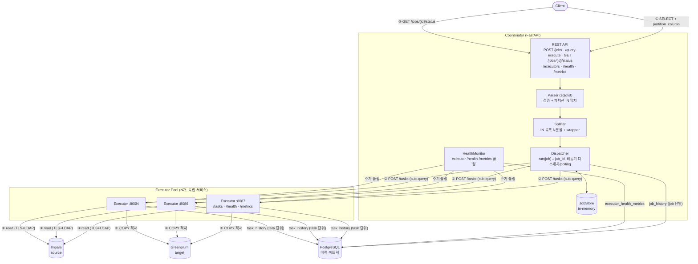
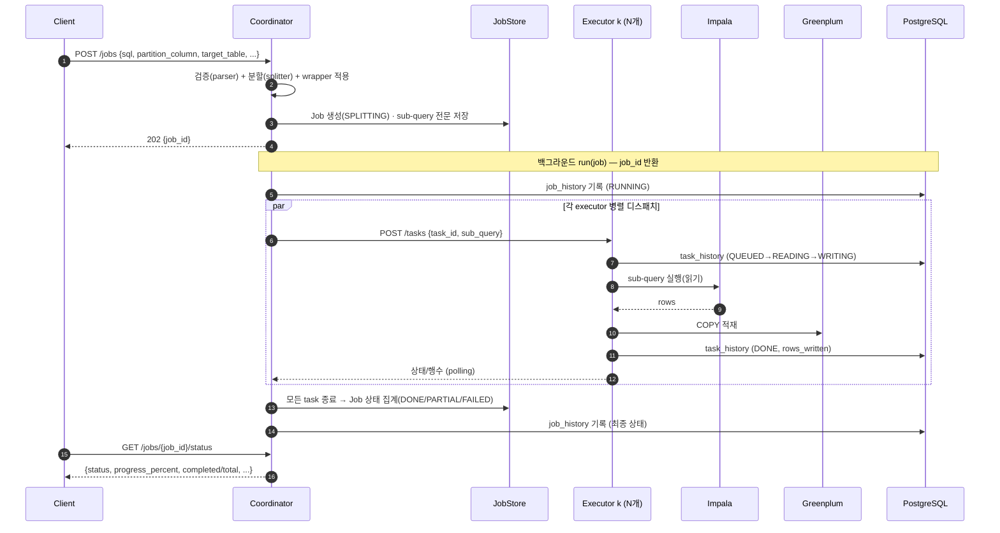

# Distributed Query Executor

Distributed Query Executor 는 큰 데이터를 빠르게 옮기기 위한 도구입니다. 한 대가 모든 일을 하는 대신,
일을 지휘하는 **coordinator**(요청을 받아 작업을 나눠 주는 지휘자 역할의 서비스)와 실제로
데이터를 읽고 쓰는 여러 대의 **executor**(나눠 받은 일을 직접 수행하는 Executor 서비스)로
구성됩니다. 핵심 아이디어는 단순합니다. 하나의 Impala `SELECT` 쿼리를 그대로 한 번에
실행하는 대신, 파티션 컬럼(데이터를 날짜나 지역처럼 일정한 기준으로 미리 나눠 둔 컬럼)의
`IN` 목록을 기준으로 쿼리를 여러 조각으로 쪼갭니다. 그리고 각 조각을 여러 executor 가
동시에 읽어서 Greenplum 에 적재합니다. 이렇게 하면 한 번에 처리하기 버거운 양도 여러
Executor이 나눠 맡아 병렬로 처리할 수 있습니다. 설계 배경과 더 깊은 내용이 궁금하다면
[DESIGN.md](docs/DESIGN.md) 를, 성능·확장·고가용성 운영은 [PERFORMANCE.md](docs/PERFORMANCE.md) 를,
애플리케이션(예: C#)에서 HTTP API 로 작업을 실행·확인하는 방법은
[INTEGRATION.md](docs/INTEGRATION.md) 를 참고하세요.

## 아키텍처

아래 그림은 전체 시스템이 어떻게 연결되어 있는지를 한눈에 보여 줍니다. 왼쪽 위 Client 가
쿼리를 보내면 Coordinator 가 그것을 받아 검증·분할한 뒤, 오른쪽의 여러 Executor 에게
일을 나눠 줍니다. 데이터 자체는 coordinator 를 거치지 않고 각 executor 가 Impala 에서 직접
읽어 Greenplum 으로 흘려보낸다는 점이 중요합니다. coordinator 로는 상태와 행 수 같은
가벼운 정보만 오갑니다.



## 동작 흐름

위 그림이 "무엇이 어디에 연결되어 있는지"를 보여 줬다면, 아래 그림은 "시간 순서로 무슨 일이
일어나는지"를 보여 줍니다. Client 가 작업을 제출하는 순간부터 결과 상태를 돌려받기까지의
한살이를 따라가 봅시다. coordinator 는 요청을 받자마자 쿼리를 검증하고 잘게 나눈 뒤 곧바로
job_id 를 돌려주고(202 응답), 실제 적재 작업은 백그라운드에서 진행됩니다. 그래서 Client 는
오래 기다릴 필요 없이 나중에 그 job_id 로 진행 상태를 물어보면 됩니다.



작업 처리와는 별개로, coordinator 는 Executor들이 잘 살아 있는지도 꾸준히 챙깁니다. 아래
설명대로 coordinator 는 `monitor.health_interval_s` 마다 각 executor 의 `/health` 와
`/metrics`(CPU·메모리·디스크 사용량)를 폴링해 두었다가 `GET /executors` 로 보여 주고,
`monitor.record_interval_s` 마다 그 값을 PostgreSQL(`executor_health_metrics`)에 기록해
둡니다.

> 모니터: Coordinator는 위와 별개로 `monitor.health_interval_s` 마다 각 executor의
> `/health`·`/metrics`(CPU/메모리/디스크)를 폴링해 보유하고(`GET /executors`),
> `monitor.record_interval_s` 마다 PostgreSQL(`executor_health_metrics`)에 기록한다.

## 디렉터리 구조

이제 코드가 어디에 어떻게 놓여 있는지 살펴봅시다. 소스 코드는 모두 `src/` 아래에 있고,
크게 보면 coordinator 와 executor 가 공통으로 쓰는 `src/core/`, 지휘자 역할의
`src/coordinator/`, Executor 역할의 `src/executor/` 로 나뉩니다. 그 밖에 설정(`config/`),
런처 스크립트(`bin/`), 배포·패키징(`packaging/`)을 담는 디렉터리들이 저장소 루트에 있습니다. 아래
목록에서 왼쪽은 파일 경로, 오른쪽은 그 파일이 맡은 일입니다. 처음에는 전부 외울 필요 없이,
"공용 → 지휘자 → Executor" 순서로 큰 덩어리만 눈에 익혀 두면 충분합니다.

```
src/                   # 파이썬 소스 루트(패키지: core / coordinator / executor)
  core/                # 공용: 설정 로더 + 설정 + 로깅 + 메트릭 (coordinator·executor 공유)
    config_loader.py     config.properties + config.yml(${변수:기본값}) 치환 로더
    config.py            Settings — config 파일 기반 전역 설정(싱글턴)
    logging.py           일 단위 롤링 로깅(파일명_YYYYMMDD.log) + WARNING 전용 로그(*-warn.log) 분리
    http_logging.py      HTTP 요청/응답 DEBUG 로깅 미들웨어(core.http, 마스킹·절단·잡음경로 제외)
    metrics.py           CPU/메모리/디스크 시스템 메트릭 수집(psutil)
  coordinator/         # FastAPI: 검증 → 분할 → 디스패치 → 상태 추적
    parser.py            1단계 검증 + 파티션 IN 절 탐지(sqlglot, strict/lenient 모드)
    splitter.py          IN 목록을 N개의 완전한 sub-query로 분할(원문 포맷 보존)
    dispatcher.py        디스패치 + admission control(JobAdmission: 동시 슬롯 + 대기 큐) + 상태 polling
    models.py            Job/Task 도메인 모델 + 상태 enum + 요청/응답 스키마
    job_store.py         Job 저장소: InMemory(단일) / Sql(멀티 coordinator 공유, JSONB)
    history.py           job 단위 실행 이력 기록·조회(PostgreSQL, job_id별 최신 1건)
    monitor.py           executor /health·/metrics 폴링 + PostgreSQL 메트릭 기록
    executor_status.py   공유 상태 테이블(executor self-report) 조회 + 신선도 liveness 판정
    dashboard.py         모니터링 대시보드 HTML(인라인 CSS/JS) + 설정 마스킹
    config.py            core 설정을 패키지-로컬로 재노출(임포트 편의)
    app.py               REST API (POST /jobs, /query-execute, .../status·result·cancel, /datasources, /cluster, /executors, /health, /metrics)
    __main__.py          실행 진입점 (python -m coordinator)
  executor/            # FastAPI: Impala 읽기 → Greenplum COPY 적재, task 상태 노출
    backend.py           ImpalaToGreenplumBackend(impyla + psycopg) + MockBackend
    models.py            Task 도메인 모델 + 상태 enum + 요청 스키마
    history.py           task 단위 실행 이력 기록·조회(PostgreSQL, task_id별 최신 1건)
    status.py            자기 상태(CPU/메모리/동시 task)를 공유 DB에 self-report(UPSERT)
    dashboard.py         executor self-view 대시보드 HTML(remote mode에서 /에 노출)
    app.py               REST API (POST /tasks, /query-run(커스텀 함수 위임), /datasources, GET /tasks·/tasks/{id}, /cancel, /health, /metrics)
    __main__.py          실행 진입점 (EXECUTOR_PORT=8087 python -m executor)
bin/                 # 런처·설치 스크립트(install·start/stop/status[-coordinator|-executor]·env·check-prereqs·config-tui·dashboard-tui)
config/                # config.properties + config.yml 기본값 + 스키마(*.sql)
templates/           # 쿼리 템플릿(<template_id>/manifest.yml + *.sql.j2) — config 와 같은 레벨
customs/            # 사이트 커스텀 코드(customs.query_funcs.* — 운영에서 직접 사용하는 커스텀 쿼리 함수)
packaging/           # 배포·패키징 일체: README.md(배포 안내) + wheels/(에어갭 휠 번들). 설치는 bin/install.sh
  wheels/            #   에어갭 오프라인 설치용 휠 번들(파이썬 버전별 py39/·py311/ 두 벌)
tests/               # coordinator·executor 검증 + 라이프사이클 + admission/대시보드 테스트
```

## 설정 (config.properties + config.yml)

이 시스템은 설정을 두 개의 파일로 나눠 다룹니다. 하나는 `config.properties` 로, 자바에서
흔히 쓰는 `key=value` 형식의 단순한 값 모음입니다. 다른 하나는 `config.yml` 로, 전체 구조를
담되 군데군데 `${변수:기본값}` 같은 자리표시자를 비워 둡니다. 시스템을 켜면 properties 파일의
값으로 yml 의 자리표시자를 채워 최종 설정을 만듭니다. 이 방식은 argus-catalog backend 와
동일하므로, 그 프로젝트에 익숙하다면 똑같은 감각으로 다루면 됩니다.

> **TUI 로 편집하기(`bin/config-tui.sh`)**: `config.properties` 를 직접 손으로 고치는 대신,
> 터미널 전체화면 설정 편집기를 쓸 수 있습니다. 항목 목록·기본값·설명·유효 값(enum)은 모두
> `config.yml` 에서 자동으로 읽어 오므로 설정이 늘어도 편집기가 자동으로 따라갑니다.
> `←→` 로 섹션 탭, `↑↓` 로 항목 이동, `Enter` 로 값 편집(bool/enum 은 `스페이스` 토글),
> `r` 로 기본값 복원, `s` 로 저장합니다. 저장 시 기존 파일은 `config.properties.bak` 로
> 백업되고, 바꾼 값만 주석·순서를 보존한 채 반영됩니다(비밀번호·DSN 은 화면에서 마스킹). 예:
> ```bash
> QUERY_EXECUTOR_CONFIG_DIR=config bin/config-tui.sh   # 개발: 저장소 config 편집
> bin/config-tui.sh                                  # 배포 트리 기본 설정 편집
> ```
> 설정은 기동 시 로딩되므로, 저장 후 서비스를 재시작해야 적용됩니다.

설정과 관련해 처음에 알아 두면 좋은 점들을 하나씩 풀어 보겠습니다.

- 설정 파일들은 기본적으로 `/data1/distributed-query-executor/config` 디렉터리에서 읽습니다. 다른
  위치를 쓰고 싶으면 환경변수 `QUERY_EXECUTOR_CONFIG_DIR` 로 바꿀 수 있습니다.
- 내 컴퓨터에서 개발하며 돌려볼 때는 `QUERY_EXECUTOR_CONFIG_DIR=config` 로
  지정해 저장소에 들어 있는 기본값을 그대로 쓰면 편합니다.
- 가장 자주 손대는 핵심 항목은 `coordinator.executors`(Executor 목록),
  `coordinator.max_concurrent_jobs`/`max_pending_jobs`(동시 처리·대기 한도), `impala.*`(원본
  접속 정보), `greenplum.dsn`(적재 대상 접속 정보), `copy.batch_size`(한 번에 보낼 행 수)
  입니다.
- `impala.host` 와 `greenplum.dsn` 이 모두 채워져 있으면 실제로 데이터를 읽고 쓰는
  `ImpalaToGreenplumBackend` 가 동작합니다. 둘 중 하나라도 비어 있으면 실제 입출력을 하지
  않는 `MockBackend` 로 자동 대체되어, DB 없이도 API 동작을 확인할 수 있습니다.

조금 더 깊은 설정 주제들도 미리 짚어 두면 운영할 때 당황하지 않습니다.

- **인증 범위**: TLS + Impala 인증(기본 **LDAP**)은 **Impala
  접속에만** 적용된다. Greenplum 은 TLS/인증 없는 **일반 `postgresql://` DSN** 으로 접속한다.
  즉 보안 인증은 원본인 Impala 쪽에만 필요하고, 적재 대상인 Greenplum 은 평범한 접속 문자열을 씁니다.
- **Job 저장소(`store.backend`)**: 작업 정보를 어디에 보관할지 고릅니다. `memory` 는 메모리에만
  두어 재기동하면 사라지고(휘발), `file` 은 단일 노드에서 파일로 영속화해 **크래시 복구**가
  가능합니다(재기동 시 중단된 job 을 FAILED 로 정합한 뒤 `retry` 로 재개). `postgres` 는 여러
  coordinator 가 함께 보는 공유 저장소입니다. file 경로는 `store.path` 로 지정하며 기본값은
  로그 디렉터리 옆 `jobs-state.json` 입니다.
- **COPY 사전검증(`copy.preflight`, 기본 on)**: copy 모드에서 본격적으로 COPY 를 시작하기 전에,
  SELECT 가 내놓는 컬럼이 대상 테이블에 실제로 존재하는지 먼저 확인합니다. 어긋나면 대용량
  스트리밍이 시작되기 전에 일찍 실패시켜 시간과 자원을 아낍니다.
- **graceful drain**: executor 를 종료(SIGTERM)할 때 진행 중인 task 를 곧바로 끊어 버리지
  않고, `executor.shutdown_drain_timeout_s`(기본 25초) 동안은 마무리를 기다립니다.
- **헬스 기반 executor 선택(`coordinator.executor_select`)**: 어느 Executor에게 일을 줄지 고르는
  방식입니다. `round_robin`(기본)은 차례대로 돌아가며 배정하고, `least_loaded` 와 `p2c` 는
  HealthMonitor 가 모아 둔 스냅샷(헬스 상태와 `active_tasks`)을 보고 **살아 있고 한가한
  executor 를 먼저** 골라 **초기 배정**과 **failover 순서**를 정합니다(한 job 의 task 가 한
  노드로 몰리지 않게 분산). coordinator 를 여러 대 두는 **HA(다중 coordinator)** 환경에서는
  여러 지휘자가 동시에 같은 Executor으로 몰리는 분산 스탬피드를 피하기 위해
  **`p2c`(Power-of-Two-Choices, 무작위로 둘을 뽑아 덜 바쁜 쪽을 고르는 방식)** 를 권장합니다.
  실제 배정이 얼마나 고르게 퍼졌는지는 `GET /cluster` 의 `assignment_counts` 로 확인합니다.
  HA 를 더 정교하게 다루기 위한 장치로는 공유 self-report 의 URL 키 부하 뷰
  (`executor.advertise_url`), TTL 보호 **공유 예약**(`coordinator.executor_reservation`),
  **죽은 coordinator 소유 job 정합**(`coordinator.orphan_reconcile_interval_s`) 이 있으며,
  자세한 내용은 아래 "멀티 coordinator" 에서 다룹니다.
- **coordinator admission control(동시 job 제한 + 대기 큐)**: admission control 은 한꺼번에
  너무 많은 작업이 몰릴 때 시스템을 보호하기 위한 "입장 통제" 장치입니다. 들어온 job 요청을
  다음과 같이 처리합니다.
  - 실행 슬롯(`coordinator.max_concurrent_jobs`, 기본 16)이 비어 있으면 즉시 `RUNNING`,
  - 다 찼으면 `PENDING` 으로 **대기 큐**에 넣고(`coordinator.max_pending_jobs`, 기본 100),
  - 실행+대기 합(=capacity)을 넘는 요청은 **`429 Too Many Requests`** (`Retry-After: 5`)로 거부한다.

  슬롯이 나면 대기 중이던 job 이 들어온 순서대로(FIFO) 실행됩니다. `max_concurrent_jobs<=0`
  으로 두면 한도를 두지 않습니다. 한편 Executor 한 대가 동시에 처리할 task 수를 제한하는 것은
  `executor.max_concurrent_tasks` 인데, 이는 아래 "수평 확장" 에서 다룹니다.
- Impala 접속은 기본으로 **TLS + LDAP(사용자/비밀번호)** 인증을 씁니다. 관련 설정은
  `impala.use_ssl`/`impala.ca_cert` 와 `impala.auth_mechanism=LDAP`, 그리고 LDAP 바인드용
  `impala.user`/`impala.password` 입니다(비밀번호 보호를 위해 TLS 권장,
  [packaging/README.md](packaging/README.md) 참고).
- 로깅은 `/data1/distributed-query-executor/logs` 에 하루 단위로 파일이 갈리며 쌓입니다. 작업 요청이
  들어오면 **job_id 를 먼저 만들고**, 그 이후의 모든 로그 줄 앞에 `[job_id][task_id]` 가
  자동으로 붙습니다(coordinator·executor 공통). 예를 들면 다음과 같습니다.
  - coordinator(job 단위): `... [job_531ab6f734ca][-] - 쿼리 실행 요청 수신 ...`
  - executor(task 단위): `... [job_demo999][t_demo123] - task ... 완료: 2행 적재`
  - 작업/태스크와 무관한 로그는 `[-][-]`
  - **WARNING 전용 로그 분리**: 평소의 메인 로그(INFO 이상)와 별개로, **WARNING 이상만**
    따로 모으는 `*-warn.log`(예: `query-coordinator-server-warn.log`)를 추가로 남깁니다.
    운영 중 문제만 빠르게 추적하기 위해서입니다. 이 경고 로그는 로거 이름까지 담는 강화된
    포맷이며, 메인 레벨(`logging.level`)을 WARNING 보다 높게 잡아 두더라도 비지 않습니다.
    동작은 `logging.warn.{enabled,level,suffix}`(기본 `true`/`WARNING`/`-warn`)로 조절합니다.
  - **HTTP 요청/응답 로깅**: 로그 레벨이 **DEBUG 일 때만**(`app.debug=true` 또는
    `log.level=DEBUG`) 각 HTTP 요청/응답을 `core.http` 로거로 자동 기록합니다. 별도 스위치를
    켤 필요 없이 DEBUG 로 내리면 켜지고, INFO 로 올리면 꺼집니다. 요청/응답을 두 줄로
    남기며(짧은 `rid` 로 상관), 예시는 다음과 같습니다.
    ```
    → [0c5a015b] POST /jobs?dry=0 client=10.0.0.5
      [0c5a015b] req-body {"sql":"SELECT ...","password":"***"}
    ← [0c5a015b] POST /jobs 200 34.1ms
      [0c5a015b] resp-body {"job_id":"job_..."}
    ```
    본문·헤더의 비밀값(DSN·`password`/`token`/`Authorization` 등)은 **마스킹**되고, 본문은
    `max_body`(기본 2KB)로 절단됩니다. 대시보드 폴링·정적 파일 같은 잡음(`/health`·`/metrics`·
    `/assets`·`/docs` 등)은 기본 제외됩니다. 순수 ASGI 미들웨어로 본문을 "엿보기만" 하므로
    실제 처리(다운스트림 핸들러의 본문 읽기)에는 영향이 없습니다. 동작은
    `logging.http.{enabled,bodies,max_body,headers,exclude_paths}`로 조절합니다
    (기본 `true`/`true`/`2048`/`false`/health·metrics·정적·docs).
- 모니터링과 관련해, 두 서비스 모두 `/health` 와 `/metrics`(CPU·메모리·디스크)를 제공합니다.
  coordinator 는 각 executor 의 `/health`·`/metrics` 를 주기적으로 폴링해(`GET /executors`)
  보여 주고, `monitor.db_dsn` 이 설정되어 있으면 CPU/메모리 사용량을 PostgreSQL
  (`monitor.table`)에 주기적으로 기록합니다.
- 그리고 이 모든 상태를 한 번에 보고 싶을 때를 위해 `GET /cluster` 가 있습니다. coordinator 와
  모든 executor 의 health·CPU·메모리·디스크, 그리고 실행 중 job 수까지 묶어서 돌려줍니다
  (바로 아래에서 자세히 봅니다).

## 클러스터 통합 상태 (`GET /cluster`)

운영 중에는 "지금 클러스터 전체가 어떤 상태인가?"를 빠르게 보고 싶을 때가 많습니다.
`GET /cluster` 는 coordinator 와 executor 들의 health, CPU/메모리/디스크 사용량, 실행 중인
job 수를 한 번의 호출로 모아서 돌려줍니다. 기본값인 `refresh=true` 로 부르면 그 순간 각
executor 를 곧바로 폴링해 최신값을 가져오고, `refresh=false` 로 부르면 모니터가 이미 모아 둔
캐시를 사용해 더 가볍게 응답합니다.

```bash
curl -s localhost:8088/cluster            # 즉시 폴링
curl -s 'localhost:8088/cluster?refresh=false'   # 캐시 사용
```

응답은 아래와 같은 JSON 입니다. `coordinator` 아래에는 지휘자 자신의 자원 상태가, `executors`
배열에는 Executor별 상태가 들어 있고, `executors_summary` 와 `jobs` 는 그것들을 요약한 숫자입니다.
`assignment_counts` 는 어느 executor 에 task 가 몇 개 배정됐는지를 보여 주어 부하가 고르게
퍼졌는지 확인하는 데 쓰고, `executor_select` 는 현재 어떤 선택 방식을 쓰는지를 알려 줍니다.
각 executor 의 `index` 는 설정 목록(`coordinator.executors`) 순번으로, 이 값으로
`GET /executors/{index}/tasks`·`/metrics` 프록시를 통해 해당 executor 의 상세(task·메트릭)를
coordinator 한 곳에서 볼 수 있습니다(터미널 모니터 `bin/dashboard-tui.sh` 가 이를 씁니다).

```json
{
  "coordinator": {
    "service": "coordinator", "status": "ok",
    "metrics": { "cpu_percent": 9.5,
      "memory": {"total_mb": 385552.7, "used_mb": 54083.0, "percent": 14.0},
      "disk":   {"path": "/", "total_gb": 823.96, "used_gb": 566.25, "percent": 72.4} }
  },
  "executors": [
    { "executor_url": "http://127.0.0.1:8087", "healthy": true, "index": 0,
      "cpu_percent": 3.1, "memory_percent": 22.5, "memory_used_mb": 4096.0,
      "disk_percent": 61.0, "disk_used_gb": 120.5, "disk_total_gb": 200.0 }
  ],
  "executors_summary": { "total": 1, "healthy": 1, "unhealthy": 0 },
  "jobs": { "running": 1, "active": 1, "total": 1, "by_status": {"RUNNING": 1} },
  "assignment_counts": { "http://127.0.0.1:8087": 12, "http://127.0.0.1:8086": 11 },
  "executor_select": "p2c"
}
```

## 실행 환경 (RHEL 9.2)

이 시스템은 RHEL 9.2 에 기본으로 들어 있는 Python 3.9 를 그대로 사용하도록 맞춰져
있습니다. 따로 다른 버전의 Python 을 깔 필요가 없습니다. 먼저 Python 과 빌드 도구를
준비하고(이미 있다면 건너뜁니다), executor 를 실제 Impala/Greenplum 에 붙일 때만 추가로
TLS 관련 드라이버 의존성을 설치합니다.

```bash
# 1) Python 3.9 및 빌드 도구 설치(이미 있으면 생략)
sudo dnf install -y python3 python3-pip python3-devel

# 2) (executor를 실제 Impala/Greenplum에 연결할 때만) impyla + SASL/TLS 의존성
#    Impala 는 기본 TLS + LDAP 인증이다.
sudo dnf install -y gcc gcc-c++ make python3-devel cyrus-sasl-devel
```

## 설치 및 테스트

이제 프로젝트를 받아 직접 돌려 봅시다. 권장하는 방식은 가상환경(.venv)을 따로 만들어 그
안에 의존성을 설치하는 것입니다. 가상환경은 이 프로젝트 전용으로 격리된 Python 공간이라,
시스템 Python 을 건드리지 않습니다. coordinator 와 테스트에 필요한 의존성만 깔면 실제 DB
없이도 테스트를 돌릴 수 있는데, 테스트가 MockBackend 와 FakeRunner 같은 가짜 구현을 쓰기
때문입니다.

```bash
python3.9 -m venv .venv
.venv/bin/pip install --upgrade pip

# coordinator + 테스트 의존성
.venv/bin/pip install -r requirements-dev.txt

# 테스트 실행 (실제 DB 불필요: MockBackend / FakeRunner 사용)
.venv/bin/python -m pytest -q
```

executor 를 흉내가 아니라 실제 클러스터에 연결하려면, Impala·Greenplum 드라이버를 추가로
설치해야 합니다.

```bash
.venv/bin/pip install -r requirements-executor.txt
```

## 의존성 파일

의존성은 역할에 따라 세 개의 파일로 나눠 두었습니다. 어느 역할로 설치하느냐에 따라 필요한
파일이 다르므로, 아래 표에서 파일 이름과 그 용도를 확인하세요. 지휘자만 띄울 거라면 첫 번째,
실제 데이터를 다루는 Executor까지 띄울 거라면 두 번째, 개발하며 테스트할 거라면 세 번째가
필요합니다.

| 파일 | 용도 |
|---|---|
| `requirements.txt` | coordinator 런타임(fastapi, uvicorn, sqlglot, httpx, pydantic) |
| `requirements-executor.txt` | executor 런타임 + DB 드라이버(impyla, psycopg) |
| `requirements-dev.txt` | 개발/테스트(pytest, pytest-asyncio) |

## 로컬 실행

설치를 마쳤다면 내 컴퓨터에서 실제로 서비스를 띄워 봅시다. 설정은 `config/` 의
기본값을 그대로 쓰므로(`coordinator.executors`, 포트 등) 별도 설정 없이도 동작합니다.
순서는 간단합니다. 먼저 Executor인 executor 를 한 대 이상 띄우고, 그다음 지휘자인 coordinator 를
띄웁니다. executor 의 포트는 `EXECUTOR_PORT` 환경변수로 정하며, 포트만 달리해 여러 대를
나란히 띄울 수 있습니다.

```bash
# executor 기동 (포트는 EXECUTOR_PORT 로 지정). 여러 개 띄울 수 있다.
QUERY_EXECUTOR_CONFIG_DIR=config EXECUTOR_PORT=8087 \
  .venv/bin/python -m executor &
QUERY_EXECUTOR_CONFIG_DIR=config EXECUTOR_PORT=8086 \
  .venv/bin/python -m executor &

# coordinator 기동 (host/port/executors 는 config 에서 읽음)
QUERY_EXECUTOR_CONFIG_DIR=config \
  .venv/bin/python -m coordinator
```

## 버전 & 기동 배너

coordinator·executor 는 뜰 때 Spring Boot 처럼 콘솔에 ASCII 배너와 **버전·역할·포트**를
찍고, 이어서 **실제로 로딩한 설정 파일(`config.properties`·`config.yml`)의 절대 경로**를
보여 줍니다. 로그 파일을 열지 않고도 어떤 버전이 어느 포트에서, **어떤 설정 파일로** 떴는지
부팅 로그에서 바로 보입니다.

```
██████╗  ██████╗ ███████╗
██╔══██╗██╔═══██╗██╔════╝
██║  ██║██║   ██║█████╗
██║  ██║██║▄▄ ██║██╔══╝
██████╔╝╚██████╔╝███████╗
╚═════╝  ╚══▀▀═╝ ╚══════╝
 Distributed Query Executor  (v0.3.0+g860f3cd)
 :: executor:8087 ::   Python 3.9.25
 로딩한 설정 파일(절대 경로):
   config.properties: /data1/distributed-query-executor/config/config.properties
   config.yml       : /data1/distributed-query-executor/config/config.yml
```

설정 경로를 절대 경로로 찍는 이유는 "설정이 제대로 로딩됐는지" 를 바로 확인하기 위함입니다.
경로 오지정·빈 디렉터리·`QUERY_EXECUTOR_CONFIG_DIR` 오설정으로 파일을 못 찾으면 해당 줄 뒤에
`← 파일 없음(로딩 실패)!` 마커가 붙어, 잘못된 설정으로 뜬 상황을 즉시 알 수 있습니다.

> **`.out` 과 `.log` 양쪽에 남습니다**: 이 배너는 `print()` 로 표준출력(stdout)에 나가는데,
> 런처(`bin/env.sh`)가 프로세스의 stdout/stderr 를 `logs/<name>.out` 으로 리다이렉트하므로
> 배너는 우선 `.out` 파일에서 보입니다. 여기에 더해, 기동 시 **같은 배너 전체(아트 + 버전 +
> 설정 파일 절대 경로)를 `.log` 파일에도 한 레코드로** 남깁니다(`banner.log_startup`). 그래서
> `.out` 을 못 봐도 애플리케이션 로그(`logs/<name>.log`)에서 배너와 로딩한 설정 경로를 그대로
> 확인할 수 있습니다. 로그 레코드의 첫 줄은 grep 하기 좋은 요약(`executor 기동 (version=…
> port=…)`)입니다.

버전 관리는 **단일 소스** 원칙입니다. `src/core/version.py` 의 `__version__` **한 줄**이
유일한 버전 정의이고, `pyproject.toml` 은 `dynamic`+`attr` 로 그 값을 그대로 읽습니다.
따라서 릴리스할 때는 그 한 줄만 고치면 패키지 메타데이터·기동 배너·`--version` 이 모두
함께 올라갑니다. 배포 트리에는 `.git` 이 없으므로(설치 시 제외) git 리비전은 있으면
`+g<sha>` 로만 덧붙는 부가 정보입니다(환경변수 `QUERY_EXECUTOR_GIT_SHA` 로 각인 가능).

```bash
# 버전만 확인(기동하지 않음)
QUERY_EXECUTOR_CONFIG_DIR=config .venv/bin/python -m coordinator --version
# query-executor 0.3.0+g860f3cd
```

배너를 바꾸고 싶으면 설정 디렉터리에 `banner.txt` 를 두면 됩니다(Spring Boot 방식). 파일
안에서 `${version}`·`${role}`·`${port}`·`${python}` 자리표시자가 치환되며, 파일이 있으면
내장 아트 대신 그 내용을 씁니다.

## 터미널 모니터 (`bin/dashboard-tui.sh`)

웹 대시보드를 브라우저 없이 **터미널에서** 보는 읽기 전용 모니터입니다. 웹 UI와 **같은
JSON API**(`/cluster`·`/jobs`·`/history`·`/info`)를 폴링해 그리며(HTML 스크래핑 아님),
개별 executor의 task/메트릭 화면은 **coordinator 프록시**(`GET /executors/{idx}/tasks`·
`/metrics`)로 가져옵니다. 즉 TUI는 **coordinator 한 곳에만** 붙어도 각 executor 화면까지
볼 수 있습니다(각 executor에 직접 접속하지 않음).

```bash
QUERY_EXECUTOR_CONFIG_DIR=config bin/dashboard-tui.sh            # 설정에서 coordinator URL 유추
bin/dashboard-tui.sh --url http://127.0.0.1:8088 --interval 1 # URL·새로고침 주기 지정
```

탭은 **Cluster**(coordinator/executor 헬스·부하 + job 집계) / **Jobs**(목록 → Enter로 task
상세) / **Executors**(목록 → Enter로 해당 executor의 task·메트릭, coordinator 프록시 경유) /
**History** / **Info** 입니다. `←→` 탭, `↑↓` 이동, `Enter` 드릴인, `←`/`ESC` 뒤로,
`r` 즉시 새로고침, `q` 종료. 자동으로 주기 폴링(`--interval`, 기본 2초)합니다. 에어갭 대응으로
외부 라이브러리 없이 표준 `curses`만 씁니다. (읽기 전용 — job 취소/재시도 같은 쓰기 동작은
웹 UI/API에서 하세요.)

> 새로 추가된 읽기 전용 프록시 엔드포인트: `GET /executors/{idx}/info|metrics|tasks|tasks/{id}/detail`.
> `idx`는 `coordinator.executors` 설정 목록의 인덱스(허용 목록)이며, `/cluster`·`/executors`
> 응답의 각 executor 엔트리에 이 `index`가 함께 옵니다.

## 작업 상태 확인 & 이력

작업을 다루는 기본 흐름은 "제출하면 job_id 를 받고, 그 job_id 로 진행 상태를 물어본다" 입니다.
앞서 본 대로 작업은 백그라운드에서 진행되므로, 제출 응답으로 받은 job_id 를 손에 쥐고 있다가
필요할 때 상태를 조회하면 됩니다. 아래 예시는 작업을 하나 제출해 job_id 를 변수에 담고, 그
변수로 가벼운 진행 상태와 태스크까지 포함한 전체 상태를 차례로 조회합니다.

```bash
# 1) 제출 → job_id
JOB=$(curl -s localhost:8088/jobs -H 'content-type: application/json' \
  -d '{"sql":"SELECT a, dt FROM t WHERE dt IN ('\''1'\'','\''2'\'')","partition_column":"dt","target_table":"public.t"}' \
  | python -c 'import sys,json;print(json.load(sys.stdin)["job_id"])')

# 2) 진행 상태(경량) 조회
curl -s localhost:8088/jobs/$JOB/status
# {"job_id":"...","status":"RUNNING","progress_percent":50.0,"completed":1,"total":2, ...}

# 전체 상태(태스크 포함)
curl -s localhost:8088/jobs/$JOB
```

작업을 다루는 데 쓰는 주요 엔드포인트는 아래 표와 같습니다. 왼쪽이 호출 경로, 오른쪽이 그
기능입니다. 가볍게 진행률만 보고 싶을 때는 `/status` 를, 태스크 목록까지 다 보고 싶을 때는
`/jobs/{job_id}` 를 쓰는 식으로 구분하면 됩니다. 특히 `retry` 는 실패한 파티션만 다시 돌릴 수
있게 해 주어, 일부만 실패했을 때 전체를 처음부터 다시 하지 않아도 되게 해 줍니다.

| 엔드포인트 | 설명 |
|---|---|
| `POST /jobs` | 작업 제출 → `{job_id}` 반환 (`username` 선택 인자 지원) |
| `GET /jobs/{job_id}/status` | **진행 상태/진행률**(경량, 태스크 제외) |
| `GET /jobs/{job_id}` | 전체 상태(태스크 목록 포함) |
| `GET /jobs/{job_id}/result` | 적재 결과 요약 |
| `POST /jobs/{job_id}/cancel` | 작업 취소(각 executor에 전파). 이미 종료면 409 |
| `POST /jobs/{job_id}/retry` | **실패 파티션만 재실행**: 종료된 작업의 FAILED/CANCELLED task 만 새 작업으로 재실행 → 새 `job_id` 반환 |
| `POST /query-execute` | **템플릿+파라미터로 SELECT 실행 → 결과(상위 N행) 반환**. 이관이 아니라 결과를 동기로 돌려받는 미리보기성 실행(DESIGN §18.7) |

### dry-run (쿼리 미리보기)

실제로 데이터를 옮기기 전에 "분할과 래핑이 의도대로 만들어지는지"만 확인하고 싶을 때가
있습니다. 그럴 때 쓰는 것이 dry-run 입니다. 요청에 `dry_run: true` 를 넣으면 executor 를
**호출하지 않고** 생성된 쿼리만 로깅하고 돌려줍니다. 작업은 저장되지 않으며 응답은 200 입니다.

```bash
curl -s localhost:8088/jobs -H 'content-type: application/json' -d '{
  "sql": "SELECT a, dt FROM sales WHERE dt IN ('\''1'\'','\''2'\'','\''3'\'')",
  "partition_column": "dt", "target_table": "public.t", "parallelism": 2,
  "dry_run": true
}'
# {"dry_run":true,"exec_mode":"copy","task_count":2,
#  "tasks":[{"executor_url":null,"partition_values":["'1'","'2'"],
#            "sub_query":"SELECT a, dt FROM sales WHERE dt IN ('1', '2')"}, ...]}
```

dry-run 의 응답을 읽을 때 알아 둘 점이 두 가지 있습니다.

- 각 task 의 `sub_query`(그리고 stage_insert 모드라면 `staging_ddl`/`insert_sql`)를 가공 없이
  그대로 보여 주므로, 어떤 쿼리가 만들어졌는지 눈으로 직접 검토할 수 있습니다.
- 검증은 실제 실행 때와 똑같이 수행되므로, 잘못된 쿼리는 dry-run 에서도 422 로 거부됩니다.

### 날짜 태스크 컬럼 fan-out (일별 이관)

파티션 `IN` 분할 대신, **날짜 하나 = task 하나**로 펼쳐 executor 마다 하루치를 맡기는 모드입니다.
템플릿 stage_insert 요청에 `task_column`(날짜 컬럼) + `task_range`(오늘 기준 상대 일수, **양끝
포함**)를 넣으면, 서버가 날짜 목록을 만들어 날짜별로 SELECT 를 렌더해 실행합니다(자세히는 DESIGN §18.8).

```bash
curl -s localhost:8088/jobs -H 'content-type: application/json' -d '{
  "template_id": "daily_sales",
  "params": {"region": "KR"},
  "task_column": "dt",
  "task_range": [-7, 0]
}'
# 오늘 포함 8일 → 8 task, executor 당 1일. 각 task 는 그 하루치만 조회(WHERE dt = '<date>').
```

- `task_range:[-7,0]` + 오늘(2026-07-10) → `2026-07-03 … 2026-07-10`(8일). 정확히 7일이 필요하면
  `[-7,-1]` 또는 `[-6,0]` 을 씁니다. `partition_column`/`parallelism`/`split_strategy` 는 미사용
  (task 수 = 날짜 수).
- 적재는 stage_insert **append** 입니다(각 task: 그 날짜 SELECT → staging(TEMP) → target INSERT).
  하루 단위 재실행 멱등이 필요하면 대상 테이블을 job 밖에서 미리 비우거나 날짜별 물리 테이블을
  씁니다. 예제 템플릿: `templates/daily_sales/`.

### 결과 반환 실행 (`POST /query-execute`)

`POST /jobs` 가 데이터를 옮기는 **이관**이라면, `POST /query-execute` 는 같은 템플릿으로 만든
SELECT 를 실행해 **결과(상위 N행)를 바로 돌려받는** 미리보기성 실행입니다. `template_id` 와
파라미터(이름-값 항목 **배열**)만 보내면 됩니다. **어떤 executor 가 실행하는지는 클라이언트가
몰라도 됩니다** — coordinator 가 `/jobs` 와 동일한 선택 정책으로 가장 한가한 executor 를 고릅니다.
자세한 규약·설정은 [QUERY.md](docs/QUERY.md) 참고.

```bash
curl -s localhost:8088/query-execute -H 'content-type: application/json' -d '{
  "template_id": "order_search",
  "params": [
    {"name": "regions",  "value": ["KR", "US"]},
    {"name": "start_dt", "value": "2026-01-01"},
    {"name": "end_dt",   "value": "2026-01-31"}
  ],
  "limit": 100
}'
# {"template_id":"order_search","datasource":"impala",
#  "sql":"SELECT ... WHERE region IN ('KR','US') AND order_dt BETWEEN '2026-01-01' AND '2026-01-31' ...",
#  "columns":["order_id","region","order_dt","amount"],"rows":[[...],[...]],
#  "row_count":100,"truncated":true,"limit":100,"elapsed_ms":812.4,
#  "executed_by":"http://executor-3:8001"}   # 실제 실행 executor(직접 실행이면 null)
```

- 결과가 coordinator 메모리를 거치므로 `limit`(최대 10000)으로 응답 크기를 강제하는 **미리보기 규모
  전용**입니다. 대량 이관은 계속 `POST /jobs` 를 씁니다.
- **실행 라우팅(2갈래로 통일)**: `greenplum`/`history`(메타/타깃 DB)는 coordinator 가 직접 실행하고,
  **소스(impala/trino/source)는 datasource 종류와 무관하게 executor 의 `POST /query-run`(커스텀 함수)로
  통일 위임**합니다(가장 한가한 executor 선택, 실패 시 failover). 렌더/검증 실패는 `/jobs` 와 같은
  `422 + error_code`.
- **소스 실행 = 커스텀 함수**: query-execute 의 소스 실행은 executor 가 소스(Trino 등)에 **직접 접속하지
  않고** `query.func.module` 로 지정한 외부 함수에 위임합니다. 접속·기타 파라미터는 config.properties 의
  `query.func.config.*`(자유 정의)로 넘어갑니다. 참조 구현 `customs/query_funcs/trino_runner.py`.
- **이관과 실행 소스 분리**: `source.type=impala`(이관은 Impala 읽기 → Greenplum 적재)로 두고,
  query-execute 의 소스 실행은 `query.func.module` 커스텀 함수(예: Trino)로 위임 — 둘은 독립적입니다.

### 작업 취소

진행 중인 작업을 멈추고 싶을 때는 cancel 을 호출합니다.

```bash
curl -s -X POST localhost:8088/jobs/$JOB/cancel
# {"job_id":"...","status":"CANCELLED","cancel_requested":true, ...}
```

취소가 내부적으로 어떻게 동작하는지 알아 두면 결과를 이해하기 쉽습니다.

- coordinator 가 먼저 취소 플래그를 세우고, 아직 끝나지 않은 task 를 가진 executor 에게
  `POST /tasks/{task_id}/cancel` 을 전파합니다. 그러면 해당 job 과 task 의 상태가 `CANCELLED`
  로 바뀝니다.
- 취소는 **협조적**으로 이뤄집니다. 즉 대기(QUEUED) 중이던 task 는 곧바로 취소되지만, 이미
  실행 중인 task 는 지금 하던 일을 마친 뒤에 `CANCELLED` 로 마감됩니다(이 사실도 이력에
  남습니다). 실행 중인 Impala 읽기나 COPY 를 그 자리에서 즉시 끊으려면 백엔드 커서 취소
  (`cursor.cancel()`)가 추가로 필요한데, 이는 앞으로의 확장 과제입니다.

### 실행 이력(PostgreSQL) — 2계층

이 시스템에서는 하나의 `job_id` 아래에 여러 executor task 가 생깁니다. 그래서 이력도 자연스럽게
두 계층으로 나뉘어 기록됩니다. 위층은 coordinator 가 남기는 job 단위 이력이고, 아래층은 각
executor 가 남기는 task 단위 이력입니다. 아래 표는 두 이력 테이블이 각각 누가, 무엇을, 언제
기록하는지를 정리한 것입니다.

| 테이블 | 기록 주체 | 단위 | 기록 시점 |
|---|---|---|---|
| `job_history` (`history.table`) | **Coordinator** | job 1건 | `run()` 시작(RUNNING)·종료(DONE/PARTIAL/FAILED) |
| `task_history` (`history.task_table`) | **각 Executor** | task N건 (job_id+task_id) | 상태 전이마다(QUEUED/READING/WRITING/DONE/FAILED) |

이 이력 구조와 관련해 실무에서 챙겨야 할 점들을 풀어 보겠습니다.

- coordinator 의 `run(job)` 은 `job_id` 를 반환하면서 job 단위 이력을 남깁니다.
- 작업을 제출할 때 `username` 을 함께 넘기면 그 값이 executor 까지 전달되어 **두 이력 테이블
  모두 `username` 컬럼**에 기록됩니다(대시보드에도 "사용자" 컬럼으로 표시됩니다).
- 각 executor 는 자신이 처리하는 task 의 상태 전이를 `task_history` 에 차곡차곡 덧붙입니다
  (어느 executor 였는지는 `executor_id` 컬럼으로 식별). **그래서 executor 호스트에도 PostgreSQL
  자격증명이 필요**합니다.
- 기록 대상 DB 는 `history.db_dsn` 을 공유해 쓰며, 이 값이 없으면 `monitor.db_dsn` 을
  대신 씁니다. 둘 다 비어 있으면 이력 기능은 비활성화되고 경고 로그만 남습니다.
- ⚠️ **스키마는 앱이 자동 생성하지 않는다.** PostgreSQL을 쓰기 전에 통합 스키마
  `config/postgresql.sql`을 **먼저 실행**해 테이블/인덱스를 만들어 두어야 한다
  (안 하면 "relation does not exist"로 실패):
  `psql "$history_db_dsn" -f config/postgresql.sql`

특정 작업이 어떻게 진행됐는지 task 단위로 따라가 보고 싶다면, 아래처럼 `task_history` 를
시간순으로 조회하면 됩니다.

```sql
-- 특정 job 의 executor task 진행 이력 추적
SELECT recorded_at, task_id, executor_id, status, rows_written
FROM task_history WHERE job_id = '<job_id>' ORDER BY recorded_at;
```

## 멀티 coordinator

지금까지는 coordinator 가 한 대인 경우를 가정했지만, 가용성을 높이거나 더 많은 요청을
받으려면 coordinator 를 여러 대 둘 수 있습니다. 이때 핵심은, 각 coordinator 가 자기 메모리에만
들고 있던 두 가지 정보(작업 저장소와 executor 상태)를 공유 PostgreSQL(`history.db_dsn`)로
옮겨, 모든 coordinator 와 executor 가 같은 곳을 보게 만드는 것입니다.

> ⚠️ **먼저 스키마 생성**: PostgreSQL을 쓰는 경우(공유 store / 이력 / self-report) 서비스
> 기동 **전에** 반드시 통합 스키마를 한 번 적용한다. 앱은 테이블을 자동 생성하지 않는다.
> ```bash
> psql "postgresql://user:pass@pg:5432/queryexec" -f config/postgresql.sql
> ```

멀티 coordinator 를 켜는 데 관여하는 설정들과 그 효과는 아래 표와 같습니다. 처음에는 위쪽
두 줄(공유 저장소와 self-report)만으로도 기본 동작이 되고, 나머지는 HA 를 더 정교하게 다루기
위한 선택지로 이해하면 됩니다.

| 설정 | 효과 |
|---|---|
| `store.backend=postgres` | **공유 Job 저장소**(`jobs` 테이블). 어느 coordinator로 상태조회/취소 요청이 가도 동작 |
| `executor.self_report=true` | **executor가 자기 상태를 직접 기록**(`executor_status` 테이블). coordinator는 읽기만 → 중복 폴링/기록 제거 |
| `executor.advertise_url=http://h:8087` | self-report에 자기 URL 기록 → coordinator가 **URL 키 공유 부하 뷰**로 헬스 기반 선택(`coordinator.executors`의 URL과 일치) |
| `coordinator.executor_select=p2c` | **헬스 기반 선택**: 분산 스탬피드를 피하는 Power-of-Two-Choices |
| `coordinator.executor_reservation=true` | **TTL 보호 공유 예약**(엄격 균형): dispatch 중 task를 예약해 전역 부하를 실시간 공유 |
| `coordinator.orphan_reconcile_interval_s=30` | **죽은 coordinator 소유 job 정합**: heartbeat 기반으로 stale 소유 job을 FAILED→retry |

아래는 위 설정들을 properties 파일에 적은 예시입니다. `history.db_dsn` 부터 `store.backend`,
`self_report` 까지는 모든 coordinator·executor 가 동일하게 공유하고, `coordinator.id` 와
`executor.advertise_url` 처럼 인스턴스마다 달라야 하는 값은 각자 다르게 지정합니다.

```properties
# 모든 coordinator/executor 공통
history.db_dsn=postgresql://user:pass@pg:5432/queryexec
store.backend=postgres
executor.self_report=true
coordinator.id=coord-1     # 인스턴스마다 다르게(미지정 시 host:port)
# HA 헬스 기반 선택(권장)
coordinator.executor_select=p2c
executor.advertise_url=http://<this-executor-host>:8087   # executor별로 자기 URL
# (선택) 엄격 균형 + 정합
coordinator.executor_reservation=true
coordinator.orphan_reconcile_interval_s=30
```

이렇게 공유 상태를 쓰면 멀티 coordinator 환경에서 다음과 같은 일들이 가능해집니다.

- **상태 조회/결과/취소**(`GET /jobs/{id}`·`/status`·`/result`, `POST /jobs/{id}/cancel`)가
  공유 `jobs` 테이블 기반이라 **아무 coordinator로 라우팅돼도** 응답한다. 디스패처는 실행 중
  스냅샷을 주기적으로 store에 저장한다.
- **cross-coordinator 취소**: 다른 coordinator가 소유한 작업도 `cancel_requested` 플래그를
  공유 store에 세우면 소유 coordinator가 polling 중 감지해 중단한다.
- **죽은 coordinator 정합**: 각 coordinator가 `coordinator_status`에 heartbeat하고, 소유자가
  죽은(heartbeat stale) 비종료 job을 주기적으로 `FAILED`로 정합한다 → `POST /jobs/{id}/retry`로
  실패 파티션만 재개. 헬스 기반 선택은 공유 `executor_status`(URL 키)·예약을 부하 뷰로 쓴다.
- **executor 상태**: executor가 `executor.status_interval_s` 마다 `executor_status` 에
  upsert(heartbeat). coordinator의 `/executors`·`/cluster` 는 이 테이블을 읽고, liveness 는
  `updated_at` 신선도로 판정한다. (self_report 모드에선 coordinator 폴링/기록 미가동)
- **executor admission control**: `executor.max_concurrent_tasks` 로 executor가 동시 실행
  task 수를 제한(여러 coordinator의 합산 부하 방어). 초과분은 슬롯이 날 때까지 대기.
- **coordinator admission control**: `coordinator.max_concurrent_jobs`(실행 슬롯) +
  `max_pending_jobs`(대기 큐)로 동시 job 수를 제한, 초과 시 `429`. 단 이 한도는 **coordinator
  인스턴스별**(인메모리)이라 멀티 coordinator 환경에선 인스턴스 수만큼 합산된다.

스키마는 `config/postgresql.sql` 하나에 모두 통합되어 있습니다. 앱이 DDL 을 직접
실행하지 않으므로 **반드시 먼저 실행**해 두어야 합니다.

> 단일 coordinator면 기본값(`store.backend=memory`, `executor.self_report=false`) 그대로 두면 된다.

메타 저장소를 일반 PostgreSQL 이 아니라 WarehousePG / Greenplum 7 에 두는 경우에는 주의할
점이 있습니다.

> **WarehousePG / Greenplum 7** 에 메타 저장소를 둘 때는 `postgresql.sql` 대신
> `config/warehousepg.sql` 을 적용한다(테이블마다 `DISTRIBUTED BY`, history/metrics 는
> 대리 PK 를 빼 `job_id`/`executor_url` 로 co-locate). GP7=PG12 라 앱 SQL(`ON CONFLICT`·`JSONB`·
> `DISTINCT ON`)은 그대로 동작한다. 다만 heartbeat/예약 같은 고빈도 단일행 UPSERT 는 MPP 와 맞지
> 않으니, 성능이 중요하면 이 메타 저장소는 PostgreSQL 에 두고 WarehousePG 는 데이터 적재 대상으로만
> 쓰는 편이 낫다. 자세한 차이는 [`packaging/README.md`](packaging/README.md) 참고.

## 로컬 모드 (local mode)

local 모드는 executor 를 따로 띄우지 않고 **coordinator 프로세스 안에서 직접 실행**하는
방식입니다. HTTP 로 일을 넘기는 대신 coordinator 가 executor 의 백엔드를 곧바로 호출하므로,
별도의 executor 프로세스나 원격 서버 없이도 동작을 확인할 수 있어 편리합니다. 기본 백엔드는
`greenplum.dsn` 이 설정되어 있지 않으면 실제 입출력을 하지 않는 `MockBackend` 가 됩니다.

```bash
# 환경변수로 즉시 토글 (config 의 coordinator.executor_mode=local 과 동일)
COORDINATOR_EXECUTOR_MODE=local .venv/bin/python -m coordinator

# 제출 → executor 없이 즉시 실행됨 → 상태 DONE
curl -s localhost:8088/jobs -H 'content-type: application/json' \
  -d '{"sql":"SELECT a, dt FROM t WHERE dt IN ('\''1'\'','\''2'\'')","partition_column":"dt","target_table":"public.t","parallelism":2}'
curl -s localhost:8088/jobs/<job_id>/status   # {"status":"DONE", ...}
```

이 동작은 `coordinator.executor_mode` 설정으로 정합니다. 아래 표에서 보듯 기본값은 `remote`
로 실제 executor 서비스에 HTTP 로 일을 넘기고, `local` 로 바꾸면 원격 없이 coordinator 안에서
직접 처리합니다.

| `coordinator.executor_mode` | 동작 |
|---|---|
| `remote` (기본) | executor 서비스에 HTTP(`POST /tasks`)로 디스패치 |
| `local` | coordinator 프로세스 안에서 백엔드를 직접 호출(원격/HTTP 없음) |

> 쿼리만 확인하려면 [dry-run](#작업-상태-확인--이력), 실제 적재 동작까지 로컬에서 보려면
> local 모드를 쓴다(둘은 독립적으로 조합 가능).

## 모니터링 대시보드 (`/`)

명령줄 대신 브라우저로 상태를 보고 싶다면 coordinator 의 `/` 에 접속하면 됩니다. 별도의
프런트엔드 빌드 도구(npm 등) 없이 순수 Python/FastAPI 가 서빙하는 단일 HTML 화면이 뜨며, 그
안의 인라인 JS 가 JSON API 를 3초마다 폴링해 화면을 갱신합니다. 화면은 여러 탭으로 나뉘는데,
각 탭이 어떤 API 를 읽어 무엇을 보여 주는지는 아래 표에 정리했습니다.

| 탭 | 데이터 | 내용 |
|---|---|---|
| 처리중인 Query | `GET /jobs` | 작업 목록(상태/진행률/완료수/**현재 단계**/**읽은 행수**/rows/exec_mode/partition/target) + 총/실행/활성 카드. `단계` 링크로 task별 phase 타임라인 |
| 실행 이력 | `GET /history?limit=&offset=` | 과거 실행 이력(PostgreSQL `job_history`), **페이징**(이전/다음). DSN 미설정 시 안내 |
| Executor 상황 | `GET /cluster` | coordinator CPU/메모리/디스크 카드 + executor별 health·CPU/MEM/DISK·last_seen |
| 환경설정 | `GET /config` | 설정 key/value 표(**비밀값 마스킹**: DSN 비밀번호 `user:***@`, impala 비밀번호 `***`) |
| 그외 정보 | `GET /info` | 버전·coordinator_id·executor_mode·store backend·self_report·uptime·상태별 job 수 |

### 단계별 진행·소요 시간 (phase 타임라인)

각 task 는 status(QUEUED/READING/WRITING/DONE) 아래에서 다시 **세부 단계**를 거칩니다.
대시보드는 이 단계의 시작/종료/소요와 처리량을 타임라인으로 보여 줍니다.

| 단계 | 언제 | copy | stage_insert | statement |
|---|---|:--:|:--:|:--:|
| `QUEUE_WAIT` | 접수~실행 슬롯 확보 대기 | ✅ | ✅ | ✅ |
| `IMPALA_SUBMIT` | Impala `execute()` 제출~커서 준비 | ✅ | ✅ | – |
| `STAGING_DDL` | `CREATE TEMP TABLE` | – | ✅ | – |
| `PREFLIGHT` | COPY 전 대상 컬럼 검증 | ✅ | – | – |
| `DELETE` | overwrite 파티션 선삭제 | ✅* | – | – |
| `STREAM_COPY` | Impala fetch + Greenplum COPY(교차 스트리밍) | ✅ | ✅ | – |
| `INSERT` | staging→target / 대상 DB 직접 실행 | – | ✅ | ✅ |
| `COMMIT` | 트랜잭션 커밋 | ✅ | ✅ | ✅ |

- **Impala 조회 완료 시각·건수**: `STREAM_COPY` 종료 시점이 곧 Impala 조회 완료 시각이고,
  그때의 누적 행수가 읽은 건수입니다. 두 값은 executor 의 처리중/이력 표에 `조회완료`·
  `읽은 행수` 컬럼으로, coordinator 에는 job 단위 합계로 노출됩니다.
- **"COPY 가 느리다" 진단**: `STREAM_COPY` 는 읽기(Impala fetch)와 쓰기(Greenplum COPY)가
  한 루프에서 교차하므로 각각의 누적 대기를 따로 재어(`read_wait_ms`/`write_wait_ms`)
  타임라인 비고에 `읽기 …/쓰기 …·N행/s` 로 보여 줍니다. 어느 쪽이 병목인지 바로 드러납니다.
- 처리중/이력 표의 **`단계` 링크(타임라인)** 를 누르면 단계별 간트 막대(시작/종료/소요/행수)를
  모달로 볼 수 있습니다. coordinator 는 job 행의 링크에서 task 별 타임라인을 함께 봅니다.
- 이력에는 `task_history` 의 `rows_read`/`read_wait_ms`/`write_wait_ms`/`impala_done_at`/
  `phases(JSONB)` 컬럼으로 저장됩니다(스키마 변경 시 `postgresql.sql`·`warehousepg.sql` 참고).

대시보드가 읽는 API 들은 명령줄에서도 똑같이 호출할 수 있습니다.

```bash
# 브라우저에서 http://<host>:8088/
curl -s localhost:8088/jobs        # 작업 목록(JSON)
curl -s localhost:8088/config      # 설정(마스킹)
curl -s localhost:8088/info        # 요약
```

대시보드를 쓸 때 알아 둘 점이 두 가지 있습니다.

- 이 화면은 읽기 전용이며 `/config` 의 비밀값은 가려져 표시됩니다. 그래도 노출이 걱정된다면
  `dashboard.enabled=false` 로 꺼서 `/`·`/config`·`/info` 를 비활성화할 수 있습니다(이때도
  `/jobs` 는 유지됩니다).
- 멀티 coordinator 에서 공유 store 를 쓰고 있다면, 어느 coordinator 의 `/` 에 접속하든 전체
  작업이 동일하게 보입니다.

## API 문서 (Swagger)

이 시스템의 두 서비스는 모두 FastAPI 로 만들어져 있어, 코드를 들여다보지 않고도 API 를
대화형으로 탐색할 수 있는 문서를 자동으로 제공합니다. 아래 경로들이 그것입니다. `/docs` 는
브라우저에서 직접 호출까지 해 볼 수 있는 Swagger UI, `/redoc` 은 읽기 좋은 ReDoc 문서,
`/openapi.json` 은 기계가 읽는 OpenAPI 3 스키마입니다.

| 경로 | 설명 |
|---|---|
| `/docs` | Swagger UI (대화형 API 문서) |
| `/redoc` | ReDoc 문서 |
| `/openapi.json` | OpenAPI 3 스키마 |

```bash
# 브라우저에서 http://localhost:8088/docs (coordinator), http://localhost:8087/docs (executor)
```

아래는 조금 더 현실적인 작업 제출 예시입니다. 날짜 파티션(`dt`)을 기준으로 둘로 나누고
(`parallelism: 2`), 추가 조건(`region='KR'`)을 그대로 유지한 채 `public.sales_mirror` 로
적재합니다.

```bash
curl -s localhost:8088/jobs -H 'content-type: application/json' -d '{
  "sql": "SELECT user_id, amount, dt FROM sales WHERE dt IN ('\''2026-01-01'\'','\''2026-01-02'\'') AND region='\''KR'\''",
  "partition_column": "dt",
  "target_table": "public.sales_mirror",
  "write_mode": "overwrite_partitions",
  "parallelism": 2
}'
```

## 배포 (RHEL 9.2, /data1 단일 트리)

실제 서버에 배포할 때 이 프로젝트는 조금 독특한 규칙을 따릅니다. 보안 정책상 `/etc`·`/opt`·
`/var` 같은 시스템 디렉터리를 건드리지 않고, 모든 것을 `/data1/distributed-query-executor` 한 트리
아래에 모아 둡니다. 기본은 런처 스크립트(`bin/start-*.sh`)로 서비스를 켜고 끕니다. systemd 로
관리하고 싶으면 `bin/` 에 유닛 파일(`coordinator.service`, 포트별 인스턴스 `executor@.service`)이
있어, `systemctl link` 로 설치할 수 있습니다(`bin/install-systemd.sh` 가 링크·활성화를 한 번에
처리 — /etc 에는 심볼릭 링크만 생깁니다). 예: `sudo ./bin/install-systemd.sh 8087 8086` 후
`systemctl status coordinator executor@8087`, `journalctl -u coordinator -f`.
설치 스크립트와 자세한 절차는 [`packaging/README.md`](packaging/README.md) 를 참고하세요. 가장
기본적인 흐름은 아래와 같습니다.

```bash
sudo ./bin/install.sh                                    # 에어갭: WHEELHOUSE=... INSTALL_EXECUTOR=1
B=/data1/distributed-query-executor/bin
sudo -u gpadmin $B/start.sh      # 전체 기동(executor 들 + coordinator)
sudo -u gpadmin $B/status.sh     # 상태(프로세스 + health)
sudo -u gpadmin $B/restart.sh    # 전체 재기동(중지 → 종료 대기 → 기동)
sudo -u gpadmin $B/stop.sh       # 전체 중지
```

런처 스크립트(`/data1/distributed-query-executor/bin/`)는 **전체**를 한꺼번에 다루는 것과 **역할별**로
나눠 다루는 것으로 구성됩니다. 한 번에 전부 켜고 끄려면 전체 스크립트를, coordinator 만 또는
특정 executor 만 손보려면 역할별 스크립트를 쓰면 됩니다. 각 스크립트의 쓰임은 아래 표와
같습니다.

| 스크립트 | 설명 |
|---|---|
| `start.sh` / `stop.sh` / `restart.sh` / `status.sh` | 전체(coordinator + executor 전부) 기동/중지/재기동/상태 |
| `start-coordinator.sh` / `stop-coordinator.sh` / `restart-coordinator.sh` / `status-coordinator.sh` | **coordinator만** 제어 |
| `start-executor.sh [PORT...]` / `stop-executor.sh [PORT...]` / `restart-executor.sh [PORT...]` / `status-executor.sh` | **executor만** 제어(포트 인자 생략 시 `EXECUTOR_PORTS`/실행 중 전체, 특정 포트만도 가능) |
| `env.sh` | 런처 공통 환경(경로·포트) + 헬퍼(`start_proc`/`stop_proc`/`wait_pid_gone` 등)를 source |

재기동은 **중지 → 종료 대기 → 기동** 순으로 동작합니다. 특히 executor 는 종료 시 진행 중 task 를
정리하는 graceful drain(기본 25초)이 있어, 재기동 스크립트는 옛 프로세스가 완전히 죽어 포트를
놓을 때까지 기다린 뒤(`wait_pid_gone`, 제한 시간 초과 시 SIGKILL) 새 프로세스를 띄웁니다.

예를 들어 coordinator 만 따로 켜거나, 특정 포트의 executor 만 켜고 끄는 일은 아래처럼
합니다.

```bash
# 역할별 예시
sudo -u gpadmin $B/start-coordinator.sh     # coordinator만 기동
sudo -u gpadmin $B/start-executor.sh 8086   # executor 8086만 기동/재기동
sudo -u gpadmin $B/stop-executor.sh  8086   # executor 8086만 중지
```

설치 스크립트가 무엇을 해 주는지도 알아 두면 좋습니다. `install.sh` 는 `gpadmin` 계정과
`/data1/distributed-query-executor` 트리(`config`·`logs`·`run`·`bin`·`.venv`)를 만들고, TLS
용 자리표시 파일(`config/impala-ca.pem`)을 생성합니다. 이때 **운영자 소유 자산**인
`config/`(설정·스키마)·`templates/`(템플릿)·`customs/`(커스텀 쿼리 함수) 세 디렉터리는 rsync 에서
제외되고, 소스 기본값에서 **없을 때만** 통째로 시딩됩니다(운영자가 편집·추가한 내용을 업그레이드가
덮어쓰지 않도록).

> **업그레이드(재설치) 시 자산 반영**: `install.sh` 를 새 버전으로 다시 실행해도 기존
> `config/`·`templates/`·`customs/` 는 rsync 제외 + "없을 때만" 시딩이라 운영자가 편집한 값·인증서,
> 직접 추가한 템플릿·커스텀 함수가 그대로 유지됩니다. 대신 새 버전이 추가·변경한 기본값·설정
> 구조·예제도 자동 반영되지 않으므로, **새로 내려받은 소스 트리에서** `bin/migrate-config.sh` 를
> 실행해 반영합니다. 이 도구는 세 트리를 파일별 전략으로 재조정합니다:
> - `config/config.properties` — 운영자 변경분만 새 기본값 위에 **병합**(값·주석·순서 보존)
> - `config/config.yml`·스키마 — **새 버전으로 교체**(`.bak` 백업). config.yml 은 값이 아니라
>   구조라, 이걸 갱신해야 **새 버전이 추가한 설정이 실제로 먹습니다**(예전엔 이게 안 돼 새 설정이
>   무시됐음).
> - `templates/`·`customs/` — 예제는 새 버전으로 반영(바뀐 파일 `.bak`), **운영자가 추가한 파일은
>   보존**(삭제하지 않음)
>
> 예: `QUERY_EXECUTOR_CONFIG_DIR=/data1/distributed-query-executor/config bin/migrate-config.sh
> --dry-run` 으로 먼저 무엇이 반영될지 확인한 뒤 인자 없이 실제 반영합니다(전부 `.bak` 백업).
> 자세한 절차는 [`packaging/README.md`](packaging/README.md) 를 참고하세요.

### 에어갭(인터넷 차단) 설치

배포 대상 서버가 보안상 인터넷(PyPI)에 접근할 수 없는 경우를 에어갭 환경이라고 부릅니다.
이때는 두 가지 방법 중 하나로 의존성을 설치합니다.

1. **사내 PyPI 프록시(Nexus 등)** 가 있으면 `pip.conf`(`/data1/.config/pip/pip.conf`)에
   `index-url`/`trusted-host` 를 지정하면 평소처럼 설치된다.
2. **완전 오프라인**이면 저장소의 `packaging/wheels/` 휠 번들(파이썬 버전별 py39/·py311/)로
   `--no-index` 설치한다. `WHEELHOUSE` 에는 대상 파이썬 버전의 디렉터리를 지정한다:

   ```bash
   # coordinator 만
   sudo WHEELHOUSE=packaging/wheels/py39 ./bin/install.sh
   # executor 포함(impyla·SASL)
   sudo WHEELHOUSE=packaging/wheels/py39 INSTALL_EXECUTOR=1 ./bin/install.sh
   ```

인터넷이 아예 없으면 **RHEL 9.2 DVD ISO 를 루프백 마운트**해 yum 리포지토리로 쓰는 방법이
있습니다(자세한 절차는 [`packaging/README.md`](packaging/README.md)). 휠 번들의 구성과 사용법은
[`packaging/wheels/README.md`](packaging/wheels/README.md) 를 참고하세요.

## 쿼리 분할 모드

이 시스템의 핵심 기능은 쿼리를 잘게 나누는 일입니다. 어떻게 나눌지는 `POST /jobs` 요청의
여러 옵션으로 제어하는데, 아래 표가 그 옵션들을 모아 정리한 것입니다. 왼쪽이 필드 이름,
가운데가 기본값, 오른쪽이 설명입니다. 처음에는 `strict_validation` 과 `wrapper_query` 정도만
이해해도 대부분의 쓰임을 다룰 수 있습니다.

| 필드 | 기본 | 설명 |
|---|---|---|
| `strict_validation` | `true` | `true`: 단순 SELECT만 허용(아래 1단계 규칙). `false`: **복합 쿼리**(중첩 서브쿼리/JOIN/GROUP BY/`unnest` 등)를 허용하고 파티션 컬럼의 `IN` 절을 트리 어디서든 찾아 분할 |
| `sql_dialect` | 서버 기본(`query.sql_dialect`, 기본 `hive`) | 파싱 방언. 예: `hive`, `impala`, `postgres`(Greenplum) |
| `wrapper_query` | (없음) | 분할된 sub-query를 감싸는 쿼리. `wrapper_placeholder` 자리에 각 sub-query가 치환된다 |
| `wrapper_placeholder` | `{{SUBQUERY}}` | `wrapper_query` 안에서 sub-query가 들어갈 자리표시자 |
| `impala_query_options` | (없음) | 이 작업의 **Impala 쿼리 옵션(SET)**. 전역 `impala.query_options` 위에 병합. 예: `{"MEM_LIMIT":"2g","REQUEST_POOL":"etl"}` |

### Impala 쿼리 옵션 (SET)

Impala 에서 쿼리를 실행할 때는 `MEM_LIMIT`(메모리 한도)이나 `REQUEST_POOL`(자원 풀),
`MT_DOP`(병렬도) 같은 쿼리 옵션을 SET 으로 줄 수 있습니다. 이 옵션들은 impyla 의
`configuration` 으로 전달되며, **copy·stage_insert 모드의 Impala SELECT 에만** 적용됩니다
(statement 모드는 Greenplum 에서 실행되므로 무관합니다). 값을 정하는 방법은 두 가지이고,
같은 키가 겹치면 요청에서 준 값이 전역 기본값을 덮어씁니다.

- **전역 기본값**: `config` 의 `impala.query_options=MEM_LIMIT=2g,REQUEST_POOL=etl`
- **요청별**: `POST /jobs` 의 `impala_query_options` (전역값 위에 병합, 같은 키는 요청값이 우선)
- **둘 다 비어 있으면** `configuration` 을 넘기지 않고 그대로 실행한다(기본 동작 유지).

```bash
curl -s localhost:8088/jobs -H 'content-type: application/json' -d '{
  "sql": "SELECT a, dt FROM sales WHERE dt IN ('\''1'\'','\''2'\'')",
  "partition_column": "dt", "target_table": "public.t",
  "impala_query_options": {"MEM_LIMIT": "2g", "REQUEST_POOL": "etl"}
}'
```

### 감싸는 쿼리(wrapper_query)

분할만으로는 부족하고, 나뉜 각 조각을 다른 쿼리로 한 번 더 감싸서 실행하고 싶을 때가
있습니다. 그럴 때 쓰는 것이 `wrapper_query` 입니다. wrapper 안에 자리표시자를 두면 그 자리에
각 sub-query 가 끼워집니다. 자리표시자는 SQL 문법과 충돌이 적도록 기본값을 `{{SUBQUERY}}` 로
두었고(`wrapper_placeholder` 로 바꿀 수 있습니다), 여러 번 등장하면 모두 치환됩니다. 괄호
같은 것은 wrapper 를 작성하는 사람이 직접 챙겨 둡니다.

```bash
curl -s localhost:8088/jobs -H 'content-type: application/json' -d '{
  "sql": "SELECT a, dt FROM sales WHERE dt IN ('\''1'\'','\''2'\'','\''3'\'','\''4'\'')",
  "partition_column": "dt",
  "target_table": "staging.sales_part",
  "parallelism": 2,
  "wrapper_query": "INSERT INTO staging.sales_part SELECT * FROM ({{SUBQUERY}}) src"
}'
```

위 요청은 각 task 마다 sub-query 를 wrapper 로 감싼 최종 쿼리를 만들어 냅니다. 예를 들어 첫
번째 task 는 다음과 같은 모습이 됩니다.

```sql
INSERT INTO staging.sales_part SELECT * FROM (SELECT a, dt FROM sales WHERE dt IN ('1', '2')) src
```

> `wrapper_query` 에 placeholder가 없으면 422(`WRAPPER_PLACEHOLDER_MISSING`)를 반환한다.

### 적재 방식 (`exec_mode`)

분할하고 감싼 쿼리를 executor 가 "어떤 방식으로" 실행해 데이터를 적재할지는 `exec_mode` 로
고릅니다. 네 가지 모드가 있는데, 핵심 차이는 "원본과 대상이 같은 엔진인가, 다른 엔진인가"와
"적재를 COPY 로 하는가, SQL 로 하는가, 세그먼트 로컬 파일로 하는가"입니다. 아래 표에서 각
모드의 동작과 어울리는 상황을 정리했습니다.

| `exec_mode` | 동작 | 적합한 경우 |
|---|---|---|
| `copy` (기본) | Impala 에서 sub-query 를 **읽어** Greenplum 에 `COPY` 적재 | 소스(Impala)와 타깃(Greenplum)이 다른 엔진. 단, COPY는 SQL이 아니라 STDIN 벌크 로드라 **대상 테이블 컬럼과 정확히 일치**해야 한다. 래퍼는 **행을 반환하는 SELECT** 여야 하며(적재는 COPY가 수행), INSERT 래퍼를 주면 422(`COPY_WRAPPER_NOT_SELECT`) |
| `statement` | wrapper 로 감싼 SQL(예: `INSERT ... SELECT`)을 대상 DB(`greenplum.dsn`)에서 **그대로 실행** | `INSERT INTO ... SELECT (분할쿼리)` 처럼 한 DB 안에서 INSERT 로 적재. 컬럼 매핑은 INSERT 컬럼 목록/SELECT 가 담당하므로 COPY 의 엄격한 컬럼 일치 제약이 없다 |
| `stage_insert` | Impala SELECT 결과를 Greenplum **staging(TEMP) 테이블에 COPY** 적재 → staging 을 `FROM` 으로 하는 **INSERT 실행** | **SELECT은 Impala, INSERT은 Greenplum** 처럼 서로 다른 엔진. Greenplum INSERT 가 읽을 `FROM` 소스가 없으므로 임시 테이블을 경유한다 |
| `local_stage` | executor 가 세그먼트 호스트 **로컬 CSV** 로 export → Greenplum 이 `file://` 외부테이블로 **세그먼트별 로컬 파일을 병렬 read** 해 staging 적재 → target INSERT (2-phase) | executor 를 **GP 세그먼트 호스트에 co-locate** 한 대량 이관. `copy` 의 단일 COPY 소켓 병목을 세그먼트 병렬 read 로 대체한다(자세히는 [DESIGN.md](docs/DESIGN.md) §17) |

### stage_insert 모드 (서로 다른 엔진)

세 모드 중 `stage_insert` 는 조금 더 설명이 필요합니다. SELECT 는 Impala 에서, INSERT 는
Greenplum 에서 하려면 한 가지 문제가 생깁니다. Greenplum 의 INSERT 가 읽어 올 소스(FROM)가
Greenplum 안에 없다는 점입니다. 그래서 이 모드는 **Impala 결과를 일단 Greenplum 의 임시
테이블에 적재한 뒤, 그 임시 테이블을 FROM 으로 삼아 INSERT** 합니다. executor 는 하나의
Greenplum 세션 안에서 아래 세 단계를 차례로 수행하며, 임시 테이블은 TEMP 라서 세션이 끝나면
자동으로 정리됩니다.

```
(CREATE TEMP TABLE <staging>  ─ staging_ddl, 선택)
   → COPY <staging> FROM STDIN  ─ Impala SELECT(분할) 결과 적재
   → INSERT INTO <target> ... SELECT ... FROM <staging>  ─ wrapper_query
```

이 모드를 쓰려면 **두 가지 필드가 필수**입니다. `staging_table`(적재할 staging 테이블 이름)과
`wrapper_query`(그 staging 테이블을 FROM 으로 하는 INSERT)입니다. 여기서 주의할 점은, 이
`wrapper_query` 는 `{{SUBQUERY}}` 가 아니라 **staging 테이블명**을 참조한다는 것입니다. 분할된
SELECT 의 결과는 이미 staging 으로 적재되어 있기 때문입니다.

세 번째 필드인 `staging_ddl`(테이블을 만드는 DDL)은 **선택**입니다. 주면 COPY 전에 그 DDL 로
테이블을 만들고(보통 `CREATE TEMP TABLE`), **생략하면 첫 단계를 건너뛰고 이미 존재하는
`staging_table` 을 그대로 사용**합니다. 다만 DDL 을 생략해 영구 테이블을 재사용할 때는 여러
파티션 task 가 같은 테이블을 공유하지 않도록(job·파티션별 고유 테이블 등) 격리에 유의해야
합니다 — 그렇지 않으면 동시 COPY/INSERT 가 서로 간섭할 수 있습니다.

```bash
curl -s localhost:8088/jobs -H 'content-type: application/json' -d '{
  "sql": "SELECT a, dt FROM imp WHERE dt IN ('\''1'\'','\''2'\'','\''3'\'')",
  "partition_column": "dt",
  "target_table": "public.target",
  "parallelism": 3,
  "exec_mode": "stage_insert",
  "staging_table": "stg_t",
  "staging_ddl": "CREATE TEMP TABLE stg_t (a int, dt text)",
  "wrapper_query": "INSERT INTO public.target (a, dt) SELECT a, dt FROM stg_t"
}'
```

> 필수 필드(`staging_table`/`wrapper_query`)가 빠지면 422(`STAGE_INSERT_REQUIRES_FIELDS`).
> `staging_ddl` 은 선택이며, 생략하면 테이블 생성을 건너뛰고 기존 `staging_table` 을 쓴다.
> DDL 을 줄 때는 `CREATE TEMP TABLE` 권장(세션별 격리 → 병렬 task 간 이름 충돌 없음, 자동 정리).

### local_stage 모드 (세그먼트 로컬 스테이징, `file://`)

`copy` 는 executor 가 읽은 데이터를 **자기 클라이언트 소켓 하나**로 Greenplum 에 COPY 로 밀어
넣습니다. 데이터가 아주 크면 이 단일 소켓이 GP 진입점에서 병목이 됩니다. `local_stage` 는 그
병목을 **적재 병렬성을 GP 세그먼트로 옮겨** 해소하는 모드입니다.

동작은 2단계입니다. 먼저 executor 가 자기 몫의 Impala 결과를 **자기 호스트 로컬 디스크에 CSV
파일**로 떨어뜨립니다(Phase 1). 그다음 coordinator 가 GP master 에 `file://` 외부테이블을 만들어
**각 세그먼트가 자기 호스트의 로컬 파일만 병렬로 읽어** staging 에 적재하고, staging 을 target
으로 INSERT 합니다(Phase 2). 적재 시 네트워크를 타는 셔플이 없어 세그먼트 수만큼 병렬로 흐릅니다.

이 구조가 성립하려면 **executor 가 각 GP 세그먼트 호스트에 co-locate** 되어야 하고, 로컬 CSV
디렉터리(`stage.local_dir`)를 GP 세그먼트 프로세스가 읽을 수 있어야 합니다. 필수 필드는
`external_columns`(외부테이블 컬럼 정의), `staging_table`, `insert_sql`(staging→target INSERT)이며,
`staging_ddl` 은 선택입니다. CSV 구분자 기본값은 데이터에 잘 없는 backtick(`` ` ``)입니다.

```bash
curl -s localhost:8088/jobs -H 'content-type: application/json' -d '{
  "sql": "SELECT user_id, amount, dt FROM sales WHERE dt IN ('\''2026-06-01'\'','\''2026-06-02'\'')",
  "partition_column": "dt",
  "target_table": "public.sales_mirror",
  "parallelism": 4,
  "exec_mode": "local_stage",
  "external_columns": "user_id bigint, amount numeric, dt date",
  "staging_table": "stg_sales",
  "insert_sql": "INSERT INTO public.sales_mirror SELECT * FROM stg_sales"
}'
```

> 필수 필드(`staging_table`/`external_columns`/`insert_sql`)가 빠지면 422(`LOCAL_STAGE_REQUIRES_FIELDS`).
> coordinator 는 파일을 호스트당 세그먼트 수(`file://` 규칙) 이하로 배분하고, executor 가 보고한
> GP hostname 으로 `file://` URI 를 조립하며, 적재 전에 `gp_segment_configuration` 과 호스트를
> 대조 검증합니다. 설계·운영 시나리오는 [DESIGN.md](docs/DESIGN.md) §17 과 [SCENARIO.md](docs/SCENARIO.md) 참고.

`statement` 모드는 COPY 를 거치지 않고 INSERT 래퍼를 대상 DB 에서 직접 실행합니다. 아래가 그
예시입니다.

```bash
# INSERT 래퍼를 대상 DB에서 직접 실행 (COPY 미사용)
curl -s localhost:8088/jobs -H 'content-type: application/json' -d '{
  "sql": "SELECT a, dt FROM src WHERE dt IN ('\''1'\'','\''2'\'','\''3'\'')",
  "partition_column": "dt",
  "target_table": "public.mirror",
  "parallelism": 3,
  "exec_mode": "statement",
  "wrapper_query": "INSERT INTO public.mirror (a, dt) SELECT a, dt FROM ({{SUBQUERY}}) s"
}'
```

> `statement` 모드는 `greenplum.dsn` 한 연결에서 SQL을 실행하므로, INSERT 의 소스와
> 타깃이 같은 DB(Greenplum)에 있어야 한다. (`impala.host` 없이 `greenplum.dsn` 만 있어도
> statement 모드는 동작한다.)

### 1단계(strict=true) 범위

`strict_validation` 이 `true` 일 때(기본값)는 안전을 위해 받아들이는 쿼리의 범위를 좁게
제한합니다. 단순 `SELECT`(여기에 `ORDER BY` 와 `LIMIT` 정도까지)만 허용하고, 그 밖의 형태는
명확한 에러 코드로 거부합니다. 구체적으로 GROUP BY, 집계 함수, DISTINCT, JOIN, NOT IN,
서브쿼리 IN, 그리고 파티션 `IN` 절이 아예 빠진 경우를 안정적으로 막아 줍니다.

### 복합 쿼리(strict=false)

더 복잡한 쿼리를 다뤄야 한다면 `strict_validation` 을 `false` 로 두면 됩니다. 그러면 중첩
서브쿼리의 WHERE 안에 들어 있는 파티션 `IN`(예: `A.REGION_NO IN ('R1','R2','R3')`)을 찾아
그것을 기준으로 분할합니다. 이때 분할은 **해당 IN 절만** 부분집합으로 바꿔 끼우고, 같은
쿼리의 다른 조건(예: `A.STORE_ID IN (...)`, `BETWEEN ...`)은 손대지 않고 그대로 보존합니다.

매칭 규칙도 알아 두면 좋습니다. `partition_column` 은 테이블 한정자가 붙어 있든 없든 매칭되며
대소문자도 가리지 않습니다. 즉 `REGION_NO` 라고만 지정해도 SQL 안의 `A.REGION_NO` 에
맞춰집니다. 다만 서로 다른 테이블에 같은 이름의 `IN` 절이 여러 개 있으면 먼저 발견된 것이
선택되므로, 그런 상황에서는 컬럼명이 유일하도록 신경 써야 합니다.

```bash
curl -s localhost:8088/jobs -H 'content-type: application/json' -d '{
  "sql": "SELECT ... WHERE ... A.REGION_NO IN ('R1','R2','R3') ...",
  "partition_column": "REGION_NO",
  "target_table": "public.orders_mirror",
  "parallelism": 3,
  "sql_dialect": "postgres",
  "strict_validation": false
}'
```

> ⚠️ 결과 보존 가정: 분할 기준 컬럼이 **출력 행을 분할하는 위치**(주로 소스 스캔 필터)에
> 있어야 한다. 분할 기준 컬럼 위에서 집계/DISTINCT 하는 쿼리는 결과가 달라질 수 있다.

마지막으로 다시 한 번 강조하면, executor 의 기본 백엔드는 `MockBackend` 라서 실제 DB 가 없어도
API 를 그대로 띄워 동작을 확인할 수 있습니다.
