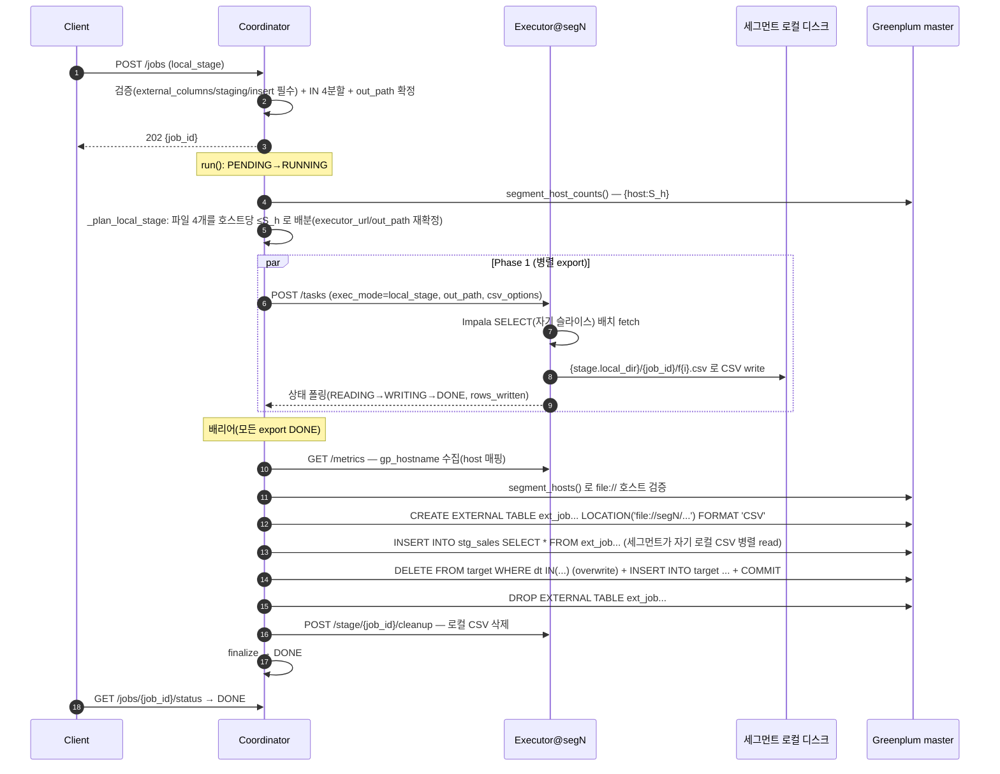

# SCENARIO.md — `local_stage`(file:// 세그먼트 로컬 스테이징) 테스트 시나리오

Client 가 JSON 한 건을 던져 **Impala → (세그먼트 로컬 CSV) → Greenplum `file://` 외부테이블 →
target 적재**까지 성공시키는 과정을, (A) 실제 GP+Impala 환경에서 직접 테스트하는 시나리오와,
(B) GP·Impala 없이 **mock 으로 통합 테스트**하는 설계로 나누어 정리한다.

> 용어: 여기서 "PXF"로 부르던 적재는 실제로는 Greenplum 내장 **`file://` 프로토콜 외부테이블**을
> 쓰는 `exec_mode=local_stage` 파이프라인이다(설계 근거·왜 PXF 가 아닌지는 [DESIGN.md](DESIGN.md) §17).
> executor 를 각 GP 세그먼트 호스트에 co-locate 하고, 각 세그먼트가 자기 호스트 로컬 CSV 를
> 병렬로 읽어 적재한다.

---

## A. 실제 환경 end-to-end 시나리오

### A-1. 사전 준비 (인프라·설정·스키마·권한)

| 항목 | 준비 내용 |
|---|---|
| **토폴로지** | executor 를 **각 GP 세그먼트 호스트**에 배치(호스트당 1개 이상). coordinator 는 GP master 와 분리된 별도 노드. |
| **coordinator 설정** | `greenplum.dsn`(GP master 접속, Phase 2·검증·토폴로지 조회에 사용), `coordinator.executors`(각 executor base URL 목록), `store.backend`(memory/postgres). |
| **executor 설정** | `impala.host`(export 소스), **`greenplum.dsn`**(⚠️ export 는 GP 를 쓰지 않지만 `build_backend` 가 DSN 이 있어야 실백엔드를 고른다 — 연결은 lazy 라 export 경로에선 실제 접속하지 않음), `executor.gp_hostname`(그 호스트의 `gp_segment_configuration.hostname` 과 일치, 미설정 시 OS hostname), `stage.local_dir`. |
| **로컬 디렉터리** | `stage.local_dir`(예: `/data1/query-executor/stage`)가 **모든 세그먼트 호스트에 동일 경로**로 존재하고, executor 프로세스가 write, **GP 세그먼트 postgres(보통 gpadmin)가 read** 가능해야 한다(소유권/퍼미션). |
| **GP 스키마** | target 테이블(`public.sales_mirror`)과 staging 테이블(또는 job 이 만들 `staging_ddl`)이 존재/생성 가능. `gp_segment_configuration` 조회 권한. |
| **CSV 방언** | executor write 와 외부테이블 `FORMAT 'CSV'` 는 같은 설정(`stage.csv_delimiter` 기본 backtick `` ` ``)을 쓰므로 자동 일치. |

### A-2. Client 요청 (POST /jobs)

```http
POST http://<coordinator>:8000/jobs
Content-Type: application/json

{
  "sql": "SELECT user_id, amount, dt FROM sales WHERE dt IN ('2026-06-01','2026-06-02','2026-06-03','2026-06-04') AND region='KR'",
  "partition_column": "dt",
  "target_table": "public.sales_mirror",
  "write_mode": "overwrite_partitions",
  "exec_mode": "local_stage",
  "parallelism": 4,
  "external_columns": "user_id bigint, amount numeric, dt date",
  "staging_table": "stg_sales",
  "staging_ddl": "CREATE TEMP TABLE stg_sales (user_id bigint, amount numeric, dt date) DISTRIBUTED BY (user_id)",
  "insert_sql": "INSERT INTO public.sales_mirror (user_id, amount, dt) SELECT user_id, amount, dt FROM stg_sales"
}
```

- 성공 접수: `202 { "job_id": "job_ab12cd" }`
- 필수 필드 누락: `422 { "error_code": "LOCAL_STAGE_REQUIRES_FIELDS" }`(staging_table·external_columns·insert_sql 중 하나라도 빠지면).
- `external_columns` 는 CSV 컬럼 순서(=SELECT 출력 순서)와 타입이 일치해야 한다.
- `staging_ddl` 은 선택. TEMP 로 두면 세션 종료 시 자동 정리되어 재실행에 깔끔하다.

### A-3. 접수 후 내부에서 일어나는 일 (단계별)



coordinator 가 GP master 에 실제로 실행하는 SQL(Phase 2, 한 트랜잭션):

```sql
CREATE TEMP TABLE stg_sales (...) DISTRIBUTED BY (user_id);         -- staging_ddl
CREATE EXTERNAL TABLE ext_job_ab12cd (user_id bigint, amount numeric, dt date)
  LOCATION ('file://seg1/data1/query-executor/stage/job_ab12cd/f0.csv',
            'file://seg2/data1/query-executor/stage/job_ab12cd/f1.csv', ...)
  FORMAT 'CSV' ( DELIMITER '`' NULL '' QUOTE '"' );
INSERT INTO stg_sales SELECT * FROM ext_job_ab12cd;                 -- 세그먼트 로컬 병렬 read
DELETE FROM public.sales_mirror WHERE dt IN ('2026-06-01', ...);   -- overwrite_partitions
INSERT INTO public.sales_mirror (...) SELECT ... FROM stg_sales;   -- insert_sql
-- COMMIT
DROP EXTERNAL TABLE IF EXISTS ext_job_ab12cd;                      -- cleanup
```

> 단계 이벤트(대시보드/로그 타임라인)에서 외부테이블 DDL 단계 이름은 코드상 `PXF_EXTERNAL_DDL`
> 로 남는다(file:// 도 같은 스테이지명 사용). 그 외 단계: `IMPALA_SUBMIT`·`EXPORT_WRITE`(executor),
> `STAGING_DDL`·`STAGE_LOAD`·`DELETE`·`INSERT`·`COMMIT`·`CLEANUP`(coordinator).

### A-4. 내가 직접 확인해야 할 것 (관찰 포인트)

**① HTTP 응답/상태 (coordinator API)**
```bash
# 접수
curl -s -XPOST http://<coordinator>:8000/jobs -d @job.json -H 'Content-Type: application/json'
# → {"job_id":"job_ab12cd"}

# 진행/최종 상태 (polling)
curl -s http://<coordinator>:8000/jobs/job_ab12cd/status | jq
# 관찰: status DONE, completed==total==4, total_rows_written==예상행수, error==null

# task 상세(단계 타임라인, 감사)
curl -s http://<coordinator>:8000/jobs/job_ab12cd | jq '.tasks[] | {status, rows_written, current_phase, executor_url}'
```
- ✅ `status` 가 SPLITTING→(PENDING)→RUNNING→**DONE** 순으로 전이.
- ✅ 각 task `rows_written` 합 = Phase 1 export 행수.
- ✅ `executor_url` 이 **파일 예산 배분 결과**대로 세그먼트 호스트에 분산(한 호스트에 ≤ S_h 파일).

**② 세그먼트 로컬 CSV (각 세그먼트 호스트에서)**
```bash
# Phase 1 진행/직후 (cleanup 전)
ls -l /data1/query-executor/stage/job_ab12cd/     # f0.csv, f1.csv ... (그 호스트 몫만)
head -n1 /data1/query-executor/stage/job_ab12cd/f0.csv   # backtick(`) 구분자 확인
```
- ✅ 파일이 **각 호스트에 자기 몫만** 생성(호스트당 파일 수 ≤ 그 호스트 primary 세그먼트 수).
- ✅ 구분자/NULL/quote 가 설정과 일치(`FORMAT 'CSV'` 와 동일).
- ✅ 파일 소유권/퍼미션이 GP 세그먼트 프로세스(gpadmin)에게 read 가능.

**③ Greenplum (GP master 에 psql)**
```bash
psql "$GP_DSN" -c "SELECT count(*) FROM public.sales_mirror WHERE dt IN ('2026-06-01','2026-06-02','2026-06-03','2026-06-04');"
psql "$GP_DSN" -c "\det ext_job_ab12cd"   # 적재 후엔 없어야 함(cleanup 으로 DROP)
```
- ✅ target 행수가 기대치만큼 증가(`overwrite_partitions` 면 해당 파티션이 새 데이터로 교체 — 재실행해도 동일).
- ✅ 외부테이블 `ext_job_...` 이 **적재 후 존재하지 않음**(cleanup 완료).

**④ 로컬 파일 정리 (cleanup 후, 각 세그먼트 호스트)**
```bash
ls /data1/query-executor/stage/job_ab12cd/ 2>&1   # No such file or directory (stage.cleanup=true)
```
- ✅ `stage.cleanup=true`(기본)면 job 디렉터리가 삭제됨. 디버깅 시 `false` 로 보존.

**⑤ 로그 (coordinator·executor 일 단위 롤링 + `[job_id][task_id]` 컨텍스트)**
```bash
grep job_ab12cd /data1/query-executor/logs/*.log
```
- ✅ coordinator: `파일 예산 배분 — 4파일, 호스트별={'seg1':2,'seg2':2}`, `local_stage Phase 2 적재 완료(target 반영 N행)`.
- ✅ executor: `EXPORT_WRITE` 단계 시작/종료(소요·행수).
- ✅ WARNING 전용 `*-warn.log` 에 이상 징후가 없는지.

### A-5. 실패 시 어디를 보나 (증상 → 원인 → 관찰)

| 증상 | 원인 | 확인/조치 |
|---|---|---|
| `422 LOCAL_STAGE_REQUIRES_FIELDS` | staging_table/external_columns/insert_sql 누락 | 요청 JSON 필드 확인 |
| job `FAILED`, error "파일 예산 … 초과" | `parallelism` > Σ S_h(호스트별 세그먼트 수 합) | parallelism 낮추기 / executor 호스트·세그먼트 확대 / `stage.max_files_per_host` 확인 |
| job `FAILED`, error "gp_segment_configuration 에 없습니다" | `executor.gp_hostname` ≠ 실제 세그먼트 호스트명 | executor `/metrics` 의 `gp_hostname` 과 `SELECT DISTINCT hostname FROM gp_segment_configuration` 대조 |
| Phase 2 실패(파일 못 읽음/권한) | 로컬 파일 퍼미션·경로 불일치·NFS 아닌 로컬인데 host 매핑 오류 | 세그먼트 호스트에서 파일 존재·read 권한, `stage.local_dir` 동일 경로 확인 |
| export task `FAILED` | Impala 접속/쿼리 오류, 디스크 부족 | executor 로그, `impala.host`/인증 설정, 디스크 여유 |
| CSV 파싱 오류/행 어긋남 | 데이터에 구분자(backtick) 포함 | `stage.csv_delimiter` 를 데이터에 없는 문자로 변경 |

---

## B. GP·Impala 없이 mock 통합 테스트 설계

목표: **실제 GP/Impala 없이** `POST /jobs`→`DONE` 전 과정(검증·분할·**파일 예산 배분**·**host 매핑**·
Phase 1 파일 write·**배리어**·Phase 2 file:// read·target 집계·cleanup)을 **닫힌 루프로** 검증한다.

### B-1. 현재 mock 의 한계 (무엇이 부족한가)

`MockBackend` 는 orchestration 검증용이라 아래를 **하지 않아**, 진짜 통합(파일 배관까지) 검증엔 부족하다:

- `export_to_local_csv` 가 **실제 파일을 쓰지 않고** 행수만 반환 → 파일·CSV 방언·경로를 관찰 불가.
- `load_external_csv` 가 **전달된 DDL/파일을 무시** → file:// URI·host 매핑이 실제로 맞는지 검증 불가.
- `segment_host_counts()`/`segment_hosts()` 가 빈 값 → **예산 배분·host 검증이 건너뛰어짐**.

→ 이 셋을 채운 **`MockLocalStageBackend`**(테스트 전용) 하나면 "Phase 1 이 쓴 파일을 Phase 2 가 그대로
읽어 target 에 넣는" 루프를 닫아, 실제 코드 경로(splitter·dispatcher·stage.py·executor `_run`)를
GP/Impala 없이 통과시킬 수 있다. **운영 코드 변경 불필요** — 백엔드 주입으로만 구성한다.

### B-2. 준비물

| 준비물 | 역할 |
|---|---|
| **`MockLocalStageBackend`** | export=실제 CSV 파일 write, load=DDL 의 `file://` 경로를 파싱해 그 CSV 들을 read→인메모리 `target` 에 append, `segment_host_counts`=지정 토폴로지. **루프를 닫는 핵심.** |
| **가짜 Impala 데이터셋** | export 가 sub_query 의 IN 값에 따라 결정적 행을 만들도록(또는 파일당 고정 N행) 하는 인메모리 소스. |
| **토폴로지 dict** | `{seg1: S1, seg2: S2}` — 예산 배분/검증을 실제로 태운다. |
| **하니스 2종** | (B-3) in-process(LocalDispatcher) / (B-4) 멀티 프로세스 HTTP(HttpDispatcher). |

**`MockLocalStageBackend`** (구현됨: `tests/helpers.py` — B-3·B-4 가 공유):

```python
import csv, os, re
from executor.backend import MockBackend

class MockLocalStageBackend(MockBackend):
    """export=실파일 write, load=file:// 파일 read→target 집계. 토폴로지 제공."""
    def __init__(self, topology=None, rows_per_file=3):
        super().__init__()
        self.topology = dict(topology or {})   # {host: S_h}
        self.rows_per_file = rows_per_file
        self.target = []                       # 인메모리 GP target
        self.exported = []                     # (out_path, rows)
        self.loads = []                        # external_ddl 기록

    # Phase 1: 실제 CSV 파일을 쓴다(가짜 Impala 행).
    def export_to_local_csv(self, sub_query, out_path, csv_options=None,
                            on_progress=None, query_options=None, on_stage=None):
        opts = csv_options or {}
        os.makedirs(os.path.dirname(out_path), exist_ok=True)
        # sub_query 의 IN 값으로 결정적 행 생성(값당 1행). 없으면 rows_per_file 행.
        vals = re.findall(r"'([^']*)'", sub_query) or [f"v{i}" for i in range(self.rows_per_file)]
        with open(out_path, "w", newline="", encoding="utf-8") as f:
            w = csv.writer(f, delimiter=opts.get("delimiter", "`"),
                           quotechar=opts.get("quote", '"'), lineterminator="\n")
            for i, v in enumerate(vals):
                w.writerow([i, 1.0, v])       # (user_id, amount, dt) 형태
        self.exported.append((out_path, len(vals)))
        if on_progress: on_progress(len(vals))
        return len(vals)

    # Phase 2: external_ddl 의 file:// 경로를 파싱해 그 CSV 들을 읽어 target 에 넣는다.
    def load_external_csv(self, external_ddl, staging_ddl, staging_load_sql,
                          pre_delete_sql, insert_sql, cleanup_sqls=None, on_stage=None):
        self.loads.append(external_ddl)
        paths = re.findall(r"file://[^/]*(/[^']+)", external_ddl)  # host 뒤 경로만
        loaded = 0
        for p in paths:
            with open(p, newline="", encoding="utf-8") as f:
                rows = list(csv.reader(f, delimiter="`"))
            self.target.extend(rows); loaded += len(rows)
        return loaded

    def segment_host_counts(self):   # 예산 배분/검증을 실제로 태운다
        return self.topology
```

### B-3. 하니스 1 — in-process (LocalDispatcher)

가장 빠르고 결정적. `_execute`·`_plan_local_stage`·`_run_stage_load` 를 한 프로세스에서 태운다.
export 백엔드와 Phase 2 백엔드가 **같은 인스턴스**라 파일 루프가 자연히 닫힌다.

```python
async def test_local_stage_mock_integration(monkeypatch, tmp_path):
    from coordinator.config import settings
    from coordinator.dispatcher import LocalDispatcher
    from coordinator.models import Job, Task, JobStatus

    monkeypatch.setattr(settings, "executors",
                        ["http://seg1:8087", "http://seg2:8087"], raising=False)
    monkeypatch.setattr(settings, "stage_local_dir", str(tmp_path), raising=False)
    backend = MockLocalStageBackend(topology={"seg1": 2, "seg2": 2})
    disp = LocalDispatcher(settings, backend=backend)

    job = Job(original_sql="SELECT user_id, amount, dt FROM sales "
                           "WHERE dt IN ('d1','d2','d3','d4')",
              partition_column="dt", target_table="public.sales_mirror",
              write_mode="append", parallelism=4, split_strategy="contiguous",
              failure_policy="fail_fast", exec_mode="local_stage",
              external_columns="user_id bigint, amount numeric, dt date",
              staging_table="stg", insert_sql="INSERT INTO public.sales_mirror SELECT * FROM stg")
    # 실제로는 POST /jobs 가 split+out_path 를 채운다. 여기선 4 task 를 직접 구성.
    job.tasks = [Task(job_id=job.job_id, executor_url=None,
                      sub_query=f"SELECT ... WHERE dt IN ('d{i}')",
                      partition_values=[f"'d{i}'"]) for i in range(1, 5)]

    await disp.run(job)

    assert job.status == JobStatus.DONE
    # 파일 예산: 호스트당 ≤ S_h(2), 총 4파일
    from collections import Counter
    from coordinator.stage import host_of
    per_host = Counter(host_of(t.executor_url) for t in job.tasks)
    assert per_host["seg1"] <= 2 and per_host["seg2"] <= 2
    # 루프 닫힘: export 한 행 == load 로 target 에 들어간 행
    assert len(backend.target) == sum(r for _, r in backend.exported)
    # Phase 2 URI 가 gp_hostname(seg1/seg2) 기반
    assert "file://seg1/" in backend.loads[0] and "file://seg2/" in backend.loads[0]
```

**더 실전에 가깝게**: `TestClient(create_app(runner=disp, store=JobStore()))` 로 **실제 `POST /jobs`**
를 태우면 split·out_path·admission·상태 전이까지 그대로 검증된다(coordinator 코드 100% 통과).
```python
runner = LocalDispatcher(settings, backend=MockLocalStageBackend(topology={"seg1":2,"seg2":2}))
client = TestClient(create_app(runner=runner, store=JobStore()))
r = client.post("/jobs", json=<A-2 의 JSON, exec_mode=local_stage>)
job_id = r.json()["job_id"]
assert client.get(f"/jobs/{job_id}").json()["status"] == "DONE"   # BackgroundTasks 동기 실행
```
> 주의: LocalDispatcher 의 `_cleanup_stage` 는 no-op(원격 파일 개념 없음)이라 **파일이 남는다**.
> in-process 에서는 "파일이 써졌고 읽혔다"까지 검증하고, **cleanup 검증은 B-4 또는 executor
> `/stage/{job}/cleanup` 직접 호출**로 한다.

### B-4. 하니스 2 — 멀티 프로세스 HTTP (HttpDispatcher)

> **구현됨**: `tests/test_local_stage_http.py`. executor 2대를 uvicorn 스레드 서버로 띄워 실제
> HTTP 경로(POST /tasks·폴링·`/metrics` gp_hostname 수집·cleanup 팬아웃)를 태우고, 한 호스트에
> executor 가 여럿인 경우(파일 예산 라운드로빈)까지 검증한다.

HTTP 경로(POST /tasks·폴링·`/metrics` gp_hostname 수집·cleanup 팬아웃)까지 덮고 싶을 때. 단일 테스트
머신에서 executor 를 실제 포트로 띄우고, **모든 파일은 공유 파일시스템(로컬)** 에 쓰되 gp_hostname 만
`seg`(또는 `seg1/seg2`)로 흉내 낸다(mock load 는 host 를 무시하고 경로로 읽으므로 멀티 호스트를 1머신에서 재현).

준비:
1. **executor N개**: `create_executor_app(backend=MockLocalStageBackend(...))` 를 각각 `uvicorn`
   서브프로세스(또는 스레드)로 `127.0.0.1:PORT_i` 에 기동. 각 프로세스에 `EXECUTOR_GP_HOSTNAME=seg{i}`,
   `stage.local_dir=<공유 tmp>` 설정 → `/metrics` 가 `gp_hostname=seg{i}` 를 보고.
2. **coordinator**: `HttpDispatcher(settings)` 를 만들되 Phase 2 백엔드를 주입 →
   `disp._stage_backend = MockLocalStageBackend(topology={"seg1":..,"seg2":..})`. `settings.executors`
   를 `["http://127.0.0.1:PORT_1", ...]` 로. `create_app(runner=disp, store=...)`.
3. `POST /jobs` → 폴링으로 `DONE` 대기.

검증(추가): `/metrics` 로 수집한 gp_hostname 이 file:// URI 에 반영, cleanup 팬아웃 후 각 job 디렉터리
삭제, 폴링 상태 전이(QUEUED→READING→WRITING→DONE)까지 관찰.

> 트레이드오프: B-4 는 실제 소켓/프로세스라 느리고 불안정 요소(포트·타이밍)가 있다. **기본은 B-3
> (in-process, 결정적)로 커버**하고, HTTP 특화(폴링·failover·gp_hostname 수집·cleanup)만 B-4 로 얇게 덮는다.

### B-5. mock 통합에서 확인할 것 (assertions 체크리스트)

- [ ] `POST /jobs` → 202, 이후 `GET /jobs/{id}/status` 가 **DONE**.
- [ ] `completed==total==parallelism`(예산 초과가 아니라면), `total_rows_written` 이 export 합과 일치.
- [ ] **파일 예산**: 호스트당 파일 수 ≤ S_h, 총 파일 = min(parallelism, Σ S_h). 초과 케이스는 **FAILED + "예산 초과"**.
- [ ] **host 매핑**: Phase 2 `external_ddl` 의 `file://<host>` 가 executor 가 보고한 gp_hostname(≠ URL 호스트).
- [ ] **host 검증**: 토폴로지에 없는 호스트면 **FAILED + "gp_segment_configuration 에 없습니다"**.
- [ ] **루프 닫힘**: `len(backend.target)` == Phase 1 export 총행수(파일이 실제로 써지고 읽혔다).
- [ ] **CSV 방언**: 파일 첫 줄이 backtick 구분자(설정 오버라이드 시 그 값).
- [ ] **멱등(overwrite)**: 같은 job 을 retry 해도 target 결과가 동일(선삭제 DELETE 반영).
- [ ] (B-4) cleanup 후 로컬 job 디렉터리 삭제, 폴링 상태 전이 관찰.

### B-6. 기존 테스트와의 관계 / 남은 개선

- `tests/test_local_stage.py`(31개)는 stage.py 순수 함수·executor 라우팅·2-phase·gp_hostname·
  파일 예산을 **얇게** 덮는다. `tests/test_local_stage_integration.py`(B-3, in-process)와
  `tests/test_local_stage_http.py`(B-4, 실 HTTP)가 `MockLocalStageBackend`(`tests/helpers.py`)로
  **"파일 루프 닫힘"** 통합을 더한다.
- **운영 코드 개선 후보**(테스트하며 드러난 것):
  - `build_backend` 가 `greenplum.dsn` 없이 **impala-only export 백엔드**를 고르게 하면, export 전용
    executor 가 GP DSN 없이도 실백엔드를 쓸 수 있다(현재는 DSN 필요, 연결은 lazy 라 무해하지만 혼란).
  - 실 `ImpalaToGreenplumBackend.export_to_local_csv` 의 CSV writer 를 **가짜 impyla 커서 주입**으로
    단위 테스트(현재 impyla 부재로 목 경유). `impala.dbapi.connect` 를 주입 가능하게 하면 실 writer 로직까지 검증 가능.
```
