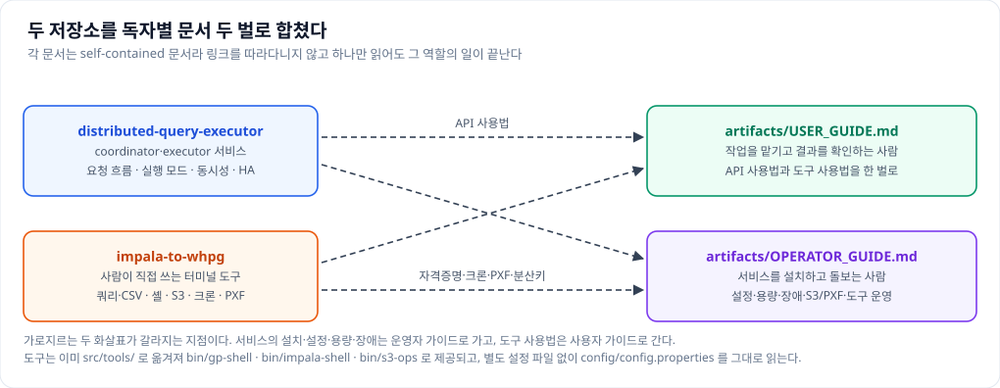

# artifacts

이 디렉터리는 **분산 쿼리 실행기**를 처음 접하는 사람도 읽을 수 있게 쓴 문서 모음이다. 두 저장소에
흩어져 있던 내용을 독자별로 한 벌씩 정리했다.

## 이 시스템이 하는 일

먼저 이 시스템이 무엇인지부터 짚는다. 한마디로 **큰 데이터를 한 데이터베이스에서 다른 데이터베이스로
빠르게 옮겨 주는 도구**다.

옮길 데이터가 수억 건이라고 해 보자. 사람이 `SELECT` 를 한 번 던져 결과를 받아 넣으면 그 한 줄기로만
데이터가 흐르니 몇 시간이 걸린다. 이 시스템은 그 `SELECT` 하나를 **여러 조각으로 쪼개** 여러 대의
서버가 동시에 읽어 동시에 넣게 한다. 열 조각으로 나누면 대략 열 배 빨라지는 셈이다.

구성은 단순하다. 일을 받아 쪼개고 나눠 주는 **coordinator** 한 대와, 실제로 데이터를 옮기는
**executor** 여러 대다. 데이터는 coordinator 를 거치지 않고 executor 가 원본에서 읽어 목적지로 곧장
보낸다. coordinator 에게는 "몇 건 넣었다", "끝났다" 같은 소식만 올라온다.

## 어디부터 읽어야 하나

문서가 열 개 남짓 되니 어디부터 볼지부터 정하는 편이 낫다.

| 지금 하려는 일 | 읽을 문서 |
|---|---|
| 데이터를 옮기는 일을 맡기고 결과를 확인하고 싶다 | `USER_GUIDE.md` |
| 이 시스템을 설치하고 돌보는 일을 맡았다 | `OPERATOR_GUIDE.md` |
| 코드를 열어 고치거나 이해해야 한다 | `class-diagram.md` → `sequence-diagram.md` |
| 시스템 구조를 문서로 보고해야 한다 | `sw-architecture.md` · `tech-architecture.md` · `data-architecture.md` |
| 어떤 표에 무엇이 들어 있는지 알아야 한다 | `er-diagram.md` → `tables.md` |
| 다른 프로그램을 이 시스템에 붙여야 한다 | `interface.md` |
| 각 프로그램이 무슨 일을 어떤 순서로 하는지 알아야 한다 | `program-spec.md` |

두 가이드는 **하나만 읽어도 일이 끝나도록** 만들었다. 필요한 내용을 다른 문서에서 링크로 넘기지 않고
그 안에 다 담았다는 뜻이다. 그래서 문서끼리 겹치는 설명이 있는 것이 정상이다.

## 문서 하나씩

[USER_GUIDE.md](USER_GUIDE.md) 는 **이관 작업을 맡기는 사람**을 위한 것이다. 이관을 요청하는 API 를
어떻게 부르는지, 옮기는 방식(`exec_mode`)을 무엇으로 고를지, 쿼리를 서버에 미리 등록해 두고
파라미터만 보내는 템플릿을 어떻게 쓰는지, 날짜 구간을 하루씩 나눠 도는 방법은 무엇인지, 오류가 났을
때 코드가 무슨 뜻인지를 다룬다. 여기에 터미널에서 직접 쓰는 도구
셋(`gp-shell`·`impala-shell`·`s3-ops`)의 사용법과, 이관이 정말 잘 됐는지 눈으로 확인하는 절차까지
붙였다.

[OPERATOR_GUIDE.md](OPERATOR_GUIDE.md) 는 **서비스를 설치하고 돌보는 사람**을 위한 것이다. 설치와
설정에서 시작해 매일 뭘 봐야 하는지, 로그를 어떻게 읽는지, 동시에 몇 건까지 받게 할지, 문제가 생겼을
때 원인을 어떻게 좇는지를 다룬다. 그다음으로 coordinator 를 여러 대 띄우는 구성, S3 를 거쳐 적재할
때 필요한 준비, 목적지 테이블을 어떻게 나눠 저장할지, 도구를 여러 사람이 쓸 때의 비밀번호 관리와
자동 실행, 그리고 새 버전으로 올리는 절차가 이어진다.

[class-diagram.md](class-diagram.md) 와 [sequence-diagram.md](sequence-diagram.md) 는 **코드를 여는
사람**을 위한 것이다. 앞의 것은 기능별로 어느 파일에 무엇이 들어 있는지를 일곱 장의 그림으로 보여
준다. 뒤의 것은 요청 하나가 들어와 끝날 때까지 누가 누구를 언제 부르는지를 여섯 장의 그림으로
좇는다. 두 문서 끝에는 같은 계열의 이관 도구인 DataDynamics/whpg-to-whpg 를 같은 방식으로 그린
부록이 붙어 있다.

[sw-architecture.md](sw-architecture.md) 는 **소프트웨어를 어떤 구조로 나눴는지**를 다루는 아키텍처
정의서다. 이 시스템의 소프트웨어를 세 갈래(요청을 받아 판단하는 쪽, 데이터를 실제로 옮기는 쪽,
사람이 터미널에서 쓰는 도구)로 나눠 설명하고, 그 구조가 실제 코드에 어떻게 적용됐는지, 바깥의 어떤
시스템과 어떻게 이어지는지까지 담았다.

[tech-architecture.md](tech-architecture.md) 는 **어떤 장비 위에 어떻게 올리고 운영하는지**를 다루는
아키텍처 정의서다. 어떤 소프트웨어를 어느 버전으로 쓰는지, 구성 요소가 각각 무엇을 하는지, 무엇을
백업하고 어떻게 되돌리는지, 보안은 어떻게 잡았는지, 한 대가 죽어도 계속 도는지를 다룬다. 하드웨어와
네트워크처럼 아직 정해지지 않은 절은 표의 뼈대만 두고 비워 두었다.

[data-architecture.md](data-architecture.md) 는 같은 시스템을 **데이터의 눈으로** 본 아키텍처
정의서다. 이 시스템은 데이터를 소유하지 않고 옮기기만 한다는 데서 출발해, 데이터를 세 갈래(지나가는
데이터, 시스템이 가진 데이터, 잠깐 쓰고 버리는 데이터)로 가른다. 이어서 이름과 시각을 적는 규칙,
데이터가 갈라지고 합쳐지는 흐름, 같은 작업을 두 번 돌려도 안전한가, 보안과 보관 기간, 용량이 얼마나
늘어나는가를 다룬다.

[er-diagram.md](er-diagram.md) 는 **이 시스템이 무엇을 기억하는지**를 그림으로 보여 준다. 개념과
관계만 그린 것 한 장과, 실제로 만들어지는 표를 그대로 그린 것 두 장이 들어 있다.
[tables.md](tables.md) 는 그 표 일곱 개를 컬럼 하나하나까지 적은 명세서다. 컬럼마다 타입과 길이,
값이 비어도 되는지, 키인지, 기본값과 설명과 예제값을 담았고, 실제 DDL 파일과 자동으로 대조해 맞췄다.
같은 내용을 표별로 시트를 나눈 엑셀이 [tables.xlsx](tables.xlsx) 다.

[interface.md](interface.md) 는 **밖에서 이 시스템에 말을 거는 방법**을 적은 인터페이스 정의서다.
데이터를 옮기는 일을 맡기고 지켜보는 인터페이스, 결과를 바로 받아 보는 인터페이스, 시스템 상태를
들여다보는 인터페이스 열아홉 개를 다루며, 하나하나에 대해 무엇을 보내고 무엇이 돌아오는지를 항목
단위로 적었다. 연동 프로그램을 만들 때 이 문서 하나만 보면 되도록 응답 코드와 오류 코드, 시각과
식별자를 적는 규칙도 앞에 함께 담았다. 같은 내용을 인터페이스별로 시트를 나눈 엑셀이
[interface.xlsx](interface.xlsx) 다.

[program-spec.md](program-spec.md) 는 **핵심 프로그램 열세 개가 무슨 일을 어떤 순서로
하는지**를 적은 프로그램 명세서다. 프로그램마다 어떤 물건인지(개요)와 처리 로직을 일련번호 순서로 담았고, 처리
로직에는 실제 코드 대신 의사코드를 실었다. 파이썬을 모르는 사람도 순서를 읽을 수 있어야 하고 코드가
조금 바뀌어도 문서가 곧바로 낡지 않게 하기 위해서다. 같은 내용을 프로그램별로 시트를 나눈 엑셀이
[program-spec.xlsx](program-spec.xlsx) 이며, 한 프로그램이 한 줄이 되도록 담아 처리 로직 칸 하나에
모든 단계가 설명과 의사코드까지 함께 들어 있다.

## Word 판

다섯 문서는 다른 문서에 옮겨 붙이기 좋도록 Word 판을 함께 둔다. 두
가이드([USER_GUIDE.docx](USER_GUIDE.docx), [OPERATOR_GUIDE.docx](OPERATOR_GUIDE.docx))와 세
정의서([sw-architecture.docx](sw-architecture.docx),
[tech-architecture.docx](tech-architecture.docx),
[data-architecture.docx](data-architecture.docx))다.

Word 판에는 꾸밈을 넣지 않았다. Word 가 원래 갖고 있는 기본 스타일만 썼기 때문에, 다른 문서에 붙여
넣으면 그 문서의 서식을 그대로 따라간다. 색이나 글꼴이 튀지 않는다는 뜻이다.

**원본은 어디까지나 `.md` 파일이다.** Word 판은 그것을 옮긴 사본이므로, 내용을 고칠 때는 `.md` 를
고친 뒤 다시 변환한다. `docs/` 의 사용자·운영자 문서도 같은 방식으로 만든
`USER.docx`·`OPERATOR.docx` 를 함께 둔다.

두 다이어그램 문서는 성격이 달라 **그림만 담은 Word 판**을 따로
둔다([class-diagram.docx](class-diagram.docx),
[sequence-diagram.docx](sequence-diagram.docx)). 설명은 모두 빼고 다이어그램 이름과 그림만 한 쪽에
하나씩 넣었으므로, 발표 자료나 다른 보고서에 그림을 통째로 옮겨 붙일 때 쓴다. 그림이 왜 그렇게
생겼는지에 대한 설명은 `.md` 쪽에 있다.

## 무엇을 합쳤는가

이 디렉터리는 두 저장소의 내용을 합친 것이다.

**DataDynamics/distributed-query-executor** 에서는 coordinator·executor 서비스와 그 운영을 가져왔다.
요청이 들어와 처리되는 흐름, 옮기는 방식 다섯 가지, 쿼리 템플릿, 동시에 몇 건까지 받을지 정하는
값들, coordinator 를 여러 대 띄우는 구성, 감시와 로그가 여기에 해당한다.

**DataDynamics/impala-to-whpg** 에서는 사람이 터미널에서 직접 쓰는 도구와 그 운영을 가져왔다. 쿼리를
돌려 CSV 로 뽑는 일, 대화형 셸, S3 객체를 다루는 일, 비밀번호 관리와 자동 실행, 종료 코드, S3 를
목적지에서 읽게 만드는 구성, 목적지 테이블을 어떻게 나눠 저장할지가 여기에 해당한다.

두 번째 저장소의 도구는 이미 이 저장소의 `src/tools/` 로 옮겨져
`bin/gp-shell`·`bin/impala-shell`·`bin/s3-ops` 로 제공된다. 중요한 점은 이 도구들이 **별도 설정 파일
없이 서비스와 같은 `config/config.properties` 를 그대로 읽는다**는 것이다. 접속 정보를 두 곳에 적어
두면 한쪽만 고쳐서 어긋나는 사고가 나기 때문이다. 그래서 이 디렉터리의 문서는 서비스와 도구를 하나의
설정 체계 위에서 함께 설명한다.

원본 저장소의 설명 중 이 저장소에 맞지 않는 부분은 고쳐 실었다. 자체 설정 파일이나 옛 실행 스크립트
이름, 예전 데이터베이스 드라이버 같은 것들이 그렇다.

## 그림

문서에 들어가는 그림은 `images/` 아래에 SVG 로 두었다. SVG 는 그림을 점이 아니라 선으로 기억하는
형식이라 아무리 확대해도 글자가 뭉개지지 않는다. 이 시스템은 외부 인터넷이 막힌 환경(에어갭)에
설치되므로, 바깥의 이미지 주소를 참조하지 않고 저장소 안의 파일만 쓴다.

가이드 쪽 그림은 이렇다. 전체 구성(`architecture.svg`), 작업이 거치는 상태(`job-lifecycle.svg`),
옮기는 방식별로 데이터가 지나는 길(`exec-modes.svg`), 요청부터 확인까지의 흐름(`verify-loop.svg`),
과부하를 막는 세 겹의 방어(`admission.svg`), 작업 조각 하나의 시간이 어디에
쓰였는지(`task-timing.svg`), S3 를 거치는 3단계(`s3-stage-phases.svg`), 백업
구성(`backup-topology.svg`), 바깥 시스템과의 연결(`integration-model.svg`), 데이터 세
갈래(`data-domains.svg`)와 그 수명(`data-lifecycle.svg`), 그리고 이 디렉터리의
구성(`merge-map.svg`)이다.

클래스 그림은 `class-*.svg`, 시퀀스 그림은 `seq-*.svg`, ER 그림은 `er-*.svg` 다. 이 셋과 Word 판이
쓰는 그림들은 같은 이름의 PNG 도 함께 둔다. Word 가 SVG 를 그리지 못하기 때문이다. PNG 는 가로 두 배
해상도로 뽑아 두었으므로 발표 자료나 사내 위키에 그대로 써도 선명하다. 그림을 고칠 때는 SVG 를
고치고 PNG 를 다시 뽑아 둘을 함께 갱신한다.

## `docs/` 와의 관계

이 저장소에는 `docs/` 디렉터리에도 문서가 있다. 헷갈릴 수 있으니 관계를 정리해 둔다.

`docs/USER.md` 와 `docs/OPERATOR.md` 는 **이 저장소 안의 서비스만** 다루는 역할별 문서다.
DESIGN·GUIDE·INTEGRATION·DEPLOY·PERFORMANCE 는 주제 하나를 깊게 파는 문서다.

이 디렉터리의 두 가이드는 거기에 **터미널 도구 쪽 지식까지 합쳐**, 두 저장소를 함께 쓰는 환경을
하나로 설명한 것이다. 그래서 내용이 겹친다. 겹치는 사실을 바꿀 때는 양쪽을 함께 고친다.
