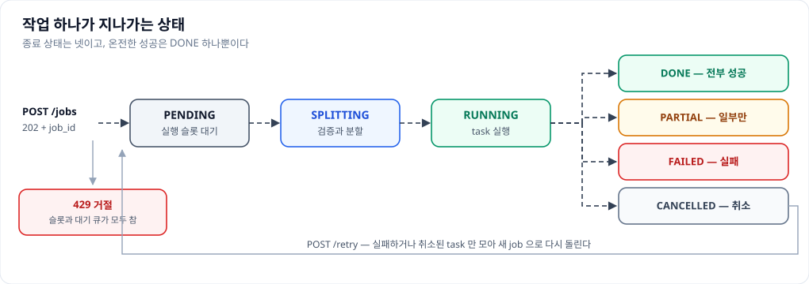
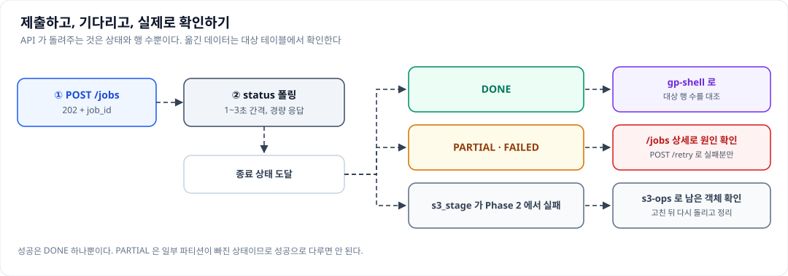

# 통합 사용자 가이드

이 문서는 분산 쿼리 실행기(Distributed Query Executor)에 일을 맡기거나, 같은 환경에 함께 설치된
터미널 도구로 Impala·Greenplum·S3 를 직접 들여다보는 사람을 위한 것이다. 원래 두 저장소에 나뉘어
있던 내용을 하나로 합쳤다. 앞의 두 장은 HTTP 로 이관 작업을 맡기는 이야기이고, 뒤의 두 장은
터미널에서 직접 쿼리를 던지고 결과 파일을 다루는 이야기다.

다른 문서를 오가지 않고 이 문서 하나만 읽어도 일이 끝나도록 필요한 내용을 모두 담았다. 설치와 접속
정보 설정, 용량 조정처럼 서버를 돌보는 쪽 이야기는 같은 디렉터리의 운영자 가이드에 있다.

두 축이 어떻게 나뉘는지만 먼저 잡아 두면 나머지는 쉽다. **서비스**(coordinator + executor)는 큰
데이터를 병렬로 옮기는 일을 대신해 주는 쪽이고, 사용자는 `8088` 포트의 coordinator 한 곳만
상대한다. **터미널 도구**(`bin/gp-shell`·`bin/impala-shell`·`bin/s3-ops`)는 서비스와 무관하게 사람이
직접 쓰는 쪽이라, 이관 결과가 제대로 들어갔는지 확인하거나 스테이징으로 남은 S3 객체를 정리할 때
쓴다. 둘은 같은 설정 파일에서 접속 정보를 읽으므로 같은 값을 두 번 적을 필요가 없다.


그림에서 눈여겨볼 것은 데이터가 coordinator 를 지나가지 않는다는 점이다. 요청과 상태만 굵지 않은
점선을 타고 오가고, 실제 데이터는 executor 가 소스에서 읽어 대상으로 곧장 흘려보낸다.

---

# 1장. 이관 작업 맡기기

## 어떤 일을 대신 해 주는가

`SELECT` 한 건을 주면 그것을 파티션 컬럼의 `IN` 목록 기준으로 여러 조각으로 나눠 동시에 읽고, 각
조각을 나눠 맡은 executor 가 곧바로 Greenplum 에 적재한다. 조각을 나누는 것도 병렬로 읽는 것도
적재하는 것도 서버가 하므로, 요청하는 쪽은 무엇을 어디로 옮길지만 알려 주면 된다.

데이터 자체는 coordinator 를 거치지 않는다. executor 가 소스에서 읽어 대상으로 바로 흘려보내고
coordinator 에는 진행 상태와 적재 행 수만 올라온다. 그래서 작업이 아무리 커도 coordinator 의 응답은
가볍지만, 반대로 작업 결과를 HTTP 응답으로 돌려받을 수는 없다. 옮긴 데이터는 대상 테이블에 있다.

작업은 비동기다. `POST /jobs` 는 접수만 하고 `job_id` 를 즉시 돌려주며 실제 실행은 그 뒤에
백그라운드로 진행되므로, 제출과 완료 확인은 언제나 두 단계다. 결과 행을 그 자리에서 받아야 하는
미리보기성 조회만 예외인데, 그것은 `POST /query-execute` 라는 별도 API 이며 뒤에서 따로 다룬다.

## 첫 작업 제출

가장 단순한 형태는 SQL 과 분할 기준 컬럼, 대상 테이블 세 가지다.

```bash
curl -s localhost:8088/jobs -H 'content-type: application/json' -d '{
  "sql": "SELECT user_id, amount, dt FROM sales WHERE dt IN ('2026-01-01','2026-01-02') AND region='KR'",
  "partition_column": "dt",
  "target_table": "public.sales_mirror",
  "parallelism": 2
}'
# → 202 {"job_id": "job_ab12cd34"}
```

여기서 `partition_column` 은 `IN` 목록으로 나눌 기준 컬럼이다. 위 요청은 `dt IN ('2026-01-01',
'2026-01-02')` 를 두 조각으로 갈라 각각 하루씩 읽는다. 그러므로 이 컬럼에 대한 `IN` 절이 SQL 안에
반드시 있어야 하고, 값이 `parallelism` 보다 적으면 그만큼만 나뉜다.

자주 쓰는 나머지 필드를 훑어보면 이렇다. `parallelism` 은 몇 조각으로 나눌지를 1에서 128 사이로
정하며 기본값은 4다. `split_strategy` 는 값을 잇달아 묶을지(`contiguous`, 기본) 번갈아 나눌지
(`round_robin`)를 고르고, `write_mode` 를 `overwrite_partitions` 로 두면 적재하기 전에 그 조각이 맡은
파티션을 먼저 지운다. `failure_policy` 는 한 조각이 실패했을 때 전체를 실패로 볼지(`fail_fast`, 기본)
나머지는 계속할지(`best_effort`)를 정한다. 이력과 감사에 남으므로 `username` 은 채워 두는 편이 좋다.

파싱과 관련된 두 필드도 알아 둘 만하다. `sql_dialect` 는 SQL 을 해석할 방언(dialect)이며 기본값은
`hive` 다. `strict_validation` 은 기본값이 `true` 로 단순한 SELECT 만 받는데, JOIN 이나 서브쿼리,
GROUP BY 가 섞인 복합 쿼리를 보내려면 `false` 로 둔다. 그러면 파티션 `IN` 절을 쿼리 트리 어디에
있든 찾아 나눈다. 소스가 Impala 라면 `impala_query_options` 로 그 작업에만 적용할 SET 옵션을
넘길 수 있다(예: `{"MEM_LIMIT": "2g", "REQUEST_POOL": "etl"}`). 이 옵션은 소스 SELECT 에만 붙고
Greenplum 쪽 INSERT 에는 영향을 주지 않는다.

처음 만드는 요청이라면 `dry_run` 을 켜 보는 편이 좋다. 실제로는 아무것도 옮기지 않으면서 `200` 과
함께 분할 계획을 돌려주므로, 각 조각의 `sub_query` 와 `staging_ddl`, `insert_sql` 이 어떻게
만들어지는지를 눈으로 확인할 수 있다.

### 같은 요청을 두 번 보내지 않으려면

네트워크가 끊겨 응답을 못 받았을 때 그냥 다시 보내면 같은 작업이 두 번 돌 수 있다. 이를 막으려면
`Idempotency-Key` 헤더에 요청마다 고유한 값을 실어 보낸다.

```bash
curl -s localhost:8088/jobs \
  -H 'content-type: application/json' \
  -H 'Idempotency-Key: sales-mirror-2026-01-02' \
  -d '{...}'
```

같은 키로 같은 본문이 다시 오면 서버는 새 작업을 만들지 않고 원래 작업을 그대로 돌려준다. 이때는
`202` 가 아니라 `200` 이 오고 `Idempotency-Replayed: true` 헤더가 붙으므로 재생인지 아닌지를 구분할
수 있다. 같은 키인데 본문이 다르면 `409` 로 거절하는데, 키를 재사용하다 엉뚱한 작업을 덮어쓰는
사고를 막기 위해서다.

## exec_mode 고르기

같은 "읽어서 넣는다"라도 데이터가 흐르는 경로는 여러 가지다. 요청 스키마는 모든 모드가 공유하는
하나이고 어떤 파이프라인으로 실행할지는 `exec_mode` 필드 하나가 정한다. 같은 SELECT 와 파티션,
target 을 두고 이 값만 바꾸면 COPY 로 넣을지 staging 을 거칠지 외부테이블로 넣을지가 갈린다.

다섯 경로를 나란히 늘어놓으면 무엇이 다른지가 한눈에 들어온다.


말로 옮기면 이렇다. `copy` 는 소스에서 읽은 결과를 executor 가 Greenplum 으로 곧장 COPY 하며 추가
필드가 없고 `write_mode` 를 지원한다. `statement` 는 받은 SQL 을 대상이 그대로 실행하므로 executor
를 지나는 COPY 스트림이 아예 없다. `stage_insert` 는 staging 을 거쳐 target 으로 INSERT 하는 표준
경로이며 `staging_table` 과 `wrapper_query` 가 필수이고, `write_mode` 를 적용하지 않아 적재가 언제나
append 다. `local_stage` 와 `s3_stage` 는 executor 가 CSV 를 만들어 두면 Greenplum 이 외부테이블로
당겨 읽는 2-phase 구조여서 둘 다 `staging_table` 과 `external_columns`, `insert_sql` 이 필수이고
`write_mode` 를 지원하며, 차이는 스테이징 매체와 배치 제약뿐이다.

기본값은 `copy` 이며 대부분의 경우에 맞는다. 템플릿을 쓰면 manifest 의 `exec_mode` 가 기본값이
되고, 요청에 명시하면 요청이 이긴다. 모드마다 요청에 더 넣어야 하는 필드가 다르고, 빠지면 접수
시점에 `422` 로 걸러진다.

### copy — 가장 단순한 경로

소스에서 읽은 결과를 Greenplum 에 곧바로 COPY 한다. 추가 필드가 없어 `sql`·`partition_column`·
`target_table` 만 있으면 되고, 위 "첫 작업 제출"의 예가 그대로 이 모드다. 분할된 sub-query 를 감싸야
한다면 `wrapper_query` 에 감쌀 쿼리를 두고 `{{SUBQUERY}}` 자리에 각 조각이 치환되게 한다
(자리표시자는 `wrapper_placeholder` 로 바꿀 수 있다). `write_mode: overwrite_partitions` 를
지원하므로 재실행 멱등이 성립한다.

### statement — 옮기지 않고 대상에서 실행

받은 INSERT 문을 대상 데이터베이스에서 그대로 실행한다. 소스와 대상이 같은 엔진이거나, 대상이
외부테이블로 원본을 직접 읽을 수 있어 데이터를 executor 로 끌어올 필요가 없을 때 쓴다. 이 모드에서는
executor 가 SQL 제출과 폴링만 하므로 COPY 스트림이 아예 없다.

### stage_insert — staging 을 거치는 표준 이관

소스 SELECT 결과를 Greenplum staging(보통 TEMP) 테이블에 COPY 로 실은 뒤 `INSERT … SELECT FROM
staging` 으로 최종 테이블에 반영한다. 소스와 대상 엔진이 다르거나 컬럼 매핑, 복잡한 INSERT 가
필요할 때 쓰는 표준 패턴이다.

```jsonc
POST /jobs
{
  "exec_mode": "stage_insert",
  "sql": "SELECT user_id, amount, dt FROM sales WHERE dt IN ('2026-07-01','2026-07-02')",
  "partition_column": "dt",
  "target_table": "public.sales",
  "staging_table": "stg_sales",                     // 필수
  "staging_ddl": "CREATE TEMP TABLE stg_sales (user_id bigint, amount numeric, dt date)",  // 선택
  "wrapper_query": "INSERT INTO public.sales (user_id, amount, dt) SELECT * FROM stg_sales", // 필수
  "parallelism": 4
}
```

INSERT 문은 `wrapper_query` 필드에 담는다. `copy` 모드와 달리 `{{SUBQUERY}}` 를 쓰지 않고
staging 에서 읽어 target 으로 넣는 완성된 문장이어야 한다. `staging_table` 과 `wrapper_query` 가 둘 다
없으면 `422 STAGE_INSERT_REQUIRES_FIELDS` 다.

`staging_ddl` 은 선택이며, 비우면 테이블 생성을 건너뛰고 이미 존재하는 `staging_table` 을 쓴다. 이때는
영구 staging 을 여러 조각이 공유하지 않도록 격리해야 한다. 그러지 않으면 동시 COPY 와 INSERT 가
서로 간섭한다. TEMP 로 만들어 두면 세션 단위라 조각끼리 격리되고, 조각이 실패해도 그 세션의
staging 이 함께 사라져 깨끗한 상태에서 다시 시작된다. SELECT 컬럼과 staging 컬럼은 이름·개수·순서가
일치해야 COPY 가 성공하며, `CREATE TEMP TABLE ... (LIKE 대상)` 이 가장 안전하다.

한 가지 주의할 점은 이 모드가 `write_mode` 를 적용하지 않는다는 것이다. 적재는 항상 append 이므로
같은 날짜를 두 번 실행하면 중복된다. 멱등이 필요하면 대상 테이블을 작업 밖에서 미리 비우거나
날짜별 물리 테이블을 쓴다.

### local_stage — 세그먼트가 로컬 파일을 병렬로 읽음

executor 가 소스에서 읽은 데이터를 세그먼트 호스트 로컬 CSV 로 떨어뜨리고(Phase 1), coordinator 가
그 파일들을 Greenplum 의 `file://` 외부테이블로 걸어 각 세그먼트가 자기 호스트의 CSV 를 병렬로 읽어
적재한다(Phase 2). 세그먼트 병렬성을 그대로 살리므로 대량 적재에 강하다. 대신 executor 를 각 GP
세그먼트 호스트에 함께 두어야 한다는 배치 제약이 있으므로, 쓸 수 있는 환경인지 운영자에게 확인한다.

```jsonc
POST /jobs
{
  "exec_mode": "local_stage",
  "sql": "SELECT user_id, amount, dt FROM sales WHERE dt IN ('2026-06-01','2026-06-02','2026-06-03','2026-06-04') AND region='KR'",
  "partition_column": "dt",
  "target_table": "public.sales_mirror",
  "write_mode": "overwrite_partitions",
  "parallelism": 4,
  "external_columns": "user_id bigint, amount numeric, dt date",
  "staging_table": "stg_sales",
  "staging_ddl": "CREATE TEMP TABLE stg_sales (user_id bigint, amount numeric, dt date) DISTRIBUTED BY (user_id)",
  "insert_sql": "INSERT INTO public.sales_mirror (user_id, amount, dt) SELECT user_id, amount, dt FROM stg_sales"
}
```

`staging_table`·`external_columns`·`insert_sql` 중 하나라도 빠지면 `422 LOCAL_STAGE_REQUIRES_FIELDS`
다. `external_columns` 는 외부테이블의 컬럼 정의이며 CSV 컬럼 순서, 즉 SELECT 출력 순서와 타입이
일치해야 한다. `staging_ddl` 은 선택이고 TEMP 로 두면 세션 종료 시 자동 정리되어 재실행에 깔끔하다.
이 모드는 `write_mode` 를 지원하므로 `overwrite_partitions` 로 두면 적재 전 해당 파티션을 DELETE 로
지워 재실행 멱등이 성립한다.

### s3_stage — S3 를 거치므로 배치 제약이 없음

`local_stage` 와 같은 2-phase 구조이고 스테이징 매체만 세그먼트 로컬 파일이 아니라 S3 객체다.
Phase 1 에서 각 executor 가 결과를 로컬 CSV 로 떨어뜨린 뒤 S3 에 올리고, 배리어 뒤 Phase 2 에서
coordinator 가 그 객체들을 PXF 외부테이블 하나로 걸어 target 에 INSERT 한다. S3 는 위치와 무관하게
읽히므로 executor 를 세그먼트에 함께 둘 필요가 없다.

```jsonc
POST /jobs
{
  "exec_mode": "s3_stage",
  "sql": "SELECT user_id, amount, dt FROM sales WHERE dt IN ('2026-06-01','2026-06-02','2026-06-03','2026-06-04') AND region='KR'",
  "partition_column": "dt",
  "target_table": "public.sales_mirror",
  "write_mode": "overwrite_partitions",
  "parallelism": 4,
  "external_columns": "user_id bigint, amount numeric, dt date",
  "staging_table": "stg_sales_s3",
  "insert_sql": "INSERT INTO public.sales_mirror (user_id, amount, dt) SELECT user_id, amount, dt FROM stg_sales_s3"
}
```

필수 필드는 `local_stage` 와 같고 빠지면 `422 S3_STAGE_REQUIRES_FIELDS` 다. 다만 `staging_ddl` 은
주지 않는다. heap staging 없이 S3 외부테이블을 최종 INSERT 의 소스로 곧장 쓰기 때문이다.
`staging_table` 은 `insert_sql` 의 `FROM` 이 참조하는 이름일 뿐이고, coordinator 가 Phase 2 에서 이를
작업 고유 외부테이블 이름으로 치환한다.

이 모드에는 `pre_delete` 라는 추가 손잡이가 있다. 기본값 `null` 이면 `write_mode` 를 따라
`overwrite_partitions` 는 지우고 `append` 는 지우지 않는다. `true` 면 `write_mode` 와 무관하게 강제로
지우고, `false` 면 강제로 건너뛴다. `overwrite_partitions` 지만 대상이 이미 비어 있어 DELETE 를
생략하고 싶을 때, 또는 `append` 인데도 멱등이 필요할 때 쓴다.

## 템플릿으로 요청하기

SQL 전문을 매번 만들어 보내는 대신, 서버에 등록된 템플릿에 값만 넘길 수 있다. 쿼리가 서버에서
관리되므로 요청하는 쪽이 테이블 구조나 적재 규칙을 알 필요가 없고, 쿼리가 바뀌어도 호출하는 코드는
그대로다.

```bash
curl -s localhost:8088/jobs -H 'content-type: application/json' -d '{
  "template_id": "sales_migration",
  "params": {"start_dt": "2026-07-01", "end_dt": "2026-07-07", "regions": ["KR"]},
  "parallelism": 4
}'
```

쓸 수 있는 템플릿은 `GET /templates` 로 확인한다. `template_id` 를 주면 `sql`·`staging_ddl`·
`insert_sql`·`external_columns`·`wrapper_query` 같은 SQL 필드는 렌더 결과가 채우므로 생략해도 되고,
`exec_mode`·`partition_column`·`target_table`·`staging_table` 처럼 템플릿이 기본값을 갖고 있는 값도
넣지 않으면 그 기본값을 쓴다. 요청에 명시하면 요청이 이긴다.

템플릿이 어떻게 생겼는지 알아 두면 파라미터를 채우기 쉽다. `sales_migration` 은 날짜 구간을 받아
`IN` 목록을 자동 생성하는 stage_insert 템플릿이다.

```yaml
# manifest.yml
id: sales_migration
description: 일별 매출 Impala→Greenplum 이관(날짜 구간 파라미터로 IN 목록 자동 생성)
exec_mode: stage_insert
partition_column: dt
target_table: public.sales
staging_table: stg_sales
strict_validation: false
params:
  - {name: start_dt, type: date, required: true}
  - {name: end_dt,   type: date, required: true}
  - {name: regions,  type: list, required: false, default: []}
files:
  select:      select.sql.j2
  staging_ddl: staging_ddl.sql.j2
  insert:      insert.sql.j2
```

```sql
-- select.sql.j2
SELECT user_id, amount, region, dt
FROM sales
WHERE dt IN ( {{ date_range(start_dt, end_dt) | sql_in }} )

  AND region IN ( {{ regions | sql_in }} )

```

`params` 는 이름과 값을 짝지은 객체로 주면 되지만, 값에 부호를 함께 실어야 하는 템플릿에서는 배열
형태를 쓴다. 부호는 배열 형태에서만 표현할 수 있다.

```json
"params": [
  {"name": "from_date_no", "value": 7, "sign": "-"},
  {"name": "to_date_no",   "value": 0, "sign": "+"}
]
```

여기서 `sign` 은 값의 부호가 아니라 SQL 에 들어갈 연산자의 방향이다. Impala 의 `interval` 은
절대값만 받아 `current_date() - interval 7 day` 처럼 방향이 SQL 문에 박히므로, 값 7만으로는 "7일
전"인지 "7일 뒤"인지 알 수 없다. 그래서 방향을 따로 받아 템플릿에 `<name>_sign` 으로 넘긴다.
생략하면 값 자체의 부호를 쓰므로 `value: -7` 과 `value: 7, sign: "-"` 은 같은 뜻이다.

### 하루를 한 조각으로 나누기

기간을 다루는 이관에서는 `IN` 목록 대신 날짜별로 나누는 편이 자연스럽다. `task_params` 에 구간의 두
끝을 담은 파라미터 이름 두 개를 지목하면 하루를 조각 하나로 펼쳐 실행한다.

```jsonc
{
  "template_id": "daily_sales_interval",
  "params": [
    {"name": "from_date_no", "value": 7, "sign": "-"},   // → 오프셋 -7
    {"name": "to_date_no",   "value": 1, "sign": "+"},   // → 오프셋 +1
    {"name": "region",       "value": "KR"}
  ],
  "task_params": ["from_date_no", "to_date_no"],
  "task_bound": "point"
}
```

오늘이 2026-07-22 라면 구간 `[-7, +1]` 은 2026-07-15 부터 2026-07-23 까지이므로 9개의 조각이
만들어진다. 이 모드에서는 `partition_column` 과 `parallelism`, `split_strategy` 를 쓰지 않는다.
조각 수는 날짜 수가 정한다.

조각마다 coordinator 가 두 파라미터를 같은 날로 좁혀 렌더하므로 `BETWEEN` 이 하루로 붕괴하고 값은
언제나 절대값이 된다. 다섯 번째 조각이라면 `BETWEEN trunc(current_date() - interval 3 day) AND
trunc(current_date() - interval 3 day)` 처럼 렌더된다.

`task_bound` 는 조각 하나가 받는 구간의 모양이고, 대상 컬럼의 타입과 비교식이 무엇을 골라야 할지
정한다. `BETWEEN a AND b` 처럼 양끝을 포함하는 비교나 `= a`, 그리고 DATE 컬럼에는 기본값 `point`
를 쓴다. 이것은 `(d, d)` 를 넘기며 위 예에서 9개 조각이 나온다. 반면 `>= a AND < b` 같은 반열림
비교나 TIMESTAMP 컬럼에는 `pair` 를 쓰는데, `(d, d+1)` 을 넘기므로 조각은 8개가 된다.

잘못 고르면 조용히 틀린다. 양끝 포함 비교에 `pair` 를 주면 경계 날짜가 두 조각에 겹쳐 중복
적재되고, 반열림 비교에 `point` 를 주면 자정 정각 행만 읽어 사실상 0행이 된다. manifest 에
`task_bound` 를 못 박아 두면 요청하는 쪽이 컬럼 타입을 몰라도 되므로, 가능하면 그렇게 해 달라고
템플릿 작성자에게 요청하는 편이 안전하다.

이 기능은 `stage_insert` 와 `s3_stage` 에서만 쓸 수 있고 그 밖의 모드는 `422` 다. 적재는 append
이므로 다시 돌려도 안전해야 한다면 대상을 미리 비우거나 날짜별로 테이블을 나눠 쓴다.

## 진행 상황 확인

제출과 완료는 별개이므로 `job_id` 로 상태를 물어본다. 작업 하나가 어떤 상태를 지나가는지 먼저
보아 두면 폴링을 어디서 멈춰야 하는지가 분명해진다.



조회는 두 가지인데, 반복해서 물어볼 때는 조각 목록이 빠진 가벼운 쪽을 쓴다.

```bash
curl -s localhost:8088/jobs/$JOB_ID/status   # 가볍다 — 폴링에는 이쪽
curl -s localhost:8088/jobs/$JOB_ID          # 조각(task) 목록까지 함께
```

경량 응답은 이렇게 생겼다.

```json
{
  "job_id": "job_3f9c2a1b7d4e",
  "status": "RUNNING",
  "progress_percent": 50.0,
  "completed": 2,
  "total": 4,
  "total_rows_written": 18234,
  "error": null,
  "cancel_requested": false,
  "created_at": "2026-06-29 07:01:11.123",
  "started_at": "2026-06-29 07:01:11.456",
  "finished_at": null
}
```

이름이 `_at` 로 끝나는 필드는 모두 시각이며 밀리초 세 자리까지 담은 `yyyy-MM-dd HH:mm:ss.sss`
문자열이다. 해당 사건이 아직 일어나지 않았으면 `null` 이다.

상태는 `PENDING` 으로 시작한다. 접수는 됐지만 실행 슬롯을 기다리는 중이라는 뜻이다. 슬롯을 잡으면
`SPLITTING` 으로 넘어가 쿼리를 검증하고 조각으로 나누며, 그다음 `RUNNING` 에서 executor 들이 조각을
실행한다. 종료 상태는 넷이다. `DONE` 은 모든 조각이 성공한 것이고, `PARTIAL` 은 일부만 성공한
것으로 `best_effort` 정책에서 나온다. `FAILED` 는 실패, `CANCELLED` 는 취소다. 이 넷에 도달하면 더
변하지 않으므로 폴링을 멈추면 된다.

온전한 성공은 `DONE` 하나뿐이라는 점이 중요하다. `PARTIAL` 은 일부 파티션이 실패한 상태이므로
성공으로 다루면 안 된다.

```bash
while :; do
  S=$(curl -s localhost:8088/jobs/$JOB_ID/status | python3 -c 'import sys,json;print(json.load(sys.stdin)["status"])')
  case "$S" in DONE|PARTIAL|FAILED|CANCELLED) echo "종료: $S"; break;; esac
  sleep 3
done
```

폴링 간격은 1초에서 3초면 무난하다. 큰 이관은 수십 분씩 걸리므로 1초 미만으로 조이면 서버만
두드리게 된다. HTTP 클라이언트를 쓴다면 개별 호출의 타임아웃은 짧게 두고 작업 전체의 상한 시간은
취소 토큰 같은 별도 수단으로 거는 편이 좋다. 작업이 수십 분 걸릴 수 있어 호출 타임아웃으로 전체를
묶으면 정상 작업도 끊긴다.

### 결과 확인

`DONE` 에 도달하면 `GET /jobs/{job_id}/result` 로 전체 적재 행 수와 조각별 행 수를 가져온다.

```json
{
  "job_id": "job_3f9c2a1b7d4e",
  "status": "DONE",
  "total_rows_written": 40567,
  "per_task": [
    { "task_id": "t_a1b2c3d4e5f6", "rows_written": 10120 },
    { "task_id": "t_b2c3d4e5f6a1", "rows_written": 10010 }
  ]
}
```

조각별 상태나 각 조각의 에러까지 보려면 `GET /jobs/{job_id}` 를 호출한다. 위 정보에 더해 각 조각의
상태와 적재 행 수, 시도 횟수, 에러 메시지를 담은 `tasks` 배열이 함께 온다.

```json
{
  "job_id": "job_3f9c2a1b7d4e",
  "status": "PARTIAL",
  "completed": 3,
  "total": 4,
  "progress_percent": 75.0,
  "total_rows_written": 30360,
  "error": "1개 파티션 실패",
  "retry_of": null,
  "tasks": [
    { "task_id": "t_a1b2c3d4e5f6", "executor_url": "http://10.0.0.11:8087", "status": "DONE",
      "rows_written": 10120, "attempt": 0, "partition_values": ["A"], "error": null },
    { "task_id": "t_d4e5f6a1b2c3", "executor_url": "http://10.0.0.12:8086", "status": "FAILED",
      "rows_written": 0, "attempt": 2, "partition_values": ["D"], "error": "greenplum connection refused" }
  ]
}
```

`attempt` 는 그 조각이 몇 번 재시도됐는지를 알려 준다. 어떤 조각이 어떤 SQL 을 실행했는지까지 보려면
`GET /jobs/{job_id}/tasks/{task_id}` 를 쓴다.

### 취소와 재실행

```bash
curl -s -X POST localhost:8088/jobs/$JOB_ID/cancel   # 진행 중인 작업 중단
curl -s -X POST localhost:8088/jobs/$JOB_ID/retry    # 실패한 조각만 다시
```

취소는 각 executor 로 전파되어 실행 중인 조각을 멈추고 작업을 `CANCELLED` 로 표시한다. 응답은 경량
진행 뷰와 같은 형태다. 이미 종료된 작업을 취소하려 하면 `409` 다.

재실행은 `PARTIAL`·`FAILED`·`CANCELLED` 로 끝난 작업에서 실패하거나 취소된 조각만 모아 새 작업으로
돌린다. 이미 성공한 조각은 건너뛰므로 중복 적재 걱정 없이 눌러도 된다.

```json
{ "job_id": "job_7a8b9c0d1e2f", "retry_of": "job_3f9c2a1b7d4e", "retried_tasks": 1 }
```

새 `job_id` 가 `202` 와 함께 돌아오므로 이 식별자로 다시 폴링을 반복하면 된다. 다시 돌릴 조각이
없거나 작업이 아직 끝나지 않았으면 `409` 인데, 이것은 정상적인 거부 신호이지 치명적 오류가 아니다.

## 결과를 바로 받아 보기

이관이 아니라 지금 이 쿼리가 무엇을 돌려주는지 보고 싶을 때는 `POST /query-execute` 를 쓴다.
템플릿의 SELECT 조각만 렌더해 실행하고 상위 몇 행을 동기로 돌려주므로 폴링이 필요 없다.

```bash
curl -s localhost:8088/query-execute -H 'content-type: application/json' -d '{
  "template_id": "sales_migration",
  "params": [{"name": "region", "value": "KR"}],
  "limit": 100
}'
```

여기서 `params` 는 언제나 이름과 값을 담은 배열이다. `/jobs` 의 템플릿 모드가 객체 형태도 받는 것과
다르므로 주의한다. `limit` 은 1에서 10000 사이이며 기본값은 100이다. `datasource` 로 실행할 엔진을
고를 수 있다.

응답에는 `template_id`·`datasource`·`sql`·`columns`·`rows`·`row_count`·`truncated`·`limit`·
`elapsed_ms` 와 함께 `executed_by` 가 담긴다. 소스 실행은 coordinator 가 가장 한가한 executor 를 골라
위임하므로 `executed_by` 로 실제 어느 노드가 실행했는지 알 수 있고, coordinator 가 직접 실행한
경우에는 `null` 이다. 클라이언트가 executor 를 지정하지는 않는다.

이것은 미리보기이므로 결과가 `limit` 에서 잘린다. 이관에 쓰면 잘린 데이터가 그대로 적재되므로 옮기는
일은 반드시 `POST /jobs` 로 한다.

## 오류 대처

에러는 두 갈래다. 하나는 요청 자체가 거부되는 경우로 HTTP 상태 코드로 나타나고, 다른 하나는 접수된
작업이 실행 도중 실패하는 경우로 폴링 결과의 `status` 와 `error` 에 나타난다.

### 요청이 거부될 때

검증에 걸린 요청은 `422` 와 함께 `error_code` 를 돌려준다.

```json
{"error_code": "NO_PARTITION_IN_CLAUSE", "message": "..."}
```

`422` 가 두 형태라는 점에 주의한다. 위처럼 이 애플리케이션이 던지는 도메인 검증 오류는 `error_code`
와 `message` 를 담아 원인을 코드로 분기할 수 있지만, 요청 본문이 스키마 자체에 어긋나 프레임워크가
막는 경우(예: `sql` 을 아예 빠뜨리거나 `parallelism` 이 범위를 벗어난 경우)는 `detail` 배열 형태로
온다. 클라이언트를 만든다면 두 형태를 모두 처리한다.

```json
{ "detail": [ { "loc": ["body", "parallelism"], "msg": "...", "type": "..." } ] }
```

자주 만나는 `error_code` 는 갈래별로 읽으면 외우지 않아도 된다.

가장 흔한 것은 쿼리를 나눌 수 없는 경우다. `NO_PARTITION_IN_CLAUSE` 는 `partition_column` 으로 지정한
컬럼의 `IN` 절이 SQL 에 없다는 뜻이고, `MISSING_PARTITION_COLUMN` 은 그 필드 자체를 주지 않은
것이다. `IN` 절이 있어도 값이 비었으면 `EMPTY_IN_LIST` 가 나오고, `NOT IN` 처럼 부정형이거나
(`NEGATED_IN`) `IN (SELECT ...)` 처럼 서브쿼리면(`SUBQUERY_IN_CLAUSE`) 나눌 기준이 없어 역시
거절된다. 값 목록으로 바꿔 주면 된다.

쿼리 자체가 받아들여지지 않는 경우도 있다. `NOT_A_SELECT` 는 SELECT 가 아니라는 뜻이고,
`MULTIPLE_STATEMENTS` 는 여러 문장을 한 번에 보냈다는 뜻이다. `PARSE_ERROR` 는 SQL 을 해석하지
못한 것인데, 문법이 맞는데도 나온다면 방언이 달라서일 수 있으므로 `sql_dialect` 를 지정해 본다.

필드가 모자란 경우는 메시지가 무엇이 빠졌는지 짚어 준다. `MISSING_REQUIRED_FIELDS` 는 공통 필수
필드가 빠진 것이고, `STAGE_INSERT_REQUIRES_FIELDS`·`LOCAL_STAGE_REQUIRES_FIELDS`·
`S3_STAGE_REQUIRES_FIELDS` 는 그 모드에만 필요한 필드가 빠진 것이다. 무엇을 채워야 하는지는 앞의
"exec_mode 고르기"에 모드별로 정리돼 있다.

템플릿 쪽 오류도 비슷하게 읽으면 된다. `TEMPLATE_NOT_FOUND` 는 그런 템플릿이 없다는 뜻이라
`GET /templates` 로 이름을 확인하고, `TEMPLATE_PARAM_ERROR` 는 템플릿이 요구하는 파라미터가 빠진
것이며, `TEMPLATE_RENDER_ERROR` 는 렌더 도중 실패한 것이다.

날짜 fan-out 에는 전용 코드가 몇 개 더 있다. `FANOUT_REQUIRES_TEMPLATE` 는 `task_params` 를 줬는데
`template_id` 가 없다는 뜻이고, `FANOUT_REQUIRES_STAGE_INSERT` 는 지원하지 않는 `exec_mode` 에서
쓰려 한 것이다. `TASK_PARAMS_INVALID` 는 지목한 이름이 형식에 맞지 않거나 `params` 에 없는
경우이고, `TASK_PARAM_NOT_NUMERIC` 은 값이 정수가 아닌 경우다. 구간이 비면 `TASK_RANGE_EMPTY`,
너무 넓으면 `TASK_RANGE_TOO_LARGE` 가 나오므로 기간을 좁힌다. `TEMPLATE_MISSING_SIGN_VAR` 은 템플릿이
부호 변수를 쓰지 않는다는 뜻인데, 이것을 막지 않으면 각 조각이 의도보다 넓은 구간을 읽어 조용히
중복 적재되므로 접수 단계에서 거절한다.

`UNSUPPORTED_JOIN` 과 `UNSUPPORTED_GROUP_BY`, `UNSUPPORTED_HAVING`, `UNSUPPORTED_DISTINCT`,
`UNSUPPORTED_AGGREGATE` 는 원인이 모두 하나다. 기본값인 `strict_validation: true` 가 단순한 SELECT
만 받는데 JOIN 이나 GROUP BY 가 섞인 쿼리를 보냈다는 뜻이므로, `false` 로 두면 복합 쿼리도 받으면서
파티션 `IN` 절을 쿼리 어디에 있든 찾아 나눈다.

### 422 말고 다른 응답

`429` 는 잘못이 아니라 줄을 서 달라는 뜻이다. 실행 슬롯과 대기 큐가 모두 찼을 때 나오며,
`Retry-After` 헤더가 알려 주는 만큼(기본 5초) 기다렸다 다시 보내면 대개 통과한다. 즉시 반복하면
거부만 반복되므로 반드시 헤더를 존중한다. 자동 재시도를 넣을 때는 앞서 다룬 멱등 키를 함께 쓰는
편이 안전하다.

`409` 는 이미 끝난 작업을 취소하거나 재실행하려 했을 때, 또는 같은 멱등 키로 다른 본문을 보냈을 때
나온다. 상태를 먼저 확인하면 어느 쪽인지 가려진다. `404` 는 그런 `job_id` 가 없다는 뜻이다. 다만
coordinator 를 여러 대 두고 로드밸런서 뒤에 놓았는데 상태 저장소를 공유하지 않았다면, 제출과 폴링이
서로 다른 인스턴스로 라우팅되어 멀쩡한 작업에도 `404` 가 날 수 있다. 이 경우는 운영자에게 저장소
공유 설정을 확인해 달라고 한다.

### 실행 중에 실패했을 때

검증을 통과한 뒤 실패하면 `422` 가 아니라 작업 상태로 나타난다. `GET /jobs/{job_id}` 의 최상위
`error` 필드에 한 줄 요약이 있고, 어떤 파티션이 왜 실패했는지는 `tasks` 배열의 `error` 에 담긴다.
`PARTIAL` 이면 일부만 들어간 것이므로 `retry` 로 나머지를 채운다.

모드별로 잘 나오는 실패가 있다. `local_stage` 에서 "파일 예산 초과"가 뜨면 `parallelism` 이 세그먼트
수 합보다 크다는 뜻이므로 값을 낮춘다. "gp_segment_configuration 에 없습니다"는 executor 의 호스트명
설정이 실제 세그먼트 호스트명과 다르다는 뜻이라 운영자가 고쳐야 한다. CSV 파싱이 어긋난다면 데이터에
구분자로 쓰는 문자가 들어 있을 수 있다. `s3_stage` 에서 Phase 2 가 실패하면 S3 객체는 남아 있으므로
원인을 고친 뒤 재실행할 수 있고, 무엇이 남아 있는지는 뒤에서 다루는 `bin/s3-ops ls` 로 직접 볼 수
있다.

원인이 서버 쪽으로 보이면 — 소스 접속 실패나 대상 테이블 없음, 권한 부족 같은 것들이다 — 운영자에게
`job_id` 를 알려 주는 편이 빠르다. 서버 로그에는 작업과 조각 식별자가 모든 줄에 붙어 있고 실제로
실행한 SQL 도 함께 남아 있어서, 그 하나만으로 관련된 기록을 전부 모을 수 있다.

## 실수하기 쉬운 것들

가장 자주 겪는 오해는 `202` 를 완료로 읽는 것이다. 그것은 접수했다는 뜻일 뿐이므로 반드시 폴링으로
종료 상태를 확인해야 하고, 그 폴링도 경량 엔드포인트로 해야 한다. 조각 목록까지 담긴 전체 뷰는
작업이 끝난 뒤 한 번이나 원인을 진단할 때만 부르면 충분하다. 이어서 헷갈리기 쉬운 것이 결과를 받는
방식인데, 옮긴 데이터는 HTTP 응답에 담기지 않는다. executor 가 대상으로 직접 보내므로 확인은 대상
테이블에서 해야 하고 API 가 돌려주는 것은 상태와 행 수뿐이다. 결과 행을 그 자리에서 보고 싶어
`/query-execute` 를 이관에 쓰는 것도 같은 종류의 실수다. 그쪽은 `limit` 으로 잘리는 미리보기라 옮기는
데 쓰면 잘린 데이터가 적재된다.

병렬도를 정할 때는 `IN` 목록의 값 개수가 곧 상한이라는 점을 기억한다. `parallelism` 을 32로 줘도
`IN` 값이 셋이면 세 조각으로만 나뉘므로, 더 잘게 나누려면 나눌 값을 늘리거나 날짜 fan-out 을 쓴다.

다시 돌릴 가능성이 있는 작업이라면 처음부터 그에 맞게 만들어 둔다. `append` 는 재실행한 만큼 그대로
쌓이므로, 멱등이 필요하면 `write_mode: overwrite_partitions` 를 지원하는 모드인 `copy` 나
`local_stage`, `s3_stage` 를 고르고 그 값으로 제출한다. 여기서 `stage_insert` 는 이 옵션을 아예
적용하지 않는다는 점을 특히 조심해야 한다. 재실행이 뜻하지 않게 일어나는 경우도 있는데, 타임아웃이
났다고 그냥 다시 보내면 같은 작업이 두 번 만들어질 수 있다. 멱등 키를 쓰거나 이미 만들어졌는지
먼저 확인한다.

## API 한눈에 보기

작업을 다루는 엔드포인트는 여섯이다. `POST /jobs` 로 제출하면 `202` 와 함께 `job_id` 가 오고,
`GET /jobs/{job_id}/status` 로 진행률을 가볍게 폴링하며, `GET /jobs/{job_id}` 로 조각 목록까지 담긴
전체 상태를 본다. 끝난 뒤에는 `GET /jobs/{job_id}/result` 로 적재 요약을,
`GET /jobs/{job_id}/tasks/{task_id}` 로 조각 하나의 상세를 조회한다. 중단은
`POST /jobs/{job_id}/cancel`, 실패분 재실행은 `POST /jobs/{job_id}/retry` 다.

그 밖에 `GET /jobs` 로 작업 목록을, `GET /history` 로 지난 실행 이력을, `GET /templates` 로 쓸 수
있는 템플릿 목록을 본다. 결과를 바로 받는 실행은 `POST /query-execute` 이며, 서버 상태가 궁금하면
`GET /health` 와 `GET /cluster` 를 쓴다.

모든 API 를 직접 호출해 보려면 `http://<coordinator>:8088/docs` 의 Swagger UI 를 연다. 브라우저로
`http://<coordinator>:8088/` 에 접속하면 작업 진행 상황을 보여 주는 대시보드가 나온다.

---

# 2장. 터미널에서 직접 다루기

이관을 맡기는 것과 별개로, 사람이 터미널에서 직접 쓰는 도구 셋이 함께 설치돼 있다. 이관 결과가
제대로 들어갔는지 대상 테이블을 바로 확인하거나, 소스에서 표본을 뽑아 보거나, 스테이징으로 남은 S3
객체를 들여다보고 정리할 때 쓴다.

도구는 셋이다. `bin/gp-shell` 은 Greenplum 대화형 SQL 셸로 `psql` 처럼 붙어서 주고받고,
`bin/impala-shell` 은 같은 일을 Impala 에 대해 `beeline` 처럼 한다. `bin/s3-ops` 는 S3 객체를 올리고
내리고 복사하고 옮기고 지우며 목록과 내용까지 들여다본다.

## 실행 방법과 설정

pip 로 설치된 명령이 아니라 저장소(또는 배포 트리) 안의 스크립트를 직접 부르는 방식이다. 다만 래퍼가
자기 위치를 기준으로 최상위를 찾기 때문에 **어느 디렉터리에서 실행해도 같은 코드와 같은 설정을
읽는다.** 배포 트리가 `/data1/distributed-query-executor` 라면 어디서든
`/data1/distributed-query-executor/bin/gp-shell` 로 부르면 된다.

**접속 정보는 서비스와 같은 설정 파일에서 자동으로 읽는다.** coordinator·executor 가 쓰는
`config/config.properties` 의 `greenplum.dsn`·`impala.*`·`s3.*` 를 그대로 재사용하므로, 같은 값을 두
곳에 적어 한쪽만 고쳐 어긋나는 사고가 없다. 어느 디렉터리를 읽을지는 환경변수
`QUERY_EXECUTOR_CONFIG_DIR` 이 정하고, `--config-dir` 로 그때만 바꾸거나 `--no-config` 로 아예 읽지
않고 명령행 인자만 쓸 수도 있다. 값의 우선순위는 언제나 **명령행 인자 > 설정 파일 > 도구 기본값**
이라, `--host` 하나만 덮어 다른 클러스터에 붙여 보는 식으로 쓸 수 있다.

```bash
bin/gp-shell                                     # 설정대로 접속
bin/gp-shell --host other-gp.example.com         # 개별 값만 덮어쓰기
bin/gp-shell --config-dir /path/to/config        # 다른 설정 디렉터리
echo "SELECT 1;" | bin/gp-shell                  # 파이프로 넘겨도 된다
```

`bin/` 의 셸 래퍼는 대화형 셸을 연다. **한 번 실행하고 끝내는 배치 용도라면 모듈을 직접 부른다.**
아래 두 줄이 같은 도구의 비대화형 얼굴이고, 이 장에서 소개하는 `-q`·`-f`·`-o` 같은 옵션은 모두
이쪽에서 쓴다.

```bash
PYTHONPATH=src python -m tools.gp_query     -q "SELECT 1"
PYTHONPATH=src python -m tools.impala_query -f daily_orders.sql -V dt=2026-08-01 -o orders.csv
```

인자 없이 실행하면 사용법과 예시를 보여 준다(`--help` 와 같다). 셸만 예외라 인자 없이 실행하면
도움말 대신 바로 접속한다. 아래 예제들은 지면을 줄이려고 `PYTHONPATH=src` 를 생략한 곳이 있는데,
배포 트리의 `.venv` 파이썬으로 부를 때도 이 환경변수는 언제나 필요하다.

### 비밀번호는 어디서 오는가

**비밀번호는 명령행 인자로 받지 않는다.** `ps` 로 같은 서버의 다른 사용자에게 그대로 보이기
때문이다. 설정 파일의 값(`greenplum.dsn` 안의 비밀번호, `impala.password`), 환경변수(기본
`GP_PASSWORD`·`IMPALA_PASSWORD`, `--password-env` 로 이름 변경 가능), 대화형 입력 순으로 찾는다.
셋 다 없어도 Greenplum 은 일단 접속을 시도하는데 `.pgpass` 나 trust 인증을 쓰는 환경이 있기
때문이며, 그런 환경에서 프롬프트가 뜨는 것이 곤란하면 `--no-password-prompt` 를 준다.

준비가 됐는지는 한 줄로 확인한다.

```bash
PYTHONPATH=src python -m tools.gp_query -q "SELECT 1"
```

## 쿼리 실행하기

가장 짧은 형태는 `-q` 로 쿼리를 직접 주는 것이다. 결과가 있으면 표로 보여 준다.

```bash
python -m tools.gp_query -q "SELECT order_dt, status, count(*) FROM staging.orders GROUP BY 1, 2"
```

```
order_dt   | status   | order_cnt | amount_sum
-----------+----------+-----------+-----------
2026-08-01 | 결제완료 | 12        | 10.50
2026-08-01 | 취소     | NULL      | NULL
2행
```

`-o` 로 파일 이름을 주면 표 대신 CSV 파일로 쓴다. `--gzip` 을 함께 주면 압축해 저장한다.

```bash
python -m tools.impala_query -q "SELECT * FROM sales.orders" -o orders.csv
python -m tools.impala_query -q "SELECT * FROM sales.orders" -o orders.csv.gz --gzip
```

**표는 기본 100행까지만 보여 주고 멈춘다.** 그리고 보여줄 만큼만 받고 연결을 끊기 때문에 총 개수를
알 수 없어 `100행 이상` 이라고만 표시한다. 100행을 보려고 수백만 행을 받아오지 않으려는 것이다.
정확한 개수가 필요하면 `--max-rows 0` 으로 전부 받거나 `-o` 로 파일에 받는다. 화면에 더 보고 싶을
때는 `--max-rows 500` 처럼 숫자를 올린다.

Greenplum 쪽은 SELECT 뿐 아니라 DDL 과 DML 도 실행한다. **한 트랜잭션에서 실행하고 성공하면
커밋하며, 중간에 실패하면 전부 롤백된다.** 지우거나 바꾸는 문장이 실제로 무엇을 건드릴지 먼저 보고
싶다면 `--dry-run` 을 쓴다. 실행은 하되 **항상 롤백** 하므로 결과 행 수는 볼 수 있고 반영은 되지
않는다.

```bash
python -m tools.gp_query -q "TRUNCATE staging.orders"
python -m tools.gp_query -f load_orders.sql --var dt=2026-08-01 --dry-run
# 1,204행
# --dry-run 이므로 롤백했습니다. 반영되지 않았습니다.
```

### SQL 파일과 변수

여러 줄짜리 쿼리를 매번 따옴표 안에 넣는 것은 금방 지겨워진다. `.sql` 파일로 두고 이름만 넘기면
된다. 경로 구분자가 없는 이름을 주면 기본 SQL 디렉터리(저장소 루트의 `sql/`, `--sql-dir` 로 변경)
에서 찾고, 없는 이름을 주면 어떤 파일이 있는지 나열해 준다. 이 디렉터리는 사람이 쓰는 평범한 SQL
파일 자리라, 서버가 렌더하는 `templates/` 의 manifest 기반 템플릿과는 성격이 다르다.

```bash
python -m tools.impala_query -f daily_orders.sql -V dt=2026-08-01 -o orders.csv
```

`.sql` 파일은 Jinja 템플릿이라 `{{ 변수 }}` 자리에 `-V` 또는 `--var KEY=VALUE` 로 준 값이 들어간다.
변수는 여러 번 지정할 수 있다.

```sql
-- sql/daily_orders.sql
SELECT order_id, customer_id, amount
  FROM sales.orders
 WHERE order_dt = '{{ dt }}'

   AND status = '{{ status }}'

```

`{{ }}` 로 참조한 변수를 주지 않으면 **오류로 멈춘다.** Jinja 의 기본 동작은 빈 문자열로 조용히
채우는 것인데, 그러면 `WHERE order_dt = ''` 같은 문장이 만들어져 0건을 돌려준다. 그 편이 훨씬
위험해서 그렇게 두지 않았다. 반대로 `` 안에 넣은 조건은 변수를 주지 않으면 그 블록이
통째로 빠지므로, 선택적인 필터를 만들 때 쓰면 된다. 기본값을 템플릿에 적어 두고 싶다면
`{{ var | default("2026-08-01") }}` 형태를 쓴다.

값이 SQL 에 그대로 들어가므로 따옴표는 템플릿 쪽에서 책임진다. 위 예제가 `'{{ dt }}'` 처럼 따옴표를
감싸 둔 이유다. 변수가 의도대로 들어갔는지 확신이 서지 않으면 `--debug` 를 붙인다. **템플릿을 채운
뒤 실제로 서버에 보내는 SQL** 을 그대로 보여 준다.

파일 내용은 템플릿을 채운 뒤 그대로 실행한다. 문장을 쪼개거나 세미콜론을 떼어내지 않으므로 여러
줄로 이어진 쿼리도 주석도 작성한 그대로 서버에 전달되고, 윈도우 편집기가 붙이는 BOM 과 CRLF 만 읽는
단계에서 정리한다. BOM 이 남아 있으면 쿼리 첫 글자 앞에 보이지 않는 문자가 끼어 원인을 알기 어려운
문법 오류가 나기 때문이다.

### CSV 파일의 모양

기본 구분자는 **백틱**(`` ` ``)이고 값을 따옴표로 감싸지 않는다. 쉼표나 큰따옴표가 값에 섞여 있어도
그대로 나가는데, 백틱은 일반적인 텍스트에 거의 나타나지 않아 따옴표 없이도 안전하기 때문이다.
이 기본값은 서비스의 스테이징 CSV 구분자(`stage.csv_delimiter`)와도 같다.

```
order_id`name`amount`order_dt
1`김철수`10.50`2026-08-01
```

바꾸고 싶다면 `--delimiter ,` 로 쉼표를, `--delimiter $'\t'` 로 탭을 쓴다. Impala 쪽 도구에는
`--quote` 와 `--escapechar` 도 있어서 필요할 때 값을 큰따옴표로 감싸거나 이스케이프 방식을 바꿀 수
있다(Greenplum 쪽에는 없다). 헤더가 필요 없으면
`--no-header`, NULL 을 특정 문자열로 쓰려면 `--null-string '\N'`, 엑셀에서 한글이 깨지면
`--encoding utf-8-sig` 를 쓴다. Greenplum 외부 테이블로 읽힐 파일을 만드는 중이라면 그쪽 `FORMAT`
절과 맞춰야 하는데, 흔한 조합은 이렇다.

```bash
python -m tools.impala_query -f daily_orders.sql -V dt=2026-08-01 \
    -o orders.csv.gz --gzip --delimiter $'\t' --null-string '\N' --no-header
```

한 가지 주의할 것이 있다. **따옴표를 쓰지 않으면 값 안의 줄바꿈이 레코드를 깨뜨린다.** 자유 입력
텍스트처럼 줄바꿈이 들어갈 수 있는 컬럼을 뽑는다면 쿼리에서 `regexp_replace` 로 걷어내는 편이
안전하다.

## 대화형 셸

이것저것 둘러보며 작업할 때는 셸이 훨씬 편하다. 설정의 접속 정보를 그대로 쓰므로 인자 없이 바로
열린다.

```
dw=> SELECT order_dt, status, count(*)
dw->   FROM staging.orders
dw->  GROUP BY 1, 2;
order_dt   | status   | count
-----------+----------+------
2026-08-01 | 결제완료 | 12
2행
dw=>
```

문장은 세미콜론으로 끝낸다. 여러 줄로 이어 쓰면 프롬프트가 `->` 로 바뀌고, 따옴표나 주석 안의
세미콜론은 문장 끝으로 세지 않는다. `$$ ... $$` 로 인용된 함수 본문도 통째로 넘기므로
`CREATE FUNCTION` 을 그대로 붙여 넣을 수 있다.

`\?` 를 치면 메타 명령 목록이 나온다. 자주 쓰게 되는 것은 몇 개 안 된다. `\q` 로 나가고(`Ctrl-D` 도
같다), `\dt` 로 테이블 목록을, `\d 테이블` 로 컬럼 정보를 보고, `\ddl 테이블` 로 생성문을 본다.
`\timing` 은 문장별 소요 시간 표시를 켜고 끄며, `\x` 는 컬럼이 많을 때 세로 출력으로 바꾼다.
`\o 파일.csv` 로 결과를 파일에 받다가 `\o` 만 치면 다시 화면으로 돌아온다.

`\set` 과 `\i` 를 합치면 SQL 디렉터리의 템플릿을 셸에서 그대로 쓸 수 있다. 변수를 한 번 정해 두면
`--var` 로 준 것과 같은 값이 채워진다.

```
dw=> \set dt 2026-08-01
dw=> \i order_summary.sql
```

**셸은 기본이 autocommit 이다.** 문장마다 바로 반영된다. 세션이 길어지는데 한 트랜잭션으로 묶어
두면 잠금이 계속 유지되기 때문인데, 덕분에 `VACUUM` 처럼 트랜잭션 블록 안에서 못 도는 문장도
셸에서는 실행된다. 묶고 싶으면 `\begin` 으로 시작해 `\commit` 이나 `\rollback` 으로 끝낸다.

문장 하나가 실패해도 셸은 끝나지 않는다. Greenplum 이면 실패한 트랜잭션을 정리해 주므로 이후 문장이
계속 거부되는 상황도 생기지 않는다. 오래 걸리는 문장은 `Ctrl-C` 로 취소한다. 서버에 취소를 요청하는
것이라 즉시 끝나지 않을 수 있지만 셸은 그대로 살아 있다.

`Tab` 을 누르면 메타 명령과 테이블 이름, SQL 키워드를 완성한다. **테이블 이름이 키워드보다 먼저
나온다.** 키워드는 외우고 있지만 테이블 이름은 그렇지 않기 때문이다. 테이블 목록은 처음 `Tab` 을
누를 때 한 번만 받아 두므로, 방금 만든 테이블이 안 보이면 `\dt` 를 한 번 실행한다. 목록과 함께
캐시도 갱신된다.

결과가 터미널 높이를 넘으면 페이저로 넘어간다. `$PAGER` 가 있으면 그것을, 없으면 `less -FRSX` 를
쓴다. **나갈 때는 `q`** 다. `Space` 와 `b` 로 한 화면씩 오르내리고, 컬럼이 많아 오른쪽이 잘릴 때는
좌우 화살표로 스크롤하며, `g` 와 `G` 로 맨 위와 맨 아래로 간다. `/단어` 로 검색하고 `n` 으로 다음을
찾는다. 매번 페이저를 거치는 것이 성가시면 `\pager off` 로 끈다.

다른 데서 복사해 온 긴 쿼리는 `\paste` 로 통째로 붙여 넣는 편이 안전하다(`spark-shell` 습관대로
`:paste` 라고 쳐도 된다). `Ctrl-D` 나 `\.` 만 있는 줄로 끝낸다. 붙여넣기 모드에서는 세미콜론이 없어도
되고, `\` 로 시작하는 줄이 메타 명령으로 잡히지 않는다.

파이프로도 쓴다. 터미널이 아니면 프롬프트와 히스토리를 끄고 순서대로 실행한다. 히스토리는
`~/.impala-to-whpg/` 아래에 엔진별로 남는다(디렉터리 이름은 이 도구가 유래한 저장소 이름을 그대로
쓴다). 쿼리에 값이 그대로 들어 있어서 저장소 안에 두지 않는다.

## S3 에 파일 올리고 내리기

`s3-ops` 는 하위 명령 구조다. 접속 옵션은 모든 하위 명령에 공통이고 **하위 명령 앞에** 온다. 설정에
기본 버킷(`s3.bucket`)이 있으면 `s3://` 없이 키만 줘도 된다.

```bash
bin/s3-ops ls       s3://dw-stage/dqe-stage/
bin/s3-ops ls       dqe-stage/job_abc123/            # 설정의 기본 버킷 사용
bin/s3-ops upload   orders.csv s3://dw-stage/orders/
bin/s3-ops upload   ./out/ s3://dw-stage/orders/2026-08-01/ --recursive
bin/s3-ops download s3://dw-stage/orders/2026-08-01/ ./out/ --recursive
bin/s3-ops cp       s3://dw-stage/orders/a.csv s3://dw-stage/archive/
bin/s3-ops mv       s3://dw-stage/orders/2026-08-01/ s3://dw-stage/archive/2026-08-01/ -r
bin/s3-ops rm       s3://dw-stage/orders/orders.csv --yes
bin/s3-ops rmdir    s3://dw-stage/dqe-stage/job_abc123/ --yes
```

올린 파일이 제대로 생겼는지 확인할 때 `head` 가 유용하다. 앞부분만 `Range` 로 받아 보여 주므로 큰
파일도 부담이 없고 `.gz` 는 알아서 푼다. **구분자와 NULL 표기, 인코딩이 의도대로인지** 여기서 바로
드러나므로, `s3_stage` 작업이 Phase 2 에서 깨졌을 때 가장 먼저 볼 자리이기도 하다.

```bash
bin/s3-ops head s3://dw-stage/dqe-stage/job_abc123/t_0.csv -n 3
```

`ls --summary` 는 목록 대신 개수와 크기 분포를 낸다. Greenplum 외부 테이블로 읽을 파일이 세그먼트
수만큼 고르게 나뉘었는지 볼 때 쓴다. `ls --dirs` 는 파일 대신 한 단계 아래 디렉터리만 보여 주므로
실행 단위가 몇 개 남았는지 훑기 좋다.

```
파일 3개, 합계 2.1KB
최소 547.0B / 평균 706.0B / 최대 888.0B
```

`cp` 와 `mv` 는 **서버측 복사** 라 파일을 받아서 다시 올리지 않는다. 큰 파일도 네트워크를 타지 않으니
적재가 끝난 접두사를 `archive/` 로 옮겨 두는 용도로 편하다. S3 에는 이동이 없어서 `mv` 는 복사 후
원본을 지우는데, **복사가 끝난 것만 지우므로** 중간에 실패해도 아직 복사되지 않은 원본은 남는다.

오래된 것만 골라내려면 `--older-than` 을 쓴다. 단위는 `m`(분), `h`(시간), `d`(일), `w`(주)이고 단위를
빼면 시간이다. 먼저 `ls` 로 확인한 뒤 `rmdir` 로 지우는 순서를 권한다.

```bash
bin/s3-ops ls    s3://dw-stage/dqe-stage/ --older-than 7d
bin/s3-ops rmdir s3://dw-stage/dqe-stage/ --older-than 7d --yes
```

삭제는 되돌릴 수 없어서 안전장치가 몇 겹 있다. `--yes` 없이 실행하면 지울 목록을 보여 주고 물어보며,
터미널이 아니면 아예 거부한다. `-n` 또는 `--dry-run` 으로 무엇을 지울지 확인만 할 수도 있다. `rmdir`
에 접두사가 비어 있으면(`s3://버킷/`) 버킷 전체 삭제를 막기 위해 거부한다. 다운로드도 마찬가지로
이미 있는 로컬 파일은 건너뛰며, 덮어쓰려면 `--force` 를 줘야 한다.

알아 둘 것이 하나 있다. **S3 에는 디렉터리가 없다.** 키가 `a/b/c.csv` 인 오브젝트가 있을 뿐이고
콘솔이 슬래시를 보고 폴더처럼 보여 주는 것이다. 그래서 `mkdir` 은 콘솔에서 빈 폴더로 보이게 하는 빈
오브젝트를 만들 뿐이고, 파일을 올리기 전에 상위 디렉터리를 미리 만들 필요는 없다. 반대로 `rmdir` 은
그 접두사로 시작하는 오브젝트를 **전부** 지운다.

`exists` 는 결과를 종료 코드로 알려 줘서 셸 조건문에 바로 쓸 수 있다. 있으면 `0`, 없으면 `1`, 권한이
없으면 `5` 다. 없음과 권한 없음을 구분하는 것이 중요한데, 그래야 권한 문제를 데이터 문제로 착각하지
않는다.

```bash
if bin/s3-ops exists -q s3://dw-stage/orders/2026-08-01/_DONE; then
    echo "적재 완료 표시가 있습니다"
fi
```

8MB 가 넘는 파일은 여러 조각으로 나뉘어 올라간다. 계정에 멀티파트 권한이 없으면 작은 파일은 되는데
큰 파일만 실패하는 일이 생기는데, 그때는 단일 요청으로 한 번 더 시도하므로 대개는 그냥 올라간다.
아래 메시지가 보인다면 그 경로를 탄 것이다. 5GB 가 넘는 파일에서 계속 실패한다면 운영자에게 멀티파트
권한을 요청해야 한다.

```
멀티파트 업로드가 거부되었습니다: ... (AccessDenied)
  단일 PutObject 로 다시 시도합니다. ...
```

`buckets` 로 계정의 버킷 목록을 볼 수 있지만, 이 목록을 볼 권한 없이 특정 버킷만 쓰는 계정도 흔하다.
**목록이 비어 있다고 버킷이 없는 것은 아니니** 그럴 때는 `exists` 로 개별 접근을 확인한다.

## 시간이 어디로 갔는지 읽기

작업이 끝나면 구간별 소요 시간 표가 나온다. 성공하든 실패하든 나오므로 실패했을 때 어디까지 갔는지도
알 수 있다.

```
=== 구간별 소요 시간 ===
  1. Impala 접속        0.412초    2.1%
  2. 쿼리 실행 요청     1.203초    6.1%
  3. 첫 배치 대기       8.442초   42.6%
  4. 데이터 수신        6.120초   30.9%
  5. CSV 쓰기           3.640초   18.4%
     기타              0.002초    0.0%
  ───────────────────────────────────
     합계             19.817초  100.0%
```

느리다고 느낄 때 이 표부터 본다. 첫 배치 대기가 길면 서버가 결과를 만드는 데 시간을 쓴 것이라 쿼리를
손봐야 하고, 데이터 수신이 길면 네트워크나 데이터 양의 문제이며, CSV 쓰기가 길면 로컬 디스크다. 어느
쪽인지 모른 채 쿼리만 붙잡고 있는 일을 줄여 준다. 오래 걸리는 구간에서는 진행 상황도 함께 보여 준다.

**이 보고는 전부 stderr 로 나간다.** stdout 은 조회 결과 몫이라 파이프로 넘기거나 파일로 받을 때
섞이지 않는다. 진행 상황만 끄고 싶으면 `--no-progress` 를 준다(소요 시간 요약은 그대로 나온다).

```bash
python -m tools.gp_query -q "SELECT * FROM t" > data.txt     # data.txt 에는 표만 들어간다
python -m tools.gp_query -q "SELECT * FROM t" 2> /dev/null   # 보고만 버린다
```

## 막혔을 때

종료 코드로 원인을 가른다. `0` 은 성공, `1` 은 대상이 없거나 취소한 경우, `2` 는 인자가 잘못된 경우,
`3` 은 파이썬 패키지 없음, `4` 는 접속 실패, `5` 는 실행 실패나 권한 없음이다. `3` 이나 `4` 가
반복되면 데이터 문제가 아니라 환경이나 접속 설정 문제라 재시도해 봐야 소용이 없다.

접속이 안 되면 먼저 설정 디렉터리가 의도한 곳인지 본다. 도구는 `QUERY_EXECUTOR_CONFIG_DIR` 이나
기본 배포 경로를 읽으므로, 개발 트리와 배포 트리가 함께 있는 서버에서는 엉뚱한 설정을 읽고 있을 수
있다. `--config-dir` 로 명시해 보면 금방 갈린다.

`TSocket read 0 bytes` 나 `end of file` 은 인증 실패가 아니라 포트나 접속 방식이 서버 설정과
어긋났다는 신호다. Impala 는 21050 이 바이너리 HS2 이고 28000 은 HTTP HS2 라 `--http-transport` 가
필요하며, 21000 이나 25000 에 붙으면 핸드셰이크 도중 끊긴다. 대개 사용자가 고칠 수 있는 문제가
아니므로 운영자에게 알린다.

패키지가 없다는 오류는 메시지에 설치 명령이 함께 나오므로 그대로 따라가면 된다. `'impala' is not a
package` 라는 조금 이상한 메시지는 지금 있는 디렉터리에 `impala.py` 라는 파일이 있어 라이브러리를
가리고 있다는 뜻이므로 파일 이름을 바꾸면 해결된다.

쿼리 결과가 이상할 때는 `--debug` 로 실제로 서버에 보낸 SQL 을 확인하는 것이 가장 빠르다. 변수가
엉뚱하게 채워졌거나 조건 블록이 통째로 빠진 것이 여기서 드러난다. 결과가 0건인데 이유를 모르겠다면
템플릿 변수를 의심한다. 값을 주지 않으면 오류가 나도록 해 두었지만, `` 블록 안의 조건은
변수를 주지 않았을 때 조용히 빠지므로 의도와 다른 쿼리가 될 수 있다.

---

# 3장. 두 축을 함께 쓰기

이관을 맡기고 결과를 확인하는 흐름은 대개 이렇게 이어진다. 작업을 넣고, 끝날 때까지 기다리고,
대상 테이블에서 실제로 확인하는 세 걸음이다. 끝난 뒤 무엇을 해야 하는지는 종료 상태가 정한다.



```bash
# 1) 이관 작업 제출
JOB=$(curl -s localhost:8088/jobs -H 'content-type: application/json' -d @job.json \
      | python3 -c 'import sys,json;print(json.load(sys.stdin)["job_id"])')

# 2) 종료까지 폴링
while :; do
  S=$(curl -s localhost:8088/jobs/$JOB/status | python3 -c 'import sys,json;print(json.load(sys.stdin)["status"])')
  case "$S" in DONE|PARTIAL|FAILED|CANCELLED) echo "종료: $S"; break;; esac
  sleep 3
done

# 3) 대상 테이블에서 직접 확인 (API 의 row count 와 대조)
PYTHONPATH=src python -m tools.gp_query -q \
  "SELECT dt, count(*) FROM public.sales_mirror WHERE dt IN ('2026-06-01','2026-06-02') GROUP BY 1 ORDER BY 1"
```

`s3_stage` 로 돌렸는데 Phase 2 에서 실패했다면 S3 에 중간 산출물이 남아 있다. 무엇이 올라갔는지
`ls --summary` 로 개수와 크기를 보고, 형식이 의심되면 `head` 로 앞부분을 열어 본다. 원인을 고쳐 다시
돌린 뒤에는 남은 접두사를 정리한다.

```bash
bin/s3-ops ls   s3://dw-stage/dqe-stage/$JOB/ --summary
bin/s3-ops head s3://dw-stage/dqe-stage/$JOB/t_0.csv -n 3
bin/s3-ops rmdir s3://dw-stage/dqe-stage/$JOB/ --yes
```

옮기기 전에 원본이 무엇인지 확인하고 싶을 때는 소스 쪽 셸을 먼저 두드려 본다. 특히 `IN` 목록이 몇
개인지가 곧 조각 수의 상한이므로, 분할이 예상대로 되는지는 이 한 줄로 미리 가늠할 수 있다.

```bash
PYTHONPATH=src python -m tools.impala_query -q \
  "SELECT dt, count(*) FROM sales WHERE dt BETWEEN '2026-06-01' AND '2026-06-04' GROUP BY dt ORDER BY dt"
```
