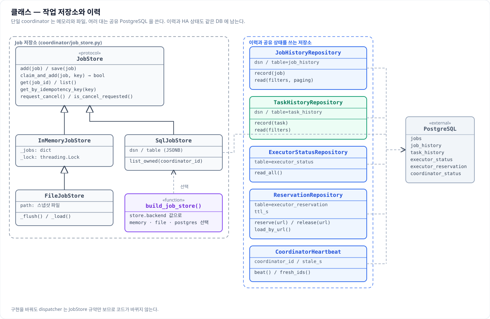
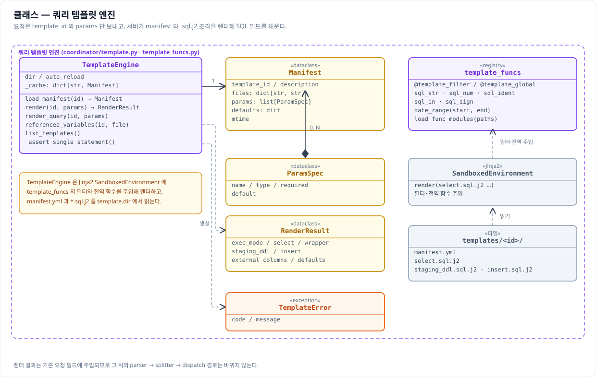
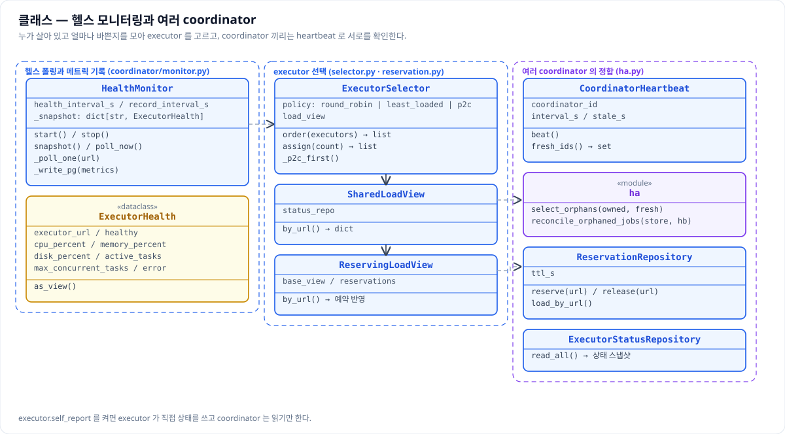
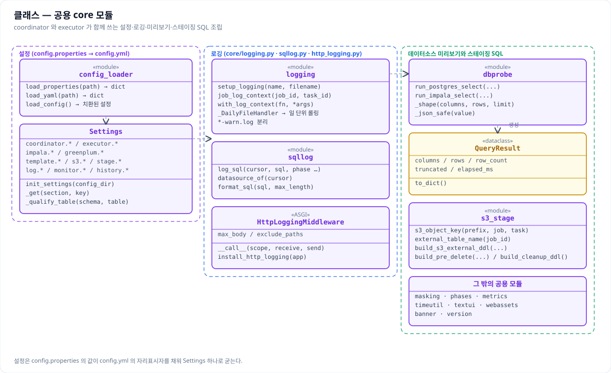
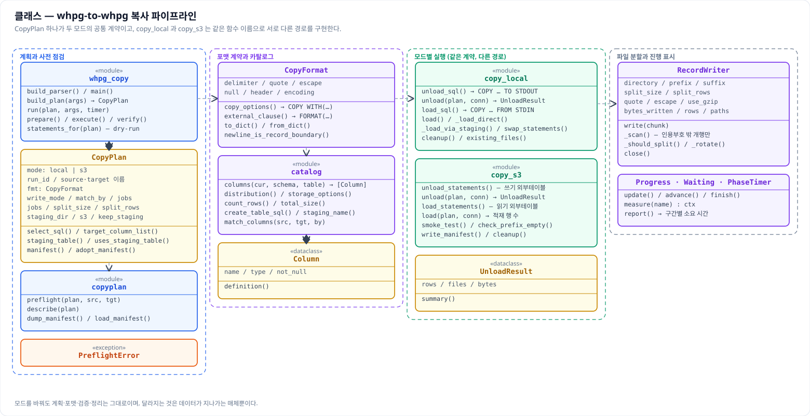
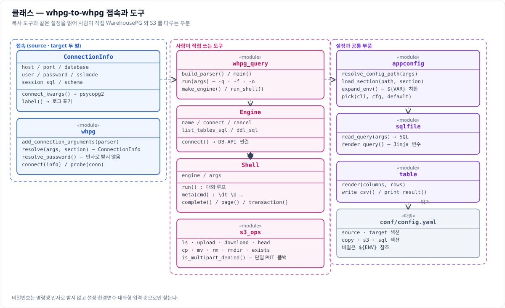

# 클래스 다이어그램

이 문서는 코드를 처음 여는 사람이 어느 파일에 무엇이 있는지 그림으로 먼저 잡을 수 있도록 만든
것이다. 기능 단위로 일곱 장을 그렸고, 각 장은 그 기능에 실제로 관여하는 클래스와 모듈만 담았다.
전부를 한 장에 몰아넣으면 아무것도 읽히지 않으므로, 한 장에서 한 가지 일을 좇을 수 있게 나눴다.

그림은 `images/` 아래에 SVG 와 PNG 를 함께 둔다. 문서에는 벡터인 SVG 를 넣어 확대해도 글자가
뭉개지지 않게 하고, 발표 자료나 사내 위키처럼 SVG 를 받지 않는 곳에는 같은 이름의 PNG(가로 두 배
해상도)를 쓴다. 둘은 같은 원본에서 나오므로 그림을 고칠 때는 SVG 를 고치고 PNG 를 다시 뽑아 둘을
함께 갱신한다.

읽는 규칙은 UML 을 따르되 느슨하다. 상자 맨 위가 이름이고 그 아래 칸이 속성, 그다음 칸이 주요
메서드다. 이름 위의 «…» 는 그것이 클래스가 아니라 모듈이거나 프로토콜, 열거형, 파일이라는 표시다.
속이 빈 삼각형은 상속이나 구현, 마름모는 소유, 실선 화살표는 참조, 점선 화살표는 호출이나 의존을
뜻한다. 지면에 담을 수 없는 메서드는 생략했으므로 정확한 시그니처는 언제나 코드가 기준이다.

---

## coordinator 요청 처리

`POST /jobs` 하나가 접수되어 실행에 넘어가기까지를 담았다. 요청은 `CreateJobRequest` 로 들어와
parser 의 검증과 splitter 의 분할을 거치고, `JobAdmission` 이 실행 슬롯을 판단한 뒤에야 `Job` 이
만들어진다. 템플릿을 쓰는 요청이면 그 앞에 `TemplateEngine` 이 SQL 필드를 채운다.

디스패처는 상속으로 갈린다. `_DispatcherBase` 가 PENDING 대기와 종료 집계 같은 수명주기를 모두
쥐고 있고, 하위 클래스는 `_execute()` 하나만 구현한다. 원격 실행이 `HttpDispatcher`, coordinator
안에서 직접 실행하는 것이 `LocalDispatcher` 다.

`Job` 과 `Task` 는 상태를 담는 dataclass 이면서 대시보드와 API 응답에 쓰이는 뷰까지 스스로 만든다.
`to_record()` 와 `from_record()` 가 있는 이유는 공유 PostgreSQL 저장소가 이 둘을 JSONB 로 그대로
저장하기 때문이다.

## 작업 저장소와 이력

저장소는 규약 하나에 구현이 셋이다. 단일 coordinator 는 `InMemoryJobStore` 로 충분하고, 재시작
후에도 상태를 잃지 않으려면 파일로 떨어뜨리는 `FileJobStore`, 여러 대를 띄우면 JSONB 를 쓰는
`SqlJobStore` 를 고른다. 무엇을 쓸지는 `build_job_store()` 가 `store.backend` 값 하나로 정하므로
dispatcher 는 어느 구현인지 알 필요가 없다.

이력과 공유 상태는 저장소와 별개다. job 단위 이력은 coordinator 가, task 단위 이력은 executor 가
직접 쓴다. 그래서 executor 호스트에서도 그 DB 에 닿아야 한다. heartbeat 와 예약은 여러 coordinator
가 서로를 확인하고 배분을 나누기 위한 것이며, 앱이 테이블을 만들지 않으므로 스키마는 운영자가 먼저
적용해야 한다.

## 쿼리 템플릿 엔진

클라이언트가 SQL 전문 대신 `template_id` 와 `params` 를 보내면 서버가 `manifest.yml` 과 `*.sql.j2`
조각을 렌더해 SELECT·STAGING DDL·INSERT 를 만든다. 렌더 결과인 `RenderResult` 는 기존 요청 필드에
주입되므로 그 뒤의 경로는 raw SQL 을 받았을 때와 완전히 같다.

커스텀 함수는 `@template_filter` 와 `@template_global` 로 등록하며, 내장으로 `sql_str`·`sql_in`·
`sql_ident`·`sql_num`·`sql_sign`·`date_range` 를 제공한다. 렌더는 Jinja2 의 `SandboxedEnvironment`
에서 이루어지고, 렌더된 DDL 과 INSERT 는 단일 문장인지 검사해 다중 문 주입을 막는다.

## executor 와 적재 백엔드

executor 앱은 task 의 상태머신과 동시 실행 상한만 맡고, 실제로 읽고 쓰는 일은 `Backend` 규약 뒤에
있다. 실제 구현이 `ImpalaToGreenplumBackend` 이고, `greenplum.dsn` 이 비어 있으면 아무것도 하지
않는 `MockBackend` 로 뜬다. 작업이 성공했다는데 대상에 데이터가 없다면 이 갈림길을 먼저 의심한다.

백엔드가 쓰는 부품 중 어댑터 두 개가 핵심이다. 읽기 루프가 소스에 요구하는 것은 `description` 과
`fetchmany`, `close` 뿐이라, 커서가 없는 커스텀 API 도 `_FunctionConnection` 과 `_FunctionCursor`
로 감싸면 CSV export 루프가 전혀 바뀌지 않는다. Greenplum 연결은 `_GreenplumPool` 로 재사용하되
반납할 때 `DISCARD ALL` 로 세션을 초기화해 앞 task 의 TEMP 테이블이 다음 task 와 부딪히지 않게 한다.

## 헬스 모니터링과 여러 coordinator

`HealthMonitor` 가 주기적으로 모든 executor 의 헬스와 메트릭을 모아 스냅샷으로 들고 있고, 그 값이
`ExecutorSelector` 의 판단 근거가 된다. 그래서 모니터링을 끄면 `least_loaded` 나 `p2c` 가 근거를
잃는다.

coordinator 를 여러 대 띄우면 서로를 확인할 방법이 필요하다. 각자 `CoordinatorHeartbeat` 로 살아
있음을 남기고, 신호가 끊긴 coordinator 가 쥐고 있던 job 은 `reconcile_orphaned_jobs()` 가 거둬
간다. 디스패치하는 동안 자리를 미리 잡아 두는 예약은 여러 대가 같은 executor 를 동시에 고르는 쏠림을
줄인다.

## 공용 core 모듈

설정은 `config.properties` 의 값이 `config.yml` 의 자리표시자를 채워 `Settings` 하나로 굳는다.
자리표시자가 없으면 properties 에 값을 적어도 조용히 무시되므로, 새 버전으로 올릴 때 `config.yml`
을 반드시 교체해야 하는 이유가 여기에 있다.

로깅은 세 갈래다. 파일 롤링과 `[job_id][task_id]` 주입은 `logging`, 실행한 SQL 을 데이터소스와 단계
표시와 함께 남기는 것은 `sqllog`, HTTP 요청과 응답을 DEBUG 에서만 남기는 것은 `http_logging` 이
맡는다. 여기에 데이터소스 미리보기와 스테이징 SQL 조립이 더해져 coordinator 와 executor 가 같은
코드를 공유한다.

## 운영자 CLI 도구

서비스와 별개로 사람이 터미널에서 직접 쓰는 도구 셋이다. 대화형 셸은 `Engine` 이 엔진별 접속과
카탈로그 조회 SQL 을 들고 `Shell` 이 대화 루프와 메타 명령, 자동완성, 페이저를 맡는 구조라 Impala
와 Greenplum 이 같은 셸을 공유한다.

여기서 눈여겨볼 것은 `appconfig` 다. 도구가 자체 설정 파일을 두지 않고 서비스의
`config.properties` 를 읽어 도구가 기대하는 모양으로 바꿔 주므로, 접속 정보를 두 곳에 적어 한쪽만
고쳐서 어긋나는 사고가 없다. Greenplum 만 형태가 달라 `parse_dsn()` 이 DSN 한 줄을 host 와 port,
user 로 풀어 준다.

---

# 부록 — 이웃 저장소 whpg-to-whpg

여기까지가 이 저장소의 클래스 그림이고, 아래는 같은 계열의 이관 도구인
[DataDynamics/whpg-to-whpg](https://github.com/DataDynamics/whpg-to-whpg) 를 같은 방식으로 그린
것이다. 이 저장소가 Impala 에서 Greenplum 으로 옮기는 서비스라면, 그쪽은 WarehousePG 테이블 하나를
다른 WarehousePG 로 복사하는 명령행 도구다. 함께 쓰는 일이 잦고 설계에서 겹치는 대목이 많아 한
문서에 두었다.

성격이 다르다는 점은 먼저 알아 두는 편이 좋다. 이쪽은 coordinator 와 executor 가 상시 떠 있는
서비스이고 요청이 HTTP 로 들어오지만, 그쪽은 명령 한 번이 곧 작업 하나인 도구라 상태를 프로세스
밖에 두지 않는다. 그래서 admission 이나 디스패치, 이력 저장소에 해당하는 층이 없다.

## whpg-to-whpg — 복사 파이프라인

복사 한 번의 모든 결정은 `CopyPlan` 하나에 모인다. 명령행 인자와 설정 파일, 양쪽 카탈로그를 합쳐
이 객체를 만들고 나면 어떤 컬럼을 어떤 순서로 어떤 포맷으로 옮길지가 확정된다. 실행 모듈은 이
계획만 보고 움직이므로, 모드가 달라도 계획을 만드는 코드는 같다.

`copy_local` 과 `copy_s3` 가 같은 이름의 함수(`unload` · `load` · `cleanup`)를 갖는 것이 이 설계의
핵심이다. 호출하는 쪽은 모듈만 골라 잡고 그 뒤로는 같은 순서로 부르므로, 모드를 바꿔도 검증과
정리, 보고가 그대로 돌아간다. 이 저장소의 `exec_mode` 가 요청 필드 하나로 파이프라인을 고르는 것과
같은 생각이다.

`RecordWriter` 는 local 모드에만 있는 부품이다. `COPY … TO STDOUT` 이 흘려보내는 바이트를 받아
파일로 나누는데, 아무 데서나 자르면 인용부호 안의 개행에서 레코드가 쪼개지므로 인용부호 밖의
개행만 경계로 삼는다. 이 저장소가 스테이징 CSV 를 만들 때 구분자를 데이터에 없는 문자로 고르는
것과 같은 종류의 문제를 다른 방식으로 푼 셈이다.

`CopyFormat` 은 포맷 계약을 한 곳에 모은다. 같은 값이 `COPY … WITH (…)` 와 외부테이블의
`FORMAT (…)` 두 자리에 서로 다른 문법으로 들어가야 하므로, 값을 한 번 정하고 표현만 두 벌로
만들어 준다.

## whpg-to-whpg — 접속과 도구

접속 설정은 소스와 타깃 두 벌이 필요하다는 점이 이 도구의 특징이다. `ConnectionInfo` 가 그 한 벌을
담고, `whpg` 모듈이 명령행과 설정 파일에서 값을 모아 만든다.

나머지는 이 저장소의 운영자 CLI 와 같은 계보다. 대화형 셸이 `Engine` 과 `Shell` 로 나뉜 구조,
설정을 한 곳에서 읽어 도구가 기대하는 모양으로 바꿔 주는 `appconfig`, 표 출력과 CSV 쓰기를 맡는
`table`, S3 객체를 다루는 `s3_ops` 가 모두 같은 뿌리에서 나왔다. 비밀번호를 명령행 인자로 받지
않는 규칙도 그대로다.
