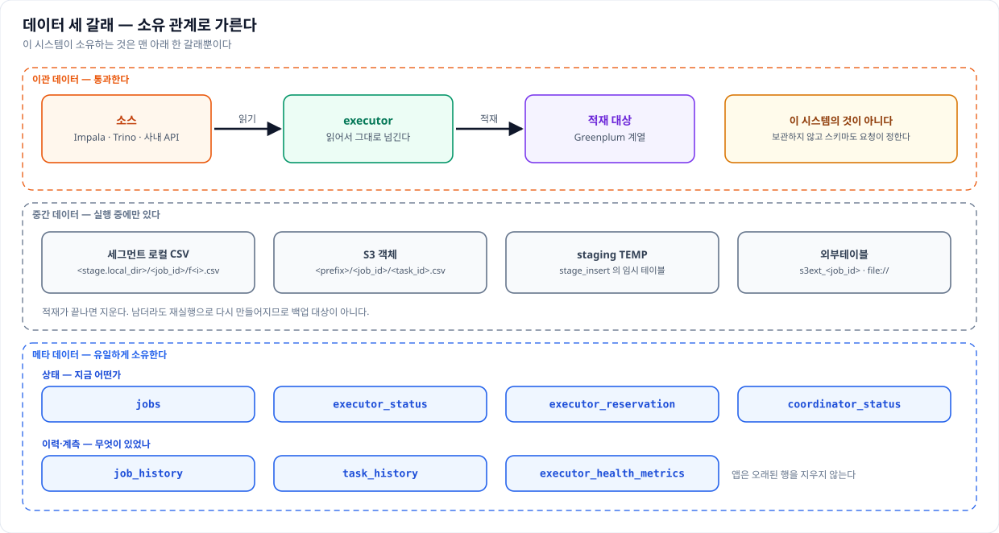
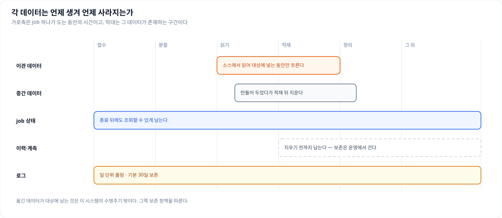

# 데이터 아키텍처 정의서

이 문서는 이 시스템을 **데이터 관점**에서 정리한 데이터 아키텍처 정의서다. 어떤 데이터가 어디서
어디로 흐르고, 그중 무엇을 이 시스템이 소유하며, 그 데이터를 어떤 표준과 규칙으로 다루는지를 다룬다.

같은 디렉터리의 다른 문서와 역할이 갈린다. SW 의 구조와 그 적용은 SW 아키텍처 정의서가, 인프라와
운영은 기술 아키텍처 정의서가 맡는다. 메타 테이블의 ER 그림은 `er-diagram.md` 에, 컬럼 단위 명세는
`tables.md` 에 이미 있으므로 여기서는 그 표를 다시 옮기지 않고 **무엇을 왜 기억하는가**를 데이터
관점에서 해석한다. 겹치는 사실을 바꿀 때는 관련 문서를 함께 고친다.

---

## 목차 수정 내역

표준 데이터 아키텍처 정의서 양식은 자기 데이터를 소유하고 운영하는 업무 시스템을 전제한다. 이
시스템은 데이터를 소유하지 않고 **옮기는** 것이 존재 이유라 아래와 같이 바꿨다.

| 원 템플릿 | 이 문서 | 왜 바꿨는가 |
|---|---|---|
| II. 데이터 영역(주제 영역) 정의 | II.1 데이터 영역 구분 | 업무 주제 영역이 없다. 대신 소유 관계로 이관·메타·중간 데이터 셋으로 가른다 |
| III.3 코드 표준(공통 코드) | (제거) | 공통 코드 체계를 두지 않는다. 코드 값은 옮기는 데이터 안에 있고 이 시스템은 해석하지 않는다 |
| III. 데이터 표준 | III. 데이터 표준 | 이름은 그대로 두되 항목을 이 시스템이 실제로 강제하는 것(식별자·시각·인코딩·CSV 형식·타입 처리)으로 바꾼다 |
| IV. 데이터 모델 | IV. 데이터 모델 | 모델이 있는 것은 메타 데이터뿐이다. 이관 데이터는 모델이 아니라 **요청이 정하는 스키마 계약**이라 절을 따로 둔다 |
| V. 데이터 연계 | V. 데이터 흐름 | 연계 대상과 프로토콜은 SW 아키텍처 정의서가 다룬다. 여기서는 데이터가 어떻게 갈라지고 합쳐지는지를 본다 |
| VIII. 데이터 이행(전환) | (V 로 흡수) | 이행이 부수 작업이 아니라 이 시스템 자체다. 별도 절을 두면 V 와 같은 말을 두 번 하게 된다 |
| IX. 데이터 백업/보관 | VIII. 데이터 수명주기 | 백업 절차는 기술 아키텍처 정의서에 있다. 여기서는 각 데이터가 언제 생겨 언제 사라지는지를 본다 |
| (없음) | VI. 데이터 정합성과 품질 | 재실행 안전성과 분할의 정확성이 이 시스템의 핵심 리스크라 유형 하나로 추가했다 |

---

# I. 개요

## 1. 목적과 범위

이 문서는 세 가지 질문에 답한다. **무엇이 이 시스템을 지나가는가**, **그중 무엇이 남는가**, 그리고
**남는 것을 어떤 규칙으로 다루는가**이다. 데이터를 다루는 사람이 이 문서 하나로 옮겨지는 데이터의
형태와 경계, 메타 데이터의 구조, 정합성이 보장되는 지점과 깨지는 지점까지 알 수 있게 하는 것이
목적이다.

다루지 않는 것도 분명히 해 둔다. **옮기는 데이터의 업무적 의미**는 범위 밖이다. 어떤 테이블의 어떤
컬럼이 무엇을 뜻하는지는 소스와 대상 시스템의 데이터 사전이 갖고 있고, 이 시스템은 그것을 알 필요가
없도록 만들어졌다. **대상 시스템의 데이터 모델**도 마찬가지다. 대상 테이블의 설계와 분산키 선정,
파티션 전략은 그쪽의 몫이며 이 문서는 그 설계가 이관 성능과 정합성에 영향을 주는 지점만 짚는다.

## 2. 이 시스템의 데이터 관점

이 시스템은 데이터를 **소유하지 않는다**. 소스에서 읽어 대상에 넣는 것이 전부이고, 그 데이터를 자기
저장소에 남기지 않는다. 흔한 업무 시스템이라면 데이터 아키텍처의 중심에 자기 데이터 모델이 오겠지만
여기서는 그 자리가 비어 있다.

그 대신 중심에 오는 것이 **소유 관계로 가른 세 갈래**다. 옮겨지는 이관 데이터는 통과할 뿐이고, 이
시스템이 소유하는 것은 이관을 관리하기 위해 스스로 만든 메타 데이터뿐이며, 그 사이에 실행 중에만
존재하는 중간 데이터가 있다. 이 구분이 문서 전체의 서술을 가른다. 이관 데이터는 **형식과 계약**으로
다루고, 메타 데이터는 **모델과 보존**으로 다루며, 중간 데이터는 **수명과 정리**로 다룬다.

## 3. 데이터 아키텍처 원칙

**데이터는 coordinator 를 지나지 않는다.** executor 가 소스에서 읽어 대상으로 곧장 보내고
coordinator 에는 상태와 행 수만 올라온다. 제어와 데이터를 갈라 둔 덕에 처리량이 coordinator 한 대에
묶이지 않으며, 이 원칙을 어기는 설계는 곧 단일 노드가 상한이 되는 설계다.

**통과 데이터는 해석하지 않는다.** 값의 의미를 알려 하지 않고 타입도 되도록 건드리지 않는다. 소스가
준 표현을 그대로 실어 나르는 것이 가장 빠르고 가장 덜 틀리기 때문이다. 예외는 표현이 없으면 적재가
깨지는 경우, 곧 결측값을 NULL 마커로 바꾸는 처리 하나뿐이다.

**중간 데이터는 언제든 버릴 수 있어야 한다.** 스테이징으로 만든 파일과 임시 테이블은 실패해도
재실행으로 다시 만들어진다. 그래서 백업 대상이 아니고, 남아 있어도 지우는 것이 안전한 선택이다.

**무엇을 읽어 무엇을 넣었는지는 반드시 남는다.** 실행한 SQL 은 로그 레벨과 무관하게 항상 기록되고
모든 로그 줄에 job_id 와 task_id 가 붙는다. 데이터를 옮기는 시스템에서 이 기록이 비어 있으면 사고가
났을 때 원인을 가릴 방법이 없다.

---

# II. 데이터 아키텍처 정의

## 1. 데이터 영역 구분

### 1.1 이관 데이터

소스에서 읽어 대상에 넣는 통과 데이터다. 이 시스템은 이 데이터를 **소유하지도 보관하지도 않는다**.
어떤 컬럼이 어떤 타입인지도 미리 알지 못하며, 요청이 준 SELECT 가 내는 결과를 그대로 받아 요청이
지정한 대상 테이블로 흘려보낼 뿐이다.

그래서 이관 데이터에는 데이터 모델이 없고 **계약**만 있다. SELECT 가 내는 컬럼의 개수와 순서가 대상
테이블과 맞아야 한다는 것, 파티션 컬럼이 SELECT 안에 `IN` 절로 있어야 한다는 것이 그 계약이며,
어긋나면 접수 단계나 적재 직전에 걸린다. 자세한 내용은 IV.4 에 있다.

한 가지 더 기억할 것은 이 데이터가 **coordinator 를 지나지 않는다**는 점이다. coordinator 는 어떤
SELECT 를 누구에게 보냈고 몇 행이 들어갔는지는 알지만, 그 행의 내용은 한 번도 보지 않는다.

### 1.2 메타 데이터

이 시스템이 소유하는 유일한 데이터이며 일곱 테이블로 이루어진다. 성격이 둘로 갈리는데, **지금
어떤가**를 담는 상태 테이블과 **무엇이 있었나**를 담는 이력·계측 테이블이다.

상태 쪽은 `jobs`(진행 중인 job 의 현재 상태와 요청 본문), `executor_status`(executor 가 스스로
보고한 자원 사용량), `executor_reservation`(여러 coordinator 가 executor 를 나눠 쓸 때의 예약),
`coordinator_status`(각 coordinator 의 heartbeat) 넷이다. 이들은 덮어써지며 최신 값 하나만 의미가
있다.

이력 쪽은 `job_history`(job 의 상태 전이 기록), `task_history`(task 하나가 무엇을 읽어 몇 행을
넣었고 각 구간에 얼마가 걸렸는가), `executor_health_metrics`(주기적으로 쌓는 헬스·자원 계측) 셋이다.
이들은 append 되며 지우기 전까지 남는다.

이 구분이 실무에서 갖는 뜻은 분명하다. **상태 테이블은 작고 이력 테이블은 자란다.** 용량을 걱정해야
하는 쪽과 보존 기간을 걸어야 하는 쪽은 언제나 뒤쪽이다.

### 1.3 중간 데이터

스테이징으로 만드는 데이터이며 실행 중에만 존재한다. 네 가지가 있는데 세그먼트 로컬 CSV 파일, S3
객체, `stage_insert` 의 staging 테이블, 그리고 2단계 적재에서 파일을 가리키는 외부테이블이다.

이 데이터는 **원본이 아니다**. 소스에 있는 것을 옮기다 잠시 놓아 둔 사본이므로 잃어도 재실행으로
다시 만들어진다. 그래서 백업 범위 밖이고, 적재가 끝나면 지우는 것이 기본 동작이다.

다만 지워지지 않는 경우가 있다는 점은 알아 두어야 한다. 정리를 설정으로 껐거나, Phase 2 가 실패해
정리 단계까지 가지 못했거나, 프로세스가 중간에 죽은 경우다. 이때 남는 파일과 객체는 사람이 치우며,
무엇이 남았는지는 job_id 로 갈라 둔 경로와 프리픽스를 보면 바로 알 수 있다.

## 2. 데이터 아키텍처 구성도

세 영역과 그 사이의 관계를 한 장으로 정리하면 이렇다. 위에서 아래로 갈수록 이 시스템과의 관계가
깊어진다. 맨 위는 지나갈 뿐이고, 가운데는 잠시 머물며, 맨 아래만 이 시스템의 것이다.

그림에서 눈여겨볼 것은 **세 영역이 서로 다른 저장소에 있다**는 점이다. 이관 데이터는 소스와 대상
데이터베이스에, 중간 데이터는 파일 시스템이나 오브젝트 스토리지에, 메타 데이터는 별도의
PostgreSQL 에 있다. 한 영역의 사고가 다른 영역으로 번지지 않는 것이 이 배치의 이점이고, 대신 세 곳을
함께 봐야 전체를 알 수 있다는 것이 대가다.

## 3. 데이터 소유와 책임 경계

무엇이 이 시스템의 책임인지를 표로 갈라 둔다. 경계를 흐릿하게 두면 사고가 났을 때 누가 무엇을
복구해야 하는지부터 다투게 된다.

| 데이터 | 소유 | 무결성 책임 | 백업 책임 | 보존 정책 |
|---|---|---|---|---|
| 소스의 원본 | 소스 시스템 | 소스 시스템 | 소스 시스템 | 소스 시스템 |
| 이관 중인 통과 데이터 | 없음(흐르는 중) | 이 시스템 — 빠짐없이 겹치지 않게 옮긴다 | 해당 없음 | 해당 없음 |
| 대상에 적재된 데이터 | 대상 시스템 | 이 시스템(적재까지) → 이후 대상 시스템 | 대상 시스템 | 대상 시스템 |
| 스테이징 파일·객체 | 이 시스템 | 이 시스템 | 하지 않음 | 적재 후 즉시 정리 |
| 메타 데이터 | 이 시스템 | 이 시스템 | 기관 DB 백업 정책 | 운영에서 건다 |
| 로그 | 이 시스템 | 이 시스템 | 필요 시 파일 복사 | 일 단위 롤링 · 기본 30일 |

경계에서 특히 자주 오해가 나는 자리가 셋이다. 첫째, **옮긴 데이터의 백업은 이 시스템의 범위가
아니다.** 데이터는 대상에 있고 그 백업은 대상 시스템의 운영 기준을 따른다. 둘째, **적재가 끝난 뒤의
무결성도 대상의 몫이다.** 이 시스템은 넣는 순간까지만 책임지며, 그 뒤 누가 지우거나 고친 것은 알지
못한다. 셋째, **메타 데이터의 보존은 앱이 해 주지 않는다.** 오래된 이력을 지우는 코드가 없으므로
보존 기간은 운영에서 걸어야 한다.

---

# III. 데이터 표준

## 1. 식별자 표준

job 과 task 의 식별자는 `<접두사>_<uuid4 hex 앞 12자>` 형태다. job 은 `job_` 을, task 는 `t_` 를
접두사로 쓴다. uuid 전체가 아니라 앞 12자만 쓰는 이유는 충돌 가능성을 충분히 낮추면서 로그와
URL 에서 다루기 좋은 길이를 유지하기 위해서다. 접두사가 붙어 있어 로그 한 줄만 봐도 그것이 job 인지
task 인지 알 수 있다.

식별자는 coordinator 가 접수 시점에 발급하며 그 뒤로 바뀌지 않는다. **이 두 값이 데이터를 잇는
축이다.** 메타 테이블의 행도, 로그의 모든 줄도, 스테이징 파일의 경로도, 외부테이블의 이름도
job_id 나 task_id 를 담고 있어 하나만 알면 관련된 것을 전부 모을 수 있다.

멱등 키는 클라이언트가 정한다. `Idempotency-Key` 헤더로 받은 값을 job 에 그대로 저장하고, 함께
**요청 본문의 지문**을 sha256 으로 계산해 둔다. 지문은 요청 dict 를 정렬 직렬화해 만들므로 필드
순서가 달라도 같은 요청이면 같은 값이 나온다. 같은 키가 다른 본문으로 다시 오면 이 지문이 달라
거절할 수 있다. 지문 계산은 키가 있을 때만 한다.

중간 데이터의 이름도 식별자에서 파생된다. 세그먼트 로컬 CSV 는
`<stage.local_dir>/<job_id>/f<번호>.csv` 이고, S3 객체는 `<s3.prefix>/<job_id>/<task_id>.csv` 이며,
`s3_stage` 의 외부테이블은 `s3ext_<job_id>` 다(설정으로 스키마를 주면 `dwtemp.s3ext_<job_id>` 처럼
한정된다). 외부테이블은 데이터베이스 카탈로그 전역이라 job 마다 고유해야 동시에 도는 job 끼리
부딪히지 않는다. `stage_insert` 의 staging 테이블도 같은 이유로 이름 뒤에 task_id 를 붙여 고유화하고
task 가 끝나면 지운다.

## 2. 시각 표준

이 시스템이 만드는 모든 시각은 **타임존 정보가 없는 KST 값**이다. 한국 단일 리전 환경이라 UTC 로
저장했다가 표시할 때 되돌리는 절차가 이득이 없고, 오히려 로그의 시각과 DB 의 시각이 아홉 시간 어긋나
보이는 혼란만 만들기 때문이다.

이 규칙은 세 곳에 함께 적용된다. 앱이 만드는 시각은 KST 로 생성되고, 메타 테이블의 컬럼은 타임존
없는 `TIMESTAMP` 이며 DB 가 채우는 기본값도 `now() AT TIME ZONE 'Asia/Seoul'` 이라 같은 기준이 된다.
표시할 때는 `yyyy-MM-dd HH:mm:ss.sss` 형식으로 밀리초까지 보여 준다.

타임존이 붙은 값이 들어오는 경우에는 방어가 걸려 있다. 과거 데이터나 외부에서 온 값에 `+00:00` 같은
오프셋이 붙어 있으면 KST 로 환산한 뒤 오프셋을 떼고 표기한다. 파싱할 수 없는 문자열은 원본을 그대로
두어, 표시 로직 때문에 값이 사라지는 일이 없게 했다.

## 3. 문자와 인코딩 표준

전 구간 UTF-8 이다. 소스에서 읽은 문자열, CSV 파일, 로그, API 응답이 모두 같은 인코딩이며 중간에
변환하는 지점을 두지 않았다.

한글이 섞인 데이터에서 주의할 것은 인코딩 자체가 아니라 **폭 계산**이다. 한글 한 글자는 터미널에서
두 칸을 차지하므로 글자 수로 잘라 화면에 쓰면 폭이 두 배까지 밀린다. 이 계산이 필요한 곳은 사람이
보는 화면, 곧 운영 도구의 표 출력과 터미널 화면이며 데이터 자체를 자르지는 않는다.

## 4. CSV 형식 표준

2단계 적재는 데이터를 CSV 파일로 내보낸 뒤 대상이 그것을 외부테이블로 읽는 구조다. 그래서 **파일을
쓰는 쪽과 읽는 쪽이 같은 형식을 알아야** 하고, 세 값이 그 형식을 이룬다.

| 항목 | 기본값 | 설정 키 | 요청별 재정의 |
|---|---|---|---|
| 컬럼 구분자 | 백틱(`` ` ``) | `stage.csv_delimiter` | `csv_delimiter` |
| NULL 표현 | 빈 문자열 | `stage.csv_null` | `csv_null` |
| 인용문자 | 큰따옴표(`"`) | `stage.csv_quote` | `csv_quote` |

구분자 기본값이 쉼표가 아니라 **백틱**인 데에는 이유가 있다. 옮기는 데이터에는 쉼표와 큰따옴표가
흔히 섞여 있고, 그때마다 값을 따옴표로 감싸고 이스케이프하면 쓰는 비용과 읽는 비용이 함께 는다.
백틱은 일반적인 업무 데이터에 거의 나타나지 않아 따옴표 없이도 안전하다. 물론 백틱이 실제로 들어
있는 데이터라면 이 기본값을 바꿔야 하며, 그래서 요청별로도 덮어쓸 수 있게 열어 두었다.

이 세 값에서 지켜야 할 규칙은 하나다. **executor 가 파일을 쓸 때 쓴 형식과 외부테이블 정의의 형식이
반드시 같아야 한다.** 둘이 어긋나면 파일은 정상인데 읽을 때 컬럼이 밀리거나 NULL 이 빈 문자열로
들어간다. 그래서 coordinator 가 Phase 2 의 외부테이블 SQL 을 만들 때 job 이 실제로 쓴 값을 그대로
실어 조립한다. 사람이 두 곳에 따로 적는 자리를 만들지 않은 것이다.

## 5. 타입 처리 표준

**소스에서 읽을 때는 형변환을 끈다.** 드라이버가 timestamp 나 date, decimal 을 파이썬 객체로 바꿔
주는 기능이 있지만 export 경로에서는 이것을 꺼서 wire 문자열을 그대로 받는다. 어차피 CSV 로 쓸
것이라 객체로 바꿨다가 다시 문자열로 만드는 과정이 순수한 낭비이기 때문이다. 대용량에서는 이 재파싱
비용이 무시할 수 없다.

**결측값은 CSV NULL 마커로 떨군다.** 이것이 통과 데이터에 손을 대는 유일한 자리다. DataFrame 을
돌려주는 소스에서 `NaN` 이나 `NaT` 를 그대로 CSV writer 로 넘기면 NULL 마커가 아니라 문자열 `"nan"`,
`"NaT"` 가 파일에 적히고, 외부테이블은 그 컬럼을 NULL 로 읽지 못한다. 숫자 컬럼이라면 적재 자체가
깨지고, 문자열 컬럼이라면 **깨지지 않고 문자열 "nan" 이 적재된다**. 뒤쪽이 더 나쁘다. 그래서 행을
넘기기 전에 결측값을 `None` 으로 정규화한다. 커서를 쓰는 소스는 애초에 `None` 을 주므로 이 처리가
필요 없다.

미리보기 경로에는 규칙이 하나 더 있다. 결과를 JSON 으로 돌려줄 때 numpy 스칼라를 파이썬 값으로
낮추지 않으면 `np.int64` 가 `'7'`, `np.bool_` 가 `'True'` 처럼 문자열로 새는데, `np.float64` 는
float 의 하위형이라 우연히 통과한다. 그래서 **컬럼 dtype 에 따라 결과 타입이 갈리는** 현상이 생긴다.
이를 막기 위해 스칼라를 명시적으로 낮추고, JSON 에 표현이 없는 `NaN`·`NaT`·`pd.NA`·`inf` 는 모두
`null` 로 떨군다. 이 규칙은 어느 데이터소스를 보든 같다.

## 6. 명명 규칙

**메타 테이블은 모두 스키마 한정이다.** 일곱 테이블의 이름은 설정의 스키마(기본 `public`)로
한정되며, 앱이 실행하는 SQL 과 배포된 DDL 두 파일이 같은 이름을 가리키게 되어 있다. 개별 테이블
이름을 `myschema.t` 처럼 이미 한정해 두었으면 그 값은 그대로 둔다. 여기서 놓치기 쉬운 것이
**테이블이나 스키마를 바꿀 때는 설정과 DDL 두 파일을 함께 고쳐야 한다**는 점이다. 한쪽만 고치면 앱은
새 이름으로 만들고 운영자는 옛 이름을 들여다보게 된다.

**중간 객체의 이름은 job 과 task 로 격리된다.** 앞서 본 대로 스테이징 경로에는 job_id 가, S3 키에는
job_id 와 task_id 가, 외부테이블 이름에는 job_id 가, staging 테이블 이름에는 task_id 가 들어간다. 이
격리 덕분에 여러 job 이 동시에 돌아도 서로의 중간 데이터를 덮어쓰지 않고, 사고가 났을 때 어느 job 이
남긴 찌꺼기인지 이름만 보고 가릴 수 있다.

---

# IV. 데이터 모델

## 1. 개념 데이터 모델

이 시스템이 기억하는 개념은 넷이다. **job** 은 사용자가 맡긴 이관 한 건이고, **task** 는 그 job 을
파티션 기준으로 나눈 실행 단위이며, **executor** 는 task 를 실제로 수행하는 노드이고,
**coordinator** 는 job 을 받아 나누고 집계하는 노드다. job 과 task 는 일대다이며, task 는 executor
하나에 배정되고, job 은 coordinator 하나가 소유한다.

무엇을 기억하지 **않기로** 했는지도 함께 봐야 모델이 읽힌다. 옮긴 데이터의 내용은 기억하지 않는다.
사용자 계정 체계도 두지 않아 `username` 은 요청이 준 문자열을 그대로 남기는 표시용 값일 뿐이다. 대상
테이블의 스키마도 기억하지 않으며 적재 직전에 그때그때 조회해 확인한다. 기억하지 않기로 한 만큼 이
시스템은 소스와 대상의 변화에 둔감해진다.

## 2. 논리 데이터 모델

개념을 엔터티로 옮기면서 **지금 상태를 담는 것과 지나간 일을 담는 것을 갈랐다**. job 의 현재 상태는
덮어써야 하고 상태 전이의 기록은 쌓여야 하는데, 이 둘을 한 테이블에 두면 갱신과 append 가 뒤섞여
조회도 정리도 어려워지기 때문이다.

그래서 job 은 두 자리에 나타난다. 진행 중인 모습은 상태 엔터티에 하나의 행으로 있고, 상태가 바뀔
때마다 이력 엔터티에 새 행이 쌓인다. task 는 상태 엔터티가 따로 없다. 진행 중인 task 의 상태는 job
안에 함께 담기고, 끝난 task 만 이력으로 남는다. executor 는 반대로 지금 상태(자원 사용량)와 계측
이력이 모두 필요해 양쪽에 자리가 있다.

논리 모델과 그 관계를 그림으로 본 것이 `er-diagram.md` 의 논리 ER 이며, 여기서는 같은 그림을 다시
옮기지 않는다.

## 3. 물리 데이터 모델

### 3.1 PostgreSQL

물리 테이블은 일곱 개이고 컬럼 단위 명세는 `tables.md` 에 있다. 여기서는 **왜 그렇게 생겼는지**만
짚는다.

`jobs` 는 컬럼이 여섯 개뿐이다. 조회와 정합에 쓰는
것(`job_id`·`coordinator_id`·`status`·`cancel_requested`·`updated_at`)만 컬럼으로 꺼내 두고, 요청
본문과 task 목록을 포함한 나머지 전부는 `data` JSONB 한 컬럼에 담는다. **이관 요청의 모양이 자주
늘어나기 때문이다.** 새 필드를 받을 때마다 컬럼을 추가하고 DDL 을 두 벌 고치는 대신, 꺼내 쓸 것만
컬럼으로 두고 나머지는 문서로 담는 편이 변화에 강하다. 상태별 조회와 오래된 job 정합을 위해
`status` 와 `updated_at` 에 인덱스를 둔다.

멱등 키는 JSONB 안에 있지만 **부분 UNIQUE 인덱스**가 그 위에 걸려 있다. 앱이 원자적 선점으로 중복을
막고 있어도, 두 coordinator 가 같은 순간에 같은 키로 들어오는 경합까지 앱 코드만으로 막기는 어렵기
때문이다. 인덱스는 그 마지막 방어선이며, 키가 없는 job 은 인덱스에 들어가지 않도록 조건을 걸어
두었다.

이력 테이블 둘은 append 전용이라 대리 키를 두고 `recorded_at` 과 조회 축(`job_id`·`task_id`)에
인덱스를 둔다. `task_history` 가 특히 넓은데, 이 시스템에서 성능 분석의 1차 자료가 이 테이블이기
때문이다. 읽은 행 수와 쓴 행 수를 따로 두고, 소요 시간을 읽기 대기·쓰기 대기·읽기 기아·마무리 대기
넷으로 나눠 담으며, 단계별 타임라인은 `phases` JSONB 에 넣는다. 느렸을 때 어디가 느렸는지를 추측이
아니라 값으로 가리기 위한 구조다.

상태 테이블 셋은 단순하다. 각자 자연 키를 그대로 기본 키로 쓰고 `updated_at` 하나로 신선도를
판단한다. `executor_reservation` 만 키가 둘(`executor_url`, `coordinator_id`)인데, 같은 executor 를
여러 coordinator 가 나눠 예약하기 때문이다.

### 3.2 WarehousePG

메타 저장소를 WarehousePG(Greenplum 7)에 두는 경우를 위해 DDL 을 한 벌 더 배포한다. MPP 라 모든
테이블에 분산키가 필요하고, 지정하지 않으면 첫 컬럼이 임의로 분산키가 되어 조회가 세그먼트 전체로
퍼진다.

분산키는 **함께 읽는 것을 같은 세그먼트에 모으는** 기준으로 골랐다.
`jobs`·`job_history`·`task_history` 는 `job_id` 로 묶는다. 한 job 의 이력을 모아 보는 것이 가장 잦은
조회이고, 대시보드가 job 별로 최근 상태를 뽑는 연산도 세그먼트 안에서 끝나기 때문이다. 상태
테이블들은 각자의 자연 키(`executor_id`·`executor_url`·`coordinator_id`)로 분산한다.

여기서 제약이 둘 생긴다. 첫째, **기본 키는 분산키를 포함해야 한다.** 그래서 이력 테이블의 대리 키를
뺐다. 대리 키를 남기면 그것이 분산키가 되어 한 job 의 이력이 세그먼트마다 흩어진다. 둘째, **멱등
키의 부분 UNIQUE 인덱스를 걸 수 없다.** 유일성을 보장하려면 그 컬럼이 분산키여야 하는데 멱등 키는
JSONB 안에 있다. 그래서 WarehousePG 에서 요청 멱등은 앱의 선점에만 기대는 best-effort 가 된다. 중복
제출이 곤란한 업무라면 이 점을 알고 써야 한다.

앱이 실행하는 SQL 은 양쪽에서 공통으로 돈다. Greenplum 7 이 PostgreSQL 12 기반이라 `ON CONFLICT` 나
JSONB, `DISTINCT ON` 이 모두 그대로 동작하기 때문이다.

## 4. 이관 데이터의 스키마 계약

이관 데이터에는 모델이 없고 계약만 있다고 했다. 그 계약이 무엇인지 정리하면 아래와 같다.

| 무엇 | 누가 정하는가 | 언제 확인되는가 | 어긋나면 |
|---|---|---|---|
| SELECT 가 내는 컬럼의 개수와 순서 | 요청 | 적재 직전(`copy.preflight`) | 한 행도 넣기 전에 실패한다 |
| 대상 테이블과 그 컬럼 | 요청 | 적재 직전 | 같음 |
| 파티션 컬럼과 그 `IN` 목록 | 요청 | 접수 시 파서가 검증 | 422 로 거절한다 |
| 적재 방식(`write_mode`) | 요청 | 적재 시 | 멱등 여부가 갈린다 |
| 외부테이블의 컬럼 정의 | 요청(`external_columns`) | Phase 2 | 컬럼이 밀려 들어간다 |
| CSV 형식 | 설정 또는 요청 | Phase 1·2 공통 | 읽는 쪽이 밀린다 |

여기서 가장 중요한 것이 **적재 직전의 사전검증**이다. SELECT 가 내는 컬럼이 대상 테이블에 모두
있는지를 한 행도 흘려보내기 전에 확인하고, 맞지 않으면 그 자리에서 명확한 오류로 실패시킨다. 이
검사가 없으면 대용량을 몇십 분 동안 다 읽은 뒤에야 적재 오류로 깨지는데, 그때는 이미 시간과 소스
자원을 다 쓴 뒤다.

반대로 **자동으로 맞춰 주지 않는 것**도 분명히 해 둔다. 컬럼 이름이 다르면 이름으로 짝지어 주지
않고, 타입이 다르면 변환해 주지 않으며, 컬럼 순서가 뒤바뀐 것을 바로잡아 주지도 않는다. 그런 편의를
넣으면 조용히 잘못 적재되는 경로가 생기기 때문에 일부러 두지 않았다. 맞추는 것은 요청의 책임이다.

---

# V. 데이터 흐름

## 1. data plane 과 control plane 의 분리

이 시스템에서 데이터가 흐르는 길과 지시가 오가는 길은 서로 다르다. executor 는 소스에서 읽어
대상으로 직접 보내고, coordinator 와 주고받는 것은 task 지시와 상태·행 수뿐이다.

데이터 관점에서 이 분리가 갖는 뜻은 셋이다. 첫째, **처리량이 coordinator 에 묶이지 않는다.**
executor 를 늘리면 대역이 그만큼 늘고 coordinator 는 상태만 다루므로 부담이 거의 늘지 않는다. 둘째,
**coordinator 노드에는 이관 데이터가 한 번도 닿지 않는다.** 소스 드라이버조차 없으므로 그 노드가
노출되어도 데이터가 새지 않는다. 셋째, **행 수는 executor 가 세어 올린다.** coordinator 가 직접 셀
방법이 없으므로 이 값의 신뢰도는 executor 의 계측에 달려 있다.

## 2. 하나의 SELECT 가 N 개로 갈리는 방식

### 2.1 파티션 IN 분할

기본 방식은 SELECT 안의 파티션 컬럼 `IN` 목록을 N 등분하는 것이다. `IN (a, b, c, d)` 를 둘로 나누면
각 task 는 같은 SELECT 에 자기 몫의 목록만 담아 실행한다. 나누는 방법은 둘인데, 값을 연속된 덩어리로
자르는 방식이 기본이고 버킷에 번갈아 배분하는 방식을 고를 수도 있다. 값마다 데이터 양이 크게 다를
때는 뒤쪽이 더 고르게 퍼진다.

여기서 중요한 것이 **원문 포맷을 보존한 채 치환한다**는 점이다. SELECT 를 파싱해 다시 조립하는 것이
아니라 `IN` 목록 자리만 바꿔 끼운다. 재조립을 하면 따옴표나 함수 표기, 대소문자 같은 것이 미묘하게
달라지고 그 차이가 소스에서 다른 실행 계획이나 다른 결과를 만들 수 있기 때문이다. 사람이 검증한
SQL 이 그대로 실행되게 하는 것이 안전하다.

이 분할이 데이터에 주는 보장은 명확하다. **N 개 task 의 파티션 값 집합은 원본 목록을 빠짐없이 덮고
서로 겹치지 않는다.** 그래서 각 task 가 읽는 데이터도 겹치지 않으며, 이 성질이 뒤에서 볼 재실행
안전성의 전제가 된다.

### 2.2 날짜 fan-out

기간을 다루는 이관에서는 `IN` 목록 대신 구간의 두 끝을 파라미터로 주고 **하루를 task 하나로 펼치는**
방식을 쓴다. 7일치를 옮긴다면 task 가 일곱 개 생기고 각 task 는 자기 날짜 하루만 읽는다.

이 방식에는 데이터 정합성과 직결되는 계약이 하나 있다. 구간의 방향, 곧 SQL 에서 `- interval 7
day` 처럼 연산자로 박히는 방향을 템플릿이 변수로 받아 써야 한다는 것이다. 이 변수를 쓰지 않는
템플릿은 각 task 가 의도보다 넓은 구간을 읽어 **같은 데이터가 여러 task 에 중복으로 잡힌다**.
게다가 이 방식은 append 로 적재하므로 중복이 그대로 대상에 쌓이며, 오류 없이 성공으로 끝나기 때문에
나중에 행 수를 세어 보기 전에는 알아채기 어렵다. 그래서 렌더 전에 템플릿을 검사해 그 변수를 쓰지
않으면 접수 단계에서 거절한다.

## 3. exec_mode 별 데이터 경로

같은 요청 스키마에서 `exec_mode` 필드 하나로 데이터가 지나는 길이 갈린다.

| exec_mode | 데이터가 지나는 길 | 중간 데이터 | 멱등 |
|---|---|---|---|
| `copy` | 소스 → executor 메모리 → 대상 COPY | 없음 | `overwrite_partitions` 로 성립 |
| `statement` | 대상 안에서만(받은 INSERT 를 실행) | 없음 | 문장이 정하기 나름 |
| `stage_insert` | 소스 → executor → staging → 대상 INSERT | staging 테이블 | 항상 append 라 성립하지 않음 |
| `local_stage` | 소스 → executor → 세그먼트 로컬 CSV → 외부테이블 → 대상 | CSV 파일·외부테이블 | `overwrite_partitions` 로 성립 |
| `s3_stage` | 소스 → executor → S3 객체 → 외부테이블 → 대상 | S3 객체·외부테이블 | `overwrite_partitions` 로 성립 |

경로를 고르는 기준은 데이터의 양과 대상의 구조다. `copy` 는 executor 가 대상 마스터로 밀어 넣으므로
가장 단순하지만, 대상이 MPP 라면 아무리 executor 를 늘려도 마스터 한 노드가 ceiling 이 된다. 그때는
파일을 만들어 세그먼트가 병렬로 당겨 읽게 하는 두 스테이징 경로로 바꾼다. 둘 사이의 선택은 배치
제약이 가른다. `local_stage` 는 executor 와 세그먼트가 같은 호스트에 있어야 하고, `s3_stage` 는
위치와 무관하다.

## 4. 2단계 적재의 데이터 흐름

두 스테이징 경로는 **executor 가 파일을 만드는 Phase 1** 과 **coordinator 가 그 파일을 대상에 넣는
Phase 2** 로 나뉘며, 그 사이에 모든 executor 가 끝나기를 기다리는 barrier 가 있다.

데이터 관점에서 이 구조의 핵심은 **파일의 단위**다. Phase 1 에서 task 하나가 파일 하나를 만들고,
Phase 2 에서 coordinator 는 그 파일들을 개별로 다루지 않고 job 프리픽스 전체를 가리키는 외부테이블
하나로 묶어 한 번의 INSERT 로 넣는다. 그래서 대상 쪽에서 보면 이관 한 건이 트랜잭션 한 번으로
들어간다.

barrier 가 필요한 이유도 여기에 있다. 파일이 다 만들어지기 전에 외부테이블을 걸면 그 시점까지 올라온
파일만 읽히고, 나머지는 조용히 빠진다. 실패하지 않고 **일부만 적재되는** 형태라 가장 나쁜 종류의
사고이므로, 하나라도 Phase 1 에서 실패하면 Phase 2 를 아예 시작하지 않는다.

`local_stage` 에는 파일 배치라는 문제가 하나 더 있다. 세그먼트가 파일을 당겨 읽으므로 호스트당 파일
수가 그 호스트의 세그먼트 수를 넘으면 일부 세그먼트가 파일 두 개를 순차로 읽어 전체가 그만큼
늦어진다. 그래서 파일 수를 호스트별 세그먼트 수 이하로 배분하고, Phase 2 전에 파일이 놓인 호스트가
실제 세그먼트 호스트와 맞는지 대조한다.

Phase 3 은 정리다. 적재가 성공하면 외부테이블을 지우고 파일과 객체도 지운다.

## 5. 소스 다양성과 데이터 정규화

소스가 Impala 만은 아니다. Trino 를 쓸 수도 있고, DB-API 를 제공하지 않는 사내 API 가 소스가 되기도
한다. 이때 데이터의 **형태**가 소스마다 다르다는 문제가 생긴다.

해법은 어댑터다. 읽기 루프가 소스에 요구하는 것은 컬럼 설명과 배치 읽기, 닫기 셋뿐이라 커스텀 API 의
결과를 그 모양으로 감싸면 그 뒤의 CSV 쓰기 경로는 한 줄도 바뀌지 않는다. 받아들이는 반환 형태는
DataFrame, 레코드 목록, `{columns, rows}` 딕셔너리, `(columns, rows)` 튜플과 그것들의 청크
이터러블이다. 어떤 형태로 오든 `(컬럼명, 행 목록)` 하나로 정규화한다.

여기에 데이터가 조용히 잘리는 함정이 하나 있다. 같은 커스텀 모듈을 **미리보기와 이관이 함께
부른다**는 점이다. 미리보기는 상한이 필요해 개수를 넘기지만 이관은 전량이 필요하다. 그래서 이관
경로는 상한을 받는 함수에는 `limit=None` 을 넘기고 받지 않는 함수에는 아예 넘기지 않는데, 커스텀 API
쪽에서 `limit is None` 을 전량으로 처리하지 않고 무조건 자르면 **이관이 일부만 적재하고 성공으로
끝난다**. 커스텀 소스를 붙일 때 가장 먼저 확인해야 하는 지점이다.

또 하나, 청크로 돌려주지 않는 커스텀 API 는 task 하나의 결과가 통째로 메모리에 올라간다. 이 경우
분할 수를 늘려 task 하나가 다루는 양을 줄이는 것으로 완화한다.

---

# VI. 데이터 정합성과 품질

## 1. 정합성이 결정되는 지점

이 시스템에서 데이터 정합성은 한곳에서 보장되지 않는다. 네 지점에서 각각 다른 것이 보장되며,
어디까지가 보장이고 어디부터가 사용자의 몫인지를 가려 두는 것이 이 절의 목적이다.

| 지점 | 보장되는 것 | 보장되지 않는 것 |
|---|---|---|
| 접수 | 같은 멱등 키의 중복 제출은 흡수된다. SELECT 가 문법과 정책에 맞는다 | 그 SELECT 가 업무적으로 옳은지 |
| 분할 | task 들의 파티션 값 집합이 원본을 빠짐없이 겹치지 않게 덮는다 | 값마다 데이터 양이 고른지 |
| 적재 | 컬럼이 맞는지 미리 검사한다. `overwrite_partitions` 는 파티션 단위로 원자적이다 | job 전체가 원자적이지는 않다 |
| 집계 | 모든 task 의 성패와 행 수가 하나로 모인다 | 대상에 실제로 몇 행이 있는지 |

가장 자주 오해하는 것이 세 번째 줄이다. **원자성의 단위는 job 이 아니라 task 다.** `copy` 에서
파티션 선삭제와 COPY 는 한 트랜잭션이라 그 파티션은 통째로 바뀌거나 통째로 남지만, 열 개 task 중
셋이 실패하면 일곱 개 몫은 이미 대상에 들어가 있다. 이 상태가 `PARTIAL` 이며 성공이 아니다.

## 2. 재실행 안전성

재실행 안전성은 두 층위로 나뉜다. 하나는 **같은 요청이 두 번 들어오는 것**을 막는 층이고, 다른
하나는 **같은 데이터가 두 번 적재되는 것**을 막는 층이다. 둘은 서로 독립이며 각각 따로 켜야 한다.

요청 층위는 멱등 키가 맡는다. 같은 키에 같은 본문이 오면 새 job 을 만들지 않고 기존 job 을 그대로
돌려주며, 같은 키에 다른 본문이 오면 거절한다. 클라이언트가 타임아웃 뒤에 그냥 재시도하는 흔한
상황에서 같은 이관이 두 번 도는 것을 막는 장치다. 선점은 원자적으로 이루어지고, PostgreSQL 에서는
부분 UNIQUE 인덱스가 마지막 방어선이 된다.

데이터 층위는 `write_mode` 가 맡는다. `overwrite_partitions` 는 적재 전에 담당 파티션 값을 `DELETE
... WHERE 파티션컬럼 IN (...)` 으로 지운 뒤 넣는데, 삭제와 적재가 같은 트랜잭션에서 커밋되므로 몇
번을 다시 돌려도 그 파티션은 마지막 실행 결과 하나만 남는다. **`append` 는 멱등하지 않다.** 다시
돌리면 그만큼 더 쌓인다.

여기서 조합상의 제약을 알아 두어야 한다. `stage_insert` 는 언제나 append 이고 날짜 fan-out 도 append
로만 적재하므로, 이 둘을 쓰면서 재실행 안전성이 필요하면 프레임워크가 아니라 **사람이 준비해야
한다**. 대상을 미리 비우거나 날짜별 물리 테이블을 쓰는 것이 흔한 방법이다.

## 3. 분할의 정확성

분할이 정확하다는 것은 **N 개 task 가 읽는 데이터의 합집합이 원본과 같고 교집합이 비어 있다**는
뜻이다. 이 성질이 깨지면 나머지 모든 보장이 함께 무너진다. 겹치면 중복 적재되고, 비면 조용히
누락된다.

`IN` 목록 분할에서 이 성질은 구조적으로 성립한다. 목록의 원소를 나눠 담을 뿐이라 어느 원소도 두
task 에 들어가지 않고 빠지지도 않는다. 원문을 재조립하지 않고 목록 자리만 치환하는 것도 여기에
기여한다. 파싱과 재조립을 거치면 원래 SELECT 와 미묘하게 다른 SQL 이 나갈 수 있는데, 그 미묘한
차이가 결과 집합을 바꿀 수 있기 때문이다.

날짜 fan-out 에서는 이 성질이 **템플릿 작성에 달려 있다**. 각 task 는 자기 날짜로 구간의 두 끝을
좁혀 렌더하는데, 방향 변수를 쓰지 않은 템플릿은 좁혀지지 않아 여러 task 가 같은 넓은 구간을 읽는다.
그래서 렌더 전에 템플릿의 구문 트리를 검사해 그 변수를 쓰지 않으면 접수 단계에서 거절한다. **막지
않으면 오류 없이 중복 적재되기 때문에** 경고가 아니라 거절로 둔 것이다. 구간의 양끝을
포함할지(`point`) 반열림으로 볼지(`pair`)도 함께 고르게 해, 경계 하루가 겹치거나 빠지는 실수를
줄인다.

## 4. 적재 결과 검증

행 수는 두 값으로 나뉜다. 소스에서 읽어들인 행 수와 대상에 쓴 행 수를 따로 기록하는데, 둘이 다르면
중간에서 무언가가 걸러졌다는 뜻이라 그 자체가 신호가 된다. task 마다 이 값이 이력에 남고 job 단위
합계도 함께 집계된다.

적재 전에는 컬럼 사전검증이 있다. 소스 SELECT 가 내는 컬럼이 대상 테이블에 모두 있는지 확인하고 맞지
않으면 한 행도 넣기 전에 실패한다. 대용량을 다 읽고 나서 깨지는 것을 막기 위한 장치다.

종료 상태는 넷이며 **온전한 성공은 `DONE` 하나뿐이다.** `PARTIAL` 은 일부 task 가 실패한 상태로,
데이터로 보면 파티션 일부가 빠진 상태다. 성공으로 다루면 안 되고, 실패한 몫만 다시 돌려 채우거나 job
전체를 다시 돌려야 한다. `FAILED` 와 `CANCELLED` 도 대상에 이미 들어간 몫이 있을 수 있다는 점에서
"아무 일도 없었음"이 아니다.

마지막 확인은 사람이 대상에서 직접 한다. API 가 돌려주는 것은 이 시스템이 센 값이므로, 정말 몇 행이
들어갔는지는 대상 테이블을 세어 보는 것이 확실하다. 운영자 CLI 의 SQL 셸이 그 자리를 위해 있다.

## 5. 품질이 조용히 깨지는 경로

실패하면서 깨지는 것은 덜 위험하다. 알아채고 다시 돌리면 되기 때문이다. 정말 위험한 것은 **성공으로
끝나면서 데이터가 틀리는** 경로이며, 알려진 것이 넷이다.

| 증상 | 원인 | 어떻게 알아채나 | 막는 방법 |
|---|---|---|---|
| 같은 데이터가 여러 번 들어감 | 날짜 fan-out 에서 방향 변수를 쓰지 않은 템플릿 | 대상 행 수가 예상의 배수 | 접수 단계에서 거절한다 |
| 결과가 잘린 채 적재됨 | 커스텀 소스가 `limit is None` 을 전량으로 처리하지 않음 | 읽은 행 수가 예상보다 적고 일정한 값 | 커스텀 API 구현 규약 |
| 문자열 `"nan"` 이 적재됨 | DataFrame 의 결측값을 정규화하지 않음 | 대상 컬럼에 `nan` 문자열 | 행을 넘기기 전에 `None` 으로 정규화 |
| 성공인데 대상이 비어 있음 | 대상 접속 정보가 비어 MockBackend 로 기동 | 기동 로그의 경고, 행 수는 나오는데 대상은 그대로 | 기동 로그 확인 |

이 넷의 공통점은 **오류 로그가 나지 않는다**는 것이다. 그래서 방어도 대부분 실행 전에 걸어 두었다.
접수 단계의 템플릿 검사, 적재 직전의 컬럼 검사, 기동 시의 백엔드 경고가 그것이다. 그럼에도 남는
부분은 이관 뒤에 대상 행 수를 한 번 세어 보는 습관으로 메운다.

---

# VII. 데이터 보안

## 1. 데이터 등급과 취급 원칙

이 시스템은 옮기는 데이터의 등급을 스스로 판정하지 않는다. 등급은 소스와 대상 시스템이 정하며,
여기서는 **어떤 등급이든 통과 데이터를 보관하지 않는다**는 원칙으로 다룬다. 보관하지 않는 것이 곧
노출면을 줄이는 가장 확실한 방법이기 때문이다.

그럼에도 데이터의 흔적이 남는 자리가 셋 있다는 것은 알고 있어야 한다. 첫째는 **스테이징 파일과
객체**로, 적재가 끝날 때까지 평문 CSV 로 존재한다. 둘째는 **실행 SQL 로그**로, 파티션 값 같은 바인드
파라미터가 함께 남으므로 파티션 컬럼이 민감한 값이라면 그 값이 로그에 남는다. 셋째는 **미리보기
응답**으로, 데이터 몇 행이 API 응답과 화면에 그대로 나온다. 셋 다 필요해서 둔 것이므로 없애기보다
접근을 제한하는 편이 맞다.

## 2. 전송 구간 보호

구간마다 보호 수준이 다르며, 그 차이는 각 구간이 어떤 망에 있느냐를 전제로 정해졌다.

| 구간 | 보호 | 전제 |
|---|---|---|
| executor → 소스 | TLS + CA 인증서 검증, LDAP 인증 | 소스가 인증을 요구한다 |
| executor·coordinator → 대상 | 없음(평문 DSN) | 같은 망 안이며 방화벽으로 보호된다 |
| executor → 오브젝트 스토리지 | TLS(설정으로 끌 수 있음) | 자격증명은 설정 또는 기본 체인 |
| 사용자 → coordinator | 평문 HTTP | 같은 망 안이다 |
| coordinator → executor | 평문 HTTP | 같은 망 안이다 |

여기서 분명히 해 둘 것은 **대상 구간이 망 분리를 전제로 한다**는 점이다. 이 전제가 성립하지 않는
환경이라면 그대로 쓰면 안 된다. 외부에 열어야 하는 포트는 coordinator 하나뿐이며, executor 포트는
같은 망 안에서 coordinator 만 호출하므로 노출할 이유가 없다.

## 3. 비밀 정보와 마스킹

접속 정보는 설정 파일 한 곳에 두고 서비스 계정만 읽도록 권한을 좁힌다. 운영자 CLI 는 비밀번호를
명령행 인자로 받지 않는데, 프로세스 목록으로 같은 서버의 다른 사용자에게 그대로 보이기 때문이다.
설정과 환경변수, 대화형 입력 순으로만 받는다.

밖으로 나가는 자리에서는 마스킹이 걸린다. 접속 문자열의 자격증명 부분을 가리고, 자유 텍스트에서
`password`·`secret`·`token`·`api_key` 계열의 키에 붙은 값을 가리며, 인증 헤더와 쿠키 계열 헤더는
값을 통째로 가린다. 대상은 화면의 설정 탭과 API 응답, 그리고 상세 HTTP 로깅이다.

마스킹의 한계도 알아 두는 것이 좋다. 마스킹은 **알려진 패턴**을 가리는 것이라, 이관 데이터 자체에
담긴 개인정보나 비밀은 대상이 아니다. 그런 데이터를 다룬다면 스테이징 경로와 로그 접근 권한 쪽에서
막아야 한다.

## 4. 감사 추적

어떤 데이터소스에 어떤 문장을 던졌는지는 **로그 레벨과 무관하게 항상** 남는다. HTTP 상세 로깅이
DEBUG 에서만 켜지는 것과 대비되는 선택인데, 운영 기본 레벨에서 "무엇을 읽어 무엇을 적재했나"가 비어
있으면 사고 추적이 불가능하기 때문이다.

한 줄에는 어느 엔진에 던졌는지, 어느 단계인지, 대상이 무엇인지가 함께 붙고 앞에는 job_id 와
task_id 가 자동으로 붙는다. 엔진 표기는 커서에서 추론하므로 같은 SELECT 라도 Impala 로 읽었는지
커스텀 API 로 읽었는지가 갈려 남는다. 이 값이 없으면 소스 설정을 잘못 잡은 사고를 로그만으로는
판별할 수 없다.

기록의 한계는 길이다. 한 건이 설정한 길이를 넘으면 잘리며, 잘렸다는 사실과 원래 길이를 함께 적어
전문이 아님을 숨기지 않는다. 아주 긴 SQL 을 온전히 남겨야 한다면 이 값을 올려야 한다.

---

# VIII. 데이터 수명주기

각 데이터가 언제 생겨 언제 사라지는지를 한 장으로 보면 이렇다.

## 1. 중간 데이터

스테이징 파일과 객체는 Phase 1 에서 생겨 Phase 3 에서 지워진다. 외부테이블도 함께 지워지고,
`stage_insert` 의 staging 테이블은 task 가 끝날 때 지워진다. 정상 경로에서는 job 이 끝나면 아무것도
남지 않는다.

남는 경우는 셋이다. 정리를 설정으로 껐거나, Phase 2 가 실패해 정리까지 가지 못했거나, 프로세스가
중간에 죽은 경우다. 앞의 것은 의도된 선택이고 뒤의 둘은 사고다.

남은 것을 치우는 일은 사람이 한다. 경로와 키가 job_id 로 갈려 있어 어느 job 의 것인지 바로 알 수
있고, S3 쪽은 운영자 CLI 로 job 프리픽스를 통째로 지운다. 이때 **아직 도는 job 의 프리픽스를 지우지
않도록** 상태를 먼저 확인한다.

## 2. 메타 데이터

상태 테이블은 자라지 않는다. job 은 종료해도 행이 남지만 진행 중인 것만 다루므로 오래된 job 을
정리하면 되고, executor·coordinator 상태는 노드 수만큼만 있으며 덮어써진다.

이력 테이블은 자란다. 그리고 **앱은 오래된 행을 지우지 않는다.** 이력을 언제까지 볼 것인가는 업무가
정할 문제라 코드가 임의로 정하지 않기로 한 것인데, 그 대가로 아무것도 하지 않으면 무한히 쌓인다.
그래서 보존 기간을 정해 운영 쪽에서 주기적으로 지우는 작업을 걸어 두어야 한다. 기준 컬럼은 세 이력
테이블 모두 기록 시각이다.

지울 때 주의할 것은 **진행 중인 job 의 이력을 지우지 않는 것**이다. 기록 시각을 기준으로 지우면 최근
것은 자연히 남지만, 오래 도는 job 이 있다면 그 job 의 시작 기록이 보존 경계를 넘을 수 있다.

## 3. 로그

로그는 일 단위로 롤링하며 기본 보존은 30일이고 초과분은 자동으로 지워진다. 경고 이상만 모은 로그가
따로 있어, 문제를 좇을 때는 그쪽부터 훑는 편이 빠르다.

로그 크기에서 가장 큰 몫을 차지하는 것은 **실행 SQL 기록**이다. 항상 켜져 있고 SQL 한 건이 길 수
있기 때문인데, 이관 한 건이 task 수만큼의 SELECT 와 그에 딸린 적재 문장을 남긴다고 보면 대략의
규모를 잡을 수 있다. 디스크가 빠듯하면 보존 일수를 줄이는 쪽이 먼저이고, SQL 기록을 끄는 것은 추적
근거를 잃는 선택이라 마지막에 고려한다.

## 4. 백업 범위

백업하는 것은 셋이다. 운영자가 만든 자산(설정과 인증서, 쿼리 템플릿, 사이트 커스텀 함수), 메타
저장소, 그리고 필요할 때의 로그다. 앞의 것은 재설치가 덮지 않고 최초 한 번만 넣어 두는 것이라 잃으면
손으로 다시 만들어야 한다.

백업하지 않는 것도 분명하다. 애플리케이션 코드와 가상환경은 설치 스크립트로 다시 만들 수 있고,
스테이징 파일과 객체는 실행 중에만 존재하는 사본이다. 무엇보다 **옮긴 데이터는 대상에 있으므로 이
시스템의 백업 범위가 아니다.**

---

# IX. 데이터 용량 산정

## 1. 메타 데이터 증가량

메타 데이터가 얼마나 자라는지는 세 갈래로 나눠 잡는다.

| 무엇 | 언제 늘어나나 | 대략의 크기 |
|---|---|---|
| `jobs` | job 하나에 한 행 | 요청 본문과 task 목록이 JSONB 로 들어가므로 분할 수에 비례한다 |
| `job_history` | job 의 상태가 바뀔 때마다 한 행 | 한 job 에 서너 행. 원본 SQL 이 함께 들어간다 |
| `task_history` | task 하나에 한 행 | 실행한 SELECT 전문과 단계 타임라인이 들어가 가장 크다 |
| `executor_health_metrics` | 기록 주기마다 executor 수만큼 | 주기 60초, executor 3대면 하루 4,320행 |

가장 빨리 자라는 것은 **`task_history` 와 헬스 메트릭**이다. 앞의 것은 이관 건수와 분할 수의 곱에
비례하므로 하루 100건을 20분할로 돌리면 하루 2,000행이 쌓이고, 각 행에 SELECT 전문이 들어간다는 점을
감안해야 한다. 뒤의 것은 이관을 하지 않아도 시간에 비례해 쌓이므로, 오래 두면 이쪽이 더 큰 경우도
흔하다.

## 2. 중간 데이터의 순간 최대량

스테이징이 차지하는 최대 용량은 **동시에 진행 중인 task 수 × task 하나가 만드는 파일 크기**로
잡는다. 동시 task 수의 상한은 executor 수와 executor 당 동시 실행 수의 곱이고, 파일 크기는 그
task 가 읽는 파티션의 데이터 양에서 나온다.

`local_stage` 에서는 이 용량이 **세그먼트 호스트마다** 필요하다는 점을 놓치면 안 된다. 파일이 각
호스트의 로컬 디스크에 놓이기 때문이다. 반면 `s3_stage` 는 오브젝트 스토리지 한 곳에 모이므로 총량만
보면 된다.

여유는 넉넉히 잡는 편이 좋다. 정리에 실패해 남은 파일이 다음 job 의 파일과 함께 쌓일 수 있기
때문이며, 스테이징 디스크가 차면 그 호스트에서 도는 task 가 모두 실패한다.

## 3. 메모리에 올라가는 데이터

스트리밍이라 결과 전체가 메모리에 올라가지 않는다. 소스에서 배치 단위로 읽어 그때그때 내보내며,
읽기와 쓰기를 겹쳐 실행할 때만 그 사이에 큐가 하나 놓인다. 그래서 task 하나가 쓰는 메모리는 대략
**큐 크기 × 배치 크기 행**이고 데이터 양과 무관하게 일정하다. executor 한 대의 최대치는 여기에 동시
task 수를 곱한 값이다.

예외가 하나 있다. 청크로 돌려주지 않는 커스텀 소스는 결과 전량이 한 번에 올라온다. 이 경우 메모리는
데이터 양에 비례하므로, 분할 수를 늘려 task 하나가 다루는 양을 줄이는 것으로 완화한다. 근본적으로는
커스텀 API 를 청크 이터러블로 고치는 편이 맞다.
