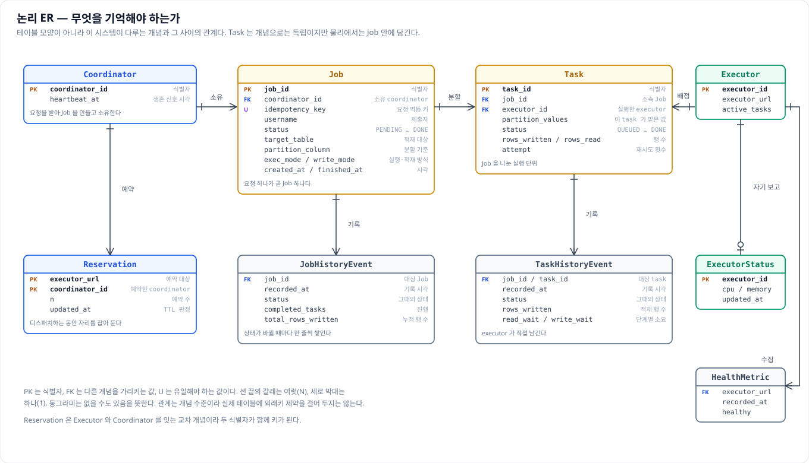
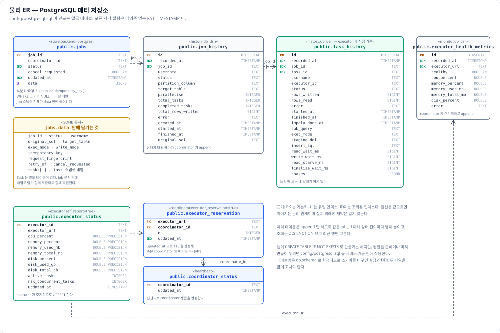
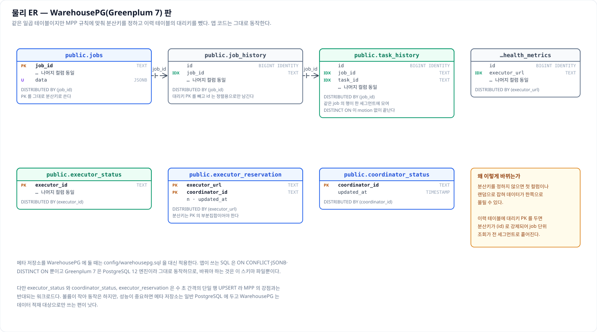

# 데이터 아키텍처 정의서

이 문서는 이 시스템을 **데이터의 눈으로** 본 것이다. 어떤 데이터가 어디서 어디로 흐르고, 그중
무엇을 이 시스템이 소유하며, 그 데이터를 어떤 규칙으로 다루는지를 다룬다.

같은 디렉터리의 다른 문서와 역할이 갈린다. SW 의 구조와 그 적용은 SW 아키텍처 정의서가, 인프라와
운영은 기술 아키텍처 정의서가 맡는다. 메타 테이블은 `er-diagram.md` 가 ER 그림으로, `tables.md` 가
컬럼 단위 명세로 다루는데, 이 문서는 그중 **ER 그림을 그대로 싣고** 거기에 **무엇을 왜 기억하는가**
라는 데이터 관점의 해석을 붙인다. 컬럼 하나하나의 타입과 기본값까지는 명세서 쪽을 본다. 겹치는
사실을 바꿀 때는 관련 문서를 함께 고친다.

---

## 목차 수정 내역

표준 데이터 아키텍처 정의서 양식은 자기 데이터를 소유하고 운영하는 업무 시스템을 전제한다. 이
시스템은 데이터를 소유하지 않고 **옮기는** 것이 존재 이유라 아래와 같이 바꿨다.

| 원 템플릿 | 이 문서 | 왜 바꿨는가 |
|---|---|---|
| II. 데이터 영역(주제 영역) 정의 | II.1 데이터 영역 구분 | 업무 주제 영역이 없다. 대신 소유 관계로 이관·메타·중간 데이터 셋으로 가른다 |
| III.3 코드 표준(공통 코드) | (제거) | 공통 코드 체계를 두지 않는다. 코드 값은 옮기는 데이터 안에 있고 이 시스템은 해석하지 않는다 |
| III. 데이터 표준 | III. 데이터 표준 | 이름은 그대로 두되 항목을 이 시스템이 실제로 강제하는 것(식별자·시각·인코딩·CSV 형식·타입 처리)으로 바꾼다 |
| IV. 데이터 모델 | IV. 데이터 모델 | 모델이 있는 것은 메타 데이터뿐이다. 이관 데이터는 모델이 아니라 **요청이 정하는 스키마 계약**이라 절을 따로 둔다 |
| V. 데이터 연계 | V. 데이터 흐름 | 연계 대상과 프로토콜은 SW 아키텍처 정의서가 다룬다. 여기서는 데이터가 어떻게 갈라지고 합쳐지는지를 본다 |
| VIII. 데이터 이행(전환) | (V 로 흡수) | 이행이 부수 작업이 아니라 이 시스템 자체다. 별도 절을 두면 V 와 같은 말을 두 번 하게 된다 |
| IX. 데이터 백업/보관 | VIII. 데이터 수명주기 | 백업 절차는 기술 아키텍처 정의서에 있다. 여기서는 각 데이터가 언제 생겨 언제 사라지는지를 본다 |
| (없음) | VI. 데이터 정합성과 품질 | 재실행 안전성과 분할의 정확성이 이 시스템의 핵심 리스크라 유형 하나로 추가했다 |

---

# I. 개요

## 1. 목적과 범위

이 문서는 세 가지 질문에 답한다.

1. **무엇이 이 시스템을 지나가는가**
2. **그중 무엇이 남는가**
3. **남는 것을 어떤 규칙으로 다루는가**

데이터를 다루는 사람이 이 문서 하나로 옮겨지는 데이터의 모양과 경계, 시스템이 기억하는 것의 구조,
그리고 **데이터가 어긋날 수 있는 지점**까지 알 수 있게 하는 것이 목적이다.

다루지 **않는** 것도 분명히 해 둔다.

**옮기는 데이터의 업무적 의미는 범위 밖이다.** 어떤 테이블의 어떤 컬럼이 무슨 뜻인지는 원본과 목적지
시스템이 갖고 있는 정보이고, 이 시스템은 **그것을 몰라도 되도록** 만들어졌다.

**목적지 시스템의 테이블 설계도 범위 밖이다.** 어떻게 나눠 저장할지, 어떤 기준으로 파티션을 만들지는
그쪽의 몫이다. 이 문서는 그 설계가 이관 속도와 정확성에 영향을 주는 지점만 짚는다.

## 2. 이 시스템의 데이터 관점

이 시스템은 데이터를 **소유하지 않는다.** 원본에서 읽어 목적지에 넣는 것이 전부이고, 그 데이터를
자기 저장소에 남기지 않는다.

보통의 업무 시스템이라면 데이터 아키텍처의 한가운데에 자기 데이터 모델이 온다. **여기서는 그 자리가
비어 있다.**

그 자리를 대신하는 것이 **소유 관계로 가른 세 갈래**다.

| 갈래 | 무엇 | 이 문서에서 어떻게 다루나 |
|---|---|---|
| 이관 데이터 | 지나가기만 하는 데이터 | 형식과 약속으로 다룬다 |
| 메타 데이터 | 시스템이 스스로 만들어 가진 데이터 | 모델과 보존으로 다룬다 |
| 중간 데이터 | 실행 중에만 있는 데이터 | 수명과 정리로 다룬다 |

이 구분이 문서 전체의 서술을 가른다.

## 3. 데이터 아키텍처 원칙

설계할 때 지킨 원칙이 넷 있다. 앞으로 나오는 설명 대부분이 이 넷에서 나온다.

**1. 데이터는 coordinator 를 지나지 않는다.** executor 가 원본에서 읽어 목적지로 곧장 보내고,
coordinator 에는 상태와 건수만 올라온다. 지시와 데이터를 갈라 둔 덕에 **처리량이 coordinator 한 대에
묶이지 않는다.** 이 원칙을 어기면 그 한 대가 전체 속도의 한계가 된다.

**2. 지나가는 데이터는 해석하지 않는다.** 값이 무슨 뜻인지 알려 하지 않고 타입도 되도록 건드리지
않는다. **원본이 준 표현을 그대로 실어 나르는 것이 가장 빠르고 가장 덜 틀리기 때문이다.** 예외는 딱
하나, 그대로 두면 적재가 깨지는 빈 값 처리뿐이다.

**3. 중간 데이터는 언제든 버릴 수 있어야 한다.** 중간에 만든 파일과 임시 테이블은 실패해도 다시
돌리면 새로 만들어진다. 그래서 **백업하지 않고, 남아 있으면 지우는 것이 안전하다.**

**4. 무엇을 읽어 무엇을 넣었는지는 반드시 남는다.** 실행한 SQL 은 로그 설정과 무관하게 항상
기록되고, 모든 로그 줄에 작업 번호와 조각 번호가 붙는다. 데이터를 옮기는 시스템에서 **이 기록이 비어
있으면 사고가 났을 때 원인을 가릴 방법이 없다.**

---

# II. 데이터 아키텍처 정의

## 1. 데이터 영역 구분

### 1.1 이관 데이터

원본에서 읽어 목적지에 넣는, **지나가기만 하는 데이터**다. 이 시스템은 이 데이터를 소유하지도
보관하지도 않는다.

**어떤 컬럼이 어떤 타입인지도 미리 알지 못한다.** 요청이 준 SELECT 가 내는 결과를 그대로 받아,
요청이 지정한 목적지 테이블로 흘려보낼 뿐이다.

그래서 이 데이터에는 **모델이 없고 약속만 있다.** 약속은 둘이다. SELECT 가 내는 컬럼의 개수와 순서가
목적지 테이블과 맞아야 한다는 것, 그리고 쪼갤 기준이 되는 컬럼이 SELECT 안에 조건으로 들어 있어야
한다는 것이다. 어긋나면 접수 단계나 넣기 직전에 걸린다. 자세한 내용은 IV.4 에 있다.

한 가지 더 기억할 것이 있다. **coordinator 는 이 데이터의 내용을 한 번도 보지 않는다.** 어떤
SELECT 를 누구에게 보냈고 몇 건이 들어갔는지는 알지만, 그 안에 무엇이 들었는지는 모른다.

### 1.2 메타 데이터

이 시스템이 소유하는 **유일한** 데이터이며 표 일곱 개로 이루어진다. 성격이 둘로 갈린다.

**"지금 어떤가"를 담는 표** — 넷이다. 덮어써지며 **최신 값 하나만 의미가 있다.**

| 표 | 담는 것 |
|---|---|
| `jobs` | 진행 중인 작업의 현재 상태와 요청 내용 |
| `executor_status` | executor 가 스스로 보고한 자원 사용량 |
| `executor_reservation` | coordinator 여러 대가 executor 를 나눠 쓸 때의 예약 |
| `coordinator_status` | 각 coordinator 가 살아 있다는 신호 |

**"무엇이 있었나"를 담는 표** — 셋이다. 계속 쌓이며 **지우기 전까지 남는다.**

| 표 | 담는 것 |
|---|---|
| `job_history` | 작업의 상태가 바뀐 기록 |
| `task_history` | 조각 하나가 무엇을 읽어 몇 건을 넣었고 어디에 얼마가 걸렸는가 |
| `executor_health_metrics` | 주기적으로 쌓는 자원 사용량 |

이 구분이 실무에서 갖는 뜻은 분명하다. **앞의 넷은 자라지 않고 뒤의 셋은 자란다.** 용량을 걱정해야
하는 쪽과 보존 기간을 걸어야 하는 쪽은 언제나 뒤쪽이다.

### 1.3 중간 데이터

옮기는 도중에 잠시 만들어 두는 데이터이며 **실행 중에만 존재한다.** 네 가지가 있다.

- 세그먼트 서버의 로컬 디스크에 만드는 CSV 파일
- S3 에 올리는 객체
- 임시 테이블
- 그 파일들을 목적지가 읽게 해 주는 외부테이블

이 데이터는 **원본이 아니라 사본이다.** 옮기다 잠시 놓아 둔 것이므로 잃어도 다시 돌리면 새로
만들어진다. 그래서 **백업하지 않고, 넣기가 끝나면 지우는 것이 기본 동작이다.**

다만 지워지지 않는 경우가 있다. 정리를 설정으로 껐거나, 두 번째 단계가 실패해 정리까지 가지
못했거나, 프로세스가 중간에 죽은 경우다.

이때 남은 파일은 **사람이 치운다.** 무엇이 남았는지는 어렵지 않게 알 수 있다. 경로와 이름이 작업
번호로 갈려 있기 때문이다.

## 2. 데이터 아키텍처 구성도

세 갈래와 그 관계를 한 장으로 정리하면 이렇다. **위에서 아래로 갈수록 이 시스템과의 관계가
깊어진다.** 맨 위는 지나갈 뿐이고, 가운데는 잠시 머물며, 맨 아래만 이 시스템의 것이다.

그림에서 눈여겨볼 것은 **세 갈래가 서로 다른 곳에 있다**는 점이다. 지나가는 데이터는 원본과 목적지
데이터베이스에, 중간 데이터는 파일 시스템이나 S3 에, 시스템이 가진 데이터는 별도의 PostgreSQL 에
있다.

**이점은** 한쪽에서 사고가 나도 다른 쪽으로 번지지 않는다는 것이다. **대가는** 전체를 알려면 세 곳을
함께 봐야 한다는 것이다.

## 3. 데이터 소유와 책임 경계

무엇이 이 시스템의 책임이고 무엇이 아닌지를 표로 갈라 둔다. **경계를 흐릿하게 두면 사고가 났을 때
누가 무엇을 복구해야 하는지부터 다투게 된다.**

| 데이터 | 소유 | 무결성 책임 | 백업 책임 | 보존 정책 |
|---|---|---|---|---|
| 소스의 원본 | 소스 시스템 | 소스 시스템 | 소스 시스템 | 소스 시스템 |
| 이관 중인 통과 데이터 | 없음(흐르는 중) | 이 시스템 — 빠짐없이 겹치지 않게 옮긴다 | 해당 없음 | 해당 없음 |
| 대상에 적재된 데이터 | 대상 시스템 | 이 시스템(적재까지) → 이후 대상 시스템 | 대상 시스템 | 대상 시스템 |
| 스테이징 파일·객체 | 이 시스템 | 이 시스템 | 하지 않음 | 적재 후 즉시 정리 |
| 메타 데이터 | 이 시스템 | 이 시스템 | 기관 DB 백업 정책 | 운영에서 건다 |
| 로그 | 이 시스템 | 이 시스템 | 필요 시 파일 복사 | 일 단위 롤링 · 기본 30일 |

경계에서 특히 자주 오해가 나는 자리가 셋이다.

**첫째, 옮긴 데이터의 백업은 이 시스템의 범위가 아니다.** 그 데이터는 목적지에 있고, 그 백업은
목적지 시스템의 운영 기준을 따른다.

**둘째, 넣은 뒤의 정확성도 목적지의 몫이다.** 이 시스템은 넣는 순간까지만 책임진다. 그 뒤에 누가
지우거나 고친 것은 알지 못한다.

**셋째, 기록의 보존은 앱이 해 주지 않는다.** 오래된 기록을 지우는 코드가 아예 없으므로, 보존 기간은
운영하는 쪽에서 걸어야 한다.

---

# III. 데이터 표준

## 1. 식별자 표준

작업과 조각에 붙는 번호는 `<접두사>_<임의의 12글자>` 형태다. 작업은 `job_`, 조각은 `t_` 를 접두사로
쓴다.

전체가 아니라 앞 12글자만 쓰는 이유는 **겹칠 가능성을 충분히 낮추면서 로그와 주소에서 다루기 좋은
길이를 유지**하기 위해서다. 접두사가 붙어 있어 로그 한 줄만 봐도 그것이 작업인지 조각인지 알 수
있다.

번호는 coordinator 가 접수하는 순간 발급하고 **그 뒤로 바뀌지 않는다.**

**이 두 값이 모든 것을 잇는 축이다.** 기록 표의 줄도, 로그의 모든 줄도, 중간 파일의 경로도,
외부테이블의 이름도 이 번호를 담고 있다. 그래서 **번호 하나만 알면 관련된 것을 전부 모을 수 있다.**

중복 방지 열쇠는 요청하는 쪽이 정한다. 헤더로 받은 값을 그대로 저장하고, 함께 **요청 내용의 지문**을
계산해 둔다. 지문은 요청 내용을 정렬해서 만들므로 **필드 순서가 달라도 같은 요청이면 같은 값**이
나온다. 그래서 같은 열쇠에 다른 내용이 오면 지문이 달라 거절할 수 있다.

중간 파일의 이름도 이 번호에서 나온다.

| 무엇 | 이름 |
|---|---|
| 세그먼트 로컬 CSV | `<stage.local_dir>/<job_id>/f<번호>.csv` |
| S3 객체 | `<s3.prefix>/<job_id>/<task_id>.csv` |
| 외부테이블 | `s3ext_<job_id>` (설정으로 스키마를 앞에 붙일 수 있다) |
| 임시 테이블 | 이름 뒤에 조각 번호를 붙인다 |

**왜 작업마다 이름이 달라야 할까.** 외부테이블은 데이터베이스 전체에서 이름이 하나뿐이라, 두 작업이
같은 이름을 쓰면 동시에 돌 때 서로를 덮어쓴다.

## 2. 시각 표준

이 시스템이 만드는 모든 시각은 **시간대 정보가 없는 한국 시각**이다.

보통은 세계 표준시로 저장했다가 보여 줄 때 각 나라 시각으로 되돌린다. 여기서는 그러지 않는다. **이
시스템은 한국에서만 쓰이기 때문**이다. 그 절차를 두면 얻는 것은 없고, 오히려 로그의 시각과
데이터베이스의 시각이 아홉 시간 어긋나 보이는 혼란만 생긴다.

이 규칙은 세 곳에 함께 적용된다. 앱이 만드는 시각도 한국 시각이고, 표의 칸도 시간대 없는 타입이며,
데이터베이스가 자동으로 채우는 기본값도 한국 시각이다. 보여 줄 때는 `yyyy-MM-dd HH:mm:ss.sss`
형식으로 밀리초까지 쓴다.

시간대가 붙은 값이 들어오는 경우에는 **방어가 걸려 있다.** 과거 데이터나 바깥에서 온 값에 시간대가
붙어 있으면 한국 시각으로 바꾼 뒤 시간대 표시를 떼고 쓴다. 해석할 수 없는 문자열은 **원본을 그대로
둔다.** 보여 주는 코드 때문에 값이 사라지는 일이 없게 하기 위해서다.

## 3. 문자와 인코딩 표준

**전 구간 UTF-8 이다.** 원본에서 읽은 문자열도, CSV 파일도, 로그도, API 응답도 모두 같다. 중간에
인코딩을 바꾸는 자리를 두지 않았다.

한글이 섞인 데이터에서 주의할 것은 인코딩 자체가 아니라 **글자 폭**이다. 한글 한 글자는 터미널에서
두 칸을 차지하므로, 글자 수로 잘라 화면에 쓰면 실제 폭이 두 배까지 밀린다.

다만 이 계산이 필요한 곳은 **사람이 보는 화면뿐**이다. 데이터 자체를 자르지는 않는다.

## 4. CSV 형식 표준

2단계로 넣는 방식은 데이터를 CSV 파일로 내보낸 뒤 목적지가 그 파일을 읽는 구조다. 그래서 **파일을
쓰는 쪽과 읽는 쪽이 같은 형식을 알고 있어야 한다.** 그 형식을 이루는 값이 셋이다.

| 항목 | 기본값 | 설정 키 | 요청별 재정의 |
|---|---|---|---|
| 컬럼 구분자 | 백틱(`` ` ``) | `stage.csv_delimiter` | `csv_delimiter` |
| NULL 표현 | 빈 문자열 | `stage.csv_null` | `csv_null` |
| 인용문자 | 큰따옴표(`"`) | `stage.csv_quote` | `csv_quote` |

**칸을 나누는 기호가 쉼표가 아니라 백틱(`` ` ``)인 데에는 이유가 있다.**

CSV 는 보통 쉼표로 칸을 나눈다. 그런데 옮기는 데이터에는 쉼표와 큰따옴표가 흔히 섞여 있다. 그럴
때마다 값을 따옴표로 감싸고 특수 처리를 해야 하는데, 쓰는 비용과 읽는 비용이 함께 늘어난다.

백틱은 **일반적인 업무 데이터에 거의 나타나지 않는다.** 그래서 따옴표 없이도 안전하다. 물론 백틱이
실제로 들어 있는 데이터라면 이 값을 바꿔야 하고, 그래서 요청마다 덮어쓸 수 있게 열어 두었다.

**여기서 반드시 지켜야 할 규칙이 하나 있다. 파일을 쓸 때 쓴 형식과 읽을 때 쓰는 형식이 같아야
한다.**

어긋나면 어떻게 될까. 파일 자체는 멀쩡한데 읽을 때 칸이 한 칸씩 밀리거나, 빈 값이어야 할 자리에 빈
문자열이 들어간다. 오류가 나지 않고 **데이터만 틀어지므로** 알아채기 어렵다.

그래서 coordinator 가 읽는 쪽 SQL 을 만들 때 **그 작업이 실제로 쓴 값을 그대로 실어 조립한다.**
사람이 두 곳에 따로 적는 자리를 아예 만들지 않은 것이다.

## 5. 타입 처리 표준

**원본에서 읽을 때는 타입 변환을 끈다.**

드라이버에는 날짜나 숫자를 파이썬 값으로 바꿔 주는 기능이 있다. 편리한 기능이지만 파일로 내보내는
경로에서는 **일부러 끈다.** 어차피 CSV 로 쓸 것이라, 값으로 바꿨다가 다시 문자열로 만드는 과정이
순수한 낭비이기 때문이다. 데이터가 클수록 이 비용이 커진다.

**빈 값은 CSV 의 빈 값 표시로 바꾼다.** 이것이 **지나가는 데이터에 손을 대는 유일한 자리다.**

왜 필요할까. 일부 원본은 빈 값을 `NaN` 이나 `NaT` 라는 특별한 값으로 준다. 이것을 그대로 CSV 로 쓰면
**`"nan"` 이라는 글자가 파일에 적힌다.** 그러면 읽는 쪽은 그 칸을 빈 값으로 알아보지 못한다.

여기서 더 나쁜 쪽이 있다. 숫자 칸이라면 넣다가 오류가 나서 알아챈다. 그런데 **문자 칸이라면 오류
없이 `"nan"` 이라는 글자가 그대로 들어간다.** 나중에 데이터를 보기 전에는 알 수 없다.

그래서 넘기기 전에 빈 값을 표준 형태로 바꾼다. 데이터베이스에서 읽는 원본은 애초에 표준 형태로
주므로 이 처리가 필요 없다.

**미리보기 경로에는 규칙이 하나 더 있다.** 결과를 JSON 으로 돌려줄 때 특수한 숫자 타입을 평범한
값으로 낮추지 않으면, 숫자가 **문자열로 새어 나간다.**

이 문제가 고약한 이유는 **일부만 그렇다**는 데 있다. 정수와 참·거짓은 문자열이 되는데 실수는 우연히
통과한다. 그래서 **컬럼 타입에 따라 결과 타입이 갈리는** 이상한 현상이 생긴다.

이를 막기 위해 값을 명시적으로 낮추고, JSON 에 표현이 없는 특수 값(빈 값이나 무한대)은 모두
`null` 로 떨군다. 이 규칙은 **어느 원본을 보든 같다.**

## 6. 명명 규칙

**표 이름 앞에는 언제나 스키마가 붙는다.** 일곱 표의 이름은 설정에 적은 스키마(기본 `public`)로
한정되고, 앱이 실행하는 SQL 과 배포된 DDL 이 같은 이름을 가리키게 되어 있다.

**여기서 놓치기 쉬운 함정이 있다.** 표나 스키마를 바꿀 때는 **설정과 DDL 두 파일을 함께 고쳐야
한다.** 한쪽만 고치면 앱은 새 이름으로 표를 만들고 운영자는 옛 이름을 들여다보게 된다. 둘 다 오류가
나지 않으므로 한참 뒤에야 알아챈다.

**중간에 만드는 것들의 이름은 작업·조각 번호로 갈려 있다.** 파일 경로에도, S3 키에도, 외부테이블
이름에도, 임시 테이블 이름에도 번호가 들어간다.

이 덕분에 두 가지가 가능하다. **여러 작업이 동시에 돌아도 서로의 중간 파일을 덮어쓰지 않고**, 사고가
났을 때 **어느 작업이 남긴 찌꺼기인지 이름만 보고 가릴 수 있다.**

---

# IV. 데이터 모델

## 1. 개념 데이터 모델

이 시스템이 기억하는 개념은 넷이다.

- **job** — 사용자가 맡긴 이관 한 건
- **task** — 그 job 을 쪼갠 실행 단위
- **executor** — task 를 실제로 수행하는 서버
- **coordinator** — job 을 받아 나누고 결과를 모으는 서버

관계는 이렇다. job 하나에 task 가 여럿 딸리고, task 하나는 executor 하나에 배정되며, job 하나는
coordinator 하나가 소유한다.

**무엇을 기억하지 않기로 했는지**도 함께 봐야 모델이 읽힌다.

옮긴 데이터의 내용은 기억하지 않는다. 사용자 계정 체계도 두지 않아서, 요청에 담긴 사용자 이름은
**그대로 남기는 표시용 값일 뿐**이다. 목적지 테이블의 구조도 기억하지 않고 **넣기 직전에 그때그때
조회해 확인한다.**

기억하지 않기로 한 만큼, 이 시스템은 **원본과 목적지가 바뀌어도 영향을 덜 받는다.** 기억해 두면
그것이 낡을 때마다 문제가 되기 때문이다.

## 2. 논리 데이터 모델

개념을 실제 구조로 옮기면서 **"지금 상태"를 담는 것과 "지나간 일"을 담는 것을 갈랐다.**

왜 갈랐을까. 현재 상태는 덮어써야 하고 지나간 기록은 쌓여야 한다. **이 둘을 한 표에 두면 덮어쓰기와
쌓기가 뒤섞여** 조회도 정리도 어려워진다.

그래서 각 개념이 이렇게 자리를 잡는다.

| 개념 | 지금 상태 | 지나간 기록 |
|---|---|---|
| job | 있다 (한 줄) | 있다 (상태가 바뀔 때마다 쌓임) |
| task | 없다 — job 안에 함께 담긴다 | 있다 (끝난 것만) |
| executor | 있다 (자원 사용량) | 있다 (주기적 계측) |

이 관계를 그림으로 보면 이렇다. 상자는 테이블이 아니라 개념이고, 선은 개념 사이의 관계다.

## 3. 물리 데이터 모델

### 3.1 PostgreSQL

실제로 만들어지는 표는 일곱 개다. 칸 하나하나의 타입과 기본값은 `tables.md` 의 명세서가 담고
있으므로, 여기서는 그 표들이 **왜 그렇게 생겼는지**만 짚는다.

**`jobs` 는 칸이 여섯 개뿐이다.** 찾을 때 필요한 것만 칸으로 꺼내 두고, 요청 내용과 조각 목록을
포함한 나머지 전부를 `data` 라는 칸 하나에 통째로 담는다.

**왜 이렇게 했을까. 이관 요청의 모양이 자주 늘어나기 때문이다.** 새 필드를 받을 때마다 칸을 추가하고
DDL 을 두 벌 고치는 대신, 꺼내 쓸 것만 칸으로 두고 나머지는 문서처럼 담으면 변화에 강해진다.

**중복 방지 열쇠에는 특별한 규칙이 걸려 있다.** 그 값은 `data` 안에 있지만, 그 위에 "겹치면 안
된다"는 규칙을 걸어 두었다.

앱도 나름대로 중복을 막고 있는데 왜 또 걸었을까. **두 coordinator 가 정확히 같은 순간에 같은 열쇠로
들어오는 경우**까지 앱 코드만으로 막기는 어렵기 때문이다. 이 규칙이 마지막 방어선이다. 열쇠가 없는
작업은 이 규칙에서 빠지도록 조건을 달아 두었다.

**기록 표 둘은 쌓기만 하므로** 줄마다 일련번호를 두고, 시각과 조회 기준이 되는 번호에 찾기 장치를
건다.

**`task_history` 가 유난히 넓은데**, 이 시스템에서 성능을 분석하는 1차 자료가 이 표이기 때문이다.
읽은 건수와 쓴 건수를 따로 두고, 걸린 시간을 네 갈래로 나눠 담고, 단계별 시각표까지 넣는다. **느렸을
때 어디가 느렸는지를 짐작이 아니라 값으로 가리기 위한 구조다.**

**상태 표 셋은 단순하다.** 각자 자기 이름을 그대로 기본키로 쓰고, 마지막으로 갱신된 시각 하나로 "이
값이 아직 믿을 만한가"를 판단한다. 예약 표만 키가 둘인데, **같은 executor 를 여러 coordinator 가
나눠 예약하기 때문**이다.

### 3.2 WarehousePG

기록 데이터베이스를 WarehousePG 나 Greenplum 7 에 두는 경우를 위해 DDL 을 한 벌 더 배포한다.

**왜 따로 필요할까.** 이쪽은 데이터를 여러 서버에 나눠 두고 동시에 처리하는 구조라, **"무엇을
기준으로 나눌 것인가"를 표마다 정해 줘야 한다.** 정해 주지 않으면 첫 칸이나 임의의 값으로 잡혀, 함께
읽어야 할 줄들이 서버마다 흩어진다.

나눌 기준은 **함께 읽을 것을 같은 서버에 모으는** 쪽으로 골랐다.

작업과 두 기록 표는 **작업 번호**로 묶는다. 한 작업의 기록을 모아 보는 것이 가장 잦은 조회이기
때문이다. 상태 표들은 각자의 이름으로 나눈다.

**여기서 제약이 둘 생긴다.**

**첫째, 기본키는 나눌 기준을 포함해야 한다.** 그래서 기록 표에서 일련번호 기본키를 뺐다. 그대로 두면
일련번호가 나눌 기준이 되어 **한 작업의 기록이 서버마다 흩어진다.**

**둘째, 중복 방지 열쇠에 "겹치면 안 된다"는 규칙을 걸 수 없다.** 그 규칙을 걸려면 그 칸이 나눌
기준이어야 하는데, 열쇠는 문서 칸 안에 들어 있기 때문이다.

그래서 **WarehousePG 에서는 중복 요청 방지가 앱의 노력에만 기대는 최선 노력이 된다.** 중복 제출이
곤란한 업무라면 이 점을 알고 써야 한다.

앱이 실행하는 SQL 은 **양쪽에서 그대로 돈다.** Greenplum 7 이 PostgreSQL 12 를 바탕으로 만들어졌기
때문이다.

## 4. 이관 데이터의 스키마 계약

앞에서 지나가는 데이터에는 모델이 없고 **약속만 있다**고 했다. 그 약속이 무엇인지 정리하면 아래와
같다.

| 무엇 | 누가 정하는가 | 언제 확인되는가 | 어긋나면 |
|---|---|---|---|
| SELECT 가 내는 컬럼의 개수와 순서 | 요청 | 적재 직전(`copy.preflight`) | 한 행도 넣기 전에 실패한다 |
| 대상 테이블과 그 컬럼 | 요청 | 적재 직전 | 같음 |
| 파티션 컬럼과 그 `IN` 목록 | 요청 | 접수 시 파서가 검증 | 422 로 거절한다 |
| 적재 방식(`write_mode`) | 요청 | 적재 시 | 멱등 여부가 갈린다 |
| 외부테이블의 컬럼 정의 | 요청(`external_columns`) | Phase 2 | 컬럼이 밀려 들어간다 |
| CSV 형식 | 설정 또는 요청 | Phase 1·2 공통 | 읽는 쪽이 밀린다 |

여기서 가장 중요한 것이 **넣기 직전의 사전 검사**다.

SELECT 가 내는 칸이 목적지 테이블에 모두 있는지를 **한 건도 흘려보내기 전에** 확인하고, 맞지 않으면
그 자리에서 실패시킨다.

**이 검사가 없으면 어떻게 될까.** 큰 데이터를 몇십 분 동안 다 읽은 뒤에야 넣다가 깨진다. 그때는 이미
시간과 원본 자원을 다 쓴 뒤다.

반대로 **자동으로 맞춰 주지 않는 것**도 분명히 해 둔다.

- 칸 이름이 다르면 이름으로 짝지어 주지 않는다
- 타입이 다르면 변환해 주지 않는다
- 칸 순서가 뒤바뀐 것을 바로잡아 주지 않는다

그런 편의를 넣으면 **조용히 잘못 들어가는 경로가 생기기 때문에** 일부러 두지 않았다. 맞추는 것은
요청하는 쪽의 책임이다.

---

# V. 데이터 흐름

## 1. data plane 과 control plane 의 분리

이 시스템에서 **데이터가 흐르는 길과 지시가 오가는 길은 서로 다르다.** 데이터가 지나는 길을 data
plane, 지시와 상태가 오가는 길을 control plane 이라고 부른다.

executor 는 원본에서 읽어 목적지로 직접 보낸다. coordinator 와 주고받는 것은 "이 조각을 해라"라는
지시와 "이만큼 했다"라는 상태뿐이다.

이 분리가 데이터 관점에서 갖는 뜻은 셋이다.

**첫째, 처리량이 coordinator 에 묶이지 않는다.** executor 를 늘리면 그만큼 빨라지고, coordinator 는
상태만 다루므로 부담이 거의 늘지 않는다.

**둘째, coordinator 서버에는 옮기는 데이터가 한 번도 닿지 않는다.** 원본에 접속할 드라이버조차 없다.
그래서 그 서버가 노출되어도 데이터가 새지 않는다.

**셋째, 건수는 executor 가 세어 올린다.** coordinator 가 직접 셀 방법이 없다. 그러므로 **이 값의
신뢰도는 executor 의 계측에 달려 있다.** 정말 몇 건이 들어갔는지 확실히 알고 싶으면 목적지 테이블을
직접 세어 봐야 한다.

## 2. 하나의 SELECT 가 N 개로 갈리는 방식

### 2.1 파티션 IN 분할

기본 방식은 SELECT 안의 조건 목록을 N 등분하는 것이다.

예를 들어 `IN (a, b, c, d)` 라는 조건을 둘로 나누면, 한 조각은 `IN (a, b)` 를, 다른 조각은 `IN (c,
d)` 를 담은 같은 SELECT 를 실행한다.

나누는 방법은 둘이다. **연속된 덩어리로 자르는 것**이 기본이고, **번갈아 배분하는 것**도 고를 수
있다. 값마다 데이터 양이 크게 다를 때는 뒤쪽이 더 고르게 퍼진다.

여기서 중요한 것이 **원래 SQL 의 모양을 그대로 두고 목록 자리만 바꿔 끼운다**는 점이다. SQL 을
해석해서 다시 조립하지 않는다.

**왜 그럴까.** 다시 조립하면 따옴표나 함수 표기, 대소문자가 미묘하게 달라진다. 그 작은 차이가 원본
데이터베이스에서 다른 실행 계획이나 **다른 결과**를 만들 수 있다. 사람이 검증한 SQL 이 그대로
실행되게 하는 편이 안전하다.

이 분할이 데이터에 주는 보장은 명확하다. **조각들이 읽는 범위를 다 합치면 원본과 정확히 같고, 서로
겹치지 않는다.** 이 성질이 뒤에서 볼 "두 번 돌려도 안전한가"의 전제가 된다.

### 2.2 날짜 fan-out

기간을 다루는 이관에서는 목록 대신 **구간의 시작과 끝을 값으로 주고, 하루를 조각 하나로 펼치는**
방식을 쓴다. 7일치를 옮긴다면 조각이 일곱 개 생기고 각 조각은 자기 날짜 하루만 읽는다.

**이 방식에는 반드시 지켜야 할 약속이 하나 있다.** 지키지 않으면 데이터가 조용히 중복된다.

SQL 에서 날짜를 계산할 때 "7일 전"인지 "7일 후"인지의 **방향**이 문장에 박힌다. 이 방향을 템플릿이
정해진 변수로 받아 써야 한다.

이 변수를 쓰지 않으면 각 조각이 **의도보다 넓은 구간을 읽는다.** 그러면 같은 데이터가 여러 조각에
중복으로 잡힌다. 게다가 이 방식은 덧붙이는 방식으로 넣으므로 **중복이 그대로 쌓이고**, 오류 없이
성공으로 끝나므로 나중에 건수를 세어 보기 전에는 알 수 없다.

그래서 SQL 을 만들기 전에 템플릿을 검사해, 그 변수를 쓰지 않으면 **접수 단계에서 거절한다.**

## 3. exec_mode 별 데이터 경로

요청의 모양은 똑같은데 **`exec_mode` 라는 필드 하나로 데이터가 지나는 길이 갈린다.**

| exec_mode | 데이터가 지나는 길 | 중간 데이터 | 멱등 |
|---|---|---|---|
| `copy` | 소스 → executor 메모리 → 대상 COPY | 없음 | `overwrite_partitions` 로 성립 |
| `statement` | 대상 안에서만(받은 INSERT 를 실행) | 없음 | 문장이 정하기 나름 |
| `stage_insert` | 소스 → executor → staging → 대상 INSERT | staging 테이블 | 항상 append 라 성립하지 않음 |
| `local_stage` | 소스 → executor → 세그먼트 로컬 CSV → 외부테이블 → 대상 | CSV 파일·외부테이블 | `overwrite_partitions` 로 성립 |
| `s3_stage` | 소스 → executor → S3 객체 → 외부테이블 → 대상 | S3 객체·외부테이블 | `overwrite_partitions` 로 성립 |

**무엇을 고를지는 데이터의 양과 목적지의 구조가 정한다.**

`copy` 는 executor 가 목적지의 대표 서버로 밀어 넣는 방식이라 가장 단순하다. 그런데 목적지가
데이터를 여러 서버에 나눠 두는 구조라면, **아무리 executor 를 늘려도 그 대표 서버 한 대가 전체
속도의 한계**가 된다.

그때는 파일을 만들어 **여러 서버가 동시에 당겨 읽게** 하는 두 방식으로 바꾼다.

둘 중 무엇을 고를지는 **서버를 어디에 둘 수 있느냐**가 가른다. `local_stage` 는 executor 와 목적지
서버가 같은 자리에 있어야 하고, `s3_stage` 는 위치와 상관없다.

## 4. 2단계 적재의 데이터 흐름

두 방식은 **executor 가 파일을 만드는 1단계**와 **coordinator 가 그 파일을 목적지에 넣는 2단계**로
나뉜다. 그 사이에는 **모든 executor 가 끝나기를 기다리는 지점(barrier)** 이 있다.

이 구조의 핵심은 **파일을 다루는 단위**다.

1단계에서는 조각 하나가 파일 하나를 만든다. 2단계에서 coordinator 는 그 파일들을 하나씩 다루지 않고,
**작업 전체를 가리키는 통로 하나로 묶어 한 번에 넣는다.** 그래서 목적지에서 보면 이관 한 건이 **한
번의 트랜잭션**으로 들어간다.

**기다리는 지점이 필요한 이유도 여기에 있다.** 파일이 다 만들어지기 전에 읽기 시작하면 그때까지
올라온 파일만 읽히고 나머지는 **조용히 빠진다.** 실패하지 않고 일부만 들어가는 형태라 가장 나쁜
종류의 사고다.

그래서 **하나라도 1단계에서 실패하면 2단계를 아예 시작하지 않는다.**

`local_stage` 에는 **파일을 어디에 몇 개 두느냐**는 문제가 하나 더 있다.

목적지 서버들이 파일을 나눠 읽는데, **한 서버에 놓인 파일 수가 그 서버가 감당할 수 있는 수를
넘으면** 일부가 파일 두 개를 차례로 읽게 되어 전체가 그만큼 늦어진다.

그래서 파일 수를 서버가 감당할 수 있는 수 이하로 배분하고, 2단계 전에 **파일이 놓인 서버가 실제
목적지 서버와 맞는지 대조한다.**

마지막 3단계는 정리다. 성공하면 통로를 지우고 파일도 지운다.

## 5. 소스 다양성과 데이터 정규화

**원본이 Impala 만은 아니다.** Trino 를 쓸 수도 있고, 데이터베이스가 아닌 사내 API 가 원본이 되기도
한다. 이때 **데이터의 모양이 원본마다 다르다**는 문제가 생긴다.

해법은 어댑터다. 읽는 코드가 원본에 요구하는 것은 사실 셋뿐이다. "컬럼이 무엇인지 알려 줘", "다음
묶음을 줘", "다 썼으니 닫아 줘". 그래서 **그 세 가지 모양만 갖춰 감싸면 그 뒤의 코드는 한 줄도
바뀌지 않는다.**

받아들이는 형태는 넉넉하다. 표 형태의 객체, 줄 목록, 컬럼과 줄을 담은 딕셔너리나 튜플, 그리고
이것들을 나눠 주는 형태까지 받는다. **어떤 형태로 오든 (컬럼 이름, 줄 목록) 하나로 맞춘다.**

**여기에 데이터가 조용히 잘리는 함정이 하나 있다.** 사내 API 를 원본으로 붙일 때 가장 먼저 확인해야
하는 지점이다.

같은 함수를 **미리보기와 이관이 함께 부른다.** 미리보기는 몇 줄만 필요하므로 줄 수를 넘겨 주지만,
이관은 전부가 필요하므로 넘길 값이 없다. 그래서 이관은 "제한 없음"을 뜻하는 값을 넘긴다.

문제는 그 함수가 **"제한 없음"을 전부로 처리하지 않고 무조건 자를 때** 생긴다. 그러면 **이관이
일부만 넣고 성공으로 끝난다.** 오류가 나지 않으므로 알아채기 어렵다.

또 하나, 결과를 나눠 주지 않고 한꺼번에 돌려주는 API 는 **조각 하나의 결과가 통째로 메모리에
올라간다.** 이 경우 분할 수를 늘려 조각 하나가 다루는 양을 줄이는 것으로 완화한다.

---

# VI. 데이터 정합성과 품질

## 1. 정합성이 결정되는 지점

**데이터가 정확하다는 것은 한곳에서 보장되지 않는다.** 네 지점에서 각각 다른 것이 보장된다.

어디까지가 시스템의 보장이고 어디부터가 **사용자가 챙겨야 할 몫**인지를 가려 두는 것이 이 절의
목적이다.

| 지점 | 보장되는 것 | 보장되지 않는 것 |
|---|---|---|
| 접수 | 같은 멱등 키의 중복 제출은 흡수된다. SELECT 가 문법과 정책에 맞는다 | 그 SELECT 가 업무적으로 옳은지 |
| 분할 | task 들의 파티션 값 집합이 원본을 빠짐없이 겹치지 않게 덮는다 | 값마다 데이터 양이 고른지 |
| 적재 | 컬럼이 맞는지 미리 검사한다. `overwrite_partitions` 는 파티션 단위로 원자적이다 | job 전체가 원자적이지는 않다 |
| 집계 | 모든 task 의 성패와 행 수가 하나로 모인다 | 대상에 실제로 몇 행이 있는지 |

**가장 자주 오해하는 것이 세 번째 줄이다.**

"전부 아니면 전무"의 단위는 **작업 전체가 아니라 조각 하나다.**

조각 하나 안에서는 지우는 것과 넣는 것이 한 묶음이라, 그 부분은 통째로 바뀌거나 통째로 남는다.
그런데 **조각 열 개 중 셋이 실패하면 일곱 개 몫은 이미 목적지에 들어가 있다.**

이 상태가 `PARTIAL` 이고, **성공이 아니다.** 되돌려 주지 않으므로 사용자가 조치해야 한다.

## 2. 재실행 안전성

**"두 번 돌려도 안전한가"는 두 층위로 나뉜다.** 둘은 서로 독립이고 **각각 따로 켜야 한다.** 하나만
켜고 안심하는 것이 흔한 실수다.

**첫째 층위 — 같은 요청이 두 번 들어오는 것을 막는다.** 중복 방지 열쇠가 맡는다.

같은 열쇠에 같은 내용이 오면 새로 만들지 않고 **기존 작업을 그대로 돌려준다.** 같은 열쇠에 다른
내용이 오면 거절한다. 클라이언트가 응답을 못 받아 그냥 다시 보내는 흔한 상황을 흡수하는 장치다.

**둘째 층위 — 같은 데이터가 두 번 들어가는 것을 막는다.** 넣는 방식이 맡는다.

`overwrite_partitions` 를 고르면 **넣기 전에 담당 자리를 지운다.** 지우는 것과 넣는 것이 한 묶음으로
처리되므로, 몇 번을 다시 돌려도 그 자리에는 마지막 결과 하나만 남는다.

**`append` 는 안전하지 않다.** 그냥 덧붙이므로 다시 돌리면 그만큼 더 쌓인다.

**여기에 알아 둬야 할 조합 제약이 있다.** `stage_insert` 방식과 날짜를 하루씩 펼치는 방식은 **언제나
덧붙이는 방식으로만 넣는다.** 그러므로 이 둘을 쓰면서 재실행 안전성이 필요하면 **시스템이 아니라
사람이 준비해야 한다.** 목적지를 미리 비우거나 날짜별로 테이블을 따로 두는 것이 흔한 방법이다.

## 3. 분할의 정확성

분할이 정확하다는 것은 **조각들이 읽는 범위를 다 합치면 원본과 같고, 서로 겹치는 부분이 없다**는
뜻이다.

이 성질이 깨지면 나머지 모든 보장이 함께 무너진다. **겹치면 중복해서 들어가고, 빠지면 조용히
누락된다.**

**목록을 나누는 방식에서는 이 성질이 구조적으로 성립한다.** 목록의 원소를 나눠 담을 뿐이라 어느
원소도 두 조각에 들어가지 않고 빠지지도 않는다. 원래 SQL 을 다시 조립하지 않고 목록 자리만 바꿔
끼우는 것도 여기에 기여한다.

**날짜를 하루씩 펼치는 방식에서는 이 성질이 템플릿 작성에 달려 있다.** 각 조각은 자기 날짜로 구간을
좁혀야 하는데, 정해진 변수를 쓰지 않은 템플릿은 좁혀지지 않아 **여러 조각이 같은 넓은 구간을
읽는다.**

그래서 SQL 을 만들기 전에 템플릿을 검사해 그 변수를 쓰지 않으면 **접수 단계에서 거절한다.** 막지
않으면 오류 없이 중복해서 들어가기 때문에, 경고가 아니라 거절로 둔 것이다.

구간의 **양 끝을 포함할지 아닐지**도 함께 고르게 해 두었다. 경계에 걸친 하루가 겹치거나 빠지는
실수를 줄이기 위해서다.

## 4. 적재 결과 검증

**건수는 두 값으로 나뉘어 기록된다.** 원본에서 읽은 건수와 목적지에 쓴 건수를 따로 남긴다.

**둘이 다르면 중간에서 무언가가 걸러졌다는 뜻**이라, 그 차이 자체가 신호가 된다. 조각마다 이 값이
남고 작업 단위 합계도 함께 집계된다.

넣기 전에는 **칸 검사**가 있다. 원본이 내는 칸이 목적지 테이블에 모두 있는지 확인하고, 맞지 않으면
**한 건도 넣기 전에** 실패한다.

최종 상태는 넷이고 **온전한 성공은 `DONE` 하나뿐이다.**

| 상태 | 뜻 |
|---|---|
| `DONE` | 전부 성공. 이것만이 온전한 성공이다 |
| `PARTIAL` | 일부 조각이 실패. **일부 데이터가 빠진 상태이며 성공이 아니다** |
| `FAILED` | 실패. 다만 이미 들어간 몫이 있을 수 있다 |
| `CANCELLED` | 취소. 마찬가지로 이미 들어간 몫이 있을 수 있다 |

**`FAILED` 와 `CANCELLED` 도 "아무 일도 없었음"이 아니다.** 되돌려 주지 않으므로 목적지를 확인해야
한다.

마지막 확인은 **사람이 목적지에서 직접 한다.** API 가 돌려주는 값은 이 시스템이 센 것이므로, 정말 몇
건이 들어갔는지는 목적지 테이블을 세어 보는 것이 확실하다. 운영자 도구의 SQL 셸이 그 자리를 위해
있다.

## 5. 품질이 조용히 깨지는 경로

**실패하면서 깨지는 것은 덜 위험하다.** 알아채고 다시 돌리면 되기 때문이다.

정말 위험한 것은 **성공으로 끝나면서 데이터가 틀리는** 경우다. 알려진 것이 넷이니 이것만은 기억해
두는 편이 좋다.

| 증상 | 원인 | 어떻게 알아채나 | 막는 방법 |
|---|---|---|---|
| 같은 데이터가 여러 번 들어감 | 날짜 fan-out 에서 방향 변수를 쓰지 않은 템플릿 | 대상 행 수가 예상의 배수 | 접수 단계에서 거절한다 |
| 결과가 잘린 채 적재됨 | 커스텀 소스가 `limit is None` 을 전량으로 처리하지 않음 | 읽은 행 수가 예상보다 적고 일정한 값 | 커스텀 API 구현 규약 |
| 문자열 `"nan"` 이 적재됨 | DataFrame 의 결측값을 정규화하지 않음 | 대상 컬럼에 `nan` 문자열 | 행을 넘기기 전에 `None` 으로 정규화 |
| 성공인데 대상이 비어 있음 | 대상 접속 정보가 비어 MockBackend 로 기동 | 기동 로그의 경고, 행 수는 나오는데 대상은 그대로 | 기동 로그 확인 |

**이 넷의 공통점은 오류 로그가 나지 않는다는 것이다.** 그래서 방어도 대부분 **실행 전에** 걸어
두었다. 접수 단계의 템플릿 검사, 넣기 직전의 칸 검사, 기동할 때의 경고가 그것이다.

그럼에도 남는 부분은 **이관 뒤에 목적지 건수를 한 번 세어 보는 습관**으로 메운다. 이것이 가장
확실하다.

---

# VII. 데이터 보안

## 1. 데이터 등급과 취급 원칙

이 시스템은 옮기는 데이터가 얼마나 민감한지를 **스스로 판정하지 않는다.** 그것은 원본과 목적지
시스템이 정할 일이다.

여기서는 **어떤 데이터든 보관하지 않는다**는 원칙 하나로 다룬다. 보관하지 않는 것이 **드러날 자리를
줄이는 가장 확실한 방법**이기 때문이다.

**그럼에도 데이터의 흔적이 남는 자리가 셋 있다.** 알고 있어야 한다.

1. **중간 파일** — 넣기가 끝날 때까지 암호화되지 않은 CSV 로 존재한다
2. **실행 SQL 로그** — 조건에 쓰인 값이 함께 남는다. 그 값이 민감하다면 로그에 남는 셈이다
3. **미리보기 응답** — 데이터 몇 줄이 API 응답과 화면에 그대로 나온다

셋 다 필요해서 둔 것이므로, **없애기보다 접근을 제한하는 편이 맞다.**

## 2. 전송 구간 보호

**구간마다 보호 수준이 다르다.** 그 차이는 **각 구간이 어떤 망에 있느냐를 전제로** 정해졌다.

| 구간 | 보호 | 전제 |
|---|---|---|
| executor → 소스 | TLS + CA 인증서 검증, LDAP 인증 | 소스가 인증을 요구한다 |
| executor·coordinator → 대상 | 없음(평문 DSN) | 같은 망 안이며 방화벽으로 보호된다 |
| executor → 오브젝트 스토리지 | TLS(설정으로 끌 수 있음) | 자격증명은 설정 또는 기본 체인 |
| 사용자 → coordinator | 평문 HTTP | 같은 망 안이다 |
| coordinator → executor | 평문 HTTP | 같은 망 안이다 |

여기서 분명히 해 둘 것이 있다. **목적지로 가는 구간은 "같은 망 안이라 안전하다"를 전제로 한다.**
그러므로 **이 전제가 성립하지 않는 환경이라면 그대로 쓰면 안 된다.**

바깥에 열어야 하는 포트는 coordinator 하나뿐이다. executor 포트는 같은 망 안에서 coordinator 만
부르므로 노출할 이유가 없다.

## 3. 비밀 정보와 마스킹

접속 정보는 설정 파일 한 곳에 두고 서비스 계정만 읽도록 권한을 좁힌다. 운영자 CLI 는 비밀번호를
명령행 인자로 받지 않는데, 프로세스 목록으로 같은 서버의 다른 사용자에게 그대로 보이기 때문이다.
설정과 환경변수, 대화형 입력 순으로만 받는다.

밖으로 나가는 자리에서는 마스킹이 걸린다. 접속 문자열의 자격증명 부분을 가리고, 자유 텍스트에서
`password`·`secret`·`token`·`api_key` 계열의 키에 붙은 값을 가리며, 인증 헤더와 쿠키 계열 헤더는
값을 통째로 가린다. 대상은 화면의 설정 탭과 API 응답, 그리고 상세 HTTP 로깅이다.

마스킹의 한계도 알아 두는 것이 좋다. 마스킹은 **알려진 패턴**을 가리는 것이라, 이관 데이터 자체에
담긴 개인정보나 비밀은 대상이 아니다. 그런 데이터를 다룬다면 스테이징 경로와 로그 접근 권한 쪽에서
막아야 한다.

## 4. 감사 추적

**어느 데이터베이스에 어떤 문장을 던졌는지는 로그 설정과 무관하게 항상 남는다.**

HTTP 상세 기록은 별도로 켜야 남는 것과 대비되는 선택이다. **운영 기본 상태에서 "무엇을 읽어 무엇을
넣었나"가 비어 있으면 사고 추적이 아예 불가능하기 때문**이다.

한 줄에는 어느 데이터베이스에 던졌는지, 어느 단계인지, 대상이 무엇인지가 함께 붙는다. 그리고 앞에는
작업 번호와 조각 번호가 자동으로 붙는다.

**어느 데이터베이스인지를 함께 남기는 이유**가 있다. 같은 SELECT 라도 Impala 로 읽었는지 다른 API 로
읽었는지가 갈려 남기 때문이다. 이 값이 없으면 **원본 설정을 잘못 잡은 사고를 로그만으로는 판별할 수
없다.**

**기록에는 길이 한계가 있다.** 한 건이 정해진 길이를 넘으면 잘린다. 다만 **잘렸다는 사실과 원래
길이를 함께 적어** 전문이 아님을 숨기지 않는다. 아주 긴 SQL 을 온전히 남겨야 한다면 이 값을 올린다.

---

# VIII. 데이터 수명주기

각 데이터가 언제 생겨 언제 사라지는지를 한 장으로 보면 이렇다.

## 1. 중간 데이터

중간 파일은 1단계에서 생겨 3단계에서 지워진다. 통로도 함께 지워지고, 임시 테이블은 조각이 끝날 때
지워진다. **정상적으로 끝나면 아무것도 남지 않는다.**

**남는 경우는 셋이다.**

1. 정리를 설정으로 껐다 — 의도한 선택이다
2. 2단계가 실패해 정리까지 가지 못했다 — 사고다
3. 프로세스가 중간에 죽었다 — 사고다

남은 것을 치우는 일은 **사람이 한다.** 경로와 이름이 작업 번호로 갈려 있어 어느 작업의 것인지 바로
알 수 있고, S3 쪽은 운영자 도구로 작업 단위로 통째로 지운다.

**이때 반드시 상태를 먼저 확인한다.** 아직 돌고 있는 작업의 파일을 지우면 그 작업이 실패한다.

## 2. 메타 데이터

**상태 표는 자라지 않는다.** 작업은 끝나도 줄이 남지만 오래된 것을 정리하면 되고, executor 와
coordinator 상태는 서버 수만큼만 있으며 덮어써진다.

**기록 표는 자란다. 그리고 앱은 오래된 줄을 지우지 않는다.**

왜 지우지 않을까. **기록을 언제까지 볼 것인가는 업무가 정할 문제**라, 코드가 임의로 정하지 않기로
했기 때문이다. 대신 그 대가로 **아무것도 하지 않으면 무한히 쌓인다.**

그래서 보존 기간을 정해 **주기적으로 지우는 작업을 운영 쪽에서 걸어 두어야 한다.** 세 기록 표 모두
기록된 시각을 기준으로 지우면 된다.

**지울 때 한 가지 주의할 것이 있다.** 오래 도는 작업이 있다면 그 작업의 시작 기록이 보존 경계를 넘어
지워질 수 있다. **진행 중인 작업의 기록은 지우지 않도록** 조건을 함께 건다.

## 3. 로그

로그는 **날짜별로 파일이 나뉘고 기본 30일까지 보관한다.** 넘는 것은 자동으로 지워진다. 경고 이상만
모은 로그가 따로 있어, **문제를 좇을 때는 그쪽부터 훑는 편이 빠르다.**

로그 크기에서 가장 큰 몫을 차지하는 것은 **실행 SQL 기록**이다. 항상 켜져 있고 SQL 한 건이 길 수
있기 때문이다. 이관 한 건이 **조각 수만큼의 SELECT 와 그에 딸린 문장**을 남긴다고 보면 대략의 규모를
잡을 수 있다.

디스크가 빠듯하다면 **보존 일수를 줄이는 쪽이 먼저다.** SQL 기록을 끄는 것은 **추적 근거를 잃는
선택**이라 마지막에 고려한다.

## 4. 백업 범위

**백업하는 것은 셋이다.**

1. **운영자가 만든 것들** — 설정과 인증서, 쿼리 템플릿, 사이트별 사용자 정의 코드. 재설치가 덮어쓰지
않고 처음 한 번만 넣어 주므로 **잃으면 손으로 다시 만들어야 한다**
2. **기록 데이터베이스**
3. **로그** — 필요할 때만

**백업하지 않는 것도 분명하다.** 프로그램 코드와 실행 환경은 설치 스크립트로 다시 만들 수 있고, 중간
파일은 실행 중에만 있는 사본이다.

무엇보다 **옮긴 데이터는 목적지에 있으므로 이 시스템의 백업 범위가 아니다.**

---

# IX. 데이터 용량 산정

## 1. 메타 데이터 증가량

**기록이 얼마나 빨리 자라는지**를 잡아 두면 디스크를 얼마나 준비할지 알 수 있다.

| 무엇 | 언제 늘어나나 | 대략의 크기 |
|---|---|---|
| `jobs` | job 하나에 한 행 | 요청 본문과 task 목록이 JSONB 로 들어가므로 분할 수에 비례한다 |
| `job_history` | job 의 상태가 바뀔 때마다 한 행 | 한 job 에 서너 행. 원본 SQL 이 함께 들어간다 |
| `task_history` | task 하나에 한 행 | 실행한 SELECT 전문과 단계 타임라인이 들어가 가장 크다 |
| `executor_health_metrics` | 기록 주기마다 executor 수만큼 | 주기 60초, executor 3대면 하루 4,320행 |

**가장 빨리 자라는 것은 조각 기록과 자원 계측 둘이다.**

**조각 기록**은 이관 건수와 분할 수의 곱에 비례한다. 하루 100건을 20조각으로 돌리면 **하루
2,000줄**이 쌓인다. 여기에 각 줄마다 SELECT 문 전체가 들어간다는 점을 감안해야 한다.

**자원 계측**은 성격이 다르다. **이관을 한 건도 하지 않아도 시간에 비례해 쌓인다.** 그래서 오래 두면
이쪽이 더 큰 경우도 흔하다.

## 2. 중간 데이터의 순간 최대량

중간 파일이 차지하는 최대 용량은 이렇게 계산한다.

**동시에 돌고 있는 조각 수 × 조각 하나가 만드는 파일 크기**

동시에 돌 수 있는 조각 수의 상한은 **executor 대수 × executor 당 동시 실행 수**다. 파일 크기는 그
조각이 읽는 데이터 양에서 나온다.

**`local_stage` 에서는 이 용량이 서버마다 필요하다.** 파일이 각 서버의 로컬 디스크에 놓이기
때문이다. 이 점을 놓치면 계산이 크게 틀린다. 반면 `s3_stage` 는 한곳에 모이므로 총량만 보면 된다.

**여유는 넉넉히 잡는 편이 좋다.** 정리에 실패해 남은 파일이 다음 작업의 파일과 함께 쌓일 수 있기
때문이다. 그리고 **디스크가 차면 그 서버에서 도는 조각이 모두 실패한다.**

## 3. 메모리에 올라가는 데이터

**결과 전체가 메모리에 올라가지 않는다.** 원본에서 묶음 단위로 읽어 그때그때 내보내기 때문이다.
읽기와 쓰기를 겹쳐 실행할 때만 그 사이에 대기 줄이 하나 놓인다.

그래서 조각 하나가 쓰는 메모리는 대략 **대기 줄 크기 × 묶음 크기**이고, **데이터 양과 무관하게
일정하다.** 데이터가 10배가 되어도 메모리는 그대로다. executor 한 대의 최대치는 여기에 동시 실행
조각 수를 곱한 값이다.

**예외가 하나 있다.** 결과를 나눠 주지 않고 한꺼번에 돌려주는 사내 API 를 원본으로 쓰면, **결과
전량이 한 번에 올라온다.** 이 경우 메모리가 데이터 양에 비례하므로 분할 수를 늘려 조각 하나가 다루는
양을 줄이는 것으로 완화한다.

근본적으로는 **그 API 를 나눠 주는 형태로 고치는 편이 맞다.**
