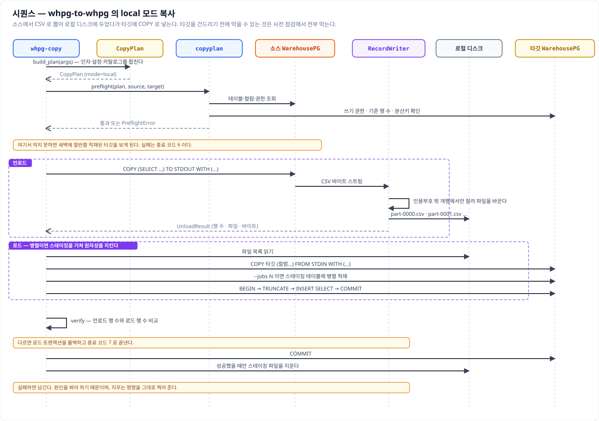
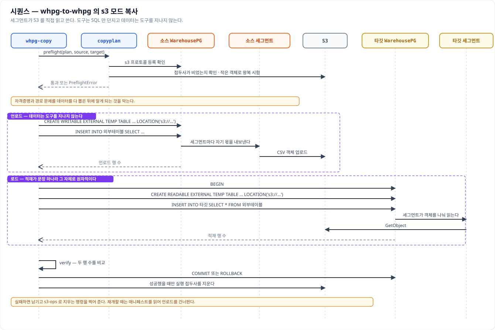

# 시퀀스 다이어그램

이 문서는 요청 하나가 들어와 끝날 때까지 누가 누구를 언제 부르는지를 그림으로 좇는다. 클래스
다이어그램이 "무엇이 있는가"를 보여 준다면 이쪽은 "어떤 순서로 도는가"를 보여 주므로, 장애를
추적하거나 새 기능을 붙일 자리를 찾을 때 먼저 열어 보면 좋다. 주요 기능 여섯 가지를 담았다.

그림은 `images/` 아래에 SVG 로 두고 문서에 그대로 넣는다. 같은 이름의 PNG 도 함께 만들어 두므로
발표 자료처럼 SVG 를 받지 않는 곳에서는 그것을 쓴다.

읽는 규칙은 이렇다. 세로선 하나가 참여자 하나의 수명선이고, 굵은 실선 화살표는 호출, 점선 화살표는
그에 대한 응답이다. 자기 자신에게 돌아오는 화살표는 그 안에서 벌어지는 일이며, 점선 상자는 반복
구간이나 단계를 묶어 둔 것이다. 노란 상자는 그 자리에서 반드시 알아야 할 주의사항이다.

---

## POST /jobs 접수

제출은 접수까지만 동기로 끝난다. 멱등 사전확인과 템플릿 렌더, 검증과 분할, admission 판단이 모두
핸들러 안에서 이루어지므로 잘못된 요청은 `422`, 용량이 없으면 `429` 로 그 자리에서 돌아온다. 여기를
통과해야 `Job` 이 만들어지고 `202` 와 함께 `job_id` 가 나간다.

`claim_and_add()` 가 멱등 키를 원자적으로 선점한다는 점이 중요하다. 사전확인만으로는 같은 키를 든
요청 두 개가 동시에 들어왔을 때 둘 다 통과할 수 있기 때문이다. 실제 실행은 응답을 보낸 뒤
백그라운드에서 시작하므로, 클라이언트는 반드시 폴링으로 종료 상태를 확인해야 한다.

## task 하나가 실행되는 과정

백그라운드로 넘어온 job 은 실행 슬롯을 기다렸다가 RUNNING 으로 올라가고, task 마다 executor 를
배정받아 병렬로 디스패치된다. executor 는 task 를 받으면 곧바로 `202` 를 돌려주고 실제 실행은 자기
안에서 진행하므로, coordinator 는 상태를 주기적으로 물어보며 따라간다.

데이터는 이 그림에서 coordinator 를 한 번도 지나지 않는다. executor 가 소스에서 배치 단위로 읽어
Greenplum 으로 COPY 하고, coordinator 로 올라오는 것은 상태와 적재 행 수뿐이다. 모든 task 가 끝나면
`finalize_job()` 이 취소 여부와 실패 정책을 보고 DONE·PARTIAL·FAILED 중 하나로 집계한다.

## s3_stage 의 2단계 적재

`s3_stage` 는 executor 가 CSV 를 만들어 S3 에 올리는 Phase 1 과, coordinator 가 그 프리픽스를
외부테이블로 걸어 target 에 넣는 Phase 2 로 갈린다. 사이에 barrier 가 있어 모든 업로드가 끝나야 다음
단계로 넘어간다.

Phase 2 에서 실제로 객체를 읽는 것은 coordinator 가 아니라 Greenplum 세그먼트다. 그래서 executor 를
세그먼트와 같은 호스트에 둘 필요가 없고, 대신 PXF SERVER 설정과 그 자격증명이 준비돼 있어야 한다.
Phase 2 가 실패하면 S3 객체는 남으므로 원인을 고쳐 다시 돌릴 수 있다.

## POST /query-execute 로 결과를 바로 받기

이관이 아니라 지금 이 쿼리가 무엇을 돌려주는지 보고 싶을 때 쓰는 경로다. 템플릿의 select 부분만
렌더해 실행하고 상위 몇 행을 동기로 돌려주므로 폴링이 없다.

소스 실행은 coordinator 가 직접 하지 않고 가장 한가한 executor 에 위임한다. 클라이언트는 executor
의 존재를 모르며, 실제로 어디서 돌았는지는 응답의 `executed_by` 로 알 수 있다. 결과가 `limit` 에서
잘리는 preview 이므로 이관에 쓰면 잘린 데이터가 적재된다.

## 취소와 재실행

취소는 실행 중인 무언가를 직접 죽이는 방식이 아니다. 저장소에 취소를 표시해 두면 디스패처의 폴링
루프와 슬롯 대기, executor 의 실행 루프가 각자 그것을 확인하고 멈춘다. 그래서 이미 끝난 job 을
취소하려 하면 할 일이 없어 `409` 가 된다.

재실행은 실패하거나 취소된 task 만 모아 새 job 을 만든다. 성공한 task 는 아예 담기지 않으므로 중복
적재를 걱정하지 않고 눌러도 되고, 응답에는 원래 job 을 가리키는 `retry_of` 가 함께 담긴다.

## 디스패치 재시도와 failover

executor 하나가 죽어도 job 전체가 실패하지 않는다. 연결에 실패하면 짧게 쉬었다가 같은 곳으로 몇 번
다시 걸어 보고, 그래도 안 되면 다음 후보로 넘긴다. 후보 순서는 헬스와 부하를 보고 정하므로 죽은
노드는 뒤로 밀린다.

여기서 예외가 `local_stage` 다. 이 모드는 executor 와 GP 세그먼트가 짝지어 있어 다른 곳으로 넘어가면
그 짝이 깨지므로, failover 가 돌고 있다는 것 자체가 배치나 호스트명 설정을 확인하라는 신호다.

---

# 부록 — 이웃 저장소 whpg-to-whpg

여기까지가 이 저장소의 흐름이고, 아래는 같은 계열의 이관 도구인
[DataDynamics/whpg-to-whpg](https://github.com/DataDynamics/whpg-to-whpg) 의 흐름이다. WarehousePG
테이블 하나를 다른 WarehousePG 로 복사하는 명령행 도구이며, 중간 파일을 어디에 두느냐로 모드가 둘로
갈린다. 명령행에서는 `--mode` 하나만 다르고 나머지 옵션과 출력, 검증, 종료 코드는 같다.

두 모드에 공통인 뼈대를 먼저 잡아 두면 그림이 쉽게 읽힌다. 계획을 세우고, 사전 점검을 하고,
언로드와 로드를 한 뒤, 검증하고 정리한다. 이 가운데 **사전 점검이 유난히 두껍다.** 타깃을 건드리기
전에 막을 수 있는 것은 전부 막는다는 원칙 때문이며, 새벽에 절반쯤 적재된 테이블을 보는 것보다
낫다는 판단이 깔려 있다.

## local 모드 — 로컬 디스크를 거쳐 복사

소스에서 `COPY … TO STDOUT` 으로 뽑아 로컬 디스크에 CSV 로 두었다가, 타깃에 `COPY … FROM STDIN`
으로 넣는다. 준비할 것이 없어 클러스터에 손대지 못하는 환경에서 바로 쓸 수 있다.

눈여겨볼 것은 원자성을 지키는 방식이다. 워커 하나로 넣을 때는 한 커넥션 한 트랜잭션이라 그대로
묶이지만, `--jobs N` 으로 병렬 적재하면 커넥션이 여럿이라 한 트랜잭션에 묶을 수 없다. 그래서
스테이징 테이블에 각자 커밋하며 넣은 뒤, 마지막에 한 문장으로 타깃에 옮긴다. 이 저장소의
`stage_insert` 가 staging 을 거쳐 target 으로 INSERT 하는 것과 같은 발상이다.

검증은 추가 조회 없이 끝난다. 언로드가 돌려준 행 수와 로드가 돌려준 행 수를 비교하고, 다르면 로드
트랜잭션을 롤백한다. 정리는 성공했을 때만 하며, 실패하면 스테이징을 남기고 지우는 명령을 그대로
찍어 준다.

## s3 모드 — 세그먼트가 S3 를 직접 읽고 쓴다

같은 복사를 외부테이블로 한다. 소스에 쓰기 외부테이블을 만들어 `INSERT` 하면 세그먼트마다 자기
몫을 S3 로 내보내고, 타깃에서는 읽기 외부테이블을 만들어 `INSERT INTO 타깃 SELECT` 로 당겨 온다.

**데이터가 도구를 지나지 않는다**는 점이 local 모드와의 결정적 차이다. 도구는 SQL 만 던지고 실제
바이트는 세그먼트와 S3 사이에서 오간다. 이 저장소의 `s3_stage` 가 executor 는 올리기만 하고 읽기는
Greenplum 세그먼트가 맡는 것과 같은 구조이며, 데이터가 클수록 유리한 이유도 같다.

적재가 문장 하나라서 원자성도 저절로 따라온다. `BEGIN` 안에서 외부테이블을 만들고 한 번의
`INSERT … SELECT` 로 넣으므로, 실패하면 그 문장이 통째로 되돌아간다. 대신 준비가 필요해서 양쪽에
`s3` 프로토콜이 등록돼 있어야 하고, 사전 점검이 작은 객체 하나를 실제로 쓰고 읽고 지워 본다.
자격증명과 경로 문제를 데이터를 다 뽑은 뒤에 알게 되는 일을 막기 위해서다.
