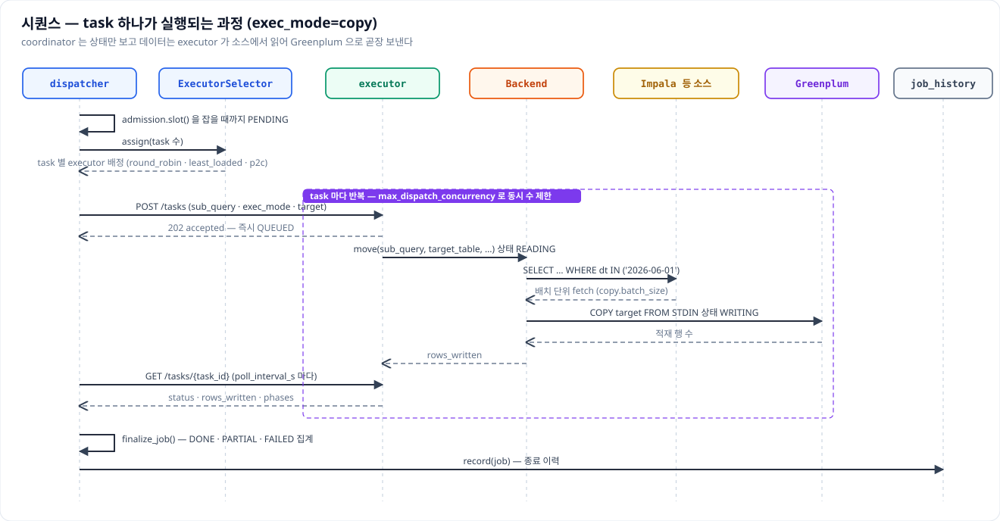
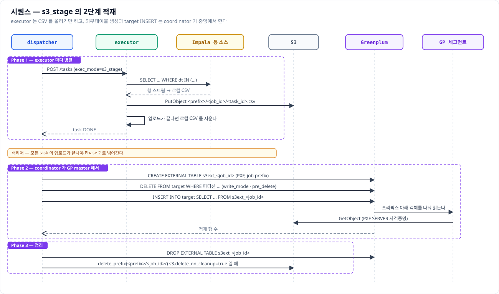
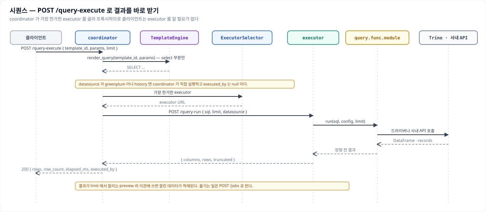
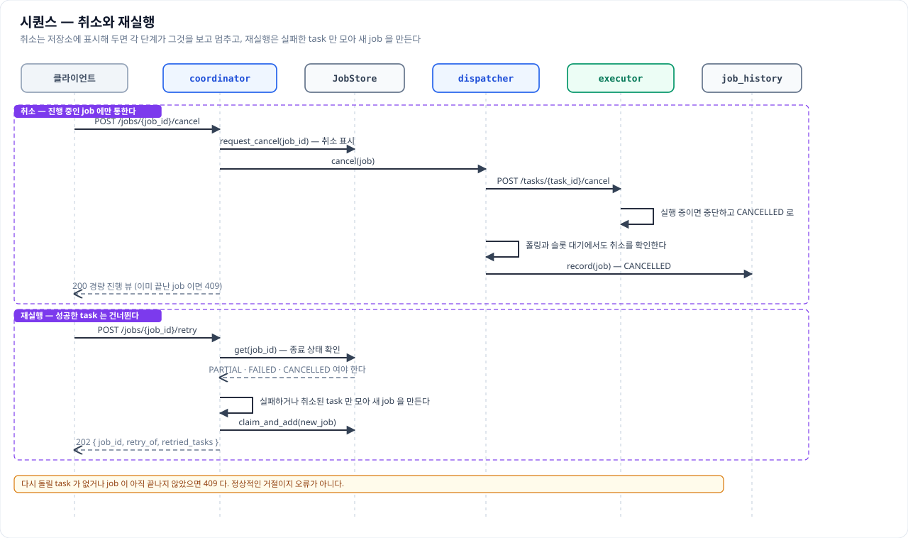
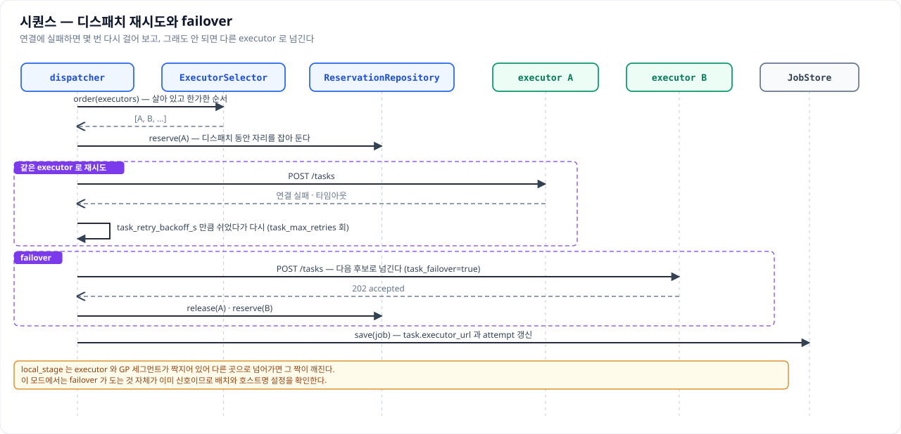

# 시퀀스 다이어그램

이 문서는 요청 하나가 들어와 끝날 때까지 누가 누구를 언제 부르는지를 그림으로 좇는다. 클래스
다이어그램이 "무엇이 있는가"를 보여 준다면 이쪽은 "어떤 순서로 도는가"를 보여 주므로, 장애를
추적하거나 새 기능을 붙일 자리를 찾을 때 먼저 열어 보면 좋다. 주요 기능 여섯 가지를 담았다.

그림은 `images/` 아래에 SVG 로 두고 문서에 그대로 넣는다. 같은 이름의 PNG 도 함께 만들어 두므로
발표 자료처럼 SVG 를 받지 않는 곳에서는 그것을 쓴다.

읽는 규칙은 이렇다. 세로선 하나가 참여자 하나의 수명선이고, 굵은 실선 화살표는 호출, 점선 화살표는
그에 대한 응답이다. 자기 자신에게 돌아오는 화살표는 그 안에서 벌어지는 일이며, 점선 상자는 반복
구간이나 단계를 묶어 둔 것이다. 노란 상자는 그 자리에서 반드시 알아야 할 주의사항이다.

---

## POST /jobs 접수

제출은 접수까지만 동기로 끝난다. 멱등 사전확인과 템플릿 렌더, 검증과 분할, admission 판단이 모두
핸들러 안에서 이루어지므로 잘못된 요청은 `422`, 용량이 없으면 `429` 로 그 자리에서 돌아온다. 여기를
통과해야 `Job` 이 만들어지고 `202` 와 함께 `job_id` 가 나간다.

`claim_and_add()` 가 멱등 키를 원자적으로 선점한다는 점이 중요하다. 사전확인만으로는 같은 키를 든
요청 두 개가 동시에 들어왔을 때 둘 다 통과할 수 있기 때문이다. 실제 실행은 응답을 보낸 뒤
백그라운드에서 시작하므로, 클라이언트는 반드시 폴링으로 종료 상태를 확인해야 한다.

## task 하나가 실행되는 과정

백그라운드로 넘어온 job 은 실행 슬롯을 기다렸다가 RUNNING 으로 올라가고, task 마다 executor 를
배정받아 병렬로 디스패치된다. executor 는 task 를 받으면 곧바로 `202` 를 돌려주고 실제 실행은 자기
안에서 진행하므로, coordinator 는 상태를 주기적으로 물어보며 따라간다.

데이터는 이 그림에서 coordinator 를 한 번도 지나지 않는다. executor 가 소스에서 배치 단위로 읽어
Greenplum 으로 COPY 하고, coordinator 로 올라오는 것은 상태와 적재 행 수뿐이다. 모든 task 가 끝나면
`finalize_job()` 이 취소 여부와 실패 정책을 보고 DONE·PARTIAL·FAILED 중 하나로 집계한다.

## s3_stage 의 2단계 적재

`s3_stage` 는 executor 가 CSV 를 만들어 S3 에 올리는 Phase 1 과, coordinator 가 그 프리픽스를
외부테이블로 걸어 target 에 넣는 Phase 2 로 갈린다. 사이에 배리어가 있어 모든 업로드가 끝나야 다음
단계로 넘어간다.

Phase 2 에서 실제로 객체를 읽는 것은 coordinator 가 아니라 Greenplum 세그먼트다. 그래서 executor 를
세그먼트와 같은 호스트에 둘 필요가 없고, 대신 PXF SERVER 설정과 그 자격증명이 준비돼 있어야 한다.
Phase 2 가 실패하면 S3 객체는 남으므로 원인을 고쳐 다시 돌릴 수 있다.

## POST /query-execute 로 결과를 바로 받기

이관이 아니라 지금 이 쿼리가 무엇을 돌려주는지 보고 싶을 때 쓰는 경로다. 템플릿의 select 부분만
렌더해 실행하고 상위 몇 행을 동기로 돌려주므로 폴링이 없다.

소스 실행은 coordinator 가 직접 하지 않고 가장 한가한 executor 에 위임한다. 클라이언트는 executor
의 존재를 모르며, 실제로 어디서 돌았는지는 응답의 `executed_by` 로 알 수 있다. 결과가 `limit` 에서
잘리는 preview 이므로 이관에 쓰면 잘린 데이터가 적재된다.

## 취소와 재실행

취소는 실행 중인 무언가를 직접 죽이는 방식이 아니다. 저장소에 취소를 표시해 두면 디스패처의 폴링
루프와 슬롯 대기, executor 의 실행 루프가 각자 그것을 확인하고 멈춘다. 그래서 이미 끝난 job 을
취소하려 하면 할 일이 없어 `409` 가 된다.

재실행은 실패하거나 취소된 task 만 모아 새 job 을 만든다. 성공한 task 는 아예 담기지 않으므로 중복
적재를 걱정하지 않고 눌러도 되고, 응답에는 원래 job 을 가리키는 `retry_of` 가 함께 담긴다.

## 디스패치 재시도와 failover

executor 하나가 죽어도 job 전체가 실패하지 않는다. 연결에 실패하면 짧게 쉬었다가 같은 곳으로 몇 번
다시 걸어 보고, 그래도 안 되면 다음 후보로 넘긴다. 후보 순서는 헬스와 부하를 보고 정하므로 죽은
노드는 뒤로 밀린다.

여기서 예외가 `local_stage` 다. 이 모드는 executor 와 GP 세그먼트가 짝지어 있어 다른 곳으로 넘어가면
그 짝이 깨지므로, failover 가 돌고 있다는 것 자체가 배치나 호스트명 설정을 확인하라는 신호다.
