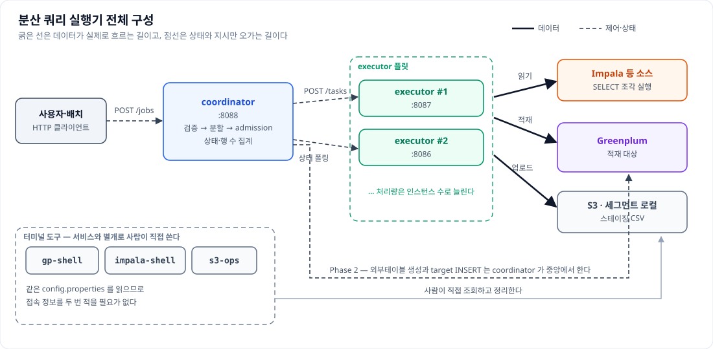
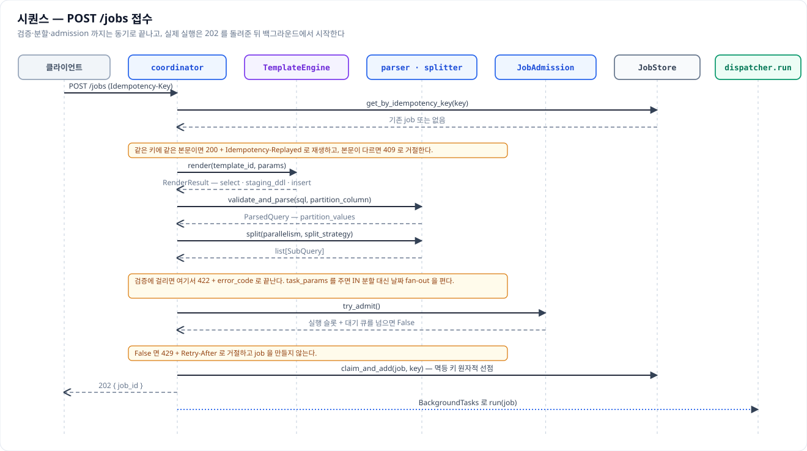
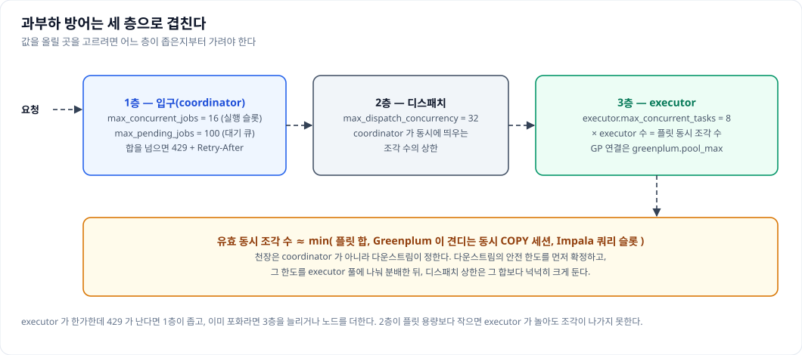
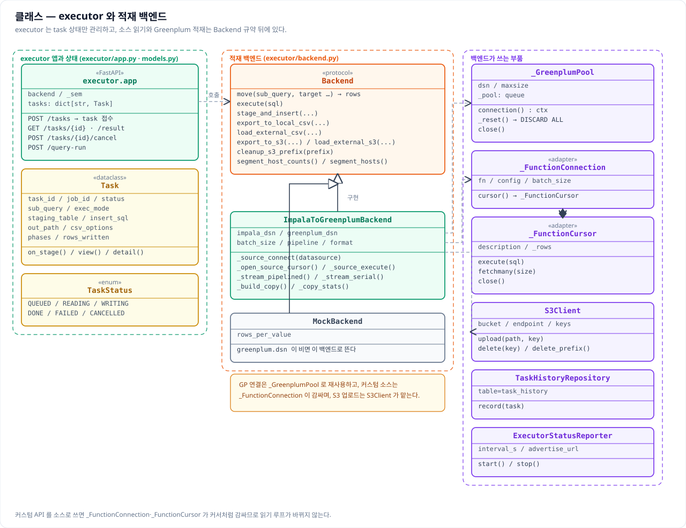
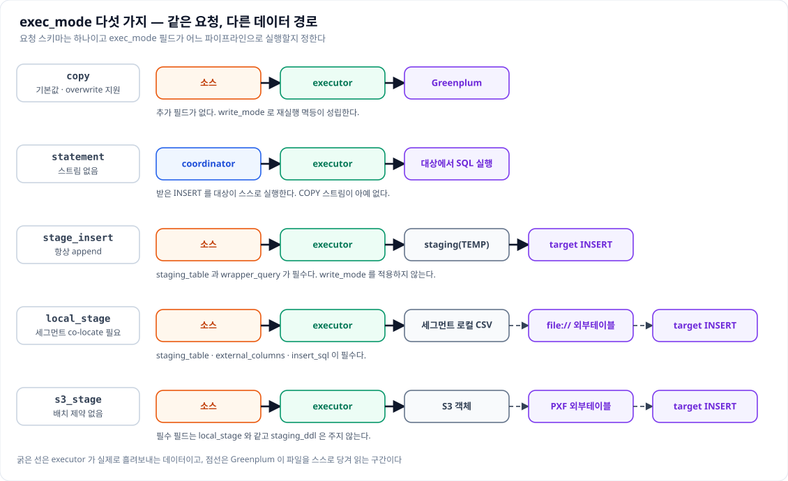
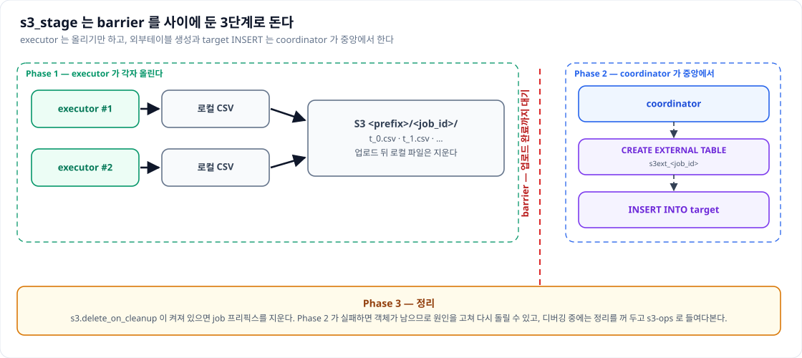
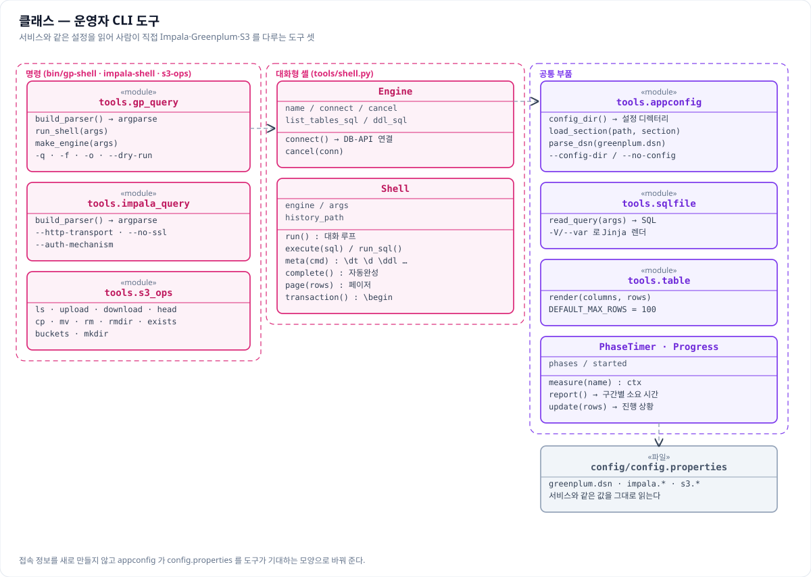
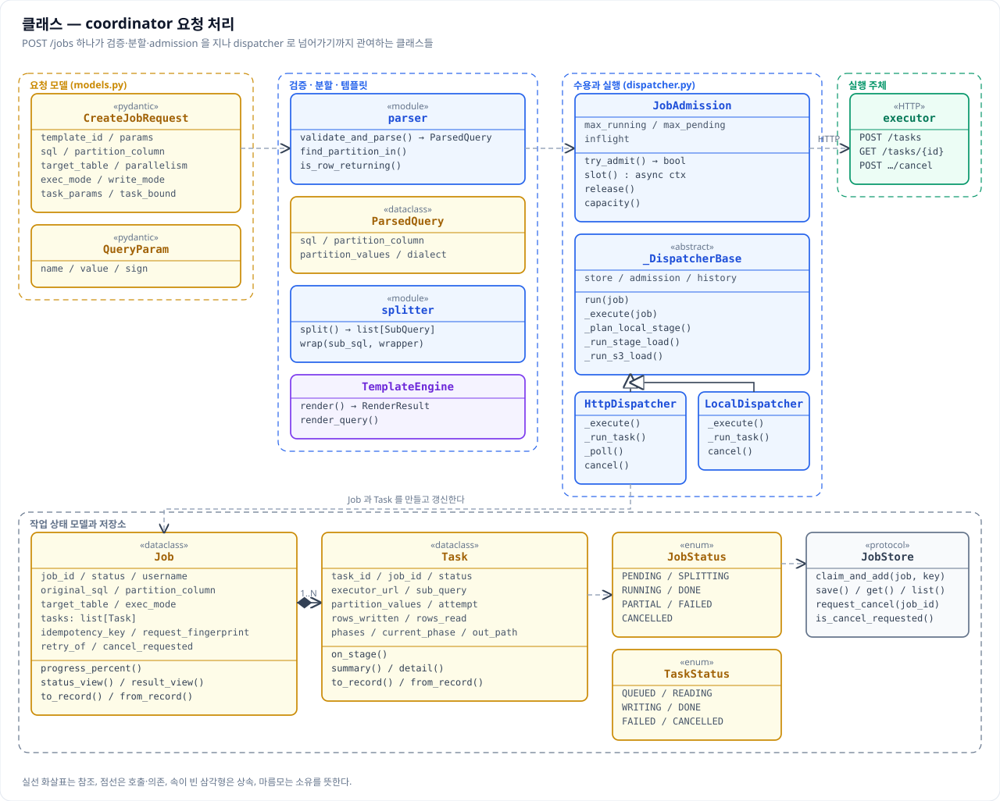
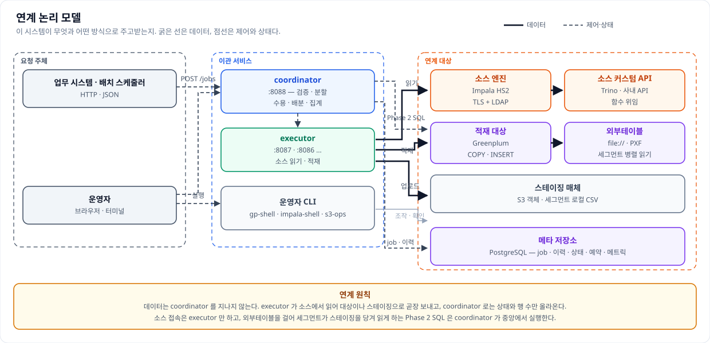

# SW 아키텍처 정의서

이 문서는 표준 SW 아키텍처 정의서 양식을 이 시스템에 맞게 고쳐 쓴 것이다. SW 를 어떤 구조로
나눴고 그 구조가 실제 코드에 어떻게 적용됐는지, 그리고 무엇과 어떻게 연계하는지를 다룬다.

인프라 쪽 이야기는 같은 디렉터리의 기술 아키텍처 정의서가 맡는다. 하드웨어와 네트워크, 소프트웨어
구성, 백업과 보안, 가용성이 그쪽에 있으므로 이 문서는 **SW 의 구조와 그 적용**에만 집중한다. 겹치는
사실을 바꿀 때는 두 문서를 함께 고친다.

그림은 `images/` 아래에 있는 것을 그대로 가져다 쓴다. 같은 사실을 두 번 그리지 않기 위해서이며,
필요한 그림이 없을 때만 새로 그린다.

---

## 목차 수정 내역

표준 양식은 포탈과 내부행정 시스템을 나누고 SW 기술 구조를 WEB 과 배치로 가르는 것을 전제한다. 이
시스템에는 그 구분이 없어 아래와 같이 바꿨다.

| 원 템플릿 | 이 문서 | 왜 바꿨는가 |
|---|---|---|
| II.1.1 포탈 시스템 관점 | II.1.1 이관 요청 업무 관점 | 대외 포탈이 없다. 업무 시스템과 배치 스케줄러가 API 로 작업을 맡기는 관계가 그 자리다 |
| II.1.2 내부행정 시스템 관점 | II.1.2 운영·관제 업무 관점 | 내부 행정 업무 대신 운영자가 상태를 보고 장애를 다루는 관계가 온다 |
| III.2 WEB SW 기술 구조 | III.2 API·제어 SW 기술 구조 | 화면을 그리는 WEB 계층이 없다. coordinator 가 요청을 받아 검증·분할·디스패치하는 제어 SW 다 |
| III.3 배치 SW 기술 구조 | III.3 실행·적재 SW 기술 구조 | 배치 프레임워크가 아니라 executor 가 소스를 읽어 대상에 적재하는 실행 SW 다 |
| (없음) | III.4 CLI·운영 도구 SW 기술 구조 | 서비스와 별개로 사람이 터미널에서 직접 쓰는 도구 셋이 있어 유형 하나로 추가했다 |
| IV.1 포탈 시스템 SW 아키텍처 | IV.1 이관 서비스 SW 아키텍처 | 적용 대상이 포탈이 아니라 coordinator 와 executor 로 이루어진 이관 서비스다 |
| IV.2 내부 시스템 SW 아키텍처 | IV.2 운영 도구 SW 아키텍처 | 같은 이유로 운영자 도구를 적용 대상으로 둔다 |
| IV.3 연계 아키텍처 | IV.3 연계 아키텍처 | 이름은 그대로 두되 연계 대상을 소스·적재 대상·메타 저장소·오브젝트 스토리지로 바꾼다 |

양식의 오탈자는 바로잡아 옮겼다. "상서 정의"는 상세 정의로, "해당 W 기술 구조"는 해당 SW 기술
구조로, "구성관례"는 구성 관점으로 적었다.

---


# I. 개요

## 1. 배경

Impala 에 쌓인 데이터를 Greenplum 으로 옮기는 일은 원래 사람이 한 건씩 처리했다. `SELECT` 를 짜서
결과를 파일로 받고 그것을 대상에 넣는 식이라, 옮길 양이 커지면 한 스트림이 몇 시간을 붙잡고 있었고
중간에 끊기면 어디까지 들어갔는지 알 수 없어 처음부터 다시 해야 했다. 여러 건을 동시에 돌리면
소스와 대상이 함께 흔들렸지만 그것을 막아 줄 장치도 없었다.

이 시스템은 그 일을 세 가지로 나눠 푼다. 첫째로 **쿼리 하나를 파티션 값 기준으로 N 등분해 병렬로**
읽어 한 스트림의 한계를 없앤다. 둘째로 **상태를 중앙에서 집계해** 지금 몇 개가 끝났고 무엇이
실패했는지를 언제든 볼 수 있게 하고, 실패한 조각만 골라 다시 돌릴 수 있게 한다. 셋째로
**admission 을 입구에 두어** 소스와 대상이 감당할 수 있는 만큼만 받아들인다.

여기에 운영 환경의 제약이 더해졌다. 외부 네트워크가 막힌 에어갭이고, 운영체제가 주는 파이썬을 그대로
써야 하며, 적재 대상이 MPP 라 데이터를 마스터 한 곳으로 밀어 넣으면 그 한 노드가 ceiling 이 된다. 이
제약들이 아키텍처의 모양을 상당 부분 결정했다.

## 2. 목표 시스템 구성도

### 2.1 목표 어플리케이션 구성도

coordinator 한 대가 요청을 받아 나누고, executor 여러 대가 실제로 데이터를 옮긴다. 데이터는
coordinator 를 지나지 않고 executor 가 소스에서 읽어 대상으로 곧장 보낸다.



### 2.2 목표 시스템 구성

| 구성요소 | 역할 | 수량 | 비고 |
|---|---|---|---|
| coordinator | 요청 접수, 검증과 분할, admission, 디스패치, 상태 집계 | 1대(가용성이 필요하면 N대) | 상태를 메모리에 두므로 단일 워커 |
| executor | 소스 읽기와 대상 적재, task 상태 관리 | N대 | 처리량은 이 수로 늘린다 |
| 메타 저장소 | 공유 job 저장소와 실행 이력, 상태·예약·메트릭 | 1식 | PostgreSQL. 단일 coordinator 면 선택 |
| 소스 | 이관할 데이터를 읽는 엔진 | 기존 시스템 | Impala 기본, Trino·사내 API 확장 |
| 적재 대상 | 옮긴 데이터가 들어가는 곳 | 기존 시스템 | Greenplum 계열 |
| 스테이징 매체 | 2단계 적재에서 CSV 를 두는 곳 | 선택 | S3 또는 세그먼트 로컬 디스크 |
| 운영자 CLI | 사람이 직접 소스·대상·S3 를 다루는 도구 | 서비스와 같은 트리 | 서비스와 설정을 공유 |

---

# II. SW 아키텍처 정의

## 1. 시스템간 업무적 연관 관계 관점

### 1.1 이관 요청 업무 관점

작업을 맡기는 쪽은 대개 사람이 아니라 업무 시스템이나 배치 스케줄러다. 하루치 매출을 옮기는 일이
정해진 시각에 돌아야 한다면 스케줄러가 `POST /jobs` 를 호출하고, 응답으로 받은 식별자로 상태를
물어보다가 끝나면 다음 단계로 넘어간다. 요청과 조회는 모두 coordinator 한 곳으로만 가고, 뒤에
executor 가 몇 대 있는지는 요청하는 쪽이 알 필요가 없다.

업무 시스템이 SQL 전문을 들고 있지 않아도 되도록 **템플릿 경로**를 둔다. 쿼리를 서버에 등록해 두면
요청은 템플릿 이름과 파라미터만 보내고, 테이블 구조나 적재 규칙이 바뀌어도 호출하는 코드는 그대로
둔다. 기간을 다루는 이관에서는 파라미터 두 개로 구간을 주면 하루를 task 하나로 펼쳐 준다.

업무 관점에서 반드시 지켜야 하는 약속이 둘 있다. **접수와 완료가 분리돼 있다는 것**이 하나다.
`202` 는 접수했다는 뜻일 뿐이므로 종료 상태를 확인해야 하고, 온전한 성공은 `DONE` 하나뿐이다. 다른
하나는 **재실행 안전성**이다. 타임아웃 뒤에 그냥 다시 보내면 같은 job 이 두 번 돌 수 있으므로 멱등
키를 실어 보내고, 적재가 두 번 되면 곤란한 업무는 파티션을 지우고 넣는 exec_mode 를 고른다.

### 1.2 운영·관제 업무 관점

운영자는 세 가지를 본다. 첫째로 **살아 있는지**를 본다. 클러스터 통합 상태를 한 번 조회하면
executor 가 다 붙어 있는지, job 이 쌓이고 있는지, 자원이 남아 있는지가 함께 나온다. 브라우저를 쓸 수
있으면 대시보드로, 터미널만 있으면 같은 API 를 읽는 모니터로 본다.

둘째로 **실패를 좇는다**. 사용자가 job_id 를 들고 오면 그 하나로 상태와 실패한 task 를 확인하고,
같은 식별자로 로그를 모은다. 모든 로그 줄에 job_id 와 task_id 가 붙고 실행한 SQL 이 함께 남으므로
소스에서 못 읽은 것인지 대상에 못 넣은 것인지가 갈린다. 필요하면 셸로 엔진에 직접 물어본다.

셋째로 **용량을 조절한다**. 요청이 거절되기 시작하면 어느 층이 좁은지 가려 입구를 넓히거나
executor 를 늘린다. 값들 사이의 정합은 설정 편집기가 곱셈을 풀어 보여 준다.

## 2. 시스템간 SW 기술 구조 관계 관점

### 2.1 SW 기술 유형 관점

이 시스템의 SW 는 세 유형으로 나뉜다. 유형을 나눈 기준은 언어나 프레임워크가 아니라 **무엇을
책임지는가**다.

| 유형 | 책임 | 적용 구성요소 | 대표 기술 |
|---|---|---|---|
| API·제어 | 요청을 받아 검증·분할하고 admission 으로 받을지 판단해 디스패치하며 상태를 집계한다 | coordinator | FastAPI · asyncio · sqlglot · Jinja2 |
| 실행·적재 | 소스에서 읽어 대상에 넣고 그 진행을 보고한다 | executor | impyla · psycopg · boto3 · 스레드 풀 |
| CLI·운영 도구 | 사람이 터미널에서 직접 조회하고 정리한다 | `bin/` 도구 셋 · 설정 TUI · 모니터 | argparse · curses · 표준 라이브러리 |

세 유형은 **설정과 로깅을 공유한다**. 같은 `config.properties` 를 읽고 같은 로거 규칙을 따르므로,
접속 정보를 한 곳만 고치면 서비스와 도구가 함께 따라온다.

### 2.2 솔루션 배치 관점

어느 솔루션이 어느 노드에 놓이는지는 그 노드가 무엇을 하느냐가 정한다. **소스 드라이버는 executor
에만** 둔다. coordinator 는 소스에 접속하지 않으므로 드라이버가 필요 없고, 그 덕에 coordinator
노드에는 SASL 빌드에 필요한 시스템 패키지도 들어가지 않는다.

| 노드 | 놓이는 것 | 이유 |
|---|---|---|
| coordinator | FastAPI · uvicorn · sqlglot · Jinja2 · httpx · psycopg | 요청 처리와 SQL 검증·렌더, 상태 저장 |
| executor | 위에 더해 impyla · thrift-sasl · pure-sasl · boto3 | 소스 읽기와 대상 적재, 스테이징 업로드 |
| 메타 저장소 노드 | PostgreSQL | 공유 상태와 이력 |
| 적재 대상 노드 | Greenplum · PXF(선택) | 외부테이블로 스테이징을 당겨 읽을 때만 PXF |
| 운영자 단말 | 없음 | 도구는 서비스 트리 안에서 실행한다 |

## 3. 시스템간 인프라 구성 관점

### 3.1 개발환경 관점

개발은 실제 DB 없이 한다. 소스와 대상이 없으면 백엔드가 아무것도 읽고 쓰지 않는 MockBackend 로 뜨고,
테스트는 그 MockBackend 와 FakeRunner 로 전 구간을 돈다. 그래서 노트북에서도
검증·분할·admission·상태 전이·대시보드·로깅까지 확인할 수 있다.

```bash
python3.9 -m venv .venv
.venv/bin/pip install -r requirements-dev.txt
.venv/bin/python -m pytest -q                      # 실제 DB 불필요
PYTHONPATH=src QUERY_EXECUTOR_CONFIG_DIR=config .venv/bin/python -m coordinator
COORDINATOR_EXECUTOR_MODE=local … -m coordinator   # executor 없이 한 프로세스로
```

두 가지가 개발을 특히 편하게 한다. **local 모드**는 executor 프로세스를 따로 띄우지 않고 coordinator
안에서 백엔드를 직접 실행하므로 설정이나 쿼리가 의도대로 도는지만 볼 때 좋고, **템플릿 자동
재적재**는 `.sql.j2` 를 고칠 때마다 서비스를 재기동하지 않게 해 준다.

### 3.2 운영환경 배포 관점

운영은 한 트리에 두 역할을 함께 두고 실행할 때 나눈다. 설치 스크립트가 서비스 계정과 가상환경,
런처를 만들고 설정과 템플릿, 커스텀 함수는 **아직 없을 때만** 넣는다. 운영자가 채운 값과 인증서를
재설치가 지우지 않게 하려는 것이며, 그 대가로 새 버전이 바꾼 기본값은 손으로 옮겨야 한다.

에어갭이 전제이므로 설치는 미리 받아 둔 휠 묶음으로 하고, Swagger UI 와 대시보드 폰트를 포함한 웹
에셋도 트리 안에 넣어 두어 런타임에 외부로 나가지 않는다. 기동은 런처 스크립트를 기본으로 하되
systemd 유닛도 함께 배포한다.

---

# III. SW 아키텍처 상세 정의

## 1. SW 기술 구조 유형 정의

### 1.1 아키텍처 영향 요소 정리

구조를 이렇게 만든 이유는 대부분 환경의 제약에서 나왔다. 아래 표의 왼쪽이 제약이고 오른쪽이 그것이
설계에 남긴 자국이다.

| 영향 요소 | 제약 | 설계에 준 영향 |
|---|---|---|
| 에어갭 | 런타임에 외부로 나갈 수 없다 | 웹 에셋과 API 문서를 트리에 내장, 설치는 오프라인 휠 |
| 운영체제 파이썬 | RHEL 9.2 기본 3.9 를 그대로 쓴다 | 3.10 이상을 요구하는 패키지 버전에 상한을 둔다 |
| 적재 대상이 MPP | 마스터로 밀어 넣으면 한 노드가 ceiling 이 된다 | 파일을 만들어 세그먼트가 당겨 읽는 2단계 경로를 둔다 |
| 대용량 스트리밍 | 결과 전체를 메모리에 올릴 수 없다 | 배치 단위 스트리밍과 읽기·쓰기 파이프라인 |
| 소스 다양성 | 커서를 주지 않는 사내 API 도 소스가 된다 | 커서처럼 감싸는 어댑터를 두어 읽기 루프를 고정 |
| 상태가 메모리 | 프로세스가 상태를 들고 있다 | 단일 워커로 실행하고 확장은 인스턴스 수로 |
| 운영자 편집 자산 | 설정·템플릿·커스텀은 사람이 고친다 | 재설치가 덮지 않고 최초 1회만 시딩 |
| 단일 리전 | 시각이 KST 하나뿐이다 | 타임존 없는 KST 시각으로 통일 |
| 감사 요구 | 무엇을 읽어 무엇을 넣었는지 남아야 한다 | 실행 SQL 을 레벨과 무관하게 항상 기록 |

### 1.2 SW 기술 구조 유형 정의

**API·제어 SW 기술 구조**는 요청을 받아 판단하는 쪽이다. 검증과 분할, admission, 디스패치, 상태
집계를 맡고 데이터에는 손대지 않는다. 판단이 빨라야 하므로 비동기로 돌고, 무거운 일은 모두 아래
유형에 넘긴다.

**실행·적재 SW 기술 구조**는 데이터를 실제로 옮기는 쪽이다. 소스에서 배치 단위로 읽어 대상에 넣고 그
진행을 보고한다. 블로킹 드라이버를 쓰므로 스레드로 넘겨 이벤트 루프를 막지 않으며, exec_mode 에 따라
여러 경로를 갖되 바깥에서 보는 계약은 하나로 맞춘다.

**CLI·운영 도구 SW 기술 구조**는 사람이 직접 쓰는 쪽이다. 서비스와 같은 설정을 읽되 수명이 명령
한 번이고, 터미널인지 아닌지에 따라 행동을 바꾼다. 크론에서 돌 때 멈추거나 깨지지 않는 것이 이
유형의 핵심 요구다.

## 2. API·제어 SW 기술 구조

### 2.1 API·제어 SW 기술 구조 정의

#### 2.1.1 모듈 구조 관점

모듈은 요청이 지나가는 순서대로 나뉜다. 라우팅과 멱등 처리, 날짜 fan-out 은 앱 계층이 맡고, SQL
검증은 파서가, 분할은 splitter 가, 서버 측 쿼리 생성은 템플릿 엔진이 맡는다. 그 뒤로 admission 과
디스패치가 dispatcher 에 모여 있고, 상태 저장과 이력, 헬스 모니터링, executor 선택은 각자 모듈로
떨어져 있다. 화면(대시보드·모니터)은 API 를 읽기만 하므로 제어 흐름에 끼어들지 않는다.

#### 2.1.2 런타임 구성 관점

한 프로세스가 단일 워커로 돈다. 상태를 프로세스 메모리에 들고 있어 워커를 늘리면 같은 job 을 두 곳이
서로 다르게 알게 되기 때문이다. 그래서 확장은 워커가 아니라 인스턴스 수로 한다.

요청 처리에는 **동기 구간과 비동기 구간의 경계**가 뚜렷하다. 검증과 분할, admission 판단까지는 요청
핸들러 안에서 끝내 잘못된 요청을 즉시 되돌려 주고, 실제 실행은 응답을 보낸 뒤 백그라운드로 넘어간다.
백그라운드에서는 실행 슬롯을 기다렸다가 task 를 병렬로 띄우고 상태를 폴링한다. 블로킹 DB 호출은
스레드로 넘기되 로그 문맥을 함께 들려 보내, 그 스레드가 남기는 줄에도 job_id 가 붙게 한다.

#### 2.1.3 배포 관점

배포 단위는 트리 하나이고 역할은 실행할 때 갈린다. 설정은 기동 시 읽어 메모리에 굳으므로 값을
바꾸면 재기동이 필요하고, 기동 배너에 실제로 읽은 설정 파일의 절대 경로가 찍혀 엉뚱한 디렉터리를
읽는 사고를 바로 잡아낸다. 대시보드는 설정으로 끌 수 있어 노출이 곤란한 환경에서도 서비스만 띄울
수 있다.

### 2.2 API·제어 SW 기술 구조 상세설계

#### 2.2.1 구조 개요

요청이 들어오면 멱등 키를 먼저 확인하고, 템플릿 요청이면 SQL 을 렌더한 뒤 파서로 검증하고 파티션 값
목록을 N 등분해 task 를 만든다. admission 을 통과하면 job 을 만들면서 멱등 키를 원자적으로 선점하고
`202` 를 돌려준다. 그 뒤 백그라운드가 실행 슬롯을 잡아 상태를 RUNNING 으로 올리고 task 를
디스패치하며, 모두 끝나면 종료 상태를 집계한다.



#### 2.2.2 구성 요소

| 구성 요소 | 역할 | 주요 인터페이스 |
|---|---|---|
| 앱 계층 | 라우팅, 멱등 사전확인과 재생, 날짜 fan-out, 응답 조립 | `POST /jobs` · `GET /jobs/{id}` · `POST /query-execute` |
| 파서 | SELECT 검증과 파티션 `IN` 절 탐색 | `validate_and_parse()` |
| splitter | 값 목록을 N 등분하고 원문 포맷을 보존해 치환 | `split()` · `wrap()` |
| 템플릿 엔진 | manifest 와 `.sql.j2` 를 렌더해 SQL 필드를 채움 | `render()` · `render_query()` |
| admission | 실행 슬롯과 대기 큐 관리, 초과 시 거절 | `try_admit()` · `slot()` |
| dispatcher | 수명주기와 디스패치, 폴링, 취소, 2단계 적재의 Phase 2 | `run()` · `_execute()` |
| 저장소 | job 상태 보관과 멱등 키 선점 | `claim_and_add()` · `save()` · `get()` |
| 이력·모니터 | 상태 전이 기록, executor 헬스와 메트릭 수집 | `record()` · `snapshot()` |

#### 2.2.3 구조 상세 설계

**admission 은 세 층으로 겹친다.** 입구에서 동시 실행 job 수와 대기 큐를 제한하고, 그 아래에서
coordinator 가 동시에 띄우는 task 수를, 다시 그 아래에서 executor 한 대가 동시에 실행하는 task 수를
제한한다. 세 층의 실효 상한은 언제나 다운스트림이 정한다.



**멱등은 두 층위로 나뉜다.** 요청 멱등은 같은 키에 같은 본문이면 기존 job 을 재생하고 본문이 다르면
거절하는 것이고, 데이터 멱등은 적재 전에 담당 파티션을 지우고 넣어 재실행해도 중복되지 않게 하는
것이다. 앞의 것은 저장소의 원자적 선점으로, 뒤의 것은 exec_mode 가 지원할 때만 성립한다.

**상태 전이는 한 방향이다.** 대기에서 분할, 실행을 거쳐 종료로 가며 종료 상태는 취소 우선으로
집계한다. 실패가 없으면 완료, 일부만 성공했고 정책이 허용하면 부분 성공, 그 밖은 실패다.

**날짜 fan-out 에는 계약이 하나 있다.** 구간의 두 끝을 파라미터로 받아 하루를 task 하나로 펼치는데,
템플릿이 부호 변수를 쓰지 않으면 각 task 가 의도보다 넓은 구간을 읽어 조용히 중복 적재된다. 그래서
렌더 전에 템플릿을 검사해 부호 변수를 쓰지 않으면 접수 단계에서 거절한다.

**2단계 적재의 Phase 2 는 중앙에서 한다.** executor 는 파일을 만들 뿐이고, 외부테이블을 만들어
대상에 넣고 정리하는 일은 coordinator 가 barrier 뒤에 한 번만 수행한다.

### 2.3 API·제어 SW 기술 구조 시스템 공통 모듈

#### 2.3.1 일반 공통 모듈 목록

| 모듈 | 하는 일 |
|---|---|
| 설정 로더·설정 | properties 값으로 YAML placeholder 를 채워 설정 객체 하나로 굳힌다 |
| 로깅 | 일 단위 롤링, job_id·task_id 자동 주입, 경고 전용 로그 분리 |
| 실행 SQL 로깅 | 데이터소스와 단계를 붙여 실행 SQL 을 한 줄로 남긴다 |
| HTTP 로깅 | 요청·응답을 DEBUG 에서만 남기는 순수 ASGI 미들웨어 |
| 마스킹 | DSN 비밀번호와 민감 헤더·본문을 가린다 |
| 단계 기록 | task 의 단계별 시작·종료·소요·행 수를 남긴다 |
| 시스템 메트릭 | CPU·메모리·디스크 사용량 수집 |
| 시각 유틸 | KST 기준 시각 생성과 표시 형식 통일 |
| 문자 폭 계산 | 한글 두 칸을 고려한 터미널 출력 폭 계산 |
| 웹 에셋 | 문서 UI 와 정적 자원을 트리 안에서 서빙 |
| 버전·배너 | 버전 단일 출처와 기동 배너, 설정 경로 출력 |

#### 2.3.2 솔루션 관련 공통 모듈

웹 프레임워크와 서버는 FastAPI 와 uvicorn 이며 문서 UI 까지 함께 쓴다. SQL 검증과 파티션 절 탐색은
sqlglot 이 맡고, 방언은 설정과 요청으로 고른다. 서버 측 쿼리 생성은 Jinja2 의 샌드박스 환경에서
하며, 렌더된 DDL 과 INSERT 가 단일 문장인지 검사해 다중 문 주입을 막는다. executor 호출은 httpx,
메타 저장소 접근은 psycopg, 자원 수집은 psutil 을 쓴다.

## 3. 실행·적재 SW 기술 구조

### 3.1 실행·적재 SW 기술 구조 정의

#### 3.1.1 모듈 구조 관점

앱 계층이 task 접수와 상태머신, 동시 실행 상한을 맡고, 그 아래 백엔드가 소스 읽기와 대상 적재를
맡는다. 백엔드는 인터페이스로 정의돼 있어 실제 구현과 테스트용 MockBackend 가 같은 자리에 들어간다.
그 밖에 오브젝트 스토리지 클라이언트, 자기 상태 보고, task 이력 기록이 각각 떨어져 있다.



#### 3.1.2 런타임 구성 관점

동시에 실행하는 task 수를 세마포어로 제한하고, 대상 연결은 풀로 재사용하되 반납할 때 세션을 초기화해
앞 task 가 만든 임시 객체가 다음 task 와 부딪히지 않게 한다. 블로킹 드라이버 호출은 모두 스레드로
넘기며, 읽기와 쓰기를 별도 스레드로 겹쳐 실행해 wall-clock time 을 줄인다. 종료 신호를 받으면 진행
중인 task 가 끝나기를 정해진 시간만큼 기다렸다 내려간다.

#### 3.1.3 배포 관점

한 호스트에 포트를 달리해 여러 인스턴스를 띄울 수 있고, 처리량은 이 수로 늘린다. coordinator 의
목록에 없으면 프로세스를 띄워도 일이 가지 않으므로 목록을 먼저 고치고 띄운다. 세그먼트 로컬 파일을
쓰는 exec_mode 는 executor 를 대상 세그먼트와 같은 호스트에 두어야 하고, 여러 coordinator 를 쓸 때는
자기 상태를 공유 저장소에 직접 보고하게 켠다.

### 3.2 실행·적재 SW 기술 구조 상세설계

#### 3.2.1 구조 개요

task 를 받으면 큐에 넣고 곧바로 접수를 응답한다. 실행이 시작되면 읽기 상태로 올라가 소스에서 배치
단위로 읽고, 쓰기 상태로 넘어가 대상에 넣는다. 끝나면 행 수와 단계별 소요 시간을 상태에 채워
coordinator 의 폴링에 답한다.

#### 3.2.2 구성 요소

| 구성 요소 | 역할 |
|---|---|
| 앱 계층 | task 접수와 상태머신, 동시 실행 상한, 상태·결과 응답 |
| 백엔드 인터페이스 | exec_mode 별 진입점을 하나의 계약으로 묶는다 |
| 실제 백엔드 | 소스 커서 열기, 스트리밍, 대상 적재와 스테이징 SQL 실행 |
| MockBackend | 대상 접속 정보가 없을 때 뜨는 테스트용 구현 |
| 연결 풀 | 대상 연결 재사용과 반납 시 세션 초기화 |
| 커서 어댑터 | 커서를 주지 않는 소스를 커서처럼 감싼다 |
| 스토리지 클라이언트 | 스테이징 객체 업로드와 삭제 |
| 상태 보고·이력 | 자기 자원 상태 보고와 task 이력 기록 |

#### 3.2.3 구조 상세 설계

**exec_mode 가 데이터 경로를 정한다.** 같은 요청 스키마에서 필드 하나로 경로가 갈리며, 곧장 넣을지
staging 을 거칠지 파일을 만들어 대상이 당겨 읽게 할지가 달라진다.



**스트리밍은 배치 단위로 하고 계측을 함께 남긴다.** 읽기와 쓰기를 겹쳐 실행하되 소요 시간을 네
갈래로 나눠 기록해, 느릴 때 어느 구간이 병목인지 추측하지 않고 가른다.

**소스 다양성은 어댑터로 흡수한다.** 읽기 루프가 소스에 요구하는 것은 컬럼 설명과 배치 읽기, 닫기
셋뿐이라 커서 없는 API 도 그 모양으로 감싸면 루프가 바뀌지 않는다. 다만 미리보기용 함수와 이관용
함수는 계약이 다르다. 앞은 상한을 두고 자르지만 뒤는 전량 반환이 계약이며, 이를 어기면 잘린 결과가
조용히 적재된다.

**2단계 적재에서 executor 는 절반만 한다.** 파일을 만들어 두는 데까지가 executor 의 몫이고, 그
파일을 대상이 읽게 만드는 일은 coordinator 가 barrier 뒤에 한다.



### 3.3 실행·적재 SW 기술 구조 시스템 공통 모듈

#### 3.3.1 일반 공통 모듈 목록

제어 쪽과 같은 설정·로깅·마스킹·시각·메트릭 모듈을 그대로 쓴다. 여기에 더해 단계 기록 모듈이 task 의
타임라인을 만들고, 스테이징 SQL 조립 모듈이 외부테이블 정의와 적재·정리 문장을 순수 함수로 만들어
준다. 순수 함수로 둔 이유는 실제 DB 없이 문자열만 비교해 테스트하기 위해서다.

#### 3.3.2 솔루션 관련 공통 모듈

소스 접속은 impyla 와 SASL 패키지, 대상 접속은 psycopg, 오브젝트 스토리지는 boto3 를 쓴다. 셋 다
필요한 exec_mode 에서만 불러오므로, 쓰지 않는 기능의 패키지가 없어도 나머지는 동작한다.

## 4. CLI·운영 도구 SW 기술 구조

### 4.1 CLI·운영 도구 SW 기술 구조 정의

#### 4.1.1 모듈 구조 관점

명령마다 진입 모듈이 하나씩 있고, 그 아래에 엔진과 셸, 설정 어댑터, SQL 파일 처리, 표 출력, 진행
표시가 공통 부품으로 깔린다. 대화형 셸은 엔진과 셸로 나뉘어 있어 엔진만 갈아 끼우면 다른 데이터
베이스에서도 같은 셸이 돈다.



#### 4.1.2 런타임 구성 관점

같은 모듈이 두 얼굴을 갖는다. 인자를 주면 한 번 실행하고 끝나며, 대화형 옵션을 주면 셸이 열린다.
터미널인지 아닌지도 행동을 바꾼다. 터미널이 아니면 프롬프트와 히스토리를 끄고, 삭제는 확인 없이는
거부하며, 진행 표시는 줄을 덮어쓰는 대신 새로 쓰고 간격을 크게 벌린다. 크론에서 로그가 진행
표시로 뒤덮이지 않게 하려는 것이다.

#### 4.1.3 배포 관점

서비스와 같은 트리에 놓이고 같은 설정을 읽는다. 래퍼가 자기 위치에서 트리 최상위를 찾아 경로를
잡으므로 어느 디렉터리에서 불러도 같은 코드와 같은 설정이 쓰인다. 파이썬은 배포 트리의 가상환경을
먼저 찾고, 환경변수로 직접 지정할 수도 있다.

### 4.2 CLI·운영 도구 SW 기술 구조 상세설계

#### 4.2.1 구조 개요

이관 결과를 대상에서 바로 확인하거나, 소스에서 표본을 뽑아 보거나, 스테이징으로 남은 객체를
정리하는 일을 사람이 직접 한다. 서비스가 하지 못하는 일이 아니라 사람이 즉시 확인해야 하는 일을
맡는 자리다.

#### 4.2.2 구성 요소

| 도구 | 하는 일 | 의존 |
|---|---|---|
| 대상 SQL 셸 | 대상에 붙어 조회·DDL·DML 실행 | psycopg |
| 소스 SQL 셸 | 소스에 붙어 조회 | impyla · SASL |
| 오브젝트 도구 | 목록·업로드·다운로드·복사·이동·삭제·내용 확인 | boto3 |
| 설정 편집기 | 설정 항목을 스키마에서 읽어 편집하고 정합을 검사 | 표준 라이브러리 |
| 상태 모니터 | 같은 API 를 폴링해 터미널에 상태를 그린다 | 표준 라이브러리 |

#### 4.2.3 구조 상세 설계

**설정을 새로 만들지 않는다.** 도구는 서비스의 설정을 읽어 자기가 기대하는 모양으로 바꿔 쓴다.
접속 정보가 한 줄로 들어 있는 항목은 어댑터가 풀어 준다. 같은 값을 두 곳에 적어 한쪽만 고쳐서
어긋나는 사고를 막기 위해서다.

**비밀은 인자로 받지 않는다.** 프로세스 목록으로 다른 사용자에게 보이기 때문이며, 설정과 환경변수,
대화형 입력 순으로만 찾는다.

**종료 코드로 원인을 가른다.** 성공, 대상 없음이나 취소, 인자 오류, 패키지 없음, 접속 실패, 실행
실패나 권한 없음을 구분해 크론에서 재시도할 가치가 있는지 자동으로 판단할 수 있게 한다.

**보고와 데이터를 분리한다.** 구간별 소요 시간과 진행 상황은 표준 오류로, 조회 결과는 표준 출력으로
내보내 파이프로 넘겨도 섞이지 않는다.

### 4.3 CLI·운영 도구 SW 기술 구조 시스템 공통 모듈

#### 4.3.1 일반 공통 모듈 목록

설정 어댑터와 SQL 파일 처리, 표 출력, 진행 표시와 구간 측정, 문자 폭 계산을 공통으로 쓴다. 특히
문자 폭 계산은 한글이 두 칸을 차지하는 탓에 글자 수로 자르면 화면을 넘겨 터미널 화면을 통째로
깨뜨리므로, 화면에 쓰기 전에 반드시 거치게 되어 있다.

#### 4.3.2 솔루션 관련 공통 모듈

드라이버는 서비스와 같은 것을 쓴다. 대상은 psycopg, 소스는 impyla, 오브젝트 스토리지는 boto3 이며
모두 실행 계열의 의존성에 이미 들어 있어 도구를 위해 따로 설치할 것이 없다.

---

# IV. SW 아키텍처의 적용

## 1. 이관 서비스 SW 아키텍처

### 1.1 Application 관점

#### 1.1.1 API·제어 SW 기술 구조 관점

정의한 구조가 coordinator 에 그대로 적용돼 있다. 요청 핸들러는 판단만 하고 실행을 넘기며, 검증과
분할은 순수 함수로 떨어져 있어 실제 DB 없이 테스트된다. 수명주기는 기반 클래스가 모두 쥐고 하위
클래스는 실행 한 가지만 구현하는데, 그래서 원격 실행과 in-process 실행이 같은 상태 전이와 같은 집계
규칙을 따른다.



확장이 필요한 자리도 구조 안에 있다. 쿼리는 템플릿으로 바깥에 두고, 템플릿에서 쓸 함수는 등록
방식으로 더하며, 저장소는 인터페이스 하나에 구현이 셋이라 단일 노드와 다중 노드가 코드 변경 없이
갈린다.

#### 1.1.2 실행·적재 SW 기술 구조 관점

executor 는 상태머신과 동시 실행 상한만 직접 들고, 나머지는 백엔드 인터페이스 뒤에 있다. 그래서 대상
접속 정보가 없으면 MockBackend 로 떠서 전 구간 테스트가 가능하고, 소스가 커서를 주지 않아도 어댑터가
그 자리를 메운다. exec_mode 가 늘어나도 앱 계층은 진입점 하나를 더 부를 뿐이다.

### 1.2 배포 관점

#### 1.2.1 API·제어 SW 기술 구조 관점

coordinator 는 트리 하나에 단일 워커로 뜬다. 중지는 coordinator 부터, 기동은 executor 부터 한다.
받아 줄 곳이 없는 상태에서 요청을 받지 않기 위해서다. 설정은 기동 시 굳으므로 값을 바꾸면
재기동하고, 기동 로그의 배너로 어떤 설정 파일을 읽었는지 확인한다.

여러 대를 띄우려면 상태를 공유 저장소로 외부화하고 각자 heartbeat 를 남기게 켠다. 이때 admission
한도가 인스턴스마다 따로 적용된다는 점을 감안해 총량을 나눠 잡는다.

#### 1.2.2 실행·적재 SW 기술 구조 관점

executor 는 늘리고 줄이는 순서가 정해져 있다. 늘릴 때는 목록에 URL 을 먼저 넣고 인스턴스를 띄운 뒤
coordinator 를 재기동해 목록을 다시 읽게 한다. 줄일 때는 역순으로, 목록에서 빼고 재기동해 새 일이
가지 않게 한 뒤 돌던 task 가 끝나기를 기다렸다 내린다.

늘린 뒤에는 함께 움직여야 하는 값이 있다. 디스패치 상한이 늘어난 fleet 용량보다 작지 않은지, 대상이
허용하는 세션 수를 넘지 않는지 확인한다. 세그먼트 로컬 파일을 쓰는 exec_mode 라면 새 노드도 세그먼트
호스트 위에 있어야 하고 호스트명 설정이 정확히 맞아야 한다.

### 1.3 구현 관점

#### 1.3.1 API·제어 SW 기술 구조 구현 관점

소스는 `src/coordinator/` 아래에 있고 모듈 이름이 곧 역할이다. 앱과 모델, 파서와 splitter, 템플릿,
dispatcher, 저장소, 이력, 모니터, 선택과 예약, 대시보드와 모니터가 각각 파일 하나씩이다. 확장
지점은 셋이다. 템플릿 디렉터리에 시나리오를 더하는 것, 템플릿 함수 모듈을 설정으로 추가하는 것,
저장소 구현을 설정으로 바꾸는 것이다.

테스트는 실제 DB 없이 돈다. MockBackend 와 FakeRunner 로 검증·분할·admission·상태 전이·
대시보드·로깅까지 덮으며, 터미널 화면은 화면 밖에 쓰면 실패하는 가짜 curses 로 여러 화면 크기에서
훑는다.

#### 1.3.2 실행·적재 SW 기술 구조 구현 관점

소스는 `src/executor/` 아래에 있다. 앱과 모델, 백엔드, 스토리지 클라이언트, 상태 보고, 이력이
파일 하나씩이며 백엔드가 가장 크다. 확장 지점은 소스 쪽에 있다. 커서 없는 소스를 쓰려면 함수 하나를
설정으로 지정하고, 그 함수가 돌려주는 형태는 여러 가지를 받아 준다.

주의할 구현 규칙이 하나 있다. 미리보기 함수와 이관 함수는 이름이 비슷해도 계약이 다르다. 상한을 두고
자르는 쪽과 전량을 돌려주는 쪽을 섞으면 잘린 결과가 조용히 적재되므로, 판정은 한 곳에서만 하고
설정이 없으면 폴백 없이 명확히 실패시킨다.

## 2. 운영 도구 SW 아키텍처

### 2.1 Application 관점

#### 2.1.1 CLI·운영 도구 SW 기술 구조 관점

도구 셋은 정의한 구조를 그대로 따른다. 명령마다 진입 모듈이 있고 공통 부품을 공유하며, 대화형
셸은 엔진과 셸로 나뉘어 소스와 대상이 같은 셸을 쓴다. 설정은 서비스 것을 읽어 어댑터가 모양만
바꿔 주므로 접속 정보가 한 곳에만 있다.

터미널 화면을 그리는 두 도구, 곧 설정 편집기와 상태 모니터도 같은 계열이다. 순수 로직을 화면
그리기와 떼어 두어 테스트할 수 있게 했고, 에어갭을 고려해 표준 라이브러리만 쓴다.

#### 2.1.2 배치 실행 관점

크론에서 도는 것을 전제로 만들었다. 작업 디렉터리가 무엇이든 같은 설정을 읽고, 출력 인코딩과
버퍼링을 미리 잡아 두어 한글 출력에서 죽거나 로그가 뒤늦게 몰려 나오지 않는다. 터미널이 아니면
프롬프트를 띄우지 않으므로 멈추는 일도 없다.

실패 판별은 종료 코드로 한다. 환경이나 접속 문제는 재시도해도 소용이 없고, 실행 실패나 권한 문제는
사람이 봐야 하며, 대상이 없어 끝난 경우는 대개 정상이다. 이 구분이 있어 크론 래퍼가 스스로
판단할 수 있다.

```bash
#!/bin/bash
set -euo pipefail
export IMPALA_PASSWORD="$(cat /etc/etl/impala.pw)"
D=/data1/distributed-query-executor
PYTHONPATH=$D/src $D/.venv/bin/python -m tools.impala_query -f daily_orders.sql \
    -V "dt=$(date -d yesterday +%Y-%m-%d)" -o /data/orders.csv.gz --gzip
$D/bin/s3-ops upload /data/orders.csv.gz s3://dw-stage/orders/ 
```

## 3. 연계 아키텍처

### 3.1 연계 아키텍처 정의

이 시스템은 스스로 데이터를 만들지 않는다. 다른 시스템에서 읽어 다른 시스템에 넣는 것이 존재
이유이므로, 연계는 부가 기능이 아니라 본체다. 연계의 성격은 셋으로 나뉜다. 데이터를 읽고 쓰는
**데이터 연계**, 상태와 이력을 남기는 **상태 연계**, 그리고 작업을 맡기고 결과를 받는 **제어
연계**다.

### 3.2 연계 아키텍처 구성

#### 3.2.1 연계 아키텍처 개요

연계 대상과 방향을 한 장으로 정리하면 이렇다. 데이터는 coordinator 를 지나지 않고, 소스 접속은
executor 만 하며, 외부테이블을 거는 SQL 은 coordinator 가 중앙에서 실행한다.



#### 3.2.2 연계 범위

| 연계 대상 | 주고받는 것 | 방향 | 접속 주체 |
|---|---|---|---|
| 소스 엔진 | 분할된 SELECT 와 그 결과 행 | 읽기 | executor |
| 소스 커스텀 API | 같은 SELECT 를 함수 호출로 위임하고 결과를 받음 | 읽기 | executor |
| 적재 대상 | COPY 스트림, staging·target INSERT, 외부테이블 DDL | 쓰기 | executor · coordinator |
| 스테이징 매체 | CSV 객체와 파일, 적재 후 정리 | 쓰기·삭제 | executor · coordinator |
| 메타 저장소 | job 상태, 실행 이력, executor 상태, 예약, 메트릭 | 읽기·쓰기 | coordinator · executor |
| 요청 주체 | job 제출과 상태·결과 조회 | 수신 | coordinator |

#### 3.2.3 연계 논리 모델 다이어그램

위 개요의 그림이 논리 모델을 겸한다. 블록은 시스템이 아니라 **역할**이라는 점을 기억하면 읽기
쉽다. 소스가 Impala 든 사내 API 든 읽기 역할은 하나이고, 적재 대상과 외부테이블은 같은 데이터베이스
안의 다른 접근 방식이다.

### 3.3 연계 기술구조

#### 3.3.1 연계 유형(패턴)

| 유형 | 어디에 쓰나 | 특징 |
|---|---|---|
| 드라이버 직접 접속 | 소스 읽기, 대상 적재, 메타 저장소 | 커넥션을 열어 SQL 을 실행한다. 가장 단순하고 계측이 쉽다 |
| 함수 위임 | 커서를 주지 않는 사내 API | 설정으로 지정한 함수를 부르고 결과를 커서처럼 감싼다 |
| HTTP 호출 | coordinator 와 executor 사이 | task 지시와 상태 조회. 실패하면 재시도 후 다른 노드로 넘긴다 |
| 외부테이블 당겨 읽기 | 2단계 적재의 Phase 2 | 파일을 만들어 두고 대상 세그먼트가 병렬로 읽는다 |
| 오브젝트 스토리지 경유 | 세그먼트와 같은 호스트에 둘 수 없을 때 | 위치에 무관해 배치 제약이 없다 |

#### 3.3.2 개발환경

연계 대상이 없어도 개발과 테스트가 된다. 대상 접속 정보가 비면 아무것도 읽고 쓰지 않는
MockBackend 가 뜨고, 스테이징 SQL 조립은 순수 함수라 문자열만 비교하면 되며, HTTP 연계는
FakeRunner 로 대신한다. 실제 연계를 처음 붙일 때는 작은 job 하나를 끝까지 돌려 보는 것이 가장 확실한
확인이다.

#### 3.3.3 연계 공통 기능

연계마다 반복되는 것을 공통으로 뺐다. **접속 설정**은 한 파일에서 읽어 서비스와 도구가 함께 쓰고,
**인증**은 소스 쪽에만 걸리며 인증서 경로까지 설정에 있다. **실행 SQL 기록**은 어느 데이터소스에
어떤 문장을 던졌는지를 항상 남겨 사고 추적의 1차 근거가 된다. **오류 처리와 재시도**는 연계 성격에
따라 다르게 정해 두었다. HTTP 는 재시도 뒤 다른 노드로 넘기고, DB 는 실패를 그대로 올려 job 상태로
집계하며, 스토리지 업로드는 권한 문제로 큰 파일만 실패하는 경우를 흡수한다.
