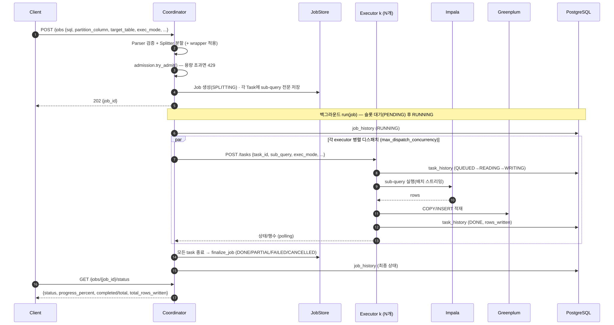

# Distributed Query Executor — 설계 문서

> Coordinator + N Executor 구조로 하나의 **Impala `SELECT` 쿼리**를 파티션 컬럼의 `IN` 조건
> 기준으로 N분할해 병렬로 읽고, 그 결과를 **Greenplum 테이블에 적재**하는 데이터 이관 API.

이 문서는 시스템의 설계 근거와 내부 동작을 담는다. 입문·사용법은 [README.md](../README.md)와 실행 모드별 [GUIDE.md](GUIDE.md), 성능·HA 튜닝은 [PERFORMANCE.md](PERFORMANCE.md), 외부 애플리케이션 연동(C# 등 호출 예시·JSON)은 [INTEGRATION.md](INTEGRATION.md)를 참고한다.

---

## 1. 개요

Impala의 큰 `SELECT` 한 건을 여러 executor에게 나눠 병렬로 읽히고, 각 executor가 자신이 읽은 데이터를 직접 Greenplum에 적재하는 **Impala → Greenplum 이관기**다. 나누는 기준은 쿼리의 `WHERE <partition_column> IN (v1, v2, ...)` 에 나열된 IN 값 리스트이며, 이 값을 N등분해 각 executor에게 서로 다른 묶음을 맡긴다(예: 날짜 100일치를 4묶음 25일씩).

핵심 설정·동작 요약:

- **분할 기준**: `IN` 값 리스트를 `parallelism`개로 N등분.
- **소스 방언**: 기본 **Impala**(`sqlglot`의 `hive` 방언), 요청 `sql_dialect`로 재정의(`impala`/`postgres` 등).
- **타깃**: **Greenplum**(PostgreSQL 기반) → psycopg `COPY` 또는 INSERT.
- **검증 범위**: 기본 단순 `SELECT`(strict). `strict_validation=false`면 JOIN·서브쿼리·GROUP BY 등 복합 쿼리도 허용(파티션 `IN` 절을 트리 어디서든 탐색).
- **적재 방식**(`exec_mode`): `copy`(기본) / `statement` / `stage_insert` / `local_stage`(§17).
- **응답 모델**: Job 기반 **비동기** API — job_id 발급 후 polling.
- **동시성**: 입구 admission control(동시 job 슬롯 + 대기 큐) + 디스패치/executor 단 task 상한으로 다층 제어.
- **운영 형태**: 단일 또는 **멀티 coordinator**(공유 PostgreSQL) + executor N대. 별도 executor 없는 **local 모드**도 지원.

### 핵심 특징

이 시스템을 흔한 파이프라인과 구별 짓는 성질은 네 가지다.

1. **결과 병합 불필요**: 각 executor가 서로 겹치지 않는 파티션 값 집합을 담당해 Greenplum에 독립 적재하므로 merge가 없다. Job의 "결과"는 적재된 row count 집계와 상태다.
2. **양방향 상태 추적**: coordinator는 Job 상태를, executor는 Task 상태를 각자 알고, 두 계층 모두 PostgreSQL 이력에 기록한다.
3. **쿼리문 보관**: coordinator는 원본 SQL과 각 executor에게 보낸 **sub-query 전문**을 Job에 저장한다(감사·디버깅·대시보드).
4. **데이터는 coordinator를 거치지 않는다**: executor가 Impala→Greenplum로 직접 흘려보내고, coordinator로는 상태와 row count만 흐른다. 지휘자로 데이터가 몰려 병목이 되는 것을 피한다.

---

## 2. 전체 아키텍처

**coordinator**는 요청을 받아 전체를 지휘하는 한 대의 서비스, **executor**는 실제로 읽고 적재하는 N대의 일꾼 서비스다.



클라이언트가 쿼리를 보내면(①) API가 Parser로 검사하고 Splitter로 나눈 뒤 Admission으로 수용 여부를 판단하고, Dispatcher가 각 executor에 일을 보낸다(②). executor는 Impala에서 읽어(③) 곧바로 Greenplum에 적재하며(④), 클라이언트는 접수증으로 진행 상황을 조회한다(⑤). PostgreSQL은 이력과 상태를 적어 두는 공통 장부다.

**설계상의 중요한 결정.** ①Executor는 read+write를 모두 하는 **상태 보유 독립 서비스**로, 자기 task 상태를 인메모리로 들고 REST(`/tasks`)와 자체 대시보드로 노출한다. ②결과 데이터는 coordinator를 거치지 않고 상태·row count만 흐른다. ③분할한 sub-query 전문을 Task 레코드에 저장한다. ④상태·이력은 PostgreSQL로 외부화할 수 있고, 설정하지 않으면 인메모리로만 동작(프로세스 종료 시 소실)한다.

---

## 3. 컴포넌트

### 3.1 Coordinator

| 컴포넌트 | 책임 |
|---|---|
| **API Layer** | 작업 제출/조회/취소, 클러스터 상태, 대시보드(`src/coordinator/app.py`) |
| **Parser** | sqlglot 파싱, partition column의 `IN(...)` 노드 탐색, strict/lenient 검증(`parser.py`) |
| **Splitter** | IN 값 리스트를 `parallelism`개로 분할 → sub-query 재작성(원문 포맷 보존, `splitter.py`) |
| **JobAdmission** | 동시 실행 슬롯 + 대기 큐 상한(과부하 시 429). `dispatcher.py` |
| **Dispatcher** | sub-query를 executor에 분배, task 동시성(Semaphore) 제어, 상태 polling, 종료 집계(`dispatcher.py`) |
| **JobStore** | Job·Task 상태 + sub-query 전문 저장. `memory`(휘발)/`file`(단일 노드 파일 영속·크래시 복구)/`postgres`(공유, JSONB) — `job_store.py` |
| **JobHistory** | job 단위 실행 이력 PostgreSQL 기록·조회(`history.py`) |
| **HealthMonitor** | executor `/health`·`/metrics` 주기 폴링, 메트릭 PostgreSQL 기록(`monitor.py`) |
| **Dashboard** | 인라인 HTML 모니터링 UI(`/`) + 설정 마스킹(`dashboard.py`) |

### 3.2 Executor (N개, 각각 독립 프로세스/서비스)

| 컴포넌트 | 책임 |
|---|---|
| **Task API** | `POST /tasks`(수신·실행 시작), `GET /tasks`·`/tasks/{id}`(상태), `/cancel`, `/metrics`(`app.py`) |
| **Backend** | `ImpalaToGreenplumBackend`(impyla read → psycopg COPY/INSERT) + `MockBackend`. copy 모드는 COPY 전 **컬럼 사전검증(preflight)** 으로 불일치 조기 실패(`backend.py`) |
| **Task Store** | task 상태(QUEUED→READING→WRITING→DONE/FAILED/CANCELLED) + 누적 `rows_written`(인메모리 dict) |
| **TaskHistory** | task 단위 상태 전이 이력 PostgreSQL 기록·조회(`history.py`) |
| **StatusReporter** | 자기 상태(CPU/메모리/동시 task)를 공유 DB에 self-report(`status.py`) |
| **동시 task 상한** | `executor.max_concurrent_tasks` 세마포어(admission control) |
| **Graceful drain** | SIGTERM 시 신규 task 거부(503) + 진행 중 task를 `shutdown_drain_timeout_s` 내 완료 대기(`app.py` lifespan) |
| **Dashboard** | remote 모드에서 `/`에 노출되는 self-view 대시보드(`dashboard.py`) |

실전용 `ImpalaToGreenplumBackend` 외에 실제 DB 없이 테스트하는 `MockBackend`가 있고, 동시 task 수는 세마포어로 제한한다. graceful drain은 종료 시 새 일은 거절하되 진행 중인 일은 정해진 시간 안에서 마무리한다.

---

## 4. 데이터 흐름 (Impala → Executor → Greenplum)



executor는 sub-query 결과를 **스트리밍(배치 fetch)** 해 전체를 메모리에 올리지 않으므로 데이터가 아무리 커도 안전하다. 적재는 `COPY`로 배치 단위 수행하며(INSERT 다건보다 훨씬 빠르다), `exec_mode`에 따라 INSERT/staging 경유도 가능하다(§9). 각 executor가 서로 다른 파티션 값 집합을 담당하므로 Greenplum 쓰기 충돌이 없고 병합도 불필요하다.

---

## 5. 데이터 모델

핵심은 작업 전체를 나타내는 **Job**과 그 아래 매달리는 하나하나의 일감 **Task** 두 구조다. 특히 **원본 쿼리와 각 executor로 보낸 sub-query 전문을 모두 저장**해 감사·디버깅에 쓴다.


진행률은 `completed / total`로 계산하되 **완료에는 성공·실패·취소가 모두 포함**된다("끝난 일감이 전체 중 얼마인가"이지 성공률이 아니다). `progress_percent`·`completed`·`total`은 Job에서 파생된다.

---

## 6. 상태 머신 (양방향 추적)

coordinator는 Job 상태를, executor는 Task 상태를 관리한다.

### 6.1 Coordinator — Job 상태



검증·분할은 `POST /jobs` 핸들러에서 **동기로** 끝나므로 문제가 있으면 즉시 4xx로 거절되고, 통과하면 작업이 `SPLITTING`으로 생성돼 백그라운드 `run()`이 이어받는다. `run()`은 admission 실행 슬롯이 빌 때까지 job을 `PENDING`으로 두었다가 슬롯을 잡으면 `RUNNING`으로 전이한다(입구에서 용량 초과면 애초에 `429`로 거부돼 job이 생성되지 않는다 — §10). 최종 상태는 `finalize_job()`이 하위 task를 집계해 결정한다: **취소 우선 → 실패 없음=DONE → best_effort=PARTIAL → 그 외=FAILED**.

관련 복구·멱등 동작은 다음과 같다.

- **재기동 정합(크래시 복구)**: 영속 저장소(`file`/`postgres`)면 기동 시 `reconcile_interrupted_jobs()`가 비종료(PENDING/SPLITTING/RUNNING)로 남은 job을 `FAILED`로 정합한다(실행 루프가 사라졌으므로). 진행 중이던 task도 FAILED로 표시돼 `retry` 대상이 된다.
- **실패 파티션 재실행**: 종료된 job에 `POST /jobs/{id}/retry` → FAILED/CANCELLED task만 담은 새 job(`retry_of`=원본)이 SPLITTING부터 동일 흐름으로 실행된다.
- **요청 멱등(`Idempotency-Key` 헤더)**: 키를 주면 중복 제출을 흡수한다. 같은 키의 job이 이미 있으면 재검증·분할 없이 기존 job을 재생(200 + `Idempotency-Replayed: true`), 같은 키를 다른 본문으로 쓰면 409. 저장소가 키를 **원자적으로 선점**(`claim_and_add`)해 동시 제출에도 job은 하나만 생긴다 (InMemory=프로세스 락, Sql=조회 + PostgreSQL 부분 UNIQUE 인덱스 backstop, WarehousePG는 분산키 제약으로 best-effort). 요청 본문 sha256 지문으로 키 오용을 감지한다.
- **데이터 멱등(`write_mode: overwrite_partitions`)**: 적재 전 대상 테이블에서 해당 파티션 값을 먼저 DELETE 후 넣으므로(`stage.py`/`backend.py`) 같은 파티션 재실행이 중복 적재되지 않는다. `append`는 설계상 누적이라 멱등이 아니다.

### 6.2 Task 상태 (Coordinator 미러 ↔ Executor 원본)

Task의 "진짜" 상태는 executor가 들고, coordinator는 폴링으로 따라 적는 미러를 갖는다.



**Executor**는 위 상태와 누적 `rows_written`을 인메모리에 기록해 `GET /tasks/{id}`로 노출하고, 상태 전이마다 `task_history`에 append한다. **Coordinator**의 Dispatcher는 폴링으로 각 Task 상태/row count를 미러링하고, Job 상태는 Task 집계로 결정한다. `started_at`/`finished_at`은 executor가 READING 진입·종료 시점에 기록한다(대시보드 소요 시간 표시).

---

## 7. 요청 처리 시퀀스



클라이언트가 `POST /jobs`를 보내면 coordinator는 그 자리에서 검증·분할하고(필요시 wrapper 적용) admission으로 수용 여부를 판단한다(초과면 429). 통과하면 Job을 `SPLITTING`으로 만들어 각 Task에 sub-query 전문을 저장하고 즉시 `202 {job_id}`를 돌려준다. 이후 백그라운드 `run(job)`이 슬롯을 기다렸다 RUNNING으로 넘어가 여러 executor에 task를 병렬 디스패치하며(`max_dispatch_concurrency`로 제한), 모든 task가 끝나면 `finalize_job`이 최종 상태를 정한다.

> **모니터링은 별개 루프**: coordinator는 `monitor.health_interval_s`마다 각 executor `/health`·`/metrics`를
> 폴링하고(`GET /executors`), `monitor.record_interval_s`마다 `executor_health_metrics`에 기록한다.
> executor self-report 모드면 coordinator 폴링 대신 executor가 직접 기록한다(§12).

---

## 8. 쿼리 분할 (Splitting)

이 시스템의 심장은 `IN (...)` 안의 값들을 여러 묶음으로 나누고 각 묶음만 남긴 sub-query를 새로 만들어 executor에게 주는 것이다.

예를 들어 `dt`가 파티션 컬럼일 때:

```sql
SELECT user_id, amount, dt
FROM sales
WHERE dt IN ('2026-01-01','2026-01-02', ... ,'2026-06-25')   -- partition_column = dt
  AND region = 'KR'
```

절차는 다음 다섯 단계다.

1. **파싱**: `sqlglot.parse_one(sql, read=<dialect>)` → AST.
2. **IN 절 탐색**: `partition_column`의 `IN` 노드를 찾는다. 테이블 한정자(`A.dt`)·대소문자는 무시.
3. **검증**: 강도는 `strict_validation`으로 갈린다.
   - `true`(기본): `GROUP BY`/집계/`DISTINCT`/`JOIN`/`NOT IN`/서브쿼리 IN/IN 누락을 안정적 에러 코드로 거부.
   - `false`(lenient): 복합 쿼리 허용, 트리 어디에 있든 파티션 `IN`을 찾아 그 절만 분할.
4. **값 분할**: IN 값 `[v1..vM]`를 `parallelism`개 청크로 분할(`contiguous` 기본 / skew 심하면 `round_robin`). `contiguous`는 앞에서부터 연속으로, `round_robin`은 한 개씩 번갈아 나눈다.
5. **sub-query 재작성**: 각 청크로 **IN 값 목록 구간만** 문자열 치환해 N개의 완전한 SQL 생성(원문 포맷 보존, 단순 치환이 어려우면 AST 재생성으로 폴백).



> **lenient 결과 보존 가정**: 분할 기준 컬럼이 출력 행을 실제로 나누는 위치(주로 소스 스캔 필터)에
> 있어야 한다. 분할 기준 위에서 집계/DISTINCT 하면 나눠 처리한 결과가 한꺼번에 처리한 결과와 달라질 수 있다.

---

## 9. 적재 방식 (`exec_mode`)

같은 "적재"라도 소스/타깃이 같은 엔진인지에 따라 알맞은 방법이 다르다.

| `exec_mode` | 동작 | 적합한 경우 |
|---|---|---|
| `copy` (기본) | Impala sub-query를 **읽어** Greenplum에 `COPY FROM STDIN` 배치 적재. COPY 전 **사전검증(preflight)**: SELECT 컬럼이 대상 테이블에 있는지 확인(`copy.preflight`, 기본 on) | 소스/타깃이 다른 엔진. COPY는 대상 컬럼과 정확히 일치해야 하고 wrapper는 **행을 반환하는 SELECT** 여야 함 |
| `statement` | wrapper로 감싼 SQL(예: `INSERT ... SELECT`)을 대상 DB에서 **그대로 실행** | 소스/타깃이 같은 DB(Greenplum). INSERT 컬럼 목록이 매핑 담당 |
| `stage_insert` | (선택적으로 `staging_ddl`로 staging 생성 →) Impala SELECT 결과를 Greenplum **staging에 COPY** → staging을 `FROM`으로 하는 **INSERT 실행** | SELECT은 Impala, INSERT은 Greenplum처럼 서로 다른 엔진을 INSERT로 연결 |
| `local_stage` | 각 executor가 세그먼트 호스트 **로컬 디스크에 CSV**로 export → GP가 `file://` 외부테이블로 **세그먼트별 로컬 파일을 병렬 read**해 staging 적재 → target INSERT. 2-phase. 자세히는 **§17** | executor를 **GP 세그먼트 호스트에 co-locate**한 대량 이관. `copy`의 단일 COPY 소켓 병목을 세그먼트 병렬 read로 대체 |
| `s3_stage` | (Phase 1) 각 executor가 Impala 결과를 **로컬 CSV**로 export → **S3에 업로드**(로컬 삭제) → (배리어) → (Phase 2) **coordinator가** GP master에 job 프리픽스로 **PXF 외부테이블 하나**를 만들어 세그먼트 병렬 read → target INSERT → S3 정리. `local_stage`와 같은 2-phase(외부테이블·INSERT는 coordinator 중앙). 자세히는 **§17.1** | executor를 GP 세그먼트에 **co-locate할 수 없는**(오브젝트 스토어를 쓰는) 대량 이관. S3는 위치 무관하게 읽혀 `local_stage`의 co-locate/파일예산 배분이 불필요 |

`stage_insert`에서 `staging_ddl`은 **선택**이다. 주면 COPY 전에 그 DDL(보통 `CREATE TEMP TABLE`)로 테이블을 만들고, 생략하면 생성을 건너뛰고 이미 존재하는 `staging_table`을 쓴다(이 경우 영구 테이블을 여러 task가 공유하지 않도록 격리에 유의).

**write_mode** (적재 공통):

| 모드 | 동작 |
|---|---|
| `append` | 단순 COPY로 누적 |
| `overwrite_partitions` | task별 담당 `partition_values`에 대해 같은 트랜잭션에서 먼저 `DELETE WHERE <partition_column> IN (chunk)` 후 COPY → **재실행 멱등성** 확보 |

보충 사항:

- **트랜잭션은 task 단위**. 실패 시 해당 task만 rollback되고 다른 task는 무영향. 각 task는 disjoint한 파티션 집합만 다루므로 executor 간 쓰기 충돌이 없다.
- **wrapper_query**: 분할된 각 sub-query를 감싸는 쿼리. `wrapper_placeholder`(기본 `{{SUBQUERY}}`) 자리에 sub-query가 치환된다. `stage_insert`에서는 placeholder 대신 staging 테이블명을 참조하는 INSERT를 둔다.
- **Impala 쿼리 옵션(SET)**: 전역 `impala.query_options` + 요청별 `impala_query_options`(전역 위에 병합)를 impyla `configuration`으로 전달한다. copy·stage_insert의 Impala SELECT에만 적용되며, 둘 다 비면 `configuration` 없이 실행한다.

결과 데이터가 coordinator를 거치지 않으므로 결과 병합 단계는 없다. coordinator는 `rows_written`만 합산한다.

---

## 10. 동시성 모델 (admission control)

한계를 넘는 요청이 몰릴 때 모두가 함께 무너지지 않도록, admission control을 세 층위로 두어 입구부터 안쪽까지 단계적으로 과부하를 거른다.



- **Level 1 — Job admission(`JobAdmission`)**: `max_concurrent_jobs`개 실행 슬롯 + `max_pending_jobs`개 대기 큐. 슬롯이 비면 즉시 RUNNING, 차면 PENDING으로 줄을 세우고, **실행+대기 합(capacity)을 넘는 요청은 `429 Too Many Requests`(`Retry-After`)로 거부**한다. `max_concurrent_jobs<=0`이면 무제한. 이 한도는 **coordinator 인스턴스별(인메모리)** 이라 멀티 coordinator에선 합산된다.
- **Level 2 — Task 디스패치 동시성**: `max_dispatch_concurrency` 세마포어로 한 coordinator가 동시에 띄우는 executor task 수를 제한(모든 job 통틀어).
- **Level 3 — Executor admission**: `executor.max_concurrent_tasks` 세마포어로 executor 한 대가 동시 실행하는 task 수를 제한(여러 coordinator의 합산 부하 방어).

I/O 방식: **Coordinator**는 `httpx.AsyncClient` + `asyncio.gather`로 executor를 비동기 호출한다. **Executor 내부**의 impyla/psycopg는 동기 라이브러리라, 그대로 부르면 이벤트 루프가 멈추므로 `run_in_executor(thread_pool, ...)`로 감싸 별도 스레드에서 돌린다.

> **적정값 산정**: 실제 천장은 coordinator 코어가 아니라 **Greenplum 동시 COPY 허용량·Impala 동시
> 쿼리 슬롯·executor 풀 합**이다. 다운스트림 용량에 맞춰 `executor.max_concurrent_tasks`를 분배하고
> `max_dispatch_concurrency`는 그 이상으로 두어 coordinator가 병목이 되지 않게 한다(→ [PERFORMANCE.md](PERFORMANCE.md)).

---

## 11. API 명세

보통은 coordinator API만 쓰고, executor API는 일꾼 내부 조회·디버깅용이다.

### 11.1 Coordinator API

```http
POST /jobs
{
  "sql": "SELECT user_id, amount, dt FROM sales WHERE dt IN (...) AND region='KR'",
  "partition_column": "dt",
  "target_table": "public.sales_mirror",
  "write_mode": "overwrite_partitions",   // | "append"
  "exec_mode": "copy",                     // | "statement" | "stage_insert"
  "parallelism": 4,
  "split_strategy": "contiguous",          // | "round_robin"
  "failure_policy": "fail_fast",           // | "best_effort"
  "strict_validation": true,               // false면 복합 쿼리 허용
  "sql_dialect": "hive",                   // 선택(기본 서버 설정)
  "wrapper_query": null,                   // 선택(분할 sub-query 감싸기)
  "username": null,                        // 선택(이력/대시보드 표시)
  "impala_query_options": null,            // 선택. Impala SET 옵션, 전역 위에 병합. 예: {"MEM_LIMIT":"2g"}
  "dry_run": false                         // true면 executor 미호출, 생성 쿼리만 반환
}
→ 202 { "job_id": "a1b2c3" }
→ 429 { "detail": "동시 실행/대기 job 한도 초과(capacity=...)" }   // admission 초과
→ 4xx { ... }                                                      // 검증 실패(에러 코드)
```

`dry_run=true`면 executor를 호출하지 않고 어떤 쿼리들이 만들어질지만 미리 확인한다.

| 엔드포인트 | 설명 |
|---|---|
| `POST /jobs` | 작업 제출 → `{job_id}`. `dry_run=true`면 쿼리 미리보기(200, 미저장) |
| `GET /jobs` | 작업 목록(상태 필터/limit). 대시보드 "처리중인 Query" |
| `GET /jobs/{id}/status` | **진행 상태/진행률**(경량, 태스크 제외) |
| `GET /jobs/{id}` | 전체 상태(태스크 목록 포함) |
| `GET /jobs/{id}/result` | 적재 결과 요약(`total_rows_written`, per-task) |
| `GET /jobs/{id}/tasks/{task_id}` | 태스크 상세(**sub-query 전문 포함**, 감사/디버깅) |
| `POST /jobs/{id}/cancel` | 작업 취소(각 executor에 전파). 이미 종료면 409 |
| `POST /jobs/{id}/retry` | **실패 파티션만 재실행**: 종료된 job의 FAILED/CANCELLED task만 새 job으로 복제·디스패치(`retry_of` 추적) → 새 `job_id`(202). 대상 없으면 409 |
| `GET /history` | 과거 실행 이력(`job_history`, job_id별 최신 1건, 페이징) |
| `GET /executors` | executor 헬스/메트릭 상태 |
| `GET /cluster` | coordinator+executor health/metrics + 실행 중 job 수 한 번에 |
| `GET /health`·`/healthz`·`/metrics` | 헬스 체크/시스템 메트릭 |
| `GET /`·`/config`·`/info` | 대시보드 HTML / 설정(마스킹) / 요약(`dashboard.enabled`로 토글) |

이 밖에 템플릿 실행(`/templates`, `POST /query-execute`)은 §18을 참고한다.

### 11.2 Executor API

```http
POST /tasks
{ "task_id":"t1", "job_id":"a1b2c3",
  "sub_query":"SELECT ... WHERE dt IN (...)",
  "target_table":"public.sales_mirror", "write_mode":"overwrite_partitions",
  "partition_column":"dt", "partition_values":["'2026-01-01'", ...],
  "exec_mode":"copy", "username":null,
  "staging_table":null, "staging_ddl":null, "insert_sql":null }
→ 202 { "task_id":"t1", "status":"QUEUED" }
```

| 엔드포인트 | 설명 |
|---|---|
| `POST /tasks` | sub-query 수신·비동기 실행 시작 |
| `GET /tasks` | 이 executor 보유 task 목록(상태 필터). self-view 대시보드 |
| `GET /tasks/{id}` | task 상태(`status`, `rows_written`, `error`, `started_at`/`finished_at` 등) |
| `GET /tasks/{id}/result` | 적재 행수 |
| `POST /tasks/{id}/cancel` | task 취소(협조적) |
| `GET /health`·`/healthz`·`/metrics` | 헬스/메트릭(+ 동시 처리 현황) |
| `GET /`·`/history`·`/config`·`/info` | self-view 대시보드 / task 이력 / 설정 / 요약 |

또한 결과 반환 실행용 `POST /query-run`(커스텀 함수 위임)이 있다(§18.7).

---

## 12. 멀티 coordinator & 상태 외부화

coordinator를 여러 대로 늘리면 고가용성과 처리량이 오른다. 열쇠는 공유 PostgreSQL(`history.db_dsn`)로 상태를 외부화하는 두 설정이다.

| 설정 | 효과 |
|---|---|
| `store.backend=postgres` | **공유 Job 저장소**(`jobs` 테이블, JSONB). 어느 coordinator로 조회/취소가 가도 동작 |
| `executor.self_report=true` | **executor가 자기 상태를 직접 기록**(`executor_status`). coordinator는 읽기만 → 중복 폴링/기록 제거 |

이로부터 따라오는 동작:

- **상태 조회/결과/취소**가 공유 `jobs` 테이블 기반이라 아무 coordinator로 라우팅돼도 응답한다. 디스패처는 실행 중 스냅샷을 주기적으로 store에 저장한다.
- **cross-coordinator 취소**: 다른 coordinator 소유 작업도 `cancel_requested` 플래그를 공유 store에 세우면 소유 coordinator가 polling 중 감지해 중단한다.
- **executor liveness**: self-report 모드면 executor가 `status_interval_s`마다 `executor_status`에 upsert(heartbeat)하고, coordinator는 `updated_at` 신선도로 liveness를 판정한다.
- **이력 2계층**: 하나의 `job_id` 아래 N개 task가 생기므로 `job_history`(coordinator, job 단위) + `task_history`(각 executor, task 단위, `executor_id`로 식별)로 나눠 기록한다. 제출 시 `username`을 넘기면 두 테이블 모두 기록된다.

### HA 헬스 기반 선택 & 정합

coordinator가 여러 대면 어느 executor에게 일을 줄지를 각자 정하는데, 조율하지 않으면 같은 곳에 몰릴 수 있다. 이를 중앙 관리자(SPOF) 없이, **여러 coordinator가 독립적으로 공유된(약간 오래된) 부하 현황을 보고** 각자 판단하게 해서 푼다.

| 설정 | 효과 |
|---|---|
| `coordinator.executor_health_source=auto` | HA(self_report)면 **공유 `executor_status`(URL 키)** 를 부하 뷰로, 단일이면 monitor 폴링. executor는 `executor.advertise_url`로 자기 URL을 함께 self-report |
| `coordinator.executor_select=p2c` | **Power-of-Two-Choices**: 살아있는 후보 무작위 2개 중 덜 바쁜 쪽 — 랜덤화로 결정을 탈상관시켜 **분산 스탬피드** 억제(무상태·무락) |
| `coordinator.executor_reservation=true` | **TTL 보호 공유 예약**: dispatch 중 task를 `executor_reservation`에 예약 → 다른 coordinator가 `active_tasks + 예약`을 실시간 부하로 봄. 죽은 coordinator의 예약은 `reservation_ttl_s`로 만료 |
| `coordinator.orphan_reconcile_interval_s` | **죽은 coordinator 정합**: 각 coordinator가 `coordinator_status`에 heartbeat하고, 소유자가 stale(`coordinator_stale_s`)인 비종료 job을 주기적으로 `FAILED`로 정합 → `retry`로 재개 |

**왜 P2C인가**: 모든 coordinator가 단순히 "가장 한가한 노드"를 고르면, heartbeat 갱신 간격 동안 모두가 같은 노드를 한가하다고 보고 우르르 몰린다(분산 herding). P2C는 무작위 두 후보 중 덜 바쁜 쪽을 골라 쏠림을 흩뜨리며, 무상태·무락이라 HA에 적합하다.

**예약 누수 방지**: 예약은 `(executor_url, coordinator_id)`별로 기록되고 TTL로 만료되므로 coordinator가 죽어도 영구 누수되지 않는다. 결국 executor의 실제 self-report `active_tasks`가 진실이라 예약은 짧은 bias일 뿐이다.

> 단일 coordinator면 기본값(`store.backend=memory`, `executor.self_report=false`,
> `executor_select=round_robin`)을 그대로 두면 된다. HA 튜닝 상세는 [PERFORMANCE.md](PERFORMANCE.md).

---

## 13. Local 모드

`coordinator.executor_mode=local`(또는 환경변수 `COORDINATOR_EXECUTOR_MODE=local`)로 두면, executor 프로세스 없이 **coordinator 안에서 백엔드를 직접 호출**한다(`LocalDispatcher`). HTTP 디스패치 없이도 실제 적재 동작까지 한 프로세스에서 검증할 수 있고, `greenplum.dsn`이 없으면 `MockBackend`로 폴백된다. 모드를 바꿔도 admission·상태·이력 흐름은 remote와 동일하다.

| `executor_mode` | 동작 |
|---|---|
| `remote` (기본) | executor 서비스에 HTTP(`POST /tasks`)로 디스패치 |
| `local` | coordinator 프로세스 안에서 백엔드를 직접 호출 |

---

## 14. 모니터링 & 대시보드

가시성은 메트릭·대시보드·로깅 세 가지로 제공한다.

- **시스템 메트릭**: 두 서비스 모두 `/metrics`(CPU/메모리/디스크 + 동시 처리)를 낸다. coordinator `HealthMonitor`가 executor를 폴링해 `/executors`·`/cluster`로 제공하고, `monitor.db_dsn` 설정 시 `executor_health_metrics`에 기록한다.
- **coordinator 대시보드(`/`)**: 인라인 HTML(빌드 불필요), 3초 폴링. 탭 — 처리중인 Query / 실행 이력 / Executor / 환경설정 / 그외 정보.
- **executor self-view 대시보드(`/`)**: remote 모드의 각 executor가 자기 task/메트릭/이력을 노출한다. local 모드에선 executor 프로세스가 없으므로 coordinator 화면만 보인다.
- **로깅**: `/data1/distributed-query-executor/logs`에 일 단위 롤링. 모든 로그에 `[job_id][task_id]` 컨텍스트를 자동 주입하고, **WARNING 이상은 `*-warn.log`로 분리**(로거 이름 포함 강화 포맷)해 운영 중 문제만 빠르게 추적한다.

**기동 배너 로그.** coordinator·executor는 뜰 때 Spring Boot 식 ASCII 배너(버전·역할·포트)와 함께 **실제 로딩한 설정 파일(`config.properties`·`config.yml`)의 절대 경로**를 콘솔에 찍는다(못 찾으면 그 줄 뒤에 `← 파일 없음(로딩 실패)!` 마커). 이 stdout은 런처(`bin/env.sh`)가 `logs/<name>.out`으로 리다이렉트하는 한편, **같은 배너 전체를 애플리케이션 로그(`.log`)에도 한 레코드로** 남긴다 (`banner.log_startup`, 첫 줄은 grep용 `<role> 기동 (version=… port=…)` 요약). `.out`을 못 봐도 어떤 버전이 어떤 설정 파일로 떴는지 `.log`에서 바로 확인할 수 있다. 순수 렌더 함수(`render_banner`/ `render_config_sources`)는 I/O 무관이라 테스트 대상(`tests/test_banner_version.py`)이다.

**HTTP 요청/응답 로깅.** 로그 레벨이 **DEBUG일 때만**(`app.debug=true` 또는 `log.level=DEBUG`) 각 요청/응답을 `core.http` 로거로 자동 기록한다(별도 스위치 아님 — DEBUG여도 `logging.http.enabled=false`로 끔). 구현은 **순수 ASGI 미들웨어**(`core.http_logging`)로 `receive`/`send` 메시지를 **엿보기만** 해 다운스트림 본문 읽기를 깨지 않는다. 본문 복사본은 `max_body`(기본 2KB)까지만 보관하고 원본은 항상 그대로 흘려보내므로 스트리밍/대용량 응답도 로그만 절단될 뿐 정상 전달된다. 본문·헤더 자격증명 (DSN·`password`/`token`/`Authorization` 등)은 마스킹(`core.masking`)하고, 잡음 경로(`/health`· `/metrics`·`/assets`·`/docs` 등)는 기본 제외한다. 설정 `logging.http.{enabled,bodies,max_body, headers,exclude_paths}`, 순수 함수(`format_body`/`format_headers`/`is_excluded`)는 테스트 대상 (`tests/test_http_logging.py`).

---

## 15. 실패 처리

| 상황 | 처리 |
|---|---|
| 일부 task 실패 | `failure_policy`: `fail_fast`(Job FAILED) / `best_effort`(Job PARTIAL, 성공 task 적재 유지) |
| 적재 중 실패 | task 트랜잭션 rollback → 부분 적재 잔존 없음 |
| 과부하 | admission이 입구에서 `429`로 거부(`Retry-After`) → 클라이언트 재시도 |
| executor 동시 처리 full | executor가 `POST /tasks`를 **202로 즉시 접수**하고 task를 `QUEUED`로 내부 대기(세마포어). 에러 아님 — coordinator는 폴링하며 기다린다(백프레셔) |
| executor 연결 실패 | 연결 계열 실패(`TransportError`/5xx)는 같은 executor에 `task_max_retries`회 지수 백오프 재시도 → 소진 시 **다른 살아있는 executor로 failover**(`task_failover`). 시작 전이라 항상 안전 |
| 실행 중 executor 유실 | 폴링 중 연결 끊김: **멱등(`overwrite_partitions`)이고 후보가 남았을 때만** 다른 executor로 재실행. `append`는 중복 적재 위험이라 재배정 않고 FAILED |
| 취소 | Job cancel → 비종료 task의 executor에 `POST /tasks/{id}/cancel` 전파. 협조적 취소(QUEUED는 즉시, 실행 중은 현재 작업 후 `CANCELLED` 마감) |
| 타임아웃 | 접속은 `task_connect_timeout_s`(짧게), 전체는 `task_timeout_s`로 분리 적용 → 죽은 executor에 오래 매달리지 않음 |
| COPY 컬럼 불일치 | copy 모드 **사전검증(preflight)** 이 대용량 스트리밍 전에 SELECT↔대상 컬럼 불일치를 잡아 조기 실패(`copy.preflight=false`로 끔) |
| 실패 파티션 재처리 | `POST /jobs/{id}/retry`로 종료된 job의 **FAILED/CANCELLED task만** 새 job으로 재실행. copy 모드는 멱등(실패 task 미커밋 / `overwrite_partitions` 선삭제)이라 안전 |
| coordinator 재시작 | `store.backend=file`(또는 postgres)이면 재기동 시 **중단된 job을 FAILED로 정합**(`reconcile_interrupted_jobs`) → `retry`로 재개 |
| executor 종료(SIGTERM) | **graceful drain**: 신규 task는 503으로 거부, 진행 중 task는 `shutdown_drain_timeout_s` 내 완료를 기다린 뒤 종료 |

"executor 연결 실패"(시작 전)와 "실행 중 executor 유실"(시작 후)은 다르다. 시작 전은 아직 아무것도 적재하지 않았으니 언제든 다른 곳으로 옮겨도 안전하지만, 시작 후는 일부가 이미 적재됐을 수 있어 멱등이 보장되는 `overwrite_partitions`일 때만 재배정한다.

> **멱등성**: `overwrite_partitions`는 task별 담당 파티션을 먼저 DELETE 후 COPY 하므로 같은 sub-query
> 재실행이 안전하다. executor가 task를 정상 접수해 `FAILED`로 보고한 **백엔드 오류는 재시도 대상이
> 아니다**(재시도해도 같은 결과). 자동 재시도/failover는 **연결 계열 실패에만** 발동한다.

---

## 16. 기술 스택

| 영역 | 선택 |
|---|---|
| 언어/프레임워크 | Python 3.9+(RHEL 9.2 기본), **FastAPI**(coordinator·executor 공통) |
| SQL 파싱 | **sqlglot**(기본 `read="hive"`, 요청별 방언 재정의) |
| Impala 읽기 | **impyla**(HiveServer2, TLS+LDAP) + 배치 fetch |
| Greenplum 쓰기 | **psycopg** `COPY FROM STDIN` / INSERT |
| Coordinator↔Executor | **httpx**(AsyncClient) |
| 동시성 | asyncio + Semaphore(admission/디스패치) + thread pool(동기 DB 호출 래핑) |
| 상태/이력 저장 | 인메모리 dict / 파일 영속(JSON 스냅샷, 단일 노드 크래시 복구) / **PostgreSQL**(`jobs`/`job_history`/`task_history`/`executor_status`/`executor_health_metrics`) |
| 대시보드 | 인라인 HTML + vanilla JS(빌드 도구 없음) |
| 배포 | /data1 트리 + 런처 스크립트로 coordinator 1 + executor N([packaging/README.md](../packaging/README.md)) |

---

## 17. 세그먼트 로컬 스테이징 파이프라인 (`local_stage`, `file://` 기반)

`copy`/`stage_insert`는 executor가 Impala에서 읽은 데이터를 **자기 클라이언트 소켓 하나로** Greenplum에 `COPY`로 밀어 넣는다. 데이터가 아주 클 때는 이 단일 소켓이 GP 진입점에서 직렬화돼 병목이 되며, executor를 N대로 늘려도 각자 단일 COPY라 GP 진입 지점에서 다시 줄을 선다(진단은 [PERFORMANCE.md](PERFORMANCE.md)).

`local_stage`는 **적재 병렬성을 Greenplum 세그먼트로 옮겨** 이를 해소한다. executor를 각 GP 세그먼트 호스트에 **co-locate**하고, 각 executor가 자기 몫의 Impala 결과를 자기 호스트 로컬 디스크에 CSV로 떨군다. 그런 다음 Greenplum이 `file://` 외부테이블로 그 파일들을 읽는데, **각 세그먼트는 오직 자기 호스트의 로컬 파일만** 읽는다. 즉 적재 시 셔플이 없고 모든 세그먼트가 동시에 로컬 디스크에서 읽는다.

> 왜 PXF가 아니라 `file://`인가: PXF의 `file:*` 프로파일은 모든 GP 호스트에 동일하게 마운트된 공유
> 파일시스템(NFS 등)을 전제하고 파일을 세그먼트에 임의 분배해, "호스트마다 로컬 디스크에 서로 다른
> 파일"이라는 우리 구조와 맞지 않는다. 내장 **`file://` 프로토콜**은 URI마다 그 호스트의 primary
> 세그먼트 하나를 그 로컬 파일에 배정하므로 이 구조와 정확히 일치한다.

### 17.1 토폴로지 — 세 계층의 분리

이 모드는 **coordinator가 GP master가 아니며**, executor는 **반드시 세그먼트 호스트 위**에 있어야 한다.

| 계층 | 위치 | 역할 |
|---|---|---|
| **Coordinator** | GP master와 분리된 **독립 컨트롤 노드** | Impala SELECT 검증·분할 → export task 팬아웃 → 배리어 → **GP master에 클라이언트로 접속**해 `file://` 외부테이블 load SQL 실행 → cleanup 지시. 대량 데이터는 통과 안 함 |
| **Executor** | **각 GP 세그먼트 호스트에 co-locate**(호스트당 여러 개 가능) | 지정된 partition 슬라이스를 impyla로 읽어 **자기 호스트 로컬 디스크의 지정 경로**에 CSV write. cleanup 때 자기 로컬 파일 삭제 |
| **GP Master** | 별개 노드 | coordinator가 던진 외부테이블 DDL/INSERT를 세그먼트에 분배. 각 세그먼트는 `file://호스트/...`로 자기 로컬 CSV를 읽음 |

coordinator가 export 팬아웃과 GP load를 모두 지휘하지만, 실제 DB 분배는 GP master가 하고 coordinator는 그 master에 클라이언트로 접속할 뿐이다("master처럼 보이지만 master는 아니다").



### 17.2 `file://` 규칙과 파일 레이아웃 계획

`file://` 프로토콜의 두 규칙이 뼈대다. ①각 URI `file://<hostname>/<path>`는 그 호스트의 primary 세그먼트 하나가 그 파일 하나를 읽게 배정한다. ②**호스트당 파일 수는 그 호스트의 primary 세그먼트 수 (S_h)를 넘을 수 없다.**

그래서 coordinator는 다음처럼 파일 배치를 계획한다.

1. **참여 호스트 목록** `H = {h1..hk}` 확정 — executor가 self-report한 GP hostname을 `gp_segment_configuration.hostname`과 대조·검증.
2. **호스트별 파일 예산** `S_h` 산정 — `SELECT hostname, count(*) FROM gp_segment_configuration WHERE content>=0 GROUP BY hostname`.
3. **총 파일 수** `F = Σ S_h` → Impala IN 리스트를 `F`개의 disjoint 슬라이스로 분할(splitter 재사용, `parallelism=F`).
4. 각 슬라이스를 `(호스트 h, 파일 인덱스 i)`에 배정하고, 그 호스트 위 executor 중 하나에 "이 sub-query를 `{local_dir}/{job_id}/f{i}.csv`로 써라"고 디스패치.
5. 모든 파일이 준비되면 URI 목록을 조립: `file://h1/.../f0.csv`, …, `file://hk/.../f{F-1}.csv`.

호스트당 executor가 여럿이면 그 호스트의 예산 `S_h`를 executor들에게 나눠 배정한다(예: `S_h=8`, executor 2개 → 각 4파일). 파일이 그 호스트 로컬에 있기만 하면 어느 executor가 썼는지는 무관하다. 그 결과 **Phase 1(export) 병렬도는 executor 수**, **Phase 2(load) 병렬도는 파일 수(=참여 세그먼트 수)** 로 각각 독립 최대화된다. 슬라이스가 disjoint하고 각 파일이 URI 하나에만 참조되므로 전체 데이터는 정확히 한 번 읽힌다(어느 호스트에 어떤 파티션이 담기든 무관 — staging→target INSERT에서 target 분배키로 재분배).

### 17.3 Job 라이프사이클 — 2-phase(배리어)

`local_stage`는 **모든 export가 끝나기를 기다리는 배리어**와 그 뒤의 **job 단위 GP load 단계**가 추가된다.



Phase 2에서 coordinator가 GP master에 실행하는 SQL(한 트랜잭션):

```sql
CREATE EXTERNAL TABLE ext_{job} (<external_columns>)
  LOCATION ('file://h1/{dir}/{job}/f0.csv', 'file://h1/{dir}/{job}/f1.csv', ...,
            'file://hk/{dir}/{job}/f{N}.csv')
  FORMAT 'CSV' ( DELIMITER '`' NULL '' QUOTE '"' );      -- ← 구분자 기본 backtick(설정 가능)

INSERT INTO staging_{job} SELECT * FROM ext_{job};        -- 각 세그먼트가 자기 로컬 파일 병렬 read
-- write_mode=overwrite_partitions면 같은 트랜잭션에서 선삭제:
-- DELETE FROM target WHERE <partition_column> IN (...);
INSERT INTO target SELECT ... FROM staging_{job};         -- 변환/분배키/멱등
DROP EXTERNAL TABLE ext_{job};                            -- staging 은 TRUNCATE 또는 DROP
```

- **Phase 1 — Export(병렬)**: `F`개 export task를 호스트별 executor에 디스패치. 각 executor는 §4의 impyla 배치 읽기를 그대로 쓰되 sink만 `COPY` 대신 로컬 CSV writer다. 완료되면 배리어에서 합류한다.
- **Phase 2 — Load(1회)**: coordinator가 GP master에 위 SQL을 실행. 데이터는 coordinator를 통과하지 않고 세그먼트가 로컬 파일을 직접 읽는다.
- **Phase 3 — Cleanup**: 각 executor에 로컬 `{job_id}` 디렉터리 삭제를 지시(`stage.cleanup=false`면 디버깅용 보존).

### 17.4 요청 필드 — 스키마는 **명시** 방식

`local_stage`는 `stage_insert`와 같은 계약을 따라, 외부테이블 컬럼 정의와 최종 INSERT를 요청자가 명시한다(자동 추론 없음 — 컬럼 타입/캐스팅을 요청자가 통제).

| 필드 | 필수 | 설명 |
|---|---|---|
| `exec_mode="local_stage"` | ✓ | 이 파이프라인 선택 |
| `external_columns` | ✓ | `file://` 외부테이블 컬럼 정의(예: `"user_id int, amount numeric, dt date"`). CSV 컬럼 순서와 일치 |
| `staging_table` | ✓ | 적재 대상 staging 힙 테이블(job별 고유 권장). `staging_ddl` 미지정 시 기존재해야 함 |
| `staging_ddl` | 선택 | staging 생성 DDL(보통 `CREATE TABLE ... DISTRIBUTED BY (...)`). 없으면 생성 건너뜀 |
| `insert_sql` | ✓ | `INSERT INTO <target> SELECT ... FROM <staging_table>` — 변환/컬럼 매핑 담당 |
| `partition_column` | ✓ | 분할 기준(§8). `overwrite_partitions` 선삭제에도 사용 |
| `export_local_dir` | 선택 | 로컬 저장 경로 오버라이드(기본 `stage.local_dir`, 모든 호스트 동일) |
| `csv_delimiter` 등 | 선택 | CSV 방언 오버라이드(기본은 §17.5 설정값) |

`LOCATION`의 URI, `FORMAT 'CSV'(...)` 절, 파일 인덱스는 **coordinator가 조립**하므로 요청자는 컬럼 정의(`external_columns`)와 최종 INSERT(`insert_sql`)만 책임진다.

### 17.5 CSV 방언 — 기본 구분자 backtick

executor가 쓰는 CSV 방언과 GP 외부테이블 `FORMAT 'CSV'(...)`의 방언은 정확히 일치해야 한다(어긋나면 조용히 데이터가 오염될 수 있으므로 **설정 단일 소스**에서 강제). 기본 구분자는 데이터에 잘 없는 backtick이다.

| 설정 | 기본값 | 의미 |
|---|---|---|
| `stage.csv_delimiter` | `` ` `` (backtick) | 컬럼 구분자(1바이트). executor write와 외부테이블 `DELIMITER`에 공통 |
| `stage.csv_null` | (빈 문자열) | NULL 표현. 외부테이블 `NULL` 절과 일치 |
| `stage.csv_quote` | `"` | 인용 문자(`FORMAT 'CSV'`) |

### 17.6 실패 처리 · 멱등성 · 정리

- **job 전용 네임스페이스**: `{local_dir}/{job_id}/` + `staging_{job_id}` + `ext_{job_id}` → `retry`해도 충돌 없음.
- **export 재시도**: 실패한 export task 재실행은 같은 호스트의 같은 파일명을 덮어쓰므로 파일 단위 멱등.
- **Phase 2 원자성**: 외부테이블 적재 → (선삭제) → target INSERT를 한 GP 트랜잭션으로 묶는다. `overwrite_partitions`는 `DELETE ... WHERE <partition_column> IN (...)` 선삭제로 §9 멱등 패턴을 따른다.
- **정리 시점**: target INSERT가 성공 커밋된 뒤에만 외부테이블 DROP·staging 정리·로컬 파일 삭제.
- **부분 실패**: export 실패 → 해당 파일 폐기 후 재시도. 외부테이블 read 중 타입 불일치 → `external_columns` 정의가 방어선.

### 17.7 제약 · 전제

- **포맷은 CSV/TEXT**(Parquet 아님). `file://`·내장 프로토콜은 텍스트 계열만 지원(Parquet 로컬 읽기는 공유 FS + PXF 전용).
- **hostname 매칭**: executor self-report GP hostname이 `gp_segment_configuration.hostname`과 정확히 일치해야 URI가 파일을 찾는다.
- **파일 권한**: 외부테이블 read는 세그먼트 postgres 프로세스 사용자(보통 gpadmin)로 로컬 파일을 연다 → executor가 쓴 파일이 그 사용자에게 읽기 가능해야 함.
- **호스트당 파일 수 ≤ 세그먼트 수** — coordinator가 `S_h`로 상한 강제.
- **mirror failover**: primary 세그먼트가 다른 호스트 mirror로 넘어가면 그 로컬 파일이 없어 load 실패 → 재시도 정책 대상.
- **배포 변경**: executor가 세그먼트 호스트에 co-locate돼야 하므로 `remote` 배치와 배포 형태가 다르다([packaging/README.md](../packaging/README.md)에 별도 기술).

### 17.8 설정 키

| 설정(프로퍼티) | 기본값 | 의미 |
|---|---|---|
| `stage.local_dir` | `/data1/distributed-query-executor/stage` | 로컬 CSV 저장 루트(모든 호스트 동일) |
| `stage.csv_delimiter` / `stage.csv_null` / `stage.csv_quote` | `` ` `` / (빈) / `"` | CSV 방언(§17.5) |
| `stage.files_per_host` | `0`(자동=`S_h`) | 호스트당 파일 수 상한. 0이면 세그먼트 수로 자동 |
| `stage.cleanup` | `true` | Phase 3에서 로컬 파일/외부테이블/staging 정리 여부 |
| `executor.gp_hostname` | OS hostname | executor가 self-report할 GP 세그먼트 hostname(`gp_segment_configuration`과 일치) |

### 17.9 구현 매핑(코드 통합 지점)

- **exec_mode 확장**: `"local_stage"`를 `CreateJobRequest`/`Job`/`CreateTaskRequest`의 `exec_mode`에 추가.
- **executor(Phase 1)**: `_run`의 exec_mode 분기에 `local_stage` 갈래 → 백엔드 `export_to_local_csv(sub_query, out_path, csv_options, ...)`. `move`의 impyla 배치 읽기 루프를 재사용하고 sink만 표준 `csv` 로컬 writer로 교체. 로컬 정리용 `POST /stage/{job_id}/cleanup` 엔드포인트 신설.
- **host 매핑(gp_hostname)**: executor가 `_gp_hostname()`(`executor.gp_hostname` 우선, 없으면 OS hostname)을 `/metrics`·`/info`로 보고. coordinator `_resolve_hosts()`가 수집(HttpDispatcher는 `/metrics` 조회+URL별 캐시, 실패 시 URL 호스트 폴백)해 `file://` URI 호스트로 쓴다.
- **파일 예산 배분(`files_per_host ≤ S_h`)**: Phase 1 디스패치 전 `_plan_local_stage()`가 `backend.segment_host_counts()`(`{host: S_h}`)와 executor→host 매핑으로 `stage.plan_file_budget()`을 돌려, 각 파일을 호스트당 `S_h`(또는 `min(S_h, stage.max_files_per_host)`)를 넘지 않게 배분하고 `executor_url`/`out_path` 재확정(호스트 내 executor 라운드로빈). 총 파일 수가 예산(Σ S_h)을 넘으면 배치 불가 → job FAILED. 토폴로지 미상(목·로컬)이면 기존 배정 유지.
- **호스트 검증**: Phase 2 직전 `backend.segment_hosts()`로 매핑 호스트 실재 확인(`stage.validate_hosts`, 기본 on). 없으면 load 전 조기 실패.
- **coordinator(Phase 2·3)**: 디스패처 `run()`의 배리어(`_execute` 반환) 뒤 `_run_stage_load()`가 GP master에 외부테이블 DDL→staging 적재→(멱등 선삭제)→target INSERT를 한 트랜잭션으로 실행하고 `_cleanup_stage()`로 로컬 파일 정리. URI·`FORMAT 'CSV'(...)`·파일 인덱스 조립은 `src/coordinator/stage.py`(순수 함수)가 담당. `finalize_job`은 local_stage를 원자 적재로 보아 실패 시 정책 무관 FAILED.
- **테스트**: `tests/test_local_stage.py` — stage.py 순수 함수, executor 라우팅/cleanup/metrics, LocalDispatcher 2-phase e2e, gp_hostname 매핑·검증까지 실 DB·실 디스크 없이 검증.

### 17.1 S3 경유 스테이징 파이프라인 (`s3_stage`, PXF/S3 기반)

`local_stage`와 **완전히 같은 2-phase 구조**(executor Phase 1 → 배리어 → coordinator Phase 2 → Phase 3 정리)이고, 스테이징 매체만 세그먼트 로컬 파일(`file://`)이 아니라 **S3 객체**다. S3 객체는 세그먼트 로컬이 아니라 모든 세그먼트에서 위치 무관하게 읽히므로, `local_stage`가 겪는 배치 제약 — executor를 GP 세그먼트 호스트에 **co-locate**하고 파일 예산(호스트당 ≤ S_h)을 배분하는 것 — 이 **사라진다**. **외부테이블 생성과 target INSERT는 `local_stage`와 똑같이 coordinator가 GP master에서 중앙 수행**하고, executor는 Impala 읽기와 S3 업로드까지만 한다(GP를 건드리지 않는다).

- **Phase 1 (executor `backend.export_to_s3`, per-task 병렬)**: `IMPALA_SUBMIT`→`EXPORT_WRITE`(Impala SELECT → 로컬 임시 CSV, `export_to_local_csv` 재사용, `convert_types=False`) → `S3_UPLOAD`(로컬 CSV → S3 업로드 후 **로컬 즉시 삭제**). GP 접속 없음. coordinator가 확정한 S3 객체 키(`<prefix>/<job_id>/<task_id>.csv`)에 올린다. 모든 task 키가 `<prefix>/<job_id>/` 아래 모인다.
- **배리어**: `_execute` 반환 = 모든 업로드 완료. 하나라도 FAILED면 Phase 2를 건너뛴다(job FAILED).
- **Phase 2 (coordinator `_run_s3_load` → GP backend `load_external_s3`)**: coordinator가 GP master에 **job 프리픽스 하나를 가리키는 외부테이블 한 개**를 만들어 한 트랜잭션으로 적재한다:
  ```sql
  CREATE EXTERNAL TABLE s3ext_<job_id> (<external_columns>)
    LOCATION ('pxf://<bucket>/<prefix>/<job_id>/?PROFILE=s3:csv&SERVER=<server>')  -- 디렉터리 → 그 아래 모든 task CSV 를 세그먼트 병렬 read
    FORMAT 'CSV' ( DELIMITER '`' NULL '' QUOTE '"' );
  DELETE FROM <target> WHERE <part> IN (...);          -- overwrite_partitions 멱등 선삭제
  INSERT INTO <target> SELECT ... FROM s3ext_<job_id>;  -- external→target 직접(staging heap 없음)
  -- COMMIT
  DROP EXTERNAL TABLE IF EXISTS s3ext_<job_id>;         -- 별도 tx, best-effort
  ```
- **외부테이블이 staging을 겸한다**: `stage_insert`/`local_stage` 템플릿 계약(`insert_sql = INSERT INTO target SELECT ... FROM <staging>`)을 재사용하되, `local_stage`처럼 heap staging을 두지 않고(S3 external을 세그먼트가 직접 병렬 read) **external을 곧장 최종 INSERT의 소스로** 쓴다. coordinator가 `insert_sql`의 staging 참조(`job.staging_table`)를 **job 고유 외부테이블 이름 `s3ext_<job_id>`**(`external_table_name()`)로 치환한다(`target_table`은 치환 보호). 외부테이블은 job당 하나라 동시 job 간 카탈로그 충돌이 없다. `staging_ddl`은 렌더/사용하지 않고 요청/manifest는 `staging_table`·`external_columns`·`insert_sql`만 준다.
- **Phase 3 (S3 정리, 디스패처별)**: HttpDispatcher는 배정된 executor 하나에 `POST /s3/{job_id}/cleanup`을 호출해 `<prefix>/<job_id>/` 프리픽스 객체를 지운다(S3는 세그먼트 로컬이 아니라 아무 executor나 삭제 가능 → 한 번이면 충분). LocalDispatcher는 in-process 백엔드로 직접 지운다. `s3.delete_on_cleanup=false`면 건너뛴다(S3 수명주기 정책에 맡길 때).
- **업로드 vs 읽기 자격증명 분리**: 업로드는 executor가 **boto3**(옵션 의존성, 지연 임포트, `endpoint_url`로 온프렘 S3 호환 지원)로, GP 읽기는 **PXF SERVER 설정**(`$PXF_BASE/servers/<server>/s3-site.xml`)의 자격증명으로 한다 — 두 경로가 분리된다. LOCATION 기본형은 `pxf://<bucket>/<prefix>/<job_id>/?PROFILE=s3:csv&SERVER=<server>`이고, 사이트가 다르면 `s3.gp_location_template`으로 raw override한다.
- **멱등/실패**: `overwrite_partitions`는 INSERT 전 같은 트랜잭션에서 파티션 선삭제(재실행 멱등). Phase 1 로컬 임시 CSV는 `finally`에서 항상 삭제. Phase 2가 실패하면 job FAILED(S3 객체는 남아 재실행 가능; `delete_on_cleanup`으로 수명주기 관리). `s3.bucket` 미설정이면 `s3_stage` 요청 시에만 명확히 실패(다른 모드 무영향).
- **fan-out 연동**: 날짜 fan-out(§18.8)도 `s3_stage`를 지원한다(하루=1 task 업로드 → coordinator가 job 프리픽스로 한 번에 적재, append).
- **SQL 조립**: `src/core/s3_stage.py`(순수 함수 — 객체 키·job 프리픽스·외부테이블 이름·PXF LOCATION·외부테이블 DDL·선삭제·정리 DDL). 업로더는 `src/executor/s3_client.py`(boto3 지연 임포트, `delete_prefix` 포함).
- **예제/설정**: `templates/sales_migration_s3/`, `config.yml`의 `executor.s3.*`(bucket/prefix/endpoint_url/자격증명/pxf_server/pxf_profile). coordinator·executor가 같은 `settings`를 공유하므로 양쪽에서 `s3.*`를 읽는다(coordinator는 Phase 2 LOCATION·프리픽스, executor는 업로드). 배포 시 GP 세그먼트에 PXF SERVER를 구성해야 한다(packaging/README).
- **테스트**: `tests/test_s3_stage.py` — s3_stage.py 순수 함수, 가짜 S3/GP로 backend Phase 1/2/3(업로드+로컬 삭제·external→INSERT→cleanup·overwrite 선삭제·프리픽스 삭제·bucket 미설정 오류), executor 라우팅·`/s3/{job}/cleanup` 엔드포인트, coordinator 검증/dry-run, **LocalDispatcher 2-phase e2e**(Phase 1 업로드 키·Phase 2 단일 외부테이블/INSERT 치환·Phase 3 정리), 템플릿 렌더 + 날짜 fan-out.

---

## 18. 쿼리 템플릿 엔진

클라이언트가 완성된 SQL 전문을 보내던 방식은 SQL 조립 로직이 클라이언트마다 흩어지고, 쿼리를 바꾸려면 모든 클라이언트를 재배포해야 하며, 표준화·감사가 어려웠다. 그래서 **SQL을 서버 템플릿 파일로 보관하고 클라이언트는 파라미터만 보내는** 템플릿 엔진을 두었다.

### 18.1 핵심 아이디어

`POST /jobs` 처리 초입에서 coordinator가 `template_id`로 지정된 서버 템플릿을 `params`로 런타임 렌더링해 완성된 SQL을 만들고, 그 결과를 기존 요청 필드(`sql`/`staging_ddl`/`insert_sql`/ `external_columns`/`wrapper_query`)에 주입한다. 이후 검증(parser)·분할(splitter)·디스패치 파이프라인은 하나도 바뀌지 않는다 — 렌더는 얇은 선행 단계다.



파티션 `IN` 분할과도 합성된다: 템플릿이 `WHERE dt IN ( {{ date_range(start_dt, end_dt) | sql_in }} )` 처럼 IN 목록을 만들고 splitter가 그 목록을 N분할한다.

### 18.2 템플릿 저장 구조

`template.dir`(기본 `/data1/distributed-query-executor/templates`, 개발 시 `templates`) 아래 `<template_id>/` 디렉터리 하나가 하나의 이관 시나리오다.

```
<template_dir>/sales_migration/
  manifest.yml          # 메타 + 파라미터 스키마 + 조각 파일 매핑
  select.sql.j2         # SELECT (파티션 IN 포함)
  staging_ddl.sql.j2    # (선택) staging DDL
  insert.sql.j2         # (선택) staging→target INSERT
```

`manifest.yml`은 실행 스칼라 기본값(`exec_mode`·`partition_column`·`target_table`·`staging_table`· `write_mode` 등), 파라미터 스키마(`params`: 이름/타입/필수/기본값), role→파일 매핑(`files`)을 담는다. manifest 스칼라는 **요청이 명시하면 요청이 이기고, 없으면 기본값**이 쓰인다(요청 `model_fields_set`로 구분)므로, 클라이언트는 `template_id`+`params`만으로 완전한 작업을 만들 수 있다.

| exec_mode | 필수 role | 선택 role |
|---|---|---|
| `copy` / `statement` | `select` | `wrapper` |
| `stage_insert` | `select`, `insert` | `staging_ddl` |
| `local_stage` | `select`, `insert`, `external_columns` | `staging_ddl` |

> `stage_insert`는 관례상 렌더된 INSERT를 `wrapper_query`에, `local_stage`는 `insert_sql`에 싣는다 —
> §9·§17의 기존 필드 계약을 그대로 따른다.

### 18.3 엔진과 커스텀 함수

- **엔진**(`src/coordinator/template.py`, `TemplateEngine`): Jinja2 `SandboxedEnvironment` + `StrictUndefined`(미정의 변수 즉시 실패·위험 속성 차단), `autoescape=False`(SQL이라 HTML 이스케이프 끔). 단일 워커 전제라 in-process 캐시가 안전하며 `template.auto_reload`로 개발 중 변경 반영. `create_app`에서 1개 생성해 주입.
- **커스텀 함수**(`src/coordinator/template_funcs.py`): `@template_filter`/`@template_global`로 등록하는 레지스트리. 내장 SQL 안전 필터(`sql_str`·`sql_in`·`sql_num`·`sql_ident`)와 도메인 글로벌 (`date_range`)을 제공. 설정 `template.func_modules`(쉼표 구분 import 경로)에 모듈을 지정하면 엔진 기동 시 import돼 앱 코드 수정 없이 함수를 추가할 수 있다.

### 18.4 보안

템플릿 파일은 서버 신뢰 자산, 파라미터는 비신뢰 입력이다. 두 층으로 방어한다.

1. **경로 탈출 차단**: `template_id`는 영숫자/`_`/`-`만 허용(`TEMPLATE_ID_INVALID`).
2. **SQL 인젝션 방지**: 파라미터는 반드시 `sql_str`/`sql_in`/`sql_ident`/`sql_num` 필터를 거쳐 이스케이프·검증(`sql_num`은 비숫자 거부, `sql_in`은 빈 목록을 안전한 `NULL`로).
3. **렌더 후 재검증**: 렌더된 SELECT는 이후에도 `validate_and_parse`를 통과해야 하므로 다중 문/비-SELECT 인젝션은 기존 검증(`MULTIPLE_STATEMENTS`/`NOT_A_SELECT`)에서 걸러진다.
4. **DDL/INSERT 단일 문 검사**: parser를 안 타는 DDL/INSERT 조각은 `template.validate_ddl_single_stmt` (기본 on)로 `;` 다중 문을 차단(`TEMPLATE_MULTIPLE_STATEMENTS`).

### 18.5 API · 감사 · 재현

- `POST /jobs`: `template_id`+`params`를 받으면 렌더 후 기존 흐름으로 실행. `dry_run=true`면 렌더된 SQL 계획만 반환. 렌더/검증 실패는 `422 + error_code`(`TEMPLATE_NOT_FOUND`/`TEMPLATE_PARAM_ERROR`/ `TEMPLATE_RENDER_ERROR` 등).
- `GET /templates`: 사용 가능한 템플릿 목록(설명·기본 exec_mode·파라미터 스키마) 반환 — 클라이언트가 이 스키마를 보고 `params`를 구성한다.
- **감사·재현**: `Job`에 `template_id`·`template_params`를 저장하고 렌더된 SELECT 전문은 `original_sql`에 보관한다. retry는 이미 저장된 sub_query를 재사용하므로 재렌더 없이 동작한다.

### 18.6 하위 호환

`template_id`를 주지 않으면 기존 raw-SQL 방식이 완전히 그대로 동작한다. 두 방식 모두 공통 필수 필드 (`sql`·`partition_column`·`target_table`)가 렌더/병합 후 비어 있으면 `422 MISSING_REQUIRED_FIELDS`로 거부한다.

**테스트**: `tests/test_template.py` — 커스텀 함수/인젝션 이스케이프, 엔진 렌더(파라미터 검증·exec_mode별 조각·단일 문 검사·경로 탈출), API 통합(예제 `sales_migration`), 하위 호환.

### 18.7 결과 반환 실행 (`POST /query-execute`)

`POST /jobs`가 이관(결과가 coordinator를 거치지 않음)인 반면, `POST /query-execute`는 같은 템플릿을 렌더한 SELECT를 실행해 **결과(상위 N행)를 클라이언트에 동기 반환**하는 미리보기성 실행이다(§18 템플릿 엔진 + `/datasources` 미리보기(`src/core/dbprobe.py`)의 결합).

- **요청**: `template_id` + `params`(이름-값 항목 **배열** `[{name, value}, ...]`) + `datasource`(선택, 미지정 시 `source.type`) + `limit`(1~10000). 배열은 내부에서 `{name: value}` dict로 접혀 기존 렌더 경로(`ParamSpec` 검증·`sql_in` 이스케이프)를 탄다. 같은 이름이 두 번 오면 `422 DUPLICATE_PARAM`.
- **렌더**: `TemplateEngine.render_query()`가 **`select` 조각만** 렌더한다(이관용 `render()`와 달리 insert/staging 조각을 요구하지 않아 어떤 템플릿이든 동작). 렌더된 SELECT는 `validate_select_query()`로 단일 행 반환 SELECT인지 검증(다중 문·비-SELECT 차단; 구조 방어 한 겹 추가).
- **실행 라우팅 — 클라이언트는 executor를 지정하지 않는다(2갈래)**: `greenplum`/`history`(메타/타깃 DB)는 coordinator가 직접(psycopg) 실행하고, **그 외 소스(`impala`/`trino`/`source`)는 종류와 무관하게 executor의 `POST /query-run` 하나로 통일 위임**한다. 대상 executor는 coordinator가 `/jobs` 디스패치와 동일한 선택 정책(`coordinator.executor_select`)으로 고른다. 연결 실패 시 다음 executor로 failover하며 (SELECT는 멱등), executor가 도달 후 돌려준 4xx/5xx(SQL 오류·함수 미설정)는 확정 응답이라 failover 없이 그대로 전달한다. 실제 실행 executor는 응답 `executed_by`로 관측(직접 실행이면 null).
- **소스 실행 = 커스텀 함수 위임(`/query-run`)**: executor가 소스(Trino 등)를 직접 접속하지 않고, 설정 지정 외부 Python 함수에 위임한다. `POST /query-run`이 `query.func.module`(dotted path, `importlib` 로딩·캐시)로 함수를 찾아 `run(sql, config=<query.func.config.* dict>, limit)`를 호출하고 반환된 `QueryResult`(또는 동일 키 dict)를 그대로 응답한다. **설정은 config.properties에서 자유 정의** — `query.func.config.<키>=<값>`을 프리픽스로 모아(코드/`config.yml` 수정 없이) dict로 넘긴다(값은 문자열, 형변환은 함수 책임; `src/core/config.py`의 `_collect_prefix`). 미설정 시 400, 로드/실행 실패 시 502. 참조 구현: `customs/query_funcs/trino_runner.py`. (임의 SQL 미리보기 `/datasources/{name}/query`와 이관 `_source_connect`의 소스 접속은 별개로 built-in 유지.)
- **응답**: `{template_id, datasource, sql, columns, rows, row_count, truncated, limit, elapsed_ms, executed_by}` — `columns`/`rows`/…는 `dbprobe.QueryResult` shape과 동일. `datasource`는 coordinator가 확정값으로 싣는다(`/query-run` 응답엔 없어 보정).
- **이관 소스와의 분리**: `datasource`를 생략하면 전역 `source.type`을 쓰지만, 명시하면 그 소스로 라우팅된다. `source.type=impala`로 두고 query-execute에 `datasource:"trino"`를 명시하면 "이관은 Impala, query-execute는 Trino"처럼 기능별로 소스를 나눌 수 있다.
- **경계**: 결과가 coordinator 메모리를 거치므로 `limit`(≤10000)으로 응답 크기를 강제하는 **미리보기 규모 전용**이다. 대량 이관은 계속 `/jobs`. executor의 `/query-run`·`/datasources/{name}/query`는 task 세마포어를 거치지 않으므로 무거운 사용이 예상되면 별도 동시성 가드를 후속 고려한다.

**테스트**: `tests/test_query_execute.py`(render_query·coordinator 직접 실행·trino→/query-run 프록시· failover·오류 전파) + `tests/test_datasource_query.py`(executor `/query-run` 커스텀 함수·dict 반환·미설정 400·함수 예외 502·`_load_query_func`·`_collect_prefix`)를 실 DB 없이 검증.

### 18.8 날짜 fan-out (`/jobs`, IN 분할 대체)

기본 분할(§8)이 파티션 컬럼 `IN` 값 목록을 N등분하는 데 더해, `/jobs`는 **하루 = task 하나**로 펼치는 fan-out 모드를 지원한다(일별 배치 이관에 자연스럽다).

- **요청**: `task_params`로 **구간의 두 끝을 담은 파라미터 두 개**를 지목한다. 예: `params:[{name:"from_date_no",value:7,sign:"-"},{name:"to_date_no",value:1,sign:"+"}]` + `task_params:["from_date_no","to_date_no"]` → 구간 `[-7,+1]` → 9 task. `partition_column`/`parallelism`/`split_strategy`는 이 모드에서 쓰이지 않는다(task 수 = 날짜 수).
- **`sign` = 값의 부호가 아니라 SQL 연산자의 방향**: Impala `interval`은 절대값만 받으므로 `current_date() - interval 7 day`처럼 방향이 SQL 텍스트에 박힌다. 그래서 값(7)만으로는 "오늘 기준 -7일"을 복원할 수 없다. 그 방향을 클라이언트가 명시하는 자리가 `sign`이고, 렌더 컨텍스트에는 `<name>_sign`으로 노출되어 템플릿이 `{{ from_date_no_sign | sql_sign }}`으로 연산자를 찍는다. `sign`이 없으면 값 자체의 부호를 쓴다(`value:-7` == `value:7, sign:"-"`). `sign`을 값에 다시 적용하지는 **않는다**(이중 적용 방지).
- **분할**(`src/coordinator/app.py` `_build_fanout`, IN 파싱·`split` 우회): 두 끝의 오프셋(`_param_offset`)에서 구간을 얻어 `_compute_task_offsets`가 하루 단위 쌍으로 자른다. task마다 두 파라미터를 **같은 날로 좁혀**(값=`|오프셋|`, 부호=방향 — `_offset_value_sign`) SELECT 조각만 `render_query()`로 렌더하므로 `BETWEEN`이 하루로 붕괴한다. 템플릿 SQL은 fan-out 여부와 무관하게 동일하다(fan-out이 아니면 요청이 보낸 값·부호 그대로 구간 전체를 읽는다). `INSERT`/`staging_ddl`은 날짜 독립이라 대표 구간으로 1회 렌더해 job-level로 공유하고, 각 task `partition_values`에 그 날짜를 담는다(관측용). 절대 날짜/오프셋(`task_date`·`task_date_end`·`task_offset`·`task_offset_end`)도 컨텍스트에 노출해, `WHERE dt = {{ task_date | sql_str }}`처럼 날짜 리터럴로 하루를 고르는 템플릿도 같은 경로로 지원한다.
- **`task_bound` — task 하나의 폭**: `point`(기본) = `(d, d)`로 `BETWEEN a AND b`(양끝 포함)·`= a` 비교용, task 수 = 날짜 수. `pair` = `(d, d+1)`로 `>= a AND < b`(반열림) 비교용, task 수 = 날짜 수 - 1. 어느 쪽인지는 **컬럼 타입/비교식**이 정한다 — DATE + `BETWEEN`에 `pair`를 쓰면 경계 날짜가 두 task에 겹쳐 중복 적재되고, TIMESTAMP + 반열림에 `point`를 쓰면 자정 정각 행만 읽어 사실상 0행이 된다. manifest가 자기 SQL에 맞는 값을 못 박아 두는 것을 권한다.
- **안전장치(`_validate_sign_contract`)**: select 조각이 task 파라미터를 참조하면서 `<name>_sign`을 쓰지 않으면 `422 TEMPLATE_MISSING_SIGN_VAR`로 거부한다. 부호가 SQL에 고정된 템플릿에 절대값을 넣으면 `d=-3` task가 `BETWEEN today-3 AND today+3`(7일치)을 읽어 **모든 task가 겹친 채 append**되는데, 오류 없이 데이터만 틀리는 실패라 접수 시점에 막는다. 문자열 grep이 아니라 Jinja2 AST(`TemplateEngine.referenced_variables`, `jinja2.meta`)를 본다. 파라미터를 아예 참조하지 않는 템플릿(날짜 리터럴 방식)은 구간 도출에만 쓰는 것이므로 통과.
- **상한**: task 수 > 366이면 `422 TASK_RANGE_TOO_LARGE`(오타로 수만 개의 task가 생기는 것을 차단).
- **적재 방식**: fan-out은 `exec_mode=stage_insert` 또는 `s3_stage`를 지원한다(그 외는 `422 FANOUT_REQUIRES_STAGE_INSERT`). 둘 다 **append**다(그 날짜 SELECT → staging COPY 또는 S3 경유 → target INSERT). 하루 단위 재실행 멱등이 필요하면 대상 테이블을 job 밖에서 미리 비우거나 날짜별 물리 테이블을 쓴다 — 프레임워크는 대상에 DELETE를 하지 않는다.
- **방언 주의**: 렌더된 SELECT는 구조 검증(단일 SELECT)을 위해 sqlglot으로 한 번 파싱된다. sqlglot에 impala 방언이 없고 기본값 `hive`는 인자 1개짜리 `trunc(date)`를 거부하므로, `trunc()`+`interval`을 쓰는 템플릿은 manifest에 `sql_dialect`(예: `trino`)를 지정한다. 실행은 그대로 Impala가 하며 이 값은 파싱에만 쓰인다.
- **예제**: `templates/daily_sales_interval/`(상대 일수 interval + sign 방식), `templates/daily_sales/`(절대 날짜 리터럴 방식).

**테스트**: `tests/test_task_fanout.py` — `_param_offset`/`_compute_task_offsets`/`_offset_value_sign`/`_split_params`(순수 함수), dry-run(두 방식 모두 하루=1 task·절대값만 렌더·음수 interval 없음·partition_values·INSERT 공유·pair 모드), 부호 계약 위반·task_params/템플릿/exec_mode 검증(422).

---

## 19. 향후 확장

아래는 아직 구상 단계의 확장 방향이다("헬스 기반 executor 선택"은 이미 구현 완료돼 §12에서 다뤘다).

- **실행 중 즉시 취소**: 백엔드 커서를 `cursor.cancel()`하고 트랜잭션을 rollback해 진행 중이던 Impala 읽기·COPY를 즉시 멈춘다.
- **append 모드 재실행 안전화**: 현재 폴링 중 유실은 멱등(`overwrite_partitions`)일 때만 재배정한다. task 단위 staging+swap 등으로 `append`도 안전 재실행 가능하게.
- **callback 기반 상태 전파**: polling 대신 executor→coordinator 콜백으로 부하 제거.
- **집계/GROUP BY 쿼리 지원**: 소스 측 사전 집계 후 적재 또는 적재 후 재집계.
- **IN 절 자동 합성**: IN이 없을 때 Impala `SHOW PARTITIONS`로 값 조회 후 합성.
- **read/write 파이프라이닝 및 COPY 병렬도 튜닝**으로 throughput 최적화.
