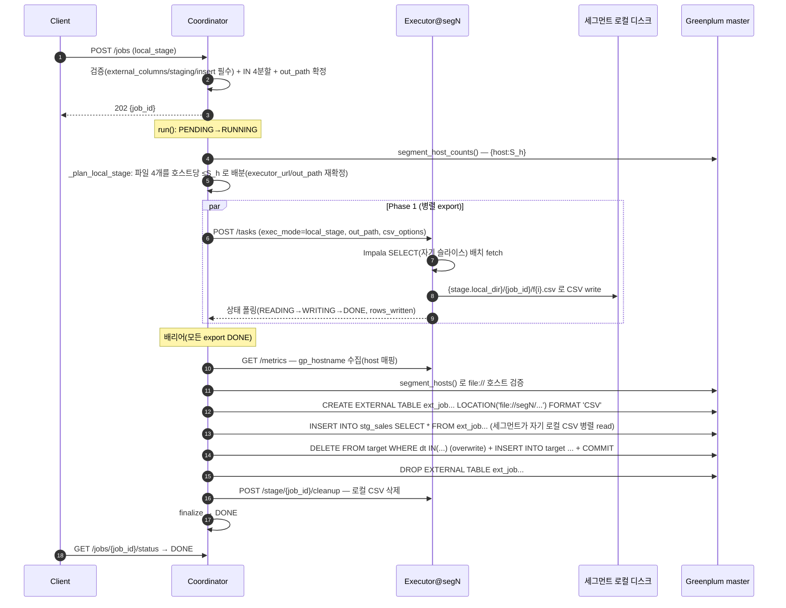

# 실행 모드 사용 가이드

이 저장소의 분산 쿼리 실행기는 목적이 다른 세 가지 실행 방식을 제공한다. 대량 데이터를
Impala 에서 Greenplum 으로 **옮기는 이관**과, 결과를 클라이언트로 **동기 반환하는
미리보기성 실행**이 큰 갈래이고, 이관은 다시 적재 방식(`exec_mode`)에 따라 나뉜다. 이 문서는
그중 실무에서 가장 자주 쓰는 셋을 한자리에 모아 정리한다.

- **`stage_insert` 이관**(`POST /jobs`, `exec_mode: stage_insert`) — 소스 SELECT 결과를
  Greenplum staging(TEMP) 테이블에 COPY 한 뒤 `INSERT … SELECT FROM staging` 으로 최종
  테이블에 반영하는 2단계 모드. 소스와 대상 엔진이 다르거나 컬럼 매핑·복잡한 INSERT 가 필요한
  표준 이관 패턴이다.
- **`local_stage` 이관**(`POST /jobs`, `exec_mode: local_stage`) — executor 를 각 GP 세그먼트
  호스트에 co-locate 하고, 각 세그먼트가 자기 호스트 로컬 CSV 를 `file://` 외부테이블로 병렬
  read 해 적재하는 2-phase 모드. 세그먼트 병렬성을 최대로 끌어내는 대량 적재용이다.
- **결과 반환 실행**(`POST /query-execute`) — 서버 템플릿으로 SELECT 만 렌더해 실행하고 상위
  N행을 동기 반환한다. 데이터를 옮기지 않는 미리보기·조회용이다.

세 방식 모두 **데이터는 coordinator 를 거치지 않는다**(이관은 executor 가 소스에서 읽어 GP 로
직접 흘리고, coordinator 로는 상태·row count 만 흐른다). 이관은 요청을 접수만 하고 **202 +
`job_id`** 를 즉시 반환하는 **비동기**이며 클라이언트가 상태를 폴링한다. 반면 query-execute 는
결과가 coordinator 를 거쳐 클라이언트로 돌아오는 **동기** 실행이다.

전체 설계는 [DESIGN.md](DESIGN.md) — 적재 방식 §9, `local_stage` §17, 템플릿 엔진 §18,
query-execute §18.7, 날짜 fan-out §18.8 을 참고한다.

---

## 1. `stage_insert` 이관 (`POST /jobs`)

소스(Impala) SELECT 결과를 Greenplum **staging(TEMP) 테이블에 COPY** 로 실은 뒤
**`INSERT … SELECT FROM staging`** 으로 최종 테이블에 반영한다. **적재는 항상 append** 다 —
`stage_insert` 는 `write_mode` 를 적용하지 않으므로, 같은 날짜를 두 번 실행하면 중복 적재된다.
멱등이 필요하면 대상 테이블을 job 밖에서 미리 비우거나(TRUNCATE 등) 날짜별 물리 테이블을 쓴다.
(참고로 적재 전 파티션 선삭제 `overwrite_partitions` 는 `copy`·`local_stage` 모드에서만 동작한다.)

### 처리 절차

요청을 받으면 coordinator 는 (동기로) 템플릿 렌더 → SELECT 검증 → 파티션 IN N분할 → 필수 필드
검증을 수행하고, 실패 시 즉시 422(과부하면 429)를 반환한다. 통과하면 `202 { job_id }` 를
돌려준 뒤 백그라운드에서 슬롯 대기(PENDING)→RUNNING 을 거쳐 task 를 executor 들에 병렬
디스패치한다. 각 task 는 `POST /tasks` 로 넘어가 executor 가 소스 SELECT 를 실행·적재하고,
coordinator 는 `GET /tasks/{id}/status` 로 폴링한다. 모든 task 가 끝나면 finalize 로 종료 상태를
집계한다(DONE/PARTIAL/FAILED/CANCELLED).

각 task 는 한 Greenplum 세션 안에서 소스 SELECT 를 행 단위로 스트리밍 fetch 하고, (staging_ddl
이 있으면) TEMP staging 을 만든 뒤 psycopg `COPY` 로 실어 `INSERT … SELECT FROM staging` 을
실행하고 `COMMIT` 한다. 연결 반납 시 **`DISCARD ALL`** 로 TEMP staging 이 자동 정리되어 다음
task 와 충돌하지 않는다. TEMP staging 은 세션 전용이라 task 간 격리되고, 실패해도 그 세션
staging 이 함께 사라져 깨끗한 상태에서 재시작된다. `impala_query_options` 는 소스 SELECT 에만
적용되며 INSERT(Greenplum)에는 영향을 주지 않는다.

### 요청 — raw 모드 (SQL 직접)

```jsonc
POST /jobs
{
  "exec_mode": "stage_insert",
  "sql": "SELECT user_id, amount, dt FROM sales WHERE dt IN ('2026-07-01','2026-07-02')",
  "partition_column": "dt",                         // 이 컬럼의 IN 목록을 N분할
  "target_table": "public.sales",
  "staging_table": "stg_sales",                     // 필수
  "staging_ddl": "CREATE TEMP TABLE stg_sales (user_id bigint, amount numeric, dt date)",  // 선택
  "wrapper_query": "INSERT INTO public.sales (user_id, amount, dt) SELECT * FROM stg_sales", // 필수 = INSERT
  "parallelism": 4
}
```

`stage_insert` 의 INSERT 문은 (copy 모드의 래퍼 자리와 같은) **`wrapper_query`** 필드에 담는다.
`staging_table` 과 `wrapper_query` 가 둘 다 없으면 `422 STAGE_INSERT_REQUIRES_FIELDS`. `staging_ddl`
은 선택이며, 비우면 테이블 생성을 건너뛰고 **이미 존재하는** `staging_table` 을 쓴다(이 경우 job·
파티션별 고유 테이블로 격리를 보장해야 한다).

### 요청 — 템플릿 모드 (권장)

SQL 전문 대신 서버 템플릿을 `params`(**object**)로 렌더한다. 템플릿이 SELECT/INSERT/STAGING DDL
을 모두 담으므로 요청은 파라미터만 보낸다. `exec_mode`·`partition_column`·`target_table`·
`staging_table` 등은 manifest 기본값을 따르고, 요청이 명시하면 요청이 우선한다.

```jsonc
{
  "template_id": "sales_migration",
  "params": { "start_dt": "2026-07-01", "end_dt": "2026-07-07", "regions": ["KR"] }
}
```

### 요청 — 날짜 태스크 컬럼 fan-out (stage_insert 전용)

파티션 `IN` 분할 대신 **날짜 하나 = task 하나**로 펼쳐 executor 당 하루씩 맡긴다(일별 배치용).

```jsonc
{
  "template_id": "daily_sales",
  "params": { "region": "KR" },
  "task_column": "dt",          // 날짜 컬럼(partition_column 대체)
  "task_range": [-7, 0]         // 오늘 기준 상대 일수, 양끝 포함 → 오늘 포함 8일 = 8 task
}
```

`task_range:[-7,0]` + 오늘(2026-07-21) → `2026-07-14 … 2026-07-21`(8일). 정확히 7일이면
`[-7,-1]`/`[-6,0]`. 이 모드에서는 `partition_column`/`parallelism`/`split_strategy` 를 쓰지
않는다(task 수 = 날짜 수).

### 필드 요약

| 필드 | 필수 | 설명 |
|---|---|---|
| `exec_mode` | ✅(`stage_insert`) | 이 모드를 고른다 |
| `sql` | ✅(raw) | 소스 SELECT (템플릿 모드는 렌더로 채움) |
| `partition_column` | ✅ | IN 목록으로 N분할할 컬럼 (fan-out 은 `task_column` 이 대체) |
| `target_table` | ✅ | 최종 적재 대상 |
| `staging_table` | ✅ | staging(보통 TEMP) 테이블명 |
| `wrapper_query` | ✅ | **INSERT … SELECT FROM staging** 문 |
| `staging_ddl` | ✕ | `CREATE TEMP TABLE …`(없으면 기존 staging_table 사용) |
| `template_id` / `params` | ✕ | 템플릿 모드(params 는 **object**) |
| `task_column` / `task_range` | ✕ | 날짜 fan-out 모드 |
| `parallelism` | ✕ | 분할(=task) 수, 1~128 (기본 4) |
| `split_strategy` | ✕ | `contiguous`(기본) \| `round_robin` |
| `sql_dialect` | ✕ | 파싱 방언(기본 hive) |
| `strict_validation` | ✕ | true=단순 SELECT, false=복합 쿼리 허용 |
| `impala_query_options` | ✕ | 소스 SELECT 에만 적용되는 SET 옵션 |
| `username` | ✕ | 이력/감사용 |
| `dry_run` | ✕ | true 면 executor 호출 없이 계획만 200 반환 |

### 응답

접수에 성공하면 `202 { "job_id": "job_ab12cd34" }`. `dry_run:true` 면 실행·저장 없이
**200 + 분할 계획**(각 task 의 `sub_query`·`staging_ddl`·`insert_sql`)을 돌려주므로, 만들어질
SQL 을 눈으로 검토할 때 쓴다.

### 예제 템플릿: `sales_migration`

`templates/sales_migration/` — 날짜 구간(`start_dt`~`end_dt`)의 IN 목록을 자동 생성하는
stage_insert 템플릿.

`manifest.yml`:

```yaml
id: sales_migration
description: 일별 매출 Impala→Greenplum 이관(날짜 구간 파라미터로 IN 목록 자동 생성)
exec_mode: stage_insert
partition_column: dt
target_table: public.sales
staging_table: stg_sales
strict_validation: false
params:
  - {name: start_dt, type: date, required: true}
  - {name: end_dt,   type: date, required: true}
  - {name: regions,  type: list, required: false, default: []}
files:
  select:      select.sql.j2
  staging_ddl: staging_ddl.sql.j2
  insert:      insert.sql.j2
```

`select.sql.j2`(소스 SELECT):

```sql
SELECT user_id, amount, region, dt
FROM sales
WHERE dt IN ( {{ date_range(start_dt, end_dt) | sql_in }} )

  AND region IN ( {{ regions | sql_in }} )

```

나머지 두 조각은 단순하다. `staging_ddl.sql.j2` 는 `CREATE TEMP TABLE {{ staging_table |
sql_ident }} (...)` 로 staging 을 만들고, `insert.sql.j2` 는 `INSERT INTO {{ target_table |
sql_ident }} (...) SELECT ... FROM {{ staging_table | sql_ident }}` 로 staging→target 을 적재한다
(식별자는 `sql_ident` 필터로 안전하게 렌더).

날짜별 fan-out 이 필요하면 `templates/daily_sales/`(SELECT 가 `WHERE dt = {{ task_date }}` 로
하루치만 조회)를 참고한다.

### 상태 확인 · 재실행

| 엔드포인트 | 설명 |
|---|---|
| `GET /jobs/{job_id}/status` | 진행 상태/진행률(경량, 태스크 제외) — 폴링용 |
| `GET /jobs/{job_id}` | 전체 상태(태스크별 status·rows_written·phase 포함) |
| `GET /jobs/{job_id}/result` | 적재 결과 요약(총 행수·태스크별) |
| `POST /jobs/{job_id}/cancel` | 작업 취소(각 executor 전파). 이미 종료면 409 |
| `POST /jobs/{job_id}/retry` | **실패 파티션만** 재실행 → 새 `job_id` |

종료 상태는 `DONE`(전부 성공) / `PARTIAL`(일부 실패) / `FAILED`(전부 실패·fail_fast) /
`CANCELLED` 다. `PARTIAL`·`FAILED` 는 `retry` 로 실패 task 만 다시 돌릴 수 있다.

### 오류 응답

렌더/검증 실패는 요청-응답 사이클에서 `422 + error_code` 로 즉시 반환된다.

| 상황 | 상태 | error_code |
|---|---|---|
| 필수 필드(sql·partition_column·target_table) 누락 | 422 | `MISSING_REQUIRED_FIELDS` |
| stage_insert 인데 staging_table/wrapper_query 누락 | 422 | `STAGE_INSERT_REQUIRES_FIELDS` |
| SQL 파싱 실패 / 비-SELECT / 파티션 IN 없음 | 422 | `PARSE_ERROR` / `NOT_A_SELECT` / `NO_PARTITION_IN_CLAUSE` 등 |
| 템플릿 없음 / 파라미터 검증·렌더 실패 | 422 | `TEMPLATE_NOT_FOUND` / `TEMPLATE_PARAM_ERROR` / `TEMPLATE_RENDER_ERROR` |
| fan-out: template_id 없음 / 비-stage_insert / task_range 형식 | 422 | `FANOUT_REQUIRES_TEMPLATE` / `FANOUT_REQUIRES_STAGE_INSERT` / `TASK_RANGE_INVALID` |
| 동시 실행/대기 job 한도 초과 | 429 | (Retry-After 헤더) |

### 관련 설정 (executor)

```properties
# 소스(읽기): Impala 접속 정보
source.type=impala
impala.host=impala-coordinator.example.com

# 대상(staging/INSERT): Greenplum
greenplum.dsn=postgresql://gpadmin:pw@gp-master:5432/warehouse
greenplum.pool_max=0          # GP 커넥션 풀 상한(0=executor.max_concurrent_tasks 와 동일)

# staging 으로의 COPY 튜닝(stage_insert 의 COPY 에도 적용)
copy.batch_size=10000         # COPY 배치 크기(행)
copy.pipeline=true            # 소스 읽기와 GP COPY 를 겹쳐 실행(벽시계 단축)

# 동시성
executor.max_concurrent_tasks=8   # executor 1대 동시 task 수
```

`impala.host` 와 `greenplum.dsn` 이 둘 다 있어야 실제 백엔드가 뜬다. 없으면
`MockBackend`(테스트/개발). 템플릿 모드는 `template.enabled=true` 가 필요하다.

---

## 2. `local_stage` 이관 (`POST /jobs`)

`local_stage` 는 executor 가 소스에서 읽은 데이터를 **세그먼트 호스트 로컬 CSV 로 export** 한
뒤(Phase 1), coordinator 가 그 파일들을 Greenplum 내장 **`file://` 프로토콜 외부테이블**로 걸어
각 세그먼트가 **자기 호스트 로컬 CSV 를 병렬 read** 해 target 에 적재하는(Phase 2) 2-phase
모드다. 세그먼트 병렬성을 그대로 살리므로 대량 적재에 강하다. 대신 **executor 를 각 GP 세그먼트
호스트에 co-locate** 해야 한다는 배치 제약이 있다(설계 근거는 DESIGN §17).

> 코드/로그의 스테이지명 `PXF_EXTERNAL_DDL` 은 역사적 이름일 뿐, 실제로는 PXF 가 아니라
> `file://` 외부테이블을 쓴다.

`stage_insert` 와 달리 `local_stage` 는 `write_mode` 를 지원한다 — `overwrite_partitions` 를 주면
적재 전 해당 파티션을 DELETE 로 선삭제하므로 **재실행 멱등**이 성립한다.

### 언제 쓰나

- 적재량이 커서 단일 COPY 스트림(`stage_insert`/`copy`)의 처리량이 부족할 때.
- executor 를 GP 세그먼트 호스트에 붙일 수 있어(co-locate) 세그먼트별 로컬 병렬 read 로 적재를
  펼치고 싶을 때.
- 같은 파티션을 반복 적재하는 배치에서 **멱등**(`overwrite_partitions`)이 필요할 때.

### 요청 (POST /jobs)

```jsonc
POST /jobs
{
  "sql": "SELECT user_id, amount, dt FROM sales WHERE dt IN ('2026-06-01','2026-06-02','2026-06-03','2026-06-04') AND region='KR'",
  "partition_column": "dt",
  "target_table": "public.sales_mirror",
  "write_mode": "overwrite_partitions",
  "exec_mode": "local_stage",
  "parallelism": 4,
  "external_columns": "user_id bigint, amount numeric, dt date",
  "staging_table": "stg_sales",
  "staging_ddl": "CREATE TEMP TABLE stg_sales (user_id bigint, amount numeric, dt date) DISTRIBUTED BY (user_id)",
  "insert_sql": "INSERT INTO public.sales_mirror (user_id, amount, dt) SELECT user_id, amount, dt FROM stg_sales"
}
```

- 성공 접수는 `202 { "job_id": "job_ab12cd" }`.
- `staging_table`·`external_columns`·`insert_sql` 중 하나라도 빠지면 `422
  LOCAL_STAGE_REQUIRES_FIELDS`.
- `external_columns` 는 CSV 컬럼 순서(=SELECT 출력 순서)와 타입이 일치해야 한다.
- `staging_ddl` 은 선택이며, TEMP 로 두면 세션 종료 시 자동 정리되어 재실행에 깔끔하다.

### 접수 후 내부 흐름



Phase 1 은 coordinator 가 파일 예산을 배분(호스트당 ≤ S_h)한 뒤 각 executor 에 export task 를
병렬 디스패치하고, 모든 export 가 DONE 될 때까지 **배리어**로 기다린다. Phase 2 는 coordinator 가
GP master 에 한 트랜잭션으로 다음 SQL 을 실행한다.

```sql
CREATE TEMP TABLE stg_sales (...) DISTRIBUTED BY (user_id);         -- staging_ddl
CREATE EXTERNAL TABLE ext_job_ab12cd (user_id bigint, amount numeric, dt date)
  LOCATION ('file://seg1/data1/distributed-query-executor/stage/job_ab12cd/f0.csv',
            'file://seg2/data1/distributed-query-executor/stage/job_ab12cd/f1.csv', ...)
  FORMAT 'CSV' ( DELIMITER '`' NULL '' QUOTE '"' );
INSERT INTO stg_sales SELECT * FROM ext_job_ab12cd;                 -- 세그먼트 로컬 병렬 read
DELETE FROM public.sales_mirror WHERE dt IN ('2026-06-01', ...);   -- overwrite_partitions
INSERT INTO public.sales_mirror (...) SELECT ... FROM stg_sales;   -- insert_sql
-- COMMIT
DROP EXTERNAL TABLE IF EXISTS ext_job_ab12cd;                      -- cleanup
```

단계 이벤트(대시보드/로그 타임라인)의 스테이지명은 executor 쪽이 `IMPALA_SUBMIT`·
`EXPORT_WRITE`, coordinator 쪽이 `STAGING_DDL`·`PXF_EXTERNAL_DDL`(외부테이블 DDL)·`STAGE_LOAD`·
`DELETE`·`INSERT`·`COMMIT`·`CLEANUP` 이다.

### 사전 준비 (인프라·설정·권한)

| 항목 | 준비 내용 |
|---|---|
| **토폴로지** | executor 를 각 GP 세그먼트 호스트에 배치(호스트당 1개 이상). coordinator 는 GP master 와 분리된 별도 노드. |
| **coordinator 설정** | `greenplum.dsn`(GP master 접속 — Phase 2·검증·토폴로지 조회), `coordinator.executors`(각 executor base URL 목록), `store.backend`(memory/postgres). |
| **executor 설정** | `impala.host`(export 소스), `greenplum.dsn`(⚠️ export 는 GP 를 쓰지 않지만 `build_backend` 가 DSN 이 있어야 실백엔드를 고른다 — 연결은 lazy 라 export 경로에선 실제 접속하지 않음), `executor.gp_hostname`(그 호스트의 `gp_segment_configuration.hostname` 과 일치, 미설정 시 OS hostname), `stage.local_dir`. |
| **로컬 디렉터리** | `stage.local_dir`(예: `/data1/distributed-query-executor/stage`)가 **모든 세그먼트 호스트에 동일 경로**로 존재하고, executor 프로세스가 write, **GP 세그먼트 postgres(보통 gpadmin)가 read** 가능해야 한다. |
| **GP 스키마** | target 테이블과 staging 테이블(또는 job 이 만들 `staging_ddl`)이 존재/생성 가능. `gp_segment_configuration` 조회 권한. |
| **CSV 방언** | executor write 와 외부테이블 `FORMAT 'CSV'` 는 같은 설정(`stage.csv_delimiter` 기본 backtick `` ` ``)을 쓰므로 자동 일치. |

`stage.cleanup=true`(기본)면 적재 후 job 디렉터리를 삭제하고, 디버깅 시 `false` 로 보존한다.

### 확인 포인트

정상 적재라면 `GET /jobs/{job_id}/status` 가 `SPLITTING→(PENDING)→RUNNING→DONE` 으로 전이하고
`completed==total==parallelism`, `total_rows_written` 이 Phase 1 export 행수 합과 일치한다. 각
task 의 `executor_url` 은 파일 예산 배분대로 세그먼트 호스트에 분산되어 한 호스트에 ≤ S_h 파일이
간다. 세그먼트 호스트에서는 `{stage.local_dir}/{job_id}/` 아래 자기 몫 CSV(backtick 구분자)가
생기고, 적재 후 외부테이블 `ext_job_...` 은 cleanup 으로 사라진다. `overwrite_partitions` 면 해당
파티션이 새 데이터로 교체되므로 재실행해도 결과가 동일하다.

### 실패 시 진단

| 증상 | 원인 | 확인/조치 |
|---|---|---|
| `422 LOCAL_STAGE_REQUIRES_FIELDS` | staging_table/external_columns/insert_sql 누락 | 요청 JSON 필드 확인 |
| job `FAILED`, "파일 예산 … 초과" | `parallelism` > Σ S_h(호스트별 세그먼트 수 합) | parallelism 낮추기 / executor 호스트·세그먼트 확대 / `stage.max_files_per_host` 확인 |
| job `FAILED`, "gp_segment_configuration 에 없습니다" | `executor.gp_hostname` ≠ 실제 세그먼트 호스트명 | executor `/metrics` 의 `gp_hostname` 과 `SELECT DISTINCT hostname FROM gp_segment_configuration` 대조 |
| Phase 2 실패(파일 못 읽음/권한) | 로컬 파일 퍼미션·경로 불일치·host 매핑 오류 | 세그먼트 호스트에서 파일 존재·read 권한, `stage.local_dir` 동일 경로 확인 |
| export task `FAILED` | Impala 접속/쿼리 오류, 디스크 부족 | executor 로그, `impala.host`/인증 설정, 디스크 여유 |
| CSV 파싱 오류/행 어긋남 | 데이터에 구분자(backtick) 포함 | `stage.csv_delimiter` 를 데이터에 없는 문자로 변경 |

### GP·Impala 없이 통합 테스트

실제 GP/Impala 없이도 `POST /jobs`→`DONE` 전 과정(검증·분할·파일 예산 배분·host 매핑·Phase 1
파일 write·배리어·Phase 2 `file://` read·target 집계·cleanup)을 닫힌 루프로 검증할 수 있다.
핵심은 `tests/helpers.py` 의 **`MockLocalStageBackend`** 로, `MockBackend` 를 상속해 export 에서
실제 CSV 파일을 쓰고, load 에서 `external_ddl` 의 `file://` 경로를 파싱해 그 CSV 들을 읽어
인메모리 `target` 에 넣으며, `segment_host_counts()` 로 지정 토폴로지를 돌려준다(운영 코드 변경
없이 백엔드 주입만으로 구성). 결정적인 in-process 하니스(`tests/test_local_stage_integration.py`)가
기본 커버리지를, 실제 소켓/프로세스를 띄우는 HTTP 하니스(`tests/test_local_stage_http.py`)가 폴링·
failover·gp_hostname 수집·cleanup 팬아웃을 얇게 덮는다. 순수 함수·라우팅은
`tests/test_local_stage.py` 가 담당한다.

---

## 3. 결과 반환 실행 (`POST /query-execute`)

서버에 보관된 **쿼리 템플릿**을 파라미터로 렌더해 `SELECT` 를 만들고, 지정한 데이터소스에 실행해
**결과(상위 N행)를 동기로 돌려받는** API 다. 데이터를 옮기는 이관(`/jobs`)과 달리 결과가
coordinator 를 거쳐 클라이언트로 반환되는 미리보기성 실행이다. 클라이언트는 SQL 전문이 아니라
**`template_id` + `params`(이름-값 항목 배열)** 만 보내며, **어떤 executor 가 실행하는지 몰라도
된다** — 소스 실행은 coordinator 가 `/jobs` 와 동일한 정책으로 가장 한가한 executor 를 골라
**`/query-run`(커스텀 함수)** 하나로 위임한다(연결 실패 시 다음 executor 로 failover). `greenplum`/
`history` 만 coordinator 가 직접(psycopg) 실행한다.

### "쿼리 실행" 엔드포인트 지도

혼동을 막기 위해, 목적이 다른 세 가지 쿼리 실행 표면을 구분한다.

| 개념 | 진입 엔드포인트 | 무엇 | 결과 |
|---|---|---|---|
| **이관**(migration) | `POST /jobs` → (executor) `POST /tasks` | 소스 SELECT → **Greenplum 적재**(대량 이동) | job_id·상태·row count (**행 반환 ✕**) |
| **미리보기/연결 테스트** | `POST /datasources/{name}/query` | **임의 SQL** 을 built-in 드라이버로 실행(운영 점검용) | 상위 N행 |
| **결과 반환 실행**(이 절) | `POST /query-execute` → (executor) `POST /query-run` | **템플릿** 렌더 SELECT 를 실행 | 상위 N행 |

query-execute 의 소스 실행은 impala/trino 구분 없이 모든 소스를 executor 의 커스텀
함수(`query.func.module`)에 위임하는 것으로 통일돼 있다. 미리보기(`/datasources/{name}/query`)는
임의 SQL 을 built-in 드라이버로 실행하는 별개의 운영 점검 도구이며 대시보드 `데이터소스` 탭이 쓴다.

### 실행 절차

coordinator 는 요청의 `params[]` 를 `{name: value}` 로 접고(중복 name → 422), `render_query()`
로 select 조각만 렌더한 뒤 `validate_select_query()` 로 행반환 SELECT 를 검증한다(렌더/검증 실패
→ 422 + error_code). `datasource` 가 `greenplum`/`history` 면 렌더된 SELECT 를 coordinator 가
직접(psycopg) 실행해 상위 N행을 돌려주고(`executed_by=null`), 소스(impala/trino/source)면 `/jobs`
와 동일한 선택 정책으로 executor 를 골라 `POST /query-run {sql, limit}` 로 위임한다(연결 실패 시
다음 executor 로 failover). executor 는 소스를 직접 모르고 커스텀 함수(`query.func.module`)의
`run(sql, config, limit)` 을 호출하며, 함수가 실제 SELECT 를 실행해 결과를 돌려준다.

### 요청 JSON

```jsonc
POST /query-execute
Content-Type: application/json

{
  "template_id": "order_search",
  "params": [
    { "name": "regions",    "value": ["KR", "US", "JP"] },  // IN 목록(N개)
    { "name": "start_dt",   "value": "2026-01-01" },        // BETWEEN 시작
    { "name": "end_dt",     "value": "2026-03-31" },        // BETWEEN 종료
    { "name": "min_amount", "value": 1000 }                 // 선택(생략 가능)
  ],
  "datasource": "trino",   // 생략 시 서버 source.type. 이관은 Impala, 실행은 Trino 로 나눌 때 명시
  "limit": 100             // 반환 최대 행수(1~10000, 기본 100)
}
```

`datasource` 를 생략하면 전역 `source.type` 을 따른다. "이관(`/jobs`)은 Impala, query-execute 는
Trino" 처럼 나누려면 `source.type=impala` 로 두고 요청에 `"datasource": "trino"` 를 명시한다.
trino 실행은 executor 가 직접 접속하지 않고 커스텀 함수에 위임한다(아래 참고).

curl 예:

```bash
curl -s localhost:8088/query-execute -H 'content-type: application/json' -d '{
  "template_id": "order_search",
  "params": [
    {"name": "regions",    "value": ["KR", "US", "JP"]},
    {"name": "start_dt",   "value": "2026-01-01"},
    {"name": "end_dt",     "value": "2026-03-31"},
    {"name": "min_amount", "value": 1000}
  ],
  "datasource": "trino",
  "limit": 100
}'
```

### 응답 JSON

```jsonc
{
  "template_id": "order_search",
  "datasource": "trino",
  "sql": "SELECT order_id, region, order_dt, amount FROM orders WHERE region IN ( 'KR', 'US', 'JP' ) AND order_dt BETWEEN '2026-01-01' AND '2026-03-31' AND amount >= 1000.0 ORDER BY order_dt, order_id",
  "columns": ["order_id", "region", "order_dt", "amount"],
  "rows": [
    [10001, "KR", "2026-01-03", 25000],
    [10002, "US", "2026-01-05", 18000]
  ],
  "row_count": 2,
  "truncated": false,   // limit 초과로 잘렸는지
  "limit": 100,
  "elapsed_ms": 42.7,
  "executed_by": "http://executor-3:8001"   // 실제 실행 executor(직접 실행이면 null)
}
```

`columns`/`rows`/`row_count`/`truncated`/`elapsed_ms` 는 데이터소스 미리보기와 동일한 shape 이다.
`sql` 은 감사·재현용으로 렌더된 SELECT 를 그대로 싣는다. `executed_by` 는 실제 쿼리를 실행한
executor URL(관측용)이며, impala/trino 는 coordinator 가 고른 executor URL(failover 됐다면 최종
성공한 executor), greenplum/history 는 coordinator 직접 실행이라 `null` 이다.

### 예제 템플릿: `order_search`

`templates/order_search/` 는 query-execute 전용 예제로, WHERE 절에 지역 `IN` 목록(N개)과 주문일
`BETWEEN` 날짜 구간을 조합해 주문을 조회한다.

`manifest.yml`:

```yaml
id: order_search
description: 주문 조회(query-execute 예제) — region IN 목록 + 주문일 BETWEEN 구간
# query-execute 는 select 조각만 렌더하지만, manifest 규약상 exec_mode 를 둔다(copy).
exec_mode: copy
strict_validation: false            # 렌더 SELECT 에 ORDER BY 등이 있어 lenient 로 둔다
params:
  - {name: regions,    type: list,   required: true}            # IN 목록(N개 지역 코드)
  - {name: start_dt,   type: date,   required: true}            # BETWEEN 시작일(YYYY-MM-DD)
  - {name: end_dt,     type: date,   required: true}            # BETWEEN 종료일(YYYY-MM-DD)
  - {name: min_amount, type: number, required: false, default: 0}  # 최소 주문금액(0=조건 생략)
files:
  select: select.sql.j2
```

`select.sql.j2`:

```sql
SELECT order_id, region, order_dt, amount
FROM orders
WHERE region IN ( {{ regions | sql_in }} )
  AND order_dt BETWEEN {{ start_dt | sql_str }} AND {{ end_dt | sql_str }}

  AND amount >= {{ min_amount | sql_num }}

ORDER BY order_dt, order_id
```

파라미터는 반드시 필터를 거쳐 안전한 리터럴로 렌더된다(SQL 인젝션 방지): `regions` 는
`sql_in`(콤마 구분 리터럴, 빈 목록은 안전한 `NULL`), 날짜 경계는 `sql_str`(작은따옴표 이스케이프),
`min_amount` 는 `sql_num`(숫자만 허용, 비숫자는 렌더 실패 → 422). 사용 가능한 템플릿은
`GET /templates` 로 조회한다.

### 대시보드에서 실행 (`쿼리 실행` 탭)

coordinator 대시보드(`/`)의 `쿼리 실행` 탭에서 브라우저로 바로 실행할 수 있다. 템플릿을 고르면
그 파라미터 스키마대로 입력 필드가 생성되고(`list` 타입은 `KR, US, JP` 처럼 쉼표 구분), 데이터
소스는 `소스 (커스텀 함수)`(기본, `/query-run` 위임) / `greenplum` / `history`(coordinator 직접)
중에서 고른다. 상위 N행과 함께 실행하면 `POST /query-execute` 가 호출되고 결과 표와 메타(행수·
소요시간·`실행 executor: <URL>` = `executed_by`)가 표시된다. 렌더/검증/실행 오류는 결과 영역에
`error_code`·메시지로 나온다.

### 설정 (coordinator · executor)

"이관은 Impala, query-execute 는 Trino, 적재는 Greenplum" 라우팅은 아래처럼 설정한다.

Coordinator:

```properties
# 쿼리 템플릿 엔진 — query-execute 가 템플릿을 렌더하려면 반드시 활성.
template.enabled=true
template.dir=templates      # 템플릿 루트(운영은 배포 경로)

# 프록시 대상 executor 목록(쉼표 구분). query-execute 의 impala/trino 실행은 이 중에서 고른다.
coordinator.executors=http://exec1:8001,http://exec2:8001

# executor 선택 정책 — query-execute 도 /jobs 와 동일하게 이 값을 따른다.
#   round_robin(기본) | least_loaded(가장 한가) | p2c(HA 권장)
coordinator.executor_select=p2c
```

`template.enabled=false` 면 `/query-execute` 는 404, `coordinator.executors` 가 비어 있으면
impala/trino 실행은 400 이다(greenplum/history 직접 실행은 executor 불필요).

Executor:

```properties
# 이관(/jobs)의 읽기 소스 — Impala.
source.type=impala
impala.host=impala-coordinator.example.com
impala.port=21050
impala.database=default
impala.user=etl

# Greenplum (target, 이관 적재 대상)
greenplum.dsn=postgresql://gpadmin:pw@gp-master:5432/warehouse

# query-execute 의 trino 실행 = 커스텀 함수 위임. executor 는 Trino 를 직접 모른다.
#   query.func.module   : 실행 함수 dotted path
#   query.func.config.* : 함수에 넘길 자유 설정 dict(접두어를 뗀 키로 통째 전달, 값은 문자열)
query.func.module=customs.query_funcs.trino_runner:run
query.func.config.host=trino.example.com
query.func.config.port=8080
query.func.config.user=query-executor
query.func.config.catalog=hive
query.func.config.schema=default
query.func.config.http_scheme=http
# 임의 파라미터도 한 줄만 추가하면 그대로 함수에 전달된다(YAML/코드 수정 불필요):
query.func.config.statement_timeout_s=60
```

정리하면 이관 SELECT(`/jobs`)는 `source.type=impala`+`impala.*`, 이관 INSERT 는 `greenplum.dsn`,
query-execute 는 요청 `datasource:"trino"` + `query.func.module` + `query.func.config.*` 를 쓴다.

### 커스텀 실행 함수

query-execute 의 `datasource:"trino"` 요청은 executor 가 `query.func.module` 로 지정한 외부
Python 함수에 실행을 위임한다. 프레임워크는 Trino 드라이버를 전혀 모르며 연결·실행·형변환은 전부
이 함수 책임이다. 조직 표준(게이트웨이/래퍼/커넥션 풀 등)에 맞춰 이 함수만 바꾸면 된다.

함수 계약:

```python
from core.dbprobe import QueryResult      # 또는 동일 키 dict 반환 허용

def run(sql: str, *, config: dict, limit: int) -> QueryResult:
    """sql 을 config 백엔드에 실행해 상위 limit 행을 반환.
    config : query.func.config.* 를 모은 dict(값은 모두 문자열 — 함수 안에서 형변환).
    반환    : QueryResult(columns, rows, row_count, truncated, elapsed_ms) 또는 동일 키 dict.
    """
```

`query.func.module` 은 `module:func` 또는 `module.func` dotted path 이며, executor 가 첫 호출에서
`importlib` 로 import 후 캐시한다(잘못된 경로/미호출가능 → 502). 반환은 `QueryResult` 또는
`{columns, rows, row_count, truncated, elapsed_ms}` dict 이고, `limit` 초과(`truncated`) 판정은
함수 책임이다(예제는 `fetchmany(limit+1)`). 참조 구현은 `customs/query_funcs/trino_runner.py` 에
있다(표준 `dbprobe._shape` 로 정형).

```python
# customs/query_funcs/trino_runner.py (발췌)
from core.dbprobe import QueryResult, _shape
import time, trino

def run(sql, *, config, limit):
    conn = trino.dbapi.connect(host=config["host"], port=int(config.get("port", 8080)),
                               user=config.get("user", "query-executor"),
                               catalog=config.get("catalog", "hive"),
                               schema=config.get("schema", "default"))
    started = time.perf_counter()
    cur = conn.cursor(); cur.execute(sql)
    cols = [d[0] for d in cur.description]
    return _shape(cols, cur.fetchmany(limit + 1), limit, started)
```

운영에서 유의할 점 셋:

- **대화형 login() 처리**: 사내 인증 모듈의 `login()` 이 `input()`/`getpass()` 로 자격증명을 묻는
  대화형 함수라면 `query.func.config.login_module=mycorp.auth:login` 으로 지정한다. executor 는
  터미널 없는 데몬이라 프롬프트가 그대로면 EOFError/블록이 나므로, 예제의 `_login_noninteractive()`
  가 호출 동안만 `builtins.input`/`getpass.getpass`/`sys.stdin` 을 config 의 `user`/`password` 로
  바꿔치기해 입력을 공급한다(질문 순서가 다르면 answers 목록만 수정). 로그인 결과는 프로세스당 1회만
  캐시하고, 전역 패치는 락으로 직렬화 후 finally 로 원복한다.
- **로깅**: 커스텀 함수는 executor 프로세스 안에서 돌므로 표준 `logging`(`logger =
  logging.getLogger(__name__)`)을 쓰면 executor 로그 파일(`executor-<포트>.log`, WARNING 이상은
  `*-warn.log`)에 그대로 남는다. `print()` 는 기록되지 않는다. 오류는 `logger.exception(...)` 으로
  트레이스를 남긴 뒤 **다시 raise** 한다(executor 가 502 로 응답). 추적 정보는 남기되 **비밀값은
  절대 로그에 넣지 않는다**.
- **이벤트 루프**: 커스텀 함수(또는 의존 라이브러리)가 `nest_asyncio` 처럼 이벤트 루프를 패치하면
  uvloop 에서 `can't patch loop of type uvloop.Loop` 로 실패한다. 그래서 executor 는 uvicorn 을
  `loop="asyncio"`(순수 파이썬 루프)로 기동한다(`executor/__main__.py`). 데이터 경로는 스레드에서
  돌아 성능 영향은 무시할 수준이다(coordinator 는 커스텀 함수를 실행하지 않아 해당 없음).

### 오류 응답

렌더/검증 실패는 `422 + error_code`(이관 `/jobs` 와 동일 규약)로 돌려준다.

| 상황 | 상태 | error_code / detail |
|---|---|---|
| 필수 파라미터 누락(예: `end_dt`) | 422 | `TEMPLATE_PARAM_ERROR` |
| 같은 `name` 중복 | 422 | `DUPLICATE_PARAM` |
| 없는 템플릿 | 422 | `TEMPLATE_NOT_FOUND` |
| `min_amount` 에 비숫자 전달 | 422 | `TEMPLATE_RENDER_ERROR` |
| 템플릿 엔진 비활성(`template.enabled=false`) | 404 | — |
| impala/trino 인데 executor 미설정 | 400 | `executor 가 설정되지 않았습니다` |
| 데이터소스 접속/SQL 오류 | 502 | 원인 메시지 |
