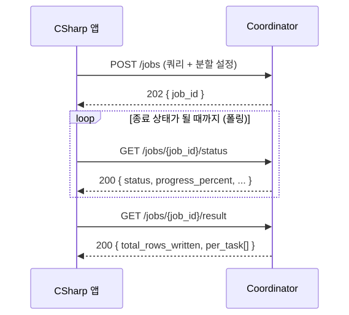

# C# 애플리케이션 연동 가이드 (Coordinator HTTP API)

C# 애플리케이션이 Coordinator 의 HTTP API 로 쿼리 작업(Job)을 실행하고, 완료를 기다리고,
실패 원인을 확인하는 방법을 정리합니다. 모든 요청·응답은 JSON 이며, 아래 예시는 실제 응답
형태 그대로입니다. API 전체 목록과 의미는 [README.md](../README.md)·[DESIGN.md](DESIGN.md) 를
함께 참고하세요.

## 1. 비동기 작업 모델

가장 먼저 알아 둘 사실은, Coordinator 가 작업을 **접수만 하고 즉시 응답**한다는 것입니다.
`POST /jobs` 는 작업이 끝나길 기다리지 않고 **HTTP 202 Accepted** 와 함께 작업 식별자(`job_id`)만
돌려주며, 실제 실행은 백그라운드에서 진행됩니다. 따라서 C# 쪽은 (1) `POST /jobs` 로 제출해
`job_id` 를 받고, (2) 그 `job_id` 로 상태 조회 API 를 **주기적으로 폴링**하며 종료 상태에 도달할
때까지 기다리는 두 단계로 동작합니다.

실제 데이터(Impala 에서 읽어 Greenplum 으로 적재되는 행)는 Coordinator 를 거치지 않습니다.
Coordinator 와 주고받는 것은 상태와 적재된 행 수(row count) 뿐이라 응답은 항상 가볍습니다.

**기본 주소(base URL)** 는 `http://<coordinator-host>:8088` 입니다(`coordinator.host`/
`coordinator.port` 설정값). 아래 모든 호출은 이 주소 뒤에 경로를 붙인 것입니다. API 에는 인증
계층이 없으므로 망 분리·방화벽·리버스 프록시 등 네트워크 수준에서 접근을 통제하는 것을
전제로 합니다.

이 가이드에서 쓰는 엔드포인트입니다(`{base}` 는 기본 주소, `{job_id}` 는 제출 응답의 식별자).

| 동작 | 메서드 · URL |
|---|---|
| 작업 제출 | `POST {base}/jobs` |
| 진행 상태 폴링(경량) | `GET {base}/jobs/{job_id}/status` |
| 전체 상태(태스크 포함) | `GET {base}/jobs/{job_id}` |
| 결과 요약 | `GET {base}/jobs/{job_id}/result` |
| 작업 취소 | `POST {base}/jobs/{job_id}/cancel` |
| 실패 파티션 재실행 | `POST {base}/jobs/{job_id}/retry` |
| 사용 가능한 템플릿 조회 | `GET {base}/templates` |
| 결과 반환 실행(동기) | `POST {base}/query-execute` |

이관(`/jobs`)은 SQL 전문 또는 서버 템플릿(2.2)으로 제출하고, 결과 행이 필요한 동기 조회는
`POST /query-execute`(9장)로 처리합니다. 전체 호출 흐름은 다음과 같습니다.



## 2. 작업 제출 (`POST /jobs`)

이 가이드는 클라이언트가 **`stage_insert`(스테이징 INSERT) 모드**로 적재한다고 가정합니다. 이
모드는 Impala 의 SELECT 결과를 Greenplum 의 staging 테이블에 먼저 COPY 로 쌓은 뒤, 그 staging
에서 최종 대상 테이블로 `INSERT ... SELECT` 를 실행하는 2단계 방식으로, 엔진 간 컬럼·형 변환·집계
같은 가공을 INSERT 단계에 맡기고 싶을 때 적합합니다.

`stage_insert` 는 기본 필드(`sql`·`partition_column`·`target_table`) 외에 `staging_table`(적재할
staging 테이블 이름)과 `wrapper_query`(staging→target INSERT 문)가 **필수**입니다. 둘 중 하나라도
빠지면 **422** 로 거부됩니다(5.2). `staging_ddl`(staging 테이블 생성 DDL)은 **선택**으로, 주면
executor 가 COPY 전에 그 DDL 로 테이블을 만들고, **생략하면 테이블 생성을 건너뛰고 이미 존재하는
`staging_table` 을 그대로 사용**합니다.

```json
{
  "sql": "SELECT id, region, amount, ts FROM sales WHERE region IN ('A', 'B', 'C', 'D')",
  "partition_column": "region",
  "target_table": "warehouse.sales",
  "username": "etl-bot",
  "parallelism": 4,
  "exec_mode": "stage_insert",
  "staging_table": "stg_sales",
  "staging_ddl": "CREATE TEMP TABLE stg_sales (LIKE warehouse.sales)",
  "wrapper_query": "INSERT INTO warehouse.sales (id, region, amount, ts) SELECT id, region, amount, ts FROM stg_sales"
}
```

기본 필드에서 `sql` 은 Impala 에서 읽을 SELECT, `partition_column` 은 그 `IN` 목록을 N등분해
병렬로 나눌 기준 컬럼, `parallelism` 은 몇 갈래로 나눌지(기본 4, 범위 1~128)입니다. `username`
은 실행 주체를 이력 테이블에 기록하는 값이니 가급적 채워 주세요.

이 본문을 `/jobs` 로 POST 하면(`curl -X POST .../jobs -H "Content-Type: application/json" -d @job.json`)
제출이 받아들여질 때 **202** 와 함께 작업 식별자만 돌아옵니다(`job_id` 형식은 `job_<랜덤12자리>`).

```json
{ "job_id": "job_3f9c2a1b7d4e" }
```

> 실제 실행 전에 분할 결과를 미리 보려면 요청에 `"dry_run": true` 를 넣습니다. executor 를
> 호출하지 않고 작업도 저장하지 않은 채 분할된 sub-query 계획만 **200** 으로 돌려줍니다(이때
> `job_id` 는 발급되지 않습니다).

### 2.1 stage_insert 가 내부에서 하는 일

각 분할 파티션(task)마다 executor 는 하나의 Greenplum 세션 안에서 세 단계를 순서대로 수행합니다.
①은 `staging_ddl` 을 줬을 때만 실행되고, 생략하면 건너뜁니다.


`staging_ddl` 은 ①에서 그대로 실행되므로 뒤따르는 COPY 가 채울 컬럼을 가진 테이블을 만들어야
합니다(예시의 `CREATE TEMP TABLE stg_sales (LIKE warehouse.sales)` 처럼 대상 컬럼을 복제하면
간단). `wrapper_query` 는 ③에서 실행되는 INSERT 로, **`staging_table` 에서 읽어 `target_table`
로 넣는 완성된 SQL** 이어야 합니다. copy 모드와 달리 sub-query 자리표시자(`{{SUBQUERY}}`)는
필요 없습니다.

두 가지를 유의하세요. 첫째, COPY(②)는 SELECT 가 돌려준 컬럼 이름을 그대로 쓰므로 `sql` 의
SELECT 컬럼과 `staging_table` 의 컬럼이 **이름·개수·순서로 맞아야** 합니다. 둘째, `CREATE TEMP
TABLE` 은 세션 단위라 task 마다 격리되지만, `staging_ddl` 을 생략하고 **영구 테이블을 여러
파티션이 공유**하면 COPY 와 INSERT 가 섞일 수 있습니다. DDL 을 생략할 때는 job·파티션마다 고유한
`staging_table` 을 쓰거나 호출 측에서 동시 실행 격리를 보장하세요.

### 2.2 템플릿 모드 — SQL 대신 파라미터만 보내기

SQL 전문을 직접 담는 대신 **서버에 보관된 쿼리 템플릿**을 지정하고 값(파라미터)만 보낼 수
있습니다. 쿼리 관리 주체가 서버로 옮겨가므로 클라이언트는 SQL 을 몰라도 되고, 쿼리를 바꿔도
클라이언트를 다시 배포할 필요가 없습니다. 먼저 `GET /templates` 로 어떤 템플릿이 어떤 파라미터를
받는지 조회합니다.

```json
{
  "enabled": true,
  "templates": [
    {
      "template_id": "sales_migration",
      "description": "일별 매출 Impala→Greenplum 이관(날짜 구간 파라미터로 IN 목록 자동 생성)",
      "exec_mode": "stage_insert",
      "partition_column": "dt",
      "params": [
        {"name": "start_dt", "type": "date", "required": true, "default": null},
        {"name": "end_dt",   "type": "date", "required": true, "default": null},
        {"name": "regions",  "type": "list", "required": false, "default": []}
      ]
    }
  ]
}
```

그다음 `template_id` 와 `params` 만 담아 `/jobs` 로 제출합니다. `exec_mode`·`partition_column`·
`target_table`·`datasource` 등은 템플릿(manifest) 기본값이 쓰이고, 요청에 명시하면 그 값이 우선합니다.

`datasource` 는 **SELECT 를 어느 엔진에서 읽을지**를 정합니다(생략하면 서버 기본값 `impala`).
Trino 처럼 사내 커스텀 API 로 읽는 소스는 템플릿 manifest 에 `datasource: trino` 가 적혀 있으므로
C# 쪽에서는 **아무것도 하지 않아도 됩니다**. 특정 job 만 소스를 바꿔 실행하고 싶을 때만 요청에
`"datasource": "impala"` 처럼 명시하세요. 적재 대상(Greenplum)·`exec_mode`·분할 동작은 이 값과
무관하게 동일하며, 응답·폴링 방식도 그대로입니다.

```json
{
  "template_id": "sales_migration",
  "params": { "start_dt": "2026-01-01", "end_dt": "2026-06-25", "regions": ["KR"] },
  "username": "etl-bot",
  "parallelism": 4
}
```

서버가 템플릿을 렌더링해 SELECT/STAGING DDL/INSERT 를 만들고, 이후는 앞 절과 동일합니다(202 +
`job_id`). `"dry_run": true` 로 렌더된 계획을 미리 볼 수 있고, 필수 파라미터 누락이나 없는
템플릿은 **422**(`error_code` 로 원인 구분: `TEMPLATE_PARAM_ERROR`, `TEMPLATE_NOT_FOUND` 등, 5.2)로
거부됩니다. `template_id` 를 넣지 않으면 지금까지처럼 raw-SQL 모드로 동작합니다(하위 호환).

**날짜별 분할** — 일별 이관에서는 파티션 `IN` 분할 대신 **하루 = task 하나**로 펼칠 수 있습니다.
템플릿 stage_insert 요청의 `params` 를 배열로 보내 각 항목에 `sign`(SQL 연산자의 방향)을 싣고,
`task_params` 로 **구간의 두 끝을 담은 파라미터 두 개**를 지목하면 서버가 그 구간을 하루씩 나눠
task 로 펼칩니다(executor 당 하루씩). 적재는 stage_insert append 이고, 응답·폴링·재시도는 일반
`/jobs` 와 동일합니다(자세한 규약은 DESIGN §18.8).

```jsonc
{
  "template_id": "daily_sales_interval",
  "params": [
    { "name": "from_date_no", "value": 7, "sign": "-" },   // → 오프셋 -7
    { "name": "to_date_no",   "value": 1, "sign": "+" },   // → 오프셋 +1
    { "name": "region",       "value": "KR" }
  ],
  "task_params": ["from_date_no", "to_date_no"]            // 구간 [-7, +1] → 9 task
}
```

`sign` 은 **값의 부호가 아니라 SQL 연산자의 방향**입니다. Impala `interval` 은 절대값만 받아
`current_date() - interval 7 day` 처럼 방향이 SQL 텍스트에 박히므로, 값(7)만으로는 "오늘 기준
-7일" 을 복원할 수 없기 때문입니다. 서버는 task 마다 두 파라미터를 같은 날로 좁혀 렌더하므로
`BETWEEN` 이 하루로 붕괴하고, `interval` 뒤에는 언제나 절대값만 들어갑니다. 비교식이 반열림
(`>= a AND < b`)이면 `"task_bound": "pair"` 를 함께 보냅니다(기본 `point`).

## 3. 완료될 때까지 대기 (폴링)

`job_id` 를 받으면 **상태 전용 경량 엔드포인트** `GET /jobs/{job_id}/status` 를 폴링해 완료를
기다립니다. 이 응답은 태스크 목록 없이 상태·진행률만 담아 가벼우므로 반복 호출에 적합합니다.

```json
{
  "job_id": "job_3f9c2a1b7d4e",
  "status": "RUNNING",
  "progress_percent": 50.0,
  "completed": 2,
  "total": 4,
  "total_rows_written": 18234,
  "error": null,
  "cancel_requested": false,
  "created_at": "2026-06-29 07:01:11.123",
  "started_at": "2026-06-29 07:01:11.456",
  "finished_at": null
}
```

이름이 `_at` 로 끝나는 필드는 모두 시각이며 **`yyyy-MM-dd HH:mm:ss.sss`**(밀리초 3자리, KST)
문자열입니다. 해당 사건이 아직 없으면 `null` 입니다.

핵심은 `status` 입니다. 상태는 다음 일곱 가지 중 하나이고, **종료 상태(terminal)** 네 가지에
도달하면 더 변하지 않으므로 폴링을 멈추면 됩니다.

| status | 종료? | 의미 |
|---|---|---|
| `PENDING` | 아니오 | 실행 슬롯을 기다리는 대기 상태 |
| `SPLITTING` | 아니오 | 쿼리를 분할하고 작업을 준비하는 중 |
| `RUNNING` | 아니오 | 실제 실행 중 |
| `DONE` | **예** | 모든 파티션이 성공 — 완전한 성공 |
| `PARTIAL` | **예** | 일부 파티션만 성공 — 부분 실패(주의) |
| `FAILED` | **예** | 실패 |
| `CANCELLED` | **예** | 취소됨 |

폴링 루프는 `status` 가 `DONE`·`PARTIAL`·`FAILED`·`CANCELLED` 중 하나가 될 때까지 돌면 됩니다.
**온전한 성공은 `DONE` 하나뿐**이며 `PARTIAL` 은 일부 파티션이 실패한 상태라 성공으로 다루면
안 됩니다. 폴링 간격은 1~3초가 무난하고, `progress_percent` 와 `completed`/`total` 로 진행 상황을
보여 줄 수 있습니다.

## 4. 결과 확인

`DONE` 에 도달하면 `GET /jobs/{job_id}/result` 로 전체 적재 행 수와 태스크별 적재 행 수를
가져옵니다.

```json
{
  "job_id": "job_3f9c2a1b7d4e",
  "status": "DONE",
  "total_rows_written": 40567,
  "per_task": [
    { "task_id": "t_a1b2c3d4e5f6", "rows_written": 10120 },
    { "task_id": "t_b2c3d4e5f6a1", "rows_written": 10010 },
    { "task_id": "t_c3d4e5f6a1b2", "rows_written": 10230 },
    { "task_id": "t_d4e5f6a1b2c3", "rows_written": 10207 }
  ]
}
```

태스크별 상태나 각 태스크의 에러까지 보려면 `GET /jobs/{job_id}` 를 호출합니다. 이 "전체 뷰"
는 위 정보에 더해 각 태스크의 상태·적재 행 수·시도 횟수(`attempt`)·에러 메시지를 담은 `tasks`
배열을 포함합니다.

```json
{
  "job_id": "job_3f9c2a1b7d4e",
  "status": "PARTIAL",
  "completed": 3,
  "total": 4,
  "progress_percent": 75.0,
  "total_rows_written": 30360,
  "error": "1개 파티션 실패",
  "cancel_requested": false,
  "created_at": "2026-06-29 07:01:11.123",
  "started_at": "2026-06-29 07:01:11.456",
  "finished_at": "2026-06-29 07:03:42.987",
  "retry_of": null,
  "tasks": [
    { "task_id": "t_a1b2c3d4e5f6", "executor_url": "http://10.0.0.11:8087", "status": "DONE",   "rows_written": 10120, "attempt": 0, "partition_values": ["A"], "error": null },
    { "task_id": "t_d4e5f6a1b2c3", "executor_url": "http://10.0.0.12:8086", "status": "FAILED", "rows_written": 0,     "attempt": 2, "partition_values": ["D"], "error": "greenplum connection refused" }
  ]
}
```

## 5. 에러 확인

에러는 두 갈래입니다. 하나는 **요청 자체가 거부되는 경우**(HTTP 상태 코드), 다른 하나는 **작업이
실행 도중 실패하는 경우**(폴링 중 `status`·`error` 필드)입니다.

### 5.1 실행 도중의 실패 — `status` 와 `error`

폴링 결과 `status` 가 `FAILED` 또는 `PARTIAL` 로 끝났다면 실패입니다. 작업 전체의 한 줄 요약은
최상위 `error` 필드에, 어떤 파티션이 왜 실패했는지는 `GET /jobs/{job_id}` 전체 뷰의
`tasks[].error` 에 담깁니다. `attempt` 는 그 태스크가 몇 번 재시도되었는지를 알려 줍니다.
특히 `PARTIAL` 은 일부 파티션이 이미 적재되고 일부만 실패한 상태이므로, 실패한 파티션만 다시
돌리는 재시도 API(6.2)를 쓰면 됩니다.

### 5.2 요청 거부 — HTTP 상태 코드

| 코드 | 언제 | 본문(예) |
|---|---|---|
| **422** | 도메인 검증 실패(잘못된 SQL, 파티션 컬럼 없음 등) | `{ "error_code": "...", "message": "..." }` |
| **422** | 요청 스키마 위반(필수 필드 누락, parallelism 범위 초과 등) | `{ "detail": [ { "loc": [...], "msg": "...", "type": "..." } ] }` |
| **429** | 동시 실행/대기 용량 초과 | `{ "detail": "동시 실행/대기 job 한도 초과(...)" }` + `Retry-After` 헤더 |
| **404** | 존재하지 않는 `job_id` | `{ "detail": "job not found" }` |
| **409** | 이미 종료된 작업을 취소/재시도 | `{ "detail": "이미 종료된 작업입니다(...)" }` |

422 가 두 종류라는 점에 주의하세요. 우리 애플리케이션이 던지는 **도메인 검증** 오류는
`error_code`+`message` 형태라 `error_code` 로 원인을 분기할 수 있고, 요청 본문이 스키마에 어긋나
**FastAPI 가 자동으로 막는** 경우(예: `sql` 누락)는 `detail` 배열 형태입니다. 두 형태를 모두
처리하세요. 예를 들어 `stage_insert` 필수 필드(`staging_table`, `wrapper_query`)가 빠지면 다음이
옵니다.

```json
{ "error_code": "STAGE_INSERT_REQUIRES_FIELDS", "message": "stage_insert 모드는 staging_table 과 wrapper_query(INSERT) 가 필요합니다. staging_ddl 은 선택이며, 없으면 기존 staging_table 을 사용합니다(생성 건너뜀)." }
```

429 는 일시적 거부이므로 `Retry-After` 헤더(초 단위)만큼 기다렸다 다시 제출하면 됩니다.

## 6. 취소와 재시도

**작업 취소**(`POST /jobs/{job_id}/cancel`) — 진행 중인 작업에 취소를 각 executor 로 전파하고
`CANCELLED` 로 표시합니다. 응답은 3장의 `/status` 와 같은 경량 진행 뷰입니다. 이미 종료된 작업
(`DONE`/`FAILED`/`CANCELLED`)을 취소하려 하면 **409** 가 옵니다.

**실패 파티션만 재실행**(`POST /jobs/{job_id}/retry`) — `PARTIAL`·`FAILED`·`CANCELLED` 로 끝난
작업에서 실패·취소된 파티션만 모아 **새 작업**으로 다시 실행합니다. 이미 성공한 파티션은
건너뛰므로 중복 적재가 없습니다. 새 `job_id` 와 함께 **202** 가 돌아오고, 이 `job_id` 로 다시
3장의 폴링을 반복하면 됩니다. 재실행할 실패 태스크가 없거나 아직 종료되지 않은 작업이면 **409**
가 옵니다.

```json
{ "job_id": "job_7a8b9c0d1e2f", "retry_of": "job_3f9c2a1b7d4e", "retried_tasks": 1 }
```

## 7. C# 전체 예제

아래는 `HttpClient` 와 `Newtonsoft.Json`(Json.NET)으로 제출 → 완료 대기(폴링) → 결과 확인 →
에러 처리까지 구현한 예제입니다. **.NET Framework 4.7**(C# 7.3) 기준이라 record 대신 일반 클래스를
쓰고, JSON 직렬화는 NuGet `Newtonsoft.Json` 을 사용합니다.

```csharp
using System;
using System.Collections.Generic;
using System.Linq;
using System.Net;
using System.Net.Http;
using System.Text;
using System.Threading;
using System.Threading.Tasks;
using Newtonsoft.Json;
using Newtonsoft.Json.Linq;

// ── 요청/응답 모델 ─────────────────────────────────────────────
public class CreateJobRequest
{
    // null 필드는 직렬화에서 제외(서버 기본값을 그대로 쓰도록).
    public static readonly JsonSerializerSettings Json =
        new JsonSerializerSettings { NullValueHandling = NullValueHandling.Ignore };

    // 기본(raw-SQL) 필드 — template_id 를 안 쓸 때 필수, 템플릿 모드에서는 렌더 결과가 채운다.
    [JsonProperty("sql")] public string Sql { get; set; }
    [JsonProperty("partition_column")] public string PartitionColumn { get; set; }
    [JsonProperty("target_table")] public string TargetTable { get; set; }
    // 템플릿 모드(선택) — params 는 "이름→값 map" 또는 [{name, value, sign}] 배열. sign(연산자 방향)이
    // 필요한 날짜 fan-out 은 배열을 쓴다. 둘 중 하나만 채운다(Object 로 두어 어느 쪽이든 직렬화).
    [JsonProperty("template_id")] public string TemplateId { get; set; }
    [JsonProperty("params")] public object Params { get; set; }
    // 날짜 fan-out(선택, stage_insert 템플릿 전용) — 구간의 두 끝을 담은 params 이름 2개.
    [JsonProperty("task_params")] public string[] TaskParams { get; set; }
    [JsonProperty("task_bound")] public string TaskBound { get; set; }   // point(기본) | pair
    [JsonProperty("username")] public string Username { get; set; }
    // 값 타입은 null 이 없어 항상 직렬화되므로 서버 기본값과 같은 값을 둔다.
    [JsonProperty("parallelism")] public int Parallelism { get; set; } = 4;
    [JsonProperty("exec_mode")] public string ExecMode { get; set; } = "stage_insert";
    // SELECT 를 읽을 소스 엔진(선택). null 이면 템플릿 manifest → 서버 기본값(impala) 순으로 정해진다.
    [JsonProperty("datasource", NullValueHandling = NullValueHandling.Ignore)]
    public string Datasource { get; set; }
    // stage_insert: staging_table·wrapper_query 는 필수, staging_ddl 은 선택.
    [JsonProperty("staging_table")] public string StagingTable { get; set; }
    [JsonProperty("staging_ddl")] public string StagingDdl { get; set; }
    [JsonProperty("wrapper_query")] public string WrapperQuery { get; set; }
}

public class CreateJobResponse
{
    [JsonProperty("job_id")] public string JobId { get; set; }
}

// /status 경량 응답(폴링용)
public class JobProgress
{
    [JsonProperty("job_id")] public string JobId { get; set; }
    [JsonProperty("status")] public string Status { get; set; }
    [JsonProperty("progress_percent")] public double ProgressPercent { get; set; }
    [JsonProperty("completed")] public int Completed { get; set; }
    [JsonProperty("total")] public int Total { get; set; }
    [JsonProperty("total_rows_written")] public long TotalRowsWritten { get; set; }
    [JsonProperty("error")] public string Error { get; set; }
}

// 태스크 요약(전체 뷰의 tasks[] 항목) — 에러 진단용
public class TaskSummary
{
    [JsonProperty("task_id")] public string TaskId { get; set; }
    [JsonProperty("executor_url")] public string ExecutorUrl { get; set; }
    [JsonProperty("status")] public string Status { get; set; }
    [JsonProperty("rows_written")] public long RowsWritten { get; set; }
    [JsonProperty("attempt")] public int Attempt { get; set; }
    [JsonProperty("partition_values")] public List<string> PartitionValues { get; set; }
    [JsonProperty("error")] public string Error { get; set; }
}

public class JobView
{
    [JsonProperty("job_id")] public string JobId { get; set; }
    [JsonProperty("status")] public string Status { get; set; }
    [JsonProperty("error")] public string Error { get; set; }
    [JsonProperty("total_rows_written")] public long TotalRowsWritten { get; set; }
    [JsonProperty("tasks")] public List<TaskSummary> Tasks { get; set; }
}

// 작업 실행 실패를 알리는 예외
public class JobFailedException : Exception
{
    public string Status { get; }
    public JobView View { get; }
    public JobFailedException(JobView view)
        : base($"작업 {view.JobId} 가 {view.Status} 로 종료되었습니다: {view.Error}")
    {
        Status = view.Status;
        View = view;
    }
}

// ── 클라이언트 ────────────────────────────────────────────────
public class QueryExecutorClient
{
    private static readonly HashSet<string> Terminal =
        new HashSet<string> { "DONE", "PARTIAL", "FAILED", "CANCELLED" };

    private readonly HttpClient _http;

    public QueryExecutorClient(HttpClient http) { _http = http; }

    private static StringContent JsonBody(object value, JsonSerializerSettings settings)
        => new StringContent(JsonConvert.SerializeObject(value, settings), Encoding.UTF8, "application/json");

    private async Task<T> GetJsonAsync<T>(string url, CancellationToken ct)
    {
        using (var resp = await _http.GetAsync(url, ct))
        {
            resp.EnsureSuccessStatusCode();
            var json = await resp.Content.ReadAsStringAsync();
            return JsonConvert.DeserializeObject<T>(json);
        }
    }

    // 1단계: 작업 제출 → job_id. 429(용량 초과)는 Retry-After 만큼 대기 후 재시도.
    public async Task<string> SubmitAsync(CreateJobRequest req, CancellationToken ct = default(CancellationToken))
    {
        while (true)
        {
            using (var content = JsonBody(req, CreateJobRequest.Json))
            using (var resp = await _http.PostAsync("/jobs", content, ct))
            {
                if (resp.StatusCode == HttpStatusCode.Accepted) // 202
                {
                    var json = await resp.Content.ReadAsStringAsync();
                    return JsonConvert.DeserializeObject<CreateJobResponse>(json).JobId;
                }
                if ((int)resp.StatusCode == 429) // .NET 4.7 열거형에 없어 정수로 비교
                {
                    var wait = resp.Headers.RetryAfter?.Delta ?? TimeSpan.FromSeconds(5);
                    await Task.Delay(wait, ct);
                    continue;
                }
                // 422 등 그 외는 본문을 실어 예외로(error_code/message 또는 detail).
                var err = await resp.Content.ReadAsStringAsync();
                throw new HttpRequestException($"작업 제출 실패 ({(int)resp.StatusCode}): {err}");
            }
        }
    }

    public Task<JobProgress> GetStatusAsync(string jobId, CancellationToken ct = default(CancellationToken))
        => GetJsonAsync<JobProgress>($"/jobs/{jobId}/status", ct);

    public Task<JobView> GetJobAsync(string jobId, CancellationToken ct = default(CancellationToken))
        => GetJsonAsync<JobView>($"/jobs/{jobId}", ct);

    // 2단계: 종료 상태까지 폴링. DONE 이면 전체 뷰 반환, 그 외 종료는 예외.
    public async Task<JobView> WaitForCompletionAsync(
        string jobId, TimeSpan? pollInterval = null, CancellationToken ct = default(CancellationToken))
    {
        var interval = pollInterval ?? TimeSpan.FromSeconds(2);
        while (true)
        {
            var p = await GetStatusAsync(jobId, ct);
            if (Terminal.Contains(p.Status))
            {
                var view = await GetJobAsync(jobId, ct); // 종료 후 태스크 상세 확보
                if (p.Status == "DONE") return view;
                throw new JobFailedException(view);      // PARTIAL/FAILED/CANCELLED
            }
            await Task.Delay(interval, ct);
        }
    }

    // 실패 파티션만 재실행 → 새 job_id
    public async Task<string> RetryAsync(string jobId, CancellationToken ct = default(CancellationToken))
    {
        using (var resp = await _http.PostAsync($"/jobs/{jobId}/retry", null, ct))
        {
            resp.EnsureSuccessStatusCode();
            var json = await resp.Content.ReadAsStringAsync();
            return JsonConvert.DeserializeObject<CreateJobResponse>(json).JobId;
        }
    }

    public async Task CancelAsync(string jobId, CancellationToken ct = default(CancellationToken))
    {
        using (var resp = await _http.PostAsync($"/jobs/{jobId}/cancel", null, ct))
            resp.EnsureSuccessStatusCode();
    }
}

// ── 사용 예 ───────────────────────────────────────────────────
// HttpClient.Timeout 은 "개별 호출" 기준으로 짧게 두고(작업 전체 시간이 아님),
// 작업 전체의 상한 시간은 CancellationToken 으로 건다(예: 30분).
var http = new HttpClient { BaseAddress = new Uri("http://coordinator-host:8088"), Timeout = TimeSpan.FromSeconds(30) };
var client = new QueryExecutorClient(http);

var req = new CreateJobRequest
{
    Sql = "SELECT id, region, amount, ts FROM sales WHERE region IN ('A','B','C','D')",
    PartitionColumn = "region", TargetTable = "warehouse.sales", Username = "etl-bot", Parallelism = 4,
    ExecMode = "stage_insert", StagingTable = "stg_sales",
    StagingDdl = "CREATE TEMP TABLE stg_sales (LIKE warehouse.sales)",
    WrapperQuery = "INSERT INTO warehouse.sales (id, region, amount, ts) SELECT id, region, amount, ts FROM stg_sales",
};

using (var cts = new CancellationTokenSource(TimeSpan.FromMinutes(30)))
{
    try
    {
        var jobId = await client.SubmitAsync(req, cts.Token);
        var result = await client.WaitForCompletionAsync(jobId, TimeSpan.FromSeconds(2), cts.Token);
        Console.WriteLine($"완료(DONE): {result.TotalRowsWritten} 행 적재");
    }
    catch (JobFailedException ex)
    {
        // PARTIAL/FAILED/CANCELLED — 어떤 파티션이 왜 실패했는지 출력하고, 부분 실패면 재실행
        Console.WriteLine($"작업 실패: {ex.Status} ({ex.View.Error})");
        foreach (var t in ex.View.Tasks.Where(t => t.Status == "FAILED"))
            Console.WriteLine($"  - {string.Join(",", t.PartitionValues)}: {t.Error}");
        if (ex.Status == "PARTIAL" || ex.Status == "FAILED")
            Console.WriteLine($"재실행 작업: {await client.RetryAsync(ex.View.JobId)}");
    }
}
```

### 7.1 템플릿 모드로 제출하기

SQL 전문 대신 **서버 템플릿 + 파라미터**로 같은 작업을 제출할 수 있습니다(2.2). 요청 본문만
다르고 이후 흐름은 동일하므로 위 `SubmitAsync`/`WaitForCompletionAsync` 를 그대로 재사용합니다.
`Params` 는 이름→값 map 과 `/query-execute`(9장)와 같은 `[{name, value, sign}]` 배열을 모두
받습니다(sign 은 배열에서만 쓸 수 있습니다). 날짜별 fan-out 이 필요하면 배열 params + `TaskParams`
로 구간의 두 끝을 지목하면 되고(IN 분할 대신 하루=1 task, stage_insert append), 실행 전 렌더 계획만 보려면 `"dry_run": true` 를 넣습니다(필드가 필요하면
`CreateJobRequest` 에 `[JsonProperty("dry_run")] public bool DryRun { get; set; }` 추가). 필수
파라미터 누락·없는 템플릿은 **422**(`TEMPLATE_PARAM_ERROR`/`TEMPLATE_NOT_FOUND`)로 거부되어
`SubmitAsync` 가 예외를 던집니다.

```csharp
// 템플릿 stage_insert — sql/staging_ddl/wrapper_query 는 서버가 렌더하므로 넘기지 않는다.
var req = new CreateJobRequest
{
    TemplateId = "sales_migration",
    Params = new Dictionary<string, object>
    {
        ["start_dt"] = "2026-01-01",
        ["end_dt"]   = "2026-06-25",
        ["regions"]  = new[] { "KR", "US" },   // list 타입 파라미터는 배열로
    },
    Username = "etl-bot",
    Parallelism = 4,
    // exec_mode·partition_column·target_table 은 manifest 기본값을 쓰거나 여기서 덮어쓴다.
};
var jobId = await client.SubmitAsync(req);
var result = await client.WaitForCompletionAsync(jobId);

// 날짜별 fan-out — params 를 배열로 보내고(각 항목에 sign) TaskParams 로 구간의 두 끝을 지목한다.
// sign 은 값의 부호가 아니라 SQL 연산자의 방향이다(Impala interval 은 절대값만 받으므로).
var daily = new CreateJobRequest
{
    TemplateId = "daily_sales_interval",
    Params = new[]
    {
        new { name = "from_date_no", value = (object)7, sign = "-" },   // → -7일
        new { name = "to_date_no",   value = (object)1, sign = "+" },   // → +1일
        new { name = "region",       value = (object)"KR", sign = (string)null },
    },
    TaskParams = new[] { "from_date_no", "to_date_no" },   // 구간 [-7, +1] → 9 task
    Username = "etl-bot",
};
var dailyJobId = await client.SubmitAsync(daily);
```

## 8. 주의사항

운영에서 실수하기 쉬운 지점을 모아 둡니다.

- **202 는 "접수"이지 "완료"가 아닙니다.** 반드시 폴링으로 종료 상태를 확인하세요.
- **폴링은 경량 엔드포인트(`/jobs/{id}/status`)로** 하고, 태스크 목록까지 담긴 전체 뷰
  (`/jobs/{id}`)는 종료 후 한 번, 에러 진단이 필요할 때만 호출하세요.
- **성공은 `DONE` 하나뿐입니다.** `PARTIAL` 은 부분 실패이므로 성공으로 다루지 말고, 필요하면
  `/retry` 로 실패 파티션만 다시 돌리세요.
- **429 는 `Retry-After` 를 존중**해 그만큼 기다렸다 재시도하세요. 즉시 반복하면 거부만 반복됩니다.
- **422 는 두 형태**(도메인 검증의 `error_code`/`message`, 스키마 위반의 `detail`)이니 둘 다
  처리하세요.
- **HttpClient.Timeout 은 개별 호출 기준으로 짧게** 두고, 작업 전체의 상한 시간은
  `CancellationToken` 으로 거세요. 작업이 수십 분 걸릴 수 있어 Timeout 으로 전체를 묶으면 정상
  작업도 끊깁니다.
- **여러 Coordinator 뒤에 로드밸런서를 둔다면 상태 공유가 필요합니다.** 기본 `store.backend=memory`
  에서는 작업을 접수한 인스턴스만 상태를 알아, 제출과 폴링이 서로 다른 인스턴스로 라우팅되면
  폴링이 **404** 를 받을 수 있습니다. 이 구성에서는 `store.backend=postgres` 와 공유
  `history.db_dsn` 을 설정하세요(자세히는 [README.md](../README.md)·[PERFORMANCE.md](PERFORMANCE.md)).
- **stage_insert 필수 필드는 `staging_table` 과 `wrapper_query`** 이고, 빠지면 422
  (`STAGE_INSERT_REQUIRES_FIELDS`)입니다. `staging_ddl` 은 선택으로, 생략하면 executor 가 테이블
  생성을 건너뛰고 **이미 존재하는** `staging_table` 을 씁니다 — 이때는 영구 staging 을 여러 task
  가 공유하지 않도록 격리하세요(그렇지 않으면 동시 COPY/INSERT 가 간섭). 또한 `sql` 의 SELECT
  컬럼과 staging 테이블 컬럼이 이름·개수·순서로 일치해야 COPY 가 성공하며(`CREATE TEMP TABLE ...
  (LIKE 대상)` 이 가장 안전), `wrapper_query` 는 `staging_table` 에서 읽어 `target_table` 로 넣는
  완성된 문장이어야 합니다(copy 모드와 달리 `{{SUBQUERY}}` 미사용).
- **재시도는 멱등적으로 안전**합니다. 성공한 파티션은 건너뛰고 실패한 파티션만 새 작업으로
  복제하며, stage_insert 는 임시 테이블이 세션 단위라 task 가 실패하면 그 세션의 staging 도 함께
  사라져 깨끗한 상태에서 다시 시작합니다.
- **취소·재시도의 409** 는 정상적인 거부 신호(이미 종료된 작업 취소, 재실행할 실패 태스크 없음)
  이니 치명적 오류로 다루지 마세요.
- **`username` 을 채워 두세요.** 이력 테이블(`job_history`/`task_history`) 추적과 감사에 쓰입니다.

## 9. 결과를 바로 돌려받는 실행 (`POST /query-execute`)

`POST /jobs` 는 **이관**(소스 → Greenplum 적재)용이라 결과 행을 돌려주지 않고 비동기로 진행됩니다.
반면 **쿼리 결과(상위 N행)를 그 자리에서 동기로 받아야 할 때**는 `POST /query-execute` 를 씁니다.
폴링 없이 한 번의 호출로 결과가 옵니다.

이 역시 **서버 템플릿 방식**(`template_id` + `params` + 선택적 `datasource`/`limit`)이지만, 다음
점이 다릅니다.

- **`params` 는 이름-값 항목 `배열`**(`[{name, value}, …]`)로, `/jobs` 템플릿 모드의 map(2.2·7.1)과
  **형태가 다릅니다**.
- SELECT 만 실행하는 **미리보기성 조회**라 stage_insert 적재를 하지 않고 결과 행만 반환합니다.
- 소스(impala/trino) 실행은 클라이언트가 executor 를 지정하지 않고, coordinator 가 `/jobs` 와 동일
  정책으로 **가장 한가한 executor 를 골라 그 executor 의 `POST /query-run` 에 위임**합니다(연결
  실패 시 다음 executor 로 failover). `greenplum`/`history` 는 coordinator 가 직접 실행합니다.
  어느 노드가 실행했는지는 응답 `executed_by` 로 확인합니다(직접 실행이면 `null`).
- 응답은 `{template_id, datasource, sql, columns, rows, row_count, truncated, limit, elapsed_ms,
  executed_by}` 입니다.

`QueryExecutorClient` 에 이어 붙일 모델과 메서드입니다.

```csharp
// ‼ params 는 이름-값 항목 "배열"이다(/jobs 템플릿 모드의 map 과 다름).
public class QueryParam
{
    [JsonProperty("name")] public string Name { get; set; }
    [JsonProperty("value")] public object Value { get; set; }

    public QueryParam() { }
    public QueryParam(string name, object value) { Name = name; Value = value; }
}

public class QueryExecuteRequest
{
    public static readonly JsonSerializerSettings Json =
        new JsonSerializerSettings { NullValueHandling = NullValueHandling.Ignore };

    [JsonProperty("template_id")] public string TemplateId { get; set; }
    [JsonProperty("params")] public IReadOnlyList<QueryParam> Params { get; set; }
    [JsonProperty("datasource")] public string Datasource { get; set; }  // impala|trino|greenplum|history
    [JsonProperty("limit")] public int Limit { get; set; } = 100;        // 1~10000
}

public class QueryExecuteResult
{
    [JsonProperty("template_id")] public string TemplateId { get; set; }
    [JsonProperty("datasource")] public string Datasource { get; set; }
    [JsonProperty("sql")] public string Sql { get; set; }                // 렌더된 SELECT(감사·재현용)
    [JsonProperty("columns")] public List<string> Columns { get; set; }
    [JsonProperty("rows")] public List<List<JToken>> Rows { get; set; }  // 셀 타입이 섞이므로 JToken
    [JsonProperty("row_count")] public int RowCount { get; set; }
    [JsonProperty("truncated")] public bool Truncated { get; set; }      // limit 초과로 잘렸는지
    [JsonProperty("limit")] public int Limit { get; set; }
    [JsonProperty("elapsed_ms")] public double ElapsedMs { get; set; }
    [JsonProperty("executed_by")] public string ExecutedBy { get; set; } // 실행 executor(직접이면 null)
}

// QueryExecutorClient 에 추가: 템플릿+파라미터로 SELECT 를 렌더·실행하고 상위 N행을 동기로 받는다.
public async Task<QueryExecuteResult> QueryExecuteAsync(
    QueryExecuteRequest req, CancellationToken ct = default(CancellationToken))
{
    using (var content = JsonBody(req, QueryExecuteRequest.Json))
    using (var resp = await _http.PostAsync("/query-execute", content, ct))
    {
        if (!resp.IsSuccessStatusCode)
        {
            // 422=렌더/검증 오류(error_code/message), 502=데이터소스 접속·SQL 오류
            var err = await resp.Content.ReadAsStringAsync();
            throw new HttpRequestException($"query-execute 실패 ({(int)resp.StatusCode}): {err}");
        }
        var json = await resp.Content.ReadAsStringAsync();
        return JsonConvert.DeserializeObject<QueryExecuteResult>(json);
    }
}
```

사용 예입니다. 이관 소스(Impala)와 조회 소스(Trino)를 나눠 쓰려면 `Datasource` 를 명시합니다.

```csharp
var res = await client.QueryExecuteAsync(new QueryExecuteRequest
{
    TemplateId = "order_search",
    Params = new[]
    {
        new QueryParam("regions",    new[] { "KR", "US" }),  // list 파라미터는 배열
        new QueryParam("start_dt",   "2026-01-01"),
        new QueryParam("end_dt",     "2026-01-31"),
        new QueryParam("min_amount", 1000),                  // 선택 — 빼면 금액 조건 생략
    },
    Datasource = "trino",   // 생략 시 서버 source.type
    Limit = 100,
});

Console.WriteLine($"{res.RowCount}행, {res.ElapsedMs:F1}ms, 실행: {res.ExecutedBy ?? "coordinator 직접"}");
foreach (var row in res.Rows)
    // row 는 셀(JToken) 목록 — columns 순서와 1:1.
    Console.WriteLine(string.Join(" | ", res.Columns.Zip(row, (c, v) => $"{c}={v}")));
```

렌더/검증 실패는 `/jobs` 와 같은 `422 + error_code` 규약입니다(필수 파라미터 누락은
`TEMPLATE_PARAM_ERROR`, 같은 `name` 중복은 `DUPLICATE_PARAM`, 없는 템플릿은 `TEMPLATE_NOT_FOUND`).
요청/응답 스키마, executor 커스텀 실행 함수 설정(`query.func.module`/`query.func.config.*`), 대시보드
실행법 등 자세한 내용은 [GUIDE.md](GUIDE.md) 의 `query-execute` 절을 참고하세요.
