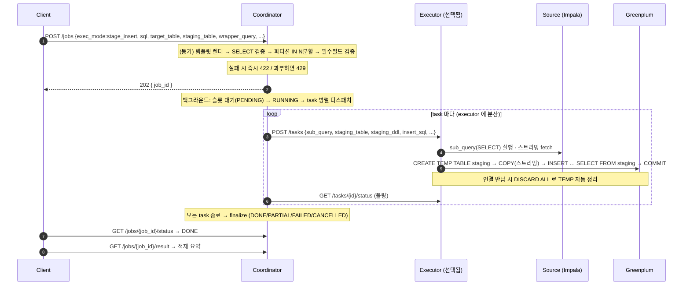

# JOBS.md — 이관 실행 `stage_insert` (`POST /jobs`)

`POST /jobs` 는 소스(Impala)의 대량 데이터를 Greenplum 으로 옮기는 **이관**이다. 이 문서는
그중 **`exec_mode: stage_insert`** 하나만 정리한다 — 소스 SELECT 결과를 Greenplum **staging(TEMP)
테이블에 COPY** 로 실은 뒤 **`INSERT … SELECT FROM staging`** 으로 최종 테이블에 반영하는 2단계
모드다. 소스와 대상이 서로 다른 엔진이거나 컬럼 매핑·복잡한 INSERT 가 필요할 때 쓰는 표준 패턴이다.

- **비동기**: 요청은 접수만 하고 **202 + `job_id`** 를 즉시 반환한다. 실제 실행은 백그라운드에서
  진행되고, 클라이언트는 상태를 폴링한다(§7).
- **데이터는 coordinator 를 거치지 않는다** — executor 가 소스에서 읽어 Greenplum 에 직접 흘린다.
  coordinator 로는 상태·row count 만 흐른다.
- **적재는 append** 다. `stage_insert` 는 `write_mode` 를 적용하지 않는다(§6 참고).
- 전체 설계는 [DESIGN.md §9](DESIGN.md)(적재 방식)·[§18](DESIGN.md)(템플릿), 결과 반환 실행은
  [QUERY.md](QUERY.md) 참고.

---

## 1. 처리 절차



---

## 2. Request JSON

### 2.1 raw 모드 (SQL 직접)

```jsonc
POST /jobs
{
  "exec_mode": "stage_insert",
  "sql": "SELECT user_id, amount, dt FROM sales WHERE dt IN ('2026-07-01','2026-07-02')",
  "partition_column": "dt",                         // 이 컬럼의 IN 목록을 N분할
  "target_table": "public.sales",
  "staging_table": "stg_sales",                     // 필수
  "staging_ddl": "CREATE TEMP TABLE stg_sales (user_id bigint, amount numeric, dt date)",  // 선택
  "wrapper_query": "INSERT INTO public.sales (user_id, amount, dt) SELECT * FROM stg_sales", // 필수 = INSERT
  "parallelism": 4
}
```

> ⚠️ **stage_insert 의 INSERT 문은 `wrapper_query` 에 담는다**(copy 모드의 래퍼 자리와 같은 필드를
> 재사용). `staging_table` 과 `wrapper_query` 둘 다 없으면 `422 STAGE_INSERT_REQUIRES_FIELDS`.
> `staging_ddl` 은 선택 — 비우면 테이블 생성을 건너뛰고 **이미 존재하는** `staging_table` 을 쓴다
> (이 경우 job·파티션별 고유 테이블로 격리를 보장해야 한다).

### 2.2 템플릿 모드 (권장)

SQL 전문 대신 서버 템플릿을 `params` 로 렌더한다. 템플릿이 SELECT / INSERT / STAGING DDL 을
모두 담으므로 요청은 파라미터만 보낸다(§4).

```jsonc
{
  "template_id": "sales_migration",
  "params": { "start_dt": "2026-07-01", "end_dt": "2026-07-07", "regions": ["KR"] }
  // exec_mode/partition_column/target_table/staging_table 등은 manifest 기본값. 요청이 명시하면 요청이 우선.
}
```

### 2.3 날짜 태스크 컬럼 fan-out (stage_insert 전용)

파티션 `IN` 분할 대신 **날짜 하나 = task 하나**로 펼쳐 executor 당 하루씩 맡긴다(일별 배치용).

```jsonc
{
  "template_id": "daily_sales",
  "params": { "region": "KR" },
  "task_column": "dt",          // 날짜 컬럼(partition_column 대체)
  "task_range": [-7, 0]         // 오늘 기준 상대 일수, 양끝 포함 → 오늘 포함 8일 = 8 task
}
```

> `task_range:[-7,0]` + 오늘 → `2026-07-03 … 2026-07-10`(8일). 정확히 7일이면 `[-7,-1]`/`[-6,0]`.
> `partition_column`/`parallelism`/`split_strategy` 는 미사용(task 수 = 날짜 수). 자세히는 DESIGN §18.8.

### 2.4 필드 요약 (stage_insert 관련)

| 필드 | 필수 | 설명 |
|---|---|---|
| `exec_mode` | ✅(`stage_insert`) | 이 모드를 고른다 |
| `sql` | ✅(raw) | 소스 SELECT (템플릿 모드는 렌더로 채움) |
| `partition_column` | ✅ | IN 목록으로 N분할할 컬럼 (fan-out 은 `task_column` 이 대체) |
| `target_table` | ✅ | 최종 적재 대상 |
| `staging_table` | ✅ | staging(보통 TEMP) 테이블명 |
| `wrapper_query` | ✅ | **INSERT … SELECT FROM staging** 문 |
| `staging_ddl` | ✕ | `CREATE TEMP TABLE …`(없으면 기존 staging_table 사용) |
| `template_id` / `params` | ✕ | 템플릿 모드(params 는 **object**) |
| `task_column` / `task_range` | ✕ | 날짜 fan-out 모드 |
| `parallelism` | ✕ | 분할(=task) 수, 1~128 (기본 4) |
| `split_strategy` | ✕ | `contiguous`(기본) \| `round_robin` |
| `sql_dialect` | ✕ | 파싱 방언(기본 hive) |
| `strict_validation` | ✕ | true=단순 SELECT, false=복합 쿼리 허용 |
| `impala_query_options` | ✕ | 소스 SELECT 에만 적용되는 SET 옵션 |
| `username` | ✕ | 이력/감사용 |
| `dry_run` | ✕ | true 면 executor 호출 없이 계획만 200 반환 |

---

## 3. Response

```jsonc
// 접수 성공
202 { "job_id": "job_ab12cd34" }
```

`dry_run:true` 면 실행·저장 없이 **200 + 분할 계획**(각 task 의 `sub_query`·`staging_ddl`·`insert_sql`)을
돌려준다. 실제 실행은 하지 않으므로 만들어질 SQL 을 눈으로 검토할 때 쓴다.

---

## 4. 예제 템플릿: `sales_migration`

`templates/sales_migration/` — 날짜 구간(start_dt~end_dt)의 IN 목록을 자동 생성하는
stage_insert 템플릿.

### `manifest.yml`
```yaml
id: sales_migration
description: 일별 매출 Impala→Greenplum 이관(날짜 구간 파라미터로 IN 목록 자동 생성)
exec_mode: stage_insert
partition_column: dt
target_table: public.sales
staging_table: stg_sales
strict_validation: false
params:
  - {name: start_dt, type: date, required: true}
  - {name: end_dt,   type: date, required: true}
  - {name: regions,  type: list, required: false, default: []}
files:
  select:      select.sql.j2
  staging_ddl: staging_ddl.sql.j2
  insert:      insert.sql.j2
```

### `select.sql.j2` (소스 SELECT)
```sql
SELECT user_id, amount, region, dt
FROM sales
WHERE dt IN ( {{ date_range(start_dt, end_dt) | sql_in }} )

  AND region IN ( {{ regions | sql_in }} )

```

### `staging_ddl.sql.j2` (staging 생성)
```sql
CREATE TEMP TABLE {{ staging_table | sql_ident }} (
  user_id bigint, amount numeric, region text, dt date
)
```

### `insert.sql.j2` (staging → target)
```sql
INSERT INTO {{ target_table | sql_ident }} (user_id, amount, region, dt)
SELECT user_id, amount, region, dt
FROM {{ staging_table | sql_ident }}
```

> 날짜별 fan-out 이 필요하면 `templates/daily_sales/`(SELECT 가 `WHERE dt = {{ task_date }}`
> 로 하루치만 조회)를 참고한다.

---

## 5. executor 의 실제 처리 (`stage_and_insert`)

각 task 는 한 Greenplum 세션(연결) 안에서 다음을 수행한다(`src/executor/backend.py`):

1. 소스(Impala)에 `sub_query`(SELECT) 실행 → **행 단위 스트리밍 fetch**.
2. `CREATE TEMP TABLE staging`(staging_ddl 있으면).
3. 스트리밍 행을 psycopg `COPY` 로 **staging TEMP** 에 적재(파이프라인).
4. `INSERT … SELECT FROM staging`(insert_sql) 실행 → target 반영. `COMMIT`.
5. 연결 반납 시 **`DISCARD ALL`** 로 TEMP staging 자동 정리(다음 task 와 충돌 방지).

- **TEMP staging 은 세션 전용**이라 task 간 격리되고 세션 종료 시 사라진다(명시적 DROP 불필요).
- `impala_query_options` 는 소스 SELECT 에만 적용(INSERT 는 Greenplum).
- **append** 다 — 재실행 멱등이 필요하면 대상 테이블을 job 밖에서 미리 비우거나(TRUNCATE 등) 날짜별
  물리 테이블을 쓴다.

---

## 6. write_mode 주의

`stage_insert` 는 **`write_mode` 를 적용하지 않는다**(항상 append). `overwrite_partitions`(적재 전 파티션
선삭제)는 **copy** 와 **local_stage** 모드에서만 동작한다. 따라서 stage_insert 로 같은 날짜를 두 번
실행하면 **중복 적재**된다 — 멱등이 필요하면 §5 마지막 항목처럼 대상 측에서 처리한다.

---

## 7. 상태 확인 · 재실행

| 엔드포인트 | 설명 |
|---|---|
| `GET /jobs/{job_id}/status` | 진행 상태/진행률(경량, 태스크 제외) — 폴링용 |
| `GET /jobs/{job_id}` | 전체 상태(태스크별 status·rows_written·phase 포함) |
| `GET /jobs/{job_id}/result` | 적재 결과 요약(총 행수·태스크별) |
| `POST /jobs/{job_id}/cancel` | 작업 취소(각 executor 전파). 이미 종료면 409 |
| `POST /jobs/{job_id}/retry` | **실패 파티션만** 재실행 → 새 `job_id` |

종료 상태: `DONE`(전부 성공) / `PARTIAL`(일부 실패) / `FAILED`(전부 실패·fail_fast) / `CANCELLED`.
`PARTIAL`·`FAILED` 는 `retry` 로 실패 task 만 다시 돌릴 수 있다(stage_insert 는 TEMP staging 이 세션
단위라 실패 시 그 세션 staging 도 사라져 깨끗한 상태에서 재시작).

---

## 8. 오류 응답

렌더/검증 실패는 `422 + error_code` 로 즉시(요청-응답 사이클에서) 반환된다.

| 상황 | 상태 | error_code |
|---|---|---|
| 필수 필드(sql·partition_column·target_table) 누락 | 422 | `MISSING_REQUIRED_FIELDS` |
| stage_insert 인데 staging_table/wrapper_query 누락 | 422 | `STAGE_INSERT_REQUIRES_FIELDS` |
| SQL 파싱 실패 / 비-SELECT / 파티션 IN 없음 | 422 | `PARSE_ERROR` / `NOT_A_SELECT` / `NO_PARTITION_IN_CLAUSE` 등 |
| 템플릿 없음 / 파라미터 검증·렌더 실패 | 422 | `TEMPLATE_NOT_FOUND` / `TEMPLATE_PARAM_ERROR` / `TEMPLATE_RENDER_ERROR` |
| fan-out: template_id 없음 / 비-stage_insert / task_range 형식 | 422 | `FANOUT_REQUIRES_TEMPLATE` / `FANOUT_REQUIRES_STAGE_INSERT` / `TASK_RANGE_INVALID` |
| 동시 실행/대기 job 한도 초과 | 429 | (Retry-After 헤더) |

---

## 9. 관련 설정 (executor)

stage_insert 는 소스 읽기 + Greenplum staging/INSERT 를 executor 에서 수행하므로 아래 설정이 관여한다
(`config.properties`).

```properties
# 소스(읽기): Impala 접속 정보
source.type=impala
impala.host=impala-coordinator.example.com

# 대상(staging/INSERT): Greenplum
greenplum.dsn=postgresql://gpadmin:pw@gp-master:5432/warehouse
greenplum.pool_max=0          # GP 커넥션 풀 상한(0=executor.max_concurrent_tasks 와 동일)

# staging 으로의 COPY 튜닝(stage_insert 의 COPY 에도 적용)
copy.batch_size=10000         # COPY 배치 크기(행)
copy.pipeline=true            # 소스 읽기와 GP COPY 를 겹쳐 실행(벽시계 단축)

# 동시성
executor.max_concurrent_tasks=8   # executor 1대 동시 task 수
```

> `impala.host` 와 `greenplum.dsn` 이 둘 다 있어야 실제 백엔드가 뜬다. 없으면
> `MockBackend`(테스트/개발). 템플릿 엔진은 `template.enabled=true` 필요.
