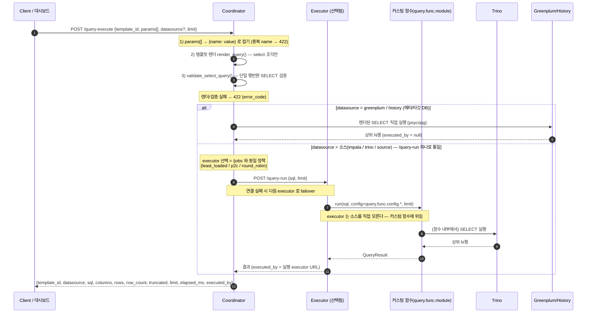

# QUERY.md — 결과 반환 실행 (`POST /query-execute`)

서버에 보관된 **쿼리 템플릿**을 파라미터로 렌더해 `SELECT` 를 만들고, 지정한 데이터소스에
실행해 **결과(상위 N행)를 동기로 돌려받는** API 다. 데이터를 옮기는 이관(`POST /jobs`)과
달리 결과가 coordinator 를 거쳐 클라이언트로 반환되는 **미리보기성 실행**이다.

- 클라이언트는 SQL 전문이 아니라 **`template_id` + `params`(이름-값 항목 배열)** 만 보낸다.
- 클라이언트는 **어떤 executor 가 실행하는지 몰라도 된다** — 소스 실행은 coordinator 가 `/jobs` 와
  동일 정책으로 가장 한가한 executor 를 골라 **`/query-run`(커스텀 함수)** 하나로 위임한다(실패 시 failover).
- 자세한 설계는 [DESIGN.md §18.7](DESIGN.md), 엔진 규약은 [DESIGN.md §18](DESIGN.md) 참고.

---

## "쿼리 실행" 엔드포인트 지도

이 시스템에는 목적이 다른 세 가지 쿼리 실행 표면이 있다. 혼동하지 않도록 정리한다.

| 개념 | 진입 엔드포인트 | 무엇 | 결과 |
|---|---|---|---|
| **A. 이관**(migration) | `POST /jobs` → (executor) `POST /tasks` | 소스 SELECT → **Greenplum 적재**(대량 데이터 이동) | job_id·상태·row count (**행 반환 ✕**) |
| **B. 미리보기/연결 테스트** | `POST /datasources/{name}/query` | **임의 SQL** 을 built-in 드라이버로 실행(운영 점검용) | 상위 N행 |
| **C. 결과 반환 실행**(이 문서) | `POST /query-execute` → (executor) `POST /query-run` | **템플릿** 렌더 SELECT 를 실행 | 상위 N행 |

- **C(query-execute)의 소스 실행은 `/query-run` 하나로 통일**돼 있다 — impala/trino 구분 없이 모든
  소스는 executor 의 커스텀 함수(`query.func.module`)에 위임한다. `greenplum`/`history` 만
  coordinator 가 직접(psycopg) 실행한다(메타/타깃 DB, 커스텀 함수 불필요).
- **B(미리보기)** 는 C 와 별개다 — 임의 SQL 을 built-in 드라이버(impala/greenplum/history)로
  실행하는 **운영 점검 도구**이며, 대시보드 `데이터소스` 탭이 이를 쓴다. 앱 로직의 쿼리 실행은 C 를 쓴다.

---

## 실행 절차



---

## 예제 템플릿: `order_search`

`templates/order_search/` 에 포함된 query-execute 전용 예제다. **WHERE 절에
지역 `IN` 목록(N개)** 과 **주문일 `BETWEEN` 날짜 구간**을 조합해 주문을 조회한다.

### `manifest.yml`

```yaml
# query-execute 전용 예제 템플릿 — 주문 조회.
id: order_search
description: 주문 조회(query-execute 예제) — region IN 목록 + 주문일 BETWEEN 구간

# query-execute 는 select 조각만 렌더하지만, manifest 규약상 exec_mode 를 둔다(copy).
# partition_column 등 이관용 스칼라는 query-execute 경로에서 쓰이지 않는다.
exec_mode: copy
strict_validation: false            # 렌더 SELECT 에 ORDER BY 등이 있어 lenient 로 둔다

# 파라미터 스키마 — 필수/타입/기본값을 선언한다. 렌더 전 검증에 쓰인다.
params:
  - {name: regions,    type: list,   required: true}            # IN 목록(N개 지역 코드)
  - {name: start_dt,   type: date,   required: true}            # BETWEEN 시작일(YYYY-MM-DD)
  - {name: end_dt,     type: date,   required: true}            # BETWEEN 종료일(YYYY-MM-DD)
  - {name: min_amount, type: number, required: false, default: 0}  # 최소 주문금액(0=조건 생략)

# role → 조각 파일 매핑. query-execute 는 select 만 있으면 된다.
files:
  select: select.sql.j2
```

| 파라미터 | 타입 | 필수 | 기본값 | 설명 |
|---|---|---|---|---|
| `regions` | list | ✅ | — | `region IN (...)` 에 전개될 지역 코드 목록(N개) |
| `start_dt` | date | ✅ | — | `order_dt BETWEEN` 시작일(YYYY-MM-DD) |
| `end_dt` | date | ✅ | — | `order_dt BETWEEN` 종료일(YYYY-MM-DD) |
| `min_amount` | number | ✕ | `0` | 최소 주문금액(0 이면 조건 생략) |

### 템플릿 (`select.sql.j2`)

```sql
SELECT order_id, region, order_dt, amount
FROM orders
WHERE region IN ( {{ regions | sql_in }} )
  AND order_dt BETWEEN {{ start_dt | sql_str }} AND {{ end_dt | sql_str }}

  AND amount >= {{ min_amount | sql_num }}

ORDER BY order_dt, order_id
```

파라미터는 반드시 필터를 거쳐 안전한 리터럴로 렌더된다(SQL 인젝션 방지): `regions` 는
`sql_in`(콤마 구분 리터럴, 빈 목록은 안전한 `NULL`), 날짜 경계는 `sql_str`(작은따옴표
이스케이프), `min_amount` 는 `sql_num`(숫자만 허용, 비숫자는 렌더 실패 → 422).

---

## Request JSON

```jsonc
POST /query-execute
Content-Type: application/json

{
  "template_id": "order_search",
  "params": [
    { "name": "regions",    "value": ["KR", "US", "JP"] },  // IN 목록(N개)
    { "name": "start_dt",   "value": "2026-01-01" },        // BETWEEN 시작
    { "name": "end_dt",     "value": "2026-03-31" },        // BETWEEN 종료
    { "name": "min_amount", "value": 1000 }                 // 선택(생략 가능)
  ],
  "datasource": "trino",   // 생략 시 서버 source.type. 이관은 Impala, 실행은 Trino 로 나눌 때 명시
  "limit": 100             // 반환 최대 행수(1~10000, 기본 100)
}
```

> **이관 소스와 분리**: `datasource` 를 생략하면 전역 `source.type` 을 따른다. "이관(`/jobs`)은
> Impala, query-execute 는 Trino" 처럼 나누려면 `source.type=impala` 로 두고 요청에
> `"datasource": "trino"` 를 명시한다. query-execute 의 trino 실행은 executor 가 직접 접속하지
> 않고 **커스텀 함수(`query.func.module`)에 위임**한다(아래 [커스텀 실행 함수](#커스텀-실행-함수) 참고).

### 위 요청이 렌더하는 SQL

```sql
SELECT order_id, region, order_dt, amount
FROM orders
WHERE region IN ( 'KR', 'US', 'JP' )
  AND order_dt BETWEEN '2026-01-01' AND '2026-03-31'
  AND amount >= 1000.0
ORDER BY order_dt, order_id
```

---

## Response JSON

```jsonc
{
  "template_id": "order_search",
  "datasource": "trino",
  "sql": "SELECT order_id, region, order_dt, amount FROM orders WHERE region IN ( 'KR', 'US', 'JP' ) AND order_dt BETWEEN '2026-01-01' AND '2026-03-31' AND amount >= 1000.0 ORDER BY order_dt, order_id",
  "columns": ["order_id", "region", "order_dt", "amount"],
  "rows": [
    [10001, "KR", "2026-01-03", 25000],
    [10002, "US", "2026-01-05", 18000]
  ],
  "row_count": 2,
  "truncated": false,   // limit 초과로 잘렸는지
  "limit": 100,
  "elapsed_ms": 42.7,
  "executed_by": "http://executor-3:8001"   // 실제 실행 executor(직접 실행이면 null)
}
```

- `columns`/`rows`/`row_count`/`truncated`/`elapsed_ms` 는 데이터소스 미리보기(`/datasources`)와
  동일한 shape 이다.
- `sql` 은 감사·재현용으로 렌더된 SELECT 를 그대로 싣는다.
- `executed_by` 는 **실제 쿼리를 실행한 executor URL**(관측용)이다. impala/trino 는 coordinator 가
  고른 executor URL 이고(연결 실패로 failover 됐다면 최종 성공한 executor), greenplum/history 는
  coordinator 가 직접 실행하므로 `null` 이다. 클라이언트는 executor 를 **지정하지 않지만**, 어느
  노드가 실행했는지는 이 필드로 확인할 수 있다.

---

## curl 예시

```bash
curl -s localhost:8088/query-execute -H 'content-type: application/json' -d '{
  "template_id": "order_search",
  "params": [
    {"name": "regions",    "value": ["KR", "US", "JP"]},
    {"name": "start_dt",   "value": "2026-01-01"},
    {"name": "end_dt",     "value": "2026-03-31"},
    {"name": "min_amount", "value": 1000}
  ],
  "datasource": "trino",
  "limit": 100
}'
```

`min_amount` 를 빼면 금액 조건 없이 지역·날짜 구간만으로 조회한다:

```bash
curl -s localhost:8088/query-execute -H 'content-type: application/json' -d '{
  "template_id": "order_search",
  "params": [
    {"name": "regions",  "value": ["KR"]},
    {"name": "start_dt", "value": "2026-01-01"},
    {"name": "end_dt",   "value": "2026-01-31"}
  ],
  "datasource": "trino"
}'
```

---

## 대시보드에서 실행 (`쿼리 실행` 탭)

coordinator 대시보드(`/`)의 **`쿼리 실행`** 탭에서 브라우저로 바로 실행할 수 있다.

1. **템플릿** 을 고르면 그 템플릿의 파라미터 스키마대로 입력 필드가 생성된다(`list` 타입은
   쉼표로 구분해 입력: `KR, US, JP`).
2. **데이터소스** 를 고른다 — `소스 (커스텀 함수)`(기본, 소스 실행을 `/query-run` 커스텀 함수에 위임) /
   `greenplum` / `history`(coordinator 직접). 미리보기 탭의 built-in 소스 목록과는 다르다.
3. **상위 N행** 과 함께 **실행** 을 누르면 `POST /query-execute` 가 호출되고, 결과 표와 메타가
   표시된다 — 메타에는 행수·소요시간과 함께 **`실행 executor: <URL>`**(= `executed_by`)이 나온다.

렌더/검증/실행 오류는 결과 영역에 `error_code`·메시지로 표시된다.

---

## 설정 (coordinator · executor)

"이관은 Impala, query-execute 는 Trino, 적재는 Greenplum" 라우팅을 쓰려면 아래처럼 설정한다
(`config.properties`).

### Coordinator

```properties
# 쿼리 템플릿 엔진 — query-execute 가 템플릿을 렌더하려면 반드시 활성.
template.enabled=true
template.dir=templates      # 템플릿 루트(운영은 배포 경로)

# 프록시 대상 executor 목록(쉼표 구분). query-execute 의 impala/trino 실행은 이 중에서 고른다.
coordinator.executors=http://exec1:8001,http://exec2:8001

# executor 선택 정책 — query-execute 도 /jobs 와 동일하게 이 값을 따른다.
#   round_robin(기본) | least_loaded(가장 한가) | p2c(HA 권장)
coordinator.executor_select=p2c
```

> `template.enabled=false` 면 `/query-execute` 는 404, `coordinator.executors` 가 비어 있으면
> impala/trino 실행은 400 이다(greenplum/history 직접 실행은 executor 불필요).

### Executor

query-execute 의 **Trino 실행은 executor 가 직접 접속하지 않고, 설정으로 지정한 커스텀 함수에
위임**한다. 이관(`/jobs`)은 그대로 Impala 로 읽고 Greenplum 에 적재한다.

```properties
# 이관(/jobs)의 읽기 소스 — Impala (#2).
source.type=impala

# Impala (source, 이관 읽기용)
impala.host=impala-coordinator.example.com
impala.port=21050
impala.database=default
impala.user=etl

# Greenplum (target, 이관 적재 대상 = INSERT #3)
greenplum.dsn=postgresql://gpadmin:pw@gp-master:5432/warehouse

# query-execute 의 trino 실행 = 커스텀 함수 위임 (#1). executor 는 Trino 를 직접 모른다.
#   query.func.module   : 실행 함수 dotted path
#   query.func.config.* : 함수에 넘길 자유 설정 dict(접두어를 뗀 키로 통째 전달, 값은 문자열)
query.func.module=customs.query_funcs.trino_runner:run
query.func.config.host=trino.example.com
query.func.config.port=8080
query.func.config.user=query-executor
query.func.config.catalog=hive
query.func.config.schema=default
query.func.config.http_scheme=http
# 임의 파라미터도 한 줄만 추가하면 그대로 함수에 전달된다(YAML/코드 수정 불필요):
query.func.config.statement_timeout_s=60
```

정리하면:

| 기능 | 붙는 곳 | 설정 |
|---|---|---|
| 이관 SELECT(`/jobs`) | Impala | `source.type=impala` + `impala.*` |
| 이관 INSERT(`/jobs`) | Greenplum | `greenplum.dsn` |
| query-execute | Trino(커스텀 함수) | 요청 `datasource:"trino"` + `query.func.module` + `query.func.config.*` |

---

## 커스텀 실행 함수

query-execute 의 `datasource:"trino"` 요청은 executor 가 **`query.func.module` 로 지정한 외부
Python 함수**에 실행을 위임한다. 프레임워크는 Trino 드라이버를 전혀 모르며, 연결·실행·형변환은
전부 이 함수 책임이다. 조직 표준(게이트웨이/래퍼/커넥션 풀 등)에 맞춰 이 함수만 바꾸면 된다.

### 함수 계약

```python
from core.dbprobe import QueryResult      # 또는 동일 키 dict 반환 허용

def run(sql: str, *, config: dict, limit: int) -> QueryResult:
    """sql 을 config 백엔드에 실행해 상위 limit 행을 반환.
    config : query.func.config.* 를 모은 dict(값은 모두 문자열 — 함수 안에서 형변환).
    반환    : QueryResult(columns, rows, row_count, truncated, elapsed_ms) 또는 동일 키 dict.
    """
```

- **로딩**: `query.func.module` 은 `module:func` 또는 `module.func` dotted path. executor 가 첫
  호출에서 `importlib` 로 import 후 캐시한다(잘못된 경로/미호출가능 → 502).
- **반환 shape**: `QueryResult` 또는 `{columns, rows, row_count, truncated, elapsed_ms}` dict.
  `limit` 초과(`truncated`) 판정은 함수 책임(예제는 `fetchmany(limit+1)`).

### 참조 구현

`customs/query_funcs/trino_runner.py` 에 Trino 예제 구현이 있다(표준 `dbprobe._shape`
로 정형). 그대로 쓰거나, 본문을 조직 표준 접속으로 바꿔 사용한다.

**대화형 login() 처리**: 사내 인증 모듈의 `login()` 이 `input()`/`getpass()` 로 자격증명을
묻는 대화형 함수라면 `query.func.config.login_module=mycorp.auth:login` 으로 지정한다.
executor 는 터미널 없는 데몬이라 프롬프트를 그대로 두면 EOFError/블록이 나므로, 예제의
`_login_noninteractive()` 가 호출 동안만 `builtins.input`/`getpass.getpass`/`sys.stdin` 을
config 의 `user`/`password` 값으로 바꿔치기해 입력을 공급한다(입력 순서: input 1회차=user,
2회차=password, getpass=password — 사내 모듈의 질문 순서가 다르면 answers 목록만 수정).
로그인 결과는 프로세스당 1회만 만들어 캐시하고(실패 시 미캐시 → 다음 요청에서 재시도),
전역 패치는 락으로 직렬화 후 finally 로 원복한다.

**로깅**: 커스텀 함수는 executor 프로세스 안에서 실행되므로, 표준 `logging` 을 쓰면 별도
설정 없이 executor 의 로그 파일(`executor-<포트>.log`, WARNING 이상은 `*-warn.log`)에
그대로 남는다 — 파일 상단에 `logger = logging.getLogger(__name__)` 를 두고 쓴다.
`print()` 는 로그 파일에 기록되지 않으니 쓰지 말 것. 오류는 `logger.exception(...)` 으로
스택 트레이스까지 남긴 뒤 **다시 raise** 한다(executor 가 502 로 응답하며, executor 도
실패 시 트레이스를 warn 로그에 남긴다). 접속 대상·실패한 SQL 앞부분·행수/경과 같은 추적
정보를 남기되 **비밀값(password 등)은 절대 로그에 넣지 않는다** — 예제 `trino_runner.py`
의 `logger.info`/`logger.exception` 사용을 참고.

**이벤트 루프**: 커스텀 함수(또는 그 의존 라이브러리)가 `nest_asyncio` 처럼 이벤트 루프를
패치하는 코드를 쓰면 uvloop(Cython 루프)에서는 `can't patch loop of type uvloop.Loop` 로
실패한다. 그래서 executor 는 uvicorn 을 `loop="asyncio"`(순수 파이썬 루프)로 기동한다
(`executor/__main__.py`). executor 의 데이터 경로는 스레드에서 돌고 루프는 제어 트래픽만
처리하므로 성능 영향은 무시할 수준이다(coordinator 는 커스텀 함수를 실행하지 않아 해당 없음).

```python
# customs/query_funcs/trino_runner.py (발췌)
from core.dbprobe import QueryResult, _shape
import time, trino

def run(sql, *, config, limit):
    conn = trino.dbapi.connect(host=config["host"], port=int(config.get("port", 8080)),
                               user=config.get("user", "query-executor"),
                               catalog=config.get("catalog", "hive"),
                               schema=config.get("schema", "default"))
    started = time.perf_counter()
    cur = conn.cursor(); cur.execute(sql)
    cols = [d[0] for d in cur.description]
    return _shape(cols, cur.fetchmany(limit + 1), limit, started)
```

---

## 오류 응답

렌더/검증 실패는 `422 + error_code`(이관 `/jobs` 와 동일 규약)로 돌려준다.

| 상황 | 상태 | error_code / detail |
|---|---|---|
| 필수 파라미터 누락(예: `end_dt`) | 422 | `TEMPLATE_PARAM_ERROR` |
| 같은 `name` 중복 | 422 | `DUPLICATE_PARAM` |
| 없는 템플릿 | 422 | `TEMPLATE_NOT_FOUND` |
| `min_amount` 에 비숫자 전달 | 422 | `TEMPLATE_RENDER_ERROR` |
| 템플릿 엔진 비활성(`template.enabled=false`) | 404 | — |
| impala/trino 인데 executor 미설정 | 400 | `executor 가 설정되지 않았습니다` |
| 데이터소스 접속/SQL 오류 | 502 | 원인 메시지 |

---

## 사용 가능한 템플릿 조회

```bash
curl -s localhost:8088/templates
# {"enabled": true, "templates": [
#   {"template_id": "order_search", "description": "주문 조회(query-execute 예제) ...",
#    "params": [{"name": "regions", "type": "list", "required": true, ...}, ...]}, ...]}
```
