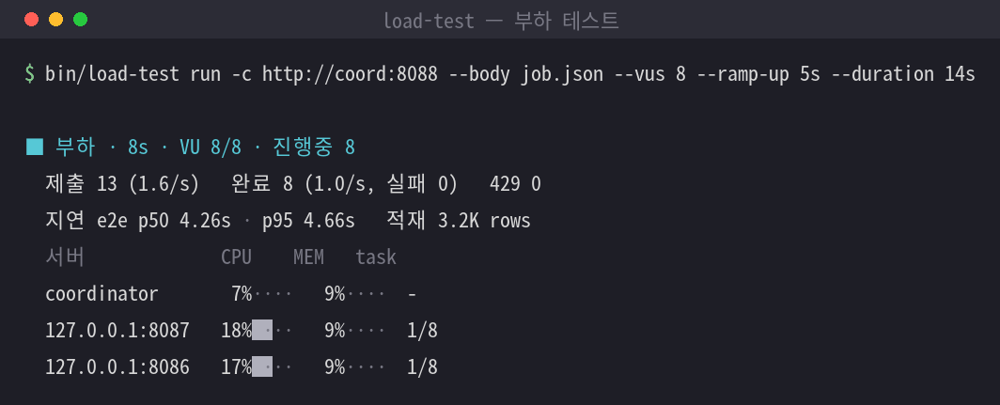
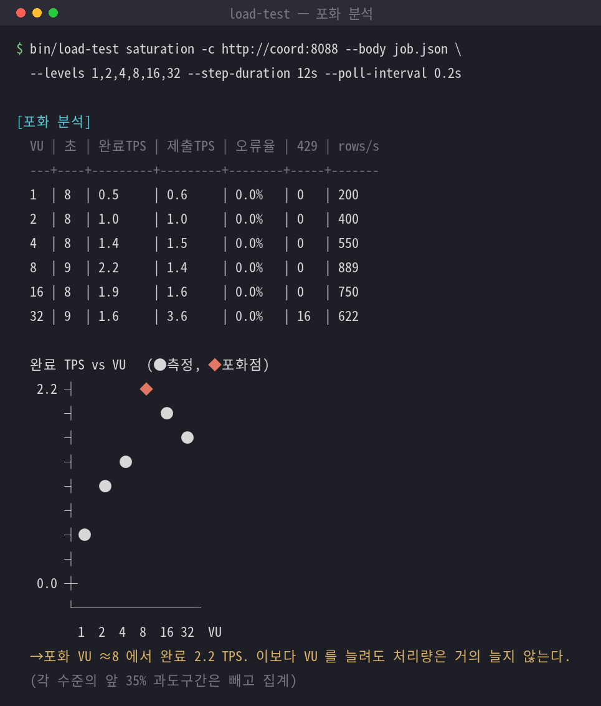
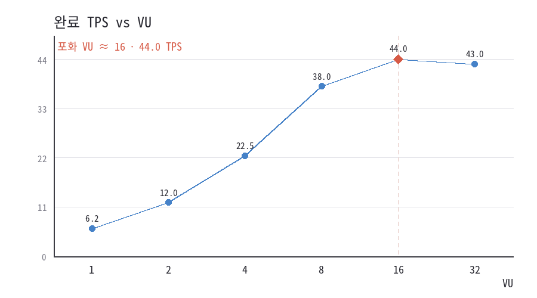

# load-test — coordinator API 부하 테스트

가상 사용자(VU)를 ramp-up 이나 단계 곡선에 맞춰 늘려 가며 coordinator API 를 부르고, 처리량과
지연을 서버별 CPU·메모리와 함께 한 화면에 요약하는 CLI 다. 실행은 `bin/load-test` 로 한다.

운영 관점의 튜닝 절차와 결과 해석은 [docs/OPERATOR.md](../../../docs/OPERATOR.md) 의
"부하를 걸어 한도 확인하기" 절에 있다. 이 문서는 도구의 사용법과 설정 파일 형식을 모아 둔다.

## 무엇을 재는가

VU 하나는 **closed loop** 다. 요청을 보내고 그 요청이 **완료될 때까지 기다린 뒤** 다음 요청을
보낸다. 그래서 동시에 진행 중인 요청 수가 VU 수를 넘지 않고, VU 를 늘려 가며 서버가 어디서
포화되는지(429 가 나기 시작하는 지점, 완료 TPS 가 더 오르지 않는 지점)를 찾는다.

무엇을 "완료"로 보는지는 요청의 **type** 이 정한다.

| type | 완료 판정 | 결과 |
|---|---|---|
| `async` | 접수 응답의 id 로 상태 URL 을 폴링해 종료 상태 확인 | 제출 TPS·완료 TPS, e2e 지연, 서버 대기·실행 시간 |
| `sync` | 응답을 받는 순간이 완료 | TPS 하나와 응답 지연 하나 |

`async` 는 `POST /jobs` 처럼 202 로 바로 돌아오고 실제 처리는 뒤에서 도는 요청이다. 도구가
`GET /jobs/{id}/status` 를 종료 상태(DONE·PARTIAL·FAILED·CANCELLED)까지 폴링하고 그중 DONE 만
성공으로 센다. `sync` 는 `POST /query-execute` 처럼 응답이 곧 결과인 요청이다. `/jobs` 의
`dry_run` 도 sync 다.

`--type` 을 주지 않으면 경로가 `/jobs` 인 요청만 async 이고 나머지와 dry_run 은 sync 다. 응답을
보고 추측하지 않고 명시하는 이유는 설정 실수를 드러내기 위해서다 — async 로 의도한 요청이 id 없이
200 을 받으면 성공으로 묻히지 않고 `missing_id` 오류로 잡힌다.

## 하위 명령

```bash
bin/load-test wizard          # 질문에 답하며 명령을 구성(처음 쓸 때 권장)
bin/load-test plan  ...       # 요청 없이 시간대별 VU 수만 표로 확인
bin/load-test run   ...       # 실제로 부하를 건다
```

`wizard` 는 대상 → 요청 → 부하 곡선 → 대기 → 자원 수집 → 결과 파일 순으로 필요한 것만 묻는다
(sync 를 고르면 폴링 규칙은 묻지 않는다). 질문마다 Enter 로 기본값을, `?` 로 설명을 볼 수 있다.
끝에서 완성된 명령을 보여 주고 바로 실행하거나 시나리오 YAML 로 저장한다. 실행은 화면에 보인 그
명령 그대로 하므로, 한 번 받아 둔 명령은 다음부터 마법사 없이 쓴다.

## 빠른 예

```bash
# 요청 없이 VU 곡선만 먼저 확인
bin/load-test plan --vus 20 --ramp-up 60s --duration 10m

# async: /jobs 에 20 VU 까지 60초에 걸쳐 올리고 10분 동안
bin/load-test run -c http://coord:8088 --body job.json \
    --vus 20 --ramp-up 60s --duration 10m --out result.json --csv timeline.csv

# 계단형: 5 VU 로 2분, 20 VU 로 3분, 30초에 걸쳐 0 으로
bin/load-test run -c http://coord:8088 --body job.json --stages 30s:5,2m:5,1m:20,3m:20,30s:0

# sync: 결과 미리보기 API 에 10 VU 로 5분
bin/load-test run -c http://coord:8088 --type sync --path /query-execute --body preview.json \
    --vus 10 --ramp-up 30s --duration 5m
```

## 요청 본문과 치환

`--body` 는 요청에 실어 보낼 JSON(또는 YAML)이다. 문자열 안의 자리표시자가 요청마다 치환된다.

| 자리표시자 | 값 |
|---|---|
| `${vu}` | VU 번호 |
| `${iter}` | 그 VU 의 반복 번호 |
| `${seq}` | 전체 일련번호 |
| `${uuid}` | 무작위 UUID(hex) |
| `${run_id}` | 이번 실행의 id |
| `${now:%Y%m%d}` | 현재 시각(형식 지정) |
| `${choice:a,b,c}` | 목록 중 무작위 하나 |
| `${randint:1-9}` | 범위 안 무작위 정수 |

예를 들어 `"target_table": "dwtemp.load_${vu}"` 로 VU 마다 대상 테이블을 나눈다. 문자열 전체가
`${vu}`·`${iter}`·`${seq}`·`${randint:..}` 하나뿐이면 정수로 들어간다(`"parallelism": "${vu}"`).

## 시나리오 파일

자주 쓰는 옵션은 시나리오 파일로 묶어 `--scenario` 로 준다. **JSON 과 YAML 을 모두 지원한다**
(확장자가 `.json` 이면 JSON 으로 읽는다). 키 이름은 명령행 옵션에서 앞의 `--` 를 떼고 `-` 를 `_` 로
바꾼 것이며(`--ramp-up` → `ramp_up`), 요청 명세만은 `request:` 블록으로 묶는다. **명령행 값이
파일보다 우선**하므로, 파일로 기본을 두고 VU 수 같은 값만 명령행으로 덮어쓸 수 있다.

본문(`body`) 경로는 시나리오 파일 기준 상대경로다.

### YAML 예 — async `/jobs`

```yaml
coordinator: http://coord:8088
request:
  type: async
  method: POST
  path: /jobs
  body: job.json
  poll:                    # async 에서만. 생략한 항목은 /jobs 기본값
    path: /jobs/${id}/status
    id_field: job_id
    status_field: status
    terminal: [DONE, PARTIAL, FAILED, CANCELLED]
    success: [DONE]
    cancel_path: /jobs/${id}/cancel   # '' 이면 멈출 때 취소하지 않는다
vus: 20
ramp_up: 60s
duration: 10m
poll_interval: 2s
out: result.json
csv: timeline.csv
```

### JSON 예 — async `/jobs`

같은 설정을 JSON 으로 쓰면 이렇다.

```json
{
  "coordinator": "http://coord:8088",
  "request": {
    "type": "async",
    "method": "POST",
    "path": "/jobs",
    "body": "job.json",
    "poll": {
      "path": "/jobs/${id}/status",
      "id_field": "job_id",
      "status_field": "status",
      "terminal": ["DONE", "PARTIAL", "FAILED", "CANCELLED"],
      "success": ["DONE"],
      "cancel_path": "/jobs/${id}/cancel"
    }
  },
  "vus": 20,
  "ramp_up": "60s",
  "duration": "10m",
  "poll_interval": "2s",
  "out": "result.json",
  "csv": "timeline.csv"
}
```

```bash
bin/load-test run --scenario scenario.json          # JSON
bin/load-test run --scenario scenario.json --vus 40  # 파일을 두고 VU 만 덮어쓰기
```

### JSON 예 — sync `/query-execute`

응답이 곧 결과인 조회형 요청은 sync 로 둔다. 성공으로 볼 HTTP 코드는 `success_status` 로 좁힌다
(기본은 2xx 전체, `"2xx,3xx"` 처럼 리다이렉트까지 성공으로 볼 수도 있다).

```json
{
  "coordinator": "http://coord:8088",
  "request": {
    "type": "sync",
    "method": "POST",
    "path": "/query-execute",
    "body": "q.json",
    "success_status": "200"
  },
  "vus": 10,
  "ramp_up": "30s",
  "duration": "5m"
}
```

## 부하 곡선

두 가지로 지정한다. 둘은 함께 쓸 수 없다.

- **ramp-up**: `--vus 20 --ramp-up 60s --duration 10m`. 60초에 걸쳐 0→20 으로 올린 뒤 유지한다.
  `duration` 은 ramp-up 을 포함한 전체 시간이다.
- **단계**: `--stages 30s:5,2m:5,1m:20,3m:20,30s:0`. 각 단계는 그 시간 동안 목표 VU 수까지 선형으로
  이동한다. 계단·스파이크·감소를 표현한다.

`--iterations N` 으로 VU 당 요청 횟수에 상한을 둘 수 있고, `--duration` 없이 이것만으로 끝낼 수도
있다. `plan` 으로 실제 곡선을 미리 본다.

## 실행 중 화면

실행하는 동안 화면(stderr)에 라이브 패널이 1초마다 제자리에서 갱신된다. 아래는 coordinator 한 대와
executor 두 대를 띄우고 실제로 돌려 캡처한 화면이다.



단계별로는 이렇게 바뀐다. 먼저 부하를 걸기 전 기준선을 재는 동안은 카운트다운만 보인다.

```text
■ 기준선 수집 중 · 8초 남으면 부하를 시작합니다
```

부하가 시작되면 진행·처리량·지연과 서버별 자원이 한 화면에 함께 나온다.

```text
■ 부하 · 2m03s · VU 18/20 · 진행중 18
  제출 1,238 (10.0/s)   완료 1,156 (9.0/s, 실패 6)   429 34
  지연 e2e p50 41.00s · p95 1m28.0s   적재 183.4M rows
  서버             CPU    MEM   task
  coordinator      22%█···  34%█···  -
  10.0.0.11:8001   71%███·  58%██··  8/8
  10.0.0.12:8001   69%███·  55%██··  7/8
```

Ctrl-C 를 누르거나 시간이 다 되면 drain 단계로 바뀌고, 남은 요청이 빠지면서 자원이 내려가는 것이
보인다(맨 윗줄에 `(drain)` 이 붙고 목표 VU 는 0 이다).

```text
■ 부하(drain) · 10m05s · VU 3/0 · 진행중 3
  제출 1,238 (0.0/s)   완료 1,156 (0.0/s, 실패 6)   429 34
  지연 e2e p50 41.00s · p95 1m28.0s   적재 183.4M rows
  서버             CPU    MEM   task
  coordinator      12%····  33%█···  -
  10.0.0.11:8001   18%█···  50%██··  2/8
  10.0.0.12:8001   15%█···  48%██··  1/8
```

윗줄은 경과 시간·현재/목표 VU 수·진행 중 요청 수, 그다음 줄은 제출/완료 TPS(최근 10초 기준)·429,
지연 줄은 p50/p95 와 누적 적재 rows 다. `CPU`·`MEM` 은 사용률 값과 네 칸짜리 막대(`█`=참, `·`=빔),
`task` 는 executor 의 `실행중/상한` 이다. sync 요청이면 둘째 줄이 요청·성공·실패로 바뀌고 폴링 관련
값은 빠진다.

터미널이 아니면(로그 파일·크론) 같은 내용을 한 줄 요약으로 30초마다 새 줄로 남긴다.
`--no-progress` 로 끄면 화면 출력만 사라지고 마지막 요약과 결과 파일은 그대로 나온다. `--no-sample`
로 자원 수집을 끄면 패널의 서버 표는 빠지고 진행·TPS 만 나온다.

## 결과 읽기

async 는 TPS 가 둘이다. **제출 TPS** 는 초당 접수 건수, **완료 TPS** 는 초당 종료가 확인된 건수로
서버가 실제로 처리한 양이다. 비동기 API 라 제출 TPS 는 얼마든지 높게 나오므로 용량 판단은 완료
TPS 로 한다. sync 는 응답이 곧 완료라 TPS 와 응답 지연이 하나씩만 나온다.

지연은 도구가 잰 e2e(제출→종료 확인)와, 서버 타임스탬프로 잰 대기 시간(created→started, 실행
슬롯을 기다린 시간)·실행 시간(started→finished)으로 나뉜다. 대기 시간이 늘기 시작하면
`max_concurrent_jobs` 에 닿은 것이다.

**429 는 오류가 아니라 포화 신호**다. admission 한도에 닿았다는 뜻이라 오류율에서 빼고 따로 센다.
'포화 신호' 에 처음 429 가 난 시점과 그때의 VU 수가 나온다.

`--out` 의 JSON 에는 설정·요약·시계열·자원 표본이 모두 들어 있어 두 실행을 나중에 비교할 수 있고,
`--csv`(초 단위 시계열)와 `--samples-csv`(서버 자원 표본)는 엑셀에서 바로 열린다.

## 포화점 찾기 (saturation)

VU 를 늘리면 완료 TPS 가 함께 오르다가, 어느 지점부터는 VU 를 더 얹어도 TPS 가 늘지 않고 지연만
길어진다. 그 꺾이는 지점이 **saturation point(무릎점)** 이고, 서버가 그 워크로드에서 낼 수 있는
실효 처리량의 상한이다. `saturation` 명령이 VU 를 계단으로 올리며 이 곡선을 그려 준다.

```bash
bin/load-test saturation -c http://coord:8088 --body job.json \
    --levels 1,2,4,8,16,32 --step-duration 60s \
    --chart saturation.png --saturation-csv saturation.csv --out result.json
```

`--levels` 의 각 VU 수준을 `--step-duration` 만큼 유지하며, 수준이 오른 직후의 과도구간(기본 앞
30%, `--warmup` 으로 조정)을 버리고 정상상태 TPS 를 잰다. 정상상태를 보려면 step 을 넉넉히(보통
30초~2분) 준다. 끝나면 요약에 `[포화 분석]` 이 붙는다.

```text
[포화 분석]
  VU | 초 | 완료TPS | 제출TPS | 오류율 | 429 | rows/s
  ---+----+---------+---------+--------+-----+--------
  1  | 42 |     6.2 |     6.3 |   0.0% | 0   |  2,480
  2  | 42 |    12.0 |    12.2 |   0.0% | 0   |  4,800
  4  | 42 |    22.5 |    22.9 |   0.0% | 0   |  9,000
  8  | 42 |    38.0 |    38.6 |   0.0% | 0   | 15,200
  16 | 42 |    44.0 |    46.0 |   1.2% | 3   | 17,600
  32 | 42 |    43.0 |    48.0 |   4.0% | 34  | 17,200

  완료 TPS vs VU   (● 측정, ◆ 포화점)
  44.0 ┤             ◆  ●
       ┤          ●
       ┤       ●
       ┤    ●
   0.0 ┼ ●
       └──────────────────
         1  2  4  8  16 32  VU
  → 포화 VU ≈ 16 에서 완료 44.0 TPS. 이보다 VU 를 늘려도 처리량은 거의 늘지 않는다.
```

무릎점은 이웃한 두 VU 수준 사이에서 처리량 증가율이 5% 아래로 떨어지는 첫 지점으로 잡는다(TPS 가
오히려 줄면 그 앞 수준). 측정 범위 안에서 끝까지 증가하면 "아직 포화 안 됨"으로 보고하니 VU 를 더
높여 다시 측정한다.

아래는 실제로 돌려 캡처한 화면이다. coordinator 의 동시 job 수를 8 로 제한한 데모 클러스터라, VU 를
8 위로 올려도 완료 TPS 가 더 오르지 않고 VU 32 에서 429(용량 초과)가 나타난다.



`--chart` 로 그린 PNG 곡선은 아래처럼 나온다(`.svg` 로 주면 Pillow 없이 그린다).



포화 분석은 `saturation` 명령뿐 아니라 **모든 `run` 결과에도** 자동으로 붙는다. `--stages` 나
ramp 로 VU 를 여러 수준 거친 실행이면 그 시계열을 수준별로 묶어 같은 표·곡선을 낸다. 다만 각 수준을
충분히 유지한 계단 부하라야 곡선이 안정적이므로, 포화점만 볼 때는 `saturation` 명령이 낫다.

## 서버 자원 수집

테스트하는 동안 `GET /cluster` 를 `--sample-interval`(기본 5초)마다 불러 coordinator 와 모든
executor 의 CPU·메모리·task 수를 모아 결과에 서버별 표로 붙인다. 부하 전 `--baseline`(기본 10초)
동안 먼저 재 두므로 '기준CPU'·'CPU평균' 을 비교하면 부하로 얼마나 올랐는지 보인다. `/cluster` 가
없는 대상(coordinator 가 아닌 외부 서버 등)이면 `--no-sample` 로 끈다.

## 멈출 때와 안전장치

- **Ctrl-C 한 번**: 새 요청을 멈추고 `--drain-timeout`(기본 5분) 동안 진행 중인 요청을 기다린 뒤
  요약을 낸다. **두 번**: 기다리지 않는다. 그때까지 끝나지 않은 async 요청은 `--on-stop`
  `cancel`(기본)이면 취소를 보내고 `abandon` 이면 그대로 두며, 어느 쪽이든 ABANDONED 로 센다.
- **실제로 적재한다.** dry_run 이 아닌 `/jobs` 요청이면 시작 전에 대상과 부하 곡선을 보여 주고
  확인을 받는다(읽기 전용 sync 요청은 묻지 않는다). 비대화형이면 `--yes` 가 있어야 시작한다.
  `append` 는 반복마다 중복 적재되므로 부하용 대상 테이블을 따로 두는 것이 안전하다.
- **`--dry-run-body`**: 본문에 `dry_run=true` 를 넣어(sync 로) executor 없이 coordinator 의 검증·
  분할 경로만 부하를 건다.
- **`--max-error-rate 0.05`**: 오류율이 넘으면 종료 코드 3 으로 끝난다. 정기 점검에서 성능 회귀를
  판정할 수 있다.

허가 없는 외부 서비스에 부하를 거는 것은 사실상 공격이다. 대상은 반드시 본인이 운영·소유하거나
부하 테스트 허가를 받은 서버여야 한다.

## HTTP 타임아웃

기본값이 type 마다 다르다. async 는 접수 응답만 기다리므로 30초이고 긴 대기는 `--job-timeout`(기본
1시간)이 맡는다. sync 는 요청 하나가 쿼리 실행 시간만큼 걸리므로 5분이며 이 값이 곧 작업
타임아웃이다. `--http-timeout` 으로 바꾼다.

## 구성

| 파일 | 역할 |
|---|---|
| `cli.py` | 명령행·시나리오 파일 파싱, 옵션 병합, 실행 조립 |
| `wizard.py` | 대화형 마법사(옵션 dict 만 만들고 `cli` 로 실행) |
| `request.py` | 요청 명세(type·폴링 규칙)와 시나리오 `request:` 블록 해석 |
| `scenario.py` | ramp-up 단계 계산, 요청 본문 치환(순수 함수) |
| `runner.py` | VU 생성·회수, 폴링, drain 조율 |
| `client.py` | coordinator HTTP 호출 |
| `sampler.py` | `GET /cluster` 로 서버 자원 수집 |
| `stats.py` | 지연 백분위, 초 단위 시계열 집계(순수 함수) |
| `report.py` | 콘솔 요약, JSON·CSV 출력 |

테스트는 `tests/test_load_tool.py` 가 httpx.MockTransport 가짜 coordinator 와 대본 입력으로 한다
(실제 서버 없이 검증).
